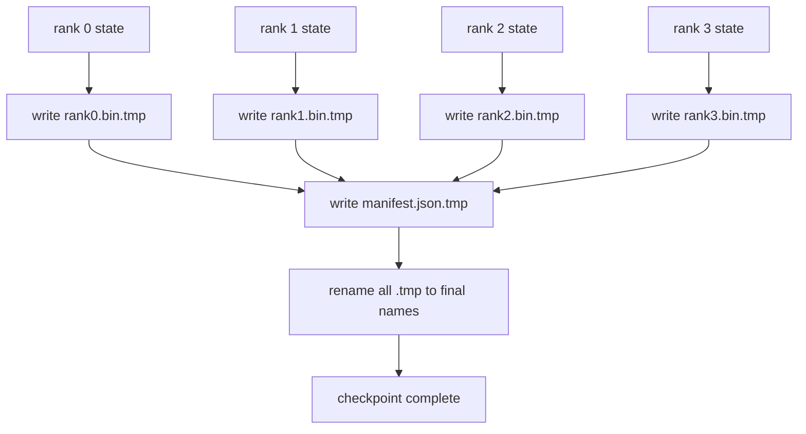

# 分片检查点与原子恢复

> 70B 参数的训练任务每隔几小时就被节点故障打断一次。检查点格式决定你损失 30 分钟还是 30 小时。分片检查点让每个 rank 的分片并行写盘,并用清单记录归属。恢复时每个 rank 从自己的文件载入自己的分片,在同一 world size 上重建状态,优化器继续 step,就像什么都没发生。原子写保证一个写了一半的检查点不会污染下一次恢复。

**类型:** 动手构建
**编程语言:** Python
**前置要求:** 第 19 阶段 Track C 第 42-49 课
**预计耗时:** 约 90 分钟

## 学习目标

- 把多 rank 检查点保存为逐 rank 分片文件,外加一份记录"哪个 rank 拥有什么"的清单。
- 使用原子写模式(先写临时路径再 rename),让写途中崩溃永远不会产出半个检查点。
- 从清单恢复,逐字节验证每个 rank 的 fp16 参数和 ZeRO 优化器状态。
- 能针对三种失败模式为清单 schema 辩护:world size 变化、分片数量不匹配、部分写入。

## 问题

朴素检查点把所有参数和优化器状态读到 rank 0,聚合,写一个单文件。对 70B 模型,那是 1.1 TB 状态挤过一个 rank 的网口。写入时其他所有 rank 干等聚合。IO 带宽是最慢那块 GPU 的网络链路,而不是聚合带宽。在真实集群上,"聚合再写"这一步可能比上一个训练小时还久,意味着任务一天都存不出一个检查点。

分片检查点把模式翻过来:每个 rank 并行写自己的分片文件。清单记录哪个 rank 拥有哪个分片,恢复时各归各位。聚合写带宽随集群规模伸缩。一个经单 rank 要写 4 小时的 1 TB 检查点,经 64 个 rank 只要 4 分钟。而且清单给了你一份对付不兼容恢复的契约:world size 变化可检测、部分写入可检测,载入路径可以大声报错,而不是悄悄用着过期数据。

## 概念



### 清单 schema

```json
{
  "world_size": 4,
  "step": 1234,
  "wall_clock_seconds": 4521,
  "shards": [
    {"rank": 0, "path": "rank0.bin", "sha256": "...", "param_shard_offset": 0, "param_shard_numel": 65536},
    {"rank": 1, "path": "rank1.bin", "sha256": "...", "param_shard_offset": 65536, "param_shard_numel": 65536}
  ],
  "schema_version": 1
}
```

三个字段是承重的。`world_size` 让在不同规模上的恢复大声失败,而不是悄悄损坏。逐分片 `sha256` 抓住部分或损坏的写入。逐分片的 `param_shard_offset` 和 `param_shard_numel` 让加载器把扁平参数张量在正确位置重建。

### 原子写

标准模式:每个分片写到 `<name>.tmp`,清单写到 `manifest.json.tmp`,各自 fsync,然后 rename。同一文件系统内的 POSIX rename 是原子的;要么新文件完整存在,要么旧文件还在。在最终 rename 之前崩溃,留在台面上的仍是上一个检查点。没有原子写,崩溃可能留下一个残缺分片,而清单还指着它,恢复时就把优化器状态载坏了。

### schema 必须防住的三种失败模式

| 失败 | 症状 | 防御 |
|---------|---------|---------|
| World size 变化 | 拿 N=4 的清单在 N=8 上恢复 | 清单里 world_size 不匹配,大声失败 |
| 分片数量不匹配 | 恢复时 rank*.bin 文件比清单里的分片少 | 枚举分片,逐一验证存在 |
| 部分写入 | 分片文件在 flush 中途被截断 | 载入时校验 sha256 |

每条防御都让坏载入尽早被拒;另一种结局是悄无声息的损坏,在 100 步之后 loss 变 NaN 时才浮出水面。

### 为什么逐 rank 文件,而不是一个大文件

通过 `O_APPEND` 并发写同一文件,在 POSIX 上对字节对齐的写入是可行的,但实践中同一分片内的偏移横跨 MB 级区域,锁开销会主导。逐 rank 文件没有竞争,还能在底层是并行文件系统(Lustre、GPFS)时吃到条带化红利。生产栈(DeepSpeed、FSDP、NeMo)全都用逐 rank 文件,原因正在于此。

```figure
ci-sharded-checkpoint
```

## 动手构建

`code/main.py` 实现了:

- `ShardManifest` dataclass:上面的 schema,外加 `to_json`/`from_json`。
- `save_sharded(state_dict_per_rank, dir, step)`:用原子"先临时再 rename"模式把每个 rank 的二进制状态写进各自文件,然后写清单。
- `load_sharded(dir, expected_world_size)`:读清单,校验每个分片的 sha256,返回逐 rank 状态字典。
- 往返测试:构建逐 rank 状态,保存,载入,断言逐字节相等。

运行:

```bash
python3 code/main.py
```

输出:4 个分片文件加清单写盘,然后重新载入并做逐字节验证。

## 野外的生产模式

三个模式把检查点加固到可交付程度。

**异步写。** 生产栈把检查点写盘放到独立线程或进程,训练继续。屏障在下一个检查点:上一个没写完,不许开始下一个。DeepSpeed 的 `async_io` 标志干的就是这件事。本课保持同步写,让步骤可见。

**先写本地快盘,再异步上传。** 先写本地 NVMe(快),再异步上传到 S3 或 GCS。两层模式让集群内检查点保持快速可恢复,同时把持久副本送出集群归档。清单携带本地路径;上传清单携带远端路径。

**轮转很重要。** 生产运行保留最近 K 个检查点(通常 3-5 个),轮转掉最旧的。不轮转,磁盘会在运行中途写满,下一个检查点失败。轮转时,下一次保存先删最旧的,腾出预算。

## 投入使用

生产中的样子:

- **DeepSpeed checkpointing。** `deepspeed.save_checkpoint(tag=step)` 写逐 rank 文件和一个指向当前 tag 的 `latest` 文件。
- **PyTorch FSDP checkpointing。** `torch.distributed.checkpoint` 保存分片状态,由 `Planner` 决定逐 rank 布局。
- **NeMo。** 把 DeepSpeed 和 FSDP 包在统一的 `save_to_checkpoint` API 下,附带元数据。

## 交付

第 81 课为端到端 DDP+ZeRO 运行保存分片检查点,并在同一 world size 上重载,证明恢复契约成立。

## 练习

1. 加异步写:在线程里发起保存,训练继续。上一个保存完成前,阻塞下一个。
2. 加 `last_5_steps` 轮转:保留最近 5 个检查点,保存新检查点前先删最旧的。
3. 为内层循环重载加仅 CRC 的快速验证路径(轮转把一个检查点扶正为新的活跃检查点时,不做完整 sha256)。
4. 加跨 world size 载入:读清单、拼接、重新分片,把分片从 N=4 再平衡到 N=8。
5. 加上传到假 S3(第二个目录)并写上传清单。为两层存储策略辩护。

## 关键术语

| 术语 | 大家嘴里的说法 | 实际含义 |
|------|----------------|----------|
| 分片检查点 | "逐 rank 保存" | 每个 rank 并行写自己的分片文件 |
| 清单 | "索引" | 记录分片路径、偏移和 sha256 的 JSON 文件 |
| 原子写 | "先 tmp 再 rename" | 先写 .tmp 再 POSIX rename,崩溃时旧文件仍在台面 |
| 部分写入 | "截断的分片" | 写途中崩溃产出损坏分片;sha256 能抓住 |
| 轮转 | "保留最近 K 个" | 写新检查点前先删最旧的,约束磁盘用量 |

## 延伸阅读

- [DeepSpeed checkpointing](https://deepspeed.readthedocs.io/en/latest/model-checkpointing.html)
- [PyTorch torch.distributed.checkpoint](https://pytorch.org/docs/stable/distributed.checkpoint.html)
- [POSIX rename 原子性](https://pubs.opengroup.org/onlinepubs/9699919799/functions/rename.html)
- 第 19 阶段第 78 课 —— 本检查点要保存的 ZeRO 状态
- 第 19 阶段第 81 课 —— 端到端演示往返保存的状态
