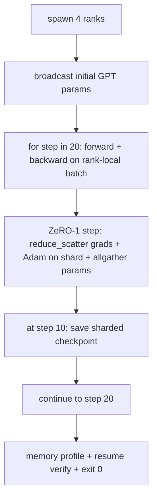

# 端到端分布式训练

> 第 76 到 80 课各造了一个零件。这一课是总装:一个小型 GPT,跨 4 个模拟 rank 训练,DDP 管梯度同步,ZeRO-1 管优化器状态分片,中点落一个分片检查点。演示跑 20 步、自行结束,打印 loss 曲线和内存画像,并写出可恢复的检查点。

**类型:** 动手构建
**编程语言:** Python
**前置要求:** 第 19 阶段 Track C 第 42-49 课
**预计耗时:** 约 90 分钟

## 学习目标

- 把 DDP(第 77 课)、ZeRO-1(第 78 课)和分片检查点(第 80 课)组合进一条训练循环。
- 在小型合成语料上跨 4 个模拟 rank 训练一个 2 层 Transformer 语言模型,跑 20 步。
- 打印逐步 loss 表、逐 rank 内存画像,以及一份能在同一 world size 上逐字节恢复的 checkpoint 清单。
- 能为这个组合辩护:每个零件在先前课程里独立可测,本课证明它们能组合。

## 问题

结课项目就是零件能拼起来的证明。第 76 课实现了集合通信。第 77 课把它们包成 DDP。第 78 课用 reduce_scatter 分片优化器状态。第 79 课分析流水线。第 80 课保存分片检查点。每课都自带测试、独立成立。真实训练运行会同时用上每个原语;组合错了,loss 发散、检查点拒绝恢复,或逐 rank 内存该降反升。

本课跑端到端演示并验证四个不变量:(a) 20 步内 loss 在浮点噪声范围内单调下降;(b) 每步每个 rank 的参数范数相同;(c) 逐 rank 优化器内存等于 ZeRO-1 公式 12P/N 字节;(d) 第 10 步的检查点在重启时逐字节重载。演示自行结束:20 步、一条命令、退出码 0。

## 概念



### 迷你 GPT

模型刻意做小:2 个 Transformer 块,embed 维度 32,4 个注意力头,词表 64,序列长 16,批次 4。几千个参数。大到足以检验每个接线决策(多头注意力走标准掩码路径;LayerNorm 有权重要同步;LM head 是回到词表的独立线性投影),小到 4 个 CPU rank 上 20 步几秒跑完。

### 组合规则

| 课程零件 | 它拥有什么 | 留给循环什么 |
|--------------|--------------|----------------------------|
| DDP 广播 | 初始参数同步 | 构造时调一次 |
| ZeRO-1 step | 梯度同步、主副本更新、参数广播 | 每步调一次,替代 optimiser.step |
| 分片检查点 | 持久化逐 rank 状态,带 sha256 的清单 | 在 rank 0 上调用,状态经 allgather 收集 |
| 训练循环 | 前向、反向、loss 日志 | 按顺序调用上面三者 |

循环不需要知道 reduce_scatter 或 rendezvous 文件。ZeRO 和检查点模块暴露窄接口,由循环组合。

### 为什么是迷你 GPT 而不是 MLP

第 77 课的 MLP 足以验证梯度同步。迷你 GPT 多加三样东西:词表上的独立 LM head(本课为清晰起见不共享权重;完整 GPT 通常把 head 与 token 嵌入绑定)、softmax+交叉熵作为 loss(比 MSE 更多数值边界情况),以及非对称前向(嵌入,然后每层注意力加 MLP)。结课项目继续用 MLP 的话,就掩盖了组合能否正确处理 LayerNorm 或嵌入层梯度形状的问题。

### 自行结束意味着退出码 0

循环跑固定 20 步然后退出。没有 `while True`,没有人工干预,不从外部状态恢复。一个可以放着不管、结束后看到完整日志的结课项目,才证明了系统接线正确。任何零件死锁,演示就不会返回,测试装置会抓住它。

```figure
ci-distributed-assembly
```

## 动手构建

`code/main.py` 实现了:

- `MiniGPT`:2 层 Transformer,带掩码自注意力和独立 LM head。
- `make_corpus(seed, total_tokens)`:确定性的下一 token 预测数据。
- `_train_worker`:按 rank spawn;广播初始参数,跑循环,调 ZeRO step,在第 10 步写分片检查点。
- `verify_resume`:主跑结束后,在进程内重载第 10 步检查点,断言保存的主副本分片与内存快照逐字节一致。
- `main`:编排整个演示,打印 loss 表、内存画像和验证结果。

运行:

```bash
python3 code/main.py
```

输出:20 行 loss 表、4 行逐 rank 内存画像、一份检查点清单,以及成功时的一行 "RESUME VERIFIED"。

## 野外的生产模式

三个模式为真实运行补全这个组合。

**每 K 分钟存一次检查点,而不是每 K 步。** 步长时间随序列长和微批次数变化。10 分钟的检查点节奏,不管模型多大都抓住同样的计算量。本课为简单按步数;生产按墙上时钟。

**尽早发现发散。** 生产运行在反向后加 NaN 守卫和 loss 尖峰检测器;loss 单步跳变超过 2 倍,就回滚到上一个检查点,而不是放任优化器走向退化状态。本课的 loss 曲线平滑,守卫用不上,但钩子留着。

**跨 rank 聚合内存画像。** 真实运行中逐 rank 内存各不相同(持最大流水线 stage 的 rank 激活更多)。生产记录跨 rank 的最大值加均值;本课打印逐 rank,展示公式吻合。

## 投入使用

生产中的样子:

- **DeepSpeed。** 把 DDP + ZeRO + 流水线 + 激活检查点组合在一个配置下。本课的组合就是微缩版 DeepSpeed 形状。
- **PyTorch FSDP。** 原生等价物。`FullyShardedDataParallel` 配 `ShardingStrategy.SHARD_GRAD_OP` 即 ZeRO-2。
- **NeMo 和 Megatron-LM。** 最大的模型再加张量并行;其余组合形状相同。

## 交付

整条 track 到此结束。6 课合起来,就是一个真实团队在采用 DeepSpeed 之前会自建的那个分布式训练子系统;抽象已对照 gloo 验证,失败模式已逐一演练。第 17 阶段(基础设施与生产)是把它搬上真实集群的地方。

## 练习

1. 加注意力头的张量并行切分,验证 loss 与单 rank 基线一致。两个 rank:每 rank 一半头,注意力输出做 allreduce。
2. 加跨 4 个微批次的梯度累积,证明梯度等于一个大 batch 的梯度。
3. 加"从第 10 步恢复"路径,真正继续训练到第 20 步,并产出与原始运行相同的最终 loss。
4. 加指标导出(loss、梯度范数、步长时间)到 JSONL,便于事后可视化。
5. 加 NaN 守卫:loss 尖峰时回滚到上一个检查点;用单步学习率倍增器强制制造尖峰,演练回滚。

## 关键术语

| 术语 | 大家嘴里的说法 | 实际含义 |
|------|----------------|----------|
| 端到端 | "全接起来" | 一次运行组合所有零件,而不是每个零件一个单元测试 |
| 内存画像 | "每 rank 多少 GB" | 每个 rank 上参数、梯度、优化器状态占的字节 |
| 恢复契约 | "存了能载" | 检查点往返后逐 rank 状态逐字节相等 |
| 自行结束 | "有界运行" | 固定步数,完成退出码 0,无人类在环 |

## 延伸阅读

- [DeepSpeed 端到端训练教程](https://www.deepspeed.ai/getting-started/)
- [PyTorch FSDP 进阶教程](https://pytorch.org/tutorials/intermediate/FSDP_advanced_tutorial.html)
- [Megatron-LM 训练脚本参考](https://github.com/NVIDIA/Megatron-LM)
- 第 19 阶段第 76-80 课 —— 本课组合的每个零件
- 第 17 阶段 —— 把组合搬上真实集群
