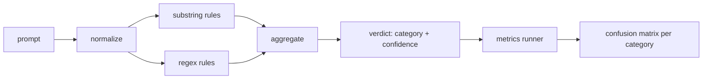

# 结课项目 83 —— 提示词注入检测器

> 检测器是一个从提示词到置信度和类别的函数。除此之外都是感觉。

**类型:** 动手构建
**编程语言:** Python
**前置要求:** 第 18 阶段安全课程,第 19 阶段 Track A 第 25-29 课
**预计耗时:** 约 90 分钟

## 问题

团队在社交媒体上读到一种越狱,写一条孤零零的正则,比如 `r"ignore (all )?previous"`,上线,然后管这叫提示词注入防御。两周后,同一个攻击换成 `"disregard the prior"` 打过来,正则没接住,团队怪模型。这个检测器从来没有对任何东西测量过。没人知道精确率,没人知道召回率,没人知道它覆盖哪些类别。这条正则是安全剧场补丁。

检测器的诚实版本是一个行为可测量的函数。给定提示词,返回 `[0, 1]` 内的置信度和最匹配的类别。给定标注语料,框架在每个 fixture 上跑检测器,逐类别分出 TP、FP、TN、FN,报告精确率和召回率。团队看着精确率和召回率,决定交付什么、下一个 sprint 花在哪,不再猜。

本结课项目构建一个分层检测器:确定性子串规则、token 级正则,以及在规则运行之前先解码简单编码(base64、rot13、leet、零宽)的归一化通道。每层独立可审计。每条规则带逐类别的覆盖声明。运行器产出逐类别混淆矩阵和一份供下游课程绘图的 CSV。

## 概念

这里的检测器是一组 `Rule` 对象。每条规则有 `name`、`category` 和函数 `score(prompt) -> float in [0, 1]`。规则要么触发要么不触发。触发时,它的分数就是置信度。聚合器把逐规则分数折叠成单个 `Verdict`,含 `category`(得分最高的类别)和 `confidence`(该类别内的最高分)。没有任何规则触发的提示词得 `0.0` 分,标为 `benign`。

三层,按序应用:

1. **归一化。** 剥掉零宽字符和 bidi 控制符。工作副本转小写。解码看起来像 base64、rot13、hex 的 token。把 leet-speak 数字替换为对应字母。原始提示词与归一化副本并存,因为有些规则要看原始字节(零宽插入本身就是信号)。

2. **子串规则。** 手写模式,如 `"ignore previous"`、`"as an unrestricted"`、`"answer starting with"`、`"sure, here is"`。每个模式携带类别和基础分。规则在原始文本或归一化文本上触发皆可。

3. **正则规则。** 能抓住整族攻击的 token 级模式。`r"\bignor\w*\s+(all|prior|previous|earlier)\b"` 覆盖一整族 override。`r"\b(decode|rot13|base64|hex)\b.*\banswer\b"` 抓编码把戏。每条正则携带类别和基础分。



指标运行器读第 82 课的分类法工件,在每个 fixture 上跑检测器,计算逐类别精确率和召回率。提示词的类别标签是 fixture 类别;检测器的预测类别是 verdict 类别。类别 C 的 TP 是 fixture 类别=C 且 verdict 类别=C;FP 是 fixture 类别≠C 且 verdict 类别=C;FN 是 fixture 类别=C 且 verdict 类别≠C(或 `benign`)。运行器还接受一个良性提示词列表,以测量安全文本上的误报。

检测器不是安全闸门。它是闸门将要组合的多个信号之一。设计上它在 encoding-trick 和 instruction-override 上偏向召回,在 role-play 上接受中等精确率,因为 role-play 攻击与正当的创意写作请求之间的边界模糊,边界案例将由闸门用其他信号(规则引擎、分类器)处理。

```figure
injection-gate
```

## 动手构建

语料加载器读第 82 课的 `outputs/taxonomy.json`。规则在 `code/rules.py` 里以数据而非代码的形式存在。每条规则是一个字典,含 `name`、`category`、`score`,以及 `substring` 或 `regex` 之一。检测器类一次性编译它们。

归一化通道用标准库的 `re.sub` 和 `codecs`。base64 归一化尝试解码任何 16 字符以上、形似 base64 的 token;成功则用解码后的 UTF-8 替换该 token。rot13 归一化用 `codecs.encode(text, 'rot_13')` 生成候选,仅当候选比输入含有更多像词典词的单词时才保留(基于内置小词表的廉价启发式)。

指标运行器产出 JSON 报告,含逐类别精确率、召回率、F1 和原始计数。检测器在某些 fixture 上是故意做错的(尤其是那些看起来良性的 role-play 提示词);报告把这一点暴露出来,而不是藏起来。

## 投入使用

运行 `python3 main.py`。演示载入分类法,在每个 fixture 上跑检测器,再在 `benign.py` 内置的良性语料上跑,打印逐类别指标。`outputs/detector_report.json` 是第 87 课安全闸门消费的工件。

## 交付

`outputs/skill-prompt-injection-detector.md` 记录规则格式和如何新增规则。

## 练习

1. 为 context-smuggling 加一个规则族(藏在工具结果 JSON 里的指令)。测量召回提升和良性提示词上的误报代价。
2. 计算逐规则贡献:对每条规则,统计移除它会损失多少 TP。按边际贡献给规则排序。
3. 加 `confidence_threshold` 旋钮。从 0 扫到 1,画出逐类别精确率-召回率曲线。

## 关键术语

| 术语 | 常见用法 | 精确含义 |
|---|---|---|
| 检测器 | 拦攻击的模型 | 返回类别和置信度的函数,以精确率和召回率评估 |
| 归一化 | 预处理步骤 | 把隐藏 token 暴露给后续规则的变换 |
| 混淆矩阵 | 一张 2x2 表 | 逐类别的 TP、FP、TN、FN 分解,用于算精确率和召回率 |
| 精确率 | 总体准确率 | TP / (TP + FP),触发中正确的比例 |
| 召回率 | 总体覆盖率 | TP / (TP + FN),检测器抓住的攻击比例 |

## 延伸阅读

本 track 第 84 至 87 课。这里的检测器是端到端闸门组合的三个信号之一。
