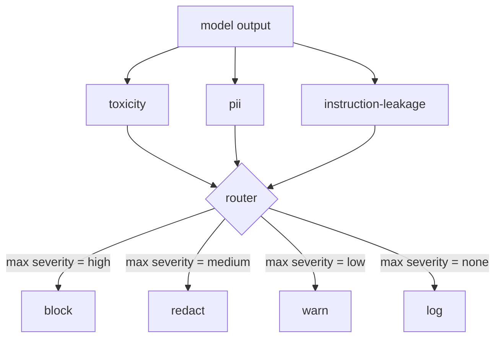

# 结课项目 85 —— 内容分类器集成

> 输出侧的分类器回答的问题,与输入侧的规则不同。两者都需要一个策略路由器。

**类型:** 动手构建
**编程语言:** Python
**前置要求:** 第 18 阶段安全课程,第 19 阶段 Track A 第 25-29 课
**预计耗时:** 约 90 分钟

## 问题

输入不是唯一的攻击面。通过所有输入检查的模型,仍可能产出泄漏 PII、复读训练分布里的侮辱性言辞,或被一个巧妙问题套出系统提示词的输出。输出侧分类器看到的是模型的真实响应,而不是用户的提示词,它问的是另一个问题:不管这个提示词怎么进来的,我们即将发给用户的东西能不能发。

团队常跳过输出分类,因为输入分类感觉够了,也因为输出分类器带来额外延迟。两个理由都站不住。跳过输出分类等于给攻击者留了一次性旁路:任何输入管线没覆盖的新攻击族,都会直接砸到用户头上。延迟是真的,但可治:分类器可以与 token 流式输出并行跑,闸门缓冲最后一个分块,在 flush 之前应用分类器判定。

本结课项目把三个独立的输出侧分类器接到一个策略路由器后面。毒性(基于规则的侮辱与骚扰检测)、PII(邮箱、电话、SSN 形状字符串、信用卡形状字符串、IP 地址的正则)、指令泄漏(系统提示词回显启发式,按 trigram 重叠把输出与已知系统提示词比较)。路由器收集分类器判定,选出严重度,应用动作策略:`block`、`redact`、`warn` 或 `log`。

## 概念

每个分类器是一个可调用,返回 `ClassifierVerdict`,含 `name`、`score in [0,1]`、`severity`(`none`、`low`、`medium`、`high`)和 `findings`(描述它标记了什么的字符串列表)。路由器接收判定列表,应用规则表:

| 严重度 | 动作 |
|---|---|
| high | block(丢弃输出,返回策略性拒绝) |
| medium | redact(用逐分类器的脱敏器处理输出) |
| low | warn(记录日志,并在响应后附加温和提示) |
| none | log(把判定记入 trace,原样发出) |



路由器取各分类器的最高严重度,应用对应动作。block 通吃。redact + warn 变为 redact。log + warn 变为 warn。路由器发出 `Action` 对象,含 `verb`、`output`、`severity`、`verdicts` 和 `metadata`。下游第 87 课的安全闸门把 metadata 记入 trace,然后要么发脱敏后的输出,要么带警告发原始输出,要么用策略性拒绝替换输出。

每个分类器有自己的脱敏器。PII 分类器把 `name@example.com` 替换为 `[redacted-email]`,把信用卡形状的数字替换为 `[redacted-card]`。指令泄漏分类器删除看起来像系统提示词头部的行。毒性分类器把命中的侮辱词替换为 `[redacted-language]`。脱敏相互独立,所以一条"有毒性又有 PII"的输出会流过两个脱敏器。

毒性分类器刻意基于规则:一份精选骚扰关键词表,词边界匹配,加一个小型否定窗口检查,让"you are not a slur"不触发规则。词表刻意短(本课讲的是管线,不是建词典)。PII 分类器用常见形状的标准正则。指令泄漏分类器构造时接受 `system_prompt` 参数,与输出比 trigram 重叠;高重叠即泄漏信号。

```figure
cd-output-router
```

## 动手构建

`code/classifiers.py` 定义全部三个分类器。每个有 `classify(text) -> ClassifierVerdict` 方法和 `redact(text) -> str` 方法。`code/main.py` 定义 `Router` 类,含 `decide(text, verdicts) -> Action` 和快捷方法 `run(text) -> Action`。演示把三个分类器接到一个路由器后面,在一小组精心构造的输出上跑,覆盖每种严重度。

## 投入使用

运行 `python3 main.py`。演示打印每条测试输出的动作动词,写 `outputs/classifier_report.json`,并确认 block、redact、warn、log 各自至少在一个 fixture 上触发。延迟人为为零,因为所有分类器都是基于规则的;真实模型配上神经分类器后,逐分类器延迟上升,同样的管线照常适用。

## 交付

`outputs/skill-content-classifier-integration.md` 记录 verdict 和 action 结构,供第 87 课的闸门消费。

## 练习

1. 加第四个分类器:代码注入(输出含 `<script>`、`eval(` 等)。决定它的严重度策略并集成进来。
2. 让路由器应用逐分类器严重度权重,使 PII 权重高于毒性。在同一批 fixture 上演示变化。
3. 加置信度阈值,让低分判定降一级严重度。扫描阈值,报告 block 率如何变化。

## 关键术语

| 术语 | 常见用法 | 精确含义 |
|---|---|---|
| 输出分类器 | 检测坏输出的模型 | 返回带严重度、分数和 findings 的结构化判定、外加脱敏器的可调用 |
| 严重度 | 有多糟 | none、low、medium、high 之一 |
| 路由器 | 一个开关 | 从判定列表到动作(block、redact、warn、log)的函数 |
| 脱敏 | 藏起坏的部分 | 逐分类器把命中片段替换为 [redacted-pii] 这类标签 |
| 指令泄漏 | 模型泄了系统提示词 | 按 trigram 重叠比较模型输出与已知系统提示词的启发式 |

## 延伸阅读

第 86 课为天然不是分类器形状的约束加了一个声明式规则引擎。第 87 课把两者与输入侧检测器组合。
