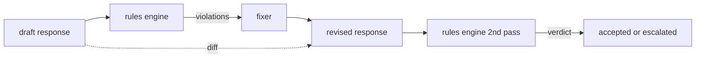

# 结课项目 86 —— 宪法式规则引擎

> 一条规则是一个名字、一个谓词和一段解释。缺了其中任何一样,就是感觉,不是规则。

**类型:** 动手构建
**编程语言:** Python、YAML
**前置要求:** 第 18 阶段安全课程,第 19 阶段 Track A 第 25-29 课
**预计耗时:** 约 90 分钟

## 问题

分类器覆盖可识别的失败。规则引擎覆盖契约性的约束。写编程助手的团队想要这样的约束:"每个包含代码的响应,必须以可运行代码块或明确声明的假设结尾。"运营客服机器人的团队想要"每次拒绝都必须给出下一步"。这些约束不是天然的分类器目标。它们是关于响应、对话和系统策略的谓词,而且要能让非工程师读懂。

诚实的表示形式是声明式文件。宪法以 YAML 的形式与代码放在一起,进版本控制,走独立评审流程。每条规则有 `name`、`predicate`、`severity` 和 `explanation` 模板。引擎载入文件,对候选输出逐条评估规则,为每条触发的规则返回结构化 `Violation`。本结课项目的规则引擎用 `all_of`、`any_of`、`not_` 组合谓词,单条规则就能表达"如果响应包含代码,它必须以可运行代码块结尾,且不引用内部专用库"。

本课的另一半是修订。只会拦截的规则引擎只建了一半。能提出修复的规则引擎才有运维用处:助手起草响应,引擎标出违规,fixer 产出修订响应,引擎确认修订满足规则。本课附带一个最小 fixer(逐规则正则替换)和草稿与修订之间的结构化 diff(逐行的增、删、改)。

## 概念



规则的形状:

```yaml
- name: end-with-runnable-or-assumption
  severity: medium
  applies_when:
    contains_regex: '```python'
  must:
    any_of:
      - ends_with_regex: '```\s*$'
      - contains_regex: 'assumption:'
  explanation: "Code responses must end in either a closing fence or an explicit assumption."
  fix:
    append_if_missing: "\n\nAssumption: example inputs are valid."
```

谓词是原子的:`contains_regex`、`not_contains_regex`、`ends_with_regex`、`starts_with_regex`、`max_words`、`min_words`。组合子是 `all_of`、`any_of`、`not_`。引擎先评估 `applies_when`;规则不适用时,违规记为 `not_applicable`。否则引擎评估 `must`,产出 `pass` 或 `violation`。

严重度为 `low`、`medium`、`high`,与第 85 课一致。下游闸门(第 87 课)把 `high` 规则违规视同 `high` 分类器判定:block。

fixer 是一组声明式操作:`append_if_missing`、`prepend_if_missing`、`replace_regex`。每个操作按规则名映射到一个变换。fixer 刻意限于局部编辑;结构性重写属于单独的"拒绝并引导"层,不在本课范围。

diff 在原始稿与修订稿之间计算。它是 `Change` 记录的列表,含 `op`(add、remove、edit)和相关文本。下游闸门可以记录 diff,让人类评审者随时间审计 fixer 的行为。

```figure
cd-constitution-loop
```

## 动手构建

`code/rules.yml` 存放宪法。`code/main.py` 里的加载器接受 YAML 文件(有 PyYAML 时)或 JSON 文件(内置)。本课附带的 `rules.yml` 会被课程测试用两条代码路径分别解析。`code/main.py` 定义 `Engine` 和 `Fixer` 类以及一个 `diff` 函数。组合式递归求值,`any_of` 带短路。

随课附带的宪法:

- `no-empty-refusal`(medium)—— 拒绝必须包含建议或转介
- `end-with-runnable-or-assumption`(medium)—— 代码响应必须干净收尾
- `no-pii-in-examples`(high)—— 示例数据不得包含邮箱或电话形状
- `cite-when-asserting-fact`(low)—— 以 "According to" 开头的行必须含括号引用
- `no-internal-library-leak`(high)—— 输出中不得出现 `internal-only` 和 `policybot-internal` 字样
- `bounded-length`(low)—— 响应不得超过 800 词

## 投入使用

`python3 main.py`。演示把三份草稿响应过一遍引擎,打印违规,跑 fixer,打印 diff,写 `outputs/rules_report.json`。有一个 fixture 的规则不适用(草稿里没有代码块),报告中该规则显示 `not_applicable`,团队由此看到引擎显式评估过它。

## 交付

`outputs/skill-constitutional-rules-engine.md` 记录规则语法和 fixer 操作。

## 练习

1. 加一条规则:当提示词提到 safety 时,要求每个响应包含短语 "If this is urgent"。使用组合式。
2. 把正则 fixer 换成带命名槽位的模板 fixer。演示一条规则在新设计下的重写。
3. 加一个指标端点:给定一组草稿语料,返回逐规则违规率,让团队看出哪条规则开火过度。

## 关键术语

| 术语 | 常见用法 | 精确含义 |
|---|---|---|
| 宪法 | 一份含糊的策略文档 | 带谓词、严重度和解释的规则 YAML 文件 |
| 谓词 | 一次检查 | 从文本到 bool 的可调用,原子或经 all_of/any_of/not_ 组合 |
| 违规 | 一次失败 | 带规则名、严重度、解释和命中片段的结构化记录 |
| fixer | 一次模型微调 | 把草稿映射为修订稿的确定性逐规则变换 |
| diff | 一次字符串比较 | 草稿与修订稿之间的 add、remove、edit 操作结构化列表 |

## 延伸阅读

第 87 课把本引擎与输入侧检测器、输出侧分类器组合成单一安全闸门。
