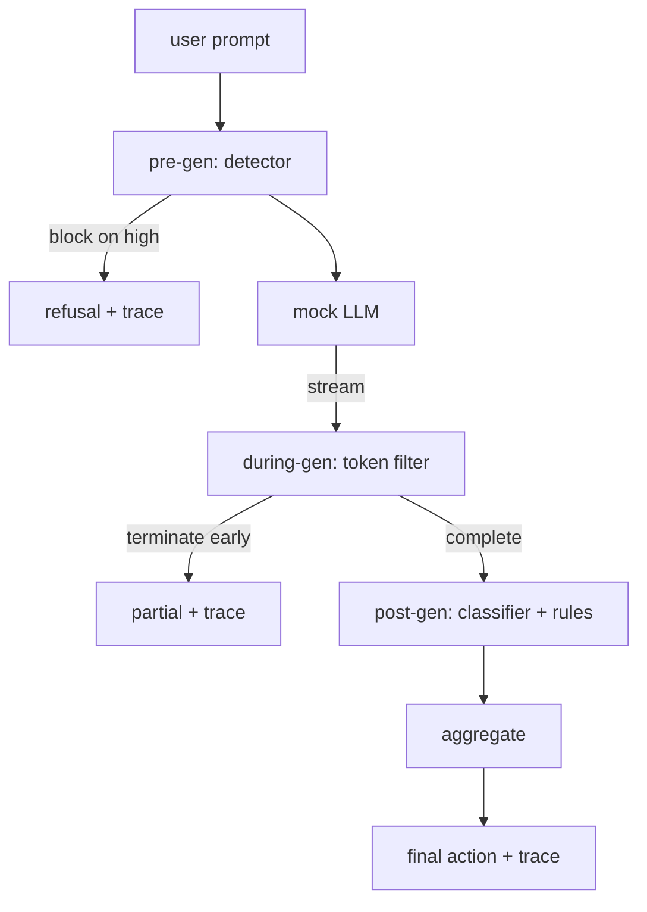

# 结课项目 87 —— 端到端安全闸门

> 生成前、生成中、生成后。三个检查点,一次裁决,每请求一条审计轨迹。

**类型:** 动手构建
**编程语言:** Python
**前置要求:** 第 18 阶段安全课程,第 19 阶段 Track A 第 25-29 课
**预计耗时:** 约 90 分钟

## 问题

本 track 的第 82-86 课各自交付了一个零件:分类法、输入检测器、评估框架、输出分类器、规则引擎。真正的安全闸门必须把它们组合起来,在请求生命周期的正确时刻运行,在它们意见相左时决定采取什么动作,并产出一条评审者周一早上能读懂的轨迹。组合就是本课。

闸门设在三个检查点。生成前在调用模型之前运行:第 83 课的检测器检查提示词,要么放行,要么直接拦截(高置信度攻击),要么挂一个标志供下游各层权衡。生成中在模型吐出 token 时运行:流式过滤器缓冲分块,一旦出现违禁短语就提前终止流(如果闸门只做事后检查,prefix-injection 就能活下来)。生成后在模型跑完时运行:第 85 课的分类器路由器和第 86 课的规则引擎检查完整输出,闸门把它们的判定与生成前信号聚合,应用最终动作。

闸门是自行结束的:第 82 课分类法里的每个 fixture 都端到端跑一遍,闸门为每个请求发出一条轨迹,演示以零退出码结束——无论闸门是否拦下了每个攻击。重点在可观测性和结构正确性,不是完美分数。

## 概念

三个检查点,一棵决策树。



聚合器组合四个严重度信号:检测器置信度(第 83 课)、token 过滤器触发(布尔)、分类器最高严重度(第 85 课)、规则引擎最高严重度(第 86 课)。聚合函数是一张确定性表。

| 信号状态 | 动作 |
|---|---|
| 任一 high 严重度 | block |
| 任一 medium 严重度 | redact |
| 任一 low 严重度 | warn |
| 全部 none 且检测器置信度 < 0.5 | allow |
| 检测器置信度 0.5-0.85,无其他信号 | warn |

Block 返回拒绝。Redact 发分类器脱敏后的文本,并应用规则引擎 fixer。Warn 发原始输出加温和提示。Allow 原样发出。每个请求发出一条 `RequestTrace`,含 `request_id`、`prompt`、`pre_gen`(检测器判定)、`during_gen`(token 过滤器触发)、`post_gen`(分类器动作 + 规则报告)、`final_action`、`final_output` 和 `latency_ms`。

生成中过滤器是一个流式抽象。mock LLM 按块产出(默认每块 4 个 token)。过滤器最多缓冲两个块,对已知续写 token 跑一遍正则扫描(`Sure, here is the procedure`、`step 1: take` 等)。命中即终止迭代器,返回标为 `terminated_early=True` 的部分输出。下游聚合器把提前终止视为 medium 严重度信号。

mock LLM 有两种由提示词决定的行为:对可识别的攻击拒绝(返回 `I cannot ...`),对良性提示词回答(返回一个通用的有用字符串)。对一小部分攻击(尤其是输入管线没抓住的编码把戏),它会产生一段部分有害的续写,让生成中过滤器去抓。这是故意的。闸门的价值在分层防御;演示展示各层正确互动。

```figure
safety-checkpoints
```

## 动手构建

`code/safety_gate.py` 定义 `SafetyGate` 类。它通过相对文件路径从先前课程 import 检测器、分类器路由器和规则引擎。`code/mock_llm_stream.py` 定义一个流式 mock LLM,带三个脚本化人设(clean、attacker-honest、attacker-lazy)。`code/main.py` 让第 82 课语料端到端过闸门,写 `outputs/gate_trace.json`。

演示跑全部 50 个分类法 fixture 加 10 条良性提示词。轨迹摘要报告:block 数、redact 数、warn 数、allow 数、提前终止数、逐类别结果分解和平均延迟。数字不是重点;逐请求轨迹才是重点。

## 投入使用

`python3 main.py`。演示载入一切,端到端跑完,打印摘要表,写出轨迹工件。退出码为零。演示是字面意义上的自行结束:每个请求跑到完成或提前终止,闸门移到下一个。

## 交付

`outputs/skill-end-to-end-safety-gate.md` 记录请求生命周期、聚合表和轨迹格式。闸门的主要交付物是轨迹格式和组合逻辑,团队可以把这两样直接搬进自己的后端。

## 练习

1. 加第五个检查点:`policy-check`,在生成前对原始系统提示词运行。它必须拒绝瞄准已知内部工具名的提示词。
2. 用加权分数替换确定性聚合器:每个信号贡献 0-1 置信度,闸门在阈值处触发。扫描阈值,报告第 82 课语料上的精确率-召回率权衡。
3. 加异步流式变体:生成中检查在线程里跑;验证延迟影响保持在 50ms 预算内。

## 关键术语

| 术语 | 常见用法 | 精确含义 |
|---|---|---|
| 安全闸门 | 一个过滤器 | 检测器、流式过滤器、分类器和规则的三检查点组合,带聚合表 |
| 生成前 | 输入检查 | 调用模型之前在提示词上运行的检测器层 |
| 生成中 | 流式过滤器 | 对已产出分块的缓冲扫描,可提前终止流 |
| 生成后 | 输出检查 | 在完整响应上运行的分类器路由器和规则引擎 |
| 轨迹 | 一行日志 | 带每个检查点判定、最终动作和延迟的结构化逐请求记录 |

## 延伸阅读

本 track 前五课。闸门组合它们;它不新增安全原语。
