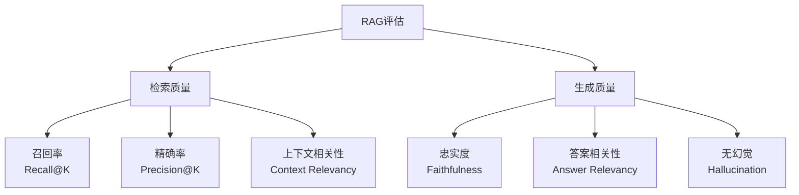

# RAG 评估体系建设

RAG 系统的"感觉不错"不等于真的好用。本文建立系统性评估体系，用数据驱动 RAG 优化迭代。

## 1. 为什么需要评估

RAG 系统常见问题：
- **召回不到**：用户问"退款政策"，但相关文档在"售后服务"章节里
- **召回太多**：返回了 10 个片段，其中 8 个不相关，LLM 被干扰
- **答案幻觉**：LLM 没有基于检索内容回答，而是凭自己"知识"编造

不建立评估体系，这些问题会被忽视直到用户投诉。

## 2. 核心评估维度



| 指标 | 含义 | 计算方式 |
|------|------|---------|
| **Context Recall** | 相关文档被检索到的比例 | 正确检索数 / 总相关文档数 |
| **Context Precision** | 检索结果中相关文档的比例 | 相关检索数 / 总检索数 |
| **Faithfulness** | 答案是否基于检索内容，无幻觉 | LLM 判断 statements 是否在 context 中有支持 |
| **Answer Relevancy** | 答案是否回答了问题 | 问题 embedding 与答案 embedding 的相似度 |

## 3. Ragas 框架快速上手

```bash
pip install ragas datasets
```

### 构建测试数据集

```python
from datasets import Dataset

# 测试数据集：问题 + 标准答案 + 检索结果 + 生成答案
eval_data = {
    "question": [
        "产品的退款政策是什么？",
        "如何重置密码？",
        "支持哪些支付方式？",
    ],
    "answer": [
        "购买后7天内可申请全额退款，需保持商品完好...",
        "点击登录页的「忘记密码」按钮，输入注册邮箱...",
        "支持微信支付、支付宝、银行卡和信用卡...",
    ],
    "contexts": [
        # 每个问题对应的检索到的文档片段列表
        ["退款政策：购买后7天内可申请退款...", "注意：虚拟商品不支持退款..."],
        ["密码重置：访问登录页面...", "安全提示：重置后请及时修改..."],
        ["支付方式：我们支持微信支付...", "企业用户可申请对公转账..."],
    ],
    "ground_truth": [
        # 标准参考答案（用于计算召回率）
        "7天无理由退款，保持商品完好",
        "通过注册邮箱重置密码",
        "微信、支付宝、银行卡",
    ]
}

dataset = Dataset.from_dict(eval_data)
```

### 运行评估

```python
from ragas import evaluate
from ragas.metrics import (
    faithfulness,
    answer_relevancy,
    context_recall,
    context_precision,
)
from langchain_openai import ChatOpenAI, OpenAIEmbeddings

# 配置评估用的 LLM（与 RAG 系统的 LLM 可以不同）
llm = ChatOpenAI(model="gpt-4o")
embeddings = OpenAIEmbeddings(model="text-embedding-3-small")

result = evaluate(
    dataset,
    metrics=[
        faithfulness,       # 忠实度：答案有无幻觉
        answer_relevancy,   # 答案相关性：是否回答了问题
        context_recall,     # 召回率：相关文档是否都检索到了
        context_precision,  # 精确率：检索结果有多少是相关的
    ],
    llm=llm,
    embeddings=embeddings,
)

print(result)
# {'faithfulness': 0.92, 'answer_relevancy': 0.88, 
#  'context_recall': 0.85, 'context_precision': 0.76}
```

### 查看详细结果

```python
import pandas as pd

df = result.to_pandas()
print(df[["question", "faithfulness", "answer_relevancy"]].to_string())

# 找出问题最多的样本
worst = df.nsmallest(3, "faithfulness")
for _, row in worst.iterrows():
    print(f"问题: {row['question']}")
    print(f"忠实度: {row['faithfulness']:.2f}")
    print(f"答案: {row['answer'][:100]}\n")
```

## 4. 自动生成测试集

手工标注测试集代价高，用 LLM 自动生成。

```python
from ragas.testset import TestsetGenerator
from ragas.testset.evolutions import simple, reasoning, multi_context
from langchain_community.document_loaders import DirectoryLoader

# 加载文档
loader = DirectoryLoader("./docs", glob="**/*.md")
documents = loader.load()

# 生成测试集
generator = TestsetGenerator.with_openai()
testset = generator.generate_with_langchain_docs(
    documents,
    test_size=50,
    distributions={
        simple: 0.5,        # 简单直接问题
        reasoning: 0.3,     # 需要推理的问题
        multi_context: 0.2, # 跨文档的问题
    }
)

# 保存
testset.to_pandas().to_csv("testset.csv", index=False)
```

## 5. 持续评估流水线

```python
# eval_pipeline.py — 集成到 CI/CD
import json
from datetime import datetime
from pathlib import Path

class RAGEvaluationPipeline:
    def __init__(self, rag_system, eval_dataset_path: str):
        self.rag = rag_system
        self.dataset = Dataset.from_csv(eval_dataset_path)
        self.results_dir = Path("eval_results")
        self.results_dir.mkdir(exist_ok=True)
    
    async def run(self) -> dict:
        # 1. 用 RAG 系统回答所有问题
        answers = []
        contexts_list = []
        
        for question in self.dataset["question"]:
            result = await self.rag.query(question)
            answers.append(result["answer"])
            contexts_list.append(result["contexts"])
        
        # 2. 构建评估 Dataset
        eval_data = {
            "question": self.dataset["question"],
            "answer": answers,
            "contexts": contexts_list,
            "ground_truth": self.dataset["ground_truth"],
        }
        
        # 3. 评估
        scores = evaluate(
            Dataset.from_dict(eval_data),
            metrics=[faithfulness, answer_relevancy, context_recall, context_precision],
        )
        
        # 4. 保存结果
        timestamp = datetime.now().strftime("%Y%m%d_%H%M%S")
        result_file = self.results_dir / f"eval_{timestamp}.json"
        
        result_data = {
            "timestamp": timestamp,
            "scores": scores,
            "details": scores.to_pandas().to_dict(),
        }
        result_file.write_text(json.dumps(result_data, ensure_ascii=False, indent=2))
        
        return scores
    
    def compare_with_baseline(self, current_scores: dict, baseline_file: str = "baseline.json") -> dict:
        """对比基准，判断是否退化"""
        baseline = json.loads(Path(baseline_file).read_text())["scores"]
        
        comparison = {}
        for metric, score in current_scores.items():
            baseline_score = baseline.get(metric, 0)
            delta = score - baseline_score
            comparison[metric] = {
                "current": score,
                "baseline": baseline_score,
                "delta": delta,
                "status": "improved" if delta > 0.02 else "degraded" if delta < -0.02 else "stable"
            }
        
        return comparison
```

## 6. 低分诊断指南

### Faithfulness < 0.8（幻觉严重）

```
诊断：答案中有信息不来自检索文档
  
优化方向：
1. 加强 System Prompt："只能基于提供信息回答，不确定时说不知道"
2. 降低 LLM 温度参数（到 0.1-0.3）
3. 检查是否检索了太多不相关内容导致模型"发挥"
```

### Context Recall < 0.7（漏检）

```
诊断：相关文档没被检索到
  
优化方向：
1. 检查分块策略：块是否太小导致语义不完整
2. 检查 embedding 模型：对领域词汇的理解是否准确
3. 增大 top_k（如从 3 增到 8）
4. 尝试 HyDE（用 LLM 先生成假设答案，再检索）
```

### Context Precision < 0.6（噪声多）

```
诊断：检索了太多不相关内容

优化方向：
1. 提高相似度阈值（如 0.6 → 0.75）
2. 减小 top_k
3. 加入关键词过滤（先过滤再向量搜索）
```

### Answer Relevancy < 0.7（答非所问）

```
诊断：答案不直接回应问题

优化方向：
1. 优化 QA Prompt，明确要求直接回答
2. 检查是否存在系统 Prompt 干扰
3. 查看低分样本找规律
```

## 验收清单

- [ ] 能为 RAG 系统构建 20+ 条测试数据集（问题 + 标准答案）
- [ ] 能用 Ragas 跑出 4 个核心指标
- [ ] 能根据低分指标定位具体问题并给出优化方向
- [ ] 能搭建自动化评估脚本，每次代码变更后自动评估
