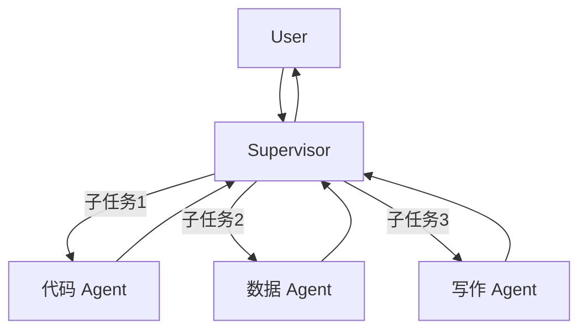

# 多智能体系统设计

单个 Agent 有上下文限制和能力边界。多智能体通过分工协作，能完成更复杂的长程任务。本文讲解主流架构模式及其适用场景。

## 1. 为什么需要多智能体

| 单 Agent 限制 | 多 Agent 解法 |
|--------------|--------------|
| 上下文窗口有限 | 不同 Agent 聚焦不同子任务 |
| 专业能力受限 | 专业化 Agent（代码/数据/写作...）|
| 串行处理慢 | 并发子任务提速 |
| 一个错误影响全局 | 独立 Agent 隔离错误 |

## 2. 三种架构模式

### 模式一：Supervisor（中心调度）



适用场景：任务可明确分类、需要统一协调决策

### 模式二：流水线（Pipeline）

```
用户请求 → 研究 Agent → 分析 Agent → 写作 Agent → 审核 Agent → 输出
```

适用场景：任务有固定步骤、不需要动态路由

### 模式三：Swarm（去中心化）

每个 Agent 自主决定把控制权转交给谁，没有中心 Supervisor。

适用场景：步骤不确定、需要动态切换专家

## 3. LangGraph 实现 Supervisor 模式

```python
from typing import Literal
from langgraph.graph import StateGraph, START, END
from langgraph.prebuilt import create_react_agent
from langchain_openai import ChatOpenAI
from langchain_core.messages import HumanMessage, SystemMessage
from typing_extensions import TypedDict
from typing import Annotated
from langgraph.graph.message import add_messages

llm = ChatOpenAI(model="gpt-4o")

# ============ 子 Agent 定义 ============

# 代码 Agent
code_agent = create_react_agent(
    llm,
    tools=[run_code_tool, read_file_tool],
    state_modifier=SystemMessage(content="你是代码专家，负责编写和执行代码"),
)

# 数据分析 Agent
data_agent = create_react_agent(
    llm,
    tools=[query_db_tool, plot_chart_tool],
    state_modifier=SystemMessage(content="你是数据分析专家，负责数据查询和可视化"),
)

# 写作 Agent
writing_agent = create_react_agent(
    llm,
    tools=[],  # 写作不需要外部工具
    state_modifier=SystemMessage(content="你是技术写作专家，负责整理和撰写报告"),
)

# ============ Supervisor ============

class MultiAgentState(TypedDict):
    messages: Annotated[list, add_messages]
    next: str  # 下一个执行的 Agent

agents = ["code_expert", "data_expert", "writing_expert"]

supervisor_prompt = f"""
你是任务协调员，根据当前进展决定下一步由哪位专家处理。

可选专家：
- code_expert：编写代码、执行脚本、文件操作
- data_expert：数据查询、统计分析、图表生成
- writing_expert：整理信息、撰写报告
- FINISH：任务已完成，准备给用户最终答案

只输出专家名称（code_expert / data_expert / writing_expert / FINISH），不要其他内容。
"""

def supervisor_node(state: MultiAgentState) -> MultiAgentState:
    response = llm.invoke(
        [SystemMessage(content=supervisor_prompt)] + state["messages"]
    )
    return {"next": response.content.strip()}

def code_node(state: MultiAgentState) -> MultiAgentState:
    result = code_agent.invoke({"messages": state["messages"]})
    return {"messages": result["messages"]}

def data_node(state: MultiAgentState) -> MultiAgentState:
    result = data_agent.invoke({"messages": state["messages"]})
    return {"messages": result["messages"]}

def writing_node(state: MultiAgentState) -> MultiAgentState:
    result = writing_agent.invoke({"messages": state["messages"]})
    return {"messages": result["messages"]}

# ============ 构建图 ============

graph = StateGraph(MultiAgentState)

graph.add_node("supervisor", supervisor_node)
graph.add_node("code_expert", code_node)
graph.add_node("data_expert", data_node)
graph.add_node("writing_expert", writing_node)

graph.add_edge(START, "supervisor")
graph.add_conditional_edges(
    "supervisor",
    lambda s: s["next"],
    {
        "code_expert": "code_expert",
        "data_expert": "data_expert",
        "writing_expert": "writing_expert",
        "FINISH": END,
    }
)
# 子 Agent 执行完回 Supervisor
for agent in ["code_expert", "data_expert", "writing_expert"]:
    graph.add_edge(agent, "supervisor")

app = graph.compile()

# 测试
result = app.invoke({
    "messages": [HumanMessage(content="分析我们上个月的销售数据，找出最畅销的5个产品，用图表展示，然后写一份200字的摘要报告")]
})
```

## 4. AutoGen 框架

微软的 AutoGen 更灵活，支持代码执行和对话驱动的协作。

```python
import autogen

# 用户代理（代表用户发起任务）
user_proxy = autogen.UserProxyAgent(
    name="User",
    human_input_mode="NEVER",  # 全自动，不需要人工介入
    max_consecutive_auto_reply=10,
    code_execution_config={
        "work_dir": "./workspace",
        "use_docker": False,
    },
)

# 代码专家
coder = autogen.AssistantAgent(
    name="Coder",
    system_message="你是 Python 代码专家。为给定问题编写代码，确保代码可执行。",
    llm_config={"model": "gpt-4o", "api_key": "sk-..."},
)

# 评审专家
reviewer = autogen.AssistantAgent(
    name="Reviewer",
    system_message="你是代码审查员。审查代码的正确性和效率，给出改进建议。",
    llm_config={"model": "gpt-4o", "api_key": "sk-..."},
)

# 两个 Agent 对话（Coder 生成代码，Reviewer 审查，直到满意）
result = user_proxy.initiate_chat(
    autogen.GroupChat(
        agents=[user_proxy, coder, reviewer],
        messages=[],
        max_round=12,
        speaker_selection_method="round_robin",
    ),
    message="写一个爬取 Hacker News 首页标题和链接的 Python 脚本",
)
```

## 5. 任务分解策略

### Plan-and-Execute 模式

```python
# 先规划，再执行

planner_prompt = """
根据用户目标，制定执行计划。将任务分解为 3-7 个具体步骤。

输出格式（JSON）：
{
  "steps": [
    {"id": 1, "task": "具体任务描述", "agent": "code_expert"},
    ...
  ]
}
"""

executor_prompt = """
执行当前步骤，完成后汇报结果。

前置步骤结果：{previous_results}
当前步骤：{current_task}
"""

async def plan_and_execute(goal: str) -> str:
    # 1. 规划
    plan_response = await llm.ainvoke([
        SystemMessage(content=planner_prompt),
        HumanMessage(content=goal),
    ])
    plan = json.loads(plan_response.content)
    
    # 2. 逐步执行
    results = []
    for step in plan["steps"]:
        result = await execute_step(
            step=step,
            previous_results=results,
        )
        results.append({"step": step["id"], "result": result})
    
    # 3. 汇总
    final = await llm.ainvoke([
        SystemMessage(content="根据所有步骤的执行结果，生成最终答案"),
        HumanMessage(content=json.dumps(results, ensure_ascii=False)),
    ])
    return final.content
```

## 6. 避坑指南

| 问题 | 原因 | 解法 |
|------|------|------|
| Agent 陷入无限循环 | Supervisor 不知道何时停止 | 设置最大轮次 + 明确 FINISH 条件 |
| 子 Agent 忽略上下文 | 消息列表太长 | 只传递当前任务相关的消息子集 |
| 并行 Agent 修改同一状态冲突 | 竞态条件 | 用 asyncio.Lock 或合并后处理 |
| 成本失控 | 多 Agent 调用次数多 | 监控 token 用量，设预算上限 |

```python
# 防止无限循环
class LoopGuard:
    def __init__(self, max_rounds: int = 20):
        self.rounds = 0
        self.max = max_rounds
    
    def check(self) -> bool:
        self.rounds += 1
        if self.rounds > self.max:
            raise RuntimeError(f"超过最大轮次 {self.max}，终止执行")
        return True
```

## 验收清单

- [ ] 能用 LangGraph 实现 Supervisor 模式，3+ 个专业子 Agent
- [ ] 能实现 Plan-and-Execute：先规划步骤再执行
- [ ] 能设置最大轮次防止 Agent 无限循环
- [ ] 能追踪多 Agent 的 token 消耗，估算成本
