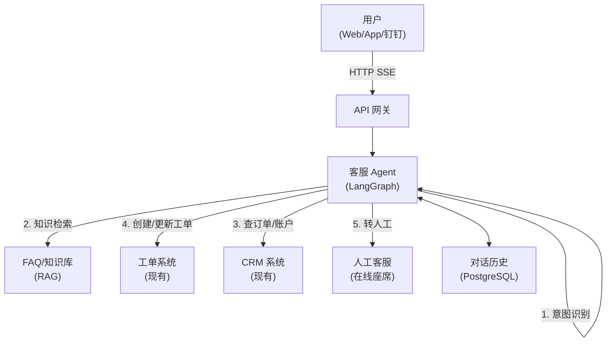

# 智能客服系统

## 1. 业务背景与痛点

**典型场景**：电商/SaaS 公司人工客服团队每天接收大量重复问题。

```
痛点量化（某中型电商案例）：
- 每日工单量：2000+
- 其中重复问题（退款/物流/账号）占比：68%
- 人工客服人数：15 人，人力成本：30 万/月
- 平均首次响应时间：8 分钟（非工作时间更长）
- 用户满意度：72%（目标 85%）
```

**AI 介入后预期**：
- 68% 重复问题由 AI 自动回复，人工专注复杂/投诉工单
- 首次响应时间：< 5 秒（7×24）
- 人力成本削减 40%

---

## 2. 系统架构



**核心流程**：
1. 用户发送消息 → 意图分类（咨询/投诉/退款/其他）
2. 咨询类 → RAG 检索 FAQ，生成回复
3. 查订单/账户 → 调用 CRM API 获取实时数据
4. 复杂/投诉 → 创建工单，必要时转人工
5. 全程记录对话历史，支持上下文连贯

---

## 3. 完整代码实现

### 3.1 项目结构

```
customer-service/
├── main.py                 # FastAPI 入口
├── agent/
│   ├── graph.py            # LangGraph Agent 定义
│   ├── tools.py            # 工具：查订单、创建工单、转人工
│   └── prompts.py          # 系统提示词
├── rag/
│   ├── indexer.py          # 知识库建立索引
│   └── retriever.py        # 检索
├── integrations/
│   ├── crm.py              # CRM 系统 HTTP 客户端
│   └── ticket.py           # 工单系统 HTTP 客户端
└── models/
    └── schema.py           # 请求/响应模型
```

### 3.2 意图分类与路由

```python
# agent/prompts.py
SYSTEM_PROMPT = """你是「智能客服小助手」，代表某电商平台提供售后服务。

## 你的能力
- 查询订单状态和物流信息（需要用户提供订单号）
- 解答退换货政策、会员权益等常见问题
- 为复杂问题创建工单，并承诺处理时效
- 在用户情绪激动或问题超出能力范围时，立即转接人工客服

## 行为准则
- 首句必须简短（不超过15字），直接回应问题
- 涉及金额/时效承诺，必须有数据支撑
- 不确定的不说；不在权限内的不承诺
- 用户连续2次表达不满意 → 主动提出转人工

## 禁止
- 不讨论竞争对手价格
- 不承诺具体赔偿金额（需升级处理）
- 不透露内部系统信息
"""

INTENT_CLASSIFIER_PROMPT = """分析用户消息，输出意图分类（JSON）：

可选意图：
- query_order: 查询订单/物流
- refund_request: 退款/退货申请  
- product_inquiry: 商品咨询
- complaint: 投诉
- account_issue: 账号问题
- other: 其他

输出格式：{"intent": "xxx", "confidence": 0.95, "entities": {"order_id": "..."}}
"""
```

```python
# agent/tools.py
from langchain_core.tools import tool
import httpx
import os

CRM_BASE_URL = os.getenv("CRM_BASE_URL", "https://crm.example.com")
TICKET_BASE_URL = os.getenv("TICKET_BASE_URL", "https://ticket.example.com")
INTERNAL_API_KEY = os.getenv("INTERNAL_API_KEY")

@tool
async def query_order(order_id: str, user_id: str) -> str:
    """
    查询订单状态和物流信息。
    
    Args:
        order_id: 订单号（格式：字母+数字，如 ORD20240101001）
        user_id: 用户ID（用于校验订单归属）
    """
    async with httpx.AsyncClient(timeout=5) as client:
        resp = await client.get(
            f"{CRM_BASE_URL}/api/orders/{order_id}",
            headers={"X-Api-Key": INTERNAL_API_KEY, "X-User-Id": user_id},
        )
    
    if resp.status_code == 404:
        return "未找到该订单，请确认订单号是否正确。"
    if resp.status_code == 403:
        return "该订单不属于您的账号，无法查询。"
    
    resp.raise_for_status()
    data = resp.json()
    
    return f"""订单 {order_id} 信息：
- 状态：{data['status_text']}
- 商品：{data['items_summary']}
- 金额：￥{data['total_amount']}
- 下单时间：{data['created_at']}
- 物流：{data.get('logistics', {}).get('carrier', '待发货')} {data.get('logistics', {}).get('tracking_no', '')}
- 预计到达：{data.get('logistics', {}).get('estimated_arrival', '待发货后更新')}"""


@tool
async def create_ticket(
    user_id: str,
    category: str,
    description: str,
    priority: str = "normal",
    order_id: str | None = None,
) -> str:
    """
    创建客服工单，适用于退款申请、投诉、复杂问题。
    
    Args:
        user_id: 用户ID
        category: 工单类型（refund/complaint/technical/other）
        description: 问题描述
        priority: 优先级（urgent/high/normal/low）
        order_id: 关联订单号（可选）
    """
    payload = {
        "user_id": user_id,
        "category": category,
        "description": description,
        "priority": priority,
        "source": "ai_assistant",
    }
    if order_id:
        payload["order_id"] = order_id
    
    async with httpx.AsyncClient(timeout=5) as client:
        resp = await client.post(
            f"{TICKET_BASE_URL}/api/tickets",
            headers={"X-Api-Key": INTERNAL_API_KEY},
            json=payload,
        )
    resp.raise_for_status()
    ticket = resp.json()
    
    sla = {"urgent": "2小时", "high": "4小时", "normal": "24小时"}.get(priority, "24小时")
    return f"工单已创建（编号 {ticket['ticket_no']}），{sla}内会有专人跟进处理。"


@tool
async def escalate_to_human(session_id: str, reason: str) -> str:
    """
    将对话转接给人工客服。当用户明确要求或问题复杂无法自动处理时使用。
    
    Args:
        session_id: 当前会话ID
        reason: 转人工原因
    """
    async with httpx.AsyncClient(timeout=5) as client:
        resp = await client.post(
            f"{TICKET_BASE_URL}/api/escalate",
            headers={"X-Api-Key": INTERNAL_API_KEY},
            json={"session_id": session_id, "reason": reason},
        )
    
    if resp.status_code == 200:
        data = resp.json()
        wait_time = data.get("estimated_wait_minutes", 5)
        return f"已为您转接人工客服，预计等待 {wait_time} 分钟。请稍候，客服将主动联系您。"
    else:
        # 无座席可用
        return "当前人工客服繁忙，已为您创建优先工单，30分钟内会有客服联系您。"
```

### 3.3 LangGraph Agent 核心逻辑

```python
# agent/graph.py
import json
from typing import Annotated
from langgraph.graph import StateGraph, START, END
from langgraph.graph.message import add_messages
from langgraph.prebuilt import ToolNode
from langgraph.checkpoint.postgres import PostgresSaver
from langchain_openai import ChatOpenAI
from langchain_core.messages import HumanMessage, SystemMessage
from typing_extensions import TypedDict
from .tools import query_order, create_ticket, escalate_to_human
from .prompts import SYSTEM_PROMPT

# ============ State ============

class CustomerServiceState(TypedDict):
    messages: Annotated[list, add_messages]
    user_id: str
    session_id: str
    dissatisfied_count: int  # 连续不满意次数
    intent: str | None

# ============ 模型与工具 ============

tools = [query_order, create_ticket, escalate_to_human]
llm = ChatOpenAI(model="gpt-4o", temperature=0.3).bind_tools(tools)

RAG_TOOLS = [query_order, create_ticket, escalate_to_human]

# ============ 节点 ============

async def agent_node(state: CustomerServiceState) -> CustomerServiceState:
    """主对话节点"""
    system = SystemMessage(content=SYSTEM_PROMPT.format(
        user_id=state["user_id"]
    ))
    response = await llm.ainvoke([system] + state["messages"])
    return {"messages": [response]}

def route_after_agent(state: CustomerServiceState) -> str:
    """决定是否执行工具"""
    last_msg = state["messages"][-1]
    if hasattr(last_msg, "tool_calls") and last_msg.tool_calls:
        return "tools"
    return END

def check_dissatisfaction(state: CustomerServiceState) -> CustomerServiceState:
    """检测用户不满意信号，连续2次自动转人工"""
    last_user_msg = next(
        (m for m in reversed(state["messages"]) if m.type == "human"),
        None
    )
    
    DISSATISFIED_KEYWORDS = ["不满意", "太差", "投诉", "要求赔偿", "找你们领导", "没用"]
    
    if last_user_msg and any(kw in last_user_msg.content for kw in DISSATISFIED_KEYWORDS):
        count = state.get("dissatisfied_count", 0) + 1
        return {"dissatisfied_count": count}
    
    return {"dissatisfied_count": 0}

# ============ 构建图 ============

def build_graph(db_uri: str):
    checkpointer = PostgresSaver.from_conn_string(db_uri)
    checkpointer.setup()
    
    graph = StateGraph(CustomerServiceState)
    graph.add_node("agent", agent_node)
    graph.add_node("check_sentiment", check_dissatisfaction)
    graph.add_node("tools", ToolNode(tools))
    
    graph.add_edge(START, "check_sentiment")
    graph.add_edge("check_sentiment", "agent")
    graph.add_conditional_edges("agent", route_after_agent)
    graph.add_edge("tools", "agent")
    
    return graph.compile(checkpointer=checkpointer)
```

### 3.4 FastAPI 入口（流式 SSE）

```python
# main.py
import json
import asyncio
from fastapi import FastAPI, HTTPException, Header
from fastapi.responses import StreamingResponse
from pydantic import BaseModel
from agent.graph import build_graph
from langchain_core.messages import HumanMessage
import os

app = FastAPI(title="智能客服系统")
graph = build_graph(os.getenv("DATABASE_URL"))

class ChatRequest(BaseModel):
    message: str
    session_id: str

@app.post("/api/chat/stream")
async def chat_stream(
    req: ChatRequest,
    x_user_id: str = Header(..., alias="X-User-Id"),
):
    config = {"configurable": {"thread_id": f"{x_user_id}:{req.session_id}"}}
    
    initial_state = {
        "messages": [HumanMessage(content=req.message)],
        "user_id": x_user_id,
        "session_id": req.session_id,
        "dissatisfied_count": 0,
        "intent": None,
    }
    
    async def event_stream():
        full_response = ""
        
        async for event in graph.astream_events(initial_state, config, version="v2"):
            kind = event["event"]
            
            if kind == "on_chat_model_stream":
                chunk = event["data"]["chunk"].content
                if chunk:
                    full_response += chunk
                    yield f"data: {json.dumps({'type': 'token', 'content': chunk}, ensure_ascii=False)}\n\n"
            
            elif kind == "on_tool_start":
                tool_name = event["name"]
                tool_display = {
                    "query_order": "正在查询订单...",
                    "create_ticket": "正在创建工单...",
                    "escalate_to_human": "正在转接人工...",
                }.get(tool_name, "处理中...")
                yield f"data: {json.dumps({'type': 'status', 'content': tool_display}, ensure_ascii=False)}\n\n"
        
        yield f"data: {json.dumps({'type': 'done', 'content': full_response}, ensure_ascii=False)}\n\n"
        yield "data: [DONE]\n\n"
    
    return StreamingResponse(
        event_stream(),
        media_type="text/event-stream",
        headers={"Cache-Control": "no-cache", "X-Accel-Buffering": "no"},
    )

@app.get("/health")
async def health():
    return {"status": "ok"}
```

---

## 4. 知识库建立与更新

```python
# rag/indexer.py
import hashlib
import json
from pathlib import Path
from qdrant_client import QdrantClient
from qdrant_client.models import PointStruct, VectorParams, Distance
from openai import AsyncOpenAI

class FAQIndexer:
    def __init__(self):
        self.qdrant = QdrantClient(host="localhost", port=6333)
        self.openai = AsyncOpenAI()
        self.collection = "customer_service_faq"
        self._init_collection()
    
    def _init_collection(self):
        if not self.qdrant.collection_exists(self.collection):
            self.qdrant.create_collection(
                self.collection,
                vectors_config=VectorParams(size=1536, distance=Distance.COSINE),
            )
    
    async def index_faq_from_csv(self, csv_path: str):
        """从 CSV 批量导入 FAQ（格式：question,answer,category）"""
        import csv
        
        questions, answers, categories = [], [], []
        with open(csv_path, encoding="utf-8") as f:
            for row in csv.DictReader(f):
                questions.append(row["question"])
                answers.append(row["answer"])
                categories.append(row.get("category", "general"))
        
        # 批量 Embedding
        resp = await self.openai.embeddings.create(
            model="text-embedding-3-small",
            input=questions,
        )
        embeddings = [item.embedding for item in resp.data]
        
        # 入库
        points = [
            PointStruct(
                id=hashlib.md5(q.encode()).hexdigest()[:16],
                vector=emb,
                payload={"question": q, "answer": a, "category": c},
            )
            for q, a, c, emb in zip(questions, answers, categories, embeddings)
        ]
        self.qdrant.upsert(self.collection, points=points)
        print(f"已导入 {len(points)} 条 FAQ")
    
    async def search(self, query: str, category: str | None = None, top_k: int = 3) -> list[dict]:
        resp = await self.openai.embeddings.create(
            model="text-embedding-3-small",
            input=[query],
        )
        query_vec = resp.data[0].embedding
        
        filter_cond = None
        if category:
            from qdrant_client.models import Filter, FieldCondition, MatchValue
            filter_cond = Filter(must=[FieldCondition(key="category", match=MatchValue(value=category))])
        
        results = self.qdrant.search(
            self.collection,
            query_vector=query_vec,
            query_filter=filter_cond,
            limit=top_k,
            score_threshold=0.72,  # 低于此相似度的不返回
        )
        return [{"question": r.payload["question"], "answer": r.payload["answer"], "score": r.score} for r in results]
```

---

## 5. 与现有系统集成

### CRM 系统对接（获取用户/订单信息）

```python
# integrations/crm.py
import httpx
from functools import lru_cache

class CRMClient:
    """对接公司现有 CRM 系统"""
    
    def __init__(self, base_url: str, api_key: str):
        self.base_url = base_url
        self.api_key = api_key
        self._client = httpx.AsyncClient(
            base_url=base_url,
            headers={"X-Api-Key": api_key},
            timeout=5.0,
        )
    
    async def get_user_profile(self, user_id: str) -> dict:
        """拉取用户画像：会员等级、历史购买、偏好"""
        resp = await self._client.get(f"/api/users/{user_id}/profile")
        return resp.json() if resp.status_code == 200 else {}
    
    async def get_recent_orders(self, user_id: str, limit: int = 5) -> list[dict]:
        """获取最近订单列表"""
        resp = await self._client.get(
            f"/api/users/{user_id}/orders",
            params={"limit": limit, "sort": "desc"},
        )
        return resp.json().get("items", []) if resp.status_code == 200 else []
    
    async def get_order_detail(self, order_id: str) -> dict | None:
        """获取订单详情"""
        resp = await self._client.get(f"/api/orders/{order_id}")
        return resp.json() if resp.status_code == 200 else None
```

### 工单系统对接（已有系统）

```python
# integrations/ticket.py
import httpx

class TicketClient:
    """对接公司现有工单系统（如 Zendesk/自研工单）"""
    
    def __init__(self, base_url: str, api_key: str):
        self.base_url = base_url
        self.api_key = api_key
    
    async def create(self, user_id: str, subject: str, description: str, 
                     priority: str = "normal", tags: list[str] = []) -> dict:
        async with httpx.AsyncClient() as client:
            resp = await client.post(
                f"{self.base_url}/api/tickets",
                headers={"Authorization": f"Bearer {self.api_key}"},
                json={
                    "requester_id": user_id,
                    "subject": subject,
                    "description": description,
                    "priority": priority,
                    "tags": ["ai_created"] + tags,
                    "channel": "ai_assistant",
                },
            )
        resp.raise_for_status()
        return resp.json()
    
    async def add_note(self, ticket_id: str, note: str, is_public: bool = False):
        """在工单添加备注（内部备注或用户可见）"""
        async with httpx.AsyncClient() as client:
            await client.post(
                f"{self.base_url}/api/tickets/{ticket_id}/notes",
                headers={"Authorization": f"Bearer {self.api_key}"},
                json={"content": note, "is_public": is_public},
            )
```

---

## 6. 部署配置

```yaml
# docker-compose.yml
version: "3.9"
services:
  cs-bot:
    build: .
    ports:
      - "8000:8000"
    environment:
      - DATABASE_URL=postgresql://postgres:pass@db:5432/cs_bot
      - OPENAI_API_KEY=${OPENAI_API_KEY}
      - CRM_BASE_URL=https://crm.internal.example.com
      - TICKET_BASE_URL=https://ticket.internal.example.com
      - INTERNAL_API_KEY=${INTERNAL_API_KEY}
    depends_on:
      - db
      - qdrant

  db:
    image: postgres:16-alpine
    environment:
      POSTGRES_DB: cs_bot
      POSTGRES_PASSWORD: pass
    volumes:
      - pg_data:/var/lib/postgresql/data

  qdrant:
    image: qdrant/qdrant:latest
    volumes:
      - qdrant_data:/qdrant/storage

volumes:
  pg_data:
  qdrant_data:
```

---

## 7. 上线验收标准

| 指标 | 目标值 | 测量方法 |
|------|--------|---------|
| 自动解决率 | ≥ 60% | 无转人工/工单的对话占比 |
| 首次响应时间 | < 3 秒 | API P95 延迟 |
| FAQ 召回准确率 | ≥ 85% | 每周抽样 100 条人工评审 |
| 幻觉/错误承诺率 | < 2% | 每周人工抽查低评分对话 |
| 用户好评率 | ≥ 80% | 对话结束后 👍/👎 |

### 常见失败模式

```
问题：用户重复问同样的问题，AI 给不一样的答案
→ 检查 temperature 是否太高（应 ≤ 0.3）
→ 检查 FAQ 是否有重复/矛盾条目

问题：AI 承诺了"一定退款"等不该说的话
→ 加强 System Prompt 禁止词
→ 在工具返回结果中加明确说明

问题：查订单时返回"未找到"但订单确实存在
→ 检查 CRM API 权限配置
→ 日志里看原始 HTTP 响应
```
