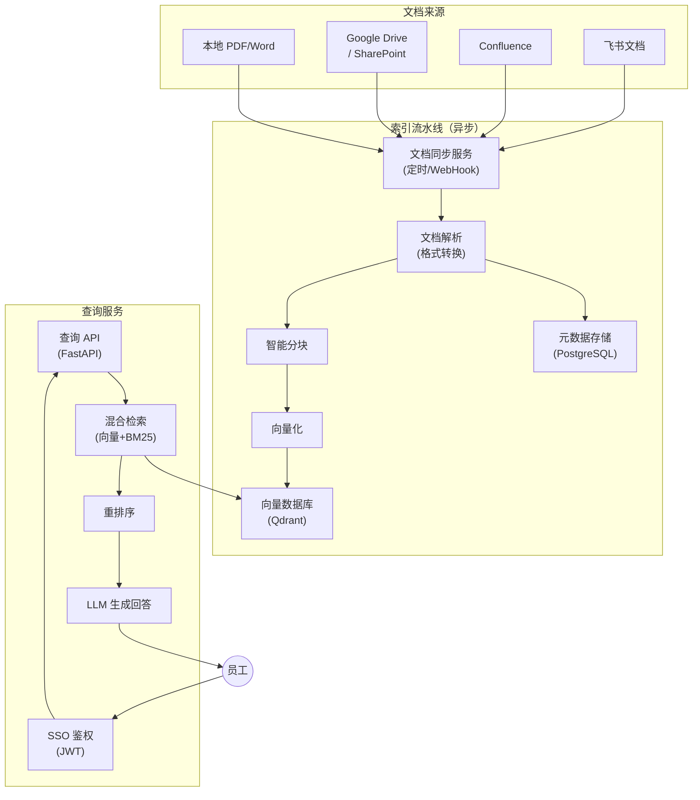

# 企业知识库系统

## 1. 业务背景与痛点

**典型场景**：中大型公司内部存在大量文档（产品手册、HR 政策、技术规范、会议记录），员工找信息靠"问人"。

```
痛点：
- 文档分散在飞书/Confluence/本地/邮件，搜关键词常常找不到
- "这个报销流程是什么" → 得找 HR，等 1 天才回
- 新员工入职要翻几百页 onboarding 文档
- 知识更新后旧内容仍在流传（文档版本混乱）
```

**目标**：员工直接用中文提问，AI 从所有文档中找到准确答案，并标注来源。

---

## 2. 系统架构



---

## 3. 多租户设计（按部门隔离）

```python
# 每个部门/团队是一个"租户"，文档隔离、权限独立

TENANT_COLLECTIONS = {
    "hr": "kb_hr",              # HR 政策、社保、假期
    "product": "kb_product",   # 产品文档、需求、PRD
    "tech": "kb_tech",         # 技术规范、架构文档
    "finance": "kb_finance",   # 财务报销、预算
    "all": "kb_public",        # 全公司公开文档
}

def get_accessible_collections(user_departments: list[str]) -> list[str]:
    """根据用户所在部门，返回可访问的集合列表"""
    collections = ["kb_public"]  # 所有人都能访问公开库
    
    for dept in user_departments:
        if dept in TENANT_COLLECTIONS:
            collections.append(TENANT_COLLECTIONS[dept])
    
    return list(set(collections))
```

---

## 4. 文档接入

### 4.1 飞书文档同步

```python
# integrations/feishu_sync.py
import httpx
import asyncio
from datetime import datetime

class FeishuDocSyncer:
    """飞书知识库文档同步"""
    
    def __init__(self, app_id: str, app_secret: str):
        self.app_id = app_id
        self.app_secret = app_secret
        self._token: str | None = None
        self._token_expire: float = 0
    
    async def _get_token(self) -> str:
        """获取飞书访问令牌"""
        if self._token and asyncio.get_event_loop().time() < self._token_expire:
            return self._token
        
        async with httpx.AsyncClient() as client:
            resp = await client.post(
                "https://open.feishu.cn/open-apis/auth/v3/tenant_access_token/internal",
                json={"app_id": self.app_id, "app_secret": self.app_secret},
            )
        data = resp.json()
        self._token = data["tenant_access_token"]
        self._token_expire = asyncio.get_event_loop().time() + data["expire"] - 60
        return self._token
    
    async def list_wiki_nodes(self, space_id: str) -> list[dict]:
        """列出知识库空间所有节点"""
        token = await self._get_token()
        nodes = []
        page_token = None
        
        while True:
            params = {"page_size": 50}
            if page_token:
                params["page_token"] = page_token
            
            async with httpx.AsyncClient() as client:
                resp = await client.get(
                    f"https://open.feishu.cn/open-apis/wiki/v2/spaces/{space_id}/nodes",
                    headers={"Authorization": f"Bearer {token}"},
                    params=params,
                )
            data = resp.json()["data"]
            nodes.extend(data.get("items", []))
            
            if not data.get("has_more"):
                break
            page_token = data["page_token"]
        
        return nodes
    
    async def get_doc_content(self, doc_token: str) -> str:
        """获取飞书文档纯文本内容"""
        token = await self._get_token()
        
        async with httpx.AsyncClient() as client:
            resp = await client.get(
                f"https://open.feishu.cn/open-apis/docx/v1/documents/{doc_token}/raw_content",
                headers={"Authorization": f"Bearer {token}"},
            )
        return resp.json()["data"]["content"]
    
    async def sync_space(self, space_id: str, dept: str, indexer: "KnowledgeIndexer"):
        """同步整个知识库空间"""
        nodes = await self.list_wiki_nodes(space_id)
        
        for node in nodes:
            if node["obj_type"] != "docx":
                continue
            
            content = await self.get_doc_content(node["obj_token"])
            
            await indexer.upsert_document(
                doc_id=node["obj_token"],
                title=node["title"],
                content=content,
                metadata={
                    "source": "feishu",
                    "department": dept,
                    "url": node.get("url", ""),
                    "updated_at": node.get("obj_edit_time", ""),
                    "space_id": space_id,
                },
                collection=TENANT_COLLECTIONS.get(dept, "kb_public"),
            )
        
        print(f"飞书同步完成：{dept} 共 {len(nodes)} 篇文档")
```

### 4.2 Confluence 同步

```python
# integrations/confluence_sync.py
from atlassian import Confluence  # pip install atlassian-python-api

class ConfluenceSyncer:
    def __init__(self, url: str, username: str, api_token: str):
        self.cf = Confluence(url=url, username=username, password=api_token)
    
    def get_all_pages(self, space_key: str) -> list[dict]:
        """获取 Confluence 空间所有页面"""
        pages = []
        start = 0
        
        while True:
            batch = self.cf.get_all_pages_from_space(
                space_key, start=start, limit=50,
                expand="body.storage,version,ancestors"
            )
            if not batch:
                break
            
            for page in batch:
                # 提取纯文本（去掉 HTML 标签）
                from bs4 import BeautifulSoup
                html = page["body"]["storage"]["value"]
                text = BeautifulSoup(html, "html.parser").get_text()
                
                pages.append({
                    "id": page["id"],
                    "title": page["title"],
                    "content": text,
                    "url": f"{self.cf.url}/wiki{page['_links']['webui']}",
                    "updated": page["version"]["when"],
                })
            
            start += len(batch)
        
        return pages
```

### 4.3 增量更新（只重建变化的文档）

```python
# rag/indexer.py
import hashlib
import json
from sqlalchemy import create_engine, Column, String, Text, DateTime
from sqlalchemy.orm import declarative_base, Session
from datetime import datetime

Base = declarative_base()

class DocumentRecord(Base):
    __tablename__ = "document_index"
    doc_id = Column(String, primary_key=True)
    collection = Column(String)
    content_hash = Column(String)  # 内容 MD5
    indexed_at = Column(DateTime)
    metadata = Column(Text)  # JSON

class KnowledgeIndexer:
    def __init__(self, db_url: str, qdrant_client, openai_client):
        engine = create_engine(db_url)
        Base.metadata.create_all(engine)
        self.db = Session(engine)
        self.qdrant = qdrant_client
        self.openai = openai_client
    
    async def upsert_document(
        self,
        doc_id: str,
        title: str,
        content: str,
        metadata: dict,
        collection: str,
    ):
        """更新文档索引（内容未变则跳过）"""
        content_hash = hashlib.md5(content.encode()).hexdigest()
        
        # 检查是否需要更新
        existing = self.db.query(DocumentRecord).filter_by(doc_id=doc_id).first()
        if existing and existing.content_hash == content_hash:
            return  # 内容未变，跳过
        
        # 分块 + Embedding
        chunks = self._smart_chunk(title, content)
        embeddings = await self._embed_batch(chunks)
        
        # 删除旧向量
        self.qdrant.delete(collection, f"doc_id == '{doc_id}'")
        
        # 写入新向量
        from qdrant_client.models import PointStruct
        points = [
            PointStruct(
                id=f"{doc_id}_{i}",
                vector=emb,
                payload={
                    "doc_id": doc_id,
                    "title": title,
                    "content": chunk,
                    "chunk_index": i,
                    **metadata,
                }
            )
            for i, (chunk, emb) in enumerate(zip(chunks, embeddings))
        ]
        self.qdrant.upsert(collection, points=points)
        
        # 更新元数据记录
        if existing:
            existing.content_hash = content_hash
            existing.indexed_at = datetime.now()
        else:
            self.db.add(DocumentRecord(
                doc_id=doc_id,
                collection=collection,
                content_hash=content_hash,
                indexed_at=datetime.now(),
                metadata=json.dumps(metadata),
            ))
        self.db.commit()
    
    def _smart_chunk(self, title: str, content: str, chunk_size: int = 600) -> list[str]:
        """智能分块：每块都包含文档标题作为上下文"""
        import re
        
        # 按段落分割
        paragraphs = re.split(r'\n{2,}', content)
        chunks = []
        current = f"【{title}】\n"
        
        for para in paragraphs:
            para = para.strip()
            if not para:
                continue
            
            if len(current) + len(para) > chunk_size and len(current) > len(f"【{title}】\n"):
                chunks.append(current.strip())
                current = f"【{title}】\n{para}\n"
            else:
                current += para + "\n"
        
        if current.strip() != f"【{title}】":
            chunks.append(current.strip())
        
        return chunks
    
    async def _embed_batch(self, texts: list[str]) -> list[list[float]]:
        resp = await self.openai.embeddings.create(
            model="text-embedding-3-small",
            input=texts,
        )
        return [item.embedding for item in resp.data]
```

---

## 5. 查询服务（混合检索 + 溯源）

```python
# api/query.py
from fastapi import FastAPI, HTTPException, Depends
from fastapi.security import HTTPBearer, HTTPAuthorizationCredentials
import jwt

app = FastAPI()
security = HTTPBearer()

JWT_SECRET = os.getenv("JWT_SECRET")

def decode_user(creds: HTTPAuthorizationCredentials = Depends(security)) -> dict:
    """解码 SSO JWT，提取用户信息和部门"""
    try:
        payload = jwt.decode(creds.credentials, JWT_SECRET, algorithms=["HS256"])
        return payload
    except jwt.ExpiredSignatureError:
        raise HTTPException(401, "Token 已过期，请重新登录")
    except jwt.InvalidTokenError:
        raise HTTPException(401, "无效的 Token")

class QueryRequest(BaseModel):
    question: str
    department_filter: str | None = None  # 限定查询范围

@app.post("/api/query")
async def query_knowledge(
    req: QueryRequest,
    user: dict = Depends(decode_user),
):
    user_depts = user.get("departments", [])
    accessible_collections = get_accessible_collections(user_depts)
    
    # 混合检索（向量 + BM25 关键词）
    results = await retriever.hybrid_search(
        query=req.question,
        collections=accessible_collections,
        top_k=8,
    )
    
    if not results:
        return {"answer": "在您有权访问的文档中未找到相关信息。", "sources": []}
    
    # 组装上下文（含来源引用）
    context_parts = []
    sources = []
    
    for i, r in enumerate(results[:5], 1):
        context_parts.append(f"[文档{i}] {r['payload']['title']}\n{r['payload']['content']}")
        sources.append({
            "title": r["payload"]["title"],
            "url": r["payload"].get("url"),
            "department": r["payload"].get("department"),
            "updated_at": r["payload"].get("updated_at"),
        })
    
    context = "\n\n".join(context_parts)
    
    # LLM 生成回答
    response = await openai_client.chat.completions.create(
        model="gpt-4o",
        temperature=0.1,
        messages=[
            {
                "role": "system",
                "content": """你是企业内部知识库助手。
请基于参考文档回答员工问题。
- 答案中必须标注信息来源（"根据[文档X]..."）
- 多个文档有不同说法时，注明各文档的差异
- 文档中没有的内容，明确说"该问题不在知识库中，建议联系相关部门确认"
- 不要推测或发挥，严格基于文档内容"""
            },
            {
                "role": "user",
                "content": f"参考文档：\n\n{context}\n\n问题：{req.question}"
            }
        ]
    )
    
    return {
        "answer": response.choices[0].message.content,
        "sources": sources,
        "model": "gpt-4o",
    }
```

---

## 6. 定时同步任务

```python
# tasks/sync_scheduler.py
from apscheduler.schedulers.asyncio import AsyncIOScheduler

scheduler = AsyncIOScheduler()

@scheduler.scheduled_job("interval", hours=4)
async def sync_feishu():
    """每 4 小时同步飞书文档"""
    syncer = FeishuDocSyncer(app_id=..., app_secret=...)
    
    SPACE_CONFIG = [
        ("HR_SPACE_ID", "hr"),
        ("PRODUCT_SPACE_ID", "product"),
        ("TECH_SPACE_ID", "tech"),
    ]
    
    for space_id, dept in SPACE_CONFIG:
        try:
            await syncer.sync_space(space_id, dept, indexer)
        except Exception as e:
            print(f"同步失败 {dept}: {e}")

@scheduler.scheduled_job("cron", hour=2)
async def sync_confluence():
    """每天凌晨 2 点同步 Confluence"""
    syncer = ConfluenceSyncer(url=..., username=..., api_token=...)
    pages = syncer.get_all_pages("TECH")
    for page in pages:
        await indexer.upsert_document(
            doc_id=page["id"],
            title=page["title"],
            content=page["content"],
            metadata={"source": "confluence", "url": page["url"]},
            collection="kb_tech",
        )

scheduler.start()
```

---

## 7. 上线验收标准

| 指标 | 目标 |
|------|------|
| 知识库覆盖率 | 核心部门 90% 文档已入库 |
| 回答准确率 | ≥ 85%（人工抽样验证） |
| 溯源率 | 100%（所有回答必须有文档出处）|
| 索引延迟 | 文档更新后 4 小时内可查询 |
| 查询响应时间 | P95 < 4 秒 |
