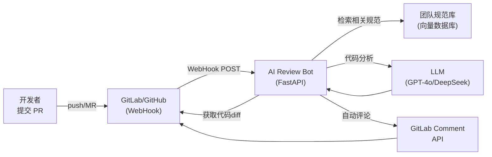

# 研发辅助工具

## 1. 业务背景与痛点

```
研发团队的高频痛点：
- PR Review 排队等待：提交 PR 后等资深同学看，有时要等 1-2 天
- 代码规范执行不一：新人不熟悉规范，老代码风格各异
- 重复性 Bug 被反复提交：同类 SQL 注入/NPE 一次次出现
- 文档写不完：接口文档、变更记录没人愿意写
```

**AI 介入后**：
- PR 提交后 30 秒自动完成初步审查，附带具体改进建议
- 自动生成变更说明、接口文档
- 代码规范自动检查（团队自定义规则）

---

## 2. 系统架构



---

## 3. GitLab WebHook 接收与处理

### 3.1 WebHook 入口

```python
# main.py
import hmac
import hashlib
from fastapi import FastAPI, Request, HTTPException, BackgroundTasks
from pydantic import BaseModel

app = FastAPI(title="AI Code Review Bot")

GITLAB_SECRET = os.getenv("GITLAB_WEBHOOK_SECRET")

@app.post("/webhook/gitlab")
async def gitlab_webhook(
    request: Request,
    background_tasks: BackgroundTasks,
):
    # 验证 WebHook 签名（防止伪造）
    signature = request.headers.get("X-Gitlab-Token")
    if signature != GITLAB_SECRET:
        raise HTTPException(403, "WebHook 签名验证失败")
    
    payload = await request.json()
    event = request.headers.get("X-Gitlab-Event")
    
    if event == "Merge Request Hook":
        action = payload["object_attributes"]["action"]
        if action in ("open", "reopen", "update"):
            # 异步执行，不阻塞 WebHook 响应
            background_tasks.add_task(
                handle_merge_request,
                payload=payload,
            )
    
    return {"status": "accepted"}

@app.post("/webhook/github")
async def github_webhook(
    request: Request,
    background_tasks: BackgroundTasks,
):
    # GitHub 使用 HMAC-SHA256 签名
    signature = request.headers.get("X-Hub-Signature-256", "")
    body = await request.body()
    
    expected = "sha256=" + hmac.new(
        GITLAB_SECRET.encode(), body, hashlib.sha256
    ).hexdigest()
    
    if not hmac.compare_digest(signature, expected):
        raise HTTPException(403, "签名验证失败")
    
    payload = await request.json()
    event = request.headers.get("X-GitHub-Event")
    
    if event == "pull_request" and payload["action"] in ("opened", "synchronize"):
        background_tasks.add_task(handle_pull_request, payload=payload)
    
    return {"status": "accepted"}
```

### 3.2 获取代码差异

```python
# git_client.py
import httpx

class GitLabClient:
    def __init__(self, base_url: str, private_token: str):
        self.base = base_url
        self.headers = {"PRIVATE-TOKEN": private_token}
    
    async def get_mr_diff(self, project_id: int, mr_iid: int) -> list[dict]:
        """获取 MR 的代码变更（diff）"""
        async with httpx.AsyncClient() as client:
            resp = await client.get(
                f"{self.base}/api/v4/projects/{project_id}/merge_requests/{mr_iid}/diffs",
                headers=self.headers,
                params={"unidiff": False},
            )
        resp.raise_for_status()
        return resp.json()
    
    async def get_mr_info(self, project_id: int, mr_iid: int) -> dict:
        async with httpx.AsyncClient() as client:
            resp = await client.get(
                f"{self.base}/api/v4/projects/{project_id}/merge_requests/{mr_iid}",
                headers=self.headers,
            )
        return resp.json()
    
    async def post_comment(self, project_id: int, mr_iid: int, body: str):
        """在 MR 发表评论"""
        async with httpx.AsyncClient() as client:
            await client.post(
                f"{self.base}/api/v4/projects/{project_id}/merge_requests/{mr_iid}/notes",
                headers=self.headers,
                json={"body": body},
            )
    
    async def post_inline_comment(
        self,
        project_id: int,
        mr_iid: int,
        file_path: str,
        line: int,
        body: str,
        base_sha: str,
        head_sha: str,
    ):
        """在具体代码行发表行内评论"""
        async with httpx.AsyncClient() as client:
            await client.post(
                f"{self.base}/api/v4/projects/{project_id}/merge_requests/{mr_iid}/discussions",
                headers=self.headers,
                json={
                    "body": body,
                    "position": {
                        "position_type": "text",
                        "base_sha": base_sha,
                        "head_sha": head_sha,
                        "new_path": file_path,
                        "new_line": line,
                    }
                },
            )
```

---

## 4. AI Review 核心逻辑

```python
# reviewer.py
import json
from openai import AsyncOpenAI
from pydantic import BaseModel

client = AsyncOpenAI()

class ReviewIssue(BaseModel):
    severity: str   # critical / warning / suggestion
    file: str
    line: int | None
    category: str   # bug / security / performance / style / logic
    description: str
    suggestion: str

class ReviewResult(BaseModel):
    summary: str
    score: int      # 1-10，代码质量分
    issues: list[ReviewIssue]
    good_points: list[str]  # 值得肯定的点

REVIEW_SYSTEM_PROMPT = """你是一名资深后端工程师，也是团队代码规范的守护者。

请对提交的代码变更进行全面审查，重点关注：

## 必须检查（critical）
- SQL 注入、XSS、路径遍历等安全漏洞
- 可能导致数据丢失的 Bug（事务缺失、并发竞态、越界）
- 重大性能问题（N+1 查询、大循环内 IO、无索引的全表扫描）

## 应该关注（warning）
- 未处理的异常和错误路径
- 资源未释放（连接池、文件句柄）
- 硬编码的配置值（密钥、URL）
- 不正确的日志（错误级别、敏感信息入日志）

## 建议优化（suggestion）
- 可读性改进（命名、注释）
- 可测试性（依赖注入、接口抽象）
- 代码重复（可以提取公共方法）

## 输出格式
返回 JSON，严格按 ReviewResult 结构：
{
  "summary": "overall summary",
  "score": 7,
  "issues": [
    {"severity": "critical", "file": "xxx.py", "line": 42, "category": "security", 
     "description": "问题描述", "suggestion": "建议修改方式"}
  ],
  "good_points": ["值得肯定的点1", "..."]
}
"""

async def review_diff(
    diff_files: list[dict],
    mr_title: str,
    mr_description: str,
    team_rules: str = "",
) -> ReviewResult:
    """对代码 diff 进行 AI Review"""
    
    # 组装代码变更（过滤二进制文件、大文件）
    diff_text_parts = []
    total_chars = 0
    
    for diff in diff_files:
        if diff.get("deleted_file") or diff.get("binary"):
            continue
        
        file_path = diff["new_path"]
        diff_content = diff.get("diff", "")
        
        # 跳过非代码文件
        SKIP_PATTERNS = [".lock", ".sum", ".png", ".jpg", "dist/", "node_modules/", "vendor/"]
        if any(p in file_path for p in SKIP_PATTERNS):
            continue
        
        # 限制单文件最大字符（避免 token 超限）
        if len(diff_content) > 8000:
            diff_content = diff_content[:8000] + "\n... [文件过长，已截断]"
        
        diff_text_parts.append(f"### 文件：{file_path}\n```\n{diff_content}\n```")
        total_chars += len(diff_content)
        
        if total_chars > 40000:  # 全部 diff 不超过 4 万字符
            diff_text_parts.append("... [文件过多，后续文件已省略]")
            break
    
    diff_text = "\n\n".join(diff_text_parts)
    
    user_content = f"""
MR 标题：{mr_title}
MR 描述：{mr_description or "（无描述）"}

{f"团队规范补充：{team_rules}" if team_rules else ""}

代码变更：
{diff_text}
"""
    
    response = await client.chat.completions.create(
        model="gpt-4o",
        temperature=0,
        response_format={"type": "json_object"},
        messages=[
            {"role": "system", "content": REVIEW_SYSTEM_PROMPT},
            {"role": "user", "content": user_content},
        ],
    )
    
    result_data = json.loads(response.choices[0].message.content)
    return ReviewResult(**result_data)
```

---

## 5. 格式化输出到 GitLab

```python
# formatter.py

SEVERITY_EMOJI = {"critical": "🔴", "warning": "🟡", "suggestion": "🔵"}
CATEGORY_ZH = {
    "bug": "Bug",
    "security": "安全漏洞",
    "performance": "性能问题",
    "style": "代码风格",
    "logic": "逻辑问题",
}

def format_review_comment(result: ReviewResult, mr_url: str) -> str:
    """将审查结果格式化为 Markdown 评论"""
    
    lines = [
        "## 🤖 AI Code Review 报告",
        "",
        f"**质量评分：{result.score}/10**　　",
        f"**问题数量：{len(result.issues)} 个**（Critical: {sum(1 for i in result.issues if i.severity == 'critical')} / Warning: {sum(1 for i in result.issues if i.severity == 'warning')} / Suggestion: {sum(1 for i in result.issues if i.severity == 'suggestion')}）",
        "",
        f"### 总结",
        result.summary,
        "",
    ]
    
    if result.good_points:
        lines += ["### ✅ 值得肯定", ""]
        for p in result.good_points:
            lines.append(f"- {p}")
        lines.append("")
    
    if result.issues:
        lines += ["### 🔍 发现问题", ""]
        
        for issue in sorted(result.issues, key=lambda x: {"critical": 0, "warning": 1, "suggestion": 2}[x.severity]):
            emoji = SEVERITY_EMOJI[issue.severity]
            category = CATEGORY_ZH.get(issue.category, issue.category)
            location = f"`{issue.file}`" + (f" 第 {issue.line} 行" if issue.line else "")
            
            lines += [
                f"#### {emoji} [{category}] {location}",
                f"**问题**：{issue.description}",
                f"**建议**：{issue.suggestion}",
                "",
            ]
    
    lines += [
        "---",
        "*本报告由 AI 自动生成，仅供参考。最终合入决定以人工 Review 为准。*",
    ]
    
    return "\n".join(lines)
```

---

## 6. 完整处理流程

```python
# handler.py
from git_client import GitLabClient
from reviewer import review_diff
from formatter import format_review_comment

gitlab = GitLabClient(
    base_url=os.getenv("GITLAB_BASE_URL"),
    private_token=os.getenv("GITLAB_TOKEN"),
)

async def handle_merge_request(payload: dict):
    project_id = payload["project"]["id"]
    mr_iid = payload["object_attributes"]["iid"]
    mr_title = payload["object_attributes"]["title"]
    mr_description = payload["object_attributes"].get("description", "")
    
    # 1. 获取代码差异
    try:
        diffs = await gitlab.get_mr_diff(project_id, mr_iid)
    except Exception as e:
        print(f"获取 diff 失败: {e}")
        return
    
    if not diffs:
        return
    
    # 2. AI 审查
    try:
        result = await review_diff(diffs, mr_title, mr_description)
    except Exception as e:
        await gitlab.post_comment(project_id, mr_iid, f"⚠️ AI Review 失败：{e}")
        return
    
    # 3. 发表评论
    comment = format_review_comment(result, payload["object_attributes"]["url"])
    await gitlab.post_comment(project_id, mr_iid, comment)
    
    # 4. 如果有 critical 问题，给 MR 打标签
    if any(i.severity == "critical" for i in result.issues):
        # 通过 GitLab API 添加 label
        await gitlab.add_label(project_id, mr_iid, "needs-attention")
    
    print(f"MR !{mr_iid} Review 完成，得分 {result.score}/10")
```

---

## 7. 团队规范向量库

把团队的编码规范文档存入向量库，Review 时动态检索相关规范：

```python
# rules_store.py
# 将团队 wiki 里的编码规范索引化，Review 时按相关性检索

TEAM_RULES = [
    {
        "rule": "禁止在循环内执行数据库查询（N+1 问题）",
        "example_bad": "for user in users: db.query(Order).filter_by(user_id=user.id).all()",
        "example_good": "orders = db.query(Order).filter(Order.user_id.in_([u.id for u in users])).all()",
        "tags": ["performance", "database"],
    },
    {
        "rule": "所有对外 API 必须有请求级别的日志（请求ID、耗时、状态码）",
        "tags": ["observability", "api"],
    },
    # ... 更多规范
]

async def search_relevant_rules(code_diff: str) -> str:
    """根据代码变更，检索最相关的团队规范"""
    # 使用向量相似度找相关规范
    results = rules_vector_store.search(code_diff, top_k=5)
    return "\n".join(f"- {r['rule']}" for r in results)
```

---

## 8. 扩展：自动生成 Changelog 和接口文档

```python
@app.post("/api/generate-changelog")
async def generate_changelog(
    project_id: int,
    from_tag: str,
    to_tag: str = "HEAD",
):
    """根据 commit 历史自动生成 CHANGELOG"""
    commits = await gitlab.get_commits_between(project_id, from_tag, to_tag)
    
    commit_msgs = "\n".join(f"- {c['title']}" for c in commits[:50])
    
    response = await client.chat.completions.create(
        model="gpt-4o",
        messages=[
            {"role": "system", "content": "你是技术写作专家，将 commit 列表整理为面向用户的 CHANGELOG"},
            {"role": "user", "content": f"commits:\n{commit_msgs}\n\n生成 CHANGELOG，按 新特性/Bug修复/性能优化/破坏性变更 分类"},
        ]
    )
    
    return {"changelog": response.choices[0].message.content}
```

---

## 9. 验收标准

| 指标 | 目标 |
|------|------|
| 首次响应时间 | PR 提交后 60 秒内完成评论 |
| Critical 误报率 | < 5%（人工确认后统计）|
| 漏报率（已知 Bug 类型）| < 10% |
| 开发者接受率 | > 60% 的建议被采纳 |
| 人工 Review 时间节省 | ≥ 30% |
