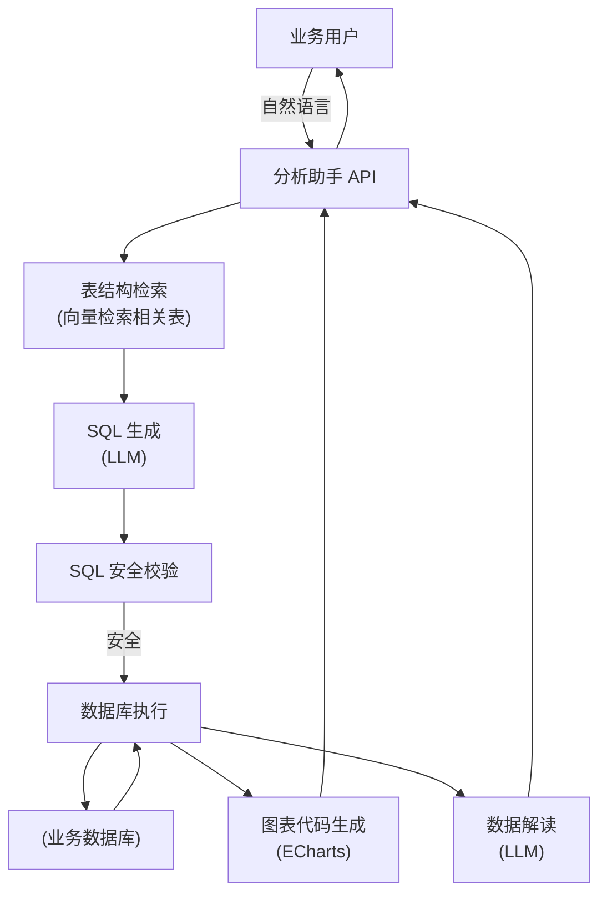

# 数据分析助手

## 1. 业务背景与痛点

```
典型场景：
- 产品经理："帮我看一下上周 DAU 和付费率的趋势" → 等数据团队 2 天
- 运营："筛一下最近 30 天复购率大于 2 的用户" → SQL 写不来，要找研发
- 管理层："昨天各渠道的转化漏斗怎么样" → 明天早会要不要等？

核心矛盾：数据在数据库里，但会写 SQL 的人少，自助分析平台用起来复杂。
```

**Text2SQL + AI 解读**：
- 业务同学用中文描述需求 → 自动生成 SQL → 执行 → 返回图表+文字解读
- 不需要懂 SQL，不需要懂 BI 工具

---

## 2. 系统架构



---

## 3. 数据库 Schema 管理

Schema 是 Text2SQL 的核心——模型必须先"知道"有哪些表、哪些字段。

### 3.1 Schema 提取与向量化

```python
# schema_store.py
import asyncpg
import json
from openai import AsyncOpenAI
from qdrant_client import QdrantClient

class SchemaStore:
    """管理数据库 Schema 的向量索引"""
    
    def __init__(self, db_url: str, qdrant: QdrantClient, openai: AsyncOpenAI):
        self.db_url = db_url
        self.qdrant = qdrant
        self.openai = openai
        self.collection = "db_schema"
        self._init_collection()
    
    def _init_collection(self):
        from qdrant_client.models import VectorParams, Distance
        if not self.qdrant.collection_exists(self.collection):
            self.qdrant.create_collection(
                self.collection,
                vectors_config=VectorParams(size=1536, distance=Distance.COSINE)
            )
    
    async def index_all_tables(self):
        """提取所有表结构并向量化"""
        conn = await asyncpg.connect(self.db_url)
        
        # 获取所有表的结构信息
        tables = await conn.fetch("""
            SELECT 
                t.table_name,
                t.table_schema,
                obj_description(c.oid, 'pg_class') as table_comment
            FROM information_schema.tables t
            JOIN pg_class c ON c.relname = t.table_name
            WHERE t.table_schema = 'public'
            AND t.table_type = 'BASE TABLE'
        """)
        
        for table in tables:
            table_name = table["table_name"]
            
            # 获取列信息
            columns = await conn.fetch("""
                SELECT 
                    column_name,
                    data_type,
                    is_nullable,
                    column_default,
                    col_description(
                        (table_schema||'.'||table_name)::regclass::oid, 
                        ordinal_position
                    ) as column_comment
                FROM information_schema.columns
                WHERE table_name = $1 AND table_schema = 'public'
                ORDER BY ordinal_position
            """, table_name)
            
            # 获取外键
            fks = await conn.fetch("""
                SELECT
                    kcu.column_name,
                    ccu.table_name AS foreign_table,
                    ccu.column_name AS foreign_column
                FROM information_schema.table_constraints tc
                JOIN information_schema.key_column_usage kcu ON tc.constraint_name = kcu.constraint_name
                JOIN information_schema.constraint_column_usage ccu ON ccu.constraint_name = tc.constraint_name
                WHERE tc.constraint_type = 'FOREIGN KEY' AND tc.table_name = $1
            """, table_name)
            
            # 构建描述文本（用于向量化）
            schema_desc = self._build_schema_description(table_name, table, columns, fks)
            
            await self._upsert_table_schema(table_name, schema_desc, {
                "table_name": table_name,
                "schema_text": schema_desc,
                "columns": [dict(c) for c in columns],
            })
        
        await conn.close()
        print(f"Schema 索引完成，共 {len(tables)} 张表")
    
    def _build_schema_description(self, table_name, table, columns, fks) -> str:
        """构建人类可读的 Schema 描述（用于向量检索）"""
        comment = table["table_comment"] or ""
        desc = f"表名：{table_name}  {comment}\n\n字段列表：\n"
        
        for col in columns:
            nullable = "（可空）" if col["is_nullable"] == "YES" else ""
            col_comment = col["column_comment"] or ""
            desc += f"  - {col['column_name']} ({col['data_type']}) {nullable} {col_comment}\n"
        
        if fks:
            desc += "\n外键关系：\n"
            for fk in fks:
                desc += f"  - {fk['column_name']} → {fk['foreign_table']}.{fk['foreign_column']}\n"
        
        return desc
    
    async def _upsert_table_schema(self, table_name: str, description: str, payload: dict):
        resp = await self.openai.embeddings.create(
            model="text-embedding-3-small",
            input=[description],
        )
        embedding = resp.data[0].embedding
        
        from qdrant_client.models import PointStruct
        self.qdrant.upsert(
            self.collection,
            points=[PointStruct(
                id=abs(hash(table_name)) % (2**63),
                vector=embedding,
                payload=payload,
            )]
        )
    
    async def retrieve_relevant_tables(self, query: str, top_k: int = 5) -> list[dict]:
        """根据用户问题，检索最相关的表"""
        resp = await self.openai.embeddings.create(
            model="text-embedding-3-small",
            input=[query],
        )
        results = self.qdrant.search(
            self.collection,
            query_vector=resp.data[0].embedding,
            limit=top_k,
        )
        return [r.payload for r in results]
```

---

## 4. Text2SQL 生成

```python
# sql_generator.py
import json
from openai import AsyncOpenAI
from pydantic import BaseModel

client = AsyncOpenAI()

class SQLResult(BaseModel):
    sql: str
    explanation: str       # 用中文解释 SQL 在做什么
    chart_type: str        # bar/line/pie/table/number
    x_field: str | None    # 横轴字段
    y_fields: list[str]    # 纵轴字段

SQL_SYSTEM_PROMPT = """你是专业的数据分析 SQL 工程师。

根据用户问题和提供的数据库表结构，生成正确且高效的 PostgreSQL 查询。

## 强制规则
1. 只能生成 SELECT 语句，禁止 INSERT/UPDATE/DELETE/DROP
2. 针对大表必须加 LIMIT（最多 10000 行）
3. 时间范围查询默认最近 30 天（如无特别说明）
4. 聚合查询必须有 GROUP BY
5. 模糊匹配使用 ILIKE

## 图表建议
根据数据类型推荐可视化方式：
- 趋势数据（按时间）→ line（折线图）
- 分类对比 → bar（柱状图）
- 占比/构成 → pie（饼图）
- 明细列表 → table
- 单一指标 → number（数字卡片）

## 输出格式（JSON）
{
  "sql": "SELECT ...",
  "explanation": "这条 SQL 在查询...",
  "chart_type": "line",
  "x_field": "date",
  "y_fields": ["dau", "paying_users"]
}
"""

async def generate_sql(
    question: str,
    relevant_tables: list[dict],
    dialect: str = "postgresql",
) -> SQLResult:
    # 构建 schema context
    schema_context = "\n\n".join([
        f"表名：{t['table_name']}\n{t['schema_text']}"
        for t in relevant_tables
    ])
    
    response = await client.chat.completions.create(
        model="gpt-4o",
        temperature=0,
        response_format={"type": "json_object"},
        messages=[
            {"role": "system", "content": SQL_SYSTEM_PROMPT},
            {"role": "user", "content": f"""
数据库类型：{dialect}

相关表结构：
{schema_context}

用户问题：{question}
"""}
        ]
    )
    
    data = json.loads(response.choices[0].message.content)
    return SQLResult(**data)
```

---

## 5. SQL 安全校验

```python
# sql_validator.py
import re
import sqlparse
from sqlparse.sql import Statement
from sqlparse.tokens import DML

class SQLSecurityValidator:
    """防止 SQL 注入和危险操作"""
    
    DANGEROUS_KEYWORDS = [
        "INSERT", "UPDATE", "DELETE", "DROP", "CREATE", "ALTER",
        "TRUNCATE", "GRANT", "REVOKE", "EXECUTE", "EXEC", "CALL",
        "LOAD_FILE", "INTO OUTFILE", "INFORMATION_SCHEMA",
    ]
    
    # 只允许访问的表（白名单）
    ALLOWED_TABLES: set[str] | None = None

    def validate(self, sql: str) -> tuple[bool, str]:
        """返回 (是否安全, 错误信息)"""
        sql_upper = sql.upper().strip()
        
        # 1. 必须以 SELECT 开头
        if not sql_upper.startswith("SELECT"):
            return False, "只允许 SELECT 查询"
        
        # 2. 检查危险关键词（处理注释绕过）
        clean_sql = self._remove_comments(sql_upper)
        for keyword in self.DANGEROUS_KEYWORDS:
            if re.search(r'\b' + keyword + r'\b', clean_sql):
                return False, f"包含禁止操作：{keyword}"
        
        # 3. 检查是否包含子查询写操作
        if re.search(r'\bINTO\b', clean_sql) and "INSERT" not in sql_upper[:20]:
            # SELECT INTO 也禁止（会创建新表）
            return False, "不允许 SELECT INTO"
        
        # 4. 表白名单（可选）
        if self.ALLOWED_TABLES:
            parsed = sqlparse.parse(sql)[0]
            tables = self._extract_tables(parsed)
            unauthorized = tables - self.ALLOWED_TABLES
            if unauthorized:
                return False, f"无权访问表：{unauthorized}"
        
        # 5. 防止时间炸弹（大范围全表扫描）
        if "LIMIT" not in sql_upper and self._is_likely_full_scan(sql_upper):
            return False, "大范围查询必须包含 LIMIT 子句"
        
        return True, ""
    
    def _remove_comments(self, sql: str) -> str:
        sql = re.sub(r'--[^\n]*', '', sql)
        sql = re.sub(r'/\*.*?\*/', '', sql, flags=re.DOTALL)
        return sql
    
    def _is_likely_full_scan(self, sql: str) -> bool:
        """简单判断是否可能是全表扫描"""
        return "WHERE" not in sql and "GROUP BY" not in sql
    
    def _extract_tables(self, statement: Statement) -> set[str]:
        tables = set()
        from_seen = False
        for token in statement.flatten():
            if token.ttype is DML and token.value.upper() in ("FROM", "JOIN"):
                from_seen = True
            elif from_seen and token.ttype is not None:
                from_seen = False
            elif from_seen and token.ttype is None:
                tables.add(token.value.lower())
                from_seen = False
        return tables

validator = SQLSecurityValidator()
```

---

## 6. 执行与可视化

```python
# executor.py
import asyncpg
import json
from typing import Any

class QueryExecutor:
    def __init__(self, db_url: str, max_rows: int = 5000):
        self.db_url = db_url
        self.max_rows = max_rows
    
    async def execute(self, sql: str) -> dict[str, Any]:
        """执行 SQL，返回数据和元信息"""
        conn = await asyncpg.connect(self.db_url)
        
        try:
            rows = await conn.fetch(sql)
            
            if not rows:
                return {"columns": [], "rows": [], "row_count": 0}
            
            columns = list(rows[0].keys())
            data = [list(r.values()) for r in rows[:self.max_rows]]
            
            # 数据类型序列化（处理 Decimal/Date 等）
            serialized = []
            for row in data:
                serialized.append([self._serialize(v) for v in row])
            
            return {
                "columns": columns,
                "rows": serialized,
                "row_count": len(rows),
                "truncated": len(rows) > self.max_rows,
            }
        finally:
            await conn.close()
    
    def _serialize(self, value) -> Any:
        import decimal
        from datetime import date, datetime
        
        if isinstance(value, decimal.Decimal):
            return float(value)
        if isinstance(value, (date, datetime)):
            return value.isoformat()
        return value


async def generate_echarts_config(
    data: dict,
    sql_result: "SQLResult",
) -> dict:
    """根据数据和图表类型，生成 ECharts 配置"""
    
    chart_type = sql_result.chart_type
    columns = data["columns"]
    rows = data["rows"]
    
    if chart_type == "number" and rows:
        # 单数字展示
        return {
            "type": "number",
            "value": rows[0][0],
            "label": columns[0],
        }
    
    if chart_type == "table":
        return {
            "type": "table",
            "columns": columns,
            "rows": rows,
        }
    
    # 通用折线/柱状/饼图
    x_field = sql_result.x_field or columns[0]
    y_fields = sql_result.y_fields or columns[1:]
    
    x_axis = [row[columns.index(x_field)] for row in rows]
    
    series = []
    for y_field in y_fields:
        if y_field in columns:
            idx = columns.index(y_field)
            series.append({
                "name": y_field,
                "type": chart_type,
                "data": [row[idx] for row in rows],
                "smooth": True if chart_type == "line" else False,
            })
    
    return {
        "type": "echarts",
        "option": {
            "tooltip": {"trigger": "axis"},
            "legend": {"data": y_fields},
            "xAxis": {"type": "category", "data": x_axis},
            "yAxis": {"type": "value"},
            "series": series,
        }
    }
```

---

## 7. 数据解读（Insight 生成）

```python
# insight.py
async def generate_insight(
    question: str,
    sql: str,
    data: dict,
    sql_result: "SQLResult",
) -> str:
    """根据查询结果生成业务洞察"""
    
    if not data["rows"]:
        return "查询结果为空，可能是时间范围内没有数据，或筛选条件过于严格。"
    
    # 简化数据（只取前 20 行给 LLM 解读，避免 token 过多）
    sample_rows = data["rows"][:20]
    sample_text = "\n".join([
        "\t".join(str(v) for v in row)
        for row in sample_rows
    ])
    
    header = "\t".join(data["columns"])
    total_rows = data["row_count"]
    
    response = await client.chat.completions.create(
        model="gpt-4o",
        temperature=0.3,
        messages=[
            {
                "role": "system",
                "content": """你是数据分析专家，擅长从数据中发现业务洞察。
                
请用简洁、直接的语言解读数据：
1. 核心结论（1-2句，数字要具体）
2. 关键发现（最多3条）
3. 异常或值得关注的点（如有）

不要描述 SQL 本身，聚焦在业务含义上。"""
            },
            {
                "role": "user",
                "content": f"""
用户问题：{question}

数据（共 {total_rows} 行，以下为前 {len(sample_rows)} 行示例）：
{header}
{sample_text}
"""
            }
        ]
    )
    
    return response.choices[0].message.content
```

---

## 8. 完整 API 接口

```python
# main.py
from fastapi import FastAPI, HTTPException
from fastapi.responses import StreamingResponse
from pydantic import BaseModel
import asyncio
import json

app = FastAPI(title="数据分析助手")

class AnalysisRequest(BaseModel):
    question: str
    database: str = "default"  # 支持多数据库

class AnalysisResponse(BaseModel):
    sql: str
    explanation: str
    chart: dict
    insight: str
    row_count: int

@app.post("/api/analyze")
async def analyze(req: AnalysisRequest):
    # 1. 检索相关表
    relevant_tables = await schema_store.retrieve_relevant_tables(req.question)
    
    if not relevant_tables:
        raise HTTPException(400, "无法找到相关数据表，请检查问题描述")
    
    # 2. 生成 SQL
    sql_result = await generate_sql(req.question, relevant_tables)
    
    # 3. 安全校验
    ok, error = validator.validate(sql_result.sql)
    if not ok:
        raise HTTPException(400, f"生成的 SQL 安全校验失败：{error}")
    
    # 4. 执行查询
    try:
        data = await executor.execute(sql_result.sql)
    except Exception as e:
        # SQL 执行失败时，让 LLM 尝试修复
        fixed_sql = await fix_sql_error(sql_result.sql, str(e), relevant_tables)
        data = await executor.execute(fixed_sql)
        sql_result.sql = fixed_sql
    
    # 5. 并行生成图表配置和数据解读
    chart_config, insight = await asyncio.gather(
        generate_echarts_config(data, sql_result),
        generate_insight(req.question, sql_result.sql, data, sql_result),
    )
    
    return AnalysisResponse(
        sql=sql_result.sql,
        explanation=sql_result.explanation,
        chart=chart_config,
        insight=insight,
        row_count=data["row_count"],
    )

async def fix_sql_error(sql: str, error: str, relevant_tables: list[dict]) -> str:
    """SQL 执行报错时自动修复"""
    schema_context = "\n".join([t["schema_text"] for t in relevant_tables])
    
    response = await client.chat.completions.create(
        model="gpt-4o",
        temperature=0,
        messages=[
            {"role": "system", "content": "修复以下 SQL 执行错误，只返回修复后的 SQL"},
            {"role": "user", "content": f"SQL:\n{sql}\n\n错误:\n{error}\n\n表结构:\n{schema_context}"},
        ]
    )
    return response.choices[0].message.content.strip().strip("```sql").strip("```")
```

---

## 9. 与现有 BI 系统集成

```python
# 如果公司已有 Metabase / Superset，可以把 AI 分析作为补充而非替代

class MetabaseIntegration:
    """将 AI 生成的 SQL 保存为 Metabase Native Query"""
    
    def __init__(self, base_url: str, username: str, password: str):
        self.base = base_url
        self.session = None
    
    async def login(self):
        async with httpx.AsyncClient() as client:
            resp = await client.post(
                f"{self.base}/api/session",
                json={"username": self.username, "password": self.password}
            )
        self.session = resp.json()["id"]
    
    async def save_question(self, sql: str, title: str, database_id: int) -> str:
        """把 AI 生成的查询保存为 Metabase 问题（持久化）"""
        async with httpx.AsyncClient() as client:
            resp = await client.post(
                f"{self.base}/api/card",
                headers={"X-Metabase-Session": self.session},
                json={
                    "name": title,
                    "type": "question",
                    "dataset_query": {
                        "type": "native",
                        "native": {"query": sql},
                        "database": database_id,
                    },
                    "display": "table",
                }
            )
        return resp.json()["id"]
```

---

## 10. 验收标准

| 指标 | 目标 |
|------|------|
| SQL 准确率 | ≥ 80%（生成 SQL 无需修改直接可用）|
| SQL 安全率 | 100%（无危险操作通过）|
| 执行成功率 | ≥ 95%（含自动修复）|
| 响应时间 | < 8 秒（含 DB 查询，P95）|
| 用户满意度 | ≥ 75%（👍/👎）|
