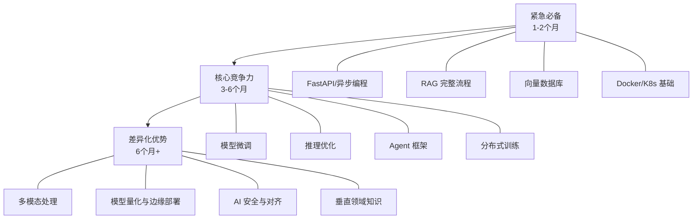

# AI 工程师岗位全景：职责、要求与市场真相

## 市场现状：2026 年的 AI 工程师市场

2025-2026 年，AI 应用开发岗经历了三个关键转变：

1. **从"算法优先"转向"工程优先"**：企业不再需要"会调 API 的 Demo 开发者"，而是需要能支撑生产环境的 AI 系统工程师。全栈 + 大模型复合能力的人才薪资溢价达 30-50%。
2. **从"单点技能"转向"端到端能力"**：只会调 API 不够，要能做 RAG、Agent、微调、部署、运维全链路。
3. **从"通用大模型"转向"垂直场景优化"**：金融、医疗、电商等行业的 AI 落地需要领域知识 + 工程能力的复合型人才。

## 岗位职责（来自 BOSS 直聘 15 条关键要点）

以下是 BOSS 直聘上 AI 应用开发工程师最常见的 15 项岗位职责，按出现频率排序：

| # | 职责 | 频率 | 关键词 |
|---|------|------|--------|
| 1 | 负责 AI 应用前后端开发，涵盖模型集成与 UI 设计 | ★★★★★ | 全栈开发、模型集成 |
| 2 | 设计开发 AI Agent 系统，含 RAG、Prompt、记忆/规划 | ★★★★★ | Agent、RAG、记忆 |
| 3 | 大模型应用落地（智能客服、知识库、报告生成） | ★★★★★ | 落地场景 |
| 4 | 模型优化（Prompt 工程、推理加速、微调方案） | ★★★★☆ | 优化、微调 |
| 5 | 开发模型服务 API，对接其他系统 | ★★★★☆ | API 设计 |
| 6 | 数据处理（采集、清洗、标注、特征工程） | ★★★☆☆ | 数据工程 |
| 7 | 搭建企业知识库（文档解析、分块、向量检索） | ★★★☆☆ | 知识库 |
| 8 | AI 系统部署与维护（私有云/混合云） | ★★★☆☆ | 部署运维 |
| 9 | 多 Agent 协作工作流与业务自动化 | ★★★☆☆ | 多 Agent |
| 10 | 效果迭代（生成质量、响应速度指标优化） | ★★☆☆☆ | 效果优化 |
| 11 | 技术攻坚，解决重点难点问题 | ★★☆☆☆ | 技术攻坚 |
| 12 | 技术文档撰写 | ★★☆☆☆ | 文档 |
| 13 | 行业 AI 解决方案开发 | ★★☆☆☆ | 垂直行业 |
| 14 | 跟踪 AI 前沿（多模态、ReAct、MCP） | ★☆☆☆☆ | 前沿技术 |
| 15 | 跨团队协作 | ★☆☆☆☆ | 协作 |

**核心结论**：AI 工程师不是"算法工程师"。你的核心价值在于**把大模型能力变成可用的产品**，而非训练模型本身。

## 任职要求（来自 BOSS 直聘 15 条关键要点）

| # | 要求 | 必要性 | 对应技能 |
|---|------|--------|----------|
| 1 | 熟练掌握 Python/Java/Go 至少一种后端语言及框架 | 必须 | 后端开发 |
| 2 | 熟悉前端技术栈（React/Vue），全栈优先 | 加分 | 前端开发 |
| 3 | 了解 LLM 基本原理，有 Agent/RAG 开发经验 | 必须 | 大模型基础 |
| 4 | 熟悉 LangChain/LangGraph/Dify 等框架 | 必须 | AI 框架 |
| 5 | 数据库经验（MySQL/PostgreSQL + MongoDB/Redis） | 必须 | 数据库 |
| 6 | 掌握向量数据库原理与使用 | 必须 | 向量数据库 |
| 7 | 熟悉云服务 + Docker/K8s | 必须 | 云原生 |
| 8 | 完整 AI 应用项目经验，0-1 落地能力 | 强加分 | 项目经验 |
| 9 | 了解微调（SFT/RLHF/LoRA）与推理优化 | 加分 | 模型微调 |
| 10 | 技术文档能力，部分要求英语读写 | 加分 | 软技能 |
| 11 | 数据结构、算法、计算机网络基础 | 必须 | 计算机基础 |
| 12 | 低代码/RPA 经验 | 可选 | 低代码 |
| 13 | API 设计与第三方 AI 接口集成 | 必须 | API 集成 |
| 14 | 跨团队沟通与问题解决 | 必须 | 软技能 |
| 15 | AI 技术前沿关注与预研能力 | 加分 | 技术视野 |

## 岗位类型分层

AI 工程师岗位并非铁板一块，不同层级要求差异显著：

### 初级（0-2 年经验 / 15-25K）

- 能调 LLM API，写 Prompt，搭简单 RAG
- 会 Python + FastAPI，基本数据库操作
- 知道向量数据库是什么，能跑通 LangChain Demo
- **典型 JD**："熟悉大模型 API 调用，有 RAG 相关经验"

### 中级（2-5 年经验 / 25-45K）

- 能独立设计 Agent 系统，包含记忆、工具调用、多轮对话
- 掌握 RAG 全流程：文档解析、分块策略、混合检索、重排序
- 理解微调原理，能跑 LoRA 训练
- 具备 Docker/K8s 部署能力
- **典型 JD**："设计开发 AI Agent 系统，有大模型落地经验"

### 高级（5 年+ 经验 / 45-80K+）

- 能主导 AI 系统架构设计，多 Agent 协同编排
- 精通推理优化（vLLM、TensorRT-LLM、量化部署）
- 具备 LLMOps 体系搭建能力
- 能做技术选型决策和团队技术规划
- **典型 JD**："主导 AI 平台架构设计，有大规模模型服务经验"

## 技能优先级矩阵

基于市场需求数据，按紧急程度排序：

## 常见误区

### 误区 1："AI 工程师 = 算法工程师"

**事实**：AI 工程师的核心是**工程能力**，不是算法研究。你需要的是"会用模型"而非"造模型"。绝大多数 AI 应用开发岗不要求你从零训练大模型。

### 误区 2："学会 LangChain 就够了"

**事实**：LangChain 只是工具。面试官关注的是你对 RAG 原理的理解、对 Agent 架构的设计能力、以及生产环境的工程经验。框架会过时，原理不会。

### 误区 3："只要有项目就行"

**事实**：Demo 项目和生产项目之间有天壤之别。面试官会问：你的系统 QPS 多少？延迟多少？怎么处理幻觉？怎么做评估？怎么控制成本？这些问题只有真正做过生产系统才能回答。

### 误区 4："微调是必选项"

**事实**：大多数场景下 RAG + Prompt Engineering 就够了。微调的投入产出比需要仔细评估。但对于特定领域（法律、医疗），微调可能是必要的差异化能力。

---

::: tip 下一步
了解了市场真相后，下一步是建立自己的能力模型 -- 看看你的技能树和岗位要求之间差多远。
:::
