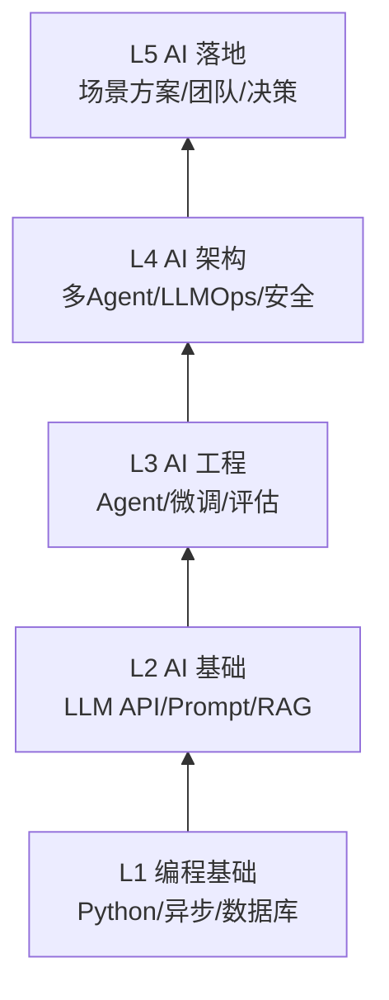
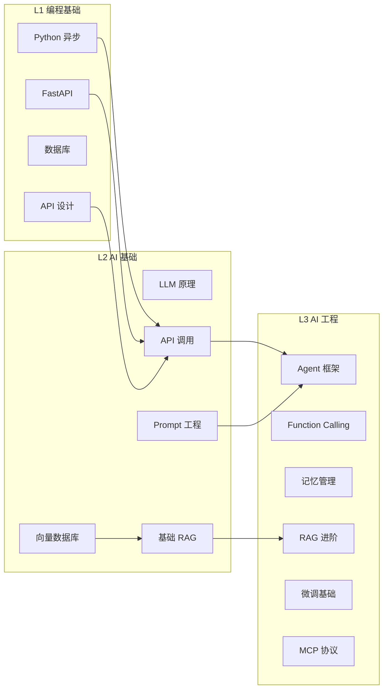

# AI 工程师能力模型：五层技能栈

## 五层技能栈模型

AI 工程师的能力可以从底层到顶层分为五层，每一层都是上层的基石：

## L1：编程基础层

这是 AI 工程师的地基。没有扎实的编程基础，上层技能都是空中楼阁。

### 必备技能

| 技能 | 要求 | 对应 JD |
|------|------|---------|
| Python 异步编程 | 理解 async/await、协程、事件循环 | "熟练掌握 Python" |
| FastAPI | 能写异步 API、中间件、依赖注入 | "及对应开发框架" |
| 数据库 | MySQL/PostgreSQL + Redis 基础操作 | "数据库应用经验" |
| API 设计 | RESTful 设计、OpenAPI 文档 | "API 设计与开发能力" |
| Git 工作流 | 分支策略、Code Review、CI/CD 基础 | "版本管理" |
| 数据结构与算法 | 排序、查找、树、图基础 | "扎实基础技术知识" |

### 检验标准

- 能独立写一个带认证、限流、数据库的 FastAPI 服务
- 能解释 Python GIL、asyncio 事件循环、Redis 为什么快
- 能在白板上写二分查找和 BFS

## L2：AI 基础层

这是 AI 工程师区别于普通后端工程师的关键层。

### 必备技能

| 技能 | 要求 | 对应 JD |
|------|------|---------|
| LLM 原理 | Token、上下文窗口、Temperature、采样策略 | "了解大模型基本原理" |
| LLM API 调用 | OpenAI / Claude / 国内模型 API，流式响应 | "有大模型 API 经验" |
| Prompt Engineering | 角色、Few-Shot、CoT、结构化输出 | "Prompt 工程" |
| 基础 RAG | 向量化、向量数据库、相似度检索、基础问答 | "RAG 相关开发经验" |
| 向量数据库 | Milvus/Chroma/FAISS 的使用与选型 | "向量数据库原理" |
| Embedding 模型 | 理解文本向量化、维度、余弦相似度 | "知识库构建经验" |

### 检验标准

- 能从零搭建一个 RAG 问答系统，支持 PDF 文档导入
- 能解释 BM25 和向量检索的区别，为什么需要混合检索
- 能说出 3 种以上 Prompt 注入攻击方式及防御方法

## L3：AI 工程层

这是从"会调 API"到"能做产品"的分水岭。

### 必备技能

| 技能 | 要求 | 对应 JD |
|------|------|---------|
| Agent 框架 | LangChain/LangGraph 的核心概念与使用 | "熟悉 LangChain 等框架" |
| Function Calling | 工具定义、参数校验、错误处理 | "AI Agent 开发经验" |
| 记忆管理 | 短期记忆、长期记忆、记忆压缩 | "Agent 记忆/规划模块" |
| RAG 进阶 | 混合检索、重排序、查询改写、评估 | "RAG 检索增强" |
| 微调基础 | LoRA/QLoRA 原理与实操 | "了解模型微调" |
| MCP 协议 | 工具协议标准、MCP Server 开发 | "MCP 等前沿技术" |

### 检验标准

- 能设计一个带记忆、工具调用、多轮对话的 Agent
- 能解释 ReAct 和 Plan-and-Execute 的区别与适用场景
- 能跑通一个 LoRA 微调并评估效果

## L4：AI 架构层

这是高级 AI 工程师的核心能力，决定了你能否独立负责一个 AI 系统。

### 必备技能

| 技能 | 要求 | 对应 JD |
|------|------|---------|
| 多 Agent 系统 | 编排、路由、监督、协作模式 | "多 Agent 协作" |
| LLMOps | 模型评估、监控、版本管理、A/B 测试 | "效果迭代优化" |
| 推理优化 | vLLM、量化、批处理、缓存 | "推理加速" |
| 安全与合规 | Prompt 注入防护、输出过滤、审计日志 | "AI 安全" |
| 分布式部署 | K8s GPU 调度、HPA、服务网格 | "容器化技术" |
| 成本控制 | Token 经济学、模型路由、缓存策略 | "成本优化" |

### 检验标准

- 能设计一个支持 1000 QPS 的模型推理服务架构
- 能建立从数据到模型到效果的完整评估流水线
- 能说出 5 种以上降低 AI 系统运营成本的方法

## L5：AI 落地层

这是从工程师到架构师/技术负责人的跨越，核心是业务理解与技术决策。

### 必备技能

| 技能 | 要求 | 对应 JD |
|------|------|---------|
| 场景方案 | 智能客服、知识库、报告生成等落地方案 | "深入业务场景" |
| 技术选型 | 框架、模型、基础设施的选型决策 | "技术方案设计" |
| 团队协作 | 与产品、数据科学家、前端协作 | "跨团队协作" |
| 项目管理 | 需求分析、技术规划、风险控制 | "项目落地能力" |
| 行业知识 | 金融/医疗/电商等垂直领域 AI 方案 | "行业解决方案" |
| 前沿洞察 | 多模态、Agent 生态、AI 安全等趋势 | "前沿技术" |

### 检验标准

- 能独立完成一个 AI 项目的需求分析到上线全流程
- 能为不同业务场景选择最合适的技术方案
- 能在技术评审中说服团队接受你的架构方案

## 技能依赖关系

## 与传统后端工程师的差异

| 维度 | 传统后端工程师 | AI 工程师 |
|------|---------------|-----------|
| 输出确定性 | 确定性（相同输入 = 相同输出） | 概率性（相同输入 ≠ 相同输出） |
| 测试方式 | 单元测试、集成测试 | 评估集、LLM-as-Judge、人工评估 |
| 性能指标 | QPS、延迟、可用性 | + Token/s、TTFB、幻觉率 |
| 运维重点 | 服务稳定性 | + 模型质量、Token 成本、Prompt 版本 |
| 核心挑战 | 并发、一致性、扩展性 | + 幻觉、上下文窗口、成本控制 |
| 技术栈差异 | API + DB + Cache | + LLM API + 向量库 + Agent 框架 |

---

::: tip 下一步
对照五层技能栈，评估你当前处于哪一层，以及到目标岗位还差什么。下一篇将提供具体的技能差距诊断方法。
:::
