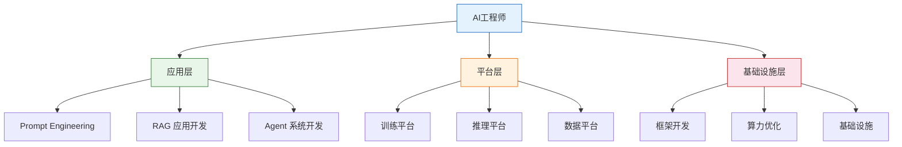
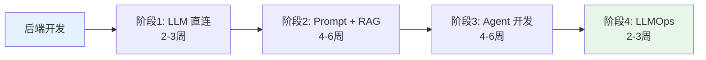
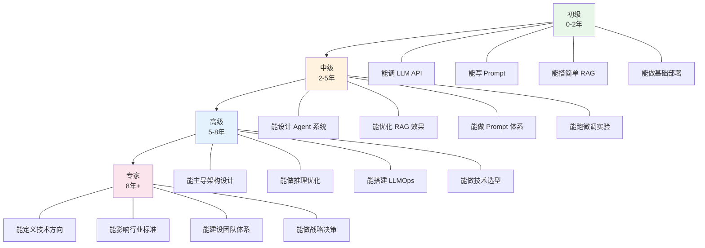

# AI工程师职业路径

AI工程师并非单一岗位，而是覆盖从应用层到基础设施层的完整技术栈。选择不同的路径意味着不同的技能侧重、成长节奏和职业天花板。本文拆解三条核心路径，帮助你在入行之初就做出清晰的选择。

## 三条核心路径

### 应用层：Prompt / RAG / Agent 应用开发

**定位**：将大模型能力转化为可用的产品功能，是需求量最大、入门门槛最低的方向。

**核心技能**：

| 技能 | 优先级 | 说明 |
|------|--------|------|
| Prompt Engineering | 必须 | 结构化 Prompt、Few-Shot、CoT、防幻觉 |
| RAG 全流程 | 必须 | 文档解析、分块、向量检索、重排序、评估 |
| Agent 开发 | 必须 | LangGraph/LangChain、Function Calling、记忆管理 |
| 后端开发 | 必须 | Python/FastAPI、异步编程、API 设计 |
| 向量数据库 | 必须 | Milvus/Chroma/Weaviate 使用与调优 |
| LLMOps | 加分 | Prompt 版本管理、A/B 测试、可观测性 |

**典型岗位**：

- AI 应用开发工程师（15-35K）
- RAG 系统工程师（20-40K）
- Agent 开发工程师（25-45K）
- AI 产品工程师（20-40K）

**优势**：岗位数量多，转型门槛低，行业选择面广
**劣势**：技术壁垒相对较低，框架迭代快，需持续学习

### 平台层：训练 / 推理 / 数据平台

**定位**：为 AI 应用提供基础设施支撑，构建模型训练、推理服务、数据管线的平台工程。

**核心技能**：

| 技能 | 优先级 | 说明 |
|------|--------|------|
| 分布式训练 | 必须 | DeepSpeed/Megatron、多 GPU 训练策略 |
| 推理优化 | 必须 | vLLM/TensorRT-LLM、量化部署、KV Cache 优化 |
| 数据工程 | 必须 | 数据采集、清洗、标注管线、特征工程 |
| 平台工程 | 必须 | K8s、GPU 调度、任务编排、资源管理 |
| 微调技术 | 必须 | SFT/LoRA/QLoRA 训练流程与评估 |
| 监控运维 | 加分 | GPU 监控、训练追踪、推理指标 |

**典型岗位**：

- ML 平台工程师（30-60K）
- 推理优化工程师（35-65K）
- 数据平台工程师（25-50K）
- MLOps 工程师（30-55K）

**优势**：技术壁垒高，薪资溢价大，职业路径稳定
**劣势**：岗位集中在头部公司，对系统底层能力要求高

### 基础设施层：框架 / 算力 / 基础设施

**定位**：构建 AI 生态的底层支撑，包括模型框架、算力调度、硬件适配等。

**核心技能**：

| 技能 | 优先级 | 说明 |
|------|--------|------|
| 深度学习框架 | 必须 | PyTorch/JAX 源码级理解、算子开发 |
| CUDA 编程 | 必须 | GPU 内核优化、显存管理、算子融合 |
| 系统编程 | 必须 | C++/Rust、高性能计算、内存管理 |
| 算力架构 | 加分 | GPU 集群调度、RDMA/NCCL 通信优化 |
| 编译优化 | 加分 | TVM/XLA/MLIR 图编译与算子优化 |

**典型岗位**：

- AI 框架开发工程师（40-80K+）
- GPU 算法工程师（45-80K+）
| AI 基础设施工程师（35-70K+）

**优势**：天花板极高，技术不可替代性强
**劣势**：岗位稀缺，学习曲线陡峭，门槛最高

## 三条路径对比

| 维度 | 应用层 | 平台层 | 基础设施层 |
|------|--------|--------|------------|
| 入门门槛 | 低 | 中-高 | 高 |
| 岗位数量 | 多 | 中 | 少 |
| 薪资范围 | 15-45K | 25-65K | 35-80K+ |
| 技术壁垒 | 低-中 | 高 | 极高 |
| 行业选择 | 全行业 | 头部科技/金融 | 头部科技/AI 公司 |
| 技术迭代速度 | 快（框架半年一换） | 中 | 慢（底层相对稳定） |
| 远程可能性 | 高 | 中 | 低 |
| 35岁风险 | 中 | 低 | 极低 |
| 核心竞争力 | 业务理解+工程落地 | 系统设计+性能优化 | 底层原理+极致性能 |

## 转型策略

### 从后端开发转型

**转型优势**：Python/FastAPI、API 设计、数据库、Docker/K8s 基础已具备

**转型路径**：

1. **阶段 1（2-3 周）**：学习 LLM API 调用、流式响应、Token 管理。产出：带记忆的聊天 CLI
2. **阶段 2（4-6 周）**：系统学习 Prompt Engineering + RAG 全流程。产出：知识库问答系统
3. **阶段 3（4-6 周）**：掌握 Agent 开发（LangGraph + Function Calling）。产出：带工具的 Agent
4. **阶段 4（2-3 周）**：补充 LLMOps（Prompt 版本管理、评估、可观测性）。产出：可投简历的项目集

**目标岗位**：AI 应用开发工程师、RAG 系统工程师

### 从数据工程转型

**转型优势**：数据管线、ETL、SQL、分布式计算基础已具备

**转型路径**：

1. **阶段 1（2-3 周）**：学习向量数据库、Embedding 原理、相似度检索
2. **阶段 2（4-6 周）**：深入 RAG 系统（文档解析、分块策略、混合检索）
3. **阶段 3（4-6 周）**：数据标注管线 + 微调数据准备 + SFT 实操
4. **阶段 4（3-4 周）**：ML 平台工程（训练任务编排、特征存储、模型注册）

**目标岗位**：ML 平台工程师、数据平台工程师（AI 方向）

### 从算法工程师转型

**转型优势**：模型原理、数学基础、实验方法论已具备

**转型路径**：

1. **阶段 1（2 周）**：补强工程能力（FastAPI、Docker、K8s 基础）
2. **阶段 2（3-4 周）**：RAG 系统工程化（从能跑 Demo 到能上生产）
3. **阶段 3（4-6 周）**：推理优化（vLLM 部署、量化、KV Cache 优化）
4. **阶段 4（3-4 周）**：平台工程（GPU 调度、分布式训练、模型服务化）

**目标岗位**：推理优化工程师、ML 平台工程师

## 能力跃迁图

### 各层级关键标志

**初级 -> 中级的跃迁标志**：

- 从"调 API"到"设计系统"：不再只写单次调用，能设计完整的数据流和错误处理
- 从"跑通 Demo"到"生产可用"：关注延迟、可靠性、成本，而不只是功能实现
- 从"抄 Prompt"到"设计 Prompt"：能根据业务需求系统性设计 Prompt 策略

**中级 -> 高级的跃迁标志**：

- 从"使用框架"到"理解原理"：能解释 LangChain 的回调机制、vLLM 的 PagedAttention
- 从"单系统"到"多系统协同"：能设计 RAG + Agent + 微调的组合方案
- 从"执行需求"到"定义方案"：能根据业务场景选择技术路线，而非被动实现

**高级 -> 专家的跃迁标志**：

- 从"解决已知问题"到"发现未知问题"：能预判系统瓶颈，提前做架构调整
- 从"技术深度"到"行业影响"：输出技术标准、开源贡献、行业分享
- 从"个人贡献"到"体系构建"：建立团队方法论、培养梯队、推动组织演进

## 薪资参考（2026 年一线城市）

| 层级 | 应用层 | 平台层 | 基础设施层 |
|------|--------|--------|------------|
| 初级（0-2年） | 15-25K | 20-30K | 25-35K |
| 中级（2-5年） | 25-45K | 30-55K | 35-60K |
| 高级（5-8年） | 40-65K | 50-70K | 55-80K |
| 专家（8年+） | 60-100K+ | 70-120K+ | 80-150K+ |

> 注：以上为月薪参考范围，不含期权和年终奖。头部公司和大模型创业公司有明显溢价。

## 职业选择的关键决策点

### 决策 1：选路径还是选公司？

- **大厂**：平台层和基础设施层的机会更多，内部有完整的 ML Infra 团队
- **创业公司**：应用层占主导，要求全栈能力，一人搞定从 Prompt 到部署
- **传统企业**：应用层为主，看重行业经验和业务理解，技术要求相对低

### 决策 2：通才还是专才？

- **应用层建议通才**：RAG + Agent + Prompt + 部署都能做，覆盖面决定机会面
- **平台层建议 T 型**：在推理优化或训练平台一个方向深扎，同时了解全链路
- **基础设施层建议专才**：在一个细分领域做到极致，如 GPU 算子优化或分布式通信

### 决策 3：何时转型？

- **后端/数据转 AI**：越早越好，AI 应用层的门槛正在快速降低，红利期有限
- **算法转 AI 工程**：时机已到，市场对"会训练不会部署"的纯算法需求在萎缩
- **应届生**：建议从应用层入行，积累 1-2 年经验后再决定是否向平台层/基础设施层迁移

---

::: tip 核心原则
选择路径的本质是选择你的能力护城河。应用层靠业务理解 + 工程效率建立壁垒，平台层靠系统设计 + 性能优化建立壁垒，基础设施层靠底层原理 + 极致性能建立壁垒。没有最好的路径，只有最适合你的路径。
:::
