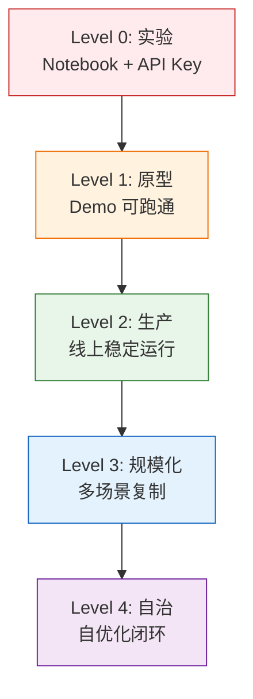

# AI工程成熟度模型

你的 AI 系统是实验级的玩具，还是生产级的产品？很多团队以为把 Demo 跑通就等于"上线了"，实际上从 Demo 到生产之间隔着巨大的工程鸿沟。AI 工程成熟度模型提供了一套清晰的评估框架，帮助团队定位当前水平、识别关键差距、规划升级路径。

## 五级成熟度模型

### Level 0：实验

**特征**：在 Jupyter Notebook 中用 API Key 直接调用 LLM，验证某个想法是否可行。

**关键能力**：

- 能调用 OpenAI/DeepSeek API
- 能写基本的 Prompt 获取结果
- 能在本地跑通一个简单的问答 Demo

**技术栈**：

- Python + Jupyter Notebook
- OpenAI SDK / HTTP 请求
- 基础 Prompt Engineering

**团队特征**：

- 1-2 人探索性尝试
- 无正式流程，个人驱动
- 没有版本管理意识

**典型场景**：技术预研、概念验证、学习实践

### Level 1：原型

**特征**：Demo 可跑通，有基本的用户界面，能展示核心功能，但不能处理异常情况。

**关键能力**：

- 能搭建完整的 RAG 问答系统
- 能做基本的 Prompt 管理
- 能处理流式响应
- 能用向量数据库做相似度检索

**技术栈**：

- FastAPI / Flask 后端
- LangChain / LlamaIndex 框架
- Chroma / FAISS 向量数据库
- Streamlit / Gradio 前端 Demo
- Docker 单容器部署

**团队特征**：

- 2-3 人小组
- 有基本的代码审查
- 使用 Git 但无分支策略
- 手动测试为主

**典型场景**：内部试用、投资人演示、MVP 验证

### Level 2：生产

**特征**：系统在线上稳定运行，有监控告警、错误处理、基本的安全防护，能服务真实用户。

**关键能力**：

- 能设计高可用的模型服务架构
- 能做 Prompt 版本管理与 A/B 测试
- 能实现防幻觉和输出校验
- 能搭建基本的可观测性（日志、指标、追踪）
- 能做成本监控与控制

**技术栈**：

- Kubernetes 容器编排
- vLLM / TensorRT-LLM 推理服务
- Milvus / Weaviate 生产级向量数据库
- PostgreSQL + Redis 持久化
- Prometheus + Grafana 监控
- OpenTelemetry 分布式追踪

**团队特征**：

- 3-5 人专职团队
- 有 CI/CD 流水线
- 有 Prompt 变更审批流程
- 有 On-call 轮值机制
- 定期做效果评估

**典型场景**：企业知识库、智能客服、内容审核

### Level 3：规模化

**特征**：单场景验证成功后，能在多个业务场景快速复制，有标准化的接入流程和评估体系。

**关键能力**：

- 能设计多场景统一接入的 AI 平台
- 能做跨场景的 Prompt 模板化与配置化
- 能建立标准化的 RAG 评估基准
- 能做模型路由（根据请求选择最优模型）
- 能实现灰度发布和效果对比

**技术栈**：

- AI 平台层（模型注册、配置中心、网关路由）
- 标准化数据接入管线（多源文档解析）
- 统一评估框架（RAGAS + LLM-as-Judge）
- 特征存储与模型版本管理
- 自动化评估与回归测试

**团队特征**：

- 5-10 人平台团队 + 各业务线接入
- 有标准化接入文档和 SDK
- 有 SRE 保障 SLA
- 定期做跨场景效果 Review
- 有知识沉淀与分享机制

**典型场景**：集团级 AI 平台、多业务线 AI 能力复用

### Level 4：自治

**特征**：系统能自动检测效果退化、自动优化 Prompt、自动更新索引，形成自优化闭环。

**关键能力**：

- 能自动检测效果退化并触发优化
- 能自动做 Prompt 优化（DSPy 等框架）
- 能自动更新索引和知识库
- 能基于用户反馈自动调整检索策略
- 能做 Self-RAG / Adaptive RAG 的自适应检索

**技术栈**：

- 自动 Prompt 优化引擎（DSPy / OPRO）
- 在线学习与反馈闭环管线
- 自动化效果回归测试
- 自适应检索决策器
- 全链路自动化运维

**团队特征**：

- 10+ 人专业 AI 平台团队
- 有 AI 效果运营角色
- 自动化率 > 80%
- 系统自愈能力
- 数据飞轮效应

**典型场景**：头部互联网公司的 AI 中台、自进化的智能客服系统

## 各级别关键指标对比

| 维度 | Level 0 | Level 1 | Level 2 | Level 3 | Level 4 |
|------|---------|---------|---------|---------|---------|
| 可用性 | 无保证 | 手动验证 | 99.5% | 99.9% | 99.95% |
| 延迟 | 不关注 | 基本可用 | P99 < 3s | P99 < 1s | 自适应优化 |
| 幻觉率 | 未监控 | 偶尔检查 | < 10% | < 5% | < 2% |
| 部署方式 | 本地运行 | Docker 单容器 | K8s 多副本 | 多集群 | 自动弹性 |
| 监控 | 无 | 简单日志 | 指标+告警 | 全链路追踪 | 自动化巡检 |
| 评估 | 人工看几条 | 抽样检查 | 自动化评估 | 持续评估+回归 | 自优化闭环 |
| 成本控制 | 无 | 关注但不系统 | Token 级监控 | 模型路由优化 | 自适应成本优化 |
| 安全 | API Key 明文 | 基本认证 | Prompt 注入防护 | 全链路安全 | 自动安全检测 |
| 迭代周期 | 不定 | 周/月级 | 天级 | 小时级 | 自动触发 |

## 自检清单

### 工程能力维度

- [ ] 代码有版本管理，有分支策略
- [ ] 有 CI/CD 流水线，变更经过自动化测试
- [ ] 有容器化部署，环境可复现
- [ ] 有配置中心，Prompt 与代码分离管理
- [ ] 有灰度发布能力，变更可回滚

### 可靠性维度

- [ ] 有超时和重试机制，不会因 LLM 超时导致系统卡死
- [ ] 有降级策略（模型故障时能切换备选模型）
- [ ] 有输出校验，防止格式错误和明显幻觉
- [ ] 有熔断机制，异常流量不会击穿后端
- [ ] 有数据备份和灾难恢复方案

### 可观测性维度

- [ ] 有结构化日志，能追踪单次请求全链路
- [ ] 有核心指标看板（延迟、QPS、Token 消耗、错误率）
- [ ] 有告警机制，异常时能第一时间通知
- [ ] 有 Prompt 变更追踪，能关联变更与效果
- [ ] 有成本分析，知道每个功能/场景的 Token 消耗

### 效果评估维度

- [ ] 有标准测试集，能自动化评估回答质量
- [ ] 有 RAG 评估指标（Faithfulness / Relevancy / Recall）
- [ ] 有 A/B 测试能力，能对比不同 Prompt/模型的效果
- [ ] 有用户反馈收集机制（点赞/踩、纠正）
- [ ] 有效果回归测试，变更后自动跑评估

### 安全维度

- [ ] API Key 有加密存储，不在代码中明文暴露
- [ ] 有 Prompt 注入检测与防护
- [ ] 有敏感信息脱敏机制
- [ ] 有访问控制和审计日志
- [ ] 有输出内容安全过滤

## 升级路径与关键里程碑

### Level 0 -> Level 1：从实验到原型

**时间**：2-4 周

**关键里程碑**：

1. 从 Notebook 迁移到独立 Python 服务
2. 接入向量数据库，完成基础 RAG 流程
3. 添加基本的错误处理和重试逻辑
4. 用 Streamlit/Gradio 搭建交互界面

**常见卡点**：把所有逻辑写在 Notebook 里，不愿重构为工程化代码

### Level 1 -> Level 2：从原型到生产

**时间**：1-3 个月

**关键里程碑**：

1. 容器化部署 + K8s 编排
2. 搭建可观测性（日志 + 指标 + 告警）
3. 实现防幻觉和输出校验机制
4. Prompt 版本管理与 A/B 测试
5. 成本监控与 Token 级核算

**常见卡点**：认为"功能完成了"就等于"可以上线了"，忽视可靠性和可观测性

### Level 2 -> Level 3：从生产到规模化

**时间**：3-6 个月

**关键里程碑**：

1. 抽象通用的 AI 能力层，支持多场景接入
2. 建立标准化的文档接入管线
3. 构建统一的评估框架和基准测试
4. 实现模型路由和智能调度
5. 建立接入文档和 SDK

**常见卡点**：每个场景都从头搭建，缺少平台化思维

### Level 3 -> Level 4：从规模化到自治

**时间**：6-12 个月

**关键里程碑**：

1. 建立自动效果监控与退化检测
2. 实现自动 Prompt 优化闭环
3. 构建自适应检索策略（Self-RAG / Adaptive RAG）
4. 建立用户反馈驱动的自动优化管线
5. 实现数据飞轮：更多用户 -> 更多反馈 -> 更好效果

**常见卡点**：过度追求自动化而忽视人工兜底，导致自动优化方向偏移

## 行业对标

| 企业类型 | 典型等级 | 说明 |
|----------|----------|------|
| 个人开发者/小团队 | L0-L1 | 资源有限，专注单场景验证 |
| 初创公司（Pre-A） | L1-L2 | 需要快速验证产品，工程化基础薄弱 |
| 成长型公司（B轮+） | L2-L3 | 有专职 AI 团队，开始平台化建设 |
| 大厂 AI 业务线 | L3-L4 | 有完整的 AI 平台，追求规模化复制 |
| 头部 AI 公司 | L4 | 自优化闭环，数据飞轮效应 |

### 不同规模企业的升级建议

**10 人以下团队**：不要追求 L3+，集中精力把一个场景做到 L2 的极致。选择一个最有业务价值的场景，把可靠性、效果、成本都做到位。

**10-50 人团队**：在 L2 稳定后，开始抽象通用能力。但不要过早平台化，先在 2-3 个场景中验证通用性，再提取平台层。

**50+ 人团队**：有条件追求 L3-L4。关键是建立评估体系和反馈闭环，否则规模化只会放大问题。

## 常见误区

### 误区 1：跳级建设

很多团队在 L1 还没做好的时候就开始规划 L3 的平台化。结果是平台搭了一半，基础场景还在频繁出故障。

**正确做法**：每升一级，前一级的核心能力必须稳固。L2 是分水岭，只有生产稳定性达标后，规模化才有意义。

### 误区 2：只关注功能，忽视评估

功能实现了不等于效果达标。没有评估体系的 AI 系统，根本不知道自己好不好。

**正确做法**：每个等级都建立对应的评估基准。L1 靠人工看几十条，L2 靠自动化评估几百条，L3 靠持续评估+回归测试。

### 误区 3：忽视成本

很多团队到了 L2 才发现 Token 费用远超预期，被迫做紧急的成本优化。

**正确做法**：从 L1 开始就监控 Token 消耗。在 Prompt 设计阶段就考虑成本，而非上线后才补救。

---

::: tip 核心原则
成熟度不是目标，而是手段。不要为了升级而升级，每一级的提升都应以业务价值为驱动。L2 是绝大多数团队的合理目标，L3-L4 需要业务规模和团队资源的支撑。先做到"稳定可用"，再追求"规模化"和"自动化"。
:::
