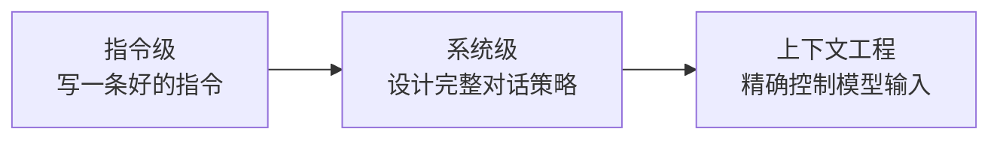

# Prompt 工程体系：从写指令到上下文工程

## Prompt 工程的三个段位



### 段位一：指令级（1 周）

掌握写好一条 Prompt 的基本技巧。

**核心技巧**：

| 技巧 | 说明 | 示例 |
|------|------|------|
| 角色设定 | 明确模型身份与能力边界 | `你是一位资深 Python 工程师，擅长代码审查` |
| 任务描述 | 清晰、具体、无歧义 | `请从以下代码中找出性能问题` |
| 输出格式 | 指定输出的结构 | `请以 JSON 格式输出，包含字段：issue, severity, fix` |
| Few-Shot | 提供输入输出示例 | 给出 2-3 个正确示例 |
| CoT | 引导分步推理 | `请一步步分析` |

**实操练习**：

```python
from openai import OpenAI

client = OpenAI(api_key="your-key", base_url="https://api.deepseek.com")

# 基础 Prompt
response = client.chat.completions.create(
    model="deepseek-chat",
    messages=[
        {"role": "system", "content": "你是一位代码审查专家。请用 JSON 格式输出，字段：issue, severity, suggestion"},
        {"role": "user", "content": """
请审查以下代码：

def get_user(id):
    user = db.query("SELECT * FROM users WHERE id = " + id)
    return user

请找出安全问题和性能问题。
"""}
    ],
    response_format={"type": "json_object"}
)
```

### 段位二：系统级（2 周）

设计完整的对话策略，包含多轮交互、错误恢复、输出约束。

**系统 Prompt 模板**：

```python
SYSTEM_PROMPT = """你是一个企业知识库助手。

## 身份
你是 {company_name} 的内部知识库助手，帮助员工查询公司制度、流程和规范。

## 能力边界
- 只回答基于知识库的问题
- 不确定的回答要明确说明
- 涉及敏感信息（薪资、个人数据）时提醒联系 HR

## 输出格式
- 正面回答：直接给出答案 + 来源引用
- 不确定回答：给出可能的答案 + 置信度 + 建议人工确认
- 超出范围：说明边界 + 引导到正确渠道

## 回答原则
1. 优先引用最新版本的制度文档
2. 涉及金额、日期等关键信息时格外谨慎
3. 如果多个制度有冲突，列出所有相关文档
"""
```

### 段位三：上下文工程（3 周+）

上下文工程（Context Engineering）是 Prompt 工程的进化形态。核心思想是：**在恰当的时机，以恰当的格式，向模型传递恰当的信息**。

```python
def build_context(
    query: str,
    retrieved_docs: list[str],
    conversation_history: list[dict],
    user_profile: dict | None = None,
    max_tokens: int = 4000,
) -> list[dict]:
    """构建最优上下文窗口"""
    messages = []

    # 1. 系统 Prompt（始终在最前面）
    messages.append({"role": "system", "content": SYSTEM_PROMPT})

    # 2. 用户画像（如果有）
    if user_profile:
        messages.append({
            "role": "system",
            "content": f"用户信息：部门={user_profile['dept']}, 角色={user_profile['role']}"
        })

    # 3. 检索到的文档（优先级排序后注入）
    if retrieved_docs:
        doc_text = "\n\n".join(f"[文档{i+1}] {doc}" for i, doc in enumerate(retrieved_docs))
        messages.append({"role": "system", "content": f"参考资料：\n{doc_text}"})

    # 4. 对话历史（智能压缩）
    compressed_history = compress_conversation(conversation_history, max_tokens - len(doc_text))
    messages.extend(compressed_history)

    # 5. 当前查询
    messages.append({"role": "user", "content": query})

    return messages
```

## 关键设计模式

### 模式 1：结构化输出约束

```python
from pydantic import BaseModel
from openai import OpenAI

class CodeReview(BaseModel):
    issues: list[Issue]
    summary: str
    risk_level: str  # high / medium / low

class Issue(BaseModel):
    line: int
    type: str  # security / performance / style
    description: str
    suggestion: str

client = OpenAI()
response = client.beta.chat.completions.parse(
    model="gpt-4o",
    messages=[{"role": "user", "content": "审查以下代码..."}],
    response_format=CodeReview,
)
```

### 模式 2：多轮对话状态管理

```python
class ConversationManager:
    def __init__(self, max_history_tokens: int = 2000):
        self.messages: list[dict] = []
        self.max_history_tokens = max_history_tokens

    def add_user_message(self, content: str):
        self.messages.append({"role": "user", "content": content})

    def add_assistant_message(self, content: str):
        self.messages.append({"role": "assistant", "content": content})

    def get_messages(self, system_prompt: str | None = None) -> list[dict]:
        result = []
        if system_prompt:
            result.append({"role": "system", "content": system_prompt})

        # 智能压缩：保留最近的对话，压缩早期的
        compressed = self._compress_history()
        result.extend(compressed)
        return result

    def _compress_history(self) -> list[dict]:
        """保留最近 N 轮对话，早期对话压缩为摘要"""
        if self._estimate_tokens() <= self.max_history_tokens:
            return self.messages

        # 保留最近 4 轮
        recent = self.messages[-8:]
        older = self.messages[:-8]

        if older:
            # 将早期对话压缩为一条系统消息
            summary = self._summarize(older)
            return [
                {"role": "system", "content": f"之前的对话摘要：{summary}"},
                *recent
            ]
        return recent
```

### 模式 3：防幻觉设计

```python
HALLUCINATION_GUARD = """回答规则：
1. 只基于提供的参考资料回答
2. 如果参考资料中没有相关信息，明确回答"根据现有资料无法确认"
3. 不要编造数据、人名、日期
4. 引用来源时标注文档编号
5. 对于涉及金额、法律条款的内容，提醒用户核实原文
"""
```

## 避坑指南

### 坑 1：Prompt 越长越好

**事实**：Prompt 长度和输出质量呈倒 U 型关系。过长会增加噪声、增加成本、增加延迟。核心是**信息密度**，而非长度。

### 坑 2：Few-Shot 示例随便写

**事实**：示例的质量直接决定输出质量。每个示例都要经过审查，确保格式正确、内容准确、风格一致。

### 坑 3：忽略 System Prompt

**事实**：System Prompt 是最稳定的行为控制手段。把核心约束放在 System Prompt 里，比放在 User 消息里可靠得多。

---

::: tip 实践建议
从段位一开始，每个段位至少完成 3 个实际任务（信息抽取、分类、生成）。段位一的投入产出比最高，2-3 天就能见效。
:::
