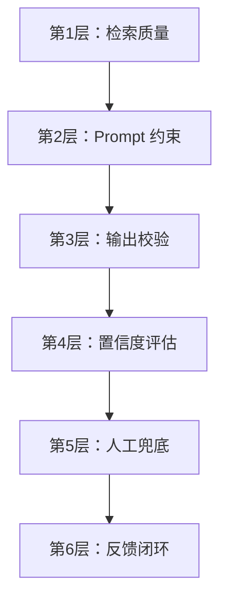

# 防幻觉与可靠性设计

## 幻觉的本质

LLM 幻觉（Hallucination）是指模型生成看似合理但实际错误的内容。在 RAG 场景中主要分为三类：

| 类型 | 说明 | 示例 |
|------|------|------|
| 事实性幻觉 | 编造不存在的事实 | 虚构的公司制度条款 |
| 忠实性幻觉 | 回答不基于检索内容 | 检索文档说 A，回答却说 B |
| 逻辑性幻觉 | 推理链条出错 | 错误的因果推理 |

## 六层防御体系



### 第 1 层：检索质量（源头控制）

幻觉的根源往往是检索质量差。如果检索到的文档就不对，模型再怎么约束也会出错。

```python
def retrieve_with_quality_check(query: str, top_k: int = 5) -> list[dict]:
    """带质量检查的检索"""
    results = vector_store.search(query, top_k=top_k)

    # 过滤相似度过低的结果
    filtered = [r for r in results if r["score"] >= 0.6]

    if not filtered:
        return []  # 无相关文档，不应生成回答

    # 去重：同一文档的不同片段可能被多次召回
    seen_docs = set()
    deduped = []
    for r in filtered:
        doc_id = r["metadata"]["doc_id"]
        if doc_id not in seen_docs:
            seen_docs.add(doc_id)
            deduped.append(r)

    return deduped
```

### 第 2 层：Prompt 约束（行为控制）

```python
ANTI_HALLUCINATION_PROMPT = """## 回答规则（必须严格遵守）

1. **只基于提供的参考资料回答**，不要使用任何外部知识
2. 如果参考资料中没有相关信息，回答"根据现有资料无法回答此问题"
3. 引用具体内容时，标注来源文档编号，如 [文档1]
4. 不要编造具体数字、日期、人名、金额
5. 如果多个文档信息冲突，列出所有版本并标注来源
6. 对于"是否"、"有没有"类问题，资料中有则答是，没有则答"资料中未提及"

## 禁止行为
- ❌ 推测或推理参考资料中没有的信息
- ❌ 用通用知识补充回答
- ❌ 编造具体数据
"""
```

### 第 3 层：输出校验（自动检测）

```python
def validate_response(response: str, retrieved_docs: list[str]) -> dict:
    """验证回答是否忠于检索内容"""
    issues = []

    # 1. 检查免责声明：仅在简短回答时视为可靠信号
    #    长回答中"无法"后可能仍有编造细节，需额外检查
    disclaimer_keywords = ["无法", "未提及", "不确定", "没有相关信息"]
    has_disclaimer = any(kw in response for kw in disclaimer_keywords)

    if has_disclaimer and len(response) < 100:
        # 简短免责声明 → 大概率忠实
        return {"faithful": True, "confidence": "high", "issues": []}
    elif has_disclaimer:
        # 免责声明 + 较长内容 → 检查是否在声明后编造了细节
        issues.append("免责声明后可能包含编造细节，需人工复核")

    # 2. 检查引用标注
    has_citations = bool(re.search(r'\[文档\d+\]', response))
    if not has_citations:
        issues.append("缺少来源引用")

    # 3. 检查具体数字是否在原文中出现（只检查上下文中的数据性数字）
    data_number_pattern = r'(?:约|大约|共计|达到|超过|为|占|约)\s*(\d+\.?\d*\s*[%万亿元万]?)'
    data_numbers = re.findall(data_number_pattern, response)
    for num in data_numbers:
        num_clean = re.sub(r'[%万亿元万]', '', num).strip()
        in_source = any(num_clean in doc for doc in retrieved_docs)
        if not in_source and len(num_clean) >= 2:
            issues.append(f"数据 {num} 未在参考资料中出现")

    # 4. 用 LLM 做忠实性检查
    faithfulness = check_faithfulness_llm(response, retrieved_docs)
    if not faithfulness["is_faithful"]:
        issues.extend(faithfulness["violations"])

    return {
        "faithful": len(issues) == 0 and faithfulness["is_faithful"],
        "confidence": "low" if issues else "high",
        "issues": issues,
    }

def check_faithfulness_llm(response: str, docs: list[str]) -> dict:
    """用 LLM 检查回答是否忠于检索内容"""
    check_prompt = f"""请检查以下回答是否严格基于提供的参考资料。

参考资料：
{chr(10).join(docs)}

回答：
{response}

请判断回答中是否有任何信息不在参考资料中。只回答 JSON：
{{"is_faithful": true/false, "violations": ["具体违规描述"]}}"""

    result = llm_call(check_prompt)
    return json.loads(result)
```

### 第 4 层：置信度评估

```python
def assess_confidence(query: str, response: str, docs: list[dict]) -> str:
    """评估回答的置信度"""
    # 检索相似度
    max_score = max(d["score"] for d in docs) if docs else 0
    # 引用数量
    citation_count = len(re.findall(r'\[文档\d+\]', response))
    # 是否包含不确定表述
    has_hedging = any(w in response for w in ["可能", "大概", "似乎", "不确定"])

    if max_score >= 0.8 and citation_count >= 2 and not has_hedging:
        return "high"
    elif max_score >= 0.6 and citation_count >= 1:
        return "medium"
    else:
        return "low"
```

### 第 5 层：人工兜底

```python
def generate_response_with_guard(query: str) -> dict:
    """带安全防护的回答生成"""
    docs = retrieve_with_quality_check(query)

    if not docs:
        return {
            "answer": "抱歉，知识库中没有找到相关信息，建议联系人工客服。",
            "needs_human": True,
            "confidence": "none",
        }

    response = generate_answer(query, docs)
    validation = validate_response(response, [d["content"] for d in docs])
    confidence = assess_confidence(query, response, docs)

    if confidence == "low" or not validation["faithful"]:
        return {
            "answer": response + "\n\n⚠️ 此回答置信度较低，建议人工确认。",
            "needs_human": True,
            "confidence": confidence,
            "issues": validation["issues"],
        }

    return {
        "answer": response,
        "needs_human": False,
        "confidence": confidence,
    }
```

### 第 6 层：反馈闭环

```python
def collect_feedback(query: str, response: str, is_correct: bool, correction: str | None = None):
    """收集用户反馈，用于后续优化"""
    feedback = {
        "query": query,
        "response": response,
        "is_correct": is_correct,
        "correction": correction,
        "timestamp": datetime.now(),
    }
    feedback_store.append(feedback)

    # 定期分析反馈数据，优化 Prompt 和检索策略
    if len(feedback_store) % 100 == 0:
        analyze_and_optimize(feedback_store)
```

## 幻觉率评估

```python
def evaluate_hallucination_rate(test_set: list[dict]) -> float:
    """评估系统幻觉率"""
    hallucination_count = 0
    total = len(test_set)

    for case in test_set:
        result = generate_response_with_guard(case["query"])
        # 人工标注或 LLM-as-Judge
        if is_hallucination(result["answer"], case["ground_truth"]):
            hallucination_count += 1

    return hallucination_count / total
```

**生产标准**：知识库问答场景，幻觉率应控制在 5% 以下。

---

::: warning 关键提醒
防幻觉不是一次性工作，而是持续的系统性工程。六层防御缺一不可，最薄弱的环节决定了系统的可靠性上限。
:::
