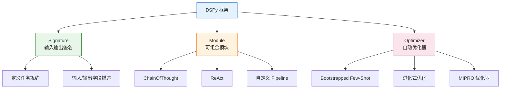
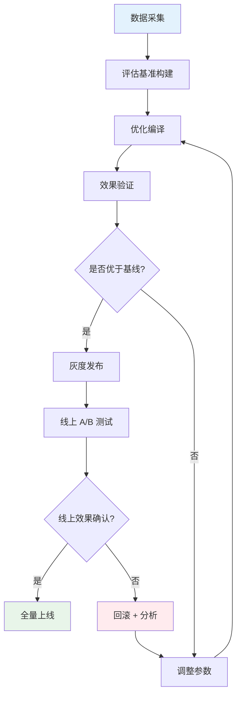

# Prompt自动优化

手动调 Prompt 是一门玄学：改几个词可能效果飞跃，也可能全面崩溃，且难以复现和迭代。DSPy 的出现将 Prompt 工程从"手工试错"推进到"编程+自动优化"的新范式。本文深入 DSPy 框架的核心机制，并构建生产级的 Prompt 自动优化流水线。

## 为什么需要自动优化

### 手动优化的困境

| 问题 | 说明 |
|------|------|
| 不可复现 | 同一个 Prompt 在不同模型上效果差异大 |
| 难以迭代 | 改了 A 发现 B 坏了，缺少回归测试 |
| 依赖经验 | 需要资深工程师反复试错，效率低下 |
| 规模瓶颈 | 场景多了，人工调优不可扩展 |
| 效果天花板 | 人工设计的 Prompt 很难超越自动搜索找到的最优解 |

### 自动优化的核心思路

将 Prompt 视为可编程、可优化的参数，而非手工编写的文本。通过定义输入输出签名（Signature）、模块化组合（Module）、自动搜索最优配置（Optimizer）三个核心抽象，实现 Prompt 的系统化优化。

## DSPy 框架核心概念

### 三大核心抽象



### Signature：输入输出签名

Signature 是对任务的声明式定义，描述了"输入什么、输出什么"，而不关心"怎么做"。

```python
import dspy

# 基础 Signature：问答
class QASignature(dspy.Signature):
    """基于给定上下文回答问题。只使用上下文中的信息，不要编造。"""
    context: str = dspy.InputField(desc="相关参考资料")
    question: str = dspy.InputField(desc="用户的问题")
    answer: str = dspy.OutputField(desc="基于上下文的回答")

# 分类 Signature
class ClassificationSignature(dspy.Signature):
    """将文本分类到指定类别中。"""
    text: str = dspy.InputField(desc="待分类的文本")
    categories: str = dspy.InputField(desc="可选类别，逗号分隔")
    category: str = dspy.OutputField(desc="分类结果，必须是可选类别之一")

# 信息抽取 Signature
class ExtractionSignature(dspy.Signature):
    """从文本中抽取结构化信息。"""
    text: str = dspy.InputField(desc="源文本")
    schema_description: str = dspy.InputField(desc="要抽取的字段及其描述")
    extracted_info: str = dspy.OutputField(desc="抽取的 JSON 格式信息")

# 摘要 Signature
class SummarizationSignature(dspy.Signature):
    """生成文本的简洁摘要，保留关键信息。"""
    text: str = dspy.InputField(desc="原始文本")
    max_words: int = dspy.InputField(desc="摘要最大字数")
    summary: str = dspy.OutputField(desc="文本摘要")
```

### Module：可组合模块

Module 封装了具体的推理策略，类似 PyTorch 的 nn.Module。

```python
# 使用内置 Module

# 1. Predict：最基本的模块，直接根据 Signature 生成输出
qa = dspy.Predict(QASignature)
result = qa(context="张三于2023年加入A公司担任CTO", question="张三的职位是什么?")
print(result.answer)  # "CTO"

# 2. ChainOfThought：带思维链的推理
cot_qa = dspy.ChainOfThought(QASignature)
result = cot_qa(context="...", question="...")
# 输出中包含 reasoning 字段，展示推理过程

# 3. ReAct：推理+行动循环
react = dspy.ReAct(
    "question -> answer",
    tools=[search_tool, calculator_tool],
    max_iters=5
)

# 自定义 Pipeline Module
class RAGPipeline(dspy.Module):
    """完整的 RAG 管线模块"""

    def __init__(self, num_passages: int = 3):
        super().__init__()
        self.retrieve = dspy.Retrieve(k=num_passages)
        self.generate_answer = dspy.ChainOfThought(QASignature)

    def forward(self, question: str):
        # 检索相关文档
        context = self.retrieve(question).passages
        # 生成回答
        prediction = self.generate_answer(
            context="\n".join(context),
            question=question
        )
        return dspy.Prediction(
            context=context,
            answer=prediction.answer,
            reasoning=prediction.reasoning
        )
```

### Optimizer：自动优化器

Optimizer 自动搜索最优的 Prompt 配置，包括指令文本、Few-Shot 示例等。

```python
from dspy.teleprompt import *

# 1. BootstrapFewShot：自动搜索最优 Few-Shot 示例
fewshot_optimizer = BootstrapFewShot(
    metric=answer_exact_match,  # 评估指标
    max_bootstrapped_demos=4,   # 最多搜索几个 Few-Shot 示例
    max_labeled_demos=4,        # 最多使用几个标注示例
    max_rounds=1,               # 搜索轮数
)

# 2. BootstrapFewShotWithRandomSearch：在搜索空间中随机采样
random_optimizer = BootstrapFewShotWithRandomSearch(
    metric=answer_exact_match,
    max_bootstrapped_demos=4,
    num_candidate_programs=10,  # 候选方案数量
    num_threads=4,              # 并行搜索线程
)

# 3. MIPRO：指令+示例联合优化（最强大）
mipro_optimizer = MIPRO(
    metric=answer_exact_match,
    num_candidates=10,
    num_threads=4,
    max_bootstrapped_demos=4,
    max_labeled_demos=4,
    init_temperature=1.0,
)
```

## Bootstrapped Few-Shot 优化

Bootstrapped Few-Shot 是最实用的优化策略，核心思路是：用当前模块在训练集上运行，收集成功的示例作为 Few-Shot 示例。

```python
import dspy
from dspy.teleprompt import BootstrapFewShot

# 配置 LLM
lm = dspy.LM("openai/gpt-4o-mini", api_key="your-key")
dspy.configure(lm=lm)

# 定义评估指标
def answer_exact_match(example, prediction, trace=None):
    """精确匹配评估指标"""
    return example.answer.strip().lower() == prediction.answer.strip().lower()

def answer_fuzzy_match(example, prediction, trace=None):
    """模糊匹配评估指标"""
    return any(
        keyword in prediction.answer.lower()
        for keyword in example.answer.lower().split()
    )

def answer_semantic_match(example, prediction, trace=None):
    """语义匹配评估指标（用另一个 LLM 判断）"""
    judge = dspy.Predict("question, ground_truth, prediction -> is_match: bool")
    result = judge(
        question="判断预测答案是否语义等价于标准答案",
        ground_truth=example.answer,
        prediction=prediction.answer,
    )
    return result.is_match

# 准备训练数据
trainset = [
    dspy.Example(
        context="Python是由Guido van Rossum于1991年发布的编程语言",
        question="Python的创始人是谁?",
        answer="Guido van Rossum"
    ).with_inputs("context", "question"),
    dspy.Example(
        context="Kubernetes最初由Google设计，现在由CNCF维护",
        question="Kubernetes现在由谁维护?",
        answer="CNCF"
    ).with_inputs("context", "question"),
    # ... 更多训练样本
]

# 定义模块
class SimpleQA(dspy.Module):
    def __init__(self):
        super().__init__()
        self.prog = dspy.ChainOfThought(QASignature)

    def forward(self, context, question):
        return self.prog(context=context, question=question)

# 编译优化
optimizer = BootstrapFewShot(
    metric=answer_exact_match,
    max_bootstrapped_demos=4,
    max_labeled_demos=4,
)

compiled_qa = optimizer.compile(
    SimpleQA(),
    trainset=trainset,
)

# 使用优化后的模块
result = compiled_qa(
    context="FastAPI是一个高性能的Python Web框架",
    question="FastAPI是什么?"
)
print(result.answer)

# 查看优化后的 Prompt
print(compiled_qa.prog.demos)  # 查看 Few-Shot 示例
```

## 进化式 Prompt 优化

进化式 Prompt 优化将 Prompt 搜索视为迭代优化问题：每轮在历史最优解附近随机扰动参数，保留表现更好的变体。这是进化策略 / 爬山搜索，而非贝叶斯优化。

```python
from dspy.teleprompt import BootstrapFewShotWithRandomSearch
import numpy as np

class EvolutionaryPromptOptimizer:
    """进化式 Prompt 优化器

    通过随机扰动 + 选择保留最优解的策略迭代优化 Prompt。
    这不是贝叶斯优化（贝叶斯优化需要高斯过程 + 采集函数）。

    如需真正的贝叶斯优化，可使用 Optuna 等 TPE 框架。
    """

    def __init__(self, module_class, metric, trainset,
                 num_candidates=20, num_threads=4):
        self.module_class = module_class
        self.metric = metric
        self.trainset = trainset
        self.num_candidates = num_candidates
        self.num_threads = num_threads
        self.history = []  # 记录 (参数, 得分) 对

    def _generate_candidate_params(self) -> dict:
        """基于历史结果生成下一组候选参数"""
        if len(self.history) < 3:
            # 探索阶段：随机采样
            return {
                "max_bootstrapped_demos": np.random.randint(1, 8),
                "max_labeled_demos": np.random.randint(1, 8),
                "temperature": np.random.uniform(0.0, 1.5),
            }

        # 利用阶段：在历史最优附近搜索
        best_params = max(self.history, key=lambda x: x[1])[0]
        return {
            "max_bootstrapped_demos": max(1, best_params["max_bootstrapped_demos"]
                                          + np.random.randint(-2, 3)),
            "max_labeled_demos": max(1, best_params["max_labeled_demos"]
                                     + np.random.randint(-2, 3)),
            "temperature": max(0.0, min(2.0, best_params["temperature"]
                                        + np.random.uniform(-0.3, 0.3))),
        }

    def optimize(self, num_iterations: int = 10) -> tuple:
        """执行进化式优化"""
        best_score = -1
        best_module = None

        for i in range(num_iterations):
            params = self._generate_candidate_params()

            optimizer = BootstrapFewShotWithRandomSearch(
                metric=self.metric,
                max_bootstrapped_demos=params["max_bootstrapped_demos"],
                max_labeled_demos=params["max_labeled_demos"],
                num_candidate_programs=5,
                num_threads=self.num_threads,
            )

            compiled = optimizer.compile(
                self.module_class(),
                trainset=self.trainset,
            )

            # 在验证集上评估
            score = self._evaluate(compiled)
            self.history.append((params, score))

            if score > best_score:
                best_score = score
                best_module = compiled

            print(f"Iteration {i+1}: params={params}, score={score:.4f}, "
                  f"best={best_score:.4f}")

        return best_module, best_score

    def _evaluate(self, module, valset=None) -> float:
        """在验证集上评估模块"""
        from dspy.evaluate import Evaluate
        evaluator = Evaluate(
            devset=valset or self.trainset[:20],
            metric=self.metric,
            num_threads=self.num_threads,
            display_progress=False,
        )
        return evaluator(module)
```

### 真正的贝叶斯优化：Optuna TPE

如需基于概率模型的贝叶斯优化（高斯过程 + 采集函数），推荐使用 Optuna 的 TPE（Tree-structured Parzen Estimator）：

```python
# 真正的贝叶斯优化：使用 Optuna TPE
# pip install optuna
# import optuna
#
# def objective(trial):
#     temperature = trial.suggest_float("temperature", 0.0, 1.0)
#     top_p = trial.suggest_float("top_p", 0.5, 1.0)
#     prompt_prefix = trial.suggest_categorical(
#         "prefix", ["请详细分析", "简要概括", "逐步推理"]
#     )
#     score = evaluate_prompt(temperature, top_p, prompt_prefix)
#     return score
#
# study = optuna.create_study(direction="maximize")
# study.optimize(objective, n_trials=50)
```

## 自动化 Prompt 评估与迭代

### 评估指标体系

```python
from dspy.evaluate import Evaluate

# 多维度评估
def comprehensive_metric(example, prediction, trace=None):
    """综合评估指标"""
    scores = {}

    # 1. 准确性：答案是否正确
    scores["accuracy"] = 1.0 if (
        example.answer.strip().lower() in prediction.answer.strip().lower()
    ) else 0.0

    # 2. 简洁性：答案是否过冗长
    target_len = len(example.answer)
    pred_len = len(prediction.answer)
    if pred_len <= target_len * 1.5:
        scores["conciseness"] = 1.0
    elif pred_len <= target_len * 3:
        scores["conciseness"] = 0.5
    else:
        scores["conciseness"] = 0.0

    # 3. 忠实性：是否使用了提供的上下文
    if hasattr(example, "context"):
        context_keywords = set(example.context.split())
        answer_keywords = set(prediction.answer.split())
        overlap = context_keywords & answer_keywords
        scores["faithfulness"] = len(overlap) / max(len(answer_keywords), 1)

    # 加权综合
    weights = {"accuracy": 0.5, "conciseness": 0.2, "faithfulness": 0.3}
    return sum(scores[k] * weights[k] for k in weights)

# 批量评估
evaluator = Evaluate(
    devset=valset,
    metric=comprehensive_metric,
    num_threads=4,
    display_progress=True,
    display_table=5,
)
score = evaluator(compiled_module)
```

### 迭代优化循环

```python
class PromptOptimizationLoop:
    """Prompt 优化迭代循环"""

    def __init__(self, module_class, trainset, valset, metric):
        self.module_class = module_class
        self.trainset = trainset
        self.valset = valset
        self.metric = metric
        self.results_log = []

    def run(self, max_iterations: int = 5, patience: int = 2):
        """执行迭代优化，支持早停"""
        best_score = 0
        best_module = None
        no_improve_count = 0

        for iteration in range(max_iterations):
            print(f"\n=== Iteration {iteration + 1} ===")

            # 阶段 1：Few-Shot 优化
            fewshot = BootstrapFewShot(
                metric=self.metric,
                max_bootstrapped_demos=4 + iteration,  # 逐轮增加示例
                max_labeled_demos=4,
            )
            module = fewshot.compile(
                self.module_class(),
                trainset=self.trainset,
            )

            # 阶段 2：在验证集上评估
            evaluator = Evaluate(
                devset=self.valset,
                metric=self.metric,
                num_threads=4,
            )
            score = evaluator(module)

            self.results_log.append({
                "iteration": iteration + 1,
                "score": score,
                "demos_count": len(module.prog.demos) if hasattr(module, 'prog') else 0,
            })

            print(f"Score: {score:.4f}")

            if score > best_score:
                best_score = score
                best_module = module
                no_improve_count = 0
            else:
                no_improve_count += 1

            if no_improve_count >= patience:
                print(f"Early stopping: no improvement for {patience} iterations")
                break

        return best_module, best_score, self.results_log
```

## DSPy 代码实战：完整示例

以下是一个从定义到编译到优化的完整示例，以企业知识库问答为场景。

```python
import dspy
from dspy.teleprompt import BootstrapFewShot, MIPRO

# 1. 配置
lm = dspy.LM("openai/gpt-4o-mini", api_key="your-key")
colbertv2 = dspy.ColBERTv2(url="http://20.102.90.50:2017/wiki17_abstracts")
dspy.configure(lm=lm, rm=colbertv2)

# 2. 定义 Signature
class KnowledgeBaseQA(dspy.Signature):
    """基于企业知识库回答问题。只使用提供的参考资料，如果资料中没有相关信息，请回答"根据现有资料无法回答"。"""
    context: str = dspy.InputField(desc="从知识库检索到的参考资料")
    question: str = dspy.InputField(desc="用户的业务问题")
    answer: str = dspy.OutputField(desc="基于参考资料的准确回答")
    confidence: str = dspy.OutputField(desc="回答置信度: high/medium/low")

# 3. 定义 Module
class EnterpriseRAG(dspy.Module):
    def __init__(self, num_passages: int = 3):
        super().__init__()
        self.retrieve = dspy.Retrieve(k=num_passages)
        self.generate = dspy.ChainOfThought(KnowledgeBaseQA)

    def forward(self, question: str):
        context = self.retrieve(question).passages
        prediction = self.generate(
            context="\n\n---\n\n".join(context),
            question=question,
        )
        return dspy.Prediction(
            context=context,
            answer=prediction.answer,
            confidence=prediction.confidence,
        )

# 4. 准备数据
trainset = [
    dspy.Example(
        question="公司的年假政策是什么?",
        answer="根据员工手册，入职满1年年假5天，满3年10天，满5年15天。",
    ).with_inputs("question"),
    dspy.Example(
        question="如何申请远程办公?",
        answer="需在OA系统提交远程办公申请，直属领导审批后生效，每月最多10个工作日。",
    ).with_inputs("question"),
    # ... 至少 20-50 条训练数据
]

valset = [
    dspy.Example(
        question="出差补贴标准是多少?",
        answer="一线城市500元/天，二线城市300元/天，需保留发票。",
    ).with_inputs("question"),
    # ... 至少 10-20 条验证数据
]

# 5. 定义评估指标
def qa_metric(example, prediction, trace=None):
    """基于 LLM 的语义匹配评估"""
    judge = dspy.Predict(
        "ground_truth, prediction -> score: float"
    )
    result = judge(
        ground_truth=example.answer,
        prediction=prediction.answer,
    )
    try:
        return float(result.score) >= 0.7
    except (ValueError, TypeError):
        return False

# 6. 编译优化 - 方法 1：Few-Shot
fewshot_optimizer = BootstrapFewShot(
    metric=qa_metric,
    max_bootstrapped_demos=4,
    max_labeled_demos=4,
)
compiled_fewshot = fewshot_optimizer.compile(
    EnterpriseRAG(),
    trainset=trainset,
)

# 6. 编译优化 - 方法 2：MIPRO（指令+示例联合优化）
mipro_optimizer = MIPRO(
    metric=qa_metric,
    num_candidates=10,
    num_threads=4,
    max_bootstrapped_demos=4,
)
compiled_mipro = mipro_optimizer.compile(
    EnterpriseRAG(),
    trainset=trainset,
    eval_kwargs={"devset": valset},
)

# 7. 对比评估
from dspy.evaluate import Evaluate
evaluator = Evaluate(devset=valset, metric=qa_metric, num_threads=4)

baseline_score = evaluator(EnterpriseRAG())
fewshot_score = evaluator(compiled_fewshot)
mipro_score = evaluator(compiled_mipro)

print(f"Baseline:  {baseline_score:.2f}")
print(f"Few-Shot:  {fewshot_score:.2f}")
print(f"MIPRO:     {mipro_score:.2f}")
```

## 手动优化 vs DSPy 自动优化

> ⚠️ 以下数据为不同策略的**相对趋势参考**，具体数值取决于模型、任务和工具集。
> 实际项目中应以自己的评估数据为准。

| 维度 | 手动优化 | DSPy 自动优化 |
|------|----------|---------------|
| 优化方式 | 试错法，人工修改 Prompt | 自动搜索，程序化优化 |
| 可复现性 | 低，依赖工程师经验 | 高，优化过程有完整日志 |
| 迭代速度 | 慢，人工调优周期长 | 快，自动化搜索 |
| Few-Shot 选择 | 手动挑选示例 | 自动选择最优示例组合 |
| 指令优化 | 人工改写指令文本 | MIPRO 自动生成候选指令 |
| 规模化能力 | 场景多时人力不足 | 可并行优化多个场景 |
| 效果上限 | 受限于工程师水平 | 可超越人工设计 |
| 上手成本 | 低，直接改 Prompt | 中，需学习 DSPy 框架 |
| 调试难度 | 低，直观可读 | 中，需理解编译过程 |
| 适用阶段 | 早期探索、快速验证 | 中后期优化、规模化场景 |

### 何时选择手动，何时选择自动

**手动优化适合**：

- 项目初期，快速验证可行性
- 场景简单，Prompt 变体少
- 团队尚未建立评估体系

**自动优化适合**：

- 有标准训练集和评估指标
- 场景复杂，需要大量 Few-Shot 示例
- 多场景需要批量优化
- 需要持续优化而非一次性调优

## 生产环境中的 Prompt 优化流水线



```python
class PromptOptimizationPipeline:
    """生产级 Prompt 优化流水线"""

    def __init__(self, module_class, metric, config: dict):
        self.module_class = module_class
        self.metric = metric
        self.config = config
        self.version_history = []

    def collect_data(self, production_logs: list[dict]) -> tuple:
        """从生产日志中提取训练数据"""
        train_examples = []
        for log in production_logs:
            if log.get("user_rating") == "positive":
                example = dspy.Example(
                    question=log["query"],
                    answer=log["response"],
                ).with_inputs("question")
                train_examples.append(example)
        return train_examples

    def build_eval_set(self, examples: list, split_ratio: float = 0.8) -> tuple:
        """划分训练集和验证集"""
        import random
        random.shuffle(examples)
        split = int(len(examples) * split_ratio)
        return examples[:split], examples[split:]

    def optimize(self, trainset, valset) -> dict:
        """执行优化流程"""
        # 1. 训练基线模型
        baseline = self.module_class()
        baseline_score = self._evaluate(baseline, valset)

        # 2. Few-Shot 优化
        fewshot = BootstrapFewShot(
            metric=self.metric,
            max_bootstrapped_demos=self.config.get("max_demos", 4),
        )
        compiled = fewshot.compile(baseline, trainset=trainset)
        optimized_score = self._evaluate(compiled, valset)

        # 3. 记录版本
        version = {
            "version": len(self.version_history) + 1,
            "baseline_score": baseline_score,
            "optimized_score": optimized_score,
            "improvement": optimized_score - baseline_score,
            "timestamp": self._now(),
        }
        self.version_history.append(version)

        return {
            "compiled_module": compiled,
            "version": version,
            "should_deploy": optimized_score > baseline_score + 0.02,
        }

    def _evaluate(self, module, valset) -> float:
        evaluator = Evaluate(
            devset=valset,
            metric=self.metric,
            num_threads=4,
        )
        return evaluator(module)

    def _now(self) -> str:
        from datetime import datetime
        return datetime.now().isoformat()
```

## 关键注意事项

### 数据质量决定优化上限

DSPy 的优化效果高度依赖训练数据质量。垃圾数据训练出垃圾 Prompt，与"Garbage In Garbage Out"同理。

- 训练集至少 20-50 条高质量标注
- 数据应覆盖典型场景和边界情况
- 定期用生产数据更新训练集

### 评估指标要贴近业务

评估指标直接影响优化方向。指标定义偏差，优化方向就会偏移。

- 问答场景用 Faithfulness + Relevancy
- 分类场景用 F1 + 准确率
- 摘要场景用 ROUGE + 人工评估

### 优化不是一次性工作

Prompt 需要持续优化，因为模型在更新、用户需求在变化、知识库在扩充。

- 建立定期重优化机制（如每月一次）
- 监控线上效果退化，触发即时优化
- 保留版本历史，支持快速回滚

---

::: tip 核心原则
DSPy 的本质是将 Prompt 工程从"手艺"升级为"工程"。但自动优化不能替代对业务的理解，评估指标的设计、训练数据的选择、优化策略的选型都需要业务知识的支撑。先用好手动优化建立基线，再用自动优化突破天花板。
:::
