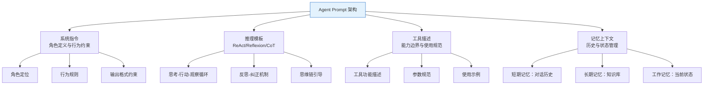

# Prompt驱动Agent设计

Agent 的核心能力来自 LLM 的推理与决策，而 LLM 的行为由 Prompt 决定。一个设计良好的 Prompt 能让 Agent 准确理解任务、选择正确工具、生成合理推理链；一个糟糕的 Prompt 则会导致工具误用、推理混乱、输出不可控。本文系统梳理 Agent 设计中的 Prompt 策略，从 ReAct/Reflexion 模板到工具选择优化，再到多步推理编排，提供可落地的工程实践。

## Agent 的 Prompt 架构



## ReAct Prompt 模板设计

ReAct（Reasoning + Acting）是最经典的 Agent 推理模式，通过"思考-行动-观察"循环让 Agent 逐步解决问题。

### 基础 ReAct 模板

```python
REACT_SYSTEM_PROMPT = """你是一个智能助手，能够通过思考和行动来回答问题。

你必须严格遵循以下格式：

思考：分析当前情况，决定下一步行动
行动：选择一个工具并传入参数
观察：接收工具返回的结果

你可以进行多轮思考-行动-观察循环，直到收集到足够信息。

当你有了最终答案时，使用以下格式：
最终答案：你的回答

可用工具：
{tool_descriptions}

规则：
1. 每次只执行一个行动
2. 行动必须从可用工具中选择
3. 思考过程要清晰，说明为什么选择这个行动
4. 如果工具返回错误，分析原因并调整策略
5. 不要编造工具结果，必须实际调用工具"""


REACT_TOOL_TEMPLATE = """工具名：{tool_name}
功能：{tool_description}
参数：{tool_parameters}
使用示例：{tool_example}"""


def build_react_prompt(question: str, tool_descriptions: str,
                       history: list[dict] = None) -> str:
    """构建 ReAct 提示词"""
    system = REACT_SYSTEM_PROMPT.format(tool_descriptions=tool_descriptions)

    messages = [{"role": "system", "content": system}]

    # 添加历史对话
    if history:
        for turn in history:
            messages.append({
                "role": "user" if turn["role"] == "user" else "assistant",
                "content": turn["content"],
            })

    # 添加当前问题
    messages.append({"role": "user", "content": f"问题：{question}"})

    return messages
```

### 增强版 ReAct：带反思的推理

```python
ENHANCED_REACT_PROMPT = """你是一个具备反思能力的智能助手。

回答问题时，你需要经过以下阶段：

## 阶段 1：分析
- 理解问题的核心需求
- 判断需要哪些信息
- 制定信息获取策略

## 阶段 2：执行
- 按策略逐步获取信息
- 每步行动前说明理由
- 遇到异常时调整策略

## 阶段 3：反思
- 检查收集的信息是否充分
- 验证推理逻辑是否自洽
- 识别可能的错误或遗漏

## 阶段 4：回答
- 基于充分的信息给出最终答案
- 标注信息来源和置信度
- 对不确定的部分明确说明

可用工具：
{tool_descriptions}

输出格式：
[分析] 你的分析过程
[行动] 工具调用
[观察] 工具结果
[反思] 对当前进度的反思
[回答] 最终答案

重要规则：
- 如果行动结果与预期不符，必须在[反思]中分析原因并调整
- 如果连续两次行动失败，换一种完全不同的策略
- 最终答案必须基于工具返回的实际数据，不能编造"""
```

## Reflexion Prompt 模板设计

Reflexion 在 ReAct 基础上增加了自我反思和纠正机制，让 Agent 能从失败中学习。

```python
REFLEXION_SYSTEM_PROMPT = """你是一个能够自我反思和改进的智能助手。

当你完成任务后，你需要进行自我评估：

1. 评估你的回答质量（1-5分）
2. 检查是否完整回答了问题
3. 识别可能的错误或遗漏
4. 提出改进方案

如果你对自己的回答不满意（评分 < 4），你需要：
- 重新分析问题
- 尝试不同的行动策略
- 利用之前的失败经验

## 反思格式

### 第一次尝试
[思考] 初始分析...
[行动] 工具调用...
[观察] 结果...

### 反思 1
评分：X/5
问题：具体描述不足之处
改进：具体描述改进策略

### 第二次尝试
[思考] 基于反思调整策略...
[行动] 新的工具调用...
[观察] 结果...

### 反思 2
评分：X/5
...

### 最终答案
（当评分 >= 4 时输出最终答案）"""


def build_reflexion_prompt(
    question: str,
    tool_descriptions: str,
    previous_attempts: list[dict] = None,
    max_attempts: int = 3,
) -> list[dict]:
    """构建带反思的 Agent 提示词"""
    messages = [
        {"role": "system", "content": REFLEXION_SYSTEM_PROMPT.format(
            tool_descriptions=tool_descriptions
        )},
        {"role": "user", "content": f"问题：{question}"},
    ]

    # 注入之前的尝试记录（学习历史）
    if previous_attempts:
        history_text = "以下是之前的尝试记录，请从中学习：\n\n"
        for i, attempt in enumerate(previous_attempts):
            history_text += f"### 尝试 {i+1}\n"
            history_text += f"行动：{attempt['action']}\n"
            history_text += f"结果：{attempt['observation']}\n"
            history_text += f"反思：{attempt['reflection']}\n"
            history_text += f"评分：{attempt['score']}/5\n\n"

        messages.append({
            "role": "user",
            "content": history_text + f"现在请进行第 {len(previous_attempts)+1} 次尝试（最多 {max_attempts} 次）。",
        })

    return messages
```

## 工具选择的 Prompt 策略

工具描述的质量直接决定 Agent 选择工具的准确率。优化工具描述是提升 Agent 表现最直接的方式。

### 工具描述优化

```python
# 差的工具描述（Agent 经常选错）
BAD_TOOL_DESC = """
工具名：search
功能：搜索信息
参数：query (string)
"""

# 好的工具描述（清晰、具体、有边界）
GOOD_TOOL_DESC = """
工具名：search_knowledge_base
功能：在企业知识库中搜索与查询语义相关的文档片段。适用于查找公司制度、产品文档、技术规范等内部信息。不适用于搜索互联网内容或实时新闻。
参数：
  - query (string): 搜索关键词或自然语言描述，应尽可能具体。例如"年假申请流程"比"假期"更好。
  - top_k (int, 可选): 返回结果数量，默认3，最大10
返回：文档片段列表，每条包含内容和来源标识
限制：
  - 只能搜索知识库已有内容，无法获取实时信息
  - 单次搜索超时 5 秒
  - 如果搜索无结果，尝试换用同义词或更广泛的关键词
"""

# 最佳工具描述（含使用示例）
BEST_TOOL_DESC = """
工具名：search_knowledge_base
功能：在企业知识库中搜索与查询语义相关的文档片段。
适用场景：
  - 查找公司制度、流程规范（如"报销流程"、"入职材料"）
  - 查询产品技术文档（如"API 限流策略"、"部署步骤"）
  - 搜索历史案例和最佳实践
不适用场景：
  - 实时信息查询（如"今天天气"、"最新新闻"）
  - 数学计算或逻辑推理
  - 需要跨系统操作的复杂任务

参数：
  - query (string): 搜索关键词，应具体明确
  - top_k (int, 可选): 返回数量，默认3

使用示例：
  - 用户问"如何申请远程办公？" -> search_knowledge_base(query="远程办公申请流程")
  - 用户问"差旅报销标准是什么？" -> search_knowledge_base(query="差旅报销标准 补贴额度")
  - 用户问"新人入职需要准备什么？" -> search_knowledge_base(query="入职材料清单 新员工")

返回格式：[{"content": "...", "source": "...", "score": 0.85}, ...]
"""
```

### Few-Shot 工具使用示例

```python
TOOL_USAGE_EXAMPLES = """
以下是正确的工具使用示例：

示例 1：
用户：帮我查一下张三的考勤记录
思考：需要查询人事系统中的考勤数据
行动：query_hr_system(employee="张三", query_type="attendance", month="current")
观察：张三本月出勤20天，迟到1次，请假2天
回答：张三本月出勤20天，有1次迟到记录和2天请假。

示例 2：
用户：我们产品的API调用限制是多少？
思考：需要从知识库中搜索API限流相关文档
行动：search_knowledge_base(query="API 限流策略 调用限制 rate limit")
观察：找到相关文档：免费版1000次/天，专业版10000次/天，企业版不限
回答：API调用限制根据版本不同：免费版1000次/天，专业版10000次/天，企业版不限。

示例 3：
用户：计算一下我们Q1的总营收
思考：需要从数据库查询Q1营收数据，然后求和
行动：query_database(sql="SELECT SUM(revenue) FROM sales WHERE quarter='Q1'")
观察：Q1总营收为1,250,000元
回答：Q1总营收为125万元。

示例 4（错误示范 - 不应该这样）：
用户：帮我订一张去上海的机票
错误行动：search_knowledge_base(query="上海机票")
正确判断：当前工具无法预订机票，应告知用户此功能不可用
回答：抱歉，我目前没有预订机票的功能，建议您通过携程或去哪儿等平台预订。
"""
```

### 工具选择 Prompt 策略

```python
TOOL_SELECTION_PROMPT = """根据用户问题，从以下工具中选择最合适的工具。

可用工具列表：
{tool_list}

选择规则：
1. 优先选择功能最精准匹配的工具
2. 如果多个工具可能相关，选择覆盖范围最小的（更精准的）
3. 如果没有合适的工具，明确说明无法完成
4. 不要为了使用工具而使用工具，有些问题可以直接回答

用户问题：{question}

请先分析问题需要什么类型的信息，然后选择工具。
输出格式：
需求分析：...
选择工具：...
选择理由：..."""


def select_tool_with_reasoning(
    question: str,
    tools: list[dict],
    llm,
) -> dict:
    """带推理的工具选择"""
    tool_list = "\n".join(
        f"- {t['name']}: {t['description']}" for t in tools
    )
    prompt = TOOL_SELECTION_PROMPT.format(
        tool_list=tool_list,
        question=question,
    )
    result = llm.invoke(prompt)

    # 解析选择结果
    selected_name = parse_tool_name(result)
    return next(
        (t for t in tools if t["name"] == selected_name),
        None,
    )
```

## 思维链 Prompt 与 Agent 推理质量

### CoT 模板设计

```python
# 基础 CoT
COT_PROMPT = """请一步一步思考以下问题。

问题：{question}

思考过程："""

# 自适应 CoT：根据问题复杂度调整思考深度
ADAPTIVE_COT_PROMPT = """请根据问题复杂度采用适当的思考深度。

问题：{question}

思考指南：
- 简单问题（事实查询）：1-2步即可
- 中等问题（需要推理）：3-5步
- 复杂问题（需要多步推理+验证）：5步以上，每步需验证

分析问题复杂度，然后逐步思考："""


def build_cot_prompt(question: str, complexity: str = "auto") -> str:
    """根据复杂度构建思维链 Prompt"""
    if complexity == "auto":
        # 让 LLM 自己判断复杂度
        return ADAPTIVE_COT_PROMPT.format(question=question)
    elif complexity == "simple":
        return f"请简要回答：{question}\n\n思考："
    elif complexity == "complex":
        return COMPLEX_COT_PROMPT.format(question=question)
    else:
        return COT_PROMPT.format(question=question)

COMPLEX_COT_PROMPT = """请深入思考以下复杂问题。每一步推理都需要验证。

问题：{question}

请按以下格式思考：

步骤1：[理解] 重新表述问题，明确需要回答什么
步骤2：[分析] 分解问题为子问题
步骤3：[推理] 逐步推理每个子问题
步骤4：[验证] 检查推理链条是否有漏洞
步骤5：[综合] 汇总所有子问题的答案
步骤6：[输出] 给出最终答案

开始思考："""
```

### CoT 质量评估

```python
def evaluate_reasoning_quality(
    question: str,
    reasoning_chain: str,
    final_answer: str,
    ground_truth: str = None,
) -> dict:
    """评估推理链质量"""
    metrics = {}

    # 1. 推理步骤数
    steps = reasoning_chain.count("步骤") + reasoning_chain.count("Step")
    metrics["step_count"] = steps

    # 2. 是否有验证步骤
    metrics["has_verification"] = any(
        kw in reasoning_chain
        for kw in ["验证", "检查", "确认", "verify", "check"]
    )

    # 3. 推理链是否有逻辑跳跃（相邻步骤是否连贯）
    metrics["logical_continuity"] = assess_logical_continuity(reasoning_chain)

    # 4. 最终答案正确性
    if ground_truth:
        metrics["answer_correct"] = (
            ground_truth.strip().lower() in final_answer.strip().lower()
        )

    return metrics


def assess_logical_continuity(reasoning_chain: str) -> float:
    """评估推理链的逻辑连贯性"""
    # 简化实现：检查是否有过多的"但是"或自我矛盾
    contradictions = reasoning_chain.count("但是") + reasoning_chain.count("然而")
    total_steps = max(reasoning_chain.count("\n"), 1)
    # 少量转折是正常的，过多则可能逻辑混乱
    if contradictions / total_steps > 0.5:
        return 0.3
    elif contradictions / total_steps > 0.3:
        return 0.6
    else:
        return 0.9
```

## 多步推理的 Prompt 编排

### 管线式推理编排

```python
class MultiStepReasoningPipeline:
    """多步推理管线"""

    def __init__(self, llm):
        self.llm = llm
        self.steps = []

    def add_step(self, name: str, prompt_template: str,
                 output_key: str, depends_on: list[str] = None):
        """添加推理步骤"""
        self.steps.append({
            "name": name,
            "prompt_template": prompt_template,
            "output_key": output_key,
            "depends_on": depends_on or [],
        })
        return self

    def execute(self, initial_context: dict) -> dict:
        """执行推理管线"""
        context = initial_context.copy()
        results = {}

        for step in self.steps:
            # 收集依赖步骤的输出
            for dep in step["depends_on"]:
                if dep not in results:
                    raise ValueError(f"Step '{step['name']}' depends on "
                                     f"'{dep}' which hasn't been executed")
                context[dep] = results[dep]

            # 渲染 Prompt
            prompt = step["prompt_template"].format(**context)
            output = self.llm.invoke(prompt).content

            results[step["output_key"]] = output
            print(f"[{step['name']}] 完成")

        return results


# 使用示例
pipeline = MultiStepReasoningPipeline(llm=my_llm)

pipeline.add_step(
    name="理解需求",
    prompt_template="分析以下用户需求，提取关键信息：\n{user_query}\n\n提取的关键信息：",
    output_key="parsed_intent",
)

pipeline.add_step(
    name="制定计划",
    prompt_template="基于以下需求分析，制定信息获取计划：\n{parsed_intent}\n\n计划：",
    output_key="plan",
    depends_on=["parsed_intent"],
)

pipeline.add_step(
    name="执行检索",
    prompt_template="根据以下计划，生成搜索查询：\n{plan}\n\n搜索查询列表：",
    output_key="search_queries",
    depends_on=["plan"],
)

pipeline.add_step(
    name="综合回答",
    prompt_template="基于以下信息回答用户问题：\n原始问题：{user_query}\n需求分析：{parsed_intent}\n搜索结果：{search_results}\n\n回答：",
    output_key="final_answer",
    depends_on=["parsed_intent", "search_results"],
)

results = pipeline.execute({"user_query": "分析我们产品的竞品优劣势"})
```

## LangGraph Agent 的 Prompt 模板设计

```python
from langgraph.graph import StateGraph, END
from typing import TypedDict, Annotated
import operator

# 定义状态
class AgentState(TypedDict):
    question: str
    thinking: Annotated[list[str], operator.add]
    actions: Annotated[list[dict], operator.add]
    observations: Annotated[list[str], operator.add]
    reflections: Annotated[list[str], operator.add]
    final_answer: str
    iteration: int
    max_iterations: int

# 节点 Prompt 模板
THINK_PROMPT = """你是一个智能助手。根据当前状态决定下一步行动。

问题：{question}

历史思考：
{thinking_history}

已执行行动和观察：
{action_observation_history}

{reflection_history}

请分析当前进度，决定下一步行动。如果信息已充分，输出"FINAL_ANSWER"。
否则输出你选择的工具和参数。

思考："""

REFLECT_PROMPT = """回顾你的推理过程，进行自我评估。

问题：{question}

你的推理过程：
{full_history}

你的当前答案：{current_answer}

请评估：
1. 信息是否充分？是否有遗漏？
2. 推理是否有逻辑漏洞？
3. 答案是否完整回答了问题？

如果需要改进，说明改进方向。如果已满意，输出"SATISFIED"。"""

ANSWER_PROMPT = """基于以下信息生成最终答案。

问题：{question}

收集的信息：
{observations}

推理过程：
{thinking}

请生成完整、准确的最终答案，包含来源标注和置信度评估。"""


# 定义节点
def think_node(state: AgentState) -> dict:
    """思考节点"""
    thinking_history = "\n".join(state.get("thinking", []))
    action_obs_history = "\n".join(
        f"行动：{a}\n观察：{o}"
        for a, o in zip(state.get("actions", []), state.get("observations", []))
    )
    reflection_history = "\n".join(state.get("reflections", []))

    prompt = THINK_PROMPT.format(
        question=state["question"],
        thinking_history=thinking_history or "（无）",
        action_observation_history=action_obs_history or "（无）",
        reflection_history=f"反思：{reflection_history}" if reflection_history else "",
    )
    result = llm.invoke(prompt).content
    return {"thinking": [result], "iteration": state.get("iteration", 0) + 1}


def act_node(state: AgentState) -> dict:
    """行动节点：解析思考结果并调用工具"""
    latest_thinking = state["thinking"][-1]
    action = parse_action(latest_thinking)
    observation = execute_tool(action)
    return {"actions": [action], "observations": [observation]}


def reflect_node(state: AgentState) -> dict:
    """反思节点"""
    full_history = "\n".join(
        f"思考：{t}\n行动：{a}\n观察：{o}"
        for t, a, o in zip(state["thinking"], state["actions"], state["observations"])
    )
    prompt = REFLECT_PROMPT.format(
        question=state["question"],
        full_history=full_history,
        current_answer=state.get("final_answer", "（尚未生成）"),
    )
    reflection = llm.invoke(prompt).content
    return {"reflections": [reflection]}


def answer_node(state: AgentState) -> dict:
    """最终答案节点"""
    observations = "\n".join(state.get("observations", []))
    thinking = "\n".join(state.get("thinking", []))

    prompt = ANSWER_PROMPT.format(
        question=state["question"],
        observations=observations,
        thinking=thinking,
    )
    final_answer = llm.invoke(prompt).content
    return {"final_answer": final_answer}


# 构建图
def build_agent_graph() -> StateGraph:
    graph = StateGraph(AgentState)

    # 添加节点
    graph.add_node("think", think_node)
    graph.add_node("act", act_node)
    graph.add_node("reflect", reflect_node)
    graph.add_node("answer", answer_node)

    # 定义边
    graph.set_entry_point("think")
    graph.add_edge("think", "act")
    graph.add_edge("act", "reflect")

    # 条件边：反思后决定继续还是结束
    graph.add_conditional_edges(
        "reflect",
        should_continue,
        {
            "continue": "think",
            "finish": "answer",
        },
    )
    graph.add_edge("answer", END)

    return graph.compile()


def should_continue(state: AgentState) -> str:
    """判断是否继续推理"""
    if state.get("final_answer"):
        return "finish"
    if state.get("iteration", 0) >= state.get("max_iterations", 5):
        return "finish"
    latest_reflection = state.get("reflections", [""])[-1]
    if "SATISFIED" in latest_reflection:
        return "finish"
    return "continue"
```

## 不同 Prompt 策略的 Agent 表现对比

| 维度 | 基础 ReAct | 增强 ReAct | Reflexion | CoT + 工具选择 |
|------|-----------|------------|-----------|---------------|
| 工具选择准确率 | 70-75% | 80-85% | 85-90% | 85-90% |
| 多步推理成功率 | 60-70% | 75-80% | 80-85% | 80-85% |
| 错误恢复能力 | 弱 | 中 | 强 | 中 |
| Token 消耗 | 低 | 中 | 高 | 中 |
| 延迟 | 低 | 中 | 高 | 中 |
| 实现复杂度 | 低 | 中 | 高 | 中 |
| 适用场景 | 简单任务 | 常规任务 | 高准确性要求 | 工具密集型任务 |

## Prompt 调优的实验方法

### 控制变量实验

```python
class PromptExperiment:
    """Prompt 调优实验框架"""

    def __init__(self, test_cases: list[dict], llm):
        self.test_cases = test_cases
        self.llm = llm
        self.results = []

    def run_single(self, prompt_template: str, **kwargs) -> dict:
        """运行单次实验"""
        correct = 0
        total = len(self.test_cases)

        for case in self.test_cases:
            prompt = prompt_template.format(question=case["question"], **kwargs)
            result = self.llm.invoke(prompt).content
            if case["expected_keywords"].lower() in result.lower():
                correct += 1

        return {
            "accuracy": correct / total,
            "correct": correct,
            "total": total,
        }

    def ab_test(self, prompt_a: str, prompt_b: str,
                label_a: str = "A", label_b: str = "B") -> dict:
        """A/B 测试两个 Prompt"""
        result_a = self.run_single(prompt_a)
        result_b = self.run_single(prompt_b)

        comparison = {
            label_a: result_a,
            label_b: result_b,
            "winner": label_a if result_a["accuracy"] > result_b["accuracy"] else label_b,
            "improvement": abs(result_a["accuracy"] - result_b["accuracy"]),
        }
        self.results.append(comparison)
        return comparison

    def grid_search(self, prompt_templates: dict[str, str],
                    params_grid: list[dict]) -> list[dict]:
        """网格搜索最优 Prompt + 参数组合"""
        all_results = []

        for template_name, template in prompt_templates.items():
            for params in params_grid:
                result = self.run_single(template, **params)
                all_results.append({
                    "template": template_name,
                    "params": params,
                    **result,
                })

        # 按准确率排序
        all_results.sort(key=lambda x: x["accuracy"], reverse=True)
        return all_results
```

### 调优最佳实践

1. **从基线开始**：先用最简单的 Prompt 建立基线，再逐步优化
2. **一次只改一个变量**：同时改多个地方无法判断哪个改动有效
3. **用足够大的测试集**：至少 50 条测试用例，10 条太少容易过拟合
4. **关注失败案例**：分析失败原因比统计准确率更有价值
5. **记录所有实验**：每次改动都记录 Prompt 版本、参数、结果

---

::: tip 核心原则
Agent 的质量上限由 Prompt 设计决定。工具描述的精确度决定工具选择准确率，推理模板的严谨度决定多步推理成功率，反思机制的有无决定错误恢复能力。不要把 Prompt 当作"写几句话"，而要当作"编程 Agent 的大脑"。
:::
