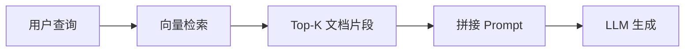
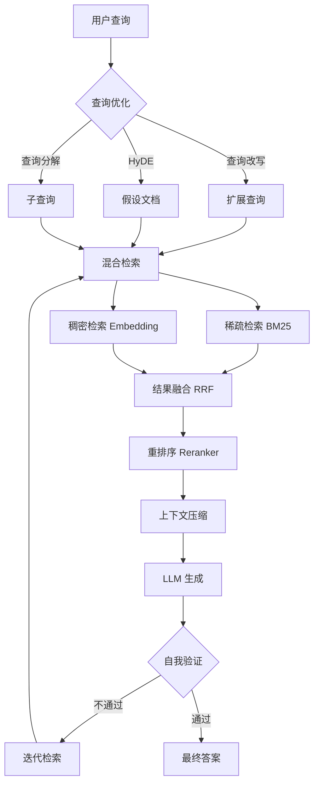
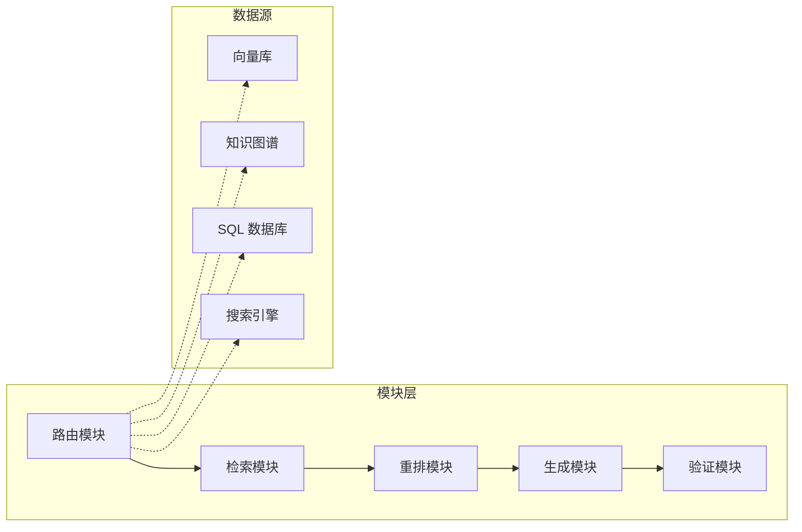
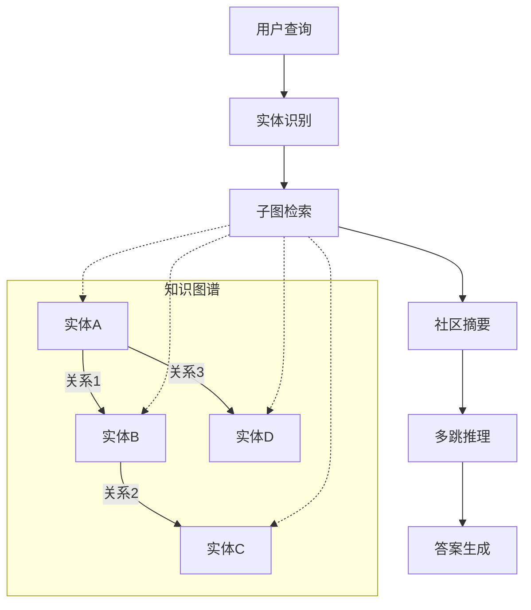
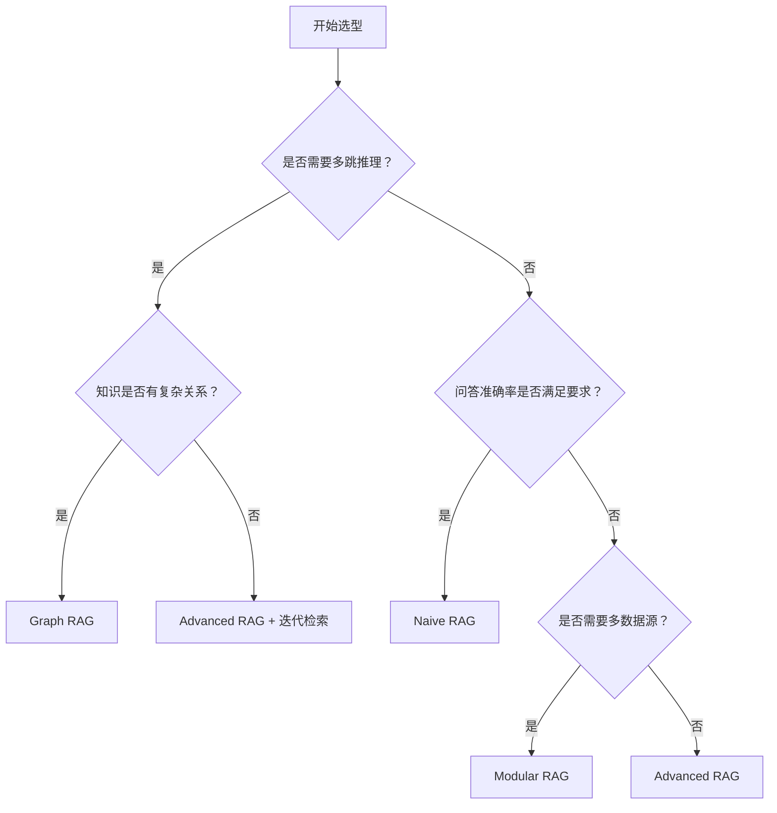

# RAG 架构演进：从朴素到生产

检索增强生成（Retrieval-Augmented Generation, RAG）是让大语言模型与外部知识交互的核心范式。从 2020 年 Meta 提出 RAG 论文至今，工程实践已迭代出多个代际。本文梳理从 Naive RAG 到 Graph RAG 的架构演进，帮助你在不同场景下做出合理选型。

## 一、RAG 的核心问题

大语言模型存在三个根本性缺陷：

- **知识截止**：训练数据有截止日期，无法回答最新信息
- **幻觉倾向**：模型倾向于生成看似合理但无依据的内容
- **私有知识缺失**：企业内部文档、数据库等私有信息不在训练语料中

RAG 通过"先检索、后生成"的范式，将外部知识注入生成过程，缓解上述问题。但如何检索、检索什么、如何注入，决定了系统的最终质量。

## 二、Naive RAG：朴素的起点

Naive RAG 是最基础的实现，遵循"索引-检索-生成"三段式流程。



### 核心组件

```python
from langchain_core.prompts import ChatPromptTemplate
from langchain_core.runnables import RunnablePassthrough
from langchain_openai import ChatOpenAI, OpenAIEmbeddings
from langchain_community.vectorstores import Chroma

# 1. 索引阶段：文档加载 -> 分块 -> 向量化 -> 存储
embeddings = OpenAIEmbeddings(model="text-embedding-3-small")
vectorstore = Chroma.from_documents(
    documents=chunked_docs,
    embedding=embeddings,
    persist_directory="./chroma_db"
)

# 2. 检索阶段：查询向量化 -> 相似度检索
retriever = vectorstore.as_retriever(search_kwargs={"k": 4})

# 3. 生成阶段：拼接上下文 -> LLM 生成
template = """基于以下上下文回答问题。如果无法从上下文中找到答案，请说明。

上下文：
{context}

问题：{question}
"""
prompt = ChatPromptTemplate.from_template(template)

rag_chain = (
    {"context": retriever, "question": RunnablePassthrough()}
    | prompt
    | ChatOpenAI(model="gpt-4o-mini")
)
```

### Naive RAG 的典型问题

| 问题 | 原因 | 影响 |
|------|------|------|
| 检索不准 | 单向量相似度无法捕获语义多义性 | 返回不相关片段 |
| 检索不全 | Top-K 固定，可能遗漏关键信息 | 答案不完整 |
| 上下文冗余 | 缺乏过滤，噪声片段被送入 LLM | 浪费 token，降低质量 |
| 缺乏验证 | 无法判断检索内容是否与问题相关 | 幻觉依然存在 |

## 三、Advanced RAG：工程化改造

Advanced RAG 在 Naive RAG 的每个环节增加优化策略，本质是"把每个组件做到位"。



### Pre-Retrieval：查询优化

```python
from langchain_core.output_parsers import StrOutputParser

# 查询改写：将模糊查询改写为更精确的形式
rewrite_template = """将以下问题改写为更适合检索的形式，生成3个不同角度的查询：

原始问题：{question}

改写查询："""
rewrite_prompt = ChatPromptTemplate.from_template(rewrite_template)
rewrite_chain = rewrite_prompt | ChatOpenAI(model="gpt-4o-mini") | StrOutputParser()

# HyDE：让 LLM 先生成假设性答案，用假设答案去检索
hyde_template = """请根据以下问题写一段可能包含答案的文档段落：

问题：{question}

文档段落："""
hyde_prompt = ChatPromptTemplate.from_template(hyde_template)
hyde_chain = hyde_prompt | ChatOpenAI(model="gpt-4o-mini") | StrOutputParser()
```

### Post-Retrieval：重排序与压缩

```python
from langchain.retrievers import ContextualCompressionRetriever
from langchain.retrievers.document_compressors import CrossEncoderReranker
from langchain_community.cross_encoders import HuggingFaceCrossEncoder

# 使用 Cross-Encoder 重排序
cross_encoder = HuggingFaceCrossEncoder(model_name="BAAI/bge-reranker-v2-m3")
compressor = CrossEncoderReranker(model=cross_encoder, top_n=3)
compression_retriever = ContextualCompressionRetriever(
    base_compressor=compressor,
    base_retriever=retriever
)
```

### Advanced RAG 的改进总结

| 环节 | 优化手段 | 效果 |
|------|----------|------|
| Pre-Retrieval | 查询改写、HyDE、查询分解 | 提高检索召回率 |
| Retrieval | 混合检索（稠密+稀疏）、多路召回 | 兼顾语义匹配与关键词匹配 |
| Post-Retrieval | 重排序、上下文压缩、冗余去除 | 提高上下文精度，降低 token 消耗 |
| Generation | 自我验证、迭代检索 | 减少幻觉，提高可信度 |

## 四、Modular RAG：组件化编排

Modular RAG 将 RAG 系统拆分为独立模块，每个模块可替换、可组合，适应不同业务场景。



### 模块化实现

```python
from abc import ABC, abstractmethod
from dataclasses import dataclass, field
from typing import List, Optional

@dataclass
class RAGContext:
    """RAG 流水线上下文，在模块间传递"""
    query: str
    sub_queries: List[str] = field(default_factory=list)
    retrieved_docs: List[dict] = field(default_factory=list)
    reranked_docs: List[dict] = field(default_factory=list)
    context_text: str = ""
    answer: str = ""
    metadata: dict = field(default_factory=dict)

class RAGModule(ABC):
    """RAG 模块基类"""
    @abstractmethod
    def process(self, ctx: RAGContext) -> RAGContext:
        ...

class QueryRewriteModule(RAGModule):
    def process(self, ctx: RAGContext) -> RAGContext:
        # 查询改写逻辑
        rewritten = rewrite_chain.invoke(ctx.query)
        ctx.sub_queries = [ctx.query] + rewritten.split("\n")
        return ctx

class HybridRetrievalModule(RAGModule):
    def __init__(self, vector_retriever, bm25_retriever, k: int = 10):
        self.vector_retriever = vector_retriever
        self.bm25_retriever = bm25_retriever
        self.k = k

    def process(self, ctx: RAGContext) -> RAGContext:
        all_docs = []
        for query in ctx.sub_queries:
            vec_docs = self.vector_retriever.invoke(query)
            bm25_docs = self.bm25_retriever.invoke(query)
            all_docs.extend(vec_docs + bm25_docs)
        # RRF 融合
        ctx.retrieved_docs = self._rrf_fusion(all_docs)
        return ctx

    def _rrf_fusion(self, doc_lists, k: int = 60) -> List[dict]:
        scores = {}
        for doc in doc_lists:
            doc_id = doc.page_content[:100]  # 简化的文档 ID
            if doc_id not in scores:
                scores[doc_id] = {"doc": doc, "score": 0}
        for rank, doc in enumerate(doc_lists):
            doc_id = doc.page_content[:100]
            scores[doc_id]["score"] += 1.0 / (rank + k)
        sorted_docs = sorted(scores.values(), key=lambda x: x["score"], reverse=True)
        return [item["doc"] for item in sorted_docs[:self.k]]

class RerankModule(RAGModule):
    def __init__(self, reranker_model: str = "BAAI/bge-reranker-v2-m3"):
        self.model = HuggingFaceCrossEncoder(model_name=reranker_model)

    def process(self, ctx: RAGContext) -> RAGContext:
        pairs = [[ctx.query, doc.page_content] for doc in ctx.retrieved_docs]
        scores = self.model.predict(pairs)
        ranked = sorted(zip(scores, ctx.retrieved_docs), key=lambda x: x[0], reverse=True)
        ctx.reranked_docs = [doc for _, doc in ranked[:5]]
        ctx.context_text = "\n\n".join(doc.page_content for doc in ctx.reranked_docs)
        return ctx

class RAGPipeline:
    """模块化 RAG 流水线"""
    def __init__(self, modules: List[RAGModule]):
        self.modules = modules

    def run(self, query: str) -> str:
        ctx = RAGContext(query=query)
        for module in self.modules:
            ctx = module.process(ctx)
        return ctx.answer

# 组装流水线
pipeline = RAGPipeline(modules=[
    QueryRewriteModule(),
    HybridRetrievalModule(vector_retriever, bm25_retriever),
    RerankModule(),
])
```

### Modular RAG 的关键特性

- **可替换性**：每个模块可独立替换为不同实现
- **可组合性**：根据场景选择不同模块组合
- **可观测性**：每个模块的输入输出可独立监控
- **可测试性**：模块可独立测试，便于迭代优化

## 五、Graph RAG：结构化知识增强

传统 RAG 基于向量相似度检索，在需要多跳推理的场景中表现不佳。Graph RAG 引入知识图谱，通过实体关系进行结构化检索。



### Graph RAG 的核心流程

```python
from neo4j import GraphDatabase

class GraphRAGRetriever:
    def __init__(self, uri: str, user: str, password: str):
        self.driver = GraphDatabase.driver(uri, auth=(user, password))

    def extract_entities(self, text: str) -> List[dict]:
        """使用 LLM 从文本中提取实体和关系"""
        extract_prompt = """从以下文本中提取实体和关系，以 JSON 格式返回：

文本：{text}

格式：
{{
  "entities": [{{"name": "实体名", "type": "实体类型"}}],
  "relations": [{{"head": "头实体", "relation": "关系", "tail": "尾实体"}}]
}}
"""
        result = llm.invoke(extract_prompt.format(text=text))
        return json.loads(result)

    def build_graph(self, documents: List[str]):
        """从文档构建知识图谱"""
        with self.driver.session() as session:
            for doc in documents:
                extracted = self.extract_entities(doc)
                for entity in extracted["entities"]:
                    session.run(
                        "MERGE (e:Entity {name: $name}) SET e.type = $type",
                        name=entity["name"], type=entity["type"]
                    )
                for rel in extracted["relations"]:
                    session.run(
                        """MATCH (h:Entity {name: $head}), (t:Entity {name: $tail})
                        MERGE (h)-[r:RELATES {type: $rel_type}]->(t)""",
                        head=rel["head"], tail=rel["tail"], rel_type=rel["relation"]
                    )

    def retrieve_subgraph(self, query: str, max_depth: int = 2) -> str:
        """基于查询检索相关子图"""
        entities = self.extract_entities(query)["entities"]
        entity_names = [e["name"] for e in entities]

        with self.driver.session() as session:
            result = session.run(
                """MATCH path = (e:Entity)-[*1..2]-(related:Entity)
                WHERE e.name IN $names
                RETURN path""",
                names=entity_names
            )
            # 将子图序列化为文本供 LLM 使用
            subgraph_text = self._serialize_paths(result)
            return subgraph_text
```

## 六、四代架构对比

| 维度 | Naive RAG | Advanced RAG | Modular RAG | Graph RAG |
|------|-----------|--------------|-------------|-----------|
| 检索方式 | 单路向量检索 | 混合检索+重排 | 模块化可编排 | 图结构检索 |
| 查询理解 | 原始查询 | 改写/扩展/分解 | 路由+自定义 | 实体识别+子图 |
| 知识表示 | 向量嵌入 | 向量+关键词 | 多源异构 | 知识图谱 |
| 多跳推理 | 不支持 | 有限（迭代） | 可配置 | 原生支持 |
| 工程复杂度 | 低 | 中 | 高 | 很高 |
| 适用场景 | POC/简单问答 | 生产级问答 | 企业级定制 | 复杂推理场景 |
| 延迟 | 低 | 中 | 中-高 | 高 |
| 维护成本 | 低 | 中 | 高 | 很高 |

## 七、选型决策树



### 选型建议

**Naive RAG** 适用于：
- 快速验证概念（POC）
- 文档类型单一、结构简单
- 用户查询直接、无歧义
- 对延迟敏感，对准确率要求不高

**Advanced RAG** 适用于：
- 生产环境标准方案
- 需要平衡准确率与工程复杂度
- 文档量大、查询多样

**Modular RAG** 适用于：
- 多数据源、多业务场景
- 需要灵活编排检索策略
- 团队有较强的工程能力
- 对可观测性和可维护性要求高

**Graph RAG** 适用于：
- 知识具有复杂实体关系（医疗、法律、金融）
- 需要多跳推理（"A 和 B 共同投资了哪些公司？"）
- 全局摘要类问题（"总结所有文档的核心观点"）
- 团队有图数据库运维能力

## 八、生产环境注意事项

### 1. 索引管理

```python
# 增量索引：避免全量重建
import hashlib


class IncrementalIndexer:
    def __init__(self, vectorstore, doc_hash_store):
        self.vectorstore = vectorstore
        self.doc_hash_store = doc_hash_store  # 记录已索引文档的哈希

    def index_if_new(self, documents):
        new_docs = []
        for doc in documents:
            doc_hash = hashlib.md5(doc.page_content.encode()).hexdigest()
            if not self.doc_hash_store.exists(doc_hash):
                new_docs.append(doc)
                self.doc_hash_store.save(doc_hash)
        if new_docs:
            self.vectorstore.add_documents(new_docs)
            print(f"新增索引 {len(new_docs)} 个文档片段")
        return len(new_docs)
```

### 2. 缓存策略

```python
import hashlib
import json
from functools import lru_cache

class RAGCache:
    """多级缓存：查询缓存 + 语义缓存"""
    def __init__(self, redis_client, similarity_threshold: float = 0.95):
        self.redis = redis_client
        self.threshold = similarity_threshold
        self.embeddings = OpenAIEmbeddings()

    def get(self, query: str) -> Optional[str]:
        # 精确匹配缓存
        cache_key = hashlib.md5(query.encode()).hexdigest()
        cached = self.redis.get(f"rag:exact:{cache_key}")
        if cached:
            return json.loads(cached)

        # 语义缓存：检查相似查询
        query_embedding = self.embeddings.embed_query(query)
        # 实际项目中需要向量数据库支持语义缓存查询
        return None

    def set(self, query: str, answer: str, ttl: int = 3600):
        cache_key = hashlib.md5(query.encode()).hexdigest()
        self.redis.setex(
            f"rag:exact:{cache_key}",
            ttl,
            json.dumps({"query": query, "answer": answer})
        )
```

### 3. 监控指标

| 指标 | 含义 | 告警阈值 |
|------|------|----------|
| 检索召回率 | Top-K 中相关文档占比 | < 0.7 |
| 上下文利用率 | 生成答案引用的上下文比例 | < 0.5 |
| 端到端延迟 | 从查询到返回答案的时间 | > 5s |
| 幻觉率 | 答案中无依据内容的比例 | > 0.1 |
| 缓存命中率 | 缓存命中次数/总查询次数 | < 0.3 |

### 4. 容错与降级

```python
class ResilientRAG:
    """带降级策略的 RAG 服务"""
    def __init__(self, primary_chain, fallback_chain, cache):
        self.primary = primary_chain
        self.fallback = fallback_chain
        self.cache = cache

    async def query(self, question: str) -> dict:
        # 1. 尝试缓存
        cached = self.cache.get(question)
        if cached:
            return {"answer": cached, "source": "cache"}

        # 2. 主链路
        try:
            answer = await self.primary.ainvoke(question)
            self.cache.set(question, answer)
            return {"answer": answer, "source": "primary"}
        except Exception as e:
            print(f"主链路异常: {e}")

        # 3. 降级到简化链路
        try:
            answer = await self.fallback.ainvoke(question)
            return {"answer": answer, "source": "fallback"}
        except Exception as e:
            print(f"降级链路异常: {e}")

        # 4. 最终降级：直接 LLM
        return {"answer": "抱歉，知识库暂时不可用，无法提供准确回答。", "source": "none"}
```

## 九、总结

RAG 架构的演进并非"新一代淘汰旧一代"，而是不同场景下的不同选择。Naive RAG 适合快速验证，Advanced RAG 是生产标配，Modular RAG 适配复杂业务，Graph RAG 解决结构化推理。实际项目中，往往需要在工程复杂度与业务收益之间找到平衡点。

核心原则：**先用 Naive RAG 验证价值，再用 Advanced RAG 提升质量，最后按需引入 Modular/Graph RAG 解决特定问题。**
