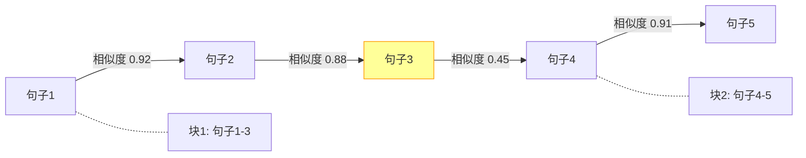

# 文档解析与智能分块策略

文档解析与分块是 RAG 系统的起点，也是影响最终效果最大的环节。垃圾进、垃圾出 -- 如果分块策略不合理，再精巧的检索和重排序也无济于事。本文覆盖常见文档格式的解析方法，以及从固定分块到语义分块的演进策略。

## 一、文档解析概览

RAG 系统中，文档从原始格式到可检索的向量，需要经过以下流程：


不同格式的文档面临不同挑战：

| 格式 | 主要挑战 | 推荐工具 |
|------|----------|----------|
| PDF | 表格/图片/多栏布局 | PyMuPDF, pdfplumber, Unstructured |
| Word | 样式层级/嵌入对象 | python-docx, Unstructured |
| HTML | 导航噪声/标签清洗 | BeautifulSoup, trafilatura |
| Markdown | 标题层级/代码块 | 自定义解析器 |
| PPT/XLS | 结构化数据提取 | python-pptx, openpyxl |

## 二、PDF 解析

PDF 是企业文档最常见的格式，也是解析难度最高的格式之一。

### 基础文本提取

```python
import fitz  # PyMuPDF

def extract_text_from_pdf(file_path: str) -> list[dict]:
    """提取 PDF 文本，保留页码和位置信息"""
    doc = fitz.open(file_path)
    pages = []
    for page_num, page in enumerate(doc):
        text = page.get_text("text")
        if text.strip():
            pages.append({
                "page_number": page_num + 1,
                "text": text.strip(),
                "metadata": {
                    "source": file_path,
                    "page": page_num + 1,
                    "total_pages": len(doc),
                }
            })
    doc.close()
    return pages
```

### 表格提取

PDF 中的表格是解析的难点，pdfplumber 在这方面表现较好：

```python
import pdfplumber

def extract_tables_from_pdf(file_path: str) -> list[dict]:
    """提取 PDF 中的表格并转为结构化文本"""
    tables_result = []
    with pdfplumber.open(file_path) as pdf:
        for page_num, page in enumerate(pdf.pages):
            tables = page.extract_tables()
            for table_idx, table in enumerate(tables):
                if not table or len(table) < 2:
                    continue
                # 将表格转为 Markdown 格式
                header = table[0]
                rows = table[1:]
                md_lines = []
                md_lines.append("| " + " | ".join(str(c) if c else "" for c in header) + " |")
                md_lines.append("| " + " | ".join("---" for _ in header) + " |")
                for row in rows:
                    md_lines.append("| " + " | ".join(str(c) if c else "" for c in row) + " |")
                table_text = "\n".join(md_lines)
                tables_result.append({
                    "text": table_text,
                    "metadata": {
                        "source": file_path,
                        "page": page_num + 1,
                        "table_index": table_idx + 1,
                        "type": "table",
                    }
                })
    return tables_result
```

### 使用 Unstructured 处理复杂布局

```python
from unstructured.partition.pdf import partition_pdf
from unstructured.cleaners.core import clean_extra_whitespace

def parse_pdf_with_unstructured(file_path: str) -> list[dict]:
    """使用 Unstructured 解析复杂 PDF，保留元素类型"""
    elements = partition_pdf(
        filename=file_path,
        strategy="hi_res",           # 使用高精度布局检测
        infer_table_structure=True,   # 推断表格结构
        extract_images_in_pdf=False,  # 是否提取图片
    )
    results = []
    for element in elements:
        clean_text = clean_extra_whitespace(str(element))
        if clean_text.strip():
            results.append({
                "text": clean_text,
                "metadata": {
                    "source": file_path,
                    "element_type": type(element).__name__,  # Title, NarrativeText, Table 等
                    "page_number": getattr(element.metadata, "page_number", None),
                }
            })
    return results
```

### 扫描件 PDF 处理（OCR）

企业 PDF 文档中大量是扫描件（图片格式），传统文本提取无法处理。需要 OCR 识别。

#### OCR 方案对比

| 方案 | 准确率 | 速度 | 中文支持 | 成本 |
|------|--------|------|---------|------|
| Tesseract + jieba | 中 | 快 | 需配置 chi_sim | 免费 |
| PaddleOCR | 高 | 快 | 原生支持 | 免费 |
| marker (sershoo/marker) | 高 | 中 | 支持 | 免费 |
| Azure Document Intelligence | 极高 | 快 | 原生支持 | 付费 |
| Google Cloud Vision | 极高 | 快 | 原生支持 | 付费 |

#### PaddleOCR 集成示例

```python
class OCRProcessor:
    """扫描件 PDF 的 OCR 处理"""

    def __init__(self, lang: str = "ch"):
        from paddleocr import PaddleOCR
        self.ocr = PaddleOCR(
            use_angle_cls=True,
            lang=lang,  # ch=中文, en=英文, ch_en=中英混合
            show_log=False,
        )

    def process_scanned_pdf(self, pdf_path: str) -> list[dict]:
        """处理扫描件 PDF：逐页图片 → OCR → 文本"""
        import fitz  # PyMuPDF

        results = []
        doc = fitz.open(pdf_path)

        for page_num in range(len(doc)):
            page = doc[page_num]

            # 检查是否为扫描件（无文本层或文本极少）
            text = page.get_text().strip()
            if len(text) > 50:
                # 有文本层，直接提取
                results.append({
                    "page": page_num + 1,
                    "text": text,
                    "source": "text_layer"
                })
                continue

            # 扫描件：转为图片后 OCR
            pix = page.get_pixmap(dpi=300)  # 300 DPI 保证 OCR 质量
            img_bytes = pix.tobytes("png")

            import numpy as np
            from PIL import Image
            import io
            img = Image.open(io.BytesIO(img_bytes))
            img_array = np.array(img)

            ocr_result = self.ocr.ocr(img_array, cls=True)
            page_text = "\n".join(
                line[1][0] for line in ocr_result[0]
            ) if ocr_result[0] else ""

            results.append({
                "page": page_num + 1,
                "text": page_text,
                "source": "ocr"
            })

        return results
```

## 三、Word 解析

```python
from docx import Document

def extract_text_from_docx(file_path: str) -> list[dict]:
    """提取 Word 文档文本，保留标题层级"""
    doc = Document(file_path)
    sections = []
    current_heading = ""
    current_level = 0
    current_text_parts = []

    for para in doc.paragraphs:
        if para.style.name.startswith("Heading"):
            # 遇到新标题，保存前一段内容
            if current_text_parts:
                sections.append({
                    "text": "\n".join(current_text_parts),
                    "heading": current_heading,
                    "heading_level": current_level,
                })
                current_text_parts = []
            current_heading = para.text.strip()
            current_level = int(para.style.name.replace("Heading ", ""))
        else:
            if para.text.strip():
                current_text_parts.append(para.text.strip())

    # 保存最后一段
    if current_text_parts:
        sections.append({
            "text": "\n".join(current_text_parts),
            "heading": current_heading,
            "heading_level": current_level,
        })

    # 转换为文档格式
    return [
        {
            "text": (f"## {s['heading']}\n{s['text']}" if s['heading'] else s['text']),
            "metadata": {
                "source": file_path,
                "heading": s["heading"],
                "heading_level": s["heading_level"],
            }
        }
        for s in sections
    ]
```

## 四、HTML 解析

```python
from bs4 import BeautifulSoup
import trafilatura

def extract_text_from_html(html_content: str, url: str = "") -> dict:
    """从 HTML 提取正文内容，去除导航和广告噪声"""
    # 方法一：trafilatura 自动提取正文
    extracted = trafilatura.extract(
        html_content,
        include_links=True,
        include_tables=True,
        favor_precision=True,  # 偏向精确，宁可少提取
    )
    if extracted:
        return {
            "text": extracted,
            "metadata": {"source": url, "type": "html"}
        }

    # 方法二：BeautifulSoup 手动清洗
    soup = BeautifulSoup(html_content, "html.parser")
    # 移除噪声标签
    for tag in soup(["script", "style", "nav", "footer", "header", "aside"]):
        tag.decompose()
    text = soup.get_text(separator="\n")
    lines = [line.strip() for line in text.splitlines() if line.strip()]
    return {
        "text": "\n".join(lines),
        "metadata": {"source": url, "type": "html"}
    }
```

## 五、分块策略

分块（Chunking）是将长文档切分为可检索单元的过程。分块大小和策略直接影响检索粒度和上下文完整性。

### 5.1 固定大小分块

最简单的策略，按字符数或 token 数切割。

```python
from langchain.text_splitter import CharacterTextSplitter

splitter = CharacterTextSplitter(
    separator="\n\n",
    chunk_size=500,
    chunk_overlap=50,
    length_function=len,
)
chunks = splitter.split_documents(documents)
```

**优点**：实现简单，可预测的块大小
**缺点**：可能在句子中间截断，破坏语义完整性

### 5.2 递归字符分块

LangChain 最推荐的通用分块器，按分隔符优先级递归切割：

```python
from langchain.text_splitter import RecursiveCharacterTextSplitter

splitter = RecursiveCharacterTextSplitter(
    separators=["\n\n", "\n", "。", "！", "？", ".", "!", "?", " ", ""],
    chunk_size=500,
    chunk_overlap=50,
)
chunks = splitter.split_documents(documents)
```

工作原理：优先按双换行（段落）切割，如果段落超长则按单换行切割，再按句号切割，以此类推。这种方式在中文文档上表现良好，因为中文分隔符（句号、感叹号）被纳入了优先级列表。

### 5.3 基于句子的分块

以句子为最小单元，避免句子被截断：

```python
import re

def sentence_based_chunk(text: str, max_sentences: int = 5, overlap: int = 1) -> list[str]:
    """基于句子的分块，支持重叠"""
    # 中英文句子分割
    sentences = re.split(r'(?<=[。！？.!?])\s*', text)
    sentences = [s.strip() for s in sentences if s.strip()]

    chunks = []
    i = 0
    while i < len(sentences):
        chunk_sentences = sentences[i:i + max_sentences]
        chunks.append("".join(chunk_sentences))
        i += max_sentences - overlap  # 重叠窗口
    return chunks
```

### 5.4 语义分块

基于嵌入向量的语义相似度进行分块，在语义断点处切割：

```python
from langchain_experimental.text_splitter import SemanticChunker
from langchain_openai import OpenAIEmbeddings

semantic_splitter = SemanticChunker(
    embeddings=OpenAIEmbeddings(model="text-embedding-3-small"),
    breakpoint_threshold_type="percentile",  # 按 percentile 判断断点
    breakpoint_threshold_amount=75,          # 第 75 百分位作为阈值
)
chunks = semantic_splitter.split_documents(documents)
```

语义分块的原理：



句子 3 到句子 4 的相似度骤降（0.45），说明语义发生了跳转，因此在此处切分。

### 5.5 基于 Markdown 标题的分块

适用于结构化文档，按标题层级保留文档结构：

```python
from langchain.text_splitter import MarkdownHeaderTextSplitter

headers_to_split_on = [
    ("#", "h1"),
    ("##", "h2"),
    ("###", "h3"),
]
md_splitter = MarkdownHeaderTextSplitter(headers_to_split_on=headers_to_split_on)
md_chunks = md_splitter.split_text(markdown_text)

# md_chunks 中每个 chunk 会携带标题元数据
# 例如: {"h1": "第一章", "h2": "1.1 概述"}
```

## 六、分块策略对比与选型

| 策略 | 语义完整性 | 实现复杂度 | 适用场景 |
|------|-----------|-----------|----------|
| 固定大小 | 低 | 低 | 日志、对话记录 |
| 递归字符 | 中 | 低 | 通用场景首选 |
| 基于句子 | 中 | 低 | 对句子完整性要求高的场景 |
| 语义分块 | 高 | 高 | 长文档、主题多变的文档 |
| Markdown 标题 | 高 | 低 | 结构化文档、技术文档 |

**实践建议**：

1. 起步阶段使用递归字符分块，简单有效
2. 结构化文档（Markdown、技术文档）优先使用标题分块
3. 质量要求高时测试语义分块，注意评估成本
4. 不要迷信单一策略，混合策略往往效果最佳

## 七、元数据提取

元数据是 RAG 检索过滤的关键，好的元数据能让检索从"大海捞针"变为"分类查找"。

```python
from dataclasses import dataclass, field
from datetime import datetime
from typing import Optional

@dataclass
class ChunkMetadata:
    """文档块的元数据"""
    source: str                           # 文件路径
    filename: str                         # 文件名
    file_type: str                        # pdf/docx/html/md
    page_number: Optional[int] = None     # 页码
    section_title: Optional[str] = None   # 章节标题
    heading_level: Optional[int] = None   # 标题层级
    chunk_index: int = 0                  # 块序号
    total_chunks: int = 0                 # 总块数
    created_at: Optional[str] = None      # 文档创建时间
    author: Optional[str] = None          # 作者
    tags: list[str] = field(default_factory=list)  # 自定义标签

def build_metadata(file_path: str, chunk_idx: int, total: int,
                   page: int = None, heading: str = None) -> dict:
    """构建标准化的块元数据"""
    import os
    stat = os.stat(file_path)
    return ChunkMetadata(
        source=file_path,
        filename=os.path.basename(file_path),
        file_type=os.path.splitext(file_path)[1].lstrip("."),
        page_number=page,
        section_title=heading,
        chunk_index=chunk_idx,
        total_chunks=total,
        created_at=datetime.fromtimestamp(stat.st_ctime).isoformat(),
    ).__dict__
```

### 利用元数据过滤检索

```python
from langchain_core.documents import Document

# 构建带元数据的文档
docs_with_metadata = [
    Document(
        page_content=chunk["text"],
        metadata=build_metadata(
            file_path="reports/2024_Q3_report.pdf",
            chunk_idx=i,
            total=len(chunks),
            page=chunk.get("page"),
            heading=chunk.get("heading"),
        )
    )
    for i, chunk in enumerate(chunks)
]

# 向量库支持元数据过滤
vectorstore = Chroma.from_documents(docs_with_metadata, embeddings)

# 检索时按元数据过滤：只检索 PDF 且页码在 10-20 之间的内容
results = vectorstore.similarity_search(
    query="营收增长",
    k=5,
    filter={
        "file_type": "pdf",
        "page_number": {"$gte": 10, "$lte": 20}
    }
)
```

## 八、生产环境最佳实践

### 8.1 分块大小选择

分块大小没有银弹，需要根据业务场景调整：

```python
# 不同场景的推荐配置
CHUNK_CONFIGS = {
    "faq": {"chunk_size": 200, "chunk_overlap": 20},      # FAQ：短小精确
    "technical": {"chunk_size": 500, "chunk_overlap": 50},  # 技术文档：中等
    "narrative": {"chunk_size": 1000, "chunk_overlap": 100}, # 长文叙述：较大
    "legal": {"chunk_size": 800, "chunk_overlap": 200},     # 法律文书：大重叠保完整性
}
```

**经验法则**：
- chunk_size 通常在 200-1000 之间
- chunk_overlap 设为 chunk_size 的 10%-20%
- 嵌入模型的上下文窗口是上限，但不建议撑满

### 8.2 文档预处理流水线

```python
import re
from pathlib import Path

class DocumentPipeline:
    """文档解析-清洗-分块流水线"""

    def __init__(self, chunk_size: int = 500, chunk_overlap: int = 50):
        self.chunk_size = chunk_size
        self.chunk_overlap = chunk_overlap
        self.parsers = {
            ".pdf": self._parse_pdf,
            ".docx": self._parse_docx,
            ".html": self._parse_html,
            ".md": self._parse_markdown,
        }

    def process_file(self, file_path: str) -> list[Document]:
        """处理单个文件：解析 -> 清洗 -> 分块"""
        path = Path(file_path)
        suffix = path.suffix.lower()

        parser = self.parsers.get(suffix)
        if not parser:
            raise ValueError(f"不支持的文件格式: {suffix}")

        # 解析
        raw_sections = parser(file_path)
        # 清洗
        cleaned = [self._clean_text(s["text"]) for s in raw_sections]
        # 分块
        splitter = RecursiveCharacterTextSplitter(
            chunk_size=self.chunk_size,
            chunk_overlap=self.chunk_overlap,
            separators=["\n\n", "\n", "。", ".", " ", ""],
        )
        documents = []
        for section, raw in zip(cleaned, raw_sections):
            chunks = splitter.split_text(section)
            for i, chunk in enumerate(chunks):
                metadata = raw.get("metadata", {})
                metadata.update({"chunk_index": i})
                documents.append(Document(page_content=chunk, metadata=metadata))
        return documents

    def _clean_text(self, text: str) -> str:
        """文本清洗（保留段落结构，兼容中文）"""
        # 保留段落分隔（双换行），只折叠段落内的水平空白
        paragraphs = text.split('\n\n')
        cleaned = []
        for p in paragraphs:
            p = re.sub(r'[ \t]+', ' ', p)              # 折叠水平空白
            p = re.sub(r'[\x00-\x08\x0b\x0c\x0e-\x1f]', '', p)  # 控制字符
            p = p.strip()
            if p:
                cleaned.append(p)
        return '\n\n'.join(cleaned)

    def _parse_pdf(self, path: str) -> list[dict]:
        # 使用上文定义的 extract_text_from_pdf
        return extract_text_from_pdf(path)

    def _parse_docx(self, path: str) -> list[dict]:
        return extract_text_from_docx(path)

    def _parse_html(self, path: str) -> list[dict]:
        with open(path, "r", encoding="utf-8") as f:
            result = extract_text_from_html(f.read(), url=path)
            return [result]

    def _parse_markdown(self, path: str) -> list[dict]:
        with open(path, "r", encoding="utf-8") as f:
            text = f.read()
        md_splitter = MarkdownHeaderTextSplitter(
            headers_to_split_on=[("#", "h1"), ("##", "h2"), ("###", "h3")]
        )
        chunks = md_splitter.split_text(text)
        return [{"text": c.page_content, "metadata": c.metadata} for c in chunks]
```

### 8.3 分块质量评估

分块质量直接影响检索效果，应在入库前进行检查：

```python
def validate_chunks(chunks: list[Document]) -> dict:
    """评估分块质量"""
    lengths = [len(c.page_content) for c in chunks]
    avg_len = sum(lengths) / len(lengths) if lengths else 0
    too_short = sum(1 for l in lengths if l < 50)
    too_long = sum(1 for l in lengths if l > 2000)
    empty = sum(1 for l in lengths if l == 0)

    report = {
        "total_chunks": len(chunks),
        "avg_length": round(avg_len, 1),
        "min_length": min(lengths) if lengths else 0,
        "max_length": max(lengths) if lengths else 0,
        "too_short_count": too_short,
        "too_long_count": too_long,
        "empty_count": empty,
        "quality_score": 1.0 - (too_short + too_long + empty) / max(len(chunks), 1),
    }

    if report["quality_score"] < 0.8:
        print(f"警告: 分块质量分数 {report['quality_score']:.2f}，建议调整分块参数")
    return report
```

## 九、总结

文档解析与分块是 RAG 系统的地基。核心要点：

1. **解析先行**：选对解析工具，PDF 用 PyMuPDF/pdfplumber，HTML 用 trafilatura，复杂场景用 Unstructured
2. **分块选型**：通用场景选递归字符分块，结构化文档选标题分块，高要求场景试语义分块
3. **元数据不可或缺**：页码、标题、文件类型等元数据是过滤检索的关键
4. **闭环验证**：分块入库前做质量检查，入库后做检索效果评估，持续调优
