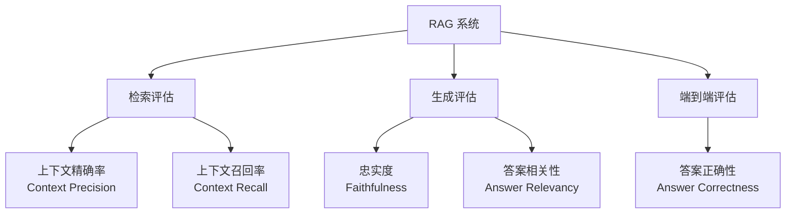
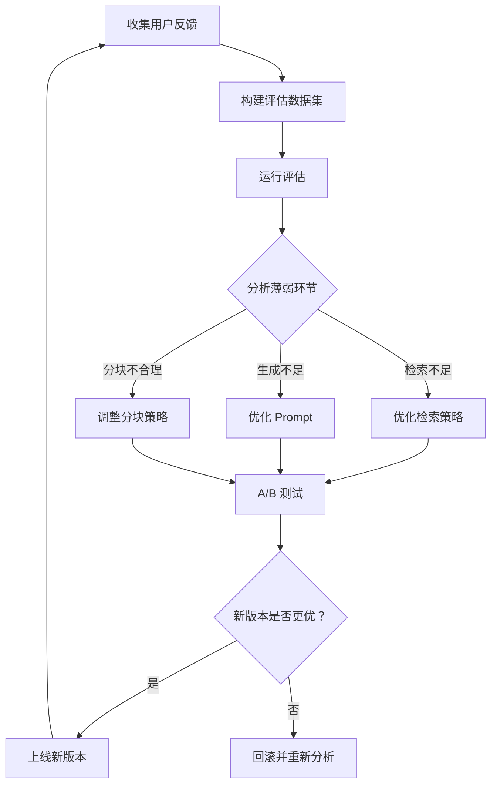

# RAG 评估与迭代优化

没有评估就无法优化。RAG 系统涉及检索和生成两个核心环节，每个环节都有独立的评估维度。本文介绍 RAGAS 评估框架、LLM-as-Judge 方法，以及如何构建评估数据集和迭代优化流程。

## 一、为什么需要 RAG 评估

RAG 系统的典型问题无法仅靠人工体验发现：

- 检索了相关文档但 LLM 没有正确利用
- LLM 生成了看似合理但与检索内容矛盾的答案
- 检索结果不完整，缺少关键上下文
- 检索了大量不相关内容，浪费 token 且干扰生成

系统化的评估能回答这些问题，并指导迭代方向。

## 二、RAG 评估框架概览



| 指标 | 评估环节 | 含义 |
|------|----------|------|
| Context Precision | 检索 | 检索结果中相关文档的排名是否靠前 |
| Context Recall | 检索 | 所需的上下文是否都被检索到 |
| Faithfulness | 生成 | 答案是否忠实于检索到的上下文 |
| Answer Relevancy | 生成 | 答案是否与问题相关 |
| Answer Correctness | 端到端 | 答案是否与标准答案一致 |

## 三、RAGAS 框架

RAGAS（Retrieval Augmented Generation Assessment）是目前最流行的 RAG 评估框架。

### 安装与准备

```python
# pip install ragas
from ragas import evaluate
from ragas.metrics import (
    faithfulness,
    answer_relevancy,
    context_precision,
    context_recall,
    answer_correctness,
)
from ragas.dataset_schema import SingleTurnSample, EvaluationDataset
from langchain_openai import ChatOpenAI, OpenAIEmbeddings
```

### 构建评估数据集

评估数据集需要以下字段：

```python
# 标准评估数据样例
samples = [
    SingleTurnSample(
        user_input="Kubernetes 中 Pod 的生命周期有哪几个阶段？",
        response="Pod 的生命周期包括 Pending、Running、Succeeded、Failed 和 Unknown 五个阶段。",
        reference="Pod 生命周期阶段：Pending（已接受但未运行）、Running（已绑定节点且至少一个容器运行）、Succeeded（所有容器成功终止）、Failed（至少一个容器以失败终止）、Unknown（无法获取 Pod 状态）。",
        retrieved_contexts=[
            "Pod 生命周期阶段包括 Pending、Running、Succeeded、Failed 和 Unknown。",
            "Pending 状态表示 Pod 已被 Kubernetes 系统接受，但尚未完成调度。",
            "Running 状态表示 Pod 已绑定到某个节点，且至少一个容器正在运行。",
        ],
    ),
    SingleTurnSample(
        user_input="如何配置 Kubernetes 的资源限制？",
        response="可以通过在 Pod 规约中设置 resources.limits 和 resources.requests 来配置资源限制。",
        reference="在 Pod 的容器级别设置 resources 字段，包括 requests（调度保证的最小资源）和 limits（允许使用的最大资源），支持 CPU 和 memory 两种资源类型。",
        retrieved_contexts=[
            "Kubernetes 允许为容器设置资源请求和限制。",
            "resources.requests 定义调度时的最小资源保证。",
            "resources.limit 定义容器可以使用的最大资源量。",
        ],
    ),
]

eval_dataset = EvaluationDataset(samples=samples)
```

### 执行评估

```python
llm = ChatOpenAI(model="gpt-4o-mini")
embeddings = OpenAIEmbeddings(model="text-embedding-3-small")

result = evaluate(
    dataset=eval_dataset,
    metrics=[
        faithfulness,
        answer_relevancy,
        context_precision,
        context_recall,
        answer_correctness,
    ],
    llm=llm,
    embeddings=embeddings,
)

print(result)
# 输出示例：
# {'faithfulness': 0.85, 'answer_relevancy': 0.92,
#  'context_precision': 0.78, 'context_recall': 0.88, 'answer_correctness': 0.82}
```

### 指标解读

**Faithfulness（忠实度）**：衡量答案是否可以从检索到的上下文中推导出来。

```
忠实度 = 可从上下文推导的声明数 / 答案中总声明数
```

低忠实度意味着 LLM 在"编造"答案中检索上下文不支持的部分。

**Answer Relevancy（答案相关性）**：衡量答案与问题的相关程度。通过从答案反推问题来评估。

**Context Precision（上下文精确率）**：衡量检索到的相关文档是否排在前面。

**Context Recall（上下文召回率）**：衡量回答问题所需的信息是否都被检索到了。

```
上下文召回率 = 标准答案中可归属到检索上下文的句子数 / 标准答案总句子数
```

## 四、LLM-as-Judge 评估

RAGAS 指标基于自动化计算，但有些质量维度难以用数值衡量。LLM-as-Judge 使用另一个 LLM 对输出进行打分和点评。

### 通用 Judge 框架

```python
from pydantic import BaseModel, Field

class JudgeVerdict(BaseModel):
    score: float = Field(ge=0, le=5, description="0-5 分制评分")
    reasoning: str = Field(description="评分理由")
    issues: list[str] = Field(default_factory=list, description="发现的问题")

class LLMJudge:
    """LLM-as-Judge 评估器"""

    def __init__(self, judge_model: str = "gpt-4o"):
        self.llm = ChatOpenAI(model=judge_model, temperature=0)
        self.parser = PydanticOutputParser(pydantic_object=JudgeVerdict)

    def evaluate_faithfulness(self, question: str, answer: str,
                               context: str) -> JudgeVerdict:
        """评估答案的忠实度"""
        prompt = f"""你是一个 RAG 系统评估专家。请评估以下答案是否忠实于提供的上下文。

评分标准：
- 5分：答案完全基于上下文，没有任何编造
- 4分：答案基本基于上下文，有轻微推断但不影响事实
- 3分：答案部分基于上下文，但包含一些无法从上下文验证的内容
- 2分：答案包含明显的上下文不支持的内容
- 1分：答案大部分内容无法从上下文中找到依据
- 0分：答案与上下文完全无关或矛盾

问题：{question}

上下文：
{context}

答案：{answer}

请按以下格式输出：
{self.parser.get_format_instructions()}
"""
        response = self.llm.invoke(prompt)
        return self.parser.parse(response.content)

    def evaluate_completeness(self, question: str, answer: str,
                               reference: str) -> JudgeVerdict:
        """评估答案的完整性"""
        prompt = f"""你是一个 RAG 系统评估专家。请评估以下答案相对于参考答案的完整性。

评分标准：
- 5分：答案覆盖了参考答案的所有关键信息
- 4分：答案覆盖了大部分关键信息，遗漏少量细节
- 3分：答案覆盖了主要信息，但遗漏了一些重要内容
- 2分：答案只覆盖了部分信息
- 1分：答案严重不完整
- 0分：答案完全未回答问题

问题：{question}

参考答案：{reference}

待评估答案：{answer}

请按以下格式输出：
{self.parser.get_format_instructions()}
"""
        response = self.llm.invoke(prompt)
        return self.parser.parse(response.content)
```

### 批量评估

```python
import json
from datetime import datetime

class RAGEvaluator:
    """RAG 系统综合评估器"""

    def __init__(self, rag_chain, judge_model: str = "gpt-4o"):
        self.rag_chain = rag_chain
        self.judge = LLMJudge(judge_model)
        self.results = []

    def evaluate_dataset(self, test_cases: list[dict]) -> dict:
        """对测试数据集进行综合评估"""
        for case in test_cases:
            question = case["question"]
            reference = case["reference"]

            # 运行 RAG 系统
            rag_result = self.rag_chain.invoke(question)
            answer = rag_result["answer"]
            context = rag_result.get("context", "")

            # LLM-as-Judge 评估
            faithfulness = self.judge.evaluate_faithfulness(question, answer, context)
            completeness = self.judge.evaluate_completeness(question, answer, reference)

            self.results.append({
                "question": question,
                "answer": answer,
                "reference": reference,
                "faithfulness_score": faithfulness.score,
                "faithfulness_reasoning": faithfulness.reasoning,
                "completeness_score": completeness.score,
                "completeness_reasoning": completeness.reasoning,
                "issues": faithfulness.issues + completeness.issues,
            })

        # 汇总统计
        avg_faith = sum(r["faithfulness_score"] for r in self.results) / len(self.results)
        avg_compl = sum(r["completeness_score"] for r in self.results) / len(self.results)
        all_issues = [issue for r in self.results for issue in r["issues"]]

        return {
            "total_cases": len(self.results),
            "avg_faithfulness": round(avg_faith, 2),
            "avg_completeness": round(avg_compl, 2),
            "common_issues": self._summarize_issues(all_issues),
            "evaluated_at": datetime.now().isoformat(),
        }

    def _summarize_issues(self, issues: list[str]) -> list[dict]:
        """汇总常见问题"""
        from collections import Counter
        issue_counts = Counter(issues)
        return [{"issue": issue, "count": count}
                for issue, count in issue_counts.most_common(10)]

    def save_results(self, file_path: str):
        with open(file_path, "w", encoding="utf-8") as f:
            json.dump(self.results, f, ensure_ascii=False, indent=2)
```

## 五、构建评估数据集

评估数据集的质量决定了评估结果的可信度。

### 5.1 从真实用户查询构建

```python
class EvalDatasetBuilder:
    """从用户查询日志构建评估数据集"""

    def __init__(self, llm):
        self.llm = llm

    def generate_reference(self, question: str, documents: list[str]) -> dict:
        """基于文档生成标准答案"""
        context = "\n\n".join(documents)
        prompt = f"""基于以下文档内容，为问题生成一个准确、完整的参考答案。

文档内容：
{context}

问题：{question}

参考答案："""
        answer = self.llm.invoke(prompt).content
        return {"question": question, "reference": answer}

    def generate_questions_from_docs(self, documents: list[str],
                                     num_questions: int = 5) -> list[dict]:
        """从文档自动生成问答对"""
        context = "\n\n".join(documents)
        prompt = f"""基于以下文档内容，生成 {num_questions} 个问题及其参考答案。
问题应覆盖文档的不同方面，包括事实性问题和推理性问题。

文档内容：
{context}

请按以下 JSON 格式输出：
[
  {{"question": "问题1", "reference": "参考答案1"}},
  {{"question": "问题2", "reference": "参考答案2"}}
]"""
        response = self.llm.invoke(prompt).content
        import json
        # 提取 JSON 部分
        start = response.find("[")
        end = response.rfind("]") + 1
        return json.loads(response[start:end])
```

### 5.2 数据集分层采样

```python
from collections import defaultdict
import random

class StratifiedSampler:
    """分层采样，确保评估集覆盖不同类型的问题"""

    def __init__(self):
        self.questions_by_type = defaultdict(list)

    def add_question(self, question: dict, q_type: str):
        self.questions_by_type[q_type].append(question)

    def sample(self, total: int = 100) -> list[dict]:
        """按比例从各类型中采样"""
        total_available = sum(len(v) for v in self.questions_by_type.values())
        samples = []
        for q_type, questions in self.questions_by_type.items():
            ratio = len(questions) / total_available
            n = max(1, int(total * ratio))
            n = min(n, len(questions))
            samples.extend(random.sample(questions, n))
        return samples[:total]

# 使用示例
sampler = StratifiedSampler()
for q in all_questions:
    q_type = classify_question_type(q["question"])
    # 分类：factual(事实型), reasoning(推理型), comparison(对比型), procedural(步骤型)
    sampler.add_question(q, q_type)

eval_set = sampler.sample(total=50)
```

## 六、迭代优化流程

RAG 系统的优化不是一次性工作，而是持续迭代的过程。



### 6.1 基于评估结果的定向优化

```python
class RAGOptimizer:
    """根据评估结果指导优化方向"""

    def analyze(self, eval_results: dict) -> list[dict]:
        """分析评估结果，给出优化建议"""
        recommendations = []

        # 上下文召回率低 -> 检索不够全面
        if eval_results.get("context_recall", 1.0) < 0.7:
            recommendations.append({
                "issue": "上下文召回率不足",
                "metric": "context_recall",
                "value": eval_results["context_recall"],
                "actions": [
                    "增加 Top-K 数量",
                    "使用查询扩展或 HyDE",
                    "检查分块大小是否过小导致信息碎片化",
                    "尝试混合检索替代单一稠密检索",
                ],
            })

        # 上下文精确率低 -> 检索结果噪声多
        if eval_results.get("context_precision", 1.0) < 0.7:
            recommendations.append({
                "issue": "上下文精确率不足",
                "metric": "context_precision",
                "value": eval_results["context_precision"],
                "actions": [
                    "加入重排序模型",
                    "调整分块策略，增大块大小以提供更多上下文",
                    "使用元数据过滤减少不相关结果",
                    "优化嵌入模型",
                ],
            })

        # 忠实度低 -> LLM 编造内容
        if eval_results.get("faithfulness", 1.0) < 0.8:
            recommendations.append({
                "issue": "忠实度不足",
                "metric": "faithfulness",
                "value": eval_results["faithfulness"],
                "actions": [
                    "在 Prompt 中强调'仅基于上下文回答'",
                    "加入'无法回答'选项，避免模型强行回答",
                    "减少输入的噪声上下文",
                    "尝试温度更低的模型参数",
                ],
            })

        # 答案相关性低 -> 答案偏题
        if eval_results.get("answer_relevancy", 1.0) < 0.7:
            recommendations.append({
                "issue": "答案相关性不足",
                "metric": "answer_relevancy",
                "value": eval_results["answer_relevancy"],
                "actions": [
                    "优化 Prompt，明确要求回答聚焦问题",
                    "检查是否存在检索到的上下文误导 LLM",
                    "使用指令微调模型而非通用模型",
                ],
            })

        return recommendations
```

### 6.2 A/B 测试框架

```python
import hashlib
from dataclasses import dataclass

@dataclass
class ABTestConfig:
    name: str
    variant_a_name: str
    variant_b_name: str
    traffic_split: float = 0.5  # B 组流量比例

class ABTestFramework:
    """RAG 系统 A/B 测试框架"""

    def __init__(self, config: ABTestConfig, variant_a, variant_b):
        self.config = config
        self.variant_a = variant_a
        self.variant_b = variant_b
        self.results = {"a": [], "b": []}

    def get_variant(self, user_id: str) -> str:
        """基于用户 ID 确定分流"""
        hash_val = int(hashlib.md5(user_id.encode()).hexdigest(), 16) % 100
        return "b" if hash_val < self.config.traffic_split * 100 else "a"

    def query(self, question: str, user_id: str) -> dict:
        """查询并记录结果"""
        variant = self.get_variant(user_id)
        chain = self.variant_a if variant == "a" else self.variant_b
        result = chain.invoke(question)
        result["variant"] = variant
        self.results[variant].append({
            "question": question,
            "answer": result.get("answer", ""),
            "latency_ms": result.get("latency_ms", 0),
        })
        return result

    def compare(self) -> dict:
        """对比两个版本的表现"""
        a_latencies = [r["latency_ms"] for r in self.results["a"]]
        b_latencies = [r["latency_ms"] for r in self.results["b"]]

        return {
            "variant_a": {
                "name": self.config.variant_a_name,
                "sample_size": len(self.results["a"]),
                "avg_latency_ms": sum(a_latencies) / len(a_latencies) if a_latencies else 0,
            },
            "variant_b": {
                "name": self.config.variant_b_name,
                "sample_size": len(self.results["b"]),
                "avg_latency_ms": sum(b_latencies) / len(b_latencies) if b_latencies else 0,
            },
        }
```

## 七、评估自动化流水线

```python
class RAGEvalPipeline:
    """RAG 评估自动化流水线"""

    def __init__(self, rag_chain, eval_dataset_path: str):
        self.rag_chain = rag_chain
        self.eval_dataset_path = eval_dataset_path
        self.judge = LLMJudge()
        self.optimizer = RAGOptimizer()

    def run(self) -> dict:
        """执行完整评估流程"""
        # 1. 加载评估数据
        test_cases = self._load_eval_dataset()

        # 2. 运行 RAG 系统获取答案
        results = []
        for case in test_cases:
            rag_output = self.rag_chain.invoke(case["question"])
            results.append({
                **case,
                "actual_answer": rag_output.get("answer", ""),
                "retrieved_context": rag_output.get("context", ""),
            })

        # 3. 计算 RAGAS 指标
        ragas_scores = self._compute_ragas(results)

        # 4. LLM-as-Judge 评估
        judge_scores = self._compute_judge_scores(results)

        # 5. 生成优化建议
        recommendations = self.optimizer.analyze(ragas_scores)

        # 6. 输出报告
        report = {
            "ragas_metrics": ragas_scores,
            "judge_metrics": judge_scores,
            "recommendations": recommendations,
            "total_evaluated": len(results),
            "timestamp": datetime.now().isoformat(),
        }

        self._save_report(report)
        return report

    def _load_eval_dataset(self) -> list[dict]:
        with open(self.eval_dataset_path, "r", encoding="utf-8") as f:
            return json.load(f)

    def _compute_ragas(self, results: list[dict]) -> dict:
        samples = []
        for r in results:
            samples.append(SingleTurnSample(
                user_input=r["question"],
                response=r["actual_answer"],
                reference=r["reference"],
                retrieved_contexts=r["retrieved_context"].split("\n\n"),
            ))
        eval_dataset = EvaluationDataset(samples=samples)
        return evaluate(
            dataset=eval_dataset,
            metrics=[faithfulness, answer_relevancy, context_precision, context_recall],
            llm=ChatOpenAI(model="gpt-4o-mini"),
            embeddings=OpenAIEmbeddings(),
        )

    def _compute_judge_scores(self, results: list[dict]) -> dict:
        scores = []
        for r in results:
            verdict = self.judge.evaluate_faithfulness(
                r["question"], r["actual_answer"], r["retrieved_context"]
            )
            scores.append(verdict.score)
        return {"avg_faithfulness_judge": sum(scores) / len(scores) if scores else 0}

    def _save_report(self, report: dict):
        timestamp = datetime.now().strftime("%Y%m%d_%H%M%S")
        path = f"eval_reports/report_{timestamp}.json"
        with open(path, "w", encoding="utf-8") as f:
            json.dump(report, f, ensure_ascii=False, indent=2)
```

## 八、总结

RAG 评估是系统持续优化的基石：

1. **RAGAS 框架**提供标准化的自动化指标，适合大规模评估
2. **LLM-as-Judge** 提供更细腻的质量判断，补充自动化指标的不足
3. **评估数据集**是评估的根基，需要覆盖不同类型、不同难度的问题
4. **迭代优化**是闭环：评估 -> 分析 -> 优化 -> 再评估
5. **A/B 测试**确保优化方向正确，避免"改了更差"

关键原则：**先建立评估基线，再做任何优化。没有基线，就无法衡量改进。**
