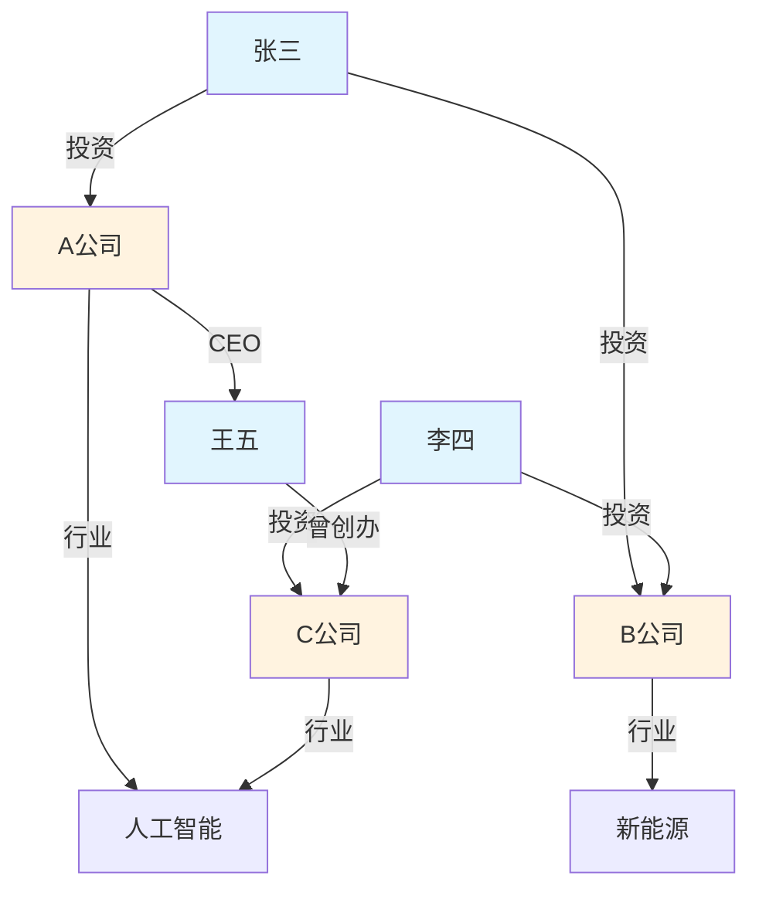
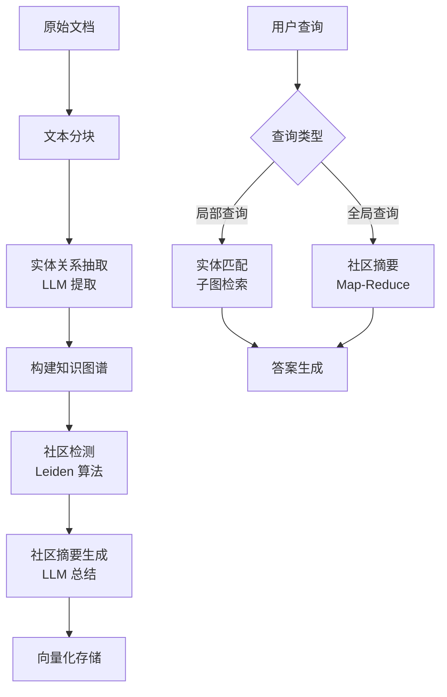
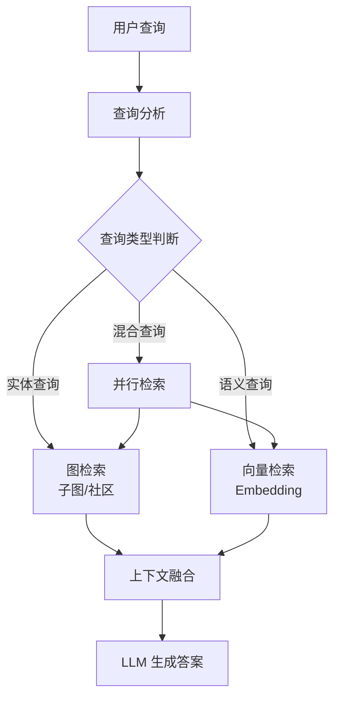

# Graph RAG 与知识图谱增强

传统 RAG 基于向量相似度检索，擅长处理局部语义匹配问题，但在需要跨文档、跨实体的多跳推理场景中力不从心。Graph RAG 通过引入知识图谱，将离散的文档片段组织为结构化的实体关系网络，使检索从"片段匹配"升级为"关系推理"。

## 一、向量 RAG 的局限

### 多跳推理问题

```
问题：张三和李四共同投资了哪些公司？

向量 RAG 的检索过程：
1. 检索"张三投资的公司" -> [A公司, B公司]
2. 检索"李四投资的公司" -> [B公司, C公司]
3. 需要人工或 LLM 交叉比对 -> B公司

问题：如果关系链更长呢？
"张三投资的公司中，哪家公司的CEO曾经创办过李四投资的公司？"
-> 向量检索几乎无法处理
```

### 全局摘要问题

```
问题：总结所有文档中关于市场趋势的核心观点

向量 RAG：只能检索语义相似的片段，无法覆盖全局
-> 结果偏向高频关键词，遗漏低频但重要的观点
```

Graph RAG 通过实体和关系的结构化表示，天然支持多跳推理和全局摘要。

## 二、知识图谱基础

### 核心概念



- **实体（Entity）**：现实世界中的对象（人、组织、事件等）
- **关系（Relation）**：实体之间的语义连接
- **属性（Property）**：实体的特征描述
- **三元组（Triple）**：知识图谱的基本单元，即（头实体，关系，尾实体）

### 知识图谱 vs 向量数据库

| 维度 | 向量数据库 | 知识图谱 |
|------|-----------|----------|
| 数据表示 | 高维向量 | 三元组 |
| 查询方式 | 相似度搜索 | 图遍历/模式匹配 |
| 推理能力 | 无（依赖 LLM） | 原生支持多跳 |
| 可解释性 | 低（黑盒向量） | 高（可追溯路径） |
| 构建成本 | 低（自动嵌入） | 高（需实体关系抽取） |
| 更新维护 | 重新嵌入 | 增量添加三元组 |

## 三、Microsoft GraphRAG

微软在 2024 年开源的 GraphRAG 是目前最具影响力的 Graph RAG 实现。其核心创新是**社区检测 + 全局摘要**。

### 架构流程



### 核心步骤详解

**Step 1：实体关系抽取**

使用 LLM 从每个文本块中提取实体和关系：

```python
from pydantic import BaseModel, Field
from typing import Optional

class Entity(BaseModel):
    name: str = Field(description="实体名称")
    type: str = Field(description="实体类型，如 Person, Organization, Event")
    description: str = Field(description="实体描述")

class Relationship(BaseModel):
    source: str = Field(description="头实体名称")
    target: str = Field(description="尾实体名称")
    relation: str = Field(description="关系类型")
    description: str = Field(description="关系描述")
    weight: float = Field(default=1.0, description="关系权重")

class ExtractionResult(BaseModel):
    entities: list[Entity]
    relationships: list[Relationship]

EXTRACTION_PROMPT = """从以下文本中提取实体和关系。

文本：
{text}

提取要求：
1. 识别文本中的所有重要实体（人物、组织、地点、事件、概念等）
2. 识别实体之间的关系
3. 为每个实体提供简短描述
4. 关系类型应简洁明确（如：投资、任职、合作、位于等）

请以 JSON 格式输出。"""

def extract_entities_and_relations(text: str, llm) -> ExtractionResult:
    """从文本中提取实体和关系"""
    from langchain_core.output_parsers import PydanticOutputParser
    parser = PydanticOutputParser(pydantic_object=ExtractionResult)
    prompt = EXTRACTION_PROMPT.format(text=text)
    response = llm.invoke(prompt + "\n\n" + parser.get_format_instructions())
    return parser.parse(response.content)
```

**Step 2：构建知识图谱**

```python
import networkx as nx
from collections import defaultdict

class KnowledgeGraph:
    """基于 NetworkX 的知识图谱"""

    def __init__(self):
        self.graph = nx.Graph()
        self.entity_map = {}  # name -> Entity
        self.communities = None

    def add_entities(self, entities: list[Entity]):
        for entity in entities:
            # 实体去重：同名实体合并描述
            if entity.name in self.entity_map:
                existing = self.entity_map[entity.name]
                if len(entity.description) > len(existing.description):
                    existing.description = entity.description
            else:
                self.entity_map[entity.name] = entity
                self.graph.add_node(entity.name,
                                    type=entity.type,
                                    description=entity.description)

    def add_relationships(self, relationships: list[Relationship]):
        for rel in relationships:
            # 确保头尾实体存在
            if rel.source not in self.entity_map:
                self.graph.add_node(rel.source)
            if rel.target not in self.entity_map:
                self.graph.add_node(rel.target)

            # 同一对实体可能有多个关系，用 weight 累加
            if self.graph.has_edge(rel.source, rel.target):
                edge_data = self.graph[rel.source][rel.target]
                edge_data["weight"] += rel.weight
                edge_data["relations"].append({
                    "type": rel.relation,
                    "description": rel.description,
                })
            else:
                self.graph.add_edge(rel.source, rel.target,
                                    weight=rel.weight,
                                    relations=[{
                                        "type": rel.relation,
                                        "description": rel.description,
                                    }])

    def build_from_documents(self, documents: list[str], llm) -> dict:
        """从文档集合构建知识图谱"""
        stats = {"total_entities": 0, "total_relationships": 0, "total_documents": len(documents)}
        for doc in documents:
            result = extract_entities_and_relations(doc, llm)
            self.add_entities(result.entities)
            self.add_relationships(result.relationships)
            stats["total_entities"] += len(result.entities)
            stats["total_relationships"] += len(result.relationships)
        return stats

    def get_entity_subgraph(self, entity_name: str, max_depth: int = 2) -> str:
        """获取实体的邻居子图，序列化为文本"""
        if entity_name not in self.graph:
            return f"未找到实体: {entity_name}"

        # BFS 获取邻居
        visited = {entity_name}
        current_level = {entity_name}
        for _ in range(max_depth):
            next_level = set()
            for node in current_level:
                for neighbor in self.graph.neighbors(node):
                    if neighbor not in visited:
                        visited.add(neighbor)
                        next_level.add(neighbor)
            current_level = next_level

        # 提取子图
        subgraph = self.graph.subgraph(visited)
        lines = []
        for u, v, data in subgraph.edges(data=True):
            for rel in data["relations"]:
                lines.append(f"{u} --[{rel['type']}]--> {v}")
        return "\n".join(lines)
```

**Step 3：社区检测与摘要**

```python
from community import community_louvain  # python-louvain

class CommunityDetector:
    """社区检测与摘要生成"""

    def __init__(self, kg: KnowledgeGraph, llm):
        self.kg = kg
        self.llm = llm
        self.community_summaries = {}

    def detect_communities(self) -> dict:
        """使用 Louvain 算法检测社区"""
        if len(self.kg.graph.edges) == 0:
            return {"num_communities": 0}

        partition = community_louvain.best_partition(self.kg.graph)
        self.kg.communities = defaultdict(list)
        for node, community_id in partition.items():
            self.kg.communities[community_id].append(node)

        return {
            "num_communities": len(self.kg.communities),
            "community_sizes": {
                cid: len(nodes) for cid, nodes in self.kg.communities.items()
            },
        }

    def generate_summaries(self) -> dict:
        """为每个社区生成摘要"""
        if not self.kg.communities:
            self.detect_communities()

        for cid, nodes in self.kg.communities.items():
            # 收集社区内的所有实体和关系
            entity_descriptions = []
            for node in nodes:
                node_data = self.kg.graph.nodes[node]
                desc = node_data.get("description", "")
                entity_type = node_data.get("type", "Unknown")
                entity_descriptions.append(f"- {node}（{entity_type}）: {desc}")

            # 收集社区内的关系
            relationship_lines = []
            subgraph = self.kg.graph.subgraph(nodes)
            for u, v, data in subgraph.edges(data=True):
                for rel in data["relations"]:
                    relationship_lines.append(f"- {u} --[{rel['type']}]--> {v}")

            # LLM 生成社区摘要
            prompt = f"""请为以下实体和关系群体生成一段摘要，概括其核心主题和关键信息：

实体：
{chr(10).join(entity_descriptions)}

关系：
{chr(10).join(relationship_lines)}

摘要："""
            summary = self.llm.invoke(prompt).content
            self.community_summaries[cid] = summary

        return {
            "num_summaries": len(self.community_summaries),
            "avg_summary_length": sum(len(s) for s in self.community_summaries.values())
                                  / max(len(self.community_summaries), 1),
        }
```

## 四、Neo4j 集成

生产环境中，知识图谱通常使用专业图数据库 Neo4j 存储。

### 连接与基本操作

```python
from neo4j import GraphDatabase

class Neo4jKnowledgeGraph:
    def __init__(self, uri: str = "bolt://localhost:7687",
                 user: str = "neo4j", password: str = "password"):
        self.driver = GraphDatabase.driver(uri, auth=(user, password))

    def close(self):
        self.driver.close()

    def create_entity(self, name: str, entity_type: str, description: str = "",
                      properties: dict = None):
        """创建实体节点"""
        props = properties or {}
        query = """
        MERGE (e:Entity {name: $name})
        SET e.type = $type, e.description = $desc
        SET e += $props
        """
        with self.driver.session() as session:
            session.run(query, name=name, type=entity_type, desc=description, props=props)

    def create_relationship(self, source: str, target: str, rel_type: str,
                            description: str = "", weight: float = 1.0):
        """创建关系"""
        # Cypher 关系类型不能含特殊字符，需清洗
        safe_rel_type = rel_type.replace(" ", "_").replace("-", "_").upper()
        query = f"""
        MATCH (s:Entity {{name: $source}})
        MATCH (t:Entity {{name: $target}})
        MERGE (s)-[r:{safe_rel_type}]->(t)
        SET r.description = $desc, r.weight = $weight
        """
        with self.driver.session() as session:
            session.run(query, source=source, target=target,
                        desc=description, weight=weight)

    def build_from_documents(self, documents: list[str], llm):
        """从文档批量构建知识图谱"""
        for doc in documents:
            result = extract_entities_and_relations(doc, llm)
            for entity in result.entities:
                self.create_entity(entity.name, entity.type, entity.description)
            for rel in result.relationships:
                self.create_relationship(rel.source, rel.target,
                                         rel.relation, rel.description, rel.weight)

    def search_subgraph(self, query_entities: list[str], max_depth: int = 2) -> str:
        """基于实体名称搜索子图"""
        query = """
        MATCH path = (e:Entity)-[*1..2]-(related:Entity)
        WHERE e.name IN $names
        RETURN path
        LIMIT 50
        """
        with self.driver.session() as session:
            results = session.run(query, names=query_entities)
            return self._format_paths(results)

    def search_by_keywords(self, keywords: list[str]) -> list[dict]:
        """基于关键词模糊搜索实体"""
        query = """
        MATCH (e:Entity)
        WHERE any(kw IN $keywords WHERE e.name CONTAINS kw OR e.description CONTAINS kw)
        RETURN e.name AS name, e.type AS type, e.description AS desc
        LIMIT 20
        """
        with self.driver.session() as session:
            results = session.run(query, keywords=keywords)
            return [{"name": r["name"], "type": r["type"], "desc": r["desc"]}
                    for r in results]

    def get_community_summary(self, entity_name: str) -> list[dict]:
        """获取实体所在社区的信息"""
        query = """
        MATCH (e:Entity {name: $name})-[r]-(neighbor:Entity)
        RETURN neighbor.name AS name, neighbor.type AS type,
               type(r) AS rel_type, r.description AS rel_desc
        LIMIT 20
        """
        with self.driver.session() as session:
            results = session.run(query, name=entity_name)
            return [{"neighbor": r["name"], "type": r["type"],
                     "relation": r["rel_type"], "relation_desc": r["rel_desc"]}
                    for r in results]

    def _format_paths(self, results) -> str:
        """将路径结果格式化为文本"""
        lines = []
        for record in results:
            path = record["path"]
            for i, node in enumerate(path.nodes):
                if i > 0:
                    lines.append(f" --[{path.relationships[i-1].type}]--> ")
                lines.append(f"({node['name']})")
            lines.append("\n")
        return "".join(lines)
```

### 创建索引加速查询

```python
def create_indexes(driver):
    """创建 Neo4j 索引，加速查询"""
    queries = [
        "CREATE INDEX entity_name_index IF NOT EXISTS FOR (e:Entity) ON (e.name)",
        "CREATE INDEX entity_type_index IF NOT EXISTS FOR (e:Entity) ON (e.type)",
        "CREATE FULLTEXT INDEX entity_search IF NOT EXISTS FOR (e:Entity) ON EACH [e.name, e.description]",
    ]
    with driver.session() as session:
        for query in queries:
            session.run(query)
```

## 五、Graph RAG 检索策略

### 局部查询：实体子图检索

适合"某实体的相关信息"类问题：

```python
class LocalGraphRetriever:
    """局部图检索：基于实体匹配的子图检索"""

    def __init__(self, neo4j_kg, llm, vector_retriever=None):
        self.kg = neo4j_kg
        self.llm = llm
        self.vector_retriever = vector_retriever

    def retrieve(self, query: str, top_k: int = 5) -> str:
        # 1. 从查询中提取实体
        entities = extract_entities_and_relations(query, self.llm).entities
        entity_names = [e.name for e in entities]

        # 2. 在图数据库中搜索匹配实体
        matched = self.kg.search_by_keywords(entity_names)
        if not matched:
            # 降级到向量检索
            if self.vector_retriever:
                return self.vector_retriever.search(query, top_k=top_k)
            return "未找到相关实体"

        # 3. 获取子图
        matched_names = [m["name"] for m in matched[:3]]
        subgraph_text = self.kg.search_subgraph(matched_names, max_depth=2)

        # 4. 获取社区信息补充上下文
        community_info = self.kg.get_community_summary(matched_names[0])

        # 5. 组装上下文
        context_parts = [f"实体关系子图：\n{subgraph_text}"]
        if community_info:
            neighbors = [f"- {c['neighbor']}（{c['type']}）：{c['relation_desc']}"
                        for c in community_info[:10]]
            context_parts.append(f"相关实体：\n" + "\n".join(neighbors))

        return "\n\n".join(context_parts)
```

### 全局查询：社区摘要 Map-Reduce

适合"总结/对比/趋势"类全局性问题：

```python
class GlobalGraphRetriever:
    """全局图检索：基于社区摘要的 Map-Reduce"""

    def __init__(self, community_summaries: dict, llm):
        self.community_summaries = community_summaries
        self.llm = llm

    def retrieve(self, query: str) -> str:
        # Map 阶段：每个社区摘要独立回答
        partial_answers = []
        for cid, summary in self.community_summaries.items():
            map_prompt = f"""基于以下社区摘要，回答问题。如果该社区与问题无关，请回答"无关"。

社区摘要：
{summary}

问题：{query}

回答："""
            answer = self.llm.invoke(map_prompt).content
            if "无关" not in answer:
                partial_answers.append(answer)

        if not partial_answers:
            return "未找到相关信息"

        # Reduce 阶段：汇总所有部分答案
        reduce_prompt = f"""基于以下来自不同社区的信息，综合回答问题。

问题：{query}

各社区信息：
{chr(10).join(f'--- 社区 {i+1} ---{chr(10)}{a}' for i, a in enumerate(partial_answers))}

综合回答："""
        return self.llm.invoke(reduce_prompt).content
```

## 六、混合 RAG：向量 + 图谱

最实用的方案是结合向量检索和图谱检索，发挥各自优势。



### 混合检索实现

```python
class HybridGraphRAG:
    """向量 + 图谱混合 RAG"""

    def __init__(self, vector_retriever, graph_retriever, llm,
                 local_retriever=None):
        self.vector_retriever = vector_retriever
        self.graph_retriever = graph_retriever
        self.local_retriever = local_retriever
        self.llm = llm

    def _classify_query(self, query: str) -> str:
        """判断查询类型"""
        classification_prompt = f"""判断以下查询的类型：

查询：{query}

类型定义：
- entity：涉及特定实体的问题（如"张三投资了哪些公司？"）
- global：涉及全局总结的问题（如"总结市场趋势"）
- semantic：通用语义匹配问题（如"如何部署K8s？"）

请只输出类型名称："""
        result = self.llm.invoke(classification_prompt).content.strip().lower()
        if result in ("entity", "global", "semantic"):
            return result
        return "semantic"  # 默认走向量检索

    def query(self, question: str) -> dict:
        query_type = self._classify_query(question)

        if query_type == "entity" and self.local_retriever:
            # 实体类问题 -> 图检索
            context = self.local_retriever.retrieve(question)
            source = "graph"
        elif query_type == "global" and self.graph_retriever:
            # 全局类问题 -> 社区摘要
            context = self.graph_retriever.retrieve(question)
            source = "community"
        else:
            # 语义类问题 -> 向量检索
            results = self.vector_retriever.search(question, top_k=5)
            context = "\n\n".join(r["text"] for r in results)
            source = "vector"

        # 生成答案
        answer_prompt = f"""基于以下上下文回答问题。

上下文：
{context}

问题：{question}

答案："""
        answer = self.llm.invoke(answer_prompt).content

        return {
            "answer": answer,
            "query_type": query_type,
            "retrieval_source": source,
            "context": context[:500],  # 截断用于日志
        }
```

## 七、三种 RAG 方案对比

| 维度 | Vector RAG | Graph RAG | Hybrid RAG |
|------|-----------|-----------|------------|
| 检索方式 | 向量相似度 | 图遍历/社区摘要 | 向量 + 图谱 |
| 多跳推理 | 弱 | 强 | 强 |
| 全局摘要 | 弱 | 强 | 强 |
| 精确匹配 | 中 | 强 | 强 |
| 语义匹配 | 强 | 中 | 强 |
| 构建成本 | 低 | 高（实体抽取） | 高 |
| 维护成本 | 低 | 高（图谱更新） | 高 |
| 延迟 | 低 | 中-高 | 中 |
| 适用数据 | 非结构化文本 | 结构化/半结构化 | 混合 |

### 选型建议

**用 Vector RAG**：
- 文档以非结构化文本为主
- 查询以事实性问答为主
- 快速验证，资源有限

**用 Graph RAG**：
- 知识有复杂实体关系（医疗、法律、金融）
- 查询涉及多跳推理
- 需要全局摘要能力
- 团队有图数据库经验

**用 Hybrid RAG**：
- 文档类型混合（结构化 + 非结构化）
- 查询类型多样（实体查询 + 语义查询）
- 追求最佳效果，能承受更高的工程成本

## 八、知识图谱构建注意事项

### 8.1 实体消歧与对齐

```python
class EntityResolver:
    """实体消歧：合并指向同一实体的不同名称"""

    def __init__(self, llm):
        self.llm = llm
        self.alias_map = {}  # alias -> canonical_name

    def resolve(self, entity_name: str, existing_entities: list[str]) -> str:
        """判断新实体是否与已有实体为同一实体"""
        if entity_name in self.alias_map:
            return self.alias_map[entity_name]

        if entity_name in existing_entities:
            return entity_name

        # 使用 LLM 判断是否为同一实体
        prompt = f"""判断"{entity_name}"是否与以下某个已有实体指向同一对象：

已有实体：{', '.join(existing_entities)}

如果是，返回对应实体名称；如果不是，返回"NEW"。
只输出结果，不要解释。"""
        result = self.llm.invoke(prompt).content.strip()

        if result != "NEW" and result in existing_entities:
            self.alias_map[entity_name] = result
            return result
        return entity_name
```

### 8.2 增量更新

```python
class IncrementalGraphUpdater:
    """知识图谱增量更新"""

    def __init__(self, neo4j_kg, llm):
        self.kg = neo4j_kg
        self.llm = llm

    def update_from_document(self, doc_text: str, doc_id: str):
        """增量更新：只处理新文档"""
        # 检查文档是否已处理
        check_query = "MATCH (d:Document {id: $doc_id}) RETURN d"
        with self.kg.driver.session() as session:
            result = session.run(check_query, doc_id=doc_id)
            if result.single():
                return  # 已处理，跳过

        # 提取实体关系
        extracted = extract_entities_and_relations(doc_text, self.llm)

        # 写入图谱
        for entity in extracted.entities:
            self.kg.create_entity(entity.name, entity.type, entity.description,
                                  properties={"source_doc": doc_id})
        for rel in extracted.relationships:
            self.kg.create_relationship(rel.source, rel.target,
                                         rel.relation, rel.description)

        # 标记文档已处理
        mark_query = "CREATE (d:Document {id: $doc_id, processed_at: datetime()})"
        with self.kg.driver.session() as session:
            session.run(mark_query, doc_id=doc_id)
```

### 8.3 质量控制

```python
def validate_graph_quality(kg: Neo4jKnowledgeGraph) -> dict:
    """检查知识图谱质量"""
    with kg.driver.session() as session:
        # 孤立节点比例
        isolated = session.run("""
            MATCH (e:Entity) WHERE NOT (e)--()
            RETURN count(e) AS count
        """).single()["count"]

        total_entities = session.run("MATCH (e:Entity) RETURN count(e) AS count").single()["count"]

        # 关系最多的实体（可能是过度连接的通用实体）
        hub_entities = session.run("""
            MATCH (e:Entity)-[r]-()
            RETURN e.name AS name, count(r) AS degree
            ORDER BY degree DESC
            LIMIT 5
        """).data()

        # 重复关系检测
        duplicate_rels = session.run("""
            MATCH (a:Entity)-[r]->(b:Entity)
            WITH a, b, type(r) AS rel_type, count(r) AS cnt
            WHERE cnt > 1
            RETURN a.name, b.name, rel_type, cnt
        """).data()

    return {
        "total_entities": total_entities,
        "isolated_entities": isolated,
        "isolation_rate": round(isolated / max(total_entities, 1), 3),
        "hub_entities": hub_entities,
        "duplicate_relationships": duplicate_rels,
        "quality_flag": "WARN" if isolated / max(total_entities, 1) > 0.3 else "OK",
    }
```

## 九、总结

Graph RAG 是向量 RAG 的重要补充，而非替代。核心要点：

1. **向量 RAG 擅长语义匹配，Graph RAG 擅长关系推理**，两者互补
2. **Microsoft GraphRAG** 提供了社区检测+全局摘要的完整方案，适合全局性问题
3. **Neo4j** 是生产环境图数据库的首选，支持 Cypher 查询和丰富的图算法
4. **混合 RAG** 是实用方案，根据查询类型路由到不同检索策略
5. **知识图谱构建**是最大挑战，需关注实体消歧、增量更新和质量控制

关键原则：**不要为了用图而用图。先用向量 RAG 解决 80% 的问题，再用 Graph RAG 解决剩余 20% 的多跳推理问题。**
