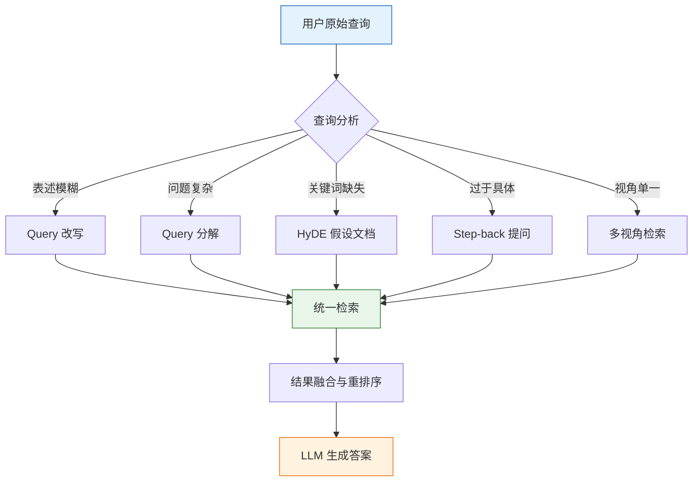

# 高级查询变换

用户输入的查询往往不是最优的检索输入。口语化的表述、模糊的指代、复合的问题，都会导致检索结果偏离目标。查询变换（Query Transformation）是 RAG 系统中承上启下的关键环节：将原始查询转换为更适合检索的形式，从而显著提升召回质量和最终回答的准确性。

## 查询变换全景



## Query 改写

### LLM-based 改写

利用 LLM 将用户口语化、模糊的查询改写为更精确的检索查询。

```python
from pydantic import BaseModel, Field

class RewrittenQuery(BaseModel):
    original_query: str = Field(description="原始查询")
    rewritten_query: str = Field(description="改写后的查询")
    reasoning: str = Field(description="改写理由")

REWRITE_PROMPT = """你是一个查询改写专家。将用户的口语化查询改写为更适合文档检索的精确查询。

改写原则：
1. 补全模糊指代（"它" -> 具体名称）
2. 扩展缩写和简称
3. 添加领域关键词
4. 去除无关修饰词
5. 保持核心意图不变

示例：
- "怎么报销" -> "差旅费用报销流程 报销单据 审批流程"
- "那个服务挂了怎么办" -> "服务故障排查 应急响应 监控告警处理流程"
- "新来的要搞啥" -> "新员工入职流程 入职材料清单 首周任务"

原始查询：{query}

请输出改写结果："""


def rewrite_query_llm(query: str, llm) -> RewrittenQuery:
    """使用 LLM 改写查询"""
    from langchain_core.output_parsers import PydanticOutputParser
    parser = PydanticOutputParser(pydantic_object=RewrittenQuery)
    prompt = REWRITE_PROMPT.format(query=query)
    response = llm.invoke(prompt + "\n\n" + parser.get_format_instructions())
    return parser.parse(response.content)
```

### 规则改写

对特定模式的查询应用规则改写，速度快、确定性强、无需 LLM 调用。

```python
import re

class RuleBasedRewriter:
    """基于规则的查询改写器"""

    def __init__(self):
        # 同义词映射
        self.synonym_map = {
            "报销": ["费用报销", "差旅报销", "报销流程"],
            "请假": ["假期申请", "休假审批", "请假流程"],
            "入职": ["新员工入职", "入职办理", "onboarding"],
            "服务器": ["云服务器", "ECS", "计算实例"],
            "数据库": ["RDS", "关系型数据库", "MySQL"],
        }
        # 缩写扩展
        self.abbreviation_map = {
            "K8s": "Kubernetes",
            "k8s": "Kubernetes",
            "CI/CD": "持续集成 持续部署",
            "CR": "代码审查 Code Review",
            "PR": "Pull Request 合并请求",
            "OOM": "Out of Memory 内存溢出",
            "SLA": "服务等级协议 Service Level Agreement",
        }

    def rewrite(self, query: str) -> list[str]:
        """应用规则改写，返回多个改写变体"""
        variants = [query]

        # 1. 同义词扩展
        for key, synonyms in self.synonym_map.items():
            if key in query:
                for syn in synonyms:
                    expanded = query.replace(key, syn)
                    variants.append(expanded)

        # 2. 缩写扩展
        for abbr, full in self.abbreviation_map.items():
            if abbr in query:
                expanded = query.replace(abbr, full)
                variants.append(expanded)

        # 3. 去除停用词（简单版本）
        stop_words = {"怎么", "如何", "什么", "的", "了", "吗", "呢", "啊"}
        words = query.split()
        filtered = " ".join(w for w in words if w not in stop_words)
        if filtered != query:
            variants.append(filtered)

        return list(set(variants))
```

### 混合改写：规则 + LLM

```python
class HybridRewriter:
    """混合改写器：先用规则快速改写，再用 LLM 精细改写"""

    def __init__(self, llm, rule_rewriter=None):
        self.llm = llm
        self.rule_rewriter = rule_rewriter or RuleBasedRewriter()

    def rewrite(self, query: str) -> list[str]:
        """执行混合改写"""
        # 阶段 1：规则改写（快速、低成本）
        rule_variants = self.rule_rewriter.rewrite(query)

        # 阶段 2：LLM 精细改写（只对原始查询执行一次）
        llm_result = rewrite_query_llm(query, self.llm)
        llm_variant = llm_result.rewritten_query

        # 合并去重
        all_variants = [query, llm_variant] + rule_variants
        return list(dict.fromkeys(all_variants))  # 保持顺序去重
```

## Query 分解

当用户提出复合问题时，将问题拆解为子查询分别检索，再将结果合并。

```python
class SubQuery(BaseModel):
    sub_question: str = Field(description="子问题")
    search_query: str = Field(description="对应的检索查询")
    dependency: str | None = Field(default=None, description="依赖的子问题编号")

class QueryDecomposition(BaseModel):
    sub_queries: list[SubQuery] = Field(description="子查询列表")

DECOMPOSE_PROMPT = """将以下复合问题拆解为独立的子问题。

拆解原则：
1. 每个子问题应该可以独立检索和回答
2. 保持子问题之间的逻辑关系
3. 如果子问题之间有依赖关系，标注依赖

示例：
原始问题："对比我们产品和竞品A的功能差异和价格"
子问题：
1. "我们产品的功能列表" (独立)
2. "竞品A的功能列表" (独立)
3. "我们产品的定价" (独立)
4. "竞品A的定价" (独立)

原始问题：{query}

请拆解为子问题："""


def decompose_query(query: str, llm) -> QueryDecomposition:
    """分解复合查询"""
    from langchain_core.output_parsers import PydanticOutputParser
    parser = PydanticOutputParser(pydantic_object=QueryDecomposition)
    prompt = DECOMPOSE_PROMPT.format(query=query)
    response = llm.invoke(prompt + "\n\n" + parser.get_format_instructions())
    return parser.parse(response.content)


def retrieve_with_decomposition(
    query: str,
    retriever,
    llm,
    top_k: int = 3,
) -> list[dict]:
    """带查询分解的检索"""
    decomposition = decompose_query(query, llm)

    all_results = []
    seen_contents = set()

    for sub in decomposition.sub_queries:
        results = retriever.search(sub.search_query, top_k=top_k)
        for r in results:
            content_hash = hash(r["content"][:200])
            if content_hash not in seen_contents:
                seen_contents.add(content_hash)
                r["source_query"] = sub.sub_question
                all_results.append(r)

    # 按相关度排序
    all_results.sort(key=lambda x: x.get("score", 0), reverse=True)
    return all_results[:top_k * 3]
```

## HyDE：Hypothetical Document Embedding

HyDE 的核心思路：先让 LLM 生成一个"假设性答案"，然后用这个假设答案的 Embedding 去检索真实文档。假设答案与真实文档在语义空间中更接近，因此检索效果更好。

```python
from sentence_transformers import SentenceTransformer
import numpy as np

class HyDERetriever:
    """基于假设文档嵌入的检索器"""

    def __init__(self, embed_model: SentenceTransformer, vector_store, llm):
        self.embed_model = embed_model
        self.vector_store = vector_store
        self.llm = llm

    HYDE_PROMPT = """请针对以下问题写一段详细的回答。不需要完全正确，但要包含相关的专业术语和概念。

问题：{query}

回答："""

    def retrieve(self, query: str, top_k: int = 5) -> list[dict]:
        """使用 HyDE 策略检索"""
        # 1. 生成假设性答案
        hyde_prompt = self.HYDE_PROMPT.format(query=query)
        hypothetical_doc = self.llm.invoke(hyde_prompt).content

        # 2. 对假设答案做 Embedding
        hyde_embedding = self.embed_model.encode(hypothetical_doc)

        # 3. 用假设答案的 Embedding 检索
        results = self.vector_store.search_by_embedding(
            embedding=hyde_embedding,
            top_k=top_k,
        )

        return results

    def retrieve_with_fallback(self, query: str, top_k: int = 5) -> list[dict]:
        """HyDE + 原始查询双路检索"""
        # HyDE 路径
        hyde_results = self.retrieve(query, top_k=top_k)

        # 原始查询路径
        query_embedding = self.embed_model.encode(query)
        query_results = self.vector_store.search_by_embedding(
            embedding=query_embedding,
            top_k=top_k,
        )

        # 融合去重
        seen = set()
        merged = []
        for r in hyde_results + query_results:
            doc_id = r.get("id", hash(r["content"][:200]))
            if doc_id not in seen:
                seen.add(doc_id)
                merged.append(r)

        merged.sort(key=lambda x: x.get("score", 0), reverse=True)
        return merged[:top_k]
```

### 多版本 HyDE

```python
class MultiHyDERetriever:
    """生成多个假设答案，分别检索后融合"""

    def __init__(self, embed_model, vector_store, llm, num_hypotheses: int = 3):
        self.embed_model = embed_model
        self.vector_store = vector_store
        self.llm = llm
        self.num_hypotheses = num_hypotheses

    def retrieve(self, query: str, top_k: int = 5) -> list[dict]:
        all_results = []
        score_accumulator = {}

        for i in range(self.num_hypotheses):
            # 生成不同角度的假设答案
            prompt = f"""从第{i+1}个角度回答以下问题，尽量使用不同的术语和表述：

问题：{query}

回答："""
            hypo_doc = self.llm.invoke(prompt).content
            hypo_embedding = self.embed_model.encode(hypo_doc)
            results = self.vector_store.search_by_embedding(
                embedding=hypo_embedding,
                top_k=top_k * 2,
            )

            for r in results:
                doc_id = r.get("id", hash(r["content"][:200]))
                if doc_id in score_accumulator:
                    score_accumulator[doc_id]["score"] += r["score"]
                    score_accumulator[doc_id]["count"] += 1
                else:
                    score_accumulator[doc_id] = {
                        "content": r["content"],
                        "score": r["score"],
                        "count": 1,
                        "metadata": r.get("metadata", {}),
                    }

        # 按累计得分排序
        sorted_results = sorted(
            score_accumulator.values(),
            key=lambda x: x["score"],
            reverse=True,
        )

        return sorted_results[:top_k]
```

## Step-back Prompting

当用户问题过于具体时，先"后退一步"提出更宏观的问题，获取背景知识后再回答原始问题。

```python
STEPBACK_PROMPT = """你是一个问题抽象专家。给定一个具体问题，生成一个更宏观、更抽象的"后退问题"。

后退问题应该：
1. 涵盖原始问题的背景知识
2. 更通用，能检索到更广泛的参考信息
3. 不是替代原始问题，而是补充背景

示例：
原始："2024年Q3我们华东区的销售额同比增速是多少？"
后退："华东区近几年的销售趋势和增长模式"

原始："张三的考勤异常怎么处理？"
后退："考勤异常的处理流程和审批规范"

原始：{query}

后退问题："""


def stepback_retrieve(query: str, retriever, llm, top_k: int = 3) -> list[dict]:
    """Step-back 检索策略"""
    # 1. 生成后退问题
    stepback_query = llm.invoke(STEPBACK_PROMPT.format(query=query)).content.strip()

    # 2. 同时检索原始查询和后退问题
    original_results = retriever.search(query, top_k=top_k)
    stepback_results = retriever.search(stepback_query, top_k=top_k)

    # 3. 融合结果
    seen = set()
    merged = []

    # 原始查询结果优先
    for r in original_results:
        doc_id = r.get("id", hash(r["content"][:200]))
        if doc_id not in seen:
            seen.add(doc_id)
            r["retrieval_source"] = "original"
            merged.append(r)

    # 后退问题结果补充
    for r in stepback_results:
        doc_id = r.get("id", hash(r["content"][:200]))
        if doc_id not in seen:
            seen.add(doc_id)
            r["retrieval_source"] = "stepback"
            merged.append(r)

    return merged
```

## 多视角检索

从不同角度生成多个查询，分别检索后融合结果，提升召回的全面性。

```python
MULTI_VIEW_PROMPT = """从不同角度重新表述以下问题，生成3个不同视角的查询。

视角要求：
1. 技术视角：关注技术实现和原理
2. 流程视角：关注操作步骤和流程规范
3. 案例视角：关注实际案例和经验

原始问题：{query}

请生成3个视角的查询：
1. 技术视角：
2. 流程视角：
3. 案例视角："""


class MultiViewRetriever:
    """多视角检索器"""

    def __init__(self, retriever, llm, embed_model=None):
        self.retriever = retriever
        self.llm = llm
        self.embed_model = embed_model

    def retrieve(self, query: str, top_k: int = 3, num_views: int = 3) -> list[dict]:
        """多视角检索"""
        # 1. 生成多视角查询
        prompt = MULTI_VIEW_PROMPT.format(query=query)
        views_text = self.llm.invoke(prompt).content

        view_queries = self._parse_views(views_text)
        view_queries.insert(0, query)  # 加入原始查询

        # 2. 对每个视角分别检索
        all_results = []
        score_map = {}

        for vq in view_queries:
            results = self.retriever.search(vq, top_k=top_k)
            for r in results:
                doc_id = r.get("id", hash(r["content"][:200]))
                if doc_id in score_map:
                    score_map[doc_id]["score"] += r["score"]
                    score_map[doc_id]["views"] += 1
                else:
                    score_map[doc_id] = {
                        "content": r["content"],
                        "score": r["score"],
                        "views": 1,
                        "metadata": r.get("metadata", {}),
                    }

        # 3. 多视角出现的文档加权
        for doc in score_map.values():
            if doc["views"] > 1:
                doc["score"] *= 1.2  # 多视角召回的文档加分

        sorted_results = sorted(
            score_map.values(),
            key=lambda x: x["score"],
            reverse=True,
        )

        return sorted_results[:top_k * 2]

    def _parse_views(self, views_text: str) -> list[str]:
        """解析多视角查询"""
        views = []
        for line in views_text.split("\n"):
            line = line.strip()
            if line and ":" in line:
                query_part = line.split(":", 1)[1].strip()
                if query_part:
                    views.append(query_part)
        return views
```

## LlamaIndex 查询变换管线

使用 LlamaIndex 构建完整的查询变换管线，组合多种变换策略。

```python
from llama_index.core import VectorStoreIndex, SimpleDirectoryReader
from llama_index.core.query_engine import TransformQueryEngine
from llama_index.core.indices.query.query_transform import HyDEQueryTransform
from llama_index.core import get_response_synthesizer

# 1. 构建索引
documents = SimpleDirectoryReader("./docs").load_data()
index = VectorStoreIndex.from_documents(documents)

# 2. HyDE 查询引擎
hyde_transform = HyDEQueryTransform(include_original=True)
hyde_query_engine = TransformQueryEngine(
    query_engine=index.as_query_engine(),
    transform=hyde_transform,
)

# 3. 自定义查询变换管线
from llama_index.core.query_engine import CustomQueryEngine
from llama_index.core.base.base_query_engine import BaseQueryEngine

class QueryTransformPipeline(BaseQueryEngine):
    """查询变换管线：组合多种变换策略"""

    def __init__(self, index, llm, strategy: str = "auto"):
        self.index = index
        self.llm = llm
        self.strategy = strategy
        self.base_retriever = index.as_retriever(similarity_top_k=5)

    def _query(self, query_str: str):
        """执行查询变换管线"""
        # 分析查询，决定变换策略
        if self.strategy == "auto":
            strategy = self._analyze_query(query_str)
        else:
            strategy = self.strategy

        # 根据策略执行变换
        if strategy == "rewrite":
            results = self._rewrite_and_retrieve(query_str)
        elif strategy == "decompose":
            results = self._decompose_and_retrieve(query_str)
        elif strategy == "hyde":
            results = self._hyde_and_retrieve(query_str)
        elif strategy == "stepback":
            results = self._stepback_and_retrieve(query_str)
        elif strategy == "multi_view":
            results = self._multiview_and_retrieve(query_str)
        else:
            # 无变换，直接检索
            results = self.base_retriever.retrieve(query_str)

        # 生成回答
        context_str = "\n\n".join(
            r.node.get_content() for r in results
        )
        response = self.llm.predict(
            f"基于以下参考资料回答问题。\n\n"
            f"参考资料：\n{context_str}\n\n"
            f"问题：{query_str}\n\n回答："
        )
        return response

    def _analyze_query(self, query: str) -> str:
        """分析查询，选择最优变换策略"""
        analysis_prompt = f"""分析以下查询，选择最适合的查询变换策略：

查询：{query}

策略选项：
- rewrite：查询表述模糊或有歧义，需要改写为更精确的表述
- decompose：查询包含多个子问题，需要分解后分别检索
- hyde：查询过于简短或抽象，需要生成假设答案辅助检索
- stepback：查询过于具体，需要后退到更宏观的问题
- multi_view：查询需要从多个角度全面检索
- none：查询已经足够清晰，无需变换

只输出策略名称："""
        result = self.llm.predict(analysis_prompt).strip().lower()
        return result if result in [
            "rewrite", "decompose", "hyde", "stepback", "multi_view", "none"
        ] else "none"

    def _rewrite_and_retrieve(self, query: str):
        rewritten = rewrite_query_llm(query, self.llm)
        return self.base_retriever.retrieve(rewritten.rewritten_query)

    def _decompose_and_retrieve(self, query: str):
        decomposition = decompose_query(query, self.llm)
        all_nodes = []
        seen_ids = set()
        for sub in decomposition.sub_queries:
            nodes = self.base_retriever.retrieve(sub.search_query)
            for node in nodes:
                node_id = node.node.node_id
                if node_id not in seen_ids:
                    seen_ids.add(node_id)
                    all_nodes.append(node)
        return all_nodes

    def _hyde_and_retrieve(self, query: str):
        hyde = HyDERetriever(None, None, self.llm)
        hyde_prompt = hyde.HYDE_PROMPT.format(query=query)
        hypothetical_doc = self.llm.predict(hyde_prompt)
        return self.base_retriever.retrieve(hypothetical_doc)

    def _stepback_and_retrieve(self, query: str):
        stepback_query = self.llm.predict(
            STEPBACK_PROMPT.format(query=query)
        ).strip()
        original = self.base_retriever.retrieve(query)
        stepback = self.base_retriever.retrieve(stepback_query)
        seen_ids = set()
        merged = []
        for node in original + stepback:
            if node.node.node_id not in seen_ids:
                seen_ids.add(node.node.node_id)
                merged.append(node)
        return merged

    def _multiview_and_retrieve(self, query: str):
        mv = MultiViewRetriever(None, self.llm)
        prompt = MULTI_VIEW_PROMPT.format(query=query)
        views_text = self.llm.predict(prompt)
        view_queries = mv._parse_views(views_text)
        view_queries.insert(0, query)

        seen_ids = set()
        merged = []
        for vq in view_queries:
            nodes = self.base_retriever.retrieve(vq)
            for node in nodes:
                if node.node.node_id not in seen_ids:
                    seen_ids.add(node.node.node_id)
                    merged.append(node)
        return merged

    async def _aquery(self, query_str: str):
        return self._query(query_str)
```

## 各变换策略对比

| 策略 | 适用场景 | 优势 | 劣势 | 额外延迟 | 额外 Token |
|------|----------|------|------|----------|------------|
| Query 改写 | 表述模糊、口语化 | 简单高效，成本低 | 可能改写偏离原意 | ~200ms | ~200 |
| Query 分解 | 复合问题、多维度查询 | 召回全面 | 分解可能引入无关子问题 | ~500ms | ~500 |
| HyDE | 短查询、抽象概念 | 语义匹配更好 | 假设文档可能误导 | ~500ms | ~500 |
| Step-back | 过于具体的问题 | 补充背景知识 | 可能偏离具体意图 | ~400ms | ~400 |
| 多视角检索 | 需要全面信息的场景 | 召回最全面 | 成本最高 | ~1s | ~1000 |

### 策略选择指南

```python
def select_transform_strategy(query: str, context: dict = None) -> str:
    """根据查询特征选择最优变换策略"""
    # 规则 1：短查询（< 10 字）优先用 HyDE
    if len(query) < 10:
        return "hyde"

    # 规则 2：包含"和"、"与"、"对比"等连接词 -> 分解
    decompose_keywords = ["和", "与", "对比", "同时", "以及", "还有", "区别", "比较"]
    if any(kw in query for kw in decompose_keywords):
        return "decompose"

    # 规则 3：包含具体时间/人名/数字 -> Step-back
    specific_patterns = [r"\d{4}年", r"Q\d", r"\d+月", r"\d+号"]
    import re
    if any(re.search(p, query) for p in specific_patterns):
        return "stepback"

    # 规则 4：包含代词（"它"、"这个"）-> 改写
    vague_words = ["它", "这个", "那个", "那个东西", "上次说的"]
    if any(w in query for w in vague_words):
        return "rewrite"

    # 规则 5：知识密集型问题 -> 多视角
    if context and context.get("need_comprehensive", False):
        return "multi_view"

    # 默认：无变换
    return "none"
```

## 生产环境注意事项

### 延迟预算

查询变换会引入额外延迟。在生产环境中需要设置延迟预算：

- 简单查询（改写）：总延迟 < 500ms
- 中等查询（分解/HyDE）：总延迟 < 1.5s
- 复杂查询（多视角）：总延迟 < 3s

超过预算时降级为直接检索。

### 缓存策略

对高频查询的变换结果做缓存，避免重复调用 LLM：

```python
import hashlib
from functools import lru_cache

class CachedQueryTransformer:
    """带缓存的查询变换器"""

    def __init__(self, transformer, cache_ttl: int = 3600):
        self.transformer = transformer
        self.cache_ttl = cache_ttl
        self._cache = {}

    def transform(self, query: str, strategy: str) -> list[str]:
        cache_key = hashlib.md5(f"{query}:{strategy}".encode()).hexdigest()

        if cache_key in self._cache:
            cached_result, cached_time = self._cache[cache_key]
            if time.time() - cached_time < self.cache_ttl:
                return cached_result

        result = self._apply_transform(query, strategy)
        self._cache[cache_key] = (result, time.time())
        return result
```

### 评估与迭代

每种变换策略的效果需要在实际数据上验证：

```python
def evaluate_transform_strategy(
    test_set: list[dict],
    retriever,
    llm,
    strategies: list[str] = None,
) -> list[dict]:
    """评估不同变换策略的效果"""
    from ragas import evaluate
    from ragas.metrics import faithfulness, answer_relevancy, context_recall

    strategies = strategies or ["none", "rewrite", "decompose", "hyde", "stepback"]
    results = []

    for strategy in strategies:
        pipeline = QueryTransformPipeline(
            index=retriever.index,
            llm=llm,
            strategy=strategy,
        )

        # 运行评估
        eval_results = []
        for case in test_set:
            answer = pipeline._query(case["question"])
            eval_results.append({
                "question": case["question"],
                "answer": str(answer),
                "contexts": [case.get("context", "")],
                "ground_truth": case["answer"],
            })

        scores = evaluate(
            eval_results,
            metrics=[faithfulness, answer_relevancy, context_recall],
        )

        results.append({
            "strategy": strategy,
            **{k: v for k, v in scores.items()},
        })

    return sorted(results, key=lambda x: x.get("answer_relevancy", 0), reverse=True)
```

---

::: tip 核心原则
查询变换是 RAG 系统中投入产出比最高的优化手段之一。一个简单的 Query 改写就能带来 10-20% 的召回提升。建议从规则改写入手，逐步引入 LLM 改写和 HyDE，最后再考虑复杂的分解和多视角策略。变换策略不是越多越好，每种策略都有适用场景，错用反而会降低效果。
:::
