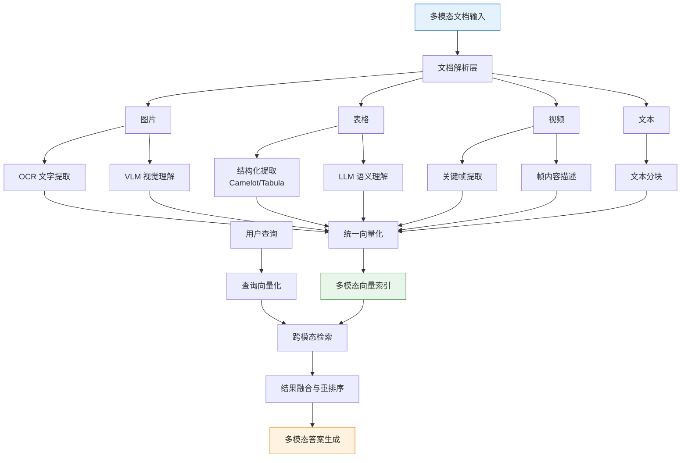

# 多模态RAG

企业知识库中不只有纯文本。PDF 中的图表、产品手册中的图片、培训视频中的关键帧，都包含文本无法替代的信息。多模态 RAG 将检索范围从纯文本扩展到图片、表格、视频等模态，让 AI 系统真正理解非结构化内容。

## 多模态 RAG 架构



## 图片理解与解析

### OCR + VLM 方案

OCR 提取文字信息，VLM（Vision Language Model）理解图片语义，两者互补。

```python
from PIL import Image
import base64
from io import BytesIO
import json

class ImageProcessor:
    """图片处理器：OCR + VLM 双通道"""

    def __init__(self, ocr_engine, vlm_client):
        self.ocr = ocr_engine
        self.vlm = vlm_client

    def process(self, image: Image.Image, image_id: str) -> dict:
        """处理单张图片，返回多通道信息"""
        # 通道 1：OCR 提取文字
        ocr_result = self._ocr_extract(image)

        # 通道 2：VLM 理解图片内容
        vlm_result = self._vlm_understand(image)

        # 通道 3：VLM 生成图片描述（用于检索）
        description = self._generate_description(image, ocr_result, vlm_result)

        return {
            "image_id": image_id,
            "ocr_text": ocr_result,
            "vlm_understanding": vlm_result,
            "search_description": description,
            "modality": "image",
        }

    def _ocr_extract(self, image: Image.Image) -> str:
        """使用 OCR 提取图片中的文字"""
        # 使用 PaddleOCR 或 Tesseract
        result = self.ocr.ocr(image, cls=True)

        texts = []
        for line in result[0]:
            text = line[1][0]
            confidence = line[1][1]
            if confidence > 0.7:  # 过滤低置信度结果
                texts.append(text)

        return "\n".join(texts)

    def _vlm_understand(self, image: Image.Image) -> dict:
        """使用 VLM 理解图片内容"""
        image_b64 = self._image_to_base64(image)

        prompt = """请详细分析这张图片，返回以下信息：
1. 图片类型（流程图/架构图/截图/照片/图表/其他）
2. 图片中的关键元素和它们的含义
3. 元素之间的关系
4. 图片表达的核心信息

请以 JSON 格式输出。"""

        response = self.vlm.chat(
            model="gpt-4o",
            messages=[{
                "role": "user",
                "content": [
                    {"type": "text", "text": prompt},
                    {"type": "image_url", "image_url": {
                        "url": f"data:image/png;base64,{image_b64}"
                    }},
                ],
            }],
        )

        try:
            return json.loads(response.choices[0].message.content)
        except json.JSONDecodeError:
            return {"raw_understanding": response.choices[0].message.content}

    def _generate_description(self, image, ocr_result, vlm_result) -> str:
        """生成用于检索的图片描述"""
        parts = []

        if isinstance(vlm_result, dict):
            if "图片类型" in vlm_result:
                parts.append(f"图片类型：{vlm_result['图片类型']}")
            if "核心信息" in vlm_result:
                parts.append(f"核心内容：{vlm_result['核心信息']}")
            if "关键元素" in vlm_result:
                parts.append(f"关键元素：{vlm_result['关键元素']}")

        if ocr_result:
            parts.append(f"图片中的文字：{ocr_result[:500]}")

        return "\n".join(parts)

    def _image_to_base64(self, image: Image.Image) -> str:
        """将 PIL Image 转为 base64"""
        buffered = BytesIO()
        image.save(buffered, format="PNG")
        return base64.b64encode(buffered.getvalue()).decode()
```

### 批量图片处理

```python
import fitz  # PyMuPDF

class PDFImageExtractor:
    """从 PDF 中提取图片并处理"""

    def __init__(self, image_processor: ImageProcessor):
        self.image_processor = image_processor

    def extract_from_pdf(self, pdf_path: str) -> list[dict]:
        """提取 PDF 中所有图片并处理"""
        doc = fitz.open(pdf_path)
        results = []

        for page_num in range(len(doc)):
            page = doc[page_num]
            images = page.get_images(full=True)

            for img_idx, img in enumerate(images):
                xref = img[0]
                base_image = doc.extract_image(xref)
                image_bytes = base_image["image"]
                image = Image.open(BytesIO(image_bytes))

                # 过滤太小的图片（可能是图标、分隔线）
                if image.width < 100 or image.height < 100:
                    continue

                image_id = f"{pdf_path}_page{page_num}_img{img_idx}"
                processed = self.image_processor.process(image, image_id)
                processed["page_number"] = page_num + 1
                processed["source"] = pdf_path
                results.append(processed)

        return results
```

## 表格提取与结构化

### Camelot/Tabula 结构化提取

```python
import camelot
import pandas as pd
from typing import Optional

class TableProcessor:
    """表格处理器：结构化提取 + LLM 理解"""

    def __init__(self, llm):
        self.llm = llm

    def extract_from_pdf(self, pdf_path: str, pages: str = "all") -> list[dict]:
        """从 PDF 提取表格"""
        tables = camelot.read_pdf(
            pdf_path,
            pages=pages,
            flavor="lattice",  # 适合有线表格
            # flavor="stream"   # 适合无线表格
        )

        results = []
        for i, table in enumerate(tables):
            df = table.df
            if df.empty or len(df) < 2:
                continue

            # 清洗表格数据
            df = self._clean_table(df)

            result = {
                "table_id": f"{pdf_path}_table{i}",
                "dataframe": df,
                "markdown": df.to_markdown(),
                "json": df.to_dict(orient="records"),
                "headers": df.columns.tolist(),
                "row_count": len(df),
                "page_number": table.page,
            }

            # LLM 语义理解
            result["semantic_description"] = self._understand_table(df)

            results.append(result)

        return results

    def _clean_table(self, df: pd.DataFrame) -> pd.DataFrame:
        """清洗表格数据"""
        # 去除空行
        df = df.dropna(how="all")
        # 去除列名中的空格
        df.columns = df.columns.str.strip()
        # 去除单元格中的前后空格
        df = df.map(lambda x: x.strip() if isinstance(x, str) else x)
        return df

    def _understand_table(self, df: pd.DataFrame) -> str:
        """使用 LLM 理解表格语义"""
        markdown_table = df.to_markdown()

        prompt = f"""请分析以下表格，生成一段描述，概括表格的内容和关键信息：

{markdown_table}

请包含：
1. 表格的主题
2. 表格包含的关键数据点
3. 表格中值得注意的趋势或异常

描述："""

        return self.llm.invoke(prompt).content

    def extract_from_html(self, html_content: str) -> list[dict]:
        """从 HTML 中提取表格"""
        tables = pd.read_html(html_content)
        results = []
        for i, df in enumerate(tables):
            if df.empty:
                continue
            df = self._clean_table(df)
            result = {
                "table_id": f"html_table{i}",
                "markdown": df.to_markdown(),
                "semantic_description": self._understand_table(df),
            }
            results.append(result)
        return results

    def answer_table_query(self, query: str, table: dict) -> str:
        """基于表格回答问题"""
        prompt = f"""基于以下表格回答问题。

表格内容：
{table["markdown"]}

表格描述：{table.get("semantic_description", "")}

问题：{query}

请准确引用表格中的数据来回答。如果表格中没有相关信息，请明确说明。"""

        return self.llm.invoke(prompt).content
```

## 视频关键帧提取与检索

```python
import cv2
import numpy as np
from pathlib import Path

class VideoProcessor:
    """视频处理器：关键帧提取与内容描述"""

    def __init__(self, vlm_client, clip_model=None):
        self.vlm = vlm_client
        self.clip_model = clip_model
        self.scene_threshold = 30.0  # 场景切换阈值

    def extract_keyframes(
        self,
        video_path: str,
        method: str = "scene_change",
        max_frames: int = 20,
    ) -> list[dict]:
        """提取视频关键帧"""
        cap = cv2.VideoCapture(video_path)
        fps = cap.get(cv2.CAP_PROP_FPS)
        total_frames = int(cap.get(cv2.CAP_PROP_FRAME_COUNT))

        keyframes = []
        prev_frame = None
        frame_count = 0

        while cap.isOpened():
            ret, frame = cap.read()
            if not ret:
                break

            timestamp = frame_count / fps

            if method == "scene_change":
                if self._is_scene_change(frame, prev_frame):
                    keyframes.append(self._frame_to_result(
                        frame, frame_count, timestamp, video_path
                    ))
            elif method == "interval":
                interval = total_frames // max_frames
                if frame_count % interval == 0:
                    keyframes.append(self._frame_to_result(
                        frame, frame_count, timestamp, video_path
                    ))

            prev_frame = frame.copy()
            frame_count += 1

            if len(keyframes) >= max_frames:
                break

        cap.release()
        return keyframes

    def _is_scene_change(self, current_frame, prev_frame) -> bool:
        """检测场景切换"""
        if prev_frame is None:
            return True

        # 转灰度图计算帧差
        gray_curr = cv2.cvtColor(current_frame, cv2.COLOR_BGR2GRAY)
        gray_prev = cv2.cvtColor(prev_frame, cv2.COLOR_BGR2GRAY)

        diff = cv2.absdiff(gray_curr, gray_prev)
        mean_diff = np.mean(diff)

        return mean_diff > self.scene_threshold

    def _frame_to_result(self, frame, frame_idx, timestamp, source) -> dict:
        """将帧转为结果字典"""
        image = Image.fromarray(cv2.cvtColor(frame, cv2.COLOR_BGR2RGB))

        return {
            "frame_id": f"{source}_frame{frame_idx}",
            "timestamp": round(timestamp, 2),
            "frame_index": frame_idx,
            "image": image,
            "source": source,
            "modality": "video_frame",
        }

    def describe_keyframes(self, keyframes: list[dict]) -> list[dict]:
        """为每个关键帧生成内容描述"""
        for kf in keyframes:
            image_b64 = self._pil_to_base64(kf["image"])

            prompt = """请描述这个视频帧的内容，包括：
1. 画面中的主要对象和场景
2. 如果有文字，转录所有可见文字
3. 画面所表达的信息

描述："""

            response = self.vlm.chat(
                model="gpt-4o",
                messages=[{
                    "role": "user",
                    "content": [
                        {"type": "text", "text": prompt},
                        {"type": "image_url", "image_url": {
                            "url": f"data:image/png;base64,{image_b64}"
                        }},
                    ],
                }],
            )

            kf["description"] = response.choices[0].message.content
            kf["search_text"] = (
                f"视频 {kf['timestamp']}秒: {kf['description']}"
            )

        return keyframes

    def _pil_to_base64(self, image: Image.Image) -> str:
        buffered = BytesIO()
        image.save(buffered, format="JPEG", quality=85)
        return base64.b64encode(buffered.getvalue()).decode()
```

## 多模态 Embedding 方案

### CLIP / Chinese-CLIP

CLIP 是 OpenAI 提出的视觉-语言预训练模型，能将图片和文本映射到同一向量空间，支持跨模态检索。

```python
from sentence_transformers import SentenceTransformer
import numpy as np

class CLIPEmbedder:
    """CLIP 多模态嵌入器"""

    def __init__(self, model_name: str = "OFA-Sys/chinese-clip-vit-base-patch16"):
        self.model = SentenceTransformer(model_name)

    def encode_text(self, text: str) -> np.ndarray:
        """文本向量化"""
        return self.model.encode(text, normalize_embeddings=True)

    def encode_image(self, image: Image.Image) -> np.ndarray:
        """图片向量化"""
        return self.model.encode(image, normalize_embeddings=True)

    def encode_texts(self, texts: list[str]) -> np.ndarray:
        """批量文本向量化"""
        return self.model.encode(texts, normalize_embeddings=True,
                                 batch_size=32, show_progress_bar=True)

    def encode_images(self, images: list[Image.Image]) -> np.ndarray:
        """批量图片向量化"""
        return self.model.encode(images, normalize_embeddings=True,
                                 batch_size=16, show_progress_bar=True)

    def cross_modal_search(
        self,
        query: str,
        image_embeddings: np.ndarray,
        image_ids: list[str],
        top_k: int = 5,
    ) -> list[dict]:
        """文本查询检索图片"""
        query_embedding = self.encode_text(query)
        similarities = np.dot(image_embeddings, query_embedding)

        top_indices = np.argsort(similarities)[::-1][:top_k]

        return [
            {"image_id": image_ids[i], "score": float(similarities[i])}
            for i in top_indices
        ]
```

## ColPali 视觉检索方案

ColPali 是一种创新的视觉检索方案，直接将文档页面的视觉特征（而非 OCR 提取的文本）用于检索，避免了 OCR 误差的传播。

```python
class ColPaliRetriever:
    """ColPali 视觉检索器"""

    def __init__(self, model_name: str = "vidore/colpali-v1.2"):
        from colpali_engine.models import ColPali, ColPaliProcessor
        import torch

        self.device = "cuda" if torch.cuda.is_available() else "cpu"
        self.model = ColPali.from_pretrained(
            model_name,
            torch_dtype=torch.bfloat16,
        ).to(self.device)
        self.processor = ColPaliProcessor.from_pretrained(model_name)

    def index_documents(self, document_images: list[Image.Image]) -> list[torch.Tensor]:
        """索引文档页面（以图片形式输入）"""
        import torch

        embeddings = []
        batch_size = 4

        for i in range(0, len(document_images), batch_size):
            batch = document_images[i:i + batch_size]
            processed = self.processor.process_images(batch).to(self.device)

            with torch.no_grad():
                batch_embeddings = self.model(**processed)

            embeddings.extend(batch_embeddings)

        return embeddings

    def search(
        self,
        query: str,
        doc_embeddings: list,
        doc_ids: list[str],
        top_k: int = 5,
    ) -> list[dict]:
        """文本查询检索文档页面"""
        import torch

        processed_query = self.processor.process_queries([query]).to(self.device)

        with torch.no_grad():
            query_embedding = self.model(**processed_query)

        scores = []
        for i, doc_emb in enumerate(doc_embeddings):
            score = self.processor.score(
                [query_embedding[0]], [doc_emb]
            )[0].item()
            scores.append({"doc_id": doc_ids[i], "score": score})

        scores.sort(key=lambda x: x["score"], reverse=True)
        return scores[:top_k]
```

## 跨模态检索架构设计

```python
from dataclasses import dataclass, field
from typing import Any

@dataclass
class MultiModalDocument:
    """多模态文档统一表示"""
    doc_id: str
    modality: str  # text, image, table, video_frame
    content: Any
    text_representation: str  # 用于文本检索的表示
    embedding: list[float] | None = None
    metadata: dict = field(default_factory=dict)


class MultiModalRAG:
    """多模态 RAG 系统"""

    def __init__(self, text_embedder, clip_embedder, vector_store, llm):
        self.text_embedder = text_embedder
        self.clip_embedder = clip_embedder
        self.vector_store = vector_store
        self.llm = llm
        self.image_processor = ImageProcessor(None, llm)
        self.table_processor = TableProcessor(llm)
        self.video_processor = VideoProcessor(llm)

    def ingest(self, documents: list[dict]) -> int:
        """摄入多模态文档"""
        mm_docs = []

        for doc in documents:
            doc_type = doc.get("type", "text")
            content = doc.get("content")

            if doc_type == "text":
                mm_docs.extend(self._process_text(doc))
            elif doc_type == "image":
                mm_docs.extend(self._process_image(doc))
            elif doc_type == "table":
                mm_docs.extend(self._process_table(doc))
            elif doc_type == "video":
                mm_docs.extend(self._process_video(doc))
            elif doc_type == "pdf":
                mm_docs.extend(self._process_pdf(doc))

        # 统一向量化
        for mm_doc in mm_docs:
            if mm_doc.modality == "image":
                # 使用 CLIP 视觉编码器对图片本身编码，而非文本描述
                image = mm_doc.content  # PIL Image 对象
                mm_doc.embedding = self.clip_embedder.encode_image(
                    image
                ).tolist()
            else:
                mm_doc.embedding = self.text_embedder.encode(
                    mm_doc.text_representation
                ).tolist()

        # 写入向量数据库
        self.vector_store.upsert([
            {
                "id": mm_doc.doc_id,
                "embedding": mm_doc.embedding,
                "metadata": {
                    "modality": mm_doc.modality,
                    "text": mm_doc.text_representation,
                    **mm_doc.metadata,
                },
            }
            for mm_doc in mm_docs
        ])

        return len(mm_docs)

    def query(self, question: str, top_k: int = 5) -> dict:
        """多模态查询"""
        # 文本查询：使用 CLIP 文本编码器以匹配图片的视觉嵌入
        query_embedding = self.clip_embedder.encode_text(question).tolist()
        results = self.vector_store.search(query_embedding, top_k=top_k)

        # 按模态分组
        by_modality = {"text": [], "image": [], "table": [], "video_frame": []}
        for r in results:
            modality = r["metadata"].get("modality", "text")
            by_modality[modality].append(r)

        # 构建多模态上下文
        context_parts = []
        for modality, items in by_modality.items():
            if not items:
                continue
            context_parts.append(f"\n### {modality} 相关内容")
            for item in items:
                context_parts.append(item["metadata"]["text"])

        context = "\n".join(context_parts)

        # 生成答案
        answer = self.llm.invoke(
            f"基于以下多模态参考资料回答问题。\n\n"
            f"参考资料：\n{context}\n\n"
            f"问题：{question}\n\n回答："
        ).content

        return {
            "answer": answer,
            "sources": results,
            "modality_breakdown": {k: len(v) for k, v in by_modality.items()},
        }

    def _process_text(self, doc: dict) -> list[MultiModalDocument]:
        """处理纯文本文档"""
        # 简单分块
        text = doc["content"]
        chunk_size = doc.get("chunk_size", 500)
        chunks = [text[i:i+chunk_size] for i in range(0, len(text), chunk_size)]

        return [
            MultiModalDocument(
                doc_id=f"{doc['id']}_chunk{i}",
                modality="text",
                content=chunk,
                text_representation=chunk,
                metadata={"source": doc.get("id"), "chunk_index": i},
            )
            for i, chunk in enumerate(chunks)
        ]

    def _process_image(self, doc: dict) -> list[MultiModalDocument]:
        """处理图片文档"""
        image = doc["content"]
        description = self.image_processor._generate_description(
            image,
            self.image_processor._ocr_extract(image),
            self.image_processor._vlm_understand(image),
        )
        return [MultiModalDocument(
            doc_id=doc["id"],
            modality="image",
            content=image,
            text_representation=description,
            metadata={"source": doc.get("source", "")},
        )]

    def _process_table(self, doc: dict) -> list[MultiModalDocument]:
        """处理表格文档"""
        return [MultiModalDocument(
            doc_id=doc["id"],
            modality="table",
            content=doc["markdown"],
            text_representation=doc.get("semantic_description", doc["markdown"]),
            metadata={"source": doc.get("source", "")},
        )]

    def _process_video(self, doc: dict) -> list[MultiModalDocument]:
        """处理视频文档"""
        keyframes = self.video_processor.extract_keyframes(doc["path"])
        keyframes = self.video_processor.describe_keyframes(keyframes)
        return [
            MultiModalDocument(
                doc_id=kf["frame_id"],
                modality="video_frame",
                content=kf["description"],
                text_representation=kf["search_text"],
                metadata={
                    "timestamp": kf["timestamp"],
                    "source": doc.get("id", ""),
                },
            )
            for kf in keyframes
        ]

    def _process_pdf(self, doc: dict) -> list[MultiModalDocument]:
        """处理 PDF 文档（包含文本、图片、表格）"""
        results = []

        # 提取文本
        text_docs = self._process_text(doc)
        results.extend(text_docs)

        # 提取图片
        image_results = self.image_processor.extract_from_pdf(doc["path"])
        for img in image_results:
            results.append(MultiModalDocument(
                doc_id=img["image_id"],
                modality="image",
                content=img.get("image", img.get("search_description", "")),
                text_representation=img.get("search_description", ""),
                metadata={"page": img.get("page_number"), "source": doc.get("id")},
            ))

        # 提取表格
        table_results = self.table_processor.extract_from_pdf(doc["path"])
        for tbl in table_results:
            results.append(MultiModalDocument(
                doc_id=tbl["table_id"],
                modality="table",
                content=tbl["markdown"],
                text_representation=tbl.get("semantic_description", tbl["markdown"]),
                metadata={"page": tbl.get("page_number"), "source": doc.get("id")},
            ))

        return results
```

## 不同模态的处理策略对比

| 维度 | 文本 | 图片 | 表格 | 视频帧 |
|------|------|------|------|--------|
| 提取方式 | 直接分块 | OCR + VLM | Camelot/Tabula + LLM | 关键帧提取 + VLM |
| Embedding 方案 | 文本 Embedding | CLIP/文本 Embedding | 文本 Embedding | CLIP/文本 Embedding |
| 检索方式 | 向量相似度 | 文本描述向量/CLIP | 文本描述向量 | 文本描述向量/CLIP |
| 信息损失 | 低 | 中（依赖 OCR/VLM 质量） | 低（结构化提取） | 高（关键帧遗漏） |
| 处理延迟 | 低 | 中 | 中 | 高 |
| 存储成本 | 低 | 中 | 低 | 高 |
| 准确性瓶颈 | 分块策略 | OCR/VLM 准确率 | 表格识别率 | 关键帧选取质量 |

### 模态选择建议

**纯文本为主**：大多数企业知识库 80% 以上是文本。先把纯文本 RAG 做好，再考虑多模态。

**图片密集型**（产品手册、设计文档）：优先用 VLM 直接理解图片，OCR 作为补充提取文字。

**表格密集型**（财报、数据报告）：Camelot/Tabula 提取结构化数据，LLM 生成语义描述用于检索。

**视频内容**：只在视频是核心知识载体时才做关键帧检索。成本高、信息损失大，优先考虑是否有文字版替代。

## 生产环境优化

### 图片压缩与预处理

```python
def preprocess_image(
    image: Image.Image,
    max_size: int = 1024,
    quality: int = 85,
) -> Image.Image:
    """图片预处理：压缩到合理尺寸"""
    # 等比缩放
    if max(image.size) > max_size:
        ratio = max_size / max(image.size)
        new_size = (int(image.width * ratio), int(image.height * ratio))
        image = image.resize(new_size, Image.Resampling.LANCZOS)

    # 转为 RGB（去除 alpha 通道）
    if image.mode == "RGBA":
        background = Image.new("RGB", image.size, (255, 255, 255))
        background.paste(image, mask=image.split()[3])
        image = background
    elif image.mode != "RGB":
        image = image.convert("RGB")

    return image
```

### 异步多模态处理管线

```python
import asyncio
from concurrent.futures import ThreadPoolExecutor

class AsyncMultiModalPipeline:
    """异步多模态处理管线"""

    def __init__(self, rag: MultiModalRAG, max_workers: int = 4):
        self.rag = rag
        self.executor = ThreadPoolExecutor(max_workers=max_workers)

    async def ingest_batch(self, documents: list[dict]) -> dict:
        """异步批量摄入"""
        loop = asyncio.get_event_loop()

        # 按类型分组并行处理
        tasks = []
        for doc in documents:
            task = loop.run_in_executor(
                self.executor,
                self.rag.ingest,
                [doc],
            )
            tasks.append(task)

        results = await asyncio.gather(*tasks)

        return {
            "total_documents": len(documents),
            "total_chunks": sum(results),
            "success": True,
        }
```

### 多模态检索评估

```python
def evaluate_multimodal_retrieval(
    test_set: list[dict],
    rag: MultiModalRAG,
) -> dict:
    """评估多模态检索效果"""
    from ragas.metrics import faithfulness, answer_relevancy

    modality_scores = {
        "text": [], "image": [], "table": [], "video_frame": [],
    }

    for case in test_set:
        result = rag.query(case["question"])

        # 按答案中引用的模态分类统计
        for source in result["sources"]:
            modality = source["metadata"].get("modality", "text")
            if modality in modality_scores:
                modality_scores[modality].append(source.get("score", 0))

    # 计算各模态的平均检索得分
    avg_scores = {}
    for modality, scores in modality_scores.items():
        if scores:
            avg_scores[modality] = sum(scores) / len(scores)
        else:
            avg_scores[modality] = 0

    return {
        "avg_scores_by_modality": avg_scores,
        "total_test_cases": len(test_set),
        "modality_distribution": {
            k: len(v) for k, v in modality_scores.items()
        },
    }
```

---

::: tip 核心原则
多模态 RAG 的本质是将非文本内容转化为可检索的文本表示。关键选择在于"转化方式"：OCR 提取文字、VLM 生成描述、结构化解析表格、关键帧抽取视频，每种方式都有精度和成本的权衡。不要为了多模态而多模态，大多数场景下把纯文本 RAG 做到极致就已经足够。只有当非文本内容承载了不可替代的信息时，多模态 RAG 才值得投入。
:::
