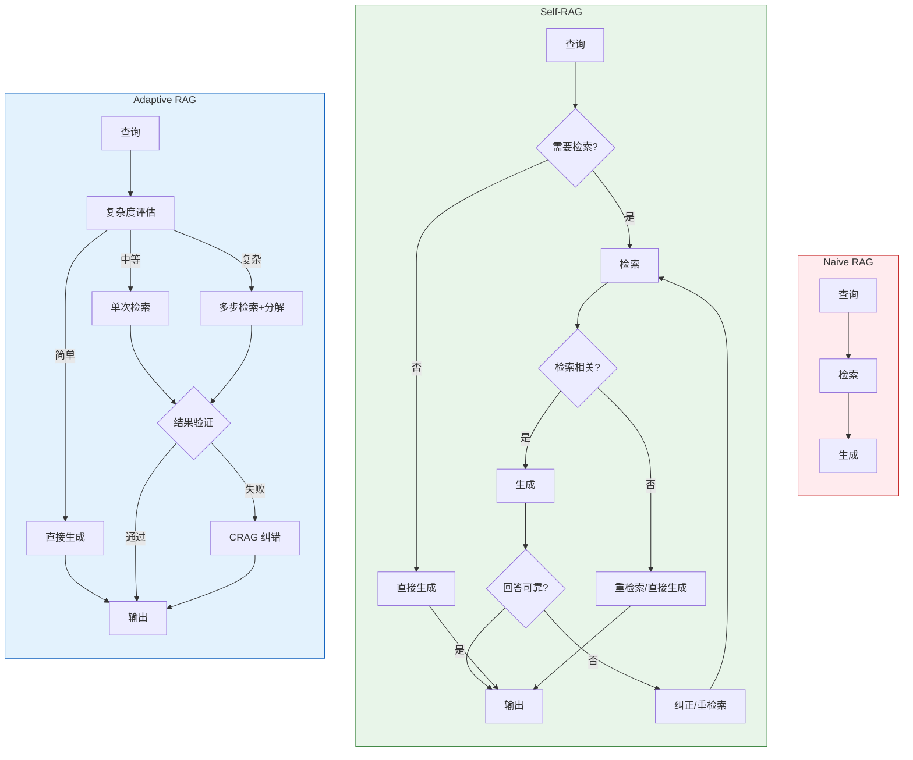
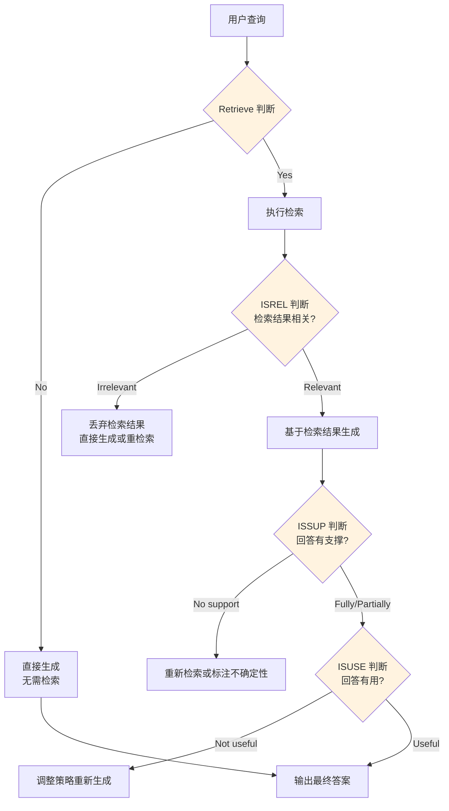

# Self-RAG与自适应检索

传统 RAG 对每个问题都执行检索，无论检索是否必要、结果是否有用。这种"无脑检索"导致两个问题：一是不需要检索的问题被检索结果干扰（噪声注入），二是检索结果不好时模型仍强行生成回答（幻觉风险）。Self-RAG 和自适应检索通过让模型自主判断"是否需要检索""检索结果是否有用""生成的回答是否可靠"，将 RAG 从被动管线升级为主动决策系统。

## 从 Naive RAG 到自适应 RAG



## Self-RAG 原理

Self-RAG（Self-Reflective Retrieval-Augmented Generation）由 Akari Asai 等人在 2023 年提出，核心创新是引入三个自反思标记（Reflection Token）：

| 标记 | 含义 | 决策 |
|------|------|------|
| `Retrieve` | 是否需要检索 | Yes / No |
| `ISREL` | 检索结果是否相关 | Relevant / Irrelevant |
| `ISSUP` | 回答是否由检索内容支撑 | Fully supported / Partially / No support |
| `ISUSE` | 回答是否有用 | Useful / Not useful |



### Self-RAG 关键步骤详解

**步骤 1：检索决策**

不是所有问题都需要检索。常识性问题（"中国的首都是哪里？"）直接回答即可，检索反而引入噪声。

**步骤 2：相关性判断**

检索返回的文档不一定与问题相关。需要判断检索结果是否真正有助于回答问题。

**步骤 3：支撑性判断**

生成的回答是否确实基于检索到的内容？这是防止幻觉的关键检查。

**步骤 4：有用性判断**

即使回答有支撑，也未必对用户有用。需要判断回答是否真正解决了用户的问题。

## CRAG：纠错检索

CRAG（Corrective RAG）由 Yan et al. 在 2024 年提出，核心思路是在检索结果不理想时进行纠错，而非直接使用或丢弃。

```python
from langgraph.graph import StateGraph, END
from typing import TypedDict, Annotated
import operator

class CRAGState(TypedDict):
    question: str
    documents: list[dict]
    relevance_score: float
    web_search_needed: bool
    web_results: list[dict]
    generation: str
    retry_count: int

RELEVANCE_CHECK_PROMPT = """评估以下检索结果与问题的相关性。

问题：{question}

检索结果：
{documents}

请评估相关性（0-1分）：
- 1.0：完全相关，包含回答问题所需的关键信息
- 0.5-0.9：部分相关，包含一些有用信息但不够充分
- 0-0.4：不相关，检索结果与问题无关

只输出分数："""

CORRECTION_PROMPT = """原始检索结果不够理想，请基于以下补充信息重新回答。

问题：{question}

原始检索结果：{original_docs}
补充网络搜索结果：{web_results}

请综合所有信息生成准确回答："""


def retrieve_node(state: CRAGState) -> dict:
    """检索节点"""
    question = state["question"]
    documents = vector_store.search(question, top_k=5)
    return {"documents": documents}

def grade_documents_node(state: CRAGState) -> dict:
    """文档相关性评估节点"""
    question = state["question"]
    docs_text = "\n".join(d["content"] for d in state["documents"])

    prompt = RELEVANCE_CHECK_PROMPT.format(
        question=question, documents=docs_text
    )
    score_text = llm.invoke(prompt).content.strip()

    try:
        score = float(score_text)
    except ValueError:
        score = 0.5

    # 相关性低于阈值时触发纠错
    web_search_needed = score < 0.5

    return {
        "relevance_score": score,
        "web_search_needed": web_search_needed,
    }

def web_search_node(state: CRAGState) -> dict:
    """网络搜索纠错节点"""
    question = state["question"]
    web_results = web_search_tool.search(question, top_k=3)
    return {"web_results": web_results}

def generate_node(state: CRAGState) -> dict:
    """生成答案节点"""
    question = state["question"]
    docs = state["documents"]

    if state.get("web_search_needed") and state.get("web_results"):
        # 使用纠错后的信息生成
        prompt = CORRECTION_PROMPT.format(
            question=question,
            original_docs="\n".join(d["content"] for d in docs),
            web_results="\n".join(d["content"] for d in state["web_results"]),
        )
    else:
        # 使用原始检索结果生成
        context = "\n".join(d["content"] for d in docs)
        prompt = f"基于以下参考资料回答问题。\n\n参考资料：\n{context}\n\n问题：{question}\n\n回答："

    generation = llm.invoke(prompt).content
    return {"generation": generation}

def should_correct(state: CRAGState) -> str:
    """判断是否需要纠错"""
    if state.get("web_search_needed"):
        return "correct"
    return "generate"

# 构建 CRAG 图
def build_crag_graph():
    graph = StateGraph(CRAGState)

    graph.add_node("retrieve", retrieve_node)
    graph.add_node("grade", grade_documents_node)
    graph.add_node("web_search", web_search_node)
    graph.add_node("generate", generate_node)

    graph.set_entry_point("retrieve")
    graph.add_edge("retrieve", "grade")
    graph.add_conditional_edges("grade", should_correct, {
        "correct": "web_search",
        "generate": "generate",
    })
    graph.add_edge("web_search", "generate")
    graph.add_edge("generate", END)

    return graph.compile()
```

## Adaptive RAG：自适应检索

Adaptive RAG 根据问题复杂度选择不同的检索策略，避免对简单问题过度检索、对复杂问题检索不足。

### 问题复杂度分类

```python
COMPLEXITY_CLASSIFICATION_PROMPT = """判断以下问题的复杂度等级：

问题：{question}

等级定义：
- simple：简单事实性问题，LLM 内置知识即可回答，无需检索
  示例："Python的创始人是谁？"
- moderate：需要特定领域知识或最新信息，需要单次检索
  示例："我们公司的年假政策是什么？"
- complex：需要多步推理、跨文档整合、或信息分解，需要多步检索
  示例："对比我们产品和竞品在定价策略和功能覆盖上的差异"

只输出等级：simple / moderate / complex"""


def classify_query_complexity(question: str, llm) -> str:
    """分类查询复杂度"""
    prompt = COMPLEXITY_CLASSIFICATION_PROMPT.format(question=question)
    result = llm.invoke(prompt).content.strip().lower()

    if result in ("simple", "moderate", "complex"):
        return result
    return "moderate"  # 默认中等复杂度
```

### 自适应检索路由

```python
class AdaptiveRAGRouter:
    """自适应检索路由器"""

    def __init__(self, llm, retriever, web_search=None):
        self.llm = llm
        self.retriever = retriever
        self.web_search = web_search
        self.crag = build_crag_graph()

    def route(self, question: str) -> dict:
        """根据复杂度路由到不同策略"""
        complexity = classify_query_complexity(question, self.llm)

        if complexity == "simple":
            return self._direct_generate(question)
        elif complexity == "moderate":
            return self._single_retrieve(question)
        else:
            return self._multi_step_retrieve(question)

    def _direct_generate(self, question: str) -> dict:
        """简单问题：直接生成"""
        answer = self.llm.invoke(question).content
        return {
            "answer": answer,
            "strategy": "direct",
            "retrieval_count": 0,
        }

    def _single_retrieve(self, question: str) -> dict:
        """中等问题：单次检索 + CRAG 纠错"""
        result = self.crag.invoke({
            "question": question,
            "retry_count": 0,
        })
        return {
            "answer": result["generation"],
            "strategy": "single_retrieve",
            "relevance_score": result.get("relevance_score", 0),
            "correction_used": result.get("web_search_needed", False),
        }

    def _multi_step_retrieve(self, question: str) -> dict:
        """复杂问题：多步检索 + 分解"""
        # 分解查询
        decomposition = decompose_query(question, self.llm)
        all_contexts = []

        for sub in decomposition.sub_queries:
            results = self.retriever.search(sub.search_query, top_k=3)
            all_contexts.extend(results)

        # 去重
        seen = set()
        unique_contexts = []
        for r in all_contexts:
            doc_id = r.get("id", hash(r["content"][:200]))
            if doc_id not in seen:
                seen.add(doc_id)
                unique_contexts.append(r)

        # 生成综合回答
        context = "\n\n".join(r["content"] for r in unique_contexts[:10])
        prompt = f"""基于以下多源检索结果，综合回答复杂问题。

问题：{question}

检索到的信息：
{context}

请全面、系统地回答，标注信息来源："""

        answer = self.llm.invoke(prompt).content

        return {
            "answer": answer,
            "strategy": "multi_step",
            "sub_queries": [s.sub_question for s in decomposition.sub_queries],
            "total_retrieved": len(unique_contexts),
        }
```

## 检索决策器设计与训练

### 基于规则的检索决策器

```python
class RuleBasedRetrievalDecider:
    """基于规则的检索决策器"""

    # 不需要检索的问题模式
    NO_RETRIEVAL_PATTERNS = [
        r"什么是(\w+)",       # 定义类问题，LLM 知识通常足够
        r"(\w+)的原理",       # 原理类问题
        r"如何(写|实现|做)",   # 通用方法类问题
    ]

    # 必须检索的问题模式
    MUST_RETRIEVAL_PATTERNS = [
        r"公司.*政策",        # 公司内部信息
        r"最新.*规定",        # 需要最新信息
        r"\d{4}年.*数据",     # 年度数据
        r"我们.*产品",        # 产品信息
    ]

    def decide(self, question: str) -> dict:
        """判断是否需要检索"""
        import re

        # 检查必须检索的模式
        for pattern in self.MUST_RETRIEVAL_PATTERNS:
            if re.search(pattern, question):
                return {"need_retrieval": True, "confidence": 0.9, "reason": "匹配必须检索模式"}

        # 检查不需要检索的模式
        for pattern in self.NO_RETRIEVAL_PATTERNS:
            if re.search(pattern, question):
                return {"need_retrieval": False, "confidence": 0.8, "reason": "匹配免检索模式"}

        # 默认需要检索
        return {"need_retrieval": True, "confidence": 0.5, "reason": "默认策略"}
```

### 基于 LLM 的检索决策器

```python
RETRIEVAL_DECISION_PROMPT = """判断回答以下问题是否需要从知识库检索信息。

问题：{question}

判断标准：
- 如果问题涉及公司内部信息、最新数据、具体文档内容 -> 需要检索
- 如果问题是一般性知识、概念解释、通用方法 -> 不需要检索
- 如果不确定 -> 需要检索（宁可多检索也不遗漏）

请输出 JSON：
{{"need_retrieval": true/false, "confidence": 0.0-1.0, "reason": "判断理由"}}"""


def llm_retrieval_decision(question: str, llm) -> dict:
    """使用 LLM 判断是否需要检索"""
    prompt = RETRIEVAL_DECISION_PROMPT.format(question=question)
    response = llm.invoke(prompt).content

    try:
        import json
        result = json.loads(response)
        return {
            "need_retrieval": bool(result.get("need_retrieval", True)),
            "confidence": float(result.get("confidence", 0.5)),
            "reason": result.get("reason", ""),
        }
    except (json.JSONDecodeError, ValueError):
        # 解析失败时默认检索
        return {"need_retrieval": True, "confidence": 0.3, "reason": "决策解析失败，默认检索"}
```

### 基于分类器的检索决策器

```python
from sklearn.feature_extraction.text import TfidfVectorizer
from sklearn.linear_model import LogisticRegression
import numpy as np

class ClassifierRetrievalDecider:
    """基于分类器的检索决策器"""

    def __init__(self):
        self.vectorizer = TfidfVectorizer(max_features=1000)
        self.classifier = LogisticRegression()

    def train(self, questions: list[str], labels: list[bool]):
        """训练分类器

        Args:
            questions: 问题列表
            labels: 是否需要检索（True/False）
        """
        X = self.vectorizer.fit_transform(questions)
        self.classifier.fit(X, labels)

    def decide(self, question: str) -> dict:
        """判断是否需要检索"""
        X = self.vectorizer.transform([question])
        prob = self.classifier.predict_proba(X)[0]

        # 假设类别 1 = 需要检索
        need_retrieval = self.classifier.predict(X)[0]
        confidence = max(prob)

        return {
            "need_retrieval": bool(need_retrieval),
            "confidence": float(confidence),
            "reason": f"分类器预测 (prob={prob[1]:.3f})",
        }
```

## 自反思生成与纠正机制

### 完整的 Self-RAG 实现

```python
from langgraph.graph import StateGraph, END
from typing import TypedDict, Annotated
import operator

class SelfRAGState(TypedDict):
    question: str
    need_retrieval: bool
    documents: list[dict]
    doc_relevant: bool
    generation: str
    is_supported: bool
    is_useful: bool
    final_answer: str
    corrections: Annotated[list[str], operator.add]
    iteration: int

RETRIEVE_DECISION_PROMPT = """判断回答以下问题是否需要检索外部信息。

问题：{question}

只输出 true 或 false："""

RELEVANCE_PROMPT = """判断以下检索结果是否与问题相关。

问题：{question}

检索结果：
{documents}

相关（relevant）还是不相关（irrelevant）？只输出一个词："""

SUPPORT_PROMPT = """判断以下回答是否由提供的参考资料充分支撑。

问题：{question}

参考资料：
{documents}

回答：{generation}

判断：fully_supported / partially_supported / no_support

只输出判断结果："""

USEFULNESS_PROMPT = """判断以下回答对用户是否有用。

问题：{question}

回答：{generation}

有用（useful）还是没用（not_useful）？只输出一个词："""


def decide_retrieval_node(state: SelfRAGState) -> dict:
    """检索决策节点"""
    prompt = RETRIEVE_DECISION_PROMPT.format(question=state["question"])
    result = llm.invoke(prompt).content.strip().lower()
    need_retrieval = "true" in result
    return {"need_retrieval": need_retrieval}

def retrieve_node(state: SelfRAGState) -> dict:
    """检索节点"""
    docs = vector_store.search(state["question"], top_k=5)
    return {"documents": docs}

def check_relevance_node(state: SelfRAGState) -> dict:
    """检查检索结果相关性"""
    docs_text = "\n".join(d["content"] for d in state["documents"])
    prompt = RELEVANCE_PROMPT.format(
        question=state["question"], documents=docs_text
    )
    result = llm.invoke(prompt).content.strip().lower()
    relevant = "relevant" in result
    return {"doc_relevant": relevant}

def generate_with_retrieval_node(state: SelfRAGState) -> dict:
    """基于检索结果生成"""
    context = "\n".join(d["content"] for d in state["documents"])
    prompt = f"基于以下参考资料回答问题。\n\n参考资料：\n{context}\n\n问题：{state['question']}\n\n回答："
    generation = llm.invoke(prompt).content
    return {"generation": generation}

def generate_without_retrieval_node(state: SelfRAGState) -> dict:
    """无检索直接生成"""
    generation = llm.invoke(state["question"]).content
    return {"generation": generation}

def check_support_node(state: SelfRAGState) -> dict:
    """检查回答支撑性"""
    if not state.get("need_retrieval"):
        return {"is_supported": True}  # 未检索时不检查支撑性

    docs_text = "\n".join(d["content"] for d in state["documents"])
    prompt = SUPPORT_PROMPT.format(
        question=state["question"],
        documents=docs_text,
        generation=state["generation"],
    )
    result = llm.invoke(prompt).content.strip().lower()
    supported = result in ("fully_supported", "partially_supported")
    return {"is_supported": supported}

def check_usefulness_node(state: SelfRAGState) -> dict:
    """检查回答有用性"""
    prompt = USEFULNESS_PROMPT.format(
        question=state["question"],
        generation=state["generation"],
    )
    result = llm.invoke(prompt).content.strip().lower()
    useful = "useful" in result and "not" not in result
    return {"is_useful": useful}

def correct_node(state: SelfRAGState) -> dict:
    """纠正节点：重新检索或调整生成"""
    corrections = []

    if not state.get("doc_relevant"):
        corrections.append("检索结果不相关，执行重检索")
        new_docs = vector_store.search(
            state["question"] + " 详细说明",
            top_k=5,
        )
        return {
            "documents": new_docs,
            "corrections": corrections,
            "iteration": state.get("iteration", 0) + 1,
        }

    if not state.get("is_supported"):
        corrections.append("回答缺乏支撑，重新生成并强调基于资料")
        context = "\n".join(d["content"] for d in state["documents"])
        prompt = (
            f"严格基于以下参考资料回答，不要添加任何参考资料中没有的信息。\n\n"
            f"参考资料：\n{context}\n\n问题：{state['question']}\n\n回答："
        )
        generation = llm.invoke(prompt).content
        return {
            "generation": generation,
            "corrections": corrections,
            "iteration": state.get("iteration", 0) + 1,
        }

    if not state.get("is_useful"):
        corrections.append("回答不够有用，尝试更全面的回答")
        prompt = f"请更全面地回答以下问题：{state['question']}\n\n回答："
        generation = llm.invoke(prompt).content
        return {
            "generation": generation,
            "corrections": corrections,
            "iteration": state.get("iteration", 0) + 1,
        }

    return {"corrections": corrections}

def should_retrieve(state: SelfRAGState) -> str:
    """路由：是否检索"""
    if state.get("need_retrieval"):
        return "retrieve"
    return "generate_direct"

def should_correct(state: SelfRAGState) -> str:
    """路由：是否需要纠正"""
    iteration = state.get("iteration", 0)
    if iteration >= 3:
        return "finish"  # 最多纠正 3 次

    if not state.get("doc_relevant"):
        return "correct"
    if not state.get("is_supported"):
        return "correct"
    if not state.get("is_useful"):
        return "correct"
    return "finish"


def build_self_rag_graph():
    """构建 Self-RAG 图"""
    graph = StateGraph(SelfRAGState)

    # 添加节点
    graph.add_node("decide_retrieval", decide_retrieval_node)
    graph.add_node("retrieve", retrieve_node)
    graph.add_node("check_relevance", check_relevance_node)
    graph.add_node("generate_with_retrieval", generate_with_retrieval_node)
    graph.add_node("generate_direct", generate_without_retrieval_node)
    graph.add_node("check_support", check_support_node)
    graph.add_node("check_usefulness", check_usefulness_node)
    graph.add_node("correct", correct_node)

    # 设置入口
    graph.set_entry_point("decide_retrieval")

    # 检索决策路由
    graph.add_conditional_edges("decide_retrieval", should_retrieve, {
        "retrieve": "retrieve",
        "generate_direct": "generate_direct",
    })

    # 检索路径
    graph.add_edge("retrieve", "check_relevance")
    graph.add_conditional_edges("check_relevance", lambda s: "generate_with_retrieval" if s.get("doc_relevant") else "correct", {
        "generate_with_retrieval": "generate_with_retrieval",
        "correct": "correct",
    })

    # 直接生成路径
    graph.add_edge("generate_direct", "check_usefulness")

    # 检索生成路径
    graph.add_edge("generate_with_retrieval", "check_support")

    # 支撑性检查后路由
    graph.add_conditional_edges("check_support", lambda s: "check_usefulness" if s.get("is_supported") else "correct", {
        "check_usefulness": "check_usefulness",
        "correct": "correct",
    })

    # 有用性检查后路由
    graph.add_conditional_edges("check_usefulness", should_correct, {
        "finish": END,
        "correct": "correct",
    })

    # 纠正后重新进入生成流程
    graph.add_conditional_edges("correct", lambda s: "retrieve" if not s.get("doc_relevant") else "generate_with_retrieval", {
        "retrieve": "retrieve",
        "generate_with_retrieval": "generate_with_retrieval",
    })

    return graph.compile()
```

## 四种 RAG 方案对比

| 维度 | Naive RAG | Self-RAG | CRAG | Adaptive RAG |
|------|-----------|----------|------|-------------|
| 检索决策 | 始终检索 | 自主判断是否需要 | 始终检索 | 基于复杂度路由 |
| 结果验证 | 无 | 相关性+支撑性+有用性 | 相关性评估 | 相关性+支撑性 |
| 纠错机制 | 无 | 自反思+重检索 | 网络搜索补充 | CRAG 纠错 |
| 检索次数 | 1次 | 0-N次（按需） | 1-2次 | 0-N次（按复杂度） |
| Token 消耗 | 低 | 高（多次 LLM 判断） | 中 | 中-高 |
| 延迟 | 低 | 中-高 | 中 | 低-高（取决于复杂度） |
| 简单问题表现 | 噪声干扰 | 好（直接生成） | 中（多余检索） | 好（直接生成） |
| 复杂问题表现 | 差（检索不足） | 中（可能过度反思） | 中（检索不够深） | 好（多步检索） |
| 幻觉控制 | 弱 | 强（三重检查） | 中 | 中-强 |
| 实现复杂度 | 低 | 高 | 中 | 高 |

### 选型建议

**Naive RAG**：快速验证阶段，资源有限，对幻觉容忍度高的场景

**Self-RAG**：高可靠性要求，需要严格防止幻觉的场景（如医疗、法律问答）

**CRAG**：知识库覆盖不全，需要网络搜索作为兜底的场景

**Adaptive RAG**：问题复杂度差异大，需要灵活路由的场景（综合最优，但实现复杂）

## 生产环境调优策略

### 反思节点的成本优化

Self-RAG 的三次反思调用会显著增加延迟和 Token 消耗。优化策略：

```python
class OptimizedSelfRAG:
    """成本优化版 Self-RAG"""

    def __init__(self, llm, retriever, config: dict = None):
        self.llm = llm
        self.retriever = retriever
        self.config = config or {}

        # 置信度阈值：低置信度才触发反思
        self.relevance_threshold = self.config.get("relevance_threshold", 0.6)
        self.support_threshold = self.config.get("support_threshold", 0.7)

        # 缓存决策结果
        self._decision_cache = {}

    def query(self, question: str) -> dict:
        """优化版查询"""
        # 1. 检索决策（带缓存）
        need_retrieval = self._cached_decision(question)

        if not need_retrieval:
            answer = self.llm.invoke(question).content
            return {"answer": answer, "strategy": "direct", "reflections": 0}

        # 2. 检索
        docs = self.retriever.search(question, top_k=5)

        # 3. 快速相关性检查（基于分数阈值，不调用 LLM）
        relevant_docs = [d for d in docs if d.get("score", 0) >= self.relevance_threshold]

        if not relevant_docs:
            # 检索结果都不相关，尝试 CRAG 纠错
            web_results = web_search_tool.search(question, top_k=3)
            all_context = web_results
        else:
            all_context = relevant_docs

        # 4. 生成
        context = "\n".join(d["content"] for d in all_context)
        prompt = (
            f"基于以下参考资料回答问题。\n\n"
            f"参考资料：\n{context}\n\n问题：{question}\n\n回答："
        )
        answer = self.llm.invoke(prompt).content

        # 5. 只对低置信度回答做支撑性检查
        reflections = 0
        if self._low_confidence(answer):
            support_check = self._check_support(question, answer, all_context)
            reflections = 1
            if not support_check:
                # 重新生成
                answer = self._regenerate_with_constraints(
                    question, all_context
                )
                reflections = 2

        return {"answer": answer, "strategy": "optimized_self_rag", "reflections": reflections}

    def _cached_decision(self, question: str) -> bool:
        """带缓存的检索决策"""
        import hashlib
        cache_key = hashlib.md5(question.encode()).hexdigest()

        if cache_key in self._decision_cache:
            return self._decision_cache[cache_key]

        decision = llm_retrieval_decision(question, self.llm)
        result = decision["need_retrieval"]
        self._decision_cache[cache_key] = result
        return result

    def _low_confidence(self, answer: str) -> bool:
        """快速判断回答是否低置信度"""
        low_confidence_signals = [
            "不确定", "可能", "大概", "似乎",
            "根据现有信息无法", "没有找到",
        ]
        return any(signal in answer for signal in low_confidence_signals)

    def _check_support(self, question, answer, docs) -> bool:
        """支撑性检查"""
        docs_text = "\n".join(d["content"] for d in docs)
        prompt = SUPPORT_PROMPT.format(
            question=question, documents=docs_text, generation=answer
        )
        result = self.llm.invoke(prompt).content.strip().lower()
        return "fully" in result or "partial" in result

    def _regenerate_with_constraints(self, question, docs) -> str:
        """带约束的重新生成"""
        context = "\n".join(d["content"] for d in docs)
        prompt = (
            f"严格基于以下参考资料回答，不要添加资料中没有的信息。\n\n"
            f"参考资料：\n{context}\n\n"
            f"问题：{question}\n\n"
            f"如果参考资料不足以回答，请明确说明。回答："
        )
        return self.llm.invoke(prompt).content
```

### 评估与迭代

```python
def evaluate_adaptive_rag(
    test_set: list[dict],
    strategies: list[str] = None,
) -> list[dict]:
    """评估不同 RAG 策略的效果"""
    from ragas import evaluate
    from ragas.metrics import faithfulness, answer_relevancy, context_recall

    strategies = strategies or ["naive", "self_rag", "crag", "adaptive"]
    results = []

    for strategy in strategies:
        if strategy == "naive":
            rag = NaiveRAG(llm, retriever)
        elif strategy == "self_rag":
            rag = build_self_rag_graph()
        elif strategy == "crag":
            rag = build_crag_graph()
        elif strategy == "adaptive":
            rag = AdaptiveRAGRouter(llm, retriever)

        eval_data = []
        for case in test_set:
            result = rag.query(case["question"]) if hasattr(rag, "query") else rag.invoke({"question": case["question"]})
            answer = result.get("answer", result.get("generation", ""))

            eval_data.append({
                "question": case["question"],
                "answer": answer,
                "contexts": [case.get("context", "")],
                "ground_truth": case["answer"],
            })

        scores = evaluate(
            eval_data,
            metrics=[faithfulness, answer_relevancy, context_recall],
        )

        results.append({
            "strategy": strategy,
            **{k: float(v) for k, v in scores.items()},
        })

    return sorted(results, key=lambda x: x.get("faithfulness", 0), reverse=True)
```

### 关键调优参数

| 参数 | 推荐值 | 说明 |
|------|--------|------|
| 最大纠正次数 | 2-3 | 超过 3 次效果提升有限，成本线性增加 |
| 相关性阈值 | 0.5-0.7 | 过低导致噪声，过高导致召回不足 |
| 复杂度分类置信度 | 0.6 | 低于此阈值默认走检索路径 |
| 纠错搜索条数 | 2-3 | 网络搜索条数，过多增加噪声 |
| 缓存 TTL | 1小时 | 决策缓存时间，避免重复 LLM 调用 |

---

::: tip 核心原则
自适应检索的本质是"按需检索"：简单问题不浪费检索资源，复杂问题不吝啬检索深度。Self-RAG 的三重反思提供了最严格的质量保障，但代价是更高的延迟和 Token 消耗。在生产环境中，建议先实现 CRAG（低复杂度高收益），再根据需要逐步加入检索决策和自适应路由。不要一步到位实现完整 Self-RAG，而是根据实际痛点逐层加码。
:::
