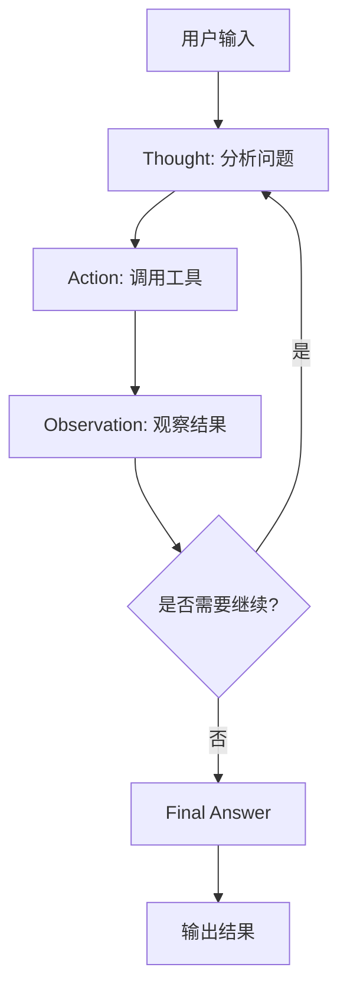
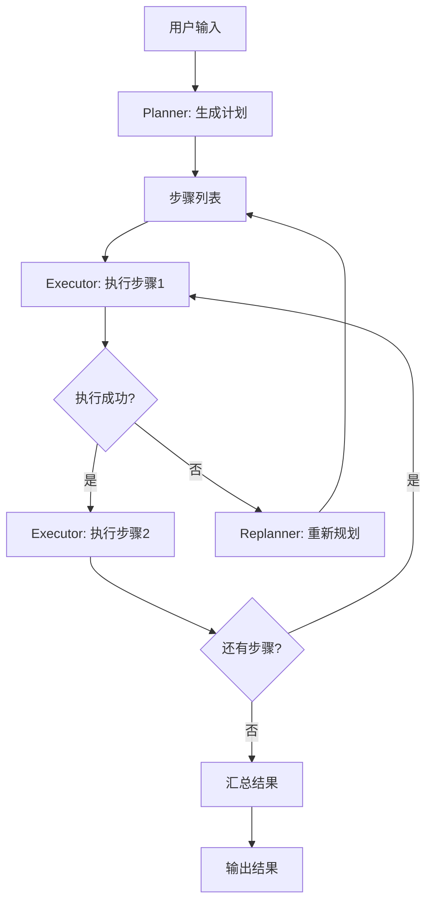
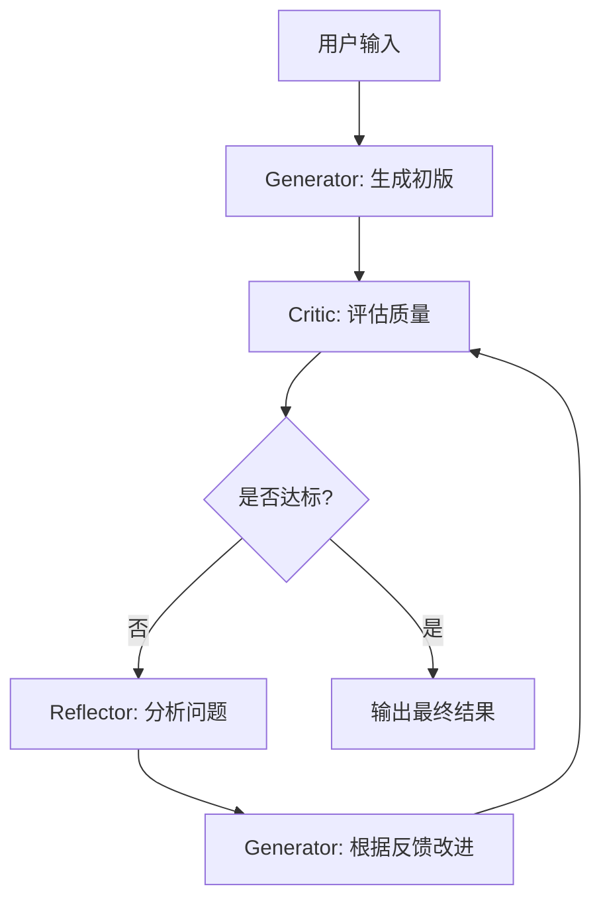
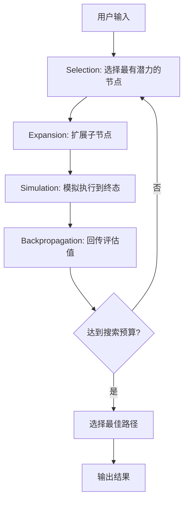
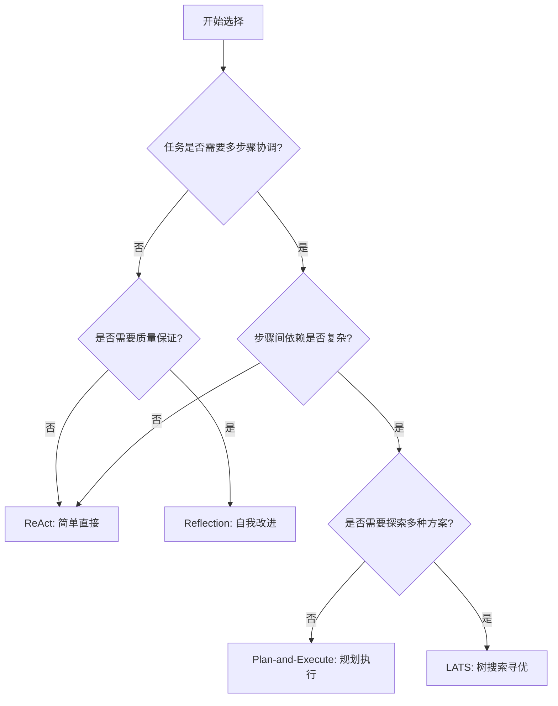

# Agent 架构模式

Agent 的核心在于"自主决策"——根据环境反馈选择下一步行动。不同的架构模式决定了 Agent 如何推理、规划和纠错。本文深入分析四种主流架构：ReAct、Plan-and-Execute、Reflection、LATS，并给出 LangGraph 实现代码。

## 架构模式总览

| 模式 | 核心思想 | 适用场景 | 复杂度 |
|------|---------|---------|--------|
| ReAct | 推理与行动交替 | 单步决策、工具调用 | 低 |
| Plan-and-Execute | 先规划后执行 | 多步骤复杂任务 | 中 |
| Reflection | 自我评估与修正 | 需要质量保证的任务 | 中 |
| LATS | 树搜索+蒙特卡洛 | 探索空间大的决策 | 高 |

---

## 1. ReAct 模式

ReAct（Reasoning + Acting）是最基础的 Agent 架构。模型在每一步先"思考"再"行动"，观察结果后继续推理，形成 Thought-Action-Observation 循环。



### 工作流程

1. **Thought**：模型分析当前状态，决定下一步做什么
2. **Action**：调用工具或执行操作
3. **Observation**：获取执行结果
4. 重复直到得出最终答案

### LangGraph 实现

```python
from typing import Annotated, TypedDict
from langgraph.graph import StateGraph, END
from langgraph.graph.message import add_messages
from langgraph.prebuilt import ToolNode
from langchain_core.messages import HumanMessage, SystemMessage


class AgentState(TypedDict):
    messages: Annotated[list, add_messages]


def react_agent(tools: list):
    """构建 ReAct Agent"""

    tool_node = ToolNode(tools)
    tool_names = {t.name for t in tools}

    def should_continue(state: AgentState) -> str:
        last_message = state["messages"][-1]
        if last_message.tool_calls:
            return "tools"
        return END

    def call_model(state: AgentState):
        system_prompt = SystemMessage(content=(
            "你是一个智能助手。对于每个问题：\n"
            "1. 先思考（Thought）：分析当前情况\n"
            "2. 再行动（Action）：调用合适的工具\n"
            "3. 根据观察结果继续推理\n"
            "当你有足够信息时，给出最终答案。"
        ))
        messages = [system_prompt] + state["messages"]
        response = llm.bind_tools(tools).invoke(messages)
        return {"messages": [response]}

    # 构建图
    workflow = StateGraph(AgentState)
    workflow.add_node("agent", call_model)
    workflow.add_node("tools", tool_node)

    workflow.set_entry_point("agent")
    workflow.add_conditional_edges("agent", should_continue)
    workflow.add_edge("tools", "agent")

    return workflow.compile()


# 使用示例
from langchain_openai import ChatOpenAI
from langchain_core.tools import tool

llm = ChatOpenAI(model="gpt-4o")

@tool
def search_web(query: str) -> str:
    """搜索互联网获取信息"""
    # 实际实现接入搜索 API
    return f"搜索结果: {query} 的相关信息..."

@tool
def calculator(expression: str) -> str:
    """计算数学表达式"""
    try:
        return str(eval(expression))
    except Exception as e:
        return f"计算错误: {e}"

agent = react_agent([search_web, calculator])
result = agent.invoke({
    "messages": [HumanMessage(content="2024年世界杯冠军的国家的面积是多少？")]
})
```

### ReAct 的优势与局限

**优势**：
- 实现简单，调试直观
- 每一步都有明确的推理过程
- 适合需要实时反馈的场景

**局限**：
- 没有全局规划，容易走入死胡同
- 步数多时上下文窗口压力大
- 无法回溯已执行的错误步骤

---

## 2. Plan-and-Execute 模式

Plan-and-Execute 将规划与执行分离：先由 Planner 生成完整的执行计划，再由 Executor 逐步执行。执行过程中可以根据反馈调整计划。



### LangGraph 实现

```python
from typing import Annotated, TypedDict
from langgraph.graph import StateGraph, END
from langgraph.graph.message import add_messages
from pydantic import BaseModel, Field


class PlanStep(BaseModel):
    """单个执行步骤"""
    step: str = Field(description="步骤描述")
    tool: str = Field(description="使用的工具")
    tool_input: str = Field(description="工具输入")


class Plan(BaseModel):
    """执行计划"""
    steps: list[PlanStep] = Field(description="按顺序执行的步骤列表")


class PlanExecuteState(TypedDict):
    messages: Annotated[list, add_messages]
    plan: list[PlanStep]
    current_step_index: int
    step_results: list[str]
    final_answer: str


def plan_step(state: PlanExecuteState) -> dict:
    """Planner: 分析任务，生成执行计划"""
    from langchain_core.messages import HumanMessage

    planner_prompt = (
        "你是一个任务规划专家。分析用户需求，制定详细的执行计划。\n"
        "每一步必须明确：做什么、用什么工具、输入什么。\n"
        "确保步骤之间有清晰的依赖关系。"
    )

    structured_llm = llm.with_structured_output(Plan)
    plan = structured_llm.invoke([
        SystemMessage(content=planner_prompt),
        *state["messages"],
    ])

    return {
        "plan": plan.steps,
        "current_step_index": 0,
        "step_results": [],
    }


def execute_step(state: PlanExecuteState) -> dict:
    """Executor: 执行当前步骤"""
    current = state["plan"][state["current_step_index"]]
    step_result = f"执行 [{current.step}]: 使用 {current.tool}，输入 {current.tool_input}"

    results = state["step_results"] + [step_result]
    next_index = state["current_step_index"] + 1

    return {
        "current_step_index": next_index,
        "step_results": results,
    }


def should_replan(state: PlanExecuteState) -> str:
    """判断是否需要重新规划"""
    if state["current_step_index"] >= len(state["plan"]):
        return "finalize"
    return "execute"


def replan_step(state: PlanExecuteState) -> dict:
    """Replanner: 根据执行结果调整计划"""
    replanner_prompt = (
        "根据已执行的步骤和结果，评估当前计划是否需要调整。\n"
        "如果需要，生成新的执行计划；否则保持原计划继续。"
    )

    structured_llm = llm.with_structured_output(Plan)
    new_plan = structured_llm.invoke([
        SystemMessage(content=replanner_prompt),
        HumanMessage(content=(
            f"原始计划: {[s.step for s in state['plan']]}\n"
            f"已执行: {state['step_results']}\n"
            f"当前进度: {state['current_step_index']}/{len(state['plan'])}"
        )),
    ])

    return {"plan": new_plan.steps, "current_step_index": 0}


def finalize(state: PlanExecuteState) -> dict:
    """汇总所有步骤结果，生成最终答案"""
    summary = "\n".join(
        f"步骤{i+1}: {r}" for i, r in enumerate(state["step_results"])
    )
    return {"final_answer": summary}


# 构建图
workflow = StateGraph(PlanExecuteState)
workflow.add_node("planner", plan_step)
workflow.add_node("executor", execute_step)
workflow.add_node("replanner", replan_step)
workflow.add_node("finalize", finalize)

workflow.set_entry_point("planner")
workflow.add_edge("planner", "executor")
workflow.add_conditional_edges(
    "executor", should_replan,
    {"execute": "executor", "finalize": "finalize", "replan": "replanner"},
)
workflow.add_edge("replanner", "executor")
workflow.add_edge("finalize", END)

plan_execute_agent = workflow.compile()
```

### 适用场景

- 需要多步骤协调的复杂任务（如数据分析流水线）
- 步骤间有依赖关系
- 需要在执行中动态调整策略

---

## 3. Reflection 模式

Reflection 让 Agent 在执行后"反思"结果质量，发现问题并修正。这在需要高质量输出的场景中尤为重要。



### LangGraph 实现

```python
from typing import Annotated, TypedDict
from langgraph.graph import StateGraph, END
from langgraph.graph.message import add_messages
from pydantic import BaseModel, Field


class Critique(BaseModel):
    """评估结果"""
    score: float = Field(description="质量评分 0-10", ge=0, le=10)
    issues: list[str] = Field(description="发现的问题")
    suggestions: list[str] = Field(description="改进建议")


class ReflectionState(TypedDict):
    messages: Annotated[list, add_messages]
    draft: str
    critique: Critique | None
    revision_count: int
    max_revisions: int


def generate(state: ReflectionState) -> dict:
    """Generator: 生成或改进内容"""
    if state["critique"] is None:
        # 首次生成
        prompt = "根据用户需求生成内容。"
    else:
        # 根据反思改进
        issues = "\n".join(f"- {i}" for i in state["critique"].issues)
        suggestions = "\n".join(f"- {s}" for s in state["critique"].suggestions)
        prompt = (
            f"改进以下内容：\n{state['draft']}\n\n"
            f"存在的问题：\n{issues}\n\n"
            f"改进建议：\n{suggestions}"
        )

    response = llm.invoke([
        SystemMessage(content=prompt),
        *state["messages"],
    ])
    return {"draft": response.content}


def reflect(state: ReflectionState) -> dict:
    """Critic + Reflector: 评估质量并给出反馈"""
    structured_llm = llm.with_structured_output(Critique)
    critique = structured_llm.invoke([
        SystemMessage(content=(
            "你是质量评审专家。评估以下内容的质量，给出评分、问题和改进建议。\n"
            "评分标准：准确性、完整性、清晰度、实用性。"
        )),
        HumanMessage(content=state["draft"]),
    ])
    return {
        "critique": critique,
        "revision_count": state["revision_count"] + 1,
    }


def should_continue(state: ReflectionState) -> str:
    """判断是否继续反思"""
    if state["critique"] and state["critique"].score >= 8:
        return END
    if state["revision_count"] >= state["max_revisions"]:
        return END
    return "reflect"


# 构建图
workflow = StateGraph(ReflectionState)
workflow.add_node("generate", generate)
workflow.add_node("reflect", reflect)

workflow.set_entry_point("generate")
workflow.add_conditional_edges("generate", should_continue, {END: END, "reflect": "reflect"})
workflow.add_edge("reflect", "generate")

reflection_agent = workflow.compile()

# 使用示例
result = reflection_agent.invoke({
    "messages": [HumanMessage(content="写一份关于微服务架构的技术方案")],
    "draft": "",
    "critique": None,
    "revision_count": 0,
    "max_revisions": 3,
})
print(result["draft"])
```

### 反思的变体

| 变体 | 说明 |
|------|------|
| Self-Reflection | Agent 自我评估，无需外部反馈 |
| Multi-Critic | 多个评审者从不同角度评估 |
| Human-in-the-loop | 人类参与关键决策点的审核 |
| Tool-Feedback | 工具执行结果作为反思依据 |

---

## 4. LATS 模式

LATS（Language Agent Tree Search）将 Agent 决策建模为树搜索问题，结合蒙特卡洛树搜索（MCTS）在决策空间中寻找最优路径。



### 核心算法

```python
import math
from dataclasses import dataclass, field


@dataclass
class MCTSNode:
    """蒙特卡洛树搜索节点"""
    state: dict
    parent: "MCTSNode | None" = None
    children: list["MCTSNode"] = field(default_factory=list)
    visits: int = 0
    value: float = 0.0
    action: str | None = None

    @property
    def q_value(self) -> float:
        return self.value / self.visits if self.visits > 0 else 0

    @property
    def uct(self) -> float:
        """UCT (Upper Confidence Bound for Trees) 评分"""
        if self.visits == 0:
            return float("inf")
        exploration = math.sqrt(
            math.log(self.parent.visits) / self.visits
        ) if self.parent else 0
        return self.q_value + 1.414 * exploration

    def select_child(self) -> "MCTSNode":
        """选择 UCT 最高的子节点"""
        return max(self.children, key=lambda c: c.uct)

    def is_fully_expanded(self) -> bool:
        return len(self.children) > 0 and all(c.visits > 0 for c in self.children)


class LATSAgent:
    """Language Agent Tree Search"""

    def __init__(self, llm, tools, max_depth: int = 5, n_simulations: int = 10):
        self.llm = llm
        self.tools = tools
        self.max_depth = max_depth
        self.n_simulations = n_simulations

    def search(self, query: str) -> str:
        root = MCTSNode(state={"query": query, "history": []})

        for _ in range(self.n_simulations):
            node = root

            # Selection: 沿 UCT 最高路径向下
            while node.is_fully_expanded() and node.children:
                node = node.select_child()

            # Expansion: 生成可能的行动
            if node.visits > 0 and len(node.children) == 0:
                actions = self._generate_actions(node)
                for action in actions:
                    child = MCTSNode(
                        state=self._simulate_action(node.state, action),
                        parent=node,
                        action=action,
                    )
                    node.children.append(child)
                if node.children:
                    node = node.children[0]

            # Simulation: 快速评估到终态
            value = self._rollout(node)

            # Backpropagation: 回传价值
            self._backpropagate(node, value)

        # 选择访问次数最多的路径
        best_path = self._extract_best_path(root)
        return self._format_result(best_path)

    def _generate_actions(self, node: MCTSNode) -> list[str]:
        """使用 LLM 生成可能的行动"""
        response = self.llm.invoke([
            SystemMessage(content=(
                "列出解决当前问题的 3 种可能行动。每行一个，简洁描述。"
            )),
            HumanMessage(content=str(node.state)),
        ])
        return [line.strip() for line in response.content.split("\n") if line.strip()]

    def _simulate_action(self, state: dict, action: str) -> dict:
        """模拟执行一个行动，返回新状态"""
        return {
            **state,
            "history": state["history"] + [action],
        }

    def _rollout(self, node: MCTSNode) -> float:
        """快速模拟到终态，返回评估值"""
        response = self.llm.invoke([
            SystemMessage(content=(
                "评估以下行动序列的质量，给出 0-1 的评分。\n"
                "只返回一个数字。"
            )),
            HumanMessage(content=str(node.state["history"])),
        ])
        try:
            return float(response.content.strip())
        except ValueError:
            return 0.5

    def _backpropagate(self, node: MCTSNode, value: float):
        """回传价值到根节点"""
        while node is not None:
            node.visits += 1
            node.value += value
            node = node.parent

    def _extract_best_path(self, root: MCTSNode) -> list[MCTSNode]:
        """提取访问次数最多的路径"""
        path = []
        node = root
        while node.children:
            node = max(node.children, key=lambda c: c.visits)
            path.append(node)
        return path

    def _format_result(self, path: list[MCTSNode]) -> str:
        """格式化最终结果"""
        actions = [n.action for n in path if n.action]
        return f"最优路径（经过 {path[-1].visits if path else 0} 次验证）:\n" + \
               "\n".join(f"  {i+1}. {a}" for i, a in enumerate(actions))
```

---

## 模式选择决策指南



### 按场景选择

| 场景 | 推荐模式 | 原因 |
|------|---------|------|
| 问答 + 工具调用 | ReAct | 单步推理即可，无需规划 |
| 代码生成 | Reflection | 需要自我审查和迭代 |
| 数据分析流水线 | Plan-and-Execute | 多步骤有依赖 |
| 游戏/博弈 | LATS | 需要探索决策树 |
| 文档撰写 | Plan-and-Execute + Reflection | 先规划结构，再迭代质量 |

### 组合使用

实际项目中，这些模式往往组合使用：

```python
# Plan-and-Execute + Reflection 组合
class CombinedState(TypedDict):
    messages: Annotated[list, add_messages]
    plan: list[PlanStep]
    current_step_index: int
    step_results: list[str]
    draft: str
    critique: Critique | None
    revision_count: int

# 先规划，执行中每步反思，最终输出前再整体反思
```

---

## 生产环境注意事项

1. **设置最大迭代次数**：所有模式都需要防止无限循环
2. **超时控制**：单个步骤和整体任务都要有超时
3. **成本预算**：LLM 调用次数与 token 消耗需要监控
4. **可观测性**：每一步的 Thought/Action/Observation 都应记录
5. **降级策略**：Agent 失败时回退到规则引擎或人工介入

```python
# 生产级别的安全封装
from langgraph.graph import StateGraph

def build_safe_agent(workflow: StateGraph, config: dict):
    """添加安全边界的 Agent 构建"""
    compiled = workflow.compile()

    def safe_invoke(input_data: dict) -> dict:
        result = compiled.invoke(
            input_data,
            config={
                "recursion_limit": config.get("max_steps", 25),
                "callbacks": [cost_tracker, step_logger],
            },
        )
        return result

    return safe_invoke
```

选择架构模式时，从最简单的 ReAct 开始，根据实际需求逐步升级复杂度。过度设计比模式不足更有害。
