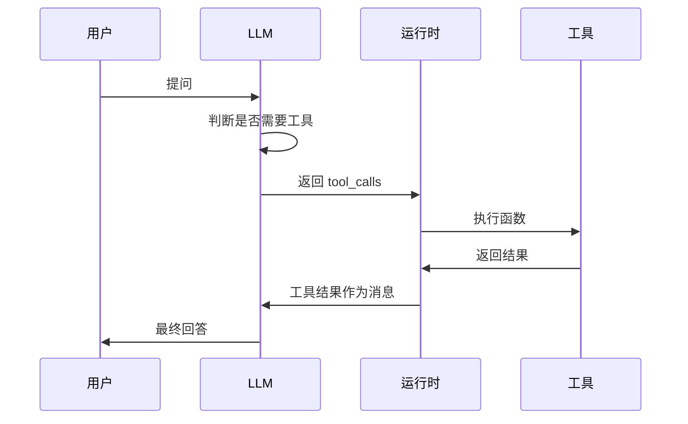

# Function Calling 与工具设计

Function Calling 是 Agent 与外部世界交互的核心机制。模型输出结构化的工具调用请求，由运行时执行并将结果返回给模型。工具设计的质量直接决定 Agent 的能力上限。

## Function Calling 工作原理



## 工具定义规范

### 基本结构

```python
from pydantic import BaseModel, Field
from typing import Optional
from langchain_core.tools import tool


# 方式一：使用 @tool 装饰器 — 结构化过滤，无 SQL 注入风险
@tool(description="Search order database")
def search_orders(customer_id: str = None, status: str = None,
                   date_from: str = None, date_to: str = None,
                   limit: int = 10) -> list[dict]:
    """Search orders with structured filters — no raw SQL

    Args:
        customer_id: Filter by customer ID
        status: Order status (pending/shipped/delivered/cancelled)
        date_from: Start date (YYYY-MM-DD)
        date_to: End date (YYYY-MM-DD)
        limit: Max results (default 10)
    """
    # Build parameterized query from structured filters
    conditions = []
    params = []

    if customer_id:
        conditions.append("customer_id = %s")
        params.append(customer_id)
    if status:
        conditions.append("status = %s")
        params.append(status)
    if date_from:
        conditions.append("created_at >= %s")
        params.append(date_from)
    if date_to:
        conditions.append("created_at <= %s")
        params.append(date_to)

    where = " AND ".join(conditions) if conditions else "1=1"
    query = f"SELECT * FROM orders WHERE {where} LIMIT %s"
    params.append(limit)

    return db.execute(query, params)


# 方式二：使用 Pydantic 模型定义参数
class DatabaseSearchParams(BaseModel):
    """数据库搜索参数"""
    customer_id: str = Field(
        default=None, description="客户ID"
    )
    status: str = Field(
        default=None, description="订单状态 (pending/shipped/delivered/cancelled)"
    )
    date_from: str = Field(
        default=None, description="开始日期 (YYYY-MM-DD)"
    )
    date_to: str = Field(
        default=None, description="结束日期 (YYYY-MM-DD)"
    )
    limit: int = Field(
        default=10,
        description="返回记录的最大数量，默认10",
        ge=1,
        le=100,
    )


@tool(args_schema=DatabaseSearchParams)
def search_orders_v2(
    customer_id: str = None,
    status: str = None,
    date_from: str = None,
    date_to: str = None,
    limit: int = 10,
) -> list[dict]:
    """使用结构化过滤条件搜索订单 — 无 SQL 注入风险"""
    conditions = []
    params = []
    if customer_id:
        conditions.append("customer_id = %s")
        params.append(customer_id)
    if status:
        conditions.append("status = %s")
        params.append(status)
    if date_from:
        conditions.append("created_at >= %s")
        params.append(date_from)
    if date_to:
        conditions.append("created_at <= %s")
        params.append(date_to)
    where = " AND ".join(conditions) if conditions else "1=1"
    query = f"SELECT * FROM orders WHERE {where} LIMIT %s"
    params.append(limit)
    return db.execute(query, params)
```

### 工具描述设计原则

工具描述是模型理解工具功能的唯一依据。写好描述比优化模型参数更有效。

```python
# 差的描述 - 模糊不清
@tool
def get_data(q: str) -> str:
    """获取数据"""
    pass


# 好的描述 - 精确完整
@tool
def get_user_profile(user_id: str) -> str:
    """根据用户ID获取用户详细资料。

    返回用户的姓名、邮箱、注册时间、会员等级等信息。
    如果用户不存在，返回错误信息。

    Args:
        user_id: 用户唯一标识符，格式为 "U" + 8位数字，例如 U12345678
    """
    pass
```

**描述设计检查清单**：

| 要素 | 说明 | 示例 |
|------|------|------|
| 功能说明 | 工具做什么 | 获取用户详细资料 |
| 返回内容 | 返回什么格式的数据 | 返回姓名、邮箱、注册时间 |
| 边界情况 | 异常时返回什么 | 用户不存在返回错误 |
| 参数约束 | 格式、范围、枚举值 | user_id 格式为 "U" + 8位数字 |
| 前提条件 | 调用前需要满足什么 | 需要先获取 user_id |

## 参数验证与错误处理

### 输入验证

```python
import re
import json
from datetime import datetime
from typing import Any


class ToolValidator:
    """工具参数验证器"""

    @staticmethod
    def validate_email(email: str) -> str:
        if not re.match(r'^[\w.-]+@[\w.-]+\.\w+$', email):
            raise ValueError(f"无效的邮箱格式: {email}")
        return email

    @staticmethod
    def validate_date_range(
        start_date: str,
        end_date: str,
        max_days: int = 365,
    ) -> tuple[str, str]:
        try:
            start = datetime.strptime(start_date, "%Y-%m-%d")
            end = datetime.strptime(end_date, "%Y-%m-%d")
        except ValueError as e:
            raise ValueError(f"日期格式错误，需要 YYYY-MM-DD: {e}")

        if start > end:
            raise ValueError(f"开始日期 {start_date} 晚于结束日期 {end_date}")

        if (end - start).days > max_days:
            raise ValueError(f"日期范围不能超过 {max_days} 天")

        return start_date, end_date

    @staticmethod
    def sanitize_sql_input(input_str: str) -> str:
        """防止 SQL 注入的基本清理"""
        dangerous_patterns = [
            r';.*$',           # 多语句
            r'--.*$',          # 注释
            r'/\*.*\*/',       # 块注释
            r'(DROP|ALTER|CREATE|TRUNCATE)\s',
            r'UNION\s+SELECT',
        ]
        for pattern in dangerous_patterns:
            if re.search(pattern, input_str, re.IGNORECASE):
                raise ValueError(f"输入包含不允许的 SQL 模式: {pattern}")
        return input_str


# 带验证的工具
@tool
def query_orders(
    customer_id: str,
    start_date: str,
    end_date: str,
    status: str = "all",
) -> str:
    """查询指定客户的订单记录。

    Args:
        customer_id: 客户ID，格式为 "C" + 6位数字
        start_date: 查询开始日期，格式 YYYY-MM-DD
        end_date: 查询结束日期，格式 YYYY-MM-DD
        status: 订单状态过滤，可选: all, pending, completed, cancelled
    """
    # 验证客户ID格式
    if not re.match(r'^C\d{6}$', customer_id):
        return json.dumps({"error": "客户ID格式错误，应为 C + 6位数字"})

    # 验证日期范围
    try:
        ToolValidator.validate_date_range(start_date, end_date, max_days=90)
    except ValueError as e:
        return json.dumps({"error": str(e)})

    # 验证状态枚举
    valid_statuses = {"all", "pending", "completed", "cancelled"}
    if status not in valid_statuses:
        return json.dumps({"error": f"无效的状态值，可选: {valid_statuses}"})

    # 执行查询
    return json.dumps({
        "customer_id": customer_id,
        "orders": [],
        "total": 0,
    })
```

### 统一错误处理

```python
from functools import wraps
import traceback
import logging

logger = logging.getLogger(__name__)


def safe_tool(max_retries: int = 1):
    """工具安全装饰器，统一处理异常和重试"""
    def decorator(func):
        @wraps(func)
        def wrapper(*args, **kwargs):
            for attempt in range(max_retries + 1):
                try:
                    result = func(*args, **kwargs)
                    return result
                except ValueError as e:
                    # 参数错误，不重试
                    return json.dumps({
                        "error": f"参数错误: {str(e)}",
                        "tool": func.__name__,
                    })
                except ConnectionError as e:
                    # 网络错误，可重试
                    if attempt < max_retries:
                        logger.warning(f"网络错误，第 {attempt+1} 次重试: {e}")
                        continue
                    return json.dumps({
                        "error": f"连接失败，已重试 {max_retries} 次: {str(e)}",
                        "tool": func.__name__,
                    })
                except Exception as e:
                    # 未知错误，记录并返回
                    logger.error(f"工具执行异常 [{func.__name__}]: {traceback.format_exc()}")
                    return json.dumps({
                        "error": f"执行失败: {type(e).__name__}: {str(e)}",
                        "tool": func.__name__,
                    })
            return json.dumps({"error": "超出最大重试次数"})
        return wrapper
    return decorator


@tool
@safe_tool(max_retries=2)
def call_external_api(endpoint: str, params: dict) -> str:
    """调用外部API接口。"""
    import requests
    response = requests.post(endpoint, json=params, timeout=10)
    response.raise_for_status()
    return response.json()
```

## 并行工具调用

当多个工具调用之间没有依赖关系时，可以并行执行以提高效率。

```python
import asyncio
from typing import Any


class ParallelToolExecutor:
    """并行工具执行器"""

    def __init__(self, tools: dict[str, callable]):
        self.tools = tools

    async def execute_parallel(self, tool_calls: list[dict]) -> list[dict]:
        """并行执行多个工具调用"""
        tasks = []
        for call in tool_calls:
            task = self._execute_single(call)
            tasks.append(task)

        results = await asyncio.gather(*tasks, return_exceptions=True)

        output = []
        for call, result in zip(tool_calls, results):
            if isinstance(result, Exception):
                output.append({
                    "tool_call_id": call["id"],
                    "role": "tool",
                    "content": json.dumps({"error": str(result)}),
                })
            else:
                output.append({
                    "tool_call_id": call["id"],
                    "role": "tool",
                    "content": result,
                })
        return output

    async def _execute_single(self, call: dict) -> Any:
        """执行单个工具调用"""
        tool_name = call["function"]["name"]
        arguments = json.loads(call["function"]["arguments"])

        if tool_name not in self.tools:
            raise ValueError(f"未知工具: {tool_name}")

        func = self.tools[tool_name]
        if asyncio.iscoroutinefunction(func):
            return await func(**arguments)
        else:
            return func(**arguments)


# LangGraph 中使用并行工具调用
from langgraph.graph import StateGraph, END
from langgraph.graph.message import add_messages


class ParallelAgentState(TypedDict):
    messages: Annotated[list, add_messages]


def build_parallel_agent(tools: list):
    """支持并行工具调用的 Agent"""

    tool_map = {t.name: t for t in tools}
    executor = ParallelToolExecutor(tool_map)
    tool_node = ToolNode(tools)  # ToolNode 自动处理并行调用

    def should_continue(state: ParallelAgentState) -> str:
        last = state["messages"][-1]
        if last.tool_calls:
            return "tools"
        return END

    def call_model(state: ParallelAgentState):
        response = llm.bind_tools(tools).invoke(state["messages"])
        return {"messages": [response]}

    workflow = StateGraph(ParallelAgentState)
    workflow.add_node("agent", call_model)
    workflow.add_node("tools", tool_node)

    workflow.set_entry_point("agent")
    workflow.add_conditional_edges("agent", should_continue)
    workflow.add_edge("tools", "agent")

    return workflow.compile()


# 示例：并行查询多个数据源
@tool
def query_mysql(query: str) -> str:
    """查询 MySQL 数据库。用于查询用户、订单等业务数据。"""
    return json.dumps({"source": "mysql", "data": []})

@tool
def query_redis(key: str) -> str:
    """查询 Redis 缓存。用于查询会话、计数器等高频访问数据。"""
    return json.dumps({"source": "redis", "data": None})

@tool
def query_elasticsearch(index: str, query: str) -> str:
    """查询 Elasticsearch。用于全文搜索、日志分析。"""
    return json.dumps({"source": "es", "data": []})
```

## 工具分类与注册

```python
from enum import Enum
from dataclasses import dataclass


class ToolCategory(Enum):
    DATABASE = "database"
    API = "api"
    FILE = "file"
    COMPUTATION = "computation"
    SEARCH = "search"


@dataclass
class ToolMetadata:
    """工具元数据"""
    name: str
    description: str
    category: ToolCategory
    requires_auth: bool = False
    is_destructive: bool = False  # 是否有副作用
    estimated_latency_ms: int = 100


class ToolRegistry:
    """工具注册中心"""

    def __init__(self):
        self._tools: dict[str, tuple[callable, ToolMetadata]] = {}

    def register(self, metadata: ToolMetadata):
        """注册工具装饰器"""
        def decorator(func):
            self._tools[metadata.name] = (func, metadata)
            return func
        return decorator

    def get_tools_by_category(self, category: ToolCategory) -> list:
        """按类别获取工具"""
        return [
            func for func, meta in self._tools.values()
            if meta.category == category
        ]

    def get_safe_tools(self) -> list:
        """获取无副作用的只读工具"""
        return [
            func for func, meta in self._tools.values()
            if not meta.is_destructive
        ]

    def get_tool_metadata(self, name: str) -> ToolMetadata | None:
        return self._tools.get(name, (None, None))[1]


registry = ToolRegistry()


@registry.register(ToolMetadata(
    name="query_database",
    description="查询数据库",
    category=ToolCategory.DATABASE,
    requires_auth=True,
    is_destructive=False,
    estimated_latency_ms=200,
))
@tool
def query_database(sql: str) -> str:
    """查询数据库"""
    return "query result"


@registry.register(ToolMetadata(
    name="execute_update",
    description="执行数据库写操作",
    category=ToolCategory.DATABASE,
    requires_auth=True,
    is_destructive=True,
    estimated_latency_ms=500,
))
@tool
def execute_update(sql: str) -> str:
    """执行数据库写操作"""
    return "update result"
```

## 工具结果截断与 Token 预算

### 工具结果截断

生产环境中，工具返回的数据量不可控 — 一次数据库查询可能返回数万 token。
必须在返回给 LLM 之前截断，否则上下文窗口会被撑爆。

```python
class ToolResultTruncator:
    """工具结果截断器"""

    def __init__(self, max_tokens: int = 2000):
        self.max_tokens = max_tokens

    def truncate(self, result: str, strategy: str = "head_tail") -> dict:
        """截断工具结果

        Args:
            result: 原始工具返回
            strategy: 截断策略
                - "head_tail": 保留开头+结尾，中间用省略标记
                - "summary": LLM 摘要（需要额外调用）
                - "latest": 只保留最新N条（适用于列表结果）
        """
        estimated_tokens = len(result) // 3  # 粗估

        if estimated_tokens <= self.max_tokens:
            return {"content": result, "truncated": False}

        if strategy == "head_tail":
            # 保留前 60% 和后 40% 的字符
            keep_chars = self.max_tokens * 3  # 回转字符数
            head = result[:int(keep_chars * 0.6)]
            tail = result[-int(keep_chars * 0.4):]
            truncated = f"{head}\n\n... [已截断，原始 {estimated_tokens} tokens] ...\n\n{tail}"
            return {"content": truncated, "truncated": True}

        elif strategy == "latest":
            # 对 JSON 列表结果，只保留最后 N 条
            import json
            try:
                data = json.loads(result)
                if isinstance(data, list):
                    max_items = min(len(data), 10)
                    truncated = json.dumps(data[-max_items:], ensure_ascii=False)
                    return {
                        "content": f"显示最近 {max_items} 条（共 {len(data)} 条）:\n{truncated}",
                        "truncated": True,
                    }
            except json.JSONDecodeError:
                pass

            return {"content": result[:self.max_tokens * 3], "truncated": True}

        return {"content": result[:self.max_tokens * 3], "truncated": True}
```

### 工具描述 Token 预算

每个工具的 name + description + parameters 都会消耗上下文 token。
10 个工具可能消耗 2000-5000 tokens — 这在 8K 上下文窗口中是不可忽视的。

```python
class ToolBudgetManager:
    """工具 Token 预算管理"""

    def __init__(self, max_description_tokens: int = 3000,
                 tokenizer_name: str = "cl100k_base"):
        import tiktoken
        self.max_tokens = max_description_tokens
        self.enc = tiktoken.get_encoding(tokenizer_name)

    def count_tool_tokens(self, tool: dict) -> int:
        """计算单个工具描述的 token 数"""
        fn = tool["function"]
        text = f"{fn['name']} {fn['description']}"
        for prop, schema in fn.get("parameters", {}).get("properties", {}).items():
            text += f" {prop} {schema.get('description', '')}"
        return len(self.enc.encode(text))

    def select_tools(self, query: str, all_tools: list[dict],
                     relevant_tools: list[str] = None) -> list[dict]:
        """根据查询和 token 预算选择工具

        策略：
        1. 如果指定了相关工具，优先包含
        2. 按 token 开销从小到大贪心添加
        3. 不超过总预算
        """
        selected = []
        total_tokens = 0

        # 1. 优先添加明确相关的工具
        if relevant_tools:
            for tool in all_tools:
                if tool["function"]["name"] in relevant_tools:
                    tokens = self.count_tool_tokens(tool)
                    if total_tokens + tokens <= self.max_tokens:
                        selected.append(tool)
                        total_tokens += tokens

        # 2. 贪心添加剩余工具（按 token 开销排序）
        remaining = [t for t in all_tools if t not in selected]
        remaining.sort(key=self.count_tool_tokens)

        for tool in remaining:
            tokens = self.count_tool_tokens(tool)
            if total_tokens + tokens <= self.max_tokens:
                selected.append(tool)
                total_tokens += tokens

        return selected
```

> ⚠️ 关键原则：
> 1. 工具描述控制在 100 tokens 以内 — 太长的描述浪费上下文且降低选择准确率
> 2. 只暴露与当前任务相关的工具 — 动态选择比全量暴露好
> 3. 工具结果必须截断 — 数据库查询、搜索结果等返回量不可控
> 4. 截断时保留元信息 — "共 1000 条，显示前 10 条" 帮助模型理解数据规模
```

## 安全设计

### 沙箱执行

```python
import subprocess
import tempfile
import os


class SandboxExecutor:
    """在沙箱环境中执行代码"""

    ALLOWED_COMMANDS = {
        "python3", "node", "sqlite3",
    }

    def __init__(
        self,
        timeout: int = 30,
        max_output_bytes: int = 10240,
        memory_limit_mb: int = 512,
    ):
        self.timeout = timeout
        self.max_output_bytes = max_output_bytes
        self.memory_limit_mb = memory_limit_mb

    def execute_python(self, code: str) -> dict:
        """在受限环境中执行 Python 代码"""
        with tempfile.NamedTemporaryFile(
            mode="w", suffix=".py", delete=False
        ) as f:
            # 注入安全限制
            safe_code = (
                "import resource\n"
                f"resource.setrlimit(resource.RLIMIT_AS, "
                f"({self.memory_limit_mb * 1024 * 1024}, "
                f"{self.memory_limit_mb * 1024 * 1024}))\n"
                "\n"
                f"{code}\n"
            )
            f.write(safe_code)
            f.flush()
            temp_path = f.name

        try:
            result = subprocess.run(
                ["python3", temp_path],
                capture_output=True,
                text=True,
                timeout=self.timeout,
                env={
                    "PATH": os.environ.get("PATH", ""),
                    "PYTHONPATH": "",
                },
            )
            stdout = result.stdout[:self.max_output_bytes]
            stderr = result.stderr[:self.max_output_bytes]

            return {
                "exit_code": result.returncode,
                "stdout": stdout,
                "stderr": stderr,
            }
        except subprocess.TimeoutExpired:
            return {"error": f"执行超时（{self.timeout}秒）"}
        finally:
            os.unlink(temp_path)
```

### 权限控制

```python
from enum import Flag, auto


class ToolPermission(Flag):
    """工具权限位掩码"""
    READ = auto()          # 读取数据
    WRITE = auto()         # 写入数据
    DELETE = auto()        # 删除数据
    NETWORK = auto()       # 网络访问
    FILE_SYSTEM = auto()   # 文件系统访问
    ADMIN = auto()         # 管理员操作


# 权限与工具的映射
TOOL_PERMISSIONS = {
    "query_database": ToolPermission.READ,
    "execute_update": ToolPermission.WRITE,
    "delete_records": ToolPermission.DELETE,
    "call_external_api": ToolPermission.NETWORK,
    "read_file": ToolPermission.FILE_SYSTEM | ToolPermission.READ,
    "admin_config": ToolPermission.ADMIN,
}


class PermissionGuard:
    """权限守卫"""

    def __init__(self, allowed_permissions: ToolPermission):
        self.allowed = allowed_permissions

    def check(self, tool_name: str) -> bool:
        required = TOOL_PERMISSIONS.get(tool_name)
        if required is None:
            return False
        return (required & self.allowed) == required

    def filter_tools(self, tools: list) -> list:
        """根据权限过滤可用工具"""
        return [t for t in tools if self.check(t.name)]


# 不同角色的权限
READER = ToolPermission.READ
EDITOR = ToolPermission.READ | ToolPermission.WRITE
ADMIN = ToolPermission.READ | ToolPermission.WRITE | ToolPermission.DELETE | ToolPermission.ADMIN
```

### 敏感信息过滤

```python
import re


class OutputSanitizer:
    """输出敏感信息过滤"""

    PATTERNS = {
        "phone": (r'(1[3-9]\d)\d{4}(\d{2})', r'\1****\2'),
        "email": (r'([\w.-]+)@([\w.-]+\.\w+)', r'\1***@\2'),
        "id_card": (r'\d{17}[\dXx]', lambda m: m.group()[:3] + "***********" + m.group()[-1]),
        "bank_card": (r'\d{16,19}', lambda m: m.group()[:4] + "****" + m.group()[-4:]),
    }

    @classmethod
    def sanitize(cls, text: str, patterns: list[str] | None = None) -> str:
        """过滤文本中的敏感信息"""
        target_patterns = patterns or list(cls.PATTERNS.keys())
        for name in target_patterns:
            if name in cls.PATTERNS:
                pattern, replacement = cls.PATTERNS[name]
                text = re.sub(pattern, replacement, text)
        return text


@tool
def get_customer_info(customer_id: str) -> str:
    """获取客户信息（已脱敏）"""
    raw_data = {"name": "张三", "phone": "13800138000", "email": "zhangsan@example.com"}
    for key in raw_data:
        if isinstance(raw_data[key], str):
            raw_data[key] = OutputSanitizer.sanitize(raw_data[key])
    return json.dumps(raw_data, ensure_ascii=False)
```

## 工具设计最佳实践总结

| 原则 | 说明 |
|------|------|
| 单一职责 | 每个工具只做一件事 |
| 描述精确 | 让模型无歧义地理解工具用途 |
| 参数严格 | 用 Pydantic 约束类型和范围 |
| 错误可读 | 返回结构化错误，而非抛异常 |
| 幂等优先 | 读操作天然幂等，写操作设计幂等键 |
| 最小权限 | 只暴露完成任务所需的最少工具 |
| 输出简洁 | 控制返回数据量，避免撑爆上下文 |
| 安全沙箱 | 代码执行、文件操作必须在沙箱中 |
