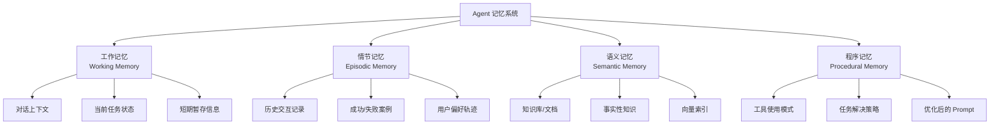

# 记忆管理：工作记忆、情节记忆与语义记忆

Agent 的记忆系统决定了它能否在多轮交互中保持连贯性、积累经验并不断改进。借鉴认知科学的分类，Agent 记忆可分为四类：工作记忆、情节记忆、语义记忆和程序记忆。本文从原理到实现，覆盖全部类型。

## 记忆类型总览



| 记忆类型 | 存储位置 | 生命周期 | 检索方式 | 典型实现 |
|---------|---------|---------|---------|---------|
| 工作记忆 | 上下文窗口 | 单次会话 | 顺序读取 | 消息列表 |
| 情节记忆 | 外部存储 | 跨会话 | 相似度检索 | 向量数据库 |
| 语义记忆 | 知识库 | 持久化 | 混合检索 | RAG |
| 程序记忆 | 系统配置 | 持久化 | 规则匹配 | Few-shot 示例 |

---

## 1. 工作记忆

工作记忆是 Agent 当前上下文中的信息，受限于 LLM 的上下文窗口大小。核心挑战是在有限窗口内保留最关键的信息。

### 上下文窗口管理

```python
from typing import Annotated, TypedDict
from langgraph.graph.message import add_messages
from langchain_core.messages import BaseMessage, SystemMessage


class WorkingMemoryManager:
    """工作记忆管理器"""

    def __init__(
        self,
        max_tokens: int = 8000,
        reserved_for_system: int = 1000,
        reserved_for_output: int = 2000,
    ):
        self.max_tokens = max_tokens
        self.available_tokens = max_tokens - reserved_for_system - reserved_for_output

    def estimate_tokens(self, text: str) -> int:
        """估算文本的 token 数，适配中英文混合文本

        英文约 4 字符/token，中文约 1.5 字符/token
        """
        chinese_chars = sum(1 for c in text if '\u4e00' <= c <= '\u9fff')
        other_chars = len(text) - chinese_chars
        return int(chinese_chars / 1.5 + other_chars / 4)

    def trim_messages(
        self,
        messages: list[BaseMessage],
        strategy: str = "sliding_window",
    ) -> list[BaseMessage]:
        """根据策略裁剪消息列表以适应上下文窗口"""

        if strategy == "sliding_window":
            return self._sliding_window(messages)
        elif strategy == "importance_weighted":
            return self._importance_weighted(messages)
        elif strategy == "summary":
            return self._summary_based(messages)
        else:
            raise ValueError(f"未知策略: {strategy}")

    def _sliding_window(
        self,
        messages: list[BaseMessage],
    ) -> list[BaseMessage]:
        """滑动窗口：保留最近的消息"""
        result = []
        total_tokens = 0

        # 保留系统消息
        system_msgs = [m for m in messages if isinstance(m, SystemMessage)]
        for msg in system_msgs:
            total_tokens += self.estimate_tokens(msg.content)

        # 从最新消息开始添加
        non_system = [m for m in messages if not isinstance(m, SystemMessage)]
        for msg in reversed(non_system):
            msg_tokens = self.estimate_tokens(msg.content)
            if total_tokens + msg_tokens > self.available_tokens:
                break
            result.insert(0, msg)
            total_tokens += msg_tokens

        return system_msgs + result

    def _importance_weighted(
        self,
        messages: list[BaseMessage],
    ) -> list[BaseMessage]:
        """重要性加权：优先保留重要消息"""
        scored_messages = []
        for msg in messages:
            score = self._compute_importance(msg)
            scored_messages.append((score, msg))

        # 按重要性排序，优先保留高分消息
        scored_messages.sort(key=lambda x: x[0], reverse=True)

        result = []
        total_tokens = 0
        for score, msg in scored_messages:
            msg_tokens = self.estimate_tokens(msg.content)
            if total_tokens + msg_tokens > self.available_tokens:
                continue
            result.append(msg)
            total_tokens += msg_tokens

        # 恢复原始顺序
        result.sort(key=lambda m: messages.index(m))
        return result

    def _compute_importance(self, message: BaseMessage) -> float:
        """计算消息重要性评分"""
        score = 0.5  # 基础分

        # 系统消息最重要
        if isinstance(message, SystemMessage):
            return 1.0

        # 工具调用结果通常包含关键信息
        if message.type == "tool":
            score += 0.2

        # 包含关键词的消息更重要
        important_keywords = [
            "错误", "失败", "重要", "注意",
            "error", "fail", "important", "warning",
        ]
        content_lower = message.content.lower()
        for kw in important_keywords:
            if kw in content_lower:
                score += 0.1
                break

        # 较长的消息可能包含更多信息
        if len(message.content) > 500:
            score += 0.1

        return min(score, 1.0)

    def _summary_based(
        self,
        messages: list[BaseMessage],
    ) -> list[BaseMessage]:
        """摘要策略：将旧消息压缩为摘要"""
        if not messages:
            return messages

        system_msgs = [m for m in messages if isinstance(m, SystemMessage)]
        non_system = [m for m in messages if not isinstance(m, SystemMessage)]

        if not non_system:
            return system_msgs

        # 保留最近的消息，对旧消息生成摘要
        recent_count = max(1, len(non_system) // 2)
        old_messages = non_system[:-recent_count]
        recent_messages = non_system[-recent_count:]

        if old_messages:
            summary_content = self._generate_summary(old_messages)
            summary_msg = SystemMessage(
                content=f"[对话历史摘要]\n{summary_content}"
            )
            system_msgs.append(summary_msg)

        return system_msgs + recent_messages

    def _generate_summary(self, messages: list[BaseMessage]) -> str:
        """生成消息摘要"""
        # 简化实现：提取每条消息的核心内容
        parts = []
        for msg in messages[-5:]:  # 最多摘要最近5条
            role = msg.type
            content = msg.content[:200]  # 截断
            parts.append(f"{role}: {content}")
        return "\n".join(parts)
```

### LangGraph 中的消息裁剪

```python
from langgraph.graph import StateGraph, MessagesState
from langgraph.graph.message import RemoveMessage


def trim_context(state: MessagesState) -> dict:
    """在图节点中裁剪上下文"""
    messages = state["messages"]

    # 超过 20 条消息时开始裁剪
    if len(messages) > 20:
        # 删除最早的非系统消息
        to_remove = []
        for i, msg in enumerate(messages):
            if not isinstance(msg, SystemMessage) and i < len(messages) - 10:
                to_remove.append(RemoveMessage(id=msg.id))

        return {"messages": to_remove}

    return {}
```

---

## 2. 情节记忆

情节记忆存储 Agent 的历史交互经历，包括成功案例和失败教训。通过相似度检索，Agent 可以从过去的经验中学习。

### 基于 LangGraph 的检查点记忆

```python
from langgraph.checkpoint.memory import MemorySaver
from langgraph.graph import StateGraph, MessagesState


# 使用 MemorySaver 实现跨对话记忆
checkpointer = MemorySaver()

workflow = StateGraph(MessagesState)
# ... 定义节点和边 ...
app = workflow.compile(checkpointer=checkpointer)

# 不同 thread_id 对应不同的会话记忆
config_user_a = {"configurable": {"thread_id": "user-a"}}
config_user_b = {"configurable": {"thread_id": "user-b"}}

# 用户A的对话
app.invoke({"messages": [("user", "我叫小明")]}, config_user_a)

# 用户A的新对话，可以回忆之前的信息
result = app.invoke(
    {"messages": [("user", "我叫什么名字？")]},
    config_user_a,
)
# 结果：你叫小明
```

### 向量存储的情节记忆

```python
from datetime import datetime
from dataclasses import dataclass, field, asdict
import json


@dataclass
class EpisodicMemory:
    """情节记忆条目"""
    content: str               # 记忆内容
    timestamp: str             # 发生时间
    session_id: str            # 会话ID
    outcome: str               # 结果: success / failure / partial
    task_type: str             # 任务类型
    reflection: str = ""       # 反思总结
    metadata: dict = field(default_factory=dict)

    def to_text(self) -> str:
        """转换为可索引的文本"""
        return (
            f"[{self.timestamp}] 任务: {self.task_type}\n"
            f"内容: {self.content}\n"
            f"结果: {self.outcome}\n"
            f"反思: {self.reflection}"
        )


class EpisodicMemoryStore:
    """情节记忆存储"""

    def __init__(self, vectorstore):
        self.vectorstore = vectorstore

    def store(self, memory: EpisodicMemory):
        """存储一段情节记忆"""
        self.vectorstore.add_texts(
            texts=[memory.to_text()],
            metadatas=[{
                "session_id": memory.session_id,
                "outcome": memory.outcome,
                "task_type": memory.task_type,
                "timestamp": memory.timestamp,
            }],
        )

    def retrieve(
        self,
        query: str,
        k: int = 5,
        outcome_filter: str | None = None,
    ) -> list[EpisodicMemory]:
        """检索相关情节记忆"""
        filter_dict = {}
        if outcome_filter:
            filter_dict["outcome"] = outcome_filter

        docs = self.vectorstore.similarity_search(
            query=query,
            k=k,
            filter=filter_dict,
        )

        memories = []
        for doc in docs:
            memory = EpisodicMemory(
                content=doc.page_content,
                timestamp=doc.metadata.get("timestamp", ""),
                session_id=doc.metadata.get("session_id", ""),
                outcome=doc.metadata.get("outcome", ""),
                task_type=doc.metadata.get("task_type", ""),
            )
            memories.append(memory)
        return memories


# 使用示例
from langchain_chroma import Chroma
from langchain_openai import OpenAIEmbeddings

vectorstore = Chroma(
    collection_name="episodic_memory",
    embedding_function=OpenAIEmbeddings(),
)

episodic_store = EpisodicMemoryStore(vectorstore)

# 存储一次成功的经历
episodic_store.store(EpisodicMemory(
    content="用户需要生成SQL查询，通过先理解表结构再生成SQL的方式成功完成",
    timestamp=datetime.now().isoformat(),
    session_id="session-001",
    outcome="success",
    task_type="sql_generation",
    reflection="先分析schema再生成SQL比直接生成效果好很多",
))

# 检索相关的成功经验
related = episodic_store.retrieve(
    query="如何生成正确的SQL查询",
    outcome_filter="success",
)
```

---

## 3. 语义记忆

语义记忆是 Agent 的长期知识储备，包含事实性知识和领域概念。通常通过 RAG（检索增强生成）实现。

### 混合检索的语义记忆

```python
from langchain_core.retrievers import BaseRetriever
from langchain_core.documents import Document
from pydantic import Field


class HybridRetriever(BaseRetriever):
    """混合检索器：结合关键词检索和向量检索"""

    vector_retriever: BaseRetriever = Field(description="向量检索器")
    keyword_retriever: BaseRetriever = Field(description="关键词检索器")
    vector_weight: float = Field(default=0.7, description="向量检索权重")
    top_k: int = Field(default=5, description="返回结果数量")

    def _get_relevant_documents(self, query: str) -> list[Document]:
        # 分别检索
        vector_docs = self.vector_retriever.invoke(query)
        keyword_docs = self.keyword_retriever.invoke(query)

        # 合并去重并按加权分数排序
        doc_scores: dict[str, tuple[float, Document]] = {}

        for i, doc in enumerate(vector_docs):
            key = doc.page_content[:100]
            score = (len(vector_docs) - i) / len(vector_docs) * self.vector_weight
            doc_scores[key] = (score, doc)

        for i, doc in enumerate(keyword_docs):
            key = doc.page_content[:100]
            score = (len(keyword_docs) - i) / len(keyword_docs) * (1 - self.vector_weight)
            if key in doc_scores:
                old_score, old_doc = doc_scores[key]
                doc_scores[key] = (old_score + score, old_doc)
            else:
                doc_scores[key] = (score, doc)

        # 排序并截取
        sorted_docs = sorted(
            doc_scores.values(),
            key=lambda x: x[0],
            reverse=True,
        )
        return [doc for _, doc in sorted_docs[:self.top_k]]
```

### 知识图谱增强的语义记忆

```python
class KnowledgeGraphMemory:
    """基于知识图谱的语义记忆"""

    def __init__(self):
        self.entities: dict[str, dict] = {}
        self.relations: list[tuple[str, str, str]] = []  # (source, relation, target)

    def add_entity(self, name: str, properties: dict):
        """添加实体"""
        if name in self.entities:
            self.entities[name].update(properties)
        else:
            self.entities[name] = properties

    def add_relation(self, source: str, relation: str, target: str):
        """添加关系"""
        self.relations.append((source, relation, target))

    def query_neighbors(self, entity: str, depth: int = 1) -> str:
        """查询实体的关联信息"""
        if entity not in self.entities:
            return f"未知实体: {entity}"

        result_parts = [f"实体: {entity}"]
        result_parts.append(f"属性: {self.entities[entity]}")

        related = [
            (s, r, t) for s, r, t in self.relations
            if s == entity or t == entity
        ]
        for source, relation, target in related:
            if source == entity:
                result_parts.append(f"  -{relation}-> {target}")
            else:
                result_parts.append(f"  <-{relation}- {source}")

        return "\n".join(result_parts)

    def to_context(self, entities: list[str]) -> str:
        """将指定实体的知识转换为 LLM 可用的上下文"""
        contexts = []
        for entity in entities:
            context = self.query_neighbors(entity)
            if "未知实体" not in context:
                contexts.append(context)
        return "\n\n".join(contexts)


# 使用示例
kg = KnowledgeGraphMemory()
kg.add_entity("微服务", {"定义": "一种将应用拆分为独立服务的架构风格"})
kg.add_entity("Docker", {"定义": "容器化平台", "用途": "应用部署和隔离"})
kg.add_relation("微服务", "常用部署方式", "Docker")
kg.add_relation("微服务", "替代方案", "单体架构")

# 查询相关上下文
context = kg.to_context(["微服务"])
```

---

## 4. 程序记忆

程序记忆存储 Agent "如何做事"的知识——工具使用模式、任务解决策略、优化后的 Prompt 模板。这类记忆让 Agent 越用越好。

### Few-Shot 示例库

```python
from dataclasses import dataclass


@dataclass
class ProceduralExample:
    """程序记忆示例"""
    task_type: str          # 任务类型
    situation: str          # 场景描述
    action_sequence: list   # 行动序列
    outcome: str            # 结果
    lesson: str             # 经验总结


class ProceduralMemory:
    """程序记忆管理"""

    def __init__(self):
        self.examples: dict[str, list[ProceduralExample]] = {}

    def add_example(self, example: ProceduralExample):
        if example.task_type not in self.examples:
            self.examples[example.task_type] = []
        self.examples[example.task_type].append(example)

    def get_few_shot_prompt(
        self,
        task_type: str,
        max_examples: int = 3,
    ) -> str:
        """生成 Few-Shot Prompt"""
        examples = self.examples.get(task_type, [])
        if not examples:
            return ""

        selected = examples[:max_examples]
        parts = []
        for ex in selected:
            actions_str = " -> ".join(ex.action_sequence)
            parts.append(
                f"场景: {ex.situation}\n"
                f"行动: {actions_str}\n"
                f"结果: {ex.outcome}\n"
                f"经验: {ex.lesson}"
            )
        return "\n\n---\n\n".join(parts)


# 预置常用程序记忆
pm = ProceduralMemory()

pm.add_example(ProceduralExample(
    task_type="database_query",
    situation="用户需要查询满足多条件的数据",
    action_sequence=[
        "先查询表结构了解字段",
        "确认筛选条件的字段名",
        "构建安全的参数化查询",
        "执行并返回结果",
    ],
    outcome="成功获取数据",
    lesson="永远先确认表结构，避免字段名错误",
))

pm.add_example(ProceduralExample(
    task_type="bug_fixing",
    situation="代码运行报错需要修复",
    action_sequence=[
        "读取完整错误信息",
        "定位出错代码行",
        "分析根因而非表象",
        "实施最小化修复",
        "验证修复有效",
    ],
    outcome="问题解决",
    lesson="不要只修表面症状，找到根因再修复",
))
```

---

## 5. 记忆压缩与汇总

长对话必须压缩，否则上下文窗口不够用。压缩策略需要平衡信息保留率和压缩比。

```python
from langchain_core.messages import BaseMessage, SystemMessage, HumanMessage, AIMessage
from langchain_core.prompts import ChatPromptTemplate


class MemoryCompressor:
    """记忆压缩器"""

    def __init__(self, llm):
        self.llm = llm
        self.compress_prompt = ChatPromptTemplate.from_messages([
            ("system", (
                "你是一个记忆压缩专家。将以下对话历史压缩为简洁的摘要。\n"
                "要求：\n"
                "1. 保留所有关键事实、决策和结论\n"
                "2. 保留用户明确表达的偏好\n"
                "3. 保留未完成的任务和待解决的问题\n"
                "4. 删除寒暄、重复和冗余内容\n"
                "5. 摘要长度不超过原文的 30%"
            )),
            ("user", "对话历史：\n{conversation}"),
        ])

    def compress(
        self,
        messages: list[BaseMessage],
        keep_recent: int = 4,
    ) -> list[BaseMessage]:
        """压缩消息列表"""
        if len(messages) <= keep_recent + 1:
            return messages

        # 分离系统消息、旧消息和最近消息
        system_msgs = [m for m in messages if isinstance(m, SystemMessage)]
        non_system = [m for m in messages if not isinstance(m, SystemMessage)]

        old_messages = non_system[:-keep_recent]
        recent_messages = non_system[-keep_recent:]

        if not old_messages:
            return messages

        # 生成摘要
        conversation_text = self._format_for_compression(old_messages)
        summary = self._generate_summary(conversation_text)

        summary_msg = SystemMessage(
            content=f"[之前对话的摘要]\n{summary}\n[摘要结束]"
        )

        return system_msgs + [summary_msg] + recent_messages

    def _format_for_compression(self, messages: list[BaseMessage]) -> str:
        """格式化消息用于压缩"""
        parts = []
        for msg in messages:
            role = {
                "human": "用户",
                "ai": "助手",
                "tool": "工具",
                "system": "系统",
            }.get(msg.type, msg.type)
            parts.append(f"{role}: {msg.content[:500]}")
        return "\n".join(parts)

    def _generate_summary(self, text: str) -> str:
        """调用 LLM 生成摘要"""
        chain = self.compress_prompt | self.llm
        result = chain.invoke({"conversation": text})
        return result.content
```

---

## 6. 统一记忆架构

将四种记忆整合到统一的 Agent 架构中：

```python
from langgraph.graph import StateGraph, END, MessagesState
from langgraph.checkpoint.memory import MemorySaver
from langchain_core.messages import SystemMessage


class UnifiedMemoryState(MessagesState):
    """统一记忆状态"""
    episodic_context: str = ""   # 情节记忆上下文
    semantic_context: str = ""   # 语义记忆上下文
    procedural_context: str = "" # 程序记忆上下文


def build_memory_agent(
    llm,
    tools: list,
    episodic_store: EpisodicMemoryStore,
    semantic_retriever,
    procedural_memory: ProceduralMemory,
):
    """构建带统一记忆的 Agent"""

    def retrieve_memories(state: UnifiedMemoryState) -> dict:
        """检索各类记忆"""
        query = state["messages"][-1].content if state["messages"] else ""

        # 检索情节记忆
        episodic = episodic_store.retrieve(query, k=3, outcome_filter="success")
        episodic_text = "\n".join([m.to_text() for m in episodic])

        # 检索语义记忆
        semantic_docs = semantic_retriever.invoke(query)
        semantic_text = "\n".join([d.page_content for d in semantic_docs[:3]])

        # 获取程序记忆
        procedural_text = procedural_memory.get_few_shot_prompt("general")

        return {
            "episodic_context": episodic_text,
            "semantic_context": semantic_text,
            "procedural_context": procedural_text,
        }

    def call_model(state: UnifiedMemoryState) -> dict:
        """调用模型，注入记忆上下文"""
        memory_context = ""
        if state["episodic_context"]:
            memory_context += f"[相关经验]\n{state['episodic_context']}\n\n"
        if state["semantic_context"]:
            memory_context += f"[相关知识]\n{state['semantic_context']}\n\n"
        if state["procedural_context"]:
            memory_context += f"[行动指南]\n{state['procedural_context']}\n\n"

        system_content = (
            "你是一个智能助手。根据以下记忆上下文辅助回答：\n\n"
            f"{memory_context}"
            "请基于记忆中的经验和知识来回答，但不要直接引用记忆原文。"
        )

        messages = [SystemMessage(content=system_content)] + state["messages"]
        response = llm.bind_tools(tools).invoke(messages)
        return {"messages": [response]}

    # 构建图
    workflow = StateGraph(UnifiedMemoryState)
    workflow.add_node("retrieve", retrieve_memories)
    workflow.add_node("agent", call_model)

    workflow.set_entry_point("retrieve")
    workflow.add_edge("retrieve", "agent")

    # ... 添加工具节点和条件边 ...

    return workflow.compile(checkpointer=MemorySaver())
```

---

## 生产环境建议

1. **记忆分级**：根据查询频率设置热/温/冷存储层
2. **记忆衰减**：时间越久的记忆权重越低，避免过时信息干扰
3. **记忆去重**：相似情节记忆定期合并，减少冗余
4. **隐私合规**：用户记忆支持查看、导出和删除
5. **成本控制**：记忆检索的嵌入调用和存储都有成本，需要监控和限流

```python
class MemoryDecay:
    """记忆衰减策略"""

    @staticmethod
    def compute_weight(
        timestamp: str,
        access_count: int,
        base_weight: float = 1.0,
        decay_rate: float = 0.1,
    ) -> float:
        """计算记忆的当前权重，时间越久权重越低，访问越多权重越高"""
        from datetime import datetime, timezone
        age_days = (datetime.now(timezone.utc) - datetime.fromisoformat(timestamp)).days
        time_decay = math.exp(-decay_rate * age_days)
        access_boost = 1 + math.log1p(access_count)
        return base_weight * time_decay * access_boost
```

记忆系统是 Agent 从"工具"走向"智能体"的关键。好的记忆设计让 Agent 具备持续学习和个性化服务的能力。
