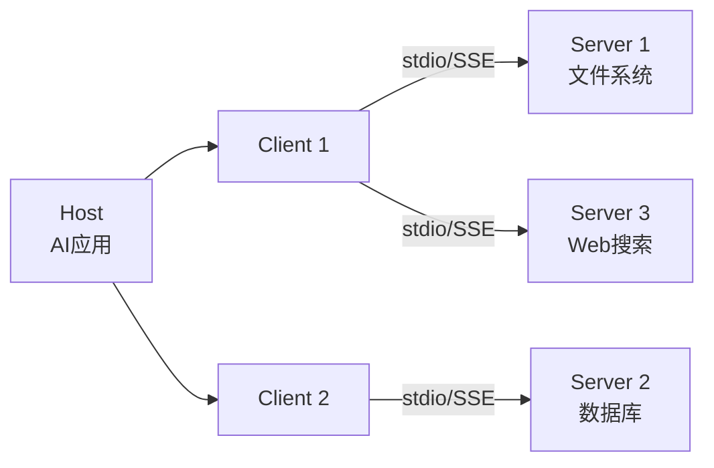

# MCP 协议与工具生态

MCP（Model Context Protocol）是 Anthropic 提出的开放协议，标准化了 LLM 应用与外部工具、数据源的连接方式。它让工具开发一次、到处可用，解决了每个 AI 应用都要重复集成工具的碎片化问题。

## MCP 协议概览

### 核心架构



| 概念 | 说明 |
|------|------|
| Host | 运行 LLM 的 AI 应用（如 Claude Desktop） |
| Client | Host 内部与 Server 通信的协议客户端 |
| Server | 提供工具、资源、Prompt 的 MCP 服务端 |

### 传输方式

| 传输方式 | 适用场景 | 特点 |
|---------|---------|------|
| stdio | 本地进程间通信 | 简单可靠，Server 作为 Host 的子进程 |
| SSE (HTTP+Server-Sent Events) | 远程服务 | 支持网络部署，可跨机器 |

### 协议原语

MCP 定义了三类核心原语：

1. **Tools**：模型可调用的函数（对应 Function Calling）
2. **Resources**：模型可读取的数据（文件、API 响应等）
3. **Prompts**：预定义的 Prompt 模板

---

## 构建 MCP Server（Python）

### 安装依赖

```bash
pip install mcp
```

### 基本 Server

```python
from mcp.server import Server
from mcp.server.stdio import stdio_server
from mcp.types import (
    Tool,
    TextContent,
    ImageContent,
    EmbeddedResource,
)
import mcp.server.stdio as stdio
import json


# 创建 Server 实例
server = Server("weather-server")


@server.list_tools()
async def list_tools() -> list[Tool]:
    """声明 Server 提供的工具"""
    return [
        Tool(
            name="get_weather",
            description=(
                "获取指定城市的天气信息。"
                "返回温度、湿度、风速和天气状况。"
            ),
            inputSchema={
                "type": "object",
                "properties": {
                    "city": {
                        "type": "string",
                        "description": "城市名称，如 'Beijing', 'Shanghai'",
                    },
                    "unit": {
                        "type": "string",
                        "enum": ["celsius", "fahrenheit"],
                        "description": "温度单位，默认 celsius",
                    },
                },
                "required": ["city"],
            },
        ),
        Tool(
            name="get_forecast",
            description=(
                "获取未来几天的天气预报。"
                "返回每天的天气概况。"
            ),
            inputSchema={
                "type": "object",
                "properties": {
                    "city": {
                        "type": "string",
                        "description": "城市名称",
                    },
                    "days": {
                        "type": "integer",
                        "description": "预报天数，1-7天",
                        "minimum": 1,
                        "maximum": 7,
                        "default": 3,
                    },
                },
                "required": ["city"],
            },
        ),
    ]


@server.call_tool()
async def call_tool(name: str, arguments: dict) -> list[TextContent]:
    """处理工具调用"""
    if name == "get_weather":
        return await _get_weather(arguments)
    elif name == "get_forecast":
        return await _get_forecast(arguments)
    else:
        return [TextContent(type="text", text=f"未知工具: {name}")]


async def _get_weather(args: dict) -> list[TextContent]:
    """获取天气信息"""
    city = args["city"]
    unit = args.get("unit", "celsius")

    # 实际实现中调用天气 API
    weather_data = {
        "city": city,
        "temperature": 22 if unit == "celsius" else 71.6,
        "humidity": 65,
        "wind_speed": 12,
        "condition": "多云",
        "unit": unit,
    }

    return [TextContent(
        type="text",
        text=json.dumps(weather_data, ensure_ascii=False, indent=2),
    )]


async def _get_forecast(args: dict) -> list[TextContent]:
    """获取天气预报"""
    city = args["city"]
    days = args.get("days", 3)

    forecasts = []
    for i in range(days):
        forecasts.append({
            "day": f"第{i+1}天",
            "high": 25 - i,
            "low": 15 - i,
            "condition": "晴转多云" if i < 2 else "小雨",
        })

    return [TextContent(
        type="text",
        text=json.dumps({
            "city": city,
            "forecasts": forecasts,
        }, ensure_ascii=False, indent=2),
    )]


# 启动 Server
async def main():
    async with stdio_server() as (read_stream, write_stream):
        await server.run(read_stream, write_stream, server.create_initialization_options())


if __name__ == "__main__":
    import asyncio
    asyncio.run(main())
```

### 带资源的 MCP Server

```python
@server.list_resources()
async def list_resources() -> list[dict]:
    """声明 Server 提供的资源"""
    return [
        {
            "uri": "docs://api-guide",
            "name": "API 使用指南",
            "description": "内部 API 的使用文档和示例",
            "mimeType": "text/markdown",
        },
        {
            "uri": "schema://database",
            "name": "数据库 Schema",
            "description": "所有数据表的结构定义",
            "mimeType": "application/json",
        },
    ]


@server.read_resource()
async def read_resource(uri: str) -> str:
    """读取资源内容"""
    if uri == "docs://api-guide":
        return "# API 使用指南\n\n## 认证\n所有请求需要 Bearer Token...\n"
    elif uri == "schema://database":
        return json.dumps({
            "users": {
                "columns": ["id", "name", "email", "created_at"],
                "primary_key": "id",
            },
            "orders": {
                "columns": ["id", "user_id", "amount", "status", "created_at"],
                "primary_key": "id",
            },
        }, indent=2)
    else:
        raise ValueError(f"未知资源: {uri}")
```

### 带 Prompt 模板的 MCP Server

```python
@server.list_prompts()
async def list_prompts() -> list[dict]:
    """声明 Server 提供的 Prompt 模板"""
    return [
        {
            "name": "code_review",
            "description": "代码审查 Prompt，分析代码质量和潜在问题",
            "arguments": [
                {
                    "name": "language",
                    "description": "编程语言",
                    "required": True,
                },
                {
                    "name": "focus",
                    "description": "审查重点: security/performance/style/all",
                    "required": False,
                },
            ],
        },
    ]


@server.get_prompt()
async def get_prompt(name: str, arguments: dict) -> dict:
    """获取 Prompt 模板内容"""
    if name == "code_review":
        language = arguments["language"]
        focus = arguments.get("focus", "all")

        focus_instructions = {
            "security": "重点检查安全漏洞：SQL注入、XSS、认证问题等。",
            "performance": "重点检查性能问题：N+1查询、内存泄漏、不必要的拷贝等。",
            "style": "重点检查代码风格：命名规范、注释、模块化程度。",
            "all": "全面审查代码质量、安全性、性能和可维护性。",
        }

        return {
            "messages": [
                {
                    "role": "user",
                    "content": {
                        "type": "text",
                        "text": (
                            f"请审查以下 {language} 代码。\n"
                            f"审查重点: {focus_instructions.get(focus, focus_instructions['all'])}\n\n"
                            "```{language}\n{{code}}\n```"
                        ),
                    },
                },
            ],
        }
    raise ValueError(f"未知 Prompt 模板: {name}")
```

---

## 构建 MCP Client

### 基本 Client

```python
from mcp import ClientSession, StdioServerParameters
from mcp.client.stdio import stdio_client


class MCPClient:
    """MCP 客户端"""

    def __init__(self):
        self.sessions: dict[str, ClientSession] = {}
        self.available_tools: list[dict] = []

    async def connect_to_server(
        self,
        server_name: str,
        command: str,
        args: list[str] | None = None,
        env: dict | None = None,
    ):
        """连接到 MCP Server"""
        server_params = StdioServerParameters(
            command=command,
            args=args or [],
            env=env,
        )

        read_stream, write_stream = await stdio_client(server_params).__aenter__()
        session = ClientSession(read_stream, write_stream)
        await session.__aenter__()
        await session.initialize()

        self.sessions[server_name] = session

        # 获取工具列表
        tools_result = await session.list_tools()
        for tool in tools_result.tools:
            self.available_tools.append({
                "server": server_name,
                "name": tool.name,
                "description": tool.description,
                "inputSchema": tool.inputSchema,
            })

    async def call_tool(
        self,
        tool_name: str,
        arguments: dict,
    ) -> any:
        """调用工具"""
        # 查找工具所在 Server
        for tool_info in self.available_tools:
            if tool_info["name"] == tool_name:
                server_name = tool_info["server"]
                session = self.sessions[server_name]
                result = await session.call_tool(tool_name, arguments)
                return result

        raise ValueError(f"未找到工具: {tool_name}")

    async def list_resources(self, server_name: str) -> list:
        """列出 Server 的资源"""
        session = self.sessions[server_name]
        result = await session.list_resources()
        return result.resources

    async def read_resource(self, server_name: str, uri: str) -> str:
        """读取资源"""
        session = self.sessions[server_name]
        result = await session.read_resource(uri)
        return result

    async def close(self):
        """关闭所有连接"""
        for session in self.sessions.values():
            await session.__aexit__(None, None, None)
        self.sessions.clear()
```

### 集成到 LangChain/LangGraph

```python
from langchain_core.tools import Tool as LCTool
from langchain_core.runnables import RunnableConfig


def mcp_tools_to_langchain(mcp_client: MCPClient) -> list[LCTool]:
    """将 MCP 工具转换为 LangChain Tool"""

    import asyncio

    langchain_tools = []

    for tool_info in mcp_client.available_tools:
        # 创建闭包捕获 tool_name
        def make_tool_func(name: str):
            async def tool_func(**kwargs):
                result = await mcp_client.call_tool(name, kwargs)
                # 提取文本内容
                texts = []
                for content in result.content:
                    if hasattr(content, "text"):
                        texts.append(content.text)
                return "\n".join(texts)

            def sync_tool_func(**kwargs):
                return asyncio.run(tool_func(**kwargs))

            return sync_tool_func

        lc_tool = LCTool(
            name=tool_info["name"],
            description=tool_info["description"],
            func=make_tool_func(tool_info["name"]),
            args_schema=tool_info.get("inputSchema"),
        )
        langchain_tools.append(lc_tool)

    return langchain_tools
```

---

## 工具发现与注册

### 动态工具发现

```python
class ToolDiscovery:
    """动态工具发现与注册"""

    def __init__(self):
        self.registry: dict[str, dict] = {}

    async def discover_from_server(
        self,
        client: MCPClient,
        server_name: str,
    ) -> list[dict]:
        """从 MCP Server 发现工具"""
        discovered = []
        for tool_info in client.available_tools:
            if tool_info["server"] == server_name:
                self.registry[tool_info["name"]] = tool_info
                discovered.append(tool_info)
        return discovered

    def find_tools_for_task(
        self,
        task_description: str,
        max_tools: int = 5,
    ) -> list[dict]:
        """根据任务描述找到最相关的工具"""
        # 简化实现：基于关键词匹配
        scored_tools = []
        task_keywords = set(task_description.lower().split())

        for name, info in self.registry.items():
            desc_keywords = set(info["description"].lower().split())
            overlap = len(task_keywords & desc_keywords)
            scored_tools.append((overlap, info))

        scored_tools.sort(key=lambda x: x[0], reverse=True)
        return [info for _, info in scored_tools[:max_tools]]

    def get_tool_schema(self, tool_name: str) -> dict | None:
        """获取工具的完整 Schema"""
        return self.registry.get(tool_name)
```

---

## 集成 Claude Desktop

Claude Desktop 是 MCP 最成熟的 Host 实现。通过配置文件注册 MCP Server：

### 配置文件位置

- macOS: `~/Library/Application Support/Claude/claude_desktop_config.json`
- Windows: `%APPDATA%\Claude\claude_desktop_config.json`

### 配置示例

```json
{
  "mcpServers": {
    "weather": {
      "command": "python",
      "args": ["/path/to/weather_server.py"],
      "env": {
        "WEATHER_API_KEY": "your-api-key"
      }
    },
    "database": {
      "command": "python",
      "args": ["/path/to/db_server.py"],
      "env": {
        "DB_CONNECTION_STRING": "postgresql://..."
      }
    },
    "filesystem": {
      "command": "npx",
      "args": [
        "-y",
        "@modelcontextprotocol/server-filesystem",
        "/path/to/allowed/directory"
      ]
    }
  }
}
```

### 远程 Server (SSE 传输)

```json
{
  "mcpServers": {
    "remote-search": {
      "url": "https://mcp-search.example.com/sse",
      "headers": {
        "Authorization": "Bearer your-token"
      }
    }
  }
}
```

---

## MCP Server 开发最佳实践

### 错误处理

```python
from mcp.types import TextContent


class MCPError:
    """MCP 错误处理工具"""

    @staticmethod
    def tool_error(message: str, code: str = "TOOL_ERROR") -> list[TextContent]:
        """返回结构化错误信息"""
        return [TextContent(
            type="text",
            text=json.dumps({
                "error": True,
                "code": code,
                "message": message,
            }, ensure_ascii=False),
        )]

    @staticmethod
    def validation_error(field: str, reason: str) -> list[TextContent]:
        """参数验证错误"""
        return MCPError.tool_error(
            f"参数 '{field}' 验证失败: {reason}",
            code="VALIDATION_ERROR",
        )


@server.call_tool()
async def call_tool(name: str, arguments: dict) -> list[TextContent]:
    try:
        # 验证参数
        if name == "get_weather":
            if "city" not in arguments:
                return MCPError.validation_error("city", "必填参数缺失")
            if not isinstance(arguments["city"], str):
                return MCPError.validation_error("city", "必须是字符串")
            return await _get_weather(arguments)

        return MCPError.tool_error(f"未知工具: {name}", "UNKNOWN_TOOL")

    except Exception as e:
        return MCPError.tool_error(f"内部错误: {str(e)}", "INTERNAL_ERROR")
```

### 工具描述优化

```python
# 差的描述 - 模型难以理解何时使用
Tool(
    name="query",
    description="查询数据",
    ...
)

# 好的描述 - 模型能准确判断何时调用
Tool(
    name="query_customer_orders",
    description=(
        "查询指定客户的订单记录。当用户询问订单状态、"
        "购买历史、消费记录时使用此工具。"
        "返回订单ID、商品列表、金额、状态和下单时间。"
    ),
    ...
)
```

### 安全考量

```python
import os
import pathlib


class MCPSecurity:
    """MCP 安全配置"""

    # 文件系统访问白名单
    ALLOWED_DIRECTORIES = [
        os.path.expanduser("~/documents"),
        "/tmp/workspace",
    ]

    @staticmethod
    def validate_path(file_path: str) -> str:
        """验证文件路径在允许范围内"""
        resolved = pathlib.Path(file_path).resolve()

        for allowed_dir in MCPSecurity.ALLOWED_DIRECTORIES:
            allowed = pathlib.Path(allowed_dir).resolve()
            if str(resolved).startswith(str(allowed)):
                return str(resolved)

        raise PermissionError(
            f"路径 '{file_path}' 不在允许的目录范围内"
        )

    @staticmethod
    def rate_limit_check(
        tool_name: str,
        calls: dict[str, int],
        max_calls: int = 100,
        window_seconds: int = 60,
    ) -> bool:
        """简单的速率限制检查"""
        key = f"{tool_name}"
        current = calls.get(key, 0)
        if current >= max_calls:
            return False
        calls[key] = current + 1
        return True
```

---

## MCP 生态中的常用 Server

| Server | 功能 | 安装 |
|--------|------|------|
| @modelcontextprotocol/server-filesystem | 文件系统读写 | `npx -y @modelcontextprotocol/server-filesystem` |
| @modelcontextprotocol/server-github | GitHub API | `npx -y @modelcontextprotocol/server-github` |
| @modelcontextprotocol/server-postgres | PostgreSQL | `npx -y @modelcontextprotocol/server-postgres` |
| @modelcontextprotocol/server-brave-search | Brave 搜索 | `npx -y @modelcontextprotocol/server-brave-search` |
| @modelcontextprotocol/server-puppeteer | 浏览器自动化 | `npx -y @modelcontextprotocol/server-puppeteer` |

MCP 的核心价值是"写一次工具，所有 AI 应用可用"。随着生态成熟，MCP 有望成为 AI 工具互联的事实标准。
