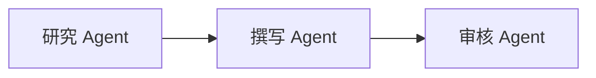
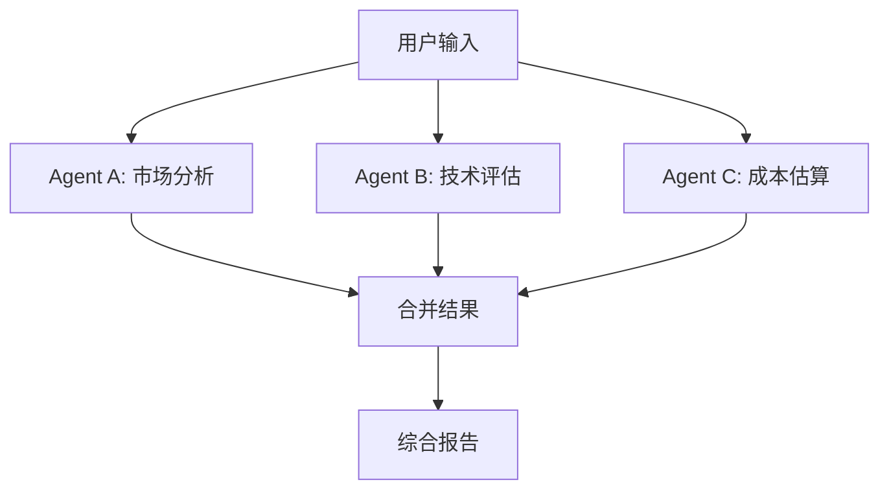
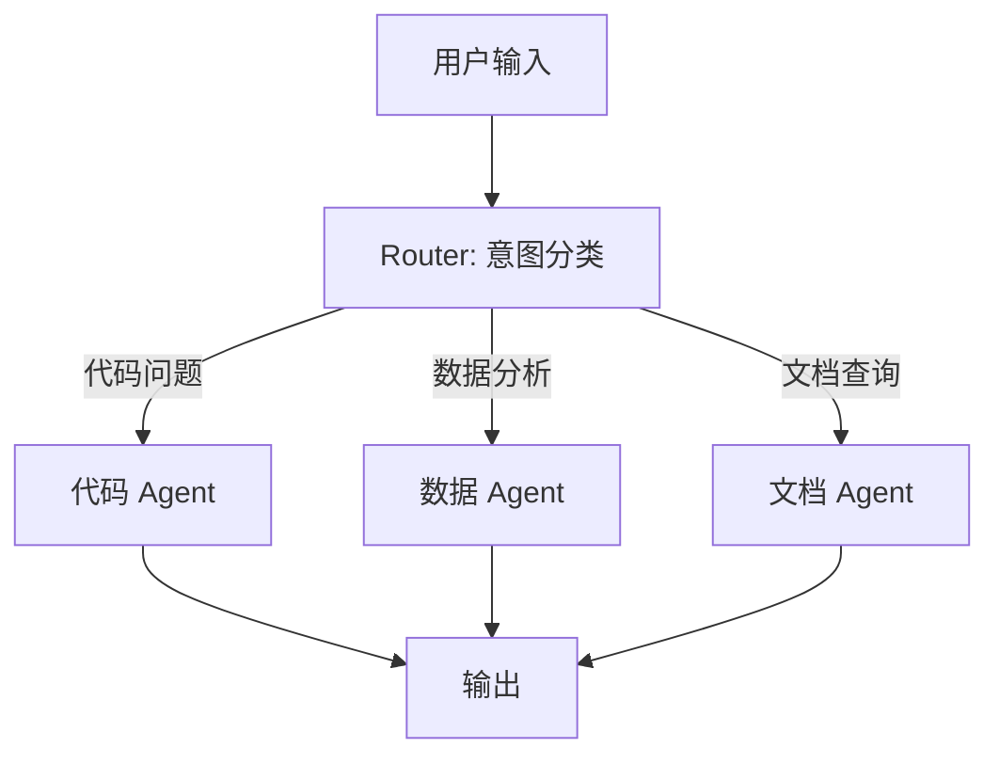
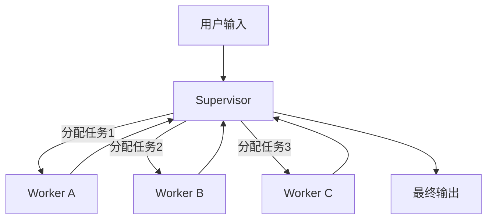
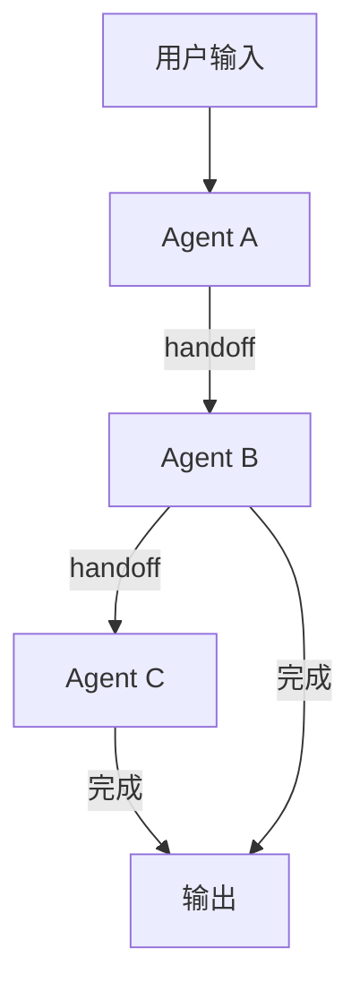
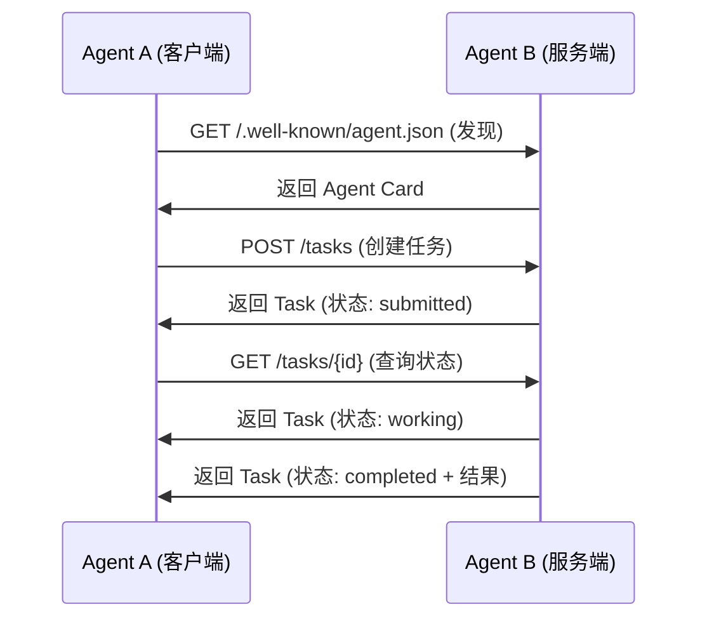

# 多 Agent 协同：编排、路由与监督

单个 Agent 的能力有限——上下文窗口限制、专业领域边界、单点故障风险。多 Agent 系统通过分工协作解决这些问题。本文覆盖主流的协同模式，并用 LangGraph 给出实现。

## 协同模式总览

```mermaid
flowchart TD
    M[多 Agent 协同] --> S[顺序执行<br/>Sequential]
    M --> P[并行执行<br/>Parallel]
    M --> R[动态路由<br/>Dynamic Routing]
    M --> SV[监督者<br/>Supervisor]
    M --> SW[群体协作<br/>Swarm]

    S --> S1[Agent A -> Agent B -> Agent C]
    P --> P1[Agent A | Agent B | Agent C]
    R --> R1[Router -> 最合适的 Agent]
    SV --> SV1[Supervisor 分配任务给 Worker]
    SW --> SW1[Agent 间直接交接]
```

| 模式 | 适用场景 | 复杂度 | 容错性 |
|------|---------|--------|--------|
| 顺序执行 | 流水线式处理 | 低 | 低 |
| 并行执行 | 独立子任务 | 低 | 中 |
| 动态路由 | 根据输入类型分发 | 中 | 中 |
| Supervisor | 复杂任务拆解与协调 | 中 | 高 |
| Swarm | 自组织协作 | 高 | 高 |

---

## 1. 顺序执行

最简单的协同模式：Agent 按固定顺序依次处理，前一个的输出是后一个的输入。



### LangGraph 实现

```python
from typing import Annotated, TypedDict
from langgraph.graph import StateGraph, END, START
from langgraph.graph.message import add_messages
from langchain_core.messages import HumanMessage, SystemMessage, AIMessage
from langchain_openai import ChatOpenAI


class PipelineState(TypedDict):
    messages: Annotated[list, add_messages]
    research_notes: str
    draft: str
    final_output: str
    review_feedback: str


def create_pipeline_agents(llm: ChatOpenAI = None):
    """创建共享 LLM 实例的 Agent 集合

    避免每个 Agent 函数都创建新的 LLM 客户端。
    共享实例可复用连接池、统一配置、降低开销。
    """
    if llm is None:
        llm = ChatOpenAI(model="gpt-4o")

    def research_agent(state: PipelineState) -> dict:
        """研究 Agent：收集信息"""
        prompt = SystemMessage(content=(
            "你是研究专家。根据用户的问题，收集相关信息并整理为研究笔记。\n"
            "输出格式：\n"
            "## 核心发现\n## 关键数据\n## 参考来源"
        ))
        response = llm.invoke([prompt] + state["messages"])

        return {
            "research_notes": response.content,
            "messages": [AIMessage(content=f"[研究完成] 已收集相关信息")],
        }

    def writing_agent(state: PipelineState) -> dict:
        """撰写 Agent：基于研究笔记撰写初稿"""
        prompt = SystemMessage(content=(
            "你是技术写作专家。根据研究笔记撰写高质量的技术文章。\n"
            "要求：结构清晰、论据充分、语言精炼。"
        ))
        response = llm.invoke([
            prompt,
            HumanMessage(content=f"研究笔记：\n{state['research_notes']}"),
        ])

        return {
            "draft": response.content,
            "messages": [AIMessage(content=f"[撰写完成] 已生成初稿")],
        }

    def review_agent(state: PipelineState) -> dict:
        """审核 Agent：审核初稿并给出修改建议"""
        prompt = SystemMessage(content=(
            "你是质量审核专家。审核文章的准确性、完整性和可读性。\n"
            "如果质量达标（评分 >= 8），输出 [APPROVED] 和最终版本。\n"
            "如果需要修改，输出 [REVISION_NEEDED] 和具体的修改建议。"
        ))
        response = llm.invoke([
            prompt,
            HumanMessage(content=f"请审核以下初稿：\n{state['draft']}"),
        ])

        content = response.content
        if "[APPROVED]" in content:
            final = content.replace("[APPROVED]", "").strip()
            return {
                "final_output": final,
                "review_feedback": "",
                "messages": [AIMessage(content="[审核通过]")],
            }
        else:
            return {
                "final_output": "",
                "review_feedback": content,
                "messages": [AIMessage(content="[需要修改]")],
            }

    return {"research": research_agent, "writing": writing_agent, "review": review_agent}


agents = create_pipeline_agents()


def should_revise(state: PipelineState) -> str:
    """判断是否需要修改"""
    if state["review_feedback"]:
        return "writing"
    return END


# 构建顺序执行图
workflow = StateGraph(PipelineState)
workflow.add_node("research", agents["research"])
workflow.add_node("writing", agents["writing"])
workflow.add_node("review", agents["review"])

workflow.add_edge(START, "research")
workflow.add_edge("research", "writing")
workflow.add_edge("writing", "review")
workflow.add_conditional_edges("review", should_revise, {"writing": "writing", END: END})

pipeline = workflow.compile()
```

---

## 2. 并行执行

多个 Agent 同时处理独立子任务，最后合并结果。



### LangGraph 实现

```python
class ParallelState(TypedDict):
    messages: Annotated[list, add_messages]
    query: str
    market_analysis: str
    tech_assessment: str
    cost_estimation: str
    final_report: str


def create_parallel_agents(llm: ChatOpenAI = None):
    """创建共享 LLM 实例的并行 Agent 集合"""
    if llm is None:
        llm = ChatOpenAI(model="gpt-4o")

    def market_analyst(state: ParallelState) -> dict:
        """市场分析 Agent"""
        response = llm.invoke([
            SystemMessage(content="你是市场分析专家。分析市场趋势、竞争格局和机会。"),
            HumanMessage(content=state["query"]),
        ])
        return {"market_analysis": response.content}

    def tech_assessor(state: ParallelState) -> dict:
        """技术评估 Agent"""
        response = llm.invoke([
            SystemMessage(content="你是技术架构师。评估技术可行性、架构方案和技术风险。"),
            HumanMessage(content=state["query"]),
        ])
        return {"tech_assessment": response.content}

    def cost_estimator(state: ParallelState) -> dict:
        """成本估算 Agent"""
        response = llm.invoke([
            SystemMessage(content="你是财务分析师。估算项目成本、ROI 和投资风险。"),
            HumanMessage(content=state["query"]),
        ])
        return {"cost_estimation": response.content}

    def synthesize(state: ParallelState) -> dict:
        """合并各 Agent 的结果"""
        combined = (
            f"# 市场分析\n{state['market_analysis']}\n\n"
            f"# 技术评估\n{state['tech_assessment']}\n\n"
            f"# 成本估算\n{state['cost_estimation']}"
        )

        response = llm.invoke([
            SystemMessage(content=(
                "你是项目总监。根据三个维度的分析，"
                "撰写综合评估报告，包含核心发现、建议和风险提示。"
            )),
            HumanMessage(content=combined),
        ])
        return {"final_report": response.content}

    return {
        "market": market_analyst,
        "tech": tech_assessor,
        "cost": cost_estimator,
        "synthesize": synthesize,
    }


parallel_agents = create_parallel_agents()


# 构建并行执行图
workflow = StateGraph(ParallelState)

workflow.add_node("market", parallel_agents["market"])
workflow.add_node("tech", parallel_agents["tech"])
workflow.add_node("cost", parallel_agents["cost"])
workflow.add_node("synthesize", parallel_agents["synthesize"])

# 三个 Agent 并行执行
workflow.add_edge(START, "market")
workflow.add_edge(START, "tech")
workflow.add_edge(START, "cost")

# 全部完成后合并
workflow.add_edge("market", "synthesize")
workflow.add_edge("tech", "synthesize")
workflow.add_edge("cost", "synthesize")
workflow.add_edge("synthesize", END)

parallel_agent = workflow.compile()
```

---

## 3. 动态路由

根据输入内容动态选择最合适的 Agent 处理。



### LangGraph 实现

```python
from typing import Literal
from langchain_openai import ChatOpenAI


class RoutingState(TypedDict):
    messages: Annotated[list, add_messages]
    route: str
    response: str


def create_routing_agents(llm: ChatOpenAI = None):
    """创建共享 LLM 实例的路由 Agent 集合"""
    if llm is None:
        llm = ChatOpenAI(model="gpt-4o")

    def router(state: RoutingState) -> dict:
        """路由器：分析意图并分发到对应 Agent"""
        from pydantic import BaseModel, Field

        class RouteDecision(BaseModel):
            destination: Literal["code", "data", "docs"] = Field(
                description="路由目标: code(代码问题), data(数据分析), docs(文档查询)"
            )

        structured_llm = llm.with_structured_output(RouteDecision)

        decision = structured_llm.invoke([
            SystemMessage(content=(
                "分析用户的问题，选择最合适的处理 Agent：\n"
                "- code: 编程、代码调试、技术架构问题\n"
                "- data: 数据查询、统计分析、报表生成\n"
                "- docs: 文档查找、知识问答、政策解读"
            )),
            *state["messages"],
        ])

        return {"route": decision.destination}

    def code_agent(state: RoutingState) -> dict:
        response = llm.invoke([
            SystemMessage(content="你是资深开发工程师，擅长代码编写、调试和架构设计。"),
            *state["messages"],
        ])
        return {"response": response.content}

    def data_agent(state: RoutingState) -> dict:
        response = llm.invoke([
            SystemMessage(content="你是数据分析师，擅长 SQL、统计分析和数据可视化。"),
            *state["messages"],
        ])
        return {"response": response.content}

    def docs_agent(state: RoutingState) -> dict:
        response = llm.invoke([
            SystemMessage(content="你是知识管理专家，擅长从文档中查找和解读信息。"),
            *state["messages"],
        ])
        return {"response": response.content}

    return {"router": router, "code": code_agent, "data": data_agent, "docs": docs_agent}


routing_agents = create_routing_agents()


def route_to_agent(state: RoutingState) -> str:
    return state["route"]


# 构建路由图
workflow = StateGraph(RoutingState)
workflow.add_node("router", routing_agents["router"])
workflow.add_node("code", routing_agents["code"])
workflow.add_node("data", routing_agents["data"])
workflow.add_node("docs", routing_agents["docs"])

workflow.add_edge(START, "router")
workflow.add_conditional_edges(
    "router", route_to_agent,
    {"code": "code", "data": "data", "docs": "docs"},
)
workflow.add_edge("code", END)
workflow.add_edge("data", END)
workflow.add_edge("docs", END)

routing_agent = workflow.compile()
```

---

## 4. Supervisor 模式

Supervisor 作为中央控制器，负责任务拆解、分配、监控和整合。Worker Agent 只负责执行具体任务。



### LangGraph 实现

```python
from typing import Annotated, TypedDict, Literal
from langgraph.graph import StateGraph, END, START
from langgraph.graph.message import add_messages
from langchain_core.messages import HumanMessage, SystemMessage, AIMessage
from pydantic import BaseModel, Field


class TaskAssignment(BaseModel):
    """任务分配"""
    worker: str = Field(description="Worker 名称")
    task: str = Field(description="任务描述")


class SupervisorDecision(BaseModel):
    """Supervisor 决策"""
    action: Literal["delegate", "respond", "finish"] = Field(
        description="delegate=分配任务, respond=直接回答, finish=完成"
    )
    assignments: list[TaskAssignment] = Field(
        default_factory=list,
        description="当 action=delegate 时，要分配的任务列表",
    )
    response: str = Field(
        default="",
        description="当 action=respond 时，直接回答的内容",
    )


class SupervisorState(TypedDict):
    messages: Annotated[list, add_messages]
    worker_results: dict  # worker_name -> result
    final_answer: str


def create_supervisor_agents(llm: ChatOpenAI = None):
    """创建共享 LLM 实例的 Supervisor Agent 集合"""
    if llm is None:
        llm = ChatOpenAI(model="gpt-4o")

    def supervisor(state: SupervisorState) -> dict:
        """Supervisor：分析任务，决定分配或回答"""
        structured_llm = llm.with_structured_output(SupervisorDecision)

        # 构建上下文
        worker_results_str = ""
        if state["worker_results"]:
            worker_results_str = "\n\n已完成的任务：\n"
            for worker, result in state["worker_results"].items():
                worker_results_str += f"- {worker}: {result[:200]}\n"

        available_workers = "researcher, coder, reviewer"

        decision = structured_llm.invoke([
            SystemMessage(content=(
                f"你是项目主管。管理以下 Worker: {available_workers}\n"
                "根据任务需要分配工作，或直接回答简单问题。\n"
                "当所有任务完成时，选择 finish 并在 response 中给出最终答案。"
                f"{worker_results_str}"
            )),
            *state["messages"],
        ])

        if decision.action == "finish":
            return {"final_answer": decision.response}
        elif decision.action == "respond":
            return {"final_answer": decision.response}
        else:
            # 分配任务 - 通过消息传递
            assignment_msgs = []
            for a in decision.assignments:
                assignment_msgs.append(
                    AIMessage(content=f"[分配给 {a.worker}]: {a.task}")
                )
            return {"messages": assignment_msgs}

    def researcher_worker(state: SupervisorState) -> dict:
        """研究 Worker"""
        last_msg = state["messages"][-1].content if state["messages"] else ""
        response = llm.invoke([
            SystemMessage(content="你是研究员。深入研究指定主题，返回关键发现和数据。"),
            HumanMessage(content=last_msg),
        ])

        results = {**state.get("worker_results", {}), "researcher": response.content}
        return {"worker_results": results}

    def coder_worker(state: SupervisorState) -> dict:
        """编码 Worker"""
        last_msg = state["messages"][-1].content if state["messages"] else ""
        response = llm.invoke([
            SystemMessage(content="你是开发工程师。编写高质量的代码实现。"),
            HumanMessage(content=last_msg),
        ])

        results = {**state.get("worker_results", {}), "coder": response.content}
        return {"worker_results": results}

    def reviewer_worker(state: SupervisorState) -> dict:
        """审核 Worker"""
        last_msg = state["messages"][-1].content if state["messages"] else ""
        response = llm.invoke([
            SystemMessage(content="你是审核专家。审核代码和文档的质量，找出问题并建议改进。"),
            HumanMessage(content=last_msg),
        ])

        results = {**state.get("worker_results", {}), "reviewer": response.content}
        return {"worker_results": results}

    return {
        "supervisor": supervisor,
        "researcher": researcher_worker,
        "coder": coder_worker,
        "reviewer": reviewer_worker,
    }


supervisor_agents = create_supervisor_agents()


def supervisor_route(state: SupervisorState) -> str:
    """Supervisor 的路由决策"""
    if state.get("final_answer"):
        return END
    # 检查最后一条消息决定分发给哪个 worker
    last_msg = state["messages"][-1].content if state["messages"] else ""
    if "[分配给 researcher]" in last_msg:
        return "researcher"
    elif "[分配给 coder]" in last_msg:
        return "coder"
    elif "[分配给 reviewer]" in last_msg:
        return "reviewer"
    return END


# 构建 Supervisor 图
workflow = StateGraph(SupervisorState)
workflow.add_node("supervisor", supervisor_agents["supervisor"])
workflow.add_node("researcher", supervisor_agents["researcher"])
workflow.add_node("coder", supervisor_agents["coder"])
workflow.add_node("reviewer", supervisor_agents["reviewer"])

workflow.add_edge(START, "supervisor")
workflow.add_conditional_edges(
    "supervisor", supervisor_route,
    {
        "researcher": "researcher",
        "coder": "coder",
        "reviewer": "reviewer",
        END: END,
    },
)
# Worker 完成后回到 Supervisor
workflow.add_edge("researcher", "supervisor")
workflow.add_edge("coder", "supervisor")
workflow.add_edge("reviewer", "supervisor")

supervisor_agent = workflow.compile()
```

---

## 5. Swarm 模式

Swarm 模式中，Agent 之间可以直接交接（handoff），无需中央协调器。每个 Agent 自主决定是将结果交给下一个 Agent 还是直接返回用户。



### LangGraph 实现

```python
from typing import Annotated, TypedDict
from langgraph.graph import StateGraph, END, START
from langgraph.graph.message import add_messages
from langchain_core.messages import HumanMessage, SystemMessage, AIMessage
from pydantic import BaseModel, Field


class HandoffDecision(BaseModel):
    """交接决策"""
    should_handoff: bool = Field(description="是否需要交接给其他 Agent")
    next_agent: str = Field(default="", description="交接目标 Agent 名称")
    reason: str = Field(default="", description="交接原因")
    response: str = Field(default="", description="当前 Agent 的响应内容")


class SwarmState(TypedDict):
    messages: Annotated[list, add_messages]
    current_agent: str
    final_response: str


def create_swarm_agent(
    name: str,
    system_prompt: str,
    available_agents: list[str],
    llm: ChatOpenAI = None,
):
    """创建 Swarm Agent（共享 LLM 实例）"""
    if llm is None:
        llm = ChatOpenAI(model="gpt-4o")

    def agent_fn(state: SwarmState) -> dict:
        structured_llm = llm.with_structured_output(HandoffDecision)

        agents_str = ", ".join(available_agents)
        full_prompt = (
            f"{system_prompt}\n\n"
            f"可交接的 Agent: {agents_str}\n"
            "如果当前问题需要其他 Agent 处理，设置 should_handoff=True 并指定 next_agent。\n"
            "如果你能直接回答，设置 should_handoff=False 并在 response 中给出答案。"
        )

        decision = structured_llm.invoke([
            SystemMessage(content=full_prompt),
            *state["messages"],
        ])

        if decision.should_handoff and decision.next_agent:
            return {
                "current_agent": decision.next_agent,
                "messages": [
                    AIMessage(content=(
                        f"[{name} -> {decision.next_agent}] "
                        f"原因: {decision.reason}"
                    )),
                ],
            }
        else:
            return {
                "final_response": decision.response,
                "messages": [AIMessage(content=decision.response)],
            }

    return agent_fn


# 共享 LLM 实例，所有 Swarm Agent 复用同一客户端
swarm_llm = ChatOpenAI(model="gpt-4o")

# 定义三个 Swarm Agent
billing_agent = create_swarm_agent(
    name="billing",
    system_prompt="你是账单客服。处理账单查询、退款和支付问题。",
    available_agents=["billing", "tech_support", "sales"],
    llm=swarm_llm,
)

tech_support_agent = create_swarm_agent(
    name="tech_support",
    system_prompt="你是技术支持。处理产品使用问题、故障排查和技术咨询。",
    available_agents=["billing", "tech_support", "sales"],
    llm=swarm_llm,
)

sales_agent = create_swarm_agent(
    name="sales",
    system_prompt="你是销售顾问。处理产品咨询、报价和合同问题。",
    available_agents=["billing", "tech_support", "sales"],
    llm=swarm_llm,
)


def initial_route(state: SwarmState) -> str:
    """初始路由：根据第一条消息判断应该交给哪个 Agent"""
    if state["messages"]:
        first_msg = state["messages"][0].content.lower()
        if any(kw in first_msg for kw in ["账单", "退款", "支付", "bill", "refund"]):
            return "billing"
        elif any(kw in first_msg for kw in ["故障", "使用", "技术", "bug", "error"]):
            return "tech_support"
        elif any(kw in first_msg for kw in ["购买", "报价", "合同", "price", "buy"]):
            return "sales"
    return "tech_support"  # 默认


def swarm_route(state: SwarmState) -> str:
    """Swarm 路由：根据 current_agent 决定下一步"""
    if state.get("final_response"):
        return END
    return state.get("current_agent", "tech_support")


# 构建 Swarm 图
workflow = StateGraph(SwarmState)
workflow.add_node("billing", billing_agent)
workflow.add_node("tech_support", tech_support_agent)
workflow.add_node("sales", sales_agent)

# 初始路由
workflow.add_conditional_edges(
    START, initial_route,
    {"billing": "billing", "tech_support": "tech_support", "sales": "sales"},
)

# 每个 Agent 完成后根据交接决策路由
for agent_name in ["billing", "tech_support", "sales"]:
    workflow.add_conditional_edges(
        agent_name, swarm_route,
        {
            "billing": "billing",
            "tech_support": "tech_support",
            "sales": "sales",
            END: END,
        },
    )

swarm_agent = workflow.compile()
```

---

## 6. A2A 协议

A2A（Agent-to-Agent）是 Google 提出的 Agent 间通信协议，目标是让不同框架构建的 Agent 能够互相发现和协作。

### 核心概念

| 概念 | 说明 |
|------|------|
| Agent Card | Agent 的自描述文件，声明能力、接口和认证方式 |
| Task | A2A 通信的基本单位，包含输入、状态和输出 |
| Message | Task 内的消息，区分用户消息和 Agent 消息 |
| Part | Message 的内容单元，支持文本、文件、表单等 |

### Agent Card 示例

```json
{
  "name": "weather-agent",
  "description": "提供全球天气查询和预报服务",
  "url": "https://weather-agent.example.com/a2a",
  "capabilities": {
    "streaming": true,
    "pushNotifications": false
  },
  "skills": [
    {
      "id": "current-weather",
      "name": "查询当前天气",
      "description": "获取指定城市的实时天气数据",
      "inputSchema": {
        "type": "object",
        "properties": {
          "city": {"type": "string"},
          "unit": {"type": "string", "enum": ["celsius", "fahrenheit"]}
        },
        "required": ["city"]
      }
    },
    {
      "id": "forecast",
      "name": "天气预报",
      "description": "获取未来多天的天气预报",
      "inputSchema": {
        "type": "object",
        "properties": {
          "city": {"type": "string"},
          "days": {"type": "integer", "minimum": 1, "maximum": 7}
        },
        "required": ["city"]
      }
    }
  ]
}
```

### A2A 通信流程



---

## 生产环境考量

### 1. 容错与重试

```python
from tenacity import retry, stop_after_attempt, wait_exponential, retry_if_exception_type


class ResilientAgent:
    """带容错的 Agent 执行器"""

    @retry(
        stop=stop_after_attempt(3),
        wait=wait_exponential(multiplier=1, min=2, max=30),
        retry=retry_if_exception_type((ConnectionError, TimeoutError)),
    )
    async def execute_with_retry(self, agent_fn, state: dict) -> dict:
        """带重试的执行"""
        try:
            return agent_fn(state)
        except Exception as e:
            # 记录失败
            import logging
            logging.getLogger(__name__).error(f"Agent 执行失败: {e}")
            raise
```

### 2. 超时与取消

```python
import asyncio
from langgraph.graph import StateGraph


class TimeoutGuard:
    """Agent 超时守卫"""

    def __init__(self, step_timeout: int = 60, total_timeout: int = 300):
        self.step_timeout = step_timeout
        self.total_timeout = total_timeout

    async def run_with_timeout(self, agent, input_data: dict) -> dict:
        """带总超时的 Agent 执行"""
        try:
            result = await asyncio.wait_for(
                agent.ainvoke(input_data),
                timeout=self.total_timeout,
            )
            return result
        except asyncio.TimeoutError:
            return {
                "error": f"Agent 执行超时（{self.total_timeout}秒）",
                "partial_results": {},
            }
```

### 3. 可观测性

```python
import logging
import time
from dataclasses import dataclass


@dataclass
class AgentTrace:
    """Agent 执行追踪"""
    agent_name: str
    step: str
    input_summary: str
    output_summary: str
    duration_ms: int
    token_usage: dict | None = None


class AgentTracer:
    """Agent 执行追踪器"""

    def __init__(self):
        self.traces: list[AgentTrace] = []
        self.logger = logging.getLogger("agent_tracer")

    def trace_step(self, agent_name: str, step: str):
        """追踪装饰器"""
        def decorator(func):
            def wrapper(*args, **kwargs):
                start = time.time()
                self.logger.info(f"[{agent_name}] {step} 开始")

                try:
                    result = func(*args, **kwargs)
                    duration = int((time.time() - start) * 1000)

                    self.traces.append(AgentTrace(
                        agent_name=agent_name,
                        step=step,
                        input_summary=str(args)[:200],
                        output_summary=str(result)[:200],
                        duration_ms=duration,
                    ))

                    self.logger.info(f"[{agent_name}] {step} 完成 ({duration}ms)")
                    return result

                except Exception as e:
                    duration = int((time.time() - start) * 1000)
                    self.logger.error(
                        f"[{agent_name}] {step} 失败 ({duration}ms): {e}"
                    )
                    raise

            return wrapper
        return decorator

    def get_summary(self) -> str:
        """获取执行摘要"""
        total_ms = sum(t.duration_ms for t in self.traces)
        lines = [f"总耗时: {total_ms}ms"]
        for t in self.traces:
            lines.append(f"  {t.agent_name}/{t.step}: {t.duration_ms}ms")
        return "\n".join(lines)
```

### 4. 成本控制

```python
class CostController:
    """LLM 调用成本控制"""

    # 每百万 token 的价格（美元）
    PRICING = {
        "gpt-4o": {"input": 2.50, "output": 10.00},
        "gpt-4o-mini": {"input": 0.15, "output": 0.60},
        "claude-3.5-sonnet": {"input": 3.00, "output": 15.00},
    }

    def __init__(self, budget_per_task: float = 1.0):
        self.budget = budget_per_task
        self.spent = 0.0
        self.call_count = 0

    def estimate_cost(self, model: str, input_tokens: int, output_tokens: int) -> float:
        """估算单次调用成本"""
        pricing = self.PRICING.get(model, {"input": 5.0, "output": 20.0})
        cost = (
            input_tokens * pricing["input"] / 1_000_000
            + output_tokens * pricing["output"] / 1_000_000
        )
        return cost

    def check_budget(self, estimated_cost: float) -> bool:
        """检查是否超出预算"""
        return (self.spent + estimated_cost) <= self.budget

    def record_usage(self, model: str, input_tokens: int, output_tokens: int):
        """记录使用量"""
        cost = self.estimate_cost(model, input_tokens, output_tokens)
        self.spent += cost
        self.call_count += 1
```

---

## 模式选择指南

| 需求 | 推荐模式 | 原因 |
|------|---------|------|
| 固定流程的处理流水线 | 顺序执行 | 简单可靠 |
| 多维度分析同一问题 | 并行执行 | 效率高 |
| 不同类型的用户请求 | 动态路由 | 按需分配专业 Agent |
| 复杂任务的拆解协调 | Supervisor | 集中控制，易于监控 |
| 自主协作的 Agent 团队 | Swarm | 灵活，无单点依赖 |
| 跨系统 Agent 互通 | A2A | 标准化协议，解耦 |

选择协同模式时遵循"够用就好"原则：从最简单的顺序执行开始，只在确实需要时才引入更复杂的模式。复杂的协同模式带来的协调成本往往超出预期。
