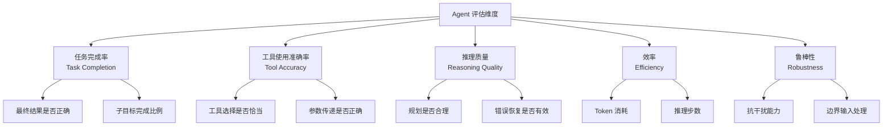
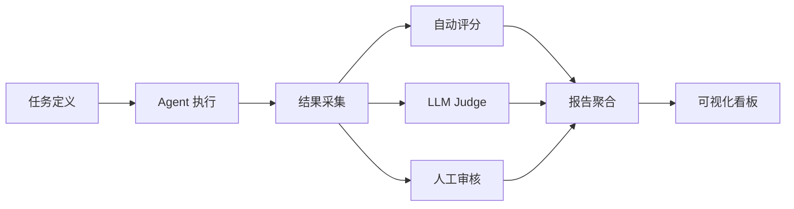
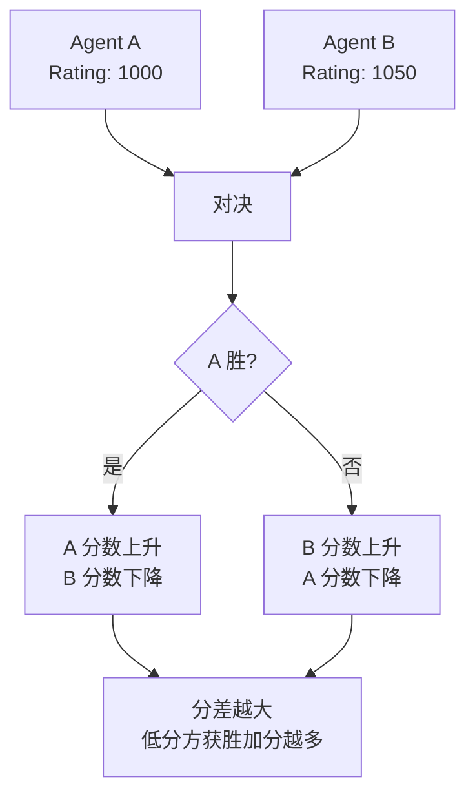
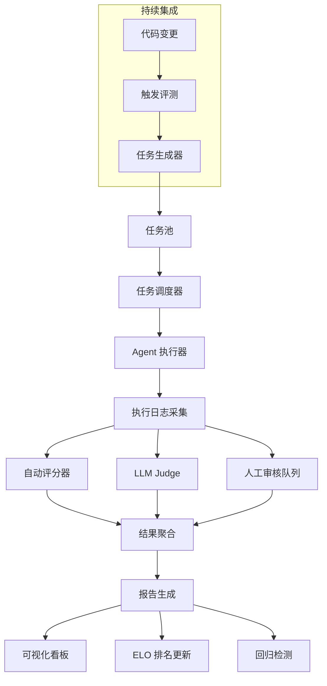

# Agent 评估与基准测试

Agent 的能力远超传统 LLM 的"文本生成"，它需要规划、调用工具、处理错误、维持多轮状态。评估 Agent 不能只看输出质量，还要看整个执行过程的可靠性和效率。本文覆盖评估维度、公开基准、自定义框架设计和自动化评测管线。

## 评估维度总览



| 维度 | 核心指标 | 评估方式 | 典型阈值 |
|------|---------|---------|---------|
| 任务完成率 | Success Rate、Partial Completion | 自动断言 + 人工判定 | > 80% |
| 工具使用准确率 | Tool Selection Precision、Arg Accuracy | 执行日志比对 | > 90% |
| 推理质量 | Plan Coherence、Self-Correction Rate | LLM-as-Judge + 人工抽样 | 中等以上 |
| 效率 | Avg Tokens、Avg Steps、Avg Latency | 运行时统计 | 因场景而异 |
| 鲁棒性 | Error Recovery Rate、Edge Case Pass Rate | 注入异常测试 | > 70% |

---

## 公开基准测试

### AgentBench

AgentBench 是首个系统性评估 LLM Agent 在多维度任务上表现的综合基准，覆盖 8 个不同环境。

| 环境 | 类型 | 评估能力 |
|------|------|---------|
| OS | 操作系统交互 | 文件操作、进程管理 |
| DB | 数据库操作 | SQL 生成与执行 |
| Web | 网页浏览 | 信息检索、表单填写 |
| KG | 知识图谱 | 多跳推理 |
| Digital Card Game | 策略博弈 | 决策与规划 |
| Lateral Thinking | 横向思维 | 创造性问题解决 |
| House Holding | 家居管理 | 长程任务执行 |
| Chess | 棋类博弈 | 策略规划 |

**特点**：覆盖面广，但部分环境与生产场景距离较远。适合做 Agent 综合能力基线。

### SWE-bench

SWE-bench 专注于软件工程场景：给定一个 GitHub Issue，Agent 需要生成修复补丁。

- **SWE-bench Lite**：300 个精选问题，适合快速评测
- **SWE-bench Verified**：经人工验证的子集，减少评估噪声
- **核心指标**：`% Resolved`（补丁通过单元测试的比例）

```bash
# 使用 SWE-bench 评测
pip install swebench

# 运行评测
python -m swebench.harness.run_evaluation \
    --predictions_path ./predictions.jsonl \
    --swe_bench_tasks_path princeton-nlp/SWE-bench_Lite \
    --log_level 1 \
    --timeout 900
```

### ToolBench

ToolBench 评估 Agent 对外部 API/工具的使用能力，包含 16000+ 真实 API。

- **训练集**：单工具指令，用于 Few-shot 示例
- **测试集**：多工具组合任务，评估工具链推理能力
- **评估指标**：Win Rate（与参考答案对比）、Pass Rate（可执行且正确）

### WebArena

WebArena 在真实网页环境中评估 Agent，包含电商、论坛、CMS 等站点。

- **环境**：真实 Web 应用（GitLab、Shopify、Reddit 等）
- **任务**：信息检索、内容管理、多步操作
- **评估**：基于最终状态的确定性判定（URL、页面内容、数据库状态）

### 基准测试对比

| 基准 | 任务数 | 环境 | 评估方式 | 适合场景 |
|------|--------|------|---------|---------|
| AgentBench | 800+ | 模拟环境 | 规则判定 | Agent 综合能力基线 |
| SWE-bench | 2294 | 真实代码仓库 | 单元测试 | 代码 Agent 评测 |
| ToolBench | 16000+ API | 真实 API | LLM Judge + 规则 | 工具调用能力 |
| WebArena | 812 | 真实 Web 应用 | 状态判定 | Web Agent 评测 |
| GAIA | 466 | 通用 | 精确匹配 | 通用推理 + 工具 |
| Mint-bench | 1000+ | 多轮对话 | 执行结果 | 多轮交互 Agent |

---

## 自定义评估框架设计

公开基准无法覆盖业务特定场景。生产环境中，需要构建自定义评估框架。

### 框架架构



### Python 实现：基于 LangGraph 的 Agent 评测框架

```python
"""Agent 评估框架核心模块"""
from __future__ import annotations

import json
import time
import statistics
from abc import ABC, abstractmethod
from dataclasses import dataclass, field
from enum import Enum
from pathlib import Path
from typing import Any, Callable

from langchain_core.messages import HumanMessage, SystemMessage
from langchain_openai import ChatOpenAI
from langgraph.graph import StateGraph, END, START
from typing_extensions import TypedDict


# ========== 数据模型 ==========

class Difficulty(str, Enum):
    EASY = "easy"
    MEDIUM = "medium"
    HARD = "hard"


@dataclass
class EvalTask:
    """单个评测任务"""
    task_id: str
    instruction: str
    difficulty: Difficulty = Difficulty.MEDIUM
    tools_available: list[str] = field(default_factory=list)
    expected_outcome: dict[str, Any] = field(default_factory=dict)
    timeout_seconds: int = 300
    metadata: dict[str, Any] = field(default_factory=dict)


@dataclass
class EvalResult:
    """单个评测结果"""
    task_id: str
    success: bool
    score: float  # 0.0 ~ 1.0
    steps_taken: int = 0
    tokens_used: int = 0
    latency_seconds: float = 0.0
    tool_calls: list[dict] = field(default_factory=list)
    error_message: str | None = None
    details: dict[str, Any] = field(default_factory=dict)


class JudgeResult(TypedDict):
    score: float
    reasoning: str
    passed: bool


# ========== 评分器 ==========

class BaseScorer(ABC):
    """评分器基类"""

    @abstractmethod
    def score(self, task: EvalTask, result: EvalResult) -> float:
        ...


class ExactMatchScorer(BaseScorer):
    """精确匹配评分"""

    def score(self, task: EvalTask, result: EvalResult) -> float:
        expected = task.expected_outcome.get("exact_match")
        if expected is None:
            return 0.0
        actual = result.details.get("final_output", "")
        return 1.0 if str(actual).strip() == str(expected).strip() else 0.0


class ContainsScorer(BaseScorer):
    """包含匹配评分"""

    def score(self, task: EvalTask, result: EvalResult) -> float:
        expected_items = task.expected_outcome.get("contains", [])
        actual = str(result.details.get("final_output", "")).lower()
        if not expected_items:
            return 0.0
        matches = sum(1 for item in expected_items if str(item).lower() in actual)
        return matches / len(expected_items)


class LLMJudgeScorer(BaseScorer):
    """LLM-as-Judge 评分"""

    JUDGE_PROMPT = """你是一个公正的评估者。根据以下标准判定 Agent 的输出质量。

## 任务指令
{instruction}

## Agent 输出
{output}

## 评分标准
{criteria}

请以 JSON 格式输出：
{{"score": 0.0-1.0, "reasoning": "评分理由", "passed": true/false}}"""

    def __init__(self, model: str = "gpt-4o"):
        self.llm = ChatOpenAI(model=model, temperature=0)

    def score(self, task: EvalTask, result: EvalResult) -> float:
        criteria = task.expected_outcome.get("criteria", "输出是否正确完成任务")
        output = result.details.get("final_output", "")

        prompt = self.JUDGE_PROMPT.format(
            instruction=task.instruction,
            output=output,
            criteria=criteria,
        )
        response = self.llm.invoke([SystemMessage(content=prompt)])

        try:
            # 尝试提取 JSON
            content = response.content
            # 处理 markdown 代码块包裹的情况
            if "```json" in content:
                content = content.split("```json")[1].split("```")[0]
            elif "```" in content:
                content = content.split("```")[1].split("```")[0]
            judge_result = json.loads(content.strip())
            return float(judge_result.get("score", 0.0))
        except (json.JSONDecodeError, ValueError):
            return 0.0


class CompositeScorer(BaseScorer):
    """组合评分器：多个评分器加权平均"""

    def __init__(self, scorers: list[tuple[BaseScorer, float]]):
        self.scorers = scorers  # [(scorer, weight), ...]

    def score(self, task: EvalTask, result: EvalResult) -> float:
        total_weight = sum(w for _, w in self.scorers)
        weighted_sum = sum(
            scorer.score(task, result) * weight
            for scorer, weight in self.scorers
        )
        return weighted_sum / total_weight if total_weight > 0 else 0.0


# ========== ELO 评分系统 ==========

class EloRatingSystem:
    """ELO 评分系统用于 Agent 对比排名"""

    def __init__(self, initial_rating: float = 1000.0, k_factor: float = 32.0):
        self.ratings: dict[str, float] = {}
        self.k_factor = k_factor
        self.initial_rating = initial_rating

    def get_rating(self, agent_id: str) -> float:
        return self.ratings.get(agent_id, self.initial_rating)

    def update(self, winner_id: str, loser_id: str, draw: bool = False):
        """更新两个 Agent 的 ELO 分数"""
        r_winner = self.get_rating(winner_id)
        r_loser = self.get_rating(loser_id)

        expected_winner = 1.0 / (1.0 + 10 ** ((r_loser - r_winner) / 400))
        expected_loser = 1.0 - expected_winner

        if draw:
            s_winner, s_loser = 0.5, 0.5
        else:
            s_winner, s_loser = 1.0, 0.0

        self.ratings[winner_id] = r_winner + self.k_factor * (s_winner - expected_winner)
        self.ratings[loser_id] = r_loser + self.k_factor * (s_loser - expected_loser)

    def get_rankings(self) -> list[tuple[str, float]]:
        """获取排名列表"""
        return sorted(self.ratings.items(), key=lambda x: x[1], reverse=True)

    def run_tournament(self, matches: list[tuple[str, str, str]]):
        """运行锦标赛：matches 为 [(winner_id, loser_id, task_id), ...]"""
        for winner_id, loser_id, _ in matches:
            self.update(winner_id, loser_id)


# ========== 自动化评测管线 ==========

class EvalState(TypedDict):
    """评测管线状态"""
    tasks: list[EvalTask]
    results: list[EvalResult]
    current_index: int
    report: dict[str, Any]


class AgentEvalPipeline:
    """自动化评测管线：任务生成 -> 执行 -> 评分 -> 报告"""

    def __init__(
        self,
        agent_executor: Callable[[EvalTask], EvalResult],
        scorer: BaseScorer | None = None,
        max_concurrent: int = 5,
    ):
        self.agent_executor = agent_executor
        self.scorer = scorer or CompositeScorer([
            (ExactMatchScorer(), 0.3),
            (ContainsScorer(), 0.3),
            (LLMJudgeScorer(), 0.4),
        ])
        self.max_concurrent = max_concurrent
        self.elo = EloRatingSystem()

    def execute_task(self, task: EvalTask) -> EvalResult:
        """执行单个评测任务"""
        start_time = time.time()
        try:
            result = self.agent_executor(task)
            result.latency_seconds = time.time() - start_time
            # 评分
            result.score = self.scorer.score(task, result)
            result.success = result.score >= 0.7
            return result
        except Exception as e:
            return EvalResult(
                task_id=task.task_id,
                success=False,
                score=0.0,
                latency_seconds=time.time() - start_time,
                error_message=str(e),
            )

    def run(self, tasks: list[EvalTask]) -> dict[str, Any]:
        """运行完整评测"""
        results: list[EvalResult] = []

        for task in tasks:
            result = self.execute_task(task)
            results.append(result)

        # 生成报告
        report = self._generate_report(tasks, results)
        return report

    def _generate_report(
        self, tasks: list[EvalTask], results: list[EvalResult]
    ) -> dict[str, Any]:
        """生成评测报告"""
        scores = [r.score for r in results]
        latencies = [r.latency_seconds for r in results]
        tokens = [r.tokens_used for r in results]
        steps = [r.steps_taken for r in results]

        # 按难度分组
        difficulty_breakdown: dict[str, list[float]] = {}
        for task, result in zip(tasks, results):
            diff = task.difficulty.value
            difficulty_breakdown.setdefault(diff, []).append(result.score)

        # 按成功/失败分类
        failures = [
            {"task_id": r.task_id, "error": r.error_message, "score": r.score}
            for r in results
            if not r.success
        ]

        return {
            "total_tasks": len(tasks),
            "success_rate": sum(1 for r in results if r.success) / len(results),
            "avg_score": statistics.mean(scores) if scores else 0.0,
            "median_score": statistics.median(scores) if scores else 0.0,
            "score_std": statistics.stdev(scores) if len(scores) > 1 else 0.0,
            "avg_latency": statistics.mean(latencies) if latencies else 0.0,
            "p95_latency": sorted(latencies)[int(len(latencies) * 0.95)] if latencies else 0.0,
            "total_tokens": sum(tokens),
            "avg_steps": statistics.mean(steps) if steps else 0.0,
            "difficulty_breakdown": {
                k: {"avg_score": statistics.mean(v), "count": len(v)}
                for k, v in difficulty_breakdown.items()
            },
            "failures": failures,
        }


# ========== LangGraph 评测工作流 ==========

def build_eval_graph() -> StateGraph:
    """构建基于 LangGraph 的评测工作流"""

    def load_tasks(state: EvalState) -> dict:
        """加载评测任务"""
        return {"current_index": 0, "results": []}

    def execute_next(state: EvalState) -> dict:
        """执行下一个任务"""
        idx = state["current_index"]
        if idx >= len(state["tasks"]):
            return {"current_index": idx}

        task = state["tasks"][idx]
        # 实际执行由外部注入
        result = EvalResult(
            task_id=task.task_id,
            success=False,
            score=0.0,
        )
        results = state["results"] + [result]
        return {"current_index": idx + 1, "results": results}

    def should_continue(state: EvalState) -> str:
        """判断是否继续执行"""
        if state["current_index"] >= len(state["tasks"]):
            return "generate_report"
        return "execute_next"

    def generate_report(state: EvalState) -> dict:
        """生成报告"""
        return {"report": {"status": "completed", "total": len(state["results"])}}

    graph = StateGraph(EvalState)
    graph.add_node("load_tasks", load_tasks)
    graph.add_node("execute_next", execute_next)
    graph.add_node("generate_report", generate_report)

    graph.add_edge(START, "load_tasks")
    graph.add_edge("load_tasks", "execute_next")
    graph.add_conditional_edges("execute_next", should_continue)
    graph.add_edge("generate_report", END)

    return graph


# ========== 使用示例 ==========

def example_usage():
    """完整使用示例"""

    # 1. 定义评测任务
    tasks = [
        EvalTask(
            task_id="task_001",
            instruction="查询北京的天气并整理为简报",
            difficulty=Difficulty.EASY,
            tools_available=["weather_api"],
            expected_outcome={"contains": ["北京", "天气"]},
        ),
        EvalTask(
            task_id="task_002",
            instruction="分析给定的 CSV 数据，生成可视化图表并写摘要",
            difficulty=Difficulty.MEDIUM,
            tools_available=["python_repl", "chart_generator"],
            expected_outcome={
                "contains": ["图表", "摘要"],
                "criteria": "是否正确分析了数据并生成了可视化",
            },
        ),
        EvalTask(
            task_id="task_003",
            instruction="重构 user_service.py 中的 authenticate 函数，修复 SQL 注入漏洞",
            difficulty=Difficulty.HARD,
            tools_available=["file_read", "file_write", "python_repl", "test_runner"],
            expected_outcome={
                "criteria": "是否修复了 SQL 注入且保持功能正确",
            },
        ),
    ]

    # 2. 定义 Agent 执行函数（实际实现由使用者提供）
    def my_agent_executor(task: EvalTask) -> EvalResult:
        # 这里替换为实际的 Agent 调用逻辑
        return EvalResult(
            task_id=task.task_id,
            success=True,
            score=0.85,
            steps_taken=5,
            tokens_used=1500,
            details={"final_output": "模拟输出"},
        )

    # 3. 运行评测
    pipeline = AgentEvalPipeline(
        agent_executor=my_agent_executor,
        scorer=CompositeScorer([
            (ContainsScorer(), 0.4),
            (LLMJudgeScorer(model="gpt-4o"), 0.6),
        ]),
    )
    report = pipeline.run(tasks)

    # 4. 输出报告
    print(json.dumps(report, indent=2, ensure_ascii=False))

    # 5. ELO 对比（多个 Agent 版本）
    elo = EloRatingSystem()
    elo.run_tournament([
        ("agent_v2", "agent_v1", "task_001"),
        ("agent_v2", "agent_v1", "task_002"),
        ("agent_v1", "agent_v2", "task_003"),
    ])
    print("\nELO Rankings:")
    for agent_id, rating in elo.get_rankings():
        print(f"  {agent_id}: {rating:.1f}")


if __name__ == "__main__":
    example_usage()
```

---

## ELO 评分系统详解

ELO 评分最初用于国际象棋排名，核心思想是通过两两对决结果动态调整排名。

### 工作原理



### 评分公式

```
E_A = 1 / (1 + 10^((R_B - R_A) / 400))
R_A_new = R_A + K * (S_A - E_A)
```

- `E_A`：Agent A 的预期胜率
- `R_A`：Agent A 当前 ELO 分数
- `K`：调整系数（默认 32，数值越大波动越大）
- `S_A`：实际结果（胜=1，平=0.5，负=0）

### 锦标赛设计

```python
def run_full_tournament(
    agents: dict[str, Callable],
    tasks: list[EvalTask],
    elo: EloRatingSystem,
) -> dict[str, float]:
    """全量锦标赛：每对 Agent 在每个任务上对决"""
    agent_ids = list(agents.keys())
    matches = []

    for task in tasks:
        # 每个任务独立评分
        task_scores: dict[str, float] = {}
        for aid in agent_ids:
            result = agents[aid](task)
            task_scores[aid] = result.score

        # 两两比较
        for i in range(len(agent_ids)):
            for j in range(i + 1, len(agent_ids)):
                a, b = agent_ids[i], agent_ids[j]
                if task_scores[a] > task_scores[b]:
                    matches.append((a, b, task.task_id))
                elif task_scores[b] > task_scores[a]:
                    matches.append((b, a, task.task_id))
                # 平局不更新 ELO（或可使用 draw=True）

    elo.run_tournament(matches)
    return dict(elo.get_rankings())
```

---

## 自动化评测管线

### 完整架构



### CI 集成

```yaml
# .github/workflows/agent-eval.yml
name: Agent Evaluation

on:
  pull_request:
    paths:
      - 'src/agent/**'
  schedule:
    - cron: '0 2 * * *'  # 每日凌晨运行

jobs:
  evaluate:
    runs-on: ubuntu-latest
    steps:
      - uses: actions/checkout@v4

      - name: Setup Python
        uses: actions/setup-python@v5
        with:
          python-version: '3.11'

      - name: Install dependencies
        run: pip install -r requirements-eval.txt

      - name: Run Agent Evaluation
        env:
          OPENAI_API_KEY: ${{ secrets.OPENAI_API_KEY }}
        run: |
          python -m eval.run \
            --config eval/configs/production.yaml \
            --output eval/results/latest.json \
            --fail-threshold 0.75

      - name: Upload Results
        uses: actions/upload-artifact@v4
        with:
          name: eval-results
          path: eval/results/

      - name: Comment PR with Results
        if: github.event_name == 'pull_request'
        run: |
          python -m eval.report \
            --input eval/results/latest.json \
            --format github-comment > comment.md
          gh pr comment ${{ github.event.pull_request.number }} --body-file comment.md
```

---

## 评估结果可视化与持续跟踪

### 关键指标看板

| 指标类别 | 具体指标 | 展示方式 | 告警阈值 |
|---------|---------|---------|---------|
| 整体质量 | Success Rate | 折线图（趋势） | 低于基线 5% |
| 效率 | Avg Tokens / Task | 柱状图 | 超基线 20% |
| 稳定性 | Score Std Dev | 折线图 | > 0.15 |
| 回归 | 新增 Failure 数 | 列表 + 高亮 | > 0 |
| ELO | 排名变化 | 排行榜 | 排名下降 |

### 报告模板

```python
def generate_markdown_report(report: dict[str, Any]) -> str:
    """生成 Markdown 格式的评测报告"""
    lines = [
        "# Agent 评测报告",
        "",
        f"- **总任务数**: {report['total_tasks']}",
        f"- **成功率**: {report['success_rate']:.1%}",
        f"- **平均得分**: {report['avg_score']:.3f}",
        f"- **得分标准差**: {report['score_std']:.3f}",
        f"- **平均延迟**: {report['avg_latency']:.1f}s",
        f"- **P95 延迟**: {report['p95_latency']:.1f}s",
        f"- **总 Token 消耗**: {report['total_tokens']:,}",
        "",
        "## 难度分布",
        "",
        "| 难度 | 任务数 | 平均得分 |",
        "|------|--------|---------|",
    ]

    for diff, data in report.get("difficulty_breakdown", {}).items():
        lines.append(f"| {diff} | {data['count']} | {data['avg_score']:.3f} |")

    if report.get("failures"):
        lines.extend([
            "",
            "## 失败任务",
            "",
            "| 任务 ID | 错误信息 | 得分 |",
            "|---------|---------|------|",
        ])
        for f in report["failures"]:
            lines.append(f"| {f['task_id']} | {f['error'] or '-'} | {f['score']:.3f} |")

    return "\n".join(lines)
```

### 持续跟踪策略

1. **基线锁定**：每个版本发布时锁定基线得分，后续变更以基线为参照
2. **回归检测**：任何任务从通过变为失败时自动告警
3. **趋势分析**：按周/月追踪核心指标趋势，识别退化
4. **A/B 对比**：新版本与当前版本并行评测，ELO 对比后再决策是否上线

---

## 实践建议

1. **先定义指标，再写 Agent**：明确"成功"的标准，避免事后调整
2. **组合评分**：自动评分覆盖 80% 用例，LLM Judge 处理开放性任务，人工抽样校准
3. **渐进式难度**：从简单任务验证基础能力，再逐步增加复杂度
4. **隔离环境**：评测在沙箱环境中执行，避免 Agent 操作影响真实系统
5. **结果可复现**：固定随机种子、记录完整执行日志、版本化评测任务
6. **定期校准**：每季度校准 LLM Judge 的准确性，防止评分漂移
