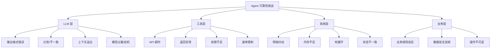
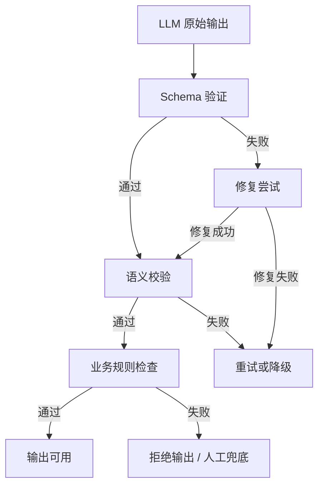
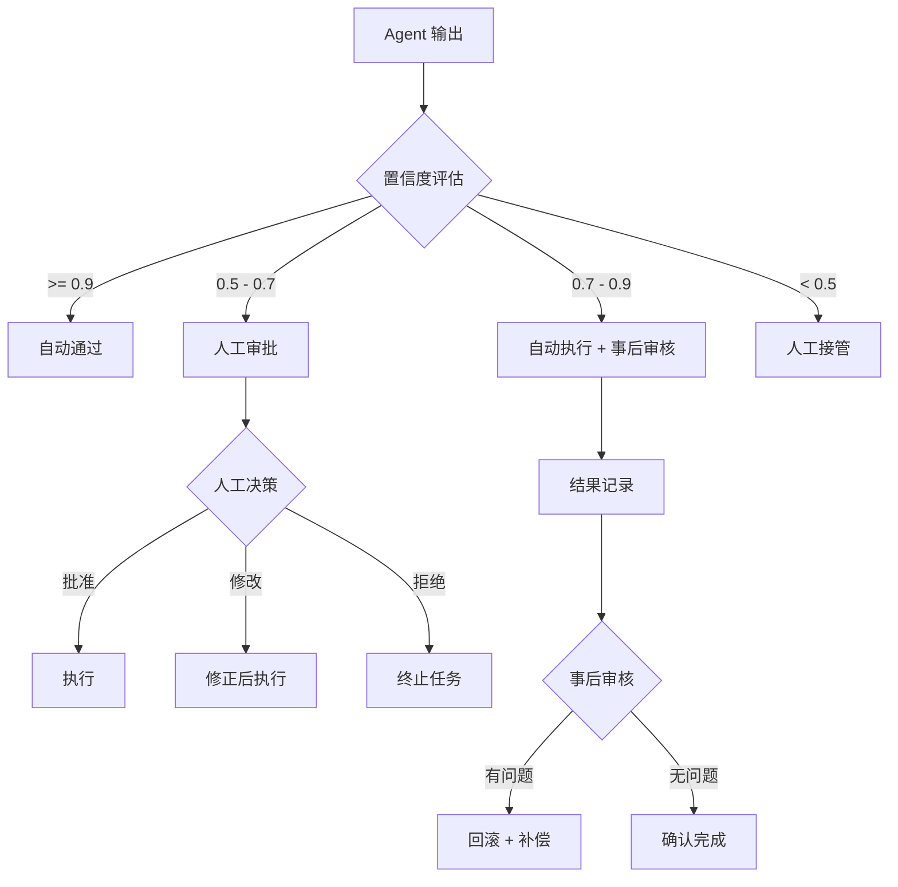
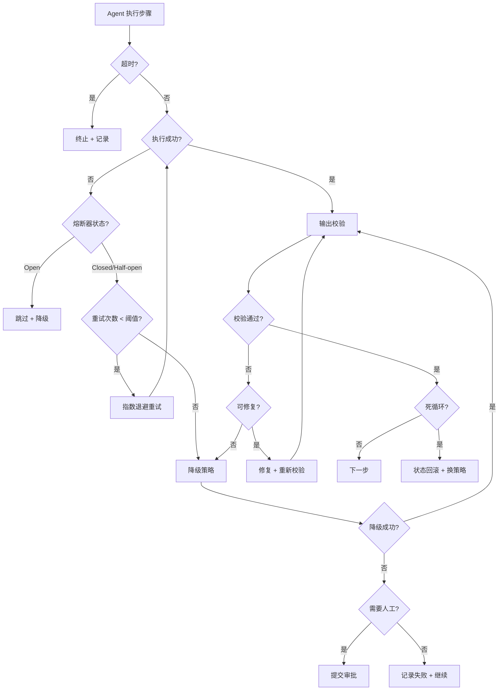

# Agent 可靠性设计

Agent 在生产环境中运行时，面临 LLM 输出不稳定、工具调用失败、网络异常、上下文溢出等各种问题。可靠性设计的目标是让 Agent 在异常发生时仍能完成任务或优雅降级，而非直接崩溃。本文覆盖重试降级、输出校验、人工兜底、异常自恢复和生产级容错模式。

## 可靠性挑战总览



---

## 1. 重试与降级策略

### 指数退避重试

LLM 调用和工具调用都可能因瞬时故障失败，指数退避是最基本的重试策略。

```python
"""重试与降级策略实现"""
from __future__ import annotations

import asyncio
import functools
import logging
import random
import time
from dataclasses import dataclass, field
from enum import Enum
from typing import Any, Callable, TypeVar

logger = logging.getLogger(__name__)
T = TypeVar("T")


class RetryExhausted(Exception):
    """重试次数耗尽"""
    pass


@dataclass
class RetryConfig:
    """重试配置"""
    max_retries: int = 3
    base_delay: float = 1.0  # 秒
    max_delay: float = 60.0
    exponential_base: float = 2.0
    jitter: bool = True  # 加入随机抖动，避免惊群
    retryable_exceptions: tuple[type[Exception], ...] = (
        ConnectionError,
        TimeoutError,
    )


def calculate_delay(attempt: int, config: RetryConfig) -> float:
    """计算第 N 次重试的延迟时间"""
    delay = min(
        config.base_delay * (config.exponential_base ** attempt),
        config.max_delay,
    )
    if config.jitter:
        delay = delay * (0.5 + random.random())
    return delay


def with_retry(config: RetryConfig | None = None):
    """指数退避重试装饰器"""
    if config is None:
        config = RetryConfig()

    def decorator(func: Callable[..., T]) -> Callable[..., T]:
        @functools.wraps(func)
        def wrapper(*args, **kwargs) -> T:
            last_exception = None
            for attempt in range(config.max_retries + 1):
                try:
                    return func(*args, **kwargs)
                except config.retryable_exceptions as e:
                    last_exception = e
                    if attempt < config.max_retries:
                        delay = calculate_delay(attempt, config)
                        logger.warning(
                            f"第 {attempt + 1} 次重试 {func.__name__}，"
                            f"原因: {e}，等待 {delay:.1f}s"
                        )
                        time.sleep(delay)
                    else:
                        logger.error(
                            f"{func.__name__} 重试 {config.max_retries} 次后仍失败"
                        )
            raise RetryExhausted(
                f"重试耗尽: {last_exception}"
            ) from last_exception

        @functools.wraps(func)
        async def async_wrapper(*args, **kwargs) -> T:
            last_exception = None
            for attempt in range(config.max_retries + 1):
                try:
                    return await func(*args, **kwargs)
                except config.retryable_exceptions as e:
                    last_exception = e
                    if attempt < config.max_retries:
                        delay = calculate_delay(attempt, config)
                        logger.warning(
                            f"第 {attempt + 1} 次重试 {func.__name__}，"
                            f"原因: {e}，等待 {delay:.1f}s"
                        )
                        await asyncio.sleep(delay)
            raise RetryExhausted(
                f"重试耗尽: {last_exception}"
            ) from last_exception

        import inspect
        if inspect.iscoroutinefunction(func):
            return async_wrapper
        return wrapper

    return decorator
```

### 降级策略

当主路径失败时，按优先级依次尝试降级路径。

```python
@dataclass
class FallbackConfig:
    """降级配置"""
    strategies: list[dict[str, Any]] = field(default_factory=list)
    # 例：
    # [
    #   {"name": "primary", "model": "gpt-4o", "temperature": 0},
    #   {"name": "fallback_1", "model": "gpt-4o-mini", "temperature": 0},
    #   {"name": "fallback_2", "model": "claude-3-haiku", "temperature": 0},
    #   {"name": "simplified", "model": "gpt-4o-mini", "prompt": "simplified_task"},
    # ]


class FallbackExecutor:
    """降级执行器"""

    def __init__(self, config: FallbackConfig):
        self.config = config

    def execute(self, func_factory: Callable[[dict], Callable]) -> Any:
        """
        按降级策略依次执行。
        func_factory: 接收策略配置，返回可执行函数
        """
        last_error = None
        for strategy in self.config.strategies:
            try:
                executor = func_factory(strategy)
                result = executor()
                logger.info(f"降级策略 '{strategy['name']}' 执行成功")
                return result
            except Exception as e:
                last_error = e
                logger.warning(
                    f"降级策略 '{strategy['name']}' 失败: {e}"
                )
                continue

        raise RetryExhausted(f"所有降级策略均失败: {last_error}")


# 使用示例
def create_llm_call(strategy: dict) -> Callable:
    from langchain_openai import ChatOpenAI

    llm = ChatOpenAI(model=strategy["model"], temperature=0)
    if strategy.get("prompt") == "simplified_task":
        return lambda: llm.invoke("请用简短方式回答")
    return lambda: llm.invoke("请详细回答")

fallback = FallbackExecutor(FallbackConfig(strategies=[
    {"name": "primary", "model": "gpt-4o"},
    {"name": "fallback_1", "model": "gpt-4o-mini"},
    {"name": "simplified", "model": "gpt-4o-mini", "prompt": "simplified_task"},
]))
result = fallback.execute(create_llm_call)
```

---

## 2. 输出校验器

LLM 的输出不可控，必须在进入下一步前进行校验。

### 校验层级



### 实现

```python
"""输出校验器"""
from __future__ import annotations

import json
import re
from abc import ABC, abstractmethod
from dataclasses import dataclass
from typing import Any

from pydantic import BaseModel, ValidationError


class ValidationResult:
    """校验结果"""
    def __init__(self, valid: bool, errors: list[str] | None = None, fixed_output: Any = None):
        self.valid = valid
        self.errors = errors or []
        self.fixed_output = fixed_output


class BaseValidator(ABC):
    """校验器基类"""

    @abstractmethod
    def validate(self, output: str) -> ValidationResult:
        ...


class SchemaValidator(BaseValidator):
    """Schema 验证：确保输出符合预期结构"""

    def __init__(self, schema: type[BaseModel], extract_json: bool = True):
        self.schema = schema
        self.extract_json = extract_json

    def validate(self, output: str) -> ValidationResult:
        data = output
        if self.extract_json:
            data = self._extract_json(output)
            if data is None:
                return ValidationResult(False, ["无法从输出中提取 JSON"])

        try:
            parsed = self.schema.model_validate(data)
            return ValidationResult(True, fixed_output=parsed)
        except ValidationError as e:
            return ValidationResult(False, [str(e)])

    @staticmethod
    def _extract_json(text: str) -> dict | list | None:
        """从文本中提取 JSON"""
        # 尝试直接解析
        try:
            return json.loads(text)
        except json.JSONDecodeError:
            pass

        # 尝试从 markdown 代码块提取
        patterns = [
            r"```json\s*\n(.*?)\n```",
            r"```\s*\n(.*?)\n```",
        ]
        for pattern in patterns:
            match = re.search(pattern, text, re.DOTALL)
            if match:
                try:
                    return json.loads(match.group(1))
                except json.JSONDecodeError:
                    continue

        # 尝试找最外层的 { } 或 [ ]
        for start_char, end_char in [("{", "}"), ("[", "]")]:
            start = text.find(start_char)
            end = text.rfind(end_char)
            if start != -1 and end > start:
                try:
                    return json.loads(text[start:end + 1])
                except json.JSONDecodeError:
                    continue

        return None


class SemanticValidator(BaseValidator):
    """语义校验：检查输出内容的合理性"""

    def __init__(self, checks: list[Callable[[str], tuple[bool, str]]]):
        self.checks = checks  # [(check_func, error_msg), ...]

    def validate(self, output: str) -> ValidationResult:
        errors = []
        for check, error_msg in self.checks:
            if not check(output):
                errors.append(error_msg)
        return ValidationResult(len(errors) == 0, errors)


class BusinessRuleValidator(BaseValidator):
    """业务规则校验"""

    def __init__(self, rules: list[dict[str, Any]]):
        self.rules = rules

    def validate(self, output: str) -> ValidationResult:
        errors = []
        for rule in self.rules:
            rule_type = rule["type"]
            if rule_type == "no_sensitive_info":
                sensitive_patterns = rule.get("patterns", [])
                for pattern in sensitive_patterns:
                    if re.search(pattern, output):
                        errors.append(f"输出包含敏感信息: {pattern}")
            elif rule_type == "max_length":
                max_len = rule.get("value", 10000)
                if len(output) > max_len:
                    errors.append(f"输出超过最大长度 {max_len}")
            elif rule_type == "must_contain":
                required = rule.get("keywords", [])
                for kw in required:
                    if kw not in output:
                        errors.append(f"输出缺少必要内容: {kw}")
        return ValidationResult(len(errors) == 0, errors)


class CompositeValidator(BaseValidator):
    """组合校验器"""

    def __init__(self, validators: list[BaseValidator]):
        self.validators = validators

    def validate(self, output: str) -> ValidationResult:
        all_errors = []
        fixed = output
        for validator in self.validators:
            result = validator.validate(fixed)
            if not result.valid:
                all_errors.extend(result.errors)
            if result.fixed_output is not None:
                fixed = result.fixed_output
        return ValidationResult(
            len(all_errors) == 0,
            all_errors,
            fixed_output=fixed if all_errors else None,
        )
```

---

## 3. 人工兜底机制

当 Agent 置信度不足或任务风险较高时，应将控制权移交人工。

### 置信度评估与审批流程



### 实现

```python
"""人工兜底机制"""
from __future__ import annotations

import uuid
from dataclasses import dataclass, field
from datetime import datetime
from enum import Enum
from typing import Any, Callable


class ApprovalStatus(str, Enum):
    PENDING = "pending"
    APPROVED = "approved"
    REJECTED = "rejected"
    MODIFIED = "modified"


class RiskLevel(str, Enum):
    LOW = "low"
    MEDIUM = "medium"
    HIGH = "high"
    CRITICAL = "critical"


@dataclass
class ApprovalRequest:
    """审批请求"""
    request_id: str = field(default_factory=lambda: str(uuid.uuid4())[:8])
    task_id: str = ""
    agent_output: Any = None
    confidence: float = 0.0
    risk_level: RiskLevel = RiskLevel.MEDIUM
    reason: str = ""
    created_at: datetime = field(default_factory=datetime.now)
    status: ApprovalStatus = ApprovalStatus.PENDING
    reviewer: str | None = None
    review_comment: str | None = None
    modified_output: Any = None


class HumanInTheLoop:
    """人工兜底管理器"""

    def __init__(
        self,
        confidence_thresholds: dict[RiskLevel, float] | None = None,
        notify_callback: Callable[[ApprovalRequest], None] | None = None,
    ):
        self.thresholds = confidence_thresholds or {
            RiskLevel.LOW: 0.5,
            RiskLevel.MEDIUM: 0.7,
            RiskLevel.HIGH: 0.85,
            RiskLevel.CRITICAL: 1.0,  # 关键操作必须人工审批
        }
        self.notify_callback = notify_callback
        self.pending_requests: dict[str, ApprovalRequest] = {}

    def assess_confidence(
        self, output: Any, risk_level: RiskLevel
    ) -> tuple[float, str]:
        """评估置信度（简化版，实际可使用 LLM 或规则引擎）"""
        # 基于输出特征的启发式评估
        confidence = 0.5
        reasons = []

        if isinstance(output, str) and len(output) > 0:
            confidence += 0.1
        if isinstance(output, dict) and "error" not in output:
            confidence += 0.2
        if isinstance(output, dict) and output.get("verified", False):
            confidence += 0.2

        confidence = min(confidence, 1.0)
        return confidence, "; ".join(reasons) if reasons else "默认评估"

    def should_require_approval(
        self, confidence: float, risk_level: RiskLevel
    ) -> bool:
        """判断是否需要人工审批"""
        threshold = self.thresholds[risk_level]
        return confidence < threshold

    def request_approval(
        self,
        task_id: str,
        output: Any,
        confidence: float,
        risk_level: RiskLevel,
        reason: str = "",
    ) -> ApprovalRequest:
        """提交审批请求"""
        request = ApprovalRequest(
            task_id=task_id,
            agent_output=output,
            confidence=confidence,
            risk_level=risk_level,
            reason=reason,
        )

        if self.should_require_approval(confidence, risk_level):
            request.status = ApprovalStatus.PENDING
            self.pending_requests[request.request_id] = request
            if self.notify_callback:
                self.notify_callback(request)
        else:
            request.status = ApprovalStatus.APPROVED

        return request

    def process_approval(
        self,
        request_id: str,
        approved: bool,
        reviewer: str,
        comment: str = "",
        modified_output: Any = None,
    ) -> ApprovalRequest:
        """处理审批结果"""
        request = self.pending_requests.get(request_id)
        if not request:
            raise ValueError(f"审批请求不存在: {request_id}")

        request.reviewer = reviewer
        request.review_comment = comment
        request.modified_output = modified_output

        if approved and modified_output is not None:
            request.status = ApprovalStatus.MODIFIED
        elif approved:
            request.status = ApprovalStatus.APPROVED
        else:
            request.status = ApprovalStatus.REJECTED

        del self.pending_requests[request_id]
        return request
```

---

## 4. 异常检测与自恢复

### 死循环检测

Agent 可能在错误重试中陷入死循环：调用同一工具、生成相同错误。

```python
"""异常检测与自恢复"""
from __future__ import annotations

import hashlib
import time
from collections import defaultdict
from dataclasses import dataclass, field
from typing import Any


@dataclass
class LoopDetectionConfig:
    """死循环检测配置"""
    max_same_tool_calls: int = 3  # 连续调用同一工具的最大次数
    max_same_output_hash: int = 2  # 相同输出哈希的最大次数
    max_total_steps: int = 50  # 单次任务最大步数
    window_size: int = 5  # 滑动窗口大小


class LoopDetector:
    """死循环检测器"""

    def __init__(self, config: LoopDetectionConfig | None = None):
        self.config = config or LoopDetectionConfig()
        self.tool_call_history: list[str] = []
        self.output_hashes: list[str] = []
        self.step_count: int = 0

    def check_tool_loop(self, tool_name: str) -> bool:
        """检测工具调用循环"""
        self.tool_call_history.append(tool_name)
        if len(self.tool_call_history) < self.config.max_same_tool_calls:
            return False
        recent = self.tool_call_history[-self.config.max_same_tool_calls:]
        return len(set(recent)) == 1

    def check_output_loop(self, output: str) -> bool:
        """检测输出循环"""
        output_hash = hashlib.md5(output.encode()).hexdigest()
        self.output_hashes.append(output_hash)
        if len(self.output_hashes) < self.config.max_same_output_hash:
            return False
        recent = self.output_hashes[-self.config.max_same_output_hash:]
        return len(set(recent)) == 1

    def check_step_limit(self) -> bool:
        """检测步数是否超限"""
        self.step_count += 1
        return self.step_count > self.config.max_total_steps

    def reset(self):
        """重置检测状态"""
        self.tool_call_history.clear()
        self.output_hashes.clear()
        self.step_count = 0


@dataclass
class CircuitBreakerState:
    """熔断器状态"""
    failure_count: int = 0
    last_failure_time: float = 0.0
    state: str = "closed"  # closed / open / half_open
    success_count_in_half_open: int = 0


class CircuitBreaker:
    """熔断器：当失败率超过阈值时暂停调用"""

    def __init__(
        self,
        failure_threshold: int = 5,
        recovery_timeout: float = 60.0,
        half_open_max_calls: int = 3,
    ):
        self.failure_threshold = failure_threshold
        self.recovery_timeout = recovery_timeout
        self.half_open_max_calls = half_open_max_calls
        self.state = CircuitBreakerState()

    def can_execute(self) -> bool:
        """判断是否可以执行"""
        if self.state.state == "closed":
            return True
        if self.state.state == "open":
            if time.time() - self.state.last_failure_time > self.recovery_timeout:
                self.state.state = "half_open"
                self.state.success_count_in_half_open = 0
                return True
            return False
        if self.state.state == "half_open":
            return self.state.success_count_in_half_open < self.half_open_max_calls
        return False

    def record_success(self):
        """记录成功"""
        if self.state.state == "half_open":
            self.state.success_count_in_half_open += 1
            if self.state.success_count_in_half_open >= self.half_open_max_calls:
                self.state.state = "closed"
                self.state.failure_count = 0

    def record_failure(self):
        """记录失败"""
        self.state.failure_count += 1
        self.state.last_failure_time = time.time()
        if self.state.state == "half_open":
            self.state.state = "open"
        elif self.state.failure_count >= self.failure_threshold:
            self.state.state = "open"


class StateRollbackManager:
    """状态回滚管理器"""

    def __init__(self, max_snapshots: int = 10):
        self.max_snapshots = max_snapshots
        self.snapshots: list[tuple[int, dict]] = []  # [(step, state)]

    def save_snapshot(self, step: int, state: dict):
        """保存状态快照"""
        self.snapshots.append((step, state.copy()))
        if len(self.snapshots) > self.max_snapshots:
            self.snapshots.pop(0)

    def rollback(self, steps_back: int = 1) -> dict | None:
        """回滚到 N 步前的状态"""
        if len(self.snapshots) < steps_back:
            return None
        _, state = self.snapshots[-steps_back]
        # 移除回滚点之后的快照
        self.snapshots = self.snapshots[:-steps_back]
        return state
```

---

## 5. 生产级容错模式

### 容错策略对比

| 模式 | 作用 | 适用场景 | 实现复杂度 |
|------|------|---------|-----------|
| Timeout | 防止操作无限等待 | 所有外部调用 | 低 |
| Retry + Backoff | 应对瞬时故障 | 网络/API 调用 | 低 |
| Circuit Breaker | 防止级联故障 | 下游服务不稳定 | 中 |
| Bulkhead | 隔离故障域 | 多类资源并行 | 中 |
| Fallback | 降级保底 | 主路径不可用 | 中 |
| State Rollback | 恢复一致状态 | 长程任务出错 | 高 |

### 可靠性决策流程



### LangGraph 可靠性中间件

```python
"""LangGraph 可靠性中间件"""
from __future__ import annotations

import logging
from typing import Any, Callable

from langgraph.graph import StateGraph, END, START
from typing_extensions import TypedDict

logger = logging.getLogger(__name__)


class AgentState(TypedDict, total=False):
    messages: list[dict]
    current_step: str
    step_count: int
    tool_history: list[dict]
    errors: list[str]
    confidence: float
    needs_approval: bool
    rollback_state: dict | None


class ReliableAgentMiddleware:
    """LangGraph 可靠性中间件"""

    def __init__(
        self,
        loop_config: LoopDetectionConfig | None = None,
        circuit_breaker: CircuitBreaker | None = None,
        validator: CompositeValidator | None = None,
        hitl: HumanInTheLoop | None = None,
    ):
        self.loop_detector = LoopDetector(loop_config)
        self.circuit_breaker = circuit_breaker or CircuitBreaker()
        self.validator = validator
        self.hitl = hitl
        self.rollback_manager = StateRollbackManager()

    def wrap_node(
        self, node_func: Callable, node_name: str
    ) -> Callable:
        """包装 LangGraph 节点，注入可靠性逻辑"""

        def wrapped(state: AgentState) -> dict:
            # 1. 步数检查
            step_count = state.get("step_count", 0) + 1
            if self.loop_detector.check_step_limit():
                logger.error(f"步骤数超限: {step_count}")
                return {
                    "errors": state.get("errors", [])
                    + [f"步骤数超限: {step_count}"],
                    "current_step": "error",
                }

            # 2. 熔断检查
            if not self.circuit_breaker.can_execute():
                logger.warning(f"熔断器开启，跳过 {node_name}")
                return {
                    "errors": state.get("errors", [])
                    + [f"熔断器开启，{node_name} 被跳过"],
                    "current_step": "fallback",
                }

            # 3. 保存状态快照
            self.rollback_manager.save_snapshot(step_count, dict(state))

            # 4. 执行原始节点
            try:
                result = node_func(state)
                self.circuit_breaker.record_success()

                # 5. 输出校验
                if self.validator and isinstance(result, dict):
                    output = result.get("output", "")
                    if output:
                        validation = self.validator.validate(str(output))
                        if not validation.valid:
                            logger.warning(
                                f"输出校验失败: {validation.errors}"
                            )
                            result["errors"] = result.get("errors", []) + validation.errors

                # 6. 死循环检测
                if isinstance(result, dict):
                    tool_name = result.get("tool_used", "")
                    if tool_name and self.loop_detector.check_tool_loop(tool_name):
                        logger.warning(f"检测到工具循环: {tool_name}")
                        # 回滚一步
                        prev_state = self.rollback_manager.rollback(1)
                        if prev_state:
                            result["rollback_state"] = prev_state

                result["step_count"] = step_count
                return result

            except Exception as e:
                self.circuit_breaker.record_failure()
                logger.error(f"节点 {node_name} 执行失败: {e}")

                # 7. 人工兜底
                if self.hitl:
                    request = self.hitl.request_approval(
                        task_id=state.get("task_id", "unknown"),
                        output=None,
                        confidence=0.0,
                        risk_level=RiskLevel.HIGH,
                        reason=f"节点执行异常: {e}",
                    )
                    if request.status == ApprovalStatus.PENDING:
                        return {
                            "errors": state.get("errors", []) + [str(e)],
                            "needs_approval": True,
                            "current_step": "pending_approval",
                        }

                return {
                    "errors": state.get("errors", []) + [str(e)],
                    "current_step": "error",
                }

        return wrapped


def build_reliable_agent(
    middleware: ReliableAgentMiddleware,
    nodes: dict[str, Callable],
    edges: list[tuple[str, str]],
    conditional_edges: dict[str, Callable] | None = None,
) -> StateGraph:
    """构建带可靠性中间件的 Agent"""

    graph = StateGraph(AgentState)

    # 包装所有节点
    for name, func in nodes.items():
        wrapped = middleware.wrap_node(func, name)
        graph.add_node(name, wrapped)

    # 添加边
    for src, dst in edges:
        graph.add_edge(src, dst)

    # 添加条件边
    if conditional_edges:
        for src, condition_func in conditional_edges.items():
            graph.add_conditional_edges(src, condition_func)

    return graph
```

---

## 6. 监控与告警集成

### 关键监控指标

| 指标 | 采集方式 | 告警条件 | 严重级别 |
|------|---------|---------|---------|
| Task Success Rate | 运行时统计 | < 80%（5min 窗口） | P1 |
| Avg Steps per Task | 运行时统计 | > 基线 50% | P2 |
| LLM Error Rate | API 日志 | > 10%（5min 窗口） | P1 |
| Tool Failure Rate | 执行日志 | > 5%（5min 窗口） | P2 |
| Circuit Breaker Opens | 熔断器事件 | 任何触发 | P2 |
| Loop Detections | 循环检测器 | > 0 | P3 |
| Approval Queue Size | 队列监控 | > 10 积压 | P2 |
| Avg Latency P95 | 运行时统计 | > SLA 阈值 | P2 |
| Token Cost per Task | Token 统计 | > 预算 120% | P3 |

### Prometheus 集成

```python
"""Prometheus 监控集成"""
from prometheus_client import Counter, Histogram, Gauge

# 指标定义
AGENT_TASKS_TOTAL = Counter(
    "agent_tasks_total",
    "Total agent tasks",
    ["status"],  # success / failure / timeout
)

AGENT_STEPS = Histogram(
    "agent_steps_per_task",
    "Steps per task",
    buckets=[1, 3, 5, 10, 20, 50],
)

AGENT_LATENCY = Histogram(
    "agent_task_latency_seconds",
    "Task latency in seconds",
    buckets=[1, 5, 10, 30, 60, 120, 300],
)

AGENT_TOOL_CALLS = Counter(
    "agent_tool_calls_total",
    "Total tool calls",
    ["tool_name", "status"],
)

AGENT_TOKENS = Counter(
    "agent_tokens_total",
    "Total tokens consumed",
    ["model", "type"],  # type: input / output
)

CIRCUIT_BREAKER_STATE = Gauge(
    "agent_circuit_breaker_state",
    "Circuit breaker state (0=closed, 1=open, 2=half_open)",
    ["service"],
)

APPROVAL_QUEUE_SIZE = Gauge(
    "agent_approval_queue_size",
    "Pending approval requests",
)


def record_task_result(success: bool, steps: int, latency: float):
    """记录任务结果"""
    status = "success" if success else "failure"
    AGENT_TASKS_TOTAL.labels(status=status).inc()
    AGENT_STEPS.observe(steps)
    AGENT_LATENCY.observe(latency)


def record_tool_call(tool_name: str, success: bool):
    """记录工具调用"""
    status = "success" if success else "failure"
    AGENT_TOOL_CALLS.labels(tool_name=tool_name, status=status).inc()
```

---

## 实践建议

1. **防御性编程**：每个外部调用都加超时和重试，不信任任何下游
2. **渐进式降级**：优先保证核心功能，非核心功能可静默失败
3. **可观测性优先**：上线前先部署监控，出问题时能看到全貌
4. **人工兜底不是失败**：高价值/高风险场景下，人工介入是正确的设计选择
5. **状态可回滚**：长程任务必须保存快照，出错时能回退到最近的一致状态
6. **熔断比重试更安全**：当下游持续故障时，快速失败比反复重试更合理
7. **区分可恢复与不可恢复错误**：格式错误可修复，业务逻辑错误应直接失败
