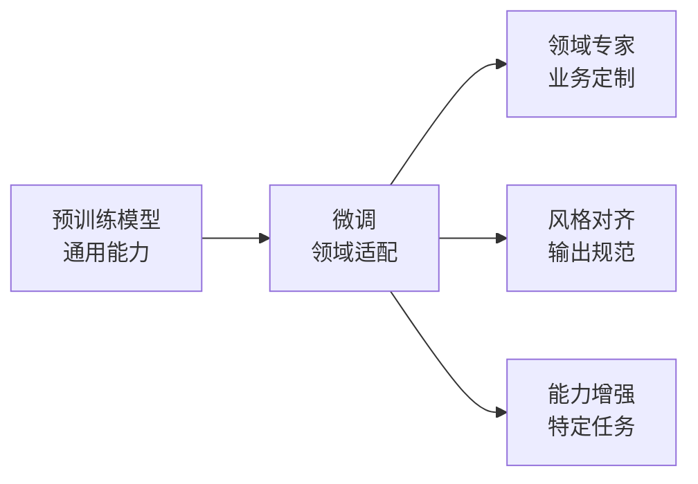
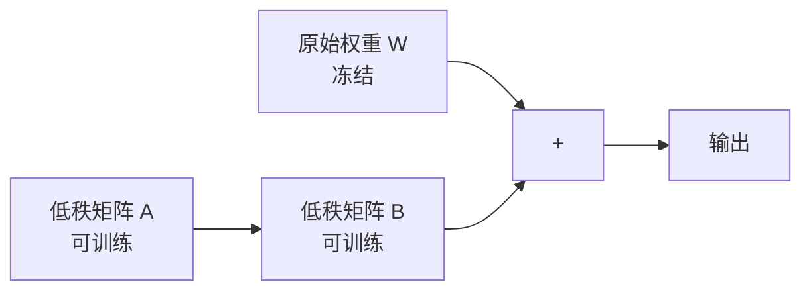
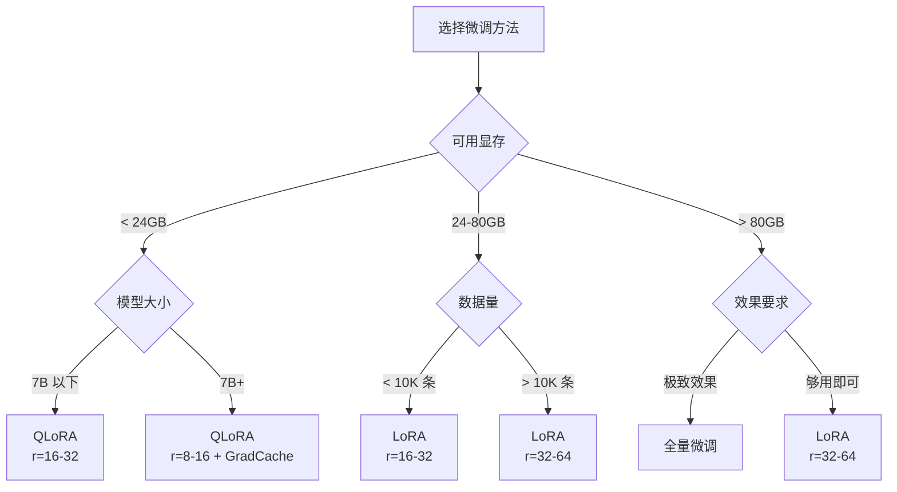

# 微调技术选型：LoRA / QLoRA / 全量微调

## 为什么需要微调

预训练模型具备通用能力，但在特定场景下表现有限。微调的核心目标是让模型在目标领域上更准确、更稳定、更符合业务需求。



**微调解决的问题**：

| 问题 | 示例 | 微调效果 |
|------|------|----------|
| 领域知识不足 | 医疗模型不理解专业术语 | 注入领域知识 |
| 输出格式不规范 | 生成内容格式混乱 | 统一输出格式 |
| 风格不对齐 | 客服回复语气生硬 | 对齐业务风格 |
| 任务特定优化 | 通用模型做代码审查不够精准 | 强化特定能力 |

## 三种微调方法对比

### 全量微调（Full Fine-tuning）

全量微调更新模型的所有参数，是最直接的微调方式。

```python
from transformers import AutoModelForCausalLM, AutoTokenizer, TrainingArguments, Trainer

model = AutoModelForCausalLM.from_pretrained(
    "Qwen/Qwen2.5-7B",
    torch_dtype=torch.bfloat16,
    device_map="auto"
)

# 全量微调：所有参数都可训练
# 7B 模型约 70 亿参数，全部需要梯度更新
total_params = sum(p.numel() for p in model.parameters())
trainable_params = sum(p.numel() for p in model.parameters() if p.requires_grad)
print(f"总参数: {total_params / 1e9:.2f}B")
print(f"可训练参数: {trainable_params / 1e9:.2f}B")
# 输出: 总参数: 7.00B, 可训练参数: 7.00B
```

**优点**：效果最好，模型能充分学习领域知识
**缺点**：显存需求极大（7B 模型约需 120GB+ 显存），训练成本高，容易过拟合

### LoRA（Low-Rank Adaptation）

LoRA 在模型权重矩阵旁旁路一个低秩分解矩阵，只训练这个小矩阵。



```python
from peft import LoraConfig, get_peft_model, TaskType

lora_config = LoraConfig(
    task_type=TaskType.CAUSAL_LM,
    r=16,               # 秩，控制 LoRA 矩阵大小
    lora_alpha=32,      # 缩放系数，通常为 2 * r
    lora_dropout=0.05,
    target_modules=["q_proj", "k_proj", "v_proj", "o_proj",
                    "gate_proj", "up_proj", "down_proj"],
    bias="none"
)

model = AutoModelForCausalLM.from_pretrained(
    "Qwen/Qwen2.5-7B",
    torch_dtype=torch.bfloat16,
    device_map="auto"
)

model = get_peft_model(model, lora_config)
model.print_trainable_parameters()
# 输出: trainable params: 39,976,960 || all params: 7,073,697,792 || trainable%: 0.565%
```

**核心参数解析**：

| 参数 | 说明 | 推荐值 |
|------|------|--------|
| r | 低秩矩阵的秩，越大表达能力越强 | 8-64 |
| lora_alpha | 缩放系数，实际缩放 = alpha / r | 2 * r |
| lora_dropout | Dropout 比率 | 0.05-0.1 |
| target_modules | 应用 LoRA 的模块 | Q/K/V/O + MLP |

### QLoRA（Quantized LoRA）

QLoRA 在 LoRA 基础上引入 4-bit 量化，进一步降低显存需求。

```python
from transformers import BitsAndBytesConfig
from peft import prepare_model_for_kbit_training

# 4-bit 量化配置
bnb_config = BitsAndBytesConfig(
    load_in_4bit=True,
    bnb_4bit_quant_type="nf4",          # NormalFloat 4-bit
    bnb_4bit_compute_dtype=torch.bfloat16,  # 计算精度
    bnb_4bit_use_double_quant=True,      # 双重量化，进一步节省显存
)

model = AutoModelForCausalLM.from_pretrained(
    "Qwen/Qwen2.5-7B",
    quantization_config=bnb_config,
    device_map="auto"
)

model = prepare_model_for_kbit_training(model)
model = get_peft_model(model, lora_config)
model.print_trainable_parameters()
# 输出: trainable params: 39,976,960 || all params: 7,073,697,792 || trainable%: 0.565%
# 但显存占用从 ~28GB 降到 ~10GB
```

**QLoRA 的三大创新**：

1. **NF4 量化**：正态分布优化的 4-bit 格式，信息损失最小
2. **双重量化**：对量化常数再次量化，节省约 0.4 bit/参数
3. **分页优化器**：利用 CPU 内存缓解显存峰值

## 选型决策树



## 硬件需求对比

| 模型规模 | 全量微调 | LoRA | QLoRA |
|----------|----------|------|-------|
| 1.5B | 24GB (1x A10G) | 12GB (1x T4) | 6GB (消费级显卡) |
| 7B | 120GB (2x A100) | 28GB (1x A10G) | 10GB (1x RTX 3080) |
| 14B | 240GB (4x A100) | 48GB (1x A6000) | 20GB (1x RTX 3090) |
| 72B | 1.2TB (8x A100) | 160GB (2x A100) | 48GB (1x A6000) |

**注意**：以上为训练显存，不含数据加载和框架开销。实际需要额外 10-20% 余量。

## PEFT 库实战

### 安装与基础配置

```bash
pip install peft transformers accelerate bitsandbytes
```

### LoRA 权重合并与导出

训练完成后，LoRA 权重可以合并回基础模型：

```python
from peft import AutoPeftModelForCausalLM

# 加载 LoRA 权重
model = AutoPeftModelForCausalLM.from_pretrained(
    "./output/lora_checkpoint",
    device_map="auto",
    torch_dtype=torch.bfloat16
)

# 合并权重并导出
merged_model = model.merge_and_unload()
merged_model.save_pretrained("./output/merged_model")
tokenizer = AutoTokenizer.from_pretrained("./output/lora_checkpoint")
tokenizer.save_pretrained("./output/merged_model")
```

### 多 LoRA 管理

同一基础模型可以挂载不同 LoRA 适配器，服务于不同业务：

```python
from peft import PeftModel

base_model = AutoModelForCausalLM.from_pretrained(
    "Qwen/Qwen2.5-7B",
    torch_dtype=torch.bfloat16,
    device_map="auto"
)

# 加载不同业务的 LoRA
medical_lora = PeftModel.from_pretrained(base_model, "./lora/medical")
legal_lora = PeftModel.from_pretrained(base_model, "./lora/legal")

# 动态切换：卸载当前 LoRA，加载新的
medical_lora.unload()
current = PeftModel.from_pretrained(base_model, "./lora/legal")
```

## 常见误区与避坑

### 误区一：r 越大越好

```python
# 错误：r=256 过大，反而过拟合
lora_config = LoraConfig(r=256, lora_alpha=512, ...)

# 正确：根据数据量选择
# 数据量 < 5K: r=8-16
# 数据量 5K-50K: r=16-32
# 数据量 > 50K: r=32-64
lora_config = LoraConfig(r=16, lora_alpha=32, ...)
```

### 误区二：QLoRA 效果一定差

实验表明，QLoRA 在多数场景下与 LoRA 效果差距在 1-2% 以内。只有在超大规模数据（>100K）+ 极致效果要求时，才值得使用全量微调。

### 误区三：所有层都要加 LoRA

```python
# 不推荐：对 LayerNorm 加 LoRA 几乎无收益
target_modules = ["q_proj", "k_proj", "v_proj", "o_proj",
                  "gate_proj", "up_proj", "down_proj",
                  "input_layernorm", "post_attention_layernorm"]

# 推荐：只对注意力 + MLP 投影层加 LoRA
target_modules = ["q_proj", "k_proj", "v_proj", "o_proj",
                  "gate_proj", "up_proj", "down_proj"]
```

## 选型速查表

| 场景 | 推荐方案 | r 值 | 显存需求 |
|------|----------|------|----------|
| 个人学习/实验 | QLoRA + 7B | 16 | 10GB |
| 小数据集微调（<1K） | QLoRA + 7B | 8 | 10GB |
| 业务上线（中等数据） | LoRA + 7B | 32 | 28GB |
| 大规模业务（>50K 数据） | 全量微调 + 7B | - | 120GB |
| 多业务共享基座 | LoRA + 14B | 16-32 | 48GB |
| 私有化部署极致效果 | 全量微调 + 14B | - | 240GB |

## 下一步

选定微调方法后，下一节将介绍数据准备的完整流程和 SFT 训练的实战操作。
