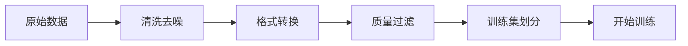

# 数据准备与 SFT 实战

## 数据准备全流程

数据质量是微调效果的决定性因素。一条高质量数据胜过十条噪声数据。



### 数据收集

| 数据来源 | 说明 | 质量 | 成本 |
|----------|------|------|------|
| 业务日志 | 真实用户交互 | 高 | 低 |
| 人工标注 | 专业人员编写 | 最高 | 高 |
| 开源数据集 | Alpaca、ShareGPT 等 | 中 | 低 |
| GPT 蒸馏 | 用强模型生成 | 中 | 中 |
| 网络爬取 | 需大量清洗 | 低 | 低 |

### 数据清洗

```python
import json
import re
import hashlib
from pathlib import Path

def clean_sft_data(input_path: str, output_path: str):
    """清洗 SFT 训练数据"""
    raw_data = []
    with open(input_path, "r", encoding="utf-8") as f:
        for line in f:
            raw_data.append(json.loads(line.strip()))

    cleaned = []
    stats = {"total": len(raw_data), "empty": 0, "too_short": 0,
             "too_long": 0, "duplicate": 0, "low_quality": 0}

    seen = set()

    for item in raw_data:
        # 1. 跳过空数据
        instruction = item.get("instruction", "").strip()
        output = item.get("output", "").strip()
        if not instruction or not output:
            stats["empty"] += 1
            continue

        # 2. 长度过滤
        if len(instruction) < 5 or len(output) < 10:
            stats["too_short"] += 1
            continue
        if len(output) > 4096:
            stats["too_long"] += 1
            continue

        # 3. 去重（使用 hashlib 确保跨 session 确定性）
        content_hash = hashlib.md5(
            (instruction + output).encode()
        ).hexdigest()
        if content_hash in seen:
            stats["duplicate"] += 1
            continue
        seen.add(content_hash)

        # 4. 质量过滤
        if has_low_quality_markers(output):
            stats["low_quality"] += 1
            continue

        cleaned.append(item)

    print(f"清洗统计: {stats}")
    print(f"保留率: {len(cleaned) / stats['total'] * 100:.1f}%")

    with open(output_path, "w", encoding="utf-8") as f:
        for item in cleaned:
            f.write(json.dumps(item, ensure_ascii=False) + "\n")

def has_low_quality_markers(text: str) -> bool:
    """检测低质量标记"""
    markers = [
        "作为一个AI", "As an AI", "I cannot", "我无法",
        "请注意", "Please note", "Disclaimer",
    ]
    text_lower = text.lower()
    return any(m.lower() in text_lower for m in markers)
```

## 数据格式

### Alpaca 格式

```json
{
  "instruction": "将以下句子翻译为英文",
  "input": "今天天气很好，适合出门散步。",
  "output": "The weather is nice today, perfect for a walk outside."
}
```

适用于单轮指令任务。`input` 字段可选，没有额外输入时可为空。

### ShareGPT 格式

```json
{
  "conversations": [
    {"from": "human", "value": "帮我写一个 Python 快速排序"},
    {"from": "gpt", "value": "```python\ndef quicksort(arr):\n    if len(arr) <= 1:\n        return arr\n    pivot = arr[len(arr) // 2]\n    left = [x for x in arr if x < pivot]\n    middle = [x for x in arr if x == pivot]\n    right = [x for x in arr if x > pivot]\n    return quicksort(left) + middle + quicksort(right)\n```"},
    {"from": "human", "value": "时间复杂度是多少？"},
    {"from": "gpt", "value": "平均时间复杂度为 O(n log n)，最坏情况为 O(n^2)，发生在数组已经有序时。"}
  ]
}
```

适用于多轮对话场景。

### Chat Template 格式（推荐）

现代模型（Qwen2、Llama3、ChatGLM4）都有原生的 Chat Template。
SFT 时应使用模型原生格式而非自定义分隔符，否则微调后模型对齐会变差。

```python
from transformers import AutoTokenizer

def format_with_chat_template(tokenizer_name: str,
                                conversations: list[dict]) -> str:
    """使用模型原生 Chat Template 格式化数据

    推荐做法：让 tokenizer.apply_chat_template 处理格式
    而非手动拼接 "### Instruction:" 等分隔符
    """
    tokenizer = AutoTokenizer.from_pretrained(tokenizer_name)

    # 构建对话格式
    messages = []
    for conv in conversations:
        messages.append({"role": "user", "content": conv["instruction"]})
        messages.append({"role": "assistant", "content": conv["output"]})

    # 使用模型原生模板
    formatted = tokenizer.apply_chat_template(
        messages,
        tokenize=False,
        add_generation_prompt=False,
    )
    return formatted

# 不同模型的 Chat Template 差异
# Qwen2: <|im_start|>system\n...<|im_end|>\n<|im_start|>user\n...<|im_end|>
# Llama3: <|begin_of_text|><|start_header_id|>user<|end_header_id|>...
# ChatGLM4: [Round 1]\n\n问：...\n\n答：...
```

> ⚠️ 使用自定义格式（如 `### Instruction:`）微调后，推理时也必须用相同格式。
> 推荐直接使用 `tokenizer.apply_chat_template()` 确保训练和推理格式一致。

### 格式转换工具

```python
def alpaca_to_sharegpt(alpaca_data: list[dict]) -> list[dict]:
    """Alpaca 格式转 ShareGPT 格式"""
    sharegpt_data = []
    for item in alpaca_data:
        conversations = []

        # 构建用户消息
        user_msg = item["instruction"]
        if item.get("input"):
            user_msg += f"\n{item['input']}"
        conversations.append({"from": "human", "value": user_msg})

        # 构建助手消息
        conversations.append({"from": "gpt", "value": item["output"]})

        sharegpt_data.append({"conversations": conversations})

    return sharegpt_data
```

## SFT 训练实战

### 完整训练脚本

```python
import torch
from dataclasses import dataclass, field
from transformers import (
    AutoModelForCausalLM,
    AutoTokenizer,
    TrainingArguments,
    Trainer,
    DataCollatorForSeq2Seq,
)
from peft import LoraConfig, get_peft_model, TaskType
from datasets import load_dataset

@dataclass
class SFTConfig:
    model_name: str = "Qwen/Qwen2.5-7B"
    dataset_path: str = "./data/sft_data.jsonl"
    output_dir: str = "./output/sft_checkpoint"
    max_length: int = 2048
    lora_r: int = 16
    lora_alpha: int = 32
    learning_rate: float = 2e-4
    num_train_epochs: int = 3
    per_device_train_batch_size: int = 2
    gradient_accumulation_steps: int = 8
    warmup_ratio: float = 0.1
    logging_steps: int = 10
    save_steps: int = 200
    use_qlora: bool = True

def train_sft(config: SFTConfig):
    # 1. 加载 tokenizer
    tokenizer = AutoTokenizer.from_pretrained(
        config.model_name,
        trust_remote_code=True,
        padding_side="right"
    )
    if tokenizer.pad_token is None:
        tokenizer.pad_token = tokenizer.eos_token

    # 2. 加载模型
    model_kwargs = {
        "torch_dtype": torch.bfloat16,
        "device_map": "auto",
        "trust_remote_code": True,
    }

    if config.use_qlora:
        from transformers import BitsAndBytesConfig
        model_kwargs["quantization_config"] = BitsAndBytesConfig(
            load_in_4bit=True,
            bnb_4bit_quant_type="nf4",
            bnb_4bit_compute_dtype=torch.bfloat16,
            bnb_4bit_use_double_quant=True,
        )

    model = AutoModelForCausalLM.from_pretrained(config.model_name, **model_kwargs)

    if config.use_qlora:
        from peft import prepare_model_for_kbit_training
        model = prepare_model_for_kbit_training(model)

    # 3. 配置 LoRA
    lora_config = LoraConfig(
        task_type=TaskType.CAUSAL_LM,
        r=config.lora_r,
        lora_alpha=config.lora_alpha,
        lora_dropout=0.05,
        target_modules=["q_proj", "k_proj", "v_proj", "o_proj",
                        "gate_proj", "up_proj", "down_proj"],
        bias="none",
    )
    model = get_peft_model(model, lora_config)
    model.print_trainable_parameters()

    # 4. 加载和处理数据
    dataset = load_dataset("json", data_files=config.dataset_path, split="train")

    def tokenize_function(examples):
        # 构建训练文本
        prompts = []
        for inst, inp, out in zip(
            examples["instruction"], examples.get("input", [""] * len(examples["instruction"])),
            examples["output"]
        ):
            if inp:
                prompt = f"### Instruction:\n{inst}\n\n### Input:\n{inp}\n\n### Response:\n{out}"
            else:
                prompt = f"### Instruction:\n{inst}\n\n### Response:\n{out}"
            prompts.append(prompt)

        tokenized = tokenizer(
            prompts,
            truncation=True,
            max_length=config.max_length,
            padding=False,
        )

        # 关键：只对 Response 部分计算 loss，Instruction 部分用 -100 屏蔽
        # 原因：SFT 的目标是让模型学会"给定指令→生成回答"，而非"预测整个序列"。
        # 如果不屏蔽 instruction，模型会浪费容量学习预测指令本身，
        # 导致生成时倾向于复述指令而非产出回答。
        # -100 是 PyTorch CrossEntropyLoss 的 ignore_index，损失函数会跳过这些位置。
        #
        # 示例（假设 "### Response:" 从第 5 个 token 开始）：
        #   修改前: labels = [ins_tok1, ins_tok2, ins_tok3, ins_tok4, resp_tok1, resp_tok2, ...]
        #   修改后: labels = [-100,     -100,     -100,     -100,     resp_tok1, resp_tok2, ...]
        response_token_ids = tokenizer.encode("### Response:\n", add_special_tokens=False)

        new_labels = []
        for input_ids in tokenized["input_ids"]:
            labels = [-100] * len(input_ids)  # 先全部置为 -100
            # 找到 "### Response:\n" 的结束位置
            resp_start = find_response_start(input_ids, response_token_ids)
            # 只保留 Response 部分的真实 token id
            for i in range(resp_start, len(input_ids)):
                labels[i] = input_ids[i]
            new_labels.append(labels)
        tokenized["labels"] = new_labels
        return tokenized

    def find_response_start(input_ids: list[int], response_token_ids: list[int]) -> int:
        """在 input_ids 中找到 '### Response:\\n' 的结束位置"""
        resp_len = len(response_token_ids)
        for i in range(len(input_ids) - resp_len + 1):
            if input_ids[i:i + resp_len] == response_token_ids:
                return i + resp_len
        # 如果找不到分隔符，回退：保留后半部分（保守策略）
        return len(input_ids) // 2

    dataset = dataset.map(
        tokenize_function,
        batched=True,
        remove_columns=dataset.column_names,
    )

    # 5. 训练参数
    training_args = TrainingArguments(
        output_dir=config.output_dir,
        num_train_epochs=config.num_train_epochs,
        per_device_train_batch_size=config.per_device_train_batch_size,
        gradient_accumulation_steps=config.gradient_accumulation_steps,
        learning_rate=config.learning_rate,
        lr_scheduler_type="cosine",
        warmup_ratio=config.warmup_ratio,
        bf16=True,
        logging_steps=config.logging_steps,
        save_steps=config.save_steps,
        save_total_limit=3,
        gradient_checkpointing=True,
        report_to="tensorboard",
    )

    # 6. 开始训练
    trainer = Trainer(
        model=model,
        args=training_args,
        train_dataset=dataset,
        data_collator=DataCollatorForSeq2Seq(tokenizer=tokenizer, padding=True),
    )

    trainer.train()
    trainer.save_model()
    tokenizer.save_pretrained(config.output_dir)
    print(f"模型已保存至 {config.output_dir}")

if __name__ == "__main__":
    config = SFTConfig(
        model_name="Qwen/Qwen2.5-7B",
        dataset_path="./data/sft_data.jsonl",
        output_dir="./output/sft_qwen7b",
        use_qlora=True,
    )
    train_sft(config)
```

### 使用 LLaMA-Factory（推荐新手）

LLaMA-Factory 提供了 Web UI 和配置文件驱动的方式，降低了上手门槛。

```bash
pip install llamafactory
llamafactory-cli webui
```

通过 YAML 配置文件训练：

```yaml
# sft_config.yaml
model_name_or_path: Qwen/Qwen2.5-7B
stage: sft
do_train: true
finetuning_type: lora
lora_rank: 16
lora_alpha: 32
lora_target: q_proj,k_proj,v_proj,o_proj,gate_proj,up_proj,down_proj
dataset: my_sft_data
template: qwen
cutoff_len: 2048
train_on_inputs: false  # 关键：不训练指令部分，仅对 Response 计算 loss（与上面脚本的 -100 屏蔽逻辑等价）
max_samples: 10000
overwrite_cache: true
preprocessing_num_workers: 8
per_device_train_batch_size: 2
gradient_accumulation_steps: 8
lr_scheduler_type: cosine
logging_steps: 10
warmup_ratio: 0.1
save_steps: 200
num_train_epochs: 3
learning_rate: 2.0e-4
bf16: true
output_dir: ./output/sft_qwen7b
```

```bash
llamafactory-cli train sft_config.yaml
```

## 训练后评估

### 自动评估

```python
def evaluate_sft_model(model_path: str, test_data_path: str):
    """评估微调后的模型"""
    from transformers import AutoModelForCausalLM, AutoTokenizer

    tokenizer = AutoTokenizer.from_pretrained(model_path)
    model = AutoModelForCausalLM.from_pretrained(
        model_path,
        torch_dtype=torch.bfloat16,
        device_map="auto"
    )

    test_data = []
    with open(test_data_path, "r", encoding="utf-8") as f:
        for line in f:
            test_data.append(json.loads(line.strip()))

    results = []
    for item in test_data:
        prompt = f"### Instruction:\n{item['instruction']}\n\n### Response:\n"
        inputs = tokenizer(prompt, return_tensors="pt").to(model.device)
        outputs = model.generate(
            **inputs,
            max_new_tokens=512,
            temperature=0.1,
            do_sample=True,
        )
        generated = tokenizer.decode(outputs[0][inputs["input_ids"].shape[1]:],
                                      skip_special_tokens=True)
        results.append({
            "instruction": item["instruction"],
            "expected": item["output"],
            "generated": generated,
        })

    # 计算相似度
    from rouge import Rouge
    rouge = Rouge()
    scores = []
    for r in results:
        try:
            score = rouge.get_scores(r["generated"], r["expected"])[0]
            scores.append(score["rouge-l"]["f"])
        except:
            continue

    avg_rouge_l = sum(scores) / len(scores) if scores else 0
    print(f"ROUGE-L F1: {avg_rouge_l:.4f}")
    return results, avg_rouge_l
```

### 人工评估清单

| 评估维度 | 评分标准 | 权重 |
|----------|----------|------|
| 准确性 | 回答是否事实正确 | 30% |
| 完整性 | 是否覆盖了问题的关键点 | 20% |
| 格式规范 | 输出是否符合预期格式 | 20% |
| 语言流畅 | 表达是否自然流畅 | 15% |
| 安全性 | 是否有害或不当内容 | 15% |

## 数据质量决定上限

一条高质量数据的特征：

- **指令明确**：任务描述清晰无歧义
- **输入充分**：提供足够的上下文信息
- **输出规范**：回答格式统一、内容准确
- **长度适中**：不过短（信息不足）也不过长（含噪声）
- **无安全风险**：不包含有害或误导性内容

**经验法则**：1000 条精心标注的高质量数据，效果往往优于 10000 条自动生成的低质量数据。

## 下一步

模型训练完成后，下一节将介绍推理优化的核心技术和部署方案。
