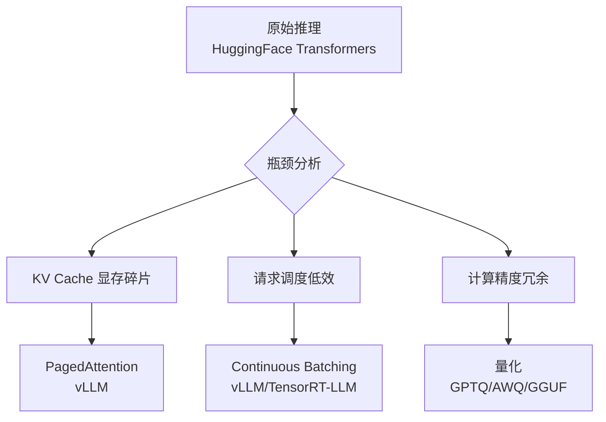

# 推理优化：vLLM / TensorRT-LLM / 量化

## 为什么需要推理优化

模型推理是生产环境的核心环节。未经优化的推理服务存在两大问题：**延迟高**（用户等待久）和**吞吐低**（硬件利用率低）。



## vLLM 部署

### 核心技术

vLLM 的两大核心优化：

**PagedAttention**：借鉴操作系统虚拟内存的分页机制，将 KV Cache 分成固定大小的块（block），按需分配，消除显存碎片。

```
传统方式: [请求1 ████████░░] [请求2 ██░░░░░░░░]  -- 大量碎片
PagedAttention: [块1][块2][块3] [块4][块5] ...    -- 按需分配
```

**Continuous Batching**：请求完成即移出，新请求立即加入，不等待同一批次的其他请求完成。

```
Static Batching:  [R1 ████][R2 ████████]  [R3 ████][R4 ██████████]
                                       ^ R1 完成，但需等 R2
Continuous:       [R1 ████][R2 ████]    [R2 ████][R3 ████]
                                       ^ R1 完成即插入 R3
```

### 基础部署

```bash
pip install vllm
```

```python
from vllm import LLM, SamplingParams

# 离线批量推理
llm = LLM(
    model="Qwen/Qwen2.5-7B",
    tensor_parallel_size=1,       # GPU 并行数
    max_model_len=4096,           # 最大序列长度
    gpu_memory_utilization=0.9,   # GPU 显存利用率
    dtype="bfloat16",
)

prompts = [
    "请解释什么是机器学习",
    "用 Python 写一个二分查找",
    "将以下英文翻译为中文：Hello World",
]

sampling_params = SamplingParams(
    temperature=0.7,
    top_p=0.9,
    max_tokens=512,
)

outputs = llm.generate(prompts, sampling_params)
for output in outputs:
    print(f"Prompt: {output.prompt}")
    print(f"Response: {output.outputs[0].text}")
    print(f"Tokens: {len(output.outputs[0].token_ids)}")
    print("---")
```

### OpenAI 兼容 API 服务

```bash
vllm serve Qwen/Qwen2.5-7B \
    --host 0.0.0.0 \
    --port 8000 \
    --tensor-parallel-size 1 \
    --gpu-memory-utilization 0.9 \
    --max-model-len 4096 \
    --dtype bfloat16
```

客户端调用：

```python
from openai import OpenAI

client = OpenAI(
    api_key="EMPTY",
    base_url="http://localhost:8000/v1"
)

response = client.chat.completions.create(
    model="Qwen/Qwen2.5-7B",
    messages=[
        {"role": "system", "content": "你是一个专业的技术顾问"},
        {"role": "user", "content": "解释 vLLM 的 PagedAttention 原理"},
    ],
    temperature=0.7,
    max_tokens=512,
)
print(response.choices[0].message.content)
```

### 多模态模型支持

```bash
vllm serve Qwen/Qwen2.5-VL-7B \
    --host 0.0.0.0 \
    --port 8000 \
    --limit-mm-per-prompt image=5
```

## 量化技术

量化通过降低模型参数精度来减少显存占用和加速推理。

### 量化方法对比

| 方法 | 精度 | 显存节省 | 精度损失 | 推理速度 | 适用场景 |
|------|------|----------|----------|----------|----------|
| FP16 | 16-bit | 基准 | 无 | 基准 | 训练、高精度推理 |
| GPTQ | 4-bit | ~75% | 1-3% | 快 | GPU 批量推理 |
| AWQ | 4-bit | ~75% | <1% | 快 | GPU 推理（推荐） |
| GGUF | 4-8-bit | 50-75% | 1-2% | 中 | CPU/M 端推理 |

### GPTQ 量化

```python
from auto_gptq import AutoGPTQForCausalLM, BaseQuantizeConfig
from transformers import AutoTokenizer

model_name = "Qwen/Qwen2.5-7B"
tokenizer = AutoTokenizer.from_pretrained(model_name)

# 准备校准数据
calibration_data = []
with open("./data/calibration.jsonl", "r") as f:
    for line in f:
        text = json.loads(line)["text"]
        calibration_data.append(tokenizer(text, return_tensors="pt"))

quantize_config = BaseQuantizeConfig(
    bits=4,
    group_size=128,
    desc_act=True,        # 按激活值排序，提升精度
    damp_percent=0.01,
)

model = AutoGPTQForCausalLM.from_pretrained(
    model_name,
    quantize_config=quantize_config,
    torch_dtype=torch.float16,
)

model.quantize(calibration_data)
model.save_quantized("./output/qwen7b-gptq-4bit")
```

使用 vLLM 加载 GPTQ 模型：

```bash
vllm serve ./output/qwen7b-gptq-4bit \
    --quantization gptq \
    --dtype float16 \
    --host 0.0.0.0 \
    --port 8000
```

### AWQ 量化

AWQ 通过保护关键权重（salient weights）来减少量化损失。

```python
from awq import AutoAWQForCausalLM

model = AutoAWQForCausalLM.from_pretrained("Qwen/Qwen2.5-7B")
tokenizer = AutoTokenizer.from_pretrained("Qwen/Qwen2.5-7B")

quant_config = {
    "zero_point": True,
    "q_group_size": 128,
    "w_bit": 4,
    "version": "GEMM",
}

model.quantize(tokenizer, quant_config=quant_config)
model.save_quantized("./output/qwen7b-awq-4bit")
tokenizer.save_pretrained("./output/qwen7b-awq-4bit")
```

### GGUF 格式（llama.cpp）

GGUF 支持 CPU 和 Apple Silicon 推理，适合边缘部署。

```bash
# 转换模型为 GGUF 格式
python convert_hf_to_gguf.py ./output/merged_model --outtype f16 --outfile model.f16.gguf

# 量化为 Q4_K_M
./llama-quantize model.f16.gguf model.Q4_K_M.gguf Q4_K_M

# 启动推理服务
./llama-server -m model.Q4_K_M.gguf --host 0.0.0.0 --port 8080 -c 4096
```

GGUF 量化级别选择：

| 量化级别 | 大小 | 精度 | 推荐场景 |
|----------|------|------|----------|
| Q8_0 | 最大 | 最好 | 对精度敏感 |
| Q5_K_M | 中等 | 较好 | 平衡选择 |
| Q4_K_M | 较小 | 可接受 | 推荐默认 |
| Q3_K_M | 最小 | 有损 | 极端资源限制 |

## 投机采样（Speculative Decoding）

投机采样用一个小模型（draft model）快速生成候选 token，再用大模型（target model）并行验证。
验证通过的 token 直接接受，不通过的重新采样。大模型只需前向传播一次即可验证多个 token。

### 原理

```
1. Draft Model 快速生成 K 个候选 token（例如 5 个）
2. Target Model 一次前向传播验证所有 K 个 token
3. 从第一个不匹配的位置截断，保留已验证的 token
4. 重复

加速比：取决于 draft model 和 target model 的匹配率
- 匹配率高（80%+）：2-3x 加速
- 匹配率低（<50%）：几乎无加速，反而增加延迟
```

### vLLM 配置

```bash
# 使用 Qwen2-0.5B 作为 draft model，加速 Qwen2-7B
python -m vllm.entrypoints.openai.api_server \
    --model Qwen/Qwen2-7B-Instruct \
    --speculative-model Qwen/Qwen2-0.5B-Instruct \
    --num-speculative-tokens 5 \
    --speculative-max-model-len 2048
```

### Draft Model 选型

| Target Model | 推荐 Draft Model | 匹配率 |
|-------------|-----------------|--------|
| Qwen2-7B | Qwen2-0.5B | 75-85% |
| Llama3-8B | Llama3-1B | 70-80% |
| DeepSeek-V2 | DeepSeek-V2-Lite | 80-90% |

> ⚠️ Draft model 必须与 target model 共享 tokenizer，否则无法工作。
> GPU 显存需要同时容纳两个模型。

## Prefix Caching（前缀缓存）

RAG 场景中，大量请求共享相同的系统提示和检索上下文。
Prefix Caching 缓存这些重复前缀的 KV Cache，避免重复计算。

### RAG 场景加速效果

```
普通模式：每个请求都重新计算 system prompt + context 的 KV Cache
  → 1K token 系统提示 × 1000 请求 = 1M token 重复计算

Prefix Caching：相同前缀只计算一次，后续请求直接复用
  → 1K token 系统提示 × 1 次计算 + 999 次复用
  → 节省 50-90% 的 input token 计算成本
```

### vLLM 配置

```bash
python -m vllm.entrypoints.openai.api_server \
    --model Qwen/Qwen2-7B-Instruct \
    --enable-prefix-caching \
    --gpu-memory-utilization 0.9
```

> 注意：Prefix Caching 基于 hash 匹配前缀，前缀完全相同时才生效。
> 确保 system prompt 完全一致（包括空格和换行）。

## TensorRT-LLM 概览

TensorRT-LLM 是 NVIDIA 推出的高性能推理框架，针对 NVIDIA GPU 做了极致优化。

### 核心优势

- **Kernel 融合**：将多个 CUDA kernel 合并，减少显存访问
- **In-Flight Batching**：比 Continuous Batching 更细粒度的调度
- **FP8 支持**：利用 H100 的 FP8 硬件加速
- **KV Cache 量化**：支持 FP8 KV Cache，节省显存

### 构建推理引擎

```bash
# 使用 TensorRT-LLM 构建 Qwen2.5-7B 的 TensorRT 引擎
python convert_checkpoint.py \
    --model_dir Qwen/Qwen2.5-7B \
    --output_dir ./trt_ckpt/qwen7b \
    --dtype bfloat16

trtllm-build \
    --checkpoint_dir ./trt_ckpt/qwen7b \
    --output_dir ./trt_engines/qwen7b \
    --gemm_plugin bfloat16 \
    --max_batch_size 32 \
    --max_input_len 2048 \
    --max_seq_len 4096
```

### 运行推理

```python
import tensorrt_llm
from tensorrt_llm.runtime import ModelRunner

runner = ModelRunner.from_dir(
    engine_dir="./trt_engines/qwen7b",
    lora_dir=None,
)

output = runner.generate(
    batch_input_ids=[[1, 2, 3, 4]],  # token IDs
    max_new_tokens=512,
    top_k=1,
)
```

## 性能基准测试

以下为 Qwen2.5-7B 在 A100 上的参考数据：

| 方案 | 精度 | 显存占用 | 首 Token 延迟 | 吞吐 (tokens/s) |
|------|------|----------|---------------|-----------------|
| HF Transformers | FP16 | 14GB | 120ms | 30 |
| vLLM | FP16 | 16GB | 45ms | 120 |
| vLLM | AWQ 4-bit | 5GB | 40ms | 150 |
| TensorRT-LLM | FP16 | 14GB | 25ms | 180 |
| TensorRT-LLM | FP8 | 7GB | 20ms | 220 |
| llama.cpp (GGUF) | Q4_K_M | 4GB | 80ms | 60 |

**测试条件**：batch_size=32, input_len=256, output_len=128, 1x A100 80GB

### 自定义基准测试

```python
import time
from vllm import LLM, SamplingParams

def benchmark_vllm(model_name: str, num_requests: int = 100):
    llm = LLM(model=model_name, max_model_len=2048)
    sampling_params = SamplingParams(max_tokens=128, temperature=0)

    prompts = ["写一个 Python 函数计算斐波那契数列"] * num_requests

    start = time.time()
    outputs = llm.generate(prompts, sampling_params)
    elapsed = time.time() - start

    total_tokens = sum(len(o.outputs[0].token_ids) for o in outputs)
    throughput = total_tokens / elapsed
    avg_latency = elapsed / num_requests * 1000

    print(f"总耗时: {elapsed:.2f}s")
    print(f"吞吐: {throughput:.1f} tokens/s")
    print(f"平均延迟: {avg_latency:.1f}ms")
    print(f"首 Token 延迟（估算）: {avg_latency * 0.3:.1f}ms")

benchmark_vllm("Qwen/Qwen2.5-7B")
```

## 选型建议

| 场景 | 推荐方案 |
|------|----------|
| 快速上线、灵活部署 | vLLM + AWQ |
| 极致性能、NVIDIA GPU 集群 | TensorRT-LLM |
| CPU/边缘部署 | llama.cpp + GGUF |
| 开发调试 | HF Transformers |
| 多模型路由 | vLLM（支持多模型服务） |

## 下一步

推理服务上线后，下一节将介绍如何系统性地评估模型效果和建立基准测试流程。
