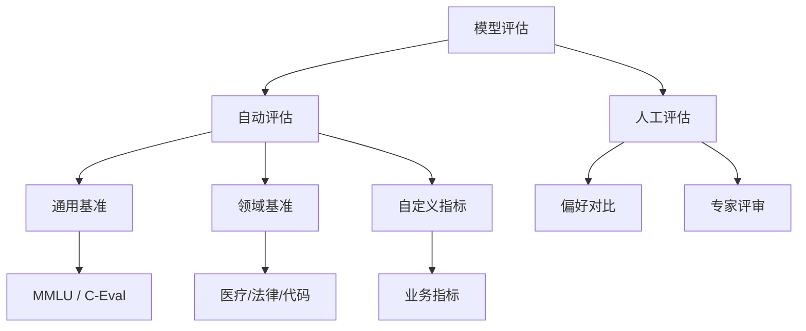

# 模型评估与基准测试

## 评估体系总览

模型评估不只是看一个分数，而是建立一套系统化的评估流程，确保模型在真实场景中可靠。



## 评估框架

### lm-eval-harness

EleutherAI 开源的评估框架，支持 60+ 基准测试。

```bash
pip install lm-eval
```

```bash
# 评估 MMLU
lm_eval --model vllm \
    --model_args pretrained=Qwen/Qwen2.5-7B \
    --tasks mmlu \
    --batch_size auto

# 评估中文基准 C-Eval
lm_eval --model vllm \
    --model_args pretrained=Qwen/Qwen2.5-7B \
    --tasks ceval \
    --batch_size auto

# 评估多个任务
lm_eval --model vllm \
    --model_args pretrained=Qwen/Qwen2.5-7B \
    --tasks mmlu,gsm8k,humaneval \
    --batch_size auto \
    --output_path ./eval_results
```

### OpenCompass

上海 AI Lab 开源的评估框架，对中文模型支持更好。

```bash
pip install opencompass
```

```python
# opencompass_config.py
from opencompass.models import VllmModel
from opencompass.datasets import MMLUDataset, CEvalDataset

models = [
    VllmModel(
        model_name="Qwen2.5-7B",
        model_path="Qwen/Qwen2.5-7B",
        max_seq_len=4096,
    )
]

datasets = [
    MMLUDataset(),
    CEvalDataset(),
]
```

```bash
opencompass run opencompass_config.py
```

## 核心评估指标

### 生成质量指标

| 指标 | 说明 | 适用场景 |
|------|------|----------|
| Perplexity | 模型对文本的困惑度，越低越好 | 通用语言建模 |
| BLEU | n-gram 重叠度 | 翻译、摘要 |
| ROUGE | 召回率导向的重叠度 | 摘要 |
| BERTScore | 语义相似度 | 通用生成 |
| GPT-4 Judge | 用 GPT-4 评判质量 | 通用（成本高） |

```python
from rouge import Rouge
from nltk.translate.bleu_score import sentence_bleu

def compute_generation_metrics(prediction: str, reference: str) -> dict:
    """计算生成质量指标"""
    # ROUGE
    rouge = Rouge()
    try:
        rouge_scores = rouge.get_scores(prediction, reference)[0]
    except:
        rouge_scores = {"rouge-1": {"f": 0}, "rouge-2": {"f": 0}, "rouge-l": {"f": 0}}

    # BLEU
    ref_tokens = [reference.split()]
    pred_tokens = prediction.split()
    bleu_score = sentence_bleu(ref_tokens, pred_tokens)

    return {
        "rouge-1": rouge_scores["rouge-1"]["f"],
        "rouge-2": rouge_scores["rouge-2"]["f"],
        "rouge-l": rouge_scores["rouge-l"]["f"],
        "bleu": bleu_score,
    }
```

### 分类与选择指标

```python
def compute_accuracy(predictions: list[str], references: list[str]) -> dict:
    """计算准确率指标"""
    correct = sum(p == r for p, r in zip(predictions, references))
    total = len(predictions)

    # 按类别计算
    from collections import defaultdict
    class_stats = defaultdict(lambda: {"correct": 0, "total": 0})
    for pred, ref in zip(predictions, references):
        class_stats[ref]["total"] += 1
        if pred == ref:
            class_stats[ref]["correct"] += 1

    per_class_acc = {
        cls: stats["correct"] / stats["total"]
        for cls, stats in class_stats.items()
    }

    return {
        "overall_accuracy": correct / total,
        "per_class_accuracy": per_class_acc,
    }
```

### Perplexity 评估

```python
from transformers import AutoModelForCausalLM, AutoTokenizer
import torch
import torch.nn.functional as F
import math

def compute_perplexity(model_name: str, texts: list[str]) -> float:
    """计算模型在给定文本上的困惑度（标准 PPL：总 loss / 总 tokens）"""
    model = AutoModelForCausalLM.from_pretrained(
        model_name, torch_dtype=torch.bfloat16, device_map="auto"
    )
    tokenizer = AutoTokenizer.from_pretrained(model_name)

    total_loss = 0.0
    total_tokens = 0

    for text in texts:
        inputs = tokenizer(text, return_tensors="pt").to(model.device)
        with torch.no_grad():
            outputs = model(**inputs)
        # 只计算非 padding token 的 loss
        shift_logits = outputs.logits[..., :-1, :].contiguous()
        shift_labels = inputs["input_ids"][..., 1:].contiguous()
        loss_mask = shift_labels != -100
        loss = F.cross_entropy(
            shift_logits.view(-1, shift_logits.size(-1)),
            shift_labels.view(-1),
            reduction='none'
        )
        total_loss += loss[loss_mask].sum().item()
        total_tokens += loss_mask.sum().item()

    ppl = math.exp(total_loss / total_tokens)
    return ppl
```

## 领域基准测试

### 常用基准数据集

| 领域 | 基准 | 说明 |
|------|------|------|
| 通用知识 | MMLU / C-Eval | 多学科选择题 |
| 数学推理 | GSM8K / MATH | 数学应用题 |
| 代码生成 | HumanEval / MBPP | Python 函数生成 |
| 常识推理 | HellaSwag / WinoGrande | 常识问答 |
| 阅读理解 | RACE / C3 | 中英文阅读理解 |
| 长文本 | L-Eval / LongBench | 长上下文理解 |

### 自定义领域评估

```python
def create_domain_benchmark(
    test_data_path: str,
    model_name: str,
    judge_model: str = "gpt-4",
) -> list[dict]:
    """创建领域特定评估"""
    test_data = []
    with open(test_data_path, "r", encoding="utf-8") as f:
        for line in f:
            test_data.append(json.loads(line.strip()))

    from openai import OpenAI
    client = OpenAI()

    results = []
    for item in test_data:
        # 生成回答
        response = client.chat.completions.create(
            model=model_name,
            messages=[{"role": "user", "content": item["question"]}],
            temperature=0,
            max_tokens=512,
        )
        prediction = response.choices[0].message.content

        # GPT-4 评判
        judge_prompt = f"""请评估以下回答的质量。

问题: {item['question']}
标准答案: {item['answer']}
模型回答: {prediction}

请从以下维度打分（1-5分）：
1. 准确性: 回答是否事实正确
2. 完整性: 是否覆盖关键信息
3. 相关性: 是否紧扣问题

以 JSON 格式输出: {{"accuracy": X, "completeness": X, "relevance": X, "reason": "..."}}"""

        judge_response = client.chat.completions.create(
            model=judge_model,
            messages=[{"role": "user", "content": judge_prompt}],
            response_format={"type": "json_object"},
            temperature=0,
        )

        scores = json.loads(judge_response.choices[0].message.content)
        results.append({
            "question": item["question"],
            "prediction": prediction,
            "reference": item["answer"],
            "scores": scores,
        })

    # 汇总
    avg_scores = {
        "accuracy": sum(r["scores"]["accuracy"] for r in results) / len(results),
        "completeness": sum(r["scores"]["completeness"] for r in results) / len(results),
        "relevance": sum(r["scores"]["relevance"] for r in results) / len(results),
    }
    print(f"领域评估结果: {avg_scores}")
    return results
```

## A/B 测试

生产环境中，模型选择最终需要通过 A/B 测试验证。

```python
import hashlib
import random

class ABTestRouter:
    """A/B 测试路由器"""

    def __init__(self, model_a: str, model_b: str, ratio: float = 0.5):
        self.model_a = model_a
        self.model_b = model_b
        self.ratio = ratio  # B 组流量比例
        self.results = {"a": [], "b": []}

    def route(self, user_id: str) -> str:
        """根据用户 ID 决定路由到哪个模型"""
        hash_val = int(hashlib.md5(user_id.encode()).hexdigest(), 16)
        if (hash_val % 100) / 100 < self.ratio:
            return self.model_b
        return self.model_a

    def record_feedback(self, user_id: str, model: str, feedback: dict):
        """记录用户反馈"""
        group = "b" if model == self.model_b else "a"
        self.results[group].append(feedback)

    def analyze(self) -> dict:
        """分析 A/B 测试结果"""
        from scipy import stats

        def get_scores(group):
            return [f["score"] for f in self.results[group]]

        scores_a = get_scores("a")
        scores_b = get_scores("b")

        if not scores_a or not scores_b:
            return {"error": "数据不足"}

        t_stat, p_value = stats.ttest_ind(scores_a, scores_b)

        return {
            "model_a": {"mean": sum(scores_a) / len(scores_a), "n": len(scores_a)},
            "model_b": {"mean": sum(scores_b) / len(scores_b), "n": len(scores_b)},
            "p_value": p_value,
            "significant": p_value < 0.05,
            "winner": "b" if sum(scores_b) / len(scores_b) > sum(scores_a) / len(scores_a) else "a",
        }
```

## 评估流水线

建立自动化的评估流水线，确保每次模型变更都能快速评估。

```python
class EvalPipeline:
    """模型评估流水线"""

    def __init__(self, model_path: str, benchmarks: list[str]):
        self.model_path = model_path
        self.benchmarks = benchmarks

    def run(self) -> dict:
        results = {}

        for benchmark in self.benchmarks:
            if benchmark == "mmlu":
                results["mmlu"] = self._eval_mmlu()
            elif benchmark == "gsm8k":
                results["gsm8k"] = self._eval_gsm8k()
            elif benchmark == "humaneval":
                results["humaneval"] = self._eval_humaneval()
            elif benchmark == "custom":
                results["custom"] = self._eval_custom()

        # 生成报告
        report = self._generate_report(results)
        return report

    def _eval_mmlu(self) -> dict:
        import subprocess
        cmd = f"lm_eval --model vllm --model_args pretrained={self.model_path} --tasks mmlu --batch_size auto"
        result = subprocess.run(cmd, shell=True, capture_output=True, text=True)
        return {"raw": result.stdout}

    def _generate_report(self, results: dict) -> dict:
        report = {
            "model": self.model_path,
            "timestamp": time.strftime("%Y-%m-%d %H:%M:%S"),
            "results": results,
        }
        # 保存报告
        report_path = f"./eval_reports/{time.strftime('%Y%m%d_%H%M%S')}.json"
        with open(report_path, "w") as f:
            json.dump(report, f, ensure_ascii=False, indent=2)
        return report
```

## 评估最佳实践

1. **建立基线**：任何优化前先记录基线分数，否则无法量化改进
2. **多维度评估**：不要只看一个指标，综合 accuracy、latency、cost
3. **领域优先**：通用基准只是参考，业务指标才是决策依据
4. **持续评估**：模型上线后持续监控，设置回归报警
5. **人工抽检**：自动评估无法替代人工评审，定期抽样检查
6. **记录完整**：每次评估记录模型版本、数据版本、超参数，确保可复现

## 评估报告模板

```
## 模型评估报告

- 模型: Qwen2.5-7B-LoRA-medical-v2
- 评估时间: 2025-01-15
- 基线模型: Qwen2.5-7B-base

### 通用基准

| 基准 | 基线 | 微调后 | 变化 |
|------|------|--------|------|
| MMLU | 72.1 | 71.8 | -0.3 |
| C-Eval | 78.5 | 79.2 | +0.7 |

### 领域基准

| 指标 | 基线 | 微调后 | 变化 |
|------|------|--------|------|
| 医学问答准确率 | 45.2% | 78.6% | +33.4% |
| 药物交互识别 | 32.1% | 71.3% | +39.2% |

### 结论
微调在领域指标上显著提升，通用能力基本保持。
```
