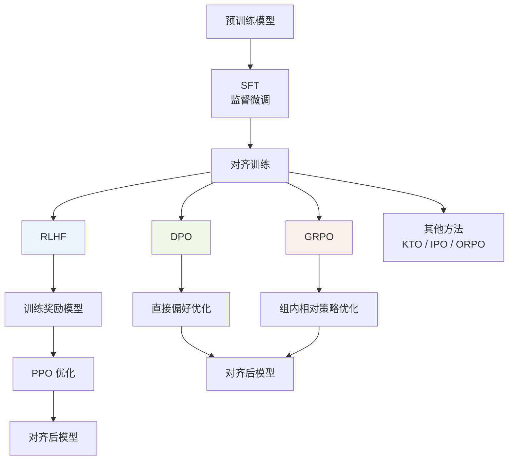
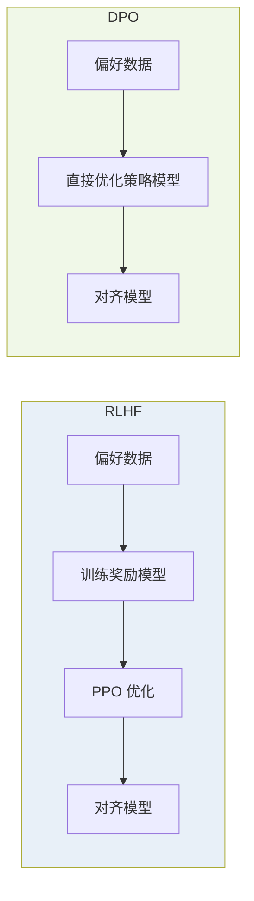
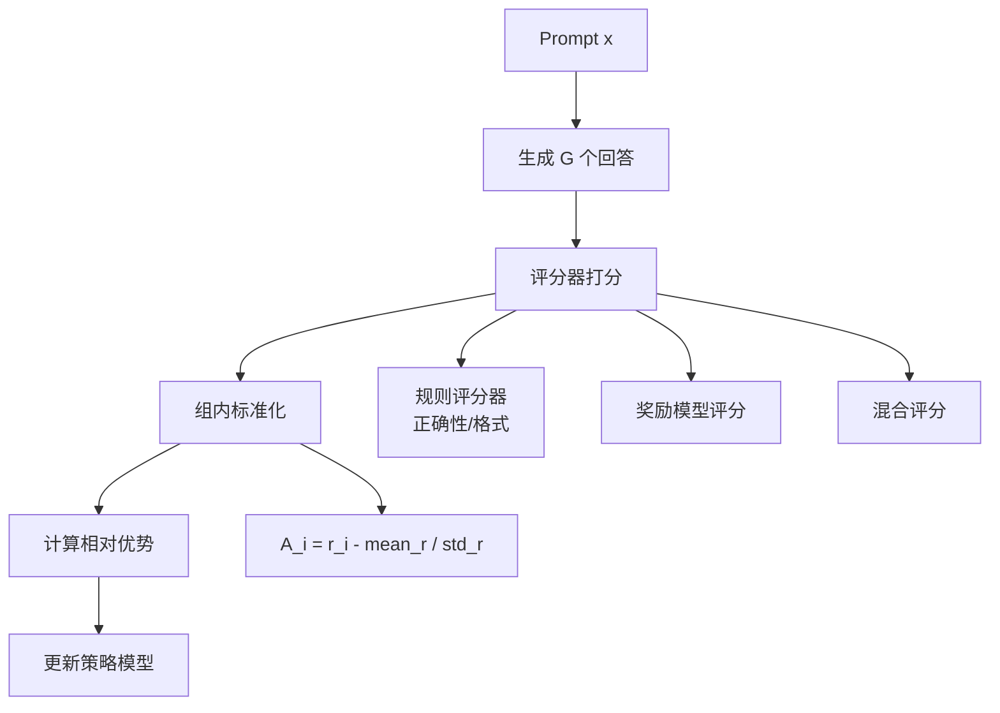
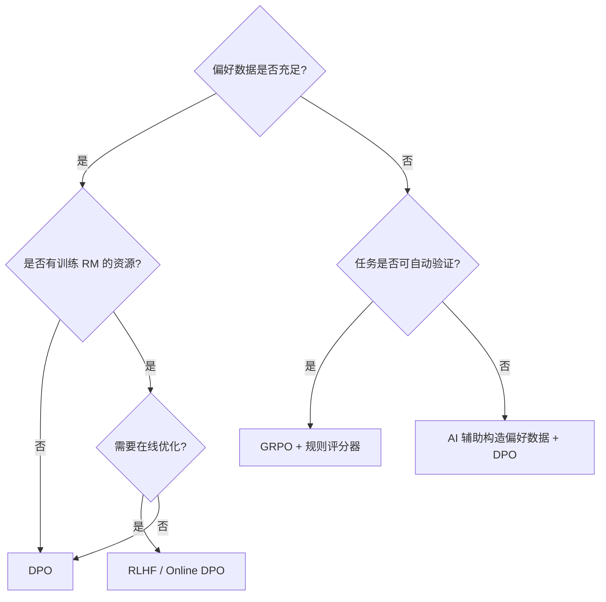

# 对齐训练：RLHF 与 DPO

预训练 + SFT 让模型学会了"能说什么"，对齐训练决定模型"应该说什么"。从 OpenAI 的 InstructGPT 到 Meta 的 Llama 2/3，对齐训练已成为大模型发布前的标准环节。本文覆盖 RLHF 全流程、DPO 原理、GRPO 简介以及对齐数据构造方法。

## 对齐训练全景



---

## 1. RLHF 全流程

RLHF（Reinforcement Learning from Human Feedback）分为三个阶段：SFT、奖励模型训练、PPO 对齐。

### 阶段一：SFT（Supervised Fine-Tuning）

用高质量指令-回答对微调预训练模型，使其具备基本的指令跟随能力。

```python
"""SFT 阶段：使用 TRL 库"""
from datasets import Dataset
from trl import SFTTrainer, SFTConfig
from transformers import AutoModelForCausalLM, AutoTokenizer

model_name = "Qwen/Qwen2.5-7B"
tokenizer = AutoTokenizer.from_pretrained(model_name)
model = AutoModelForCausalLM.from_pretrained(
    model_name,
    torch_dtype="auto",
    device_map="auto",
)

# SFT 数据格式
sft_data = [
    {
        "prompt": "解释什么是梯度下降",
        "response": "梯度下降是一种优化算法，通过沿损失函数梯度的反方向迭代更新参数...",
    },
    # ...
]

# 构建 dataset
dataset = Dataset.from_list(sft_data)


def format_sft_example(example):
    return {
        "text": f"<|im_start|>user\n{example['prompt']}<|im_end|>\n"
                f"<|im_start|>assistant\n{example['response']}<|im_end|>"
    }


dataset = dataset.map(format_sft_example)

sft_config = SFTConfig(
    output_dir="./sft_model",
    num_train_epochs=3,
    per_device_train_batch_size=4,
    gradient_accumulation_steps=8,
    learning_rate=2e-5,
    max_seq_length=2048,
    logging_steps=10,
    save_strategy="epoch",
    bf16=True,
)

trainer = SFTTrainer(
    model=model,
    args=sft_config,
    train_dataset=dataset,
)

trainer.train()
trainer.save_model("./sft_model")
```

### 阶段二：奖励模型训练

奖励模型（Reward Model, RM）学习人类偏好，为 PPO 提供奖励信号。

#### 数据构造：Bradley-Terry 模型

给定同一 prompt 下的两个回答 $(y_w, y_l)$，其中 $y_w$ 更受人类偏好。奖励模型训练目标是：

$$\mathcal{L}_{RM} = -\mathbb{E}\left[\log \sigma(r(x, y_w) - r(x, y_l))\right]$$

其中 $\sigma$ 是 sigmoid 函数，$r(x, y)$ 是奖励模型对 prompt $x$ 和回答 $y$ 的评分。

```python
"""奖励模型训练"""
from datasets import Dataset
from transformers import AutoModelForSequenceClassification, AutoTokenizer, TrainingArguments
from trl import RewardTrainer, RewardConfig

# 偏好数据
preference_data = [
    {
        "prompt": "写一首关于春天的诗",
        "chosen": "春风拂柳绿如烟，桃花映水红欲燃。\n燕子归来寻旧垒，一帘微雨润新田。",
        "rejected": "春天来了，花开了，鸟叫了，天气变暖了，万物复苏了。",
    },
    # ...
]

dataset = Dataset.from_list(preference_data)

# 奖励模型基于 SFT 模型初始化
rm_model = AutoModelForSequenceClassification.from_pretrained(
    "./sft_model",
    num_labels=1,  # 输出单个标量奖励
    torch_dtype="auto",
    device_map="auto",
)
rm_tokenizer = AutoTokenizer.from_pretrained("./sft_model")

# 确保 pad_token 存在
if rm_tokenizer.pad_token is None:
    rm_tokenizer.pad_token = rm_tokenizer.eos_token

reward_config = RewardConfig(
    output_dir="./reward_model",
    num_train_epochs=1,
    per_device_train_batch_size=4,
    gradient_accumulation_steps=8,
    learning_rate=1e-5,
    max_length=2048,
    bf16=True,
    logging_steps=10,
    save_strategy="epoch",
)

trainer = RewardTrainer(
    model=rm_model,
    args=reward_config,
    train_dataset=dataset,
    processing_class=rm_tokenizer,
)

trainer.train()
trainer.save_model("./reward_model")
```

### 阶段三：PPO 对齐

使用 Proximal Policy Optimization 对 SFT 模型进行强化学习优化。

```python
"""PPO 对齐训练"""
from trl import PPOTrainer, PPOConfig, AutoModelForCausalLMWithValueHead
from transformers import AutoTokenizer
from datasets import Dataset

# 配置
ppo_config = PPOConfig(
    model_name="./sft_model",
    learning_rate=1e-6,
    batch_size=64,
    mini_batch_size=8,
    gradient_accumulation_steps=4,
    ppo_epochs=4,
    # KL 散度约束系数：防止偏离 SFT 模型太远
    kl_coef=0.05,
    # 裁剪参数
    cliprange=0.2,
    cliprange_value=0.2,
    # 价值函数损失系数
    vf_coef=0.1,
)

# 模型
model = AutoModelForCausalLMWithValueHead.from_pretrained(
    ppo_config.model_name,
    torch_dtype="auto",
    device_map="auto",
)
tokenizer = AutoTokenizer.from_pretrained(ppo_config.model_name)
if tokenizer.pad_token is None:
    tokenizer.pad_token = tokenizer.eos_token

# 参考模型（用于 KL 约束）
ref_model = AutoModelForCausalLMWithValueHead.from_pretrained(
    ppo_config.model_name,
    torch_dtype="auto",
    device_map="auto",
)

# 奖励模型
from transformers import AutoModelForSequenceClassification
reward_model = AutoModelForSequenceClassification.from_pretrained(
    "./reward_model",
    torch_dtype="auto",
    device_map="auto",
)
reward_tokenizer = AutoTokenizer.from_pretrained("./reward_model")

# Prompt 数据集
prompts = [
    "解释量子计算的基本原理",
    "写一段 Python 快速排序",
    "分析《红楼梦》的主题",
    # ...
]
prompt_dataset = Dataset.from_dict({"prompt": prompts})

# PPO Trainer
ppo_trainer = PPOTrainer(
    config=ppo_config,
    model=model,
    ref_model=ref_model,
    tokenizer=tokenizer,
    dataset=prompt_dataset,
)

# 训练循环
from tqdm import tqdm

generation_kwargs = {
    "max_new_tokens": 512,
    "temperature": 0.7,
    "top_p": 0.9,
    "do_sample": True,
}

for batch in tqdm(ppo_trainer.dataloader):
    query_tensors = batch["input_ids"]

    # 生成回答
    response_tensors = ppo_trainer.generate(
        query_tensors, **generation_kwargs
    )

    # 计算奖励
    rewards = []
    for query, response in zip(query_tensors, response_tensors):
        text = tokenizer.decode(response, skip_special_tokens=True)
        prompt_text = tokenizer.decode(query, skip_special_tokens=True)
        rm_input = reward_tokenizer(
            prompt_text + text, return_tensors="pt", truncation=True, max_length=2048
        ).to(reward_model.device)
        with __import__("torch").no_grad():
            reward_score = reward_model(**rm_input).logits[0][0].item()
        rewards.append(torch.tensor(reward_score))

    # PPO 更新
    stats = ppo_trainer.step(query_tensors, response_tensors, rewards)
    ppo_trainer.log_stats(stats, batch, rewards)

# 保存最终模型
ppo_trainer.save_model("./rlhf_model")
```

### PPO 关键概念

| 概念 | 作用 | 调参建议 |
|------|------|---------|
| KL 散度约束 | 防止策略偏离参考模型太远 | 初始 0.05，根据 KL 值自适应调整 |
| 价值函数 | 估计状态价值，减少方差 | vf_coef 通常 0.1 ~ 0.5 |
| GAE | 优势函数估计，平衡偏差和方差 | lambda 通常 0.95 |
| Clip Range | 限制策略更新幅度 | 0.2 是常用值 |
| PPO Epochs | 每批数据的更新轮数 | 4 是典型值，过大易过拟合 |

---

## 2. DPO 原理与优势

DPO（Direct Preference Optimization）绕过奖励模型，直接用偏好数据优化策略模型。

### 核心思想

RLHF 需要先训练奖励模型，再用 PPO 优化，流程复杂且不稳定。DPO 发现，在特定的最优策略下，奖励函数可以隐式地表示：

$$r(x, y) = \beta \log \frac{\pi_\theta(y|x)}{\pi_{ref}(y|x)} + \beta \log Z(x)$$

将此代入 Bradley-Terry 偏好模型，消去配分函数 $Z(x)$，得到 DPO 损失：

$$\mathcal{L}_{DPO} = -\mathbb{E}\left[\log \sigma\left(\beta \log \frac{\pi_\theta(y_w|x)}{\pi_{ref}(y_w|x)} - \beta \log \frac{\pi_\theta(y_l|x)}{\pi_{ref}(y_l|x)}\right)\right]$$



### DPO 实现

```python
"""DPO 训练"""
from datasets import Dataset
from trl import DPOTrainer, DPOConfig
from transformers import AutoModelForCausalLM, AutoTokenizer

model_name = "./sft_model"

# 模型
model = AutoModelForCausalLM.from_pretrained(
    model_name,
    torch_dtype="auto",
    device_map="auto",
)
tokenizer = AutoTokenizer.from_pretrained(model_name)
if tokenizer.pad_token is None:
    tokenizer.pad_token = tokenizer.eos_token

# 参考模型（冻结，用于 KL 惩罚）
ref_model = AutoModelForCausalLM.from_pretrained(
    model_name,
    torch_dtype="auto",
    device_map="auto",
)

# 偏好数据
dpo_data = [
    {
        "prompt": "解释量子纠缠",
        "chosen": "量子纠缠是量子力学中的一种现象，两个或多个粒子在量子态上相互关联，即使相距遥远，对其中一个粒子的测量也会瞬间影响另一个粒子的状态。这种关联并非经典的因果关系，而是量子态的非定域性质...",
        "rejected": "量子纠缠就是两个粒子互相影响，不管多远都能感应到。这是量子力学最神奇的地方。",
    },
    # ...
]

dataset = Dataset.from_list(dpo_data)

# DPO 配置
dpo_config = DPOConfig(
    output_dir="./dpo_model",
    num_train_epochs=3,
    per_device_train_batch_size=4,
    gradient_accumulation_steps=8,
    learning_rate=5e-7,
    # beta 控制 KL 约束强度，等价于 RLHF 中的 1/kl_coef
    beta=0.1,
    max_length=2048,
    max_prompt_length=1024,
    bf16=True,
    logging_steps=10,
    save_strategy="epoch",
    # 损失类型
    loss_type="sigmoid",  # sigmoid / hinge / ipo
    # 参考模型是否冻结
    reference_free=False,
)

trainer = DPOTrainer(
    model=model,
    ref_model=ref_model,
    args=dpo_config,
    train_dataset=dataset,
    processing_class=tokenizer,
)

trainer.train()
trainer.save_model("./dpo_model")
```

### DPO 变体

| 变体 | 损失函数 | 特点 |
|------|---------|------|
| DPO (sigmoid) | 标准 Bradley-Terry 损失 | 最常用，稳定 |
| DPO (hinge) | 基于间隔的损失 | 更激进地拉开 chosen/rejected 差距 |
| IPO | KL 正则化更平滑 | 理论上更稳定，不易过拟合 |
| KTO | 只需 good/bad 标签，不需配对 | 数据收集更简单 |
| ORPO | SFT + 偏好优化合二为一 | 减少训练步骤 |
| SimPO | 去掉参考模型依赖 | 更高效，但稳定性略低 |

---

## 3. GRPO 简介

GRPO（Group Relative Policy Optimization）是 DeepSeek 提出的对齐方法，核心思想是：对同一 prompt 生成一组回答，用组内相对排名作为奖励信号，无需训练单独的奖励模型。

### 工作流程



### GRPO 优势

| 特性 | RLHF (PPO) | DPO | GRPO |
|------|-----------|-----|------|
| 是否需要奖励模型 | 是 | 否 | 可选 |
| 数据格式 | prompt | prompt + chosen/rejected | prompt |
| 训练稳定性 | 低 | 高 | 中 |
| 计算开销 | 高（4 个模型） | 低（2 个模型） | 中（1 + 评分器） |
| 奖励信号来源 | 训练的 RM | 偏好对比 | 组内相对排名 |
| 适合场景 | 通用对齐 | 偏好数据充足 | 数学/代码等可验证任务 |

```python
"""GRPO 简化实现示例"""
import torch
import torch.nn.functional as F


def grpo_loss(
    policy_logps_chosen: torch.Tensor,  # [batch, G]
    ref_logps_chosen: torch.Tensor,     # [batch, G]
    rewards: torch.Tensor,              # [batch, G]
    beta: float = 0.04,
    clip_range: float = 0.2,
) -> torch.Tensor:
    """
    GRPO 损失函数（简化版）

    Args:
        policy_logps_chosen: 策略模型对每个生成回答的 log 概率
        ref_logps_chosen: 参考模型对每个生成回答的 log 概率
        rewards: 每个回答的奖励分数
        beta: KL 惩罚系数
        clip_range: PPO 风格的裁剪范围
    """
    # 组内标准化优势
    advantages = (rewards - rewards.mean(dim=-1, keepdim=True)) / (
        rewards.std(dim=-1, keepdim=True) + 1e-8
    )

    # 计算概率比
    log_ratio = policy_logps_chosen - ref_logps_chosen
    ratio = torch.exp(log_ratio)

    # KL 惩罚
    kl_penalty = log_ratio

    # 裁剪目标
    clipped_ratio = torch.clamp(ratio, 1 - clip_range, 1 + clip_range)
    surr1 = ratio * advantages
    surr2 = clipped_ratio * advantages

    loss = -torch.min(surr1, surr2) + beta * kl_penalty

    return loss.mean()
```

---

## 4. 对齐数据构造

### 数据来源

| 来源 | 优点 | 缺点 | 适用方法 |
|------|------|------|---------|
| 人类标注 | 质量最高 | 成本高、速度慢 | RLHF / DPO |
| AI 辅助（RLAIF） | 速度快、成本低 | 可能放大偏差 | DPO / GRPO |
| Constitutional AI | 可扩展、有原则 | 依赖宪法质量 | DPO |
| 规则生成 | 确定性、可验证 | 覆盖有限 | GRPO |

### 人类标注流程

```python
"""偏好数据标注工具"""
from dataclasses import dataclass, field
from typing import Any


@dataclass
class PreferenceSample:
    """偏好样本"""
    sample_id: str
    prompt: str
    response_a: str
    response_b: str
    preference: str | None = None  # "a" / "b" / "tie" / "both_bad"
    annotator: str | None = None
    confidence: float | None = None
    metadata: dict[str, Any] = field(default_factory=dict)


class PreferenceDataBuilder:
    """偏好数据构建器"""

    def __init__(self, model_name: str = "gpt-4o"):
        from langchain_openai import ChatOpenAI
        self.llm = ChatOpenAI(model=model_name, temperature=0.7)

    def generate_pair(self, prompt: str) -> PreferenceSample:
        """为同一 prompt 生成两个回答"""
        response_a = self.llm.invoke(
            f"请回答以下问题，风格详细专业：\n{prompt}"
        ).content
        response_b = self.llm.invoke(
            f"请回答以下问题，风格简洁直接：\n{prompt}"
        ).content
        return PreferenceSample(
            sample_id=f"pref_{hash(prompt) % 100000:05d}",
            prompt=prompt,
            response_a=response_a,
            response_b=response_b,
        )

    def ai_annotate(self, sample: PreferenceSample) -> PreferenceSample:
        """使用 AI 标注偏好（RLAIF）"""
        judge_prompt = f"""你是一个偏好评判者。比较以下两个回答的质量。

## 问题
{sample.prompt}

## 回答 A
{sample.response_a}

## 回答 B
{sample.response_b}

## 评判标准
1. 准确性：信息是否正确
2. 完整性：是否充分回答了问题
3. 清晰度：表达是否清晰易懂
4. 安全性：是否包含有害内容

请输出 JSON：{{"preference": "a"/"b"/"tie", "confidence": 0.0-1.0, "reasoning": "理由"}}"""

        from langchain_openai import ChatOpenAI
        judge = ChatOpenAI(model="gpt-4o", temperature=0)
        response = judge.invoke(judge_prompt)

        import json
        try:
            result = json.loads(response.content)
            sample.preference = result.get("preference")
            sample.confidence = result.get("confidence", 0.5)
            sample.metadata["ai_reasoning"] = result.get("reasoning", "")
        except json.JSONDecodeError:
            sample.preference = "tie"
            sample.confidence = 0.3

        return sample


class ConstitutionalAIBuilder:
    """Constitutional AI 数据构建"""

    CONSTITUTIONS = [
        "回答必须基于事实，不得编造信息",
        "不得生成有害、歧视性或攻击性内容",
        "对于不确定的问题，应明确表示不确定而非猜测",
        "尊重用户隐私，不要求提供个人信息",
    ]

    def __init__(self, model_name: str = "gpt-4o"):
        from langchain_openai import ChatOpenAI
        self.llm = ChatOpenAI(model=model_name, temperature=0.7)
        self.critic = ChatOpenAI(model=model_name, temperature=0)

    def generate_constitutional_pair(
        self, prompt: str
    ) -> PreferenceSample:
        """生成 Constitutional AI 偏好对"""
        # 生成初始回答
        initial_response = self.llm.invoke(prompt).content

        # 用宪法批评初始回答
        criticism_prompt = f"""请根据以下原则，批评这个回答中的问题：

## 原则
{chr(10).join(f'{i+1}. {c}' for i, c in enumerate(self.CONSTITUTIONS))}

## 回答
{initial_response}

请指出违反了哪些原则，并给出修改建议。"""

        criticism = self.critic.invoke(criticism_prompt).content

        # 基于批评生成改进回答
        revision_prompt = f"""请根据以下批评，修改原回答：

## 原回答
{initial_response}

## 批评
{criticism}

请给出修改后的回答。"""

        revised_response = self.llm.invoke(revision_prompt).content

        # 构建偏好对：revised > initial
        return PreferenceSample(
            sample_id=f"const_{hash(prompt) % 100000:05d}",
            prompt=prompt,
            response_a=revised_response,   # chosen
            response_b=initial_response,   # rejected
            preference="a",
            confidence=0.8,
        )
```

---

## 5. RLHF vs DPO vs GRPO 对比

| 维度 | RLHF (PPO) | DPO | GRPO |
|------|-----------|-----|------|
| **训练流程** | SFT -> RM -> PPO | SFT -> DPO | SFT -> GRPO |
| **模型数量** | 4（Policy + Ref + RM + Value） | 2（Policy + Ref） | 1~2（Policy + 可选 RM） |
| **数据需求** | Prompt + RM 数据 + 偏好 | 偏好对 (chosen, rejected) | Prompt + 评分器 |
| **训练稳定性** | 低（PPO 超参敏感） | 高 | 中 |
| **显存需求** | 最高 | 较低 | 中 |
| **在线 vs 离线** | 在线（生成 + 更新） | 离线（固定数据） | 在线 |
| **奖励信号** | 训练的 RM | 隐式（偏好差） | 组内相对排名 |
| **最适合场景** | 通用对齐 | 偏好数据充足 | 数学/代码/可验证任务 |
| **代表模型** | InstructGPT, ChatGPT | Llama 2/3, Zephyr | DeepSeek-R1 |
| **实现复杂度** | 高 | 低 | 中 |

### 选择建议



---

## 6. 对齐效果评估

### 评估指标

| 指标 | 说明 | 方法 |
|------|------|------|
| Win Rate | 与基准模型对比胜率 | 人工 / LLM Judge |
| Helpfulness | 回答的有用程度 | MT-Bench / AlpacaEval |
| Harmlessness | 是否生成有害内容 | Red-Teaming 测试 |
| Honesty | 是否诚实承认不确定 | TruthfulQA |
| KL Divergence | 与 SFT 模型的偏离程度 | 训练日志 |
| Reward Margin | Chosen 与 Rejected 的奖励差 | 训练日志 |

### 常见问题

| 问题 | 症状 | 解决方案 |
|------|------|---------|
| Reward Hacking | 模型学到 RM 漏洞，奖励高但质量差 | 改进 RM 数据质量、增加 KL 约束 |
| 模式崩溃 | 输出多样性显著降低 | 降低 beta / kl_coef、增加温度 |
| 对齐税 | 通用能力下降 | 增加 SFT 数据混合比例、减小对齐强度 |
| 长度偏差 | 模型倾向生成冗长回答 | 长度归一化奖励、添加长度惩罚 |
| 过拟合偏好数据 | 训练集表现好但泛化差 | 增加数据多样性、早停 |
| 训练不稳定 | Loss 震荡 / NaN | 降低学习率、检查奖励尺度、增加 batch size |

### 训练日志分析

```python
"""对齐训练日志分析"""
import json
from pathlib import Path


def analyze_rlhf_logs(log_dir: str) -> dict:
    """分析 RLHF 训练日志"""
    log_path = Path(log_dir) / "trainer_state.json"
    with open(log_path) as f:
        state = json.load(f)

    entries = state.get("log_history", [])

    # 提取关键指标
    rewards = [e["reward"] for e in entries if "reward" in e]
    kl_divs = [e["kl"] for e in entries if "kl" in e]
    losses = [e["loss"] for e in entries if "loss" in e]

    analysis = {
        "total_steps": len(entries),
        "reward_trend": {
            "initial": rewards[0] if rewards else None,
            "final": rewards[-1] if rewards else None,
            "max": max(rewards) if rewards else None,
        },
        "kl_divergence": {
            "mean": sum(kl_divs) / len(kl_divs) if kl_divs else None,
            "max": max(kl_divs) if kl_divs else None,
            "final": kl_divs[-1] if kl_divs else None,
        },
        "loss_trend": {
            "initial": losses[0] if losses else None,
            "final": losses[-1] if losses else None,
        },
        "warnings": [],
    }

    # 检测异常
    if kl_divs and max(kl_divs) > 10:
        analysis["warnings"].append("KL 散度过大，模型可能偏离参考模型太远")
    if rewards and rewards[-1] < rewards[0]:
        analysis["warnings"].append("奖励下降，可能存在 Reward Hacking")
    if losses and any(l > 10 for l in losses[-10:]):
        analysis["warnings"].append("近期 Loss 偏大，训练可能不稳定")

    return analysis
```

---

## 实践建议

1. **从 DPO 开始**：RLHF 流程复杂、调试困难，DPO 是更安全的起点
2. **数据质量 > 数据量**：1000 条高质量偏好对 > 10000 条噪声数据
3. **关注 KL 散度**：对齐训练不是越强越好，KL 过大意味着通用能力受损
4. **多轮评估**：训练中定期生成样本人工检查，不要只看指标
5. **混合训练**：对齐阶段混合少量 SFT 数据，缓解对齐税
6. **版本管理**：每个对齐实验记录完整配置（beta、学习率、数据版本），便于复现
