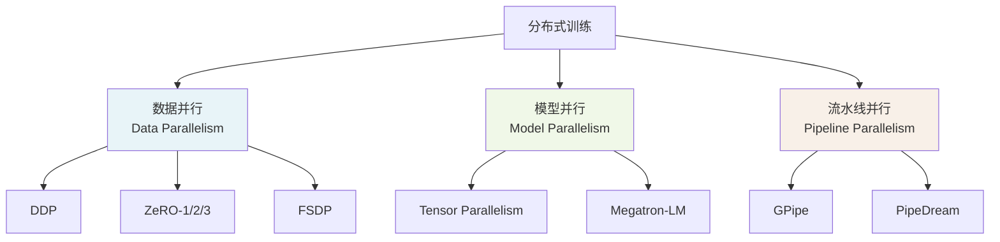
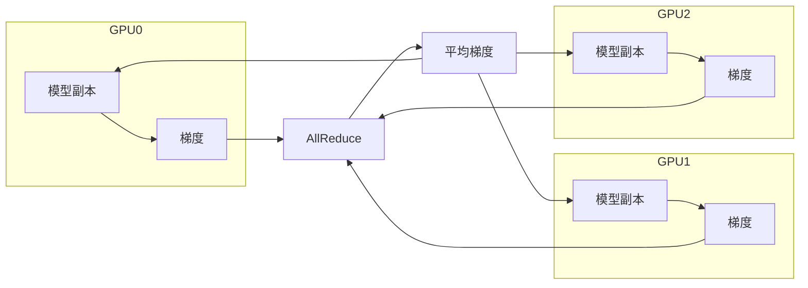
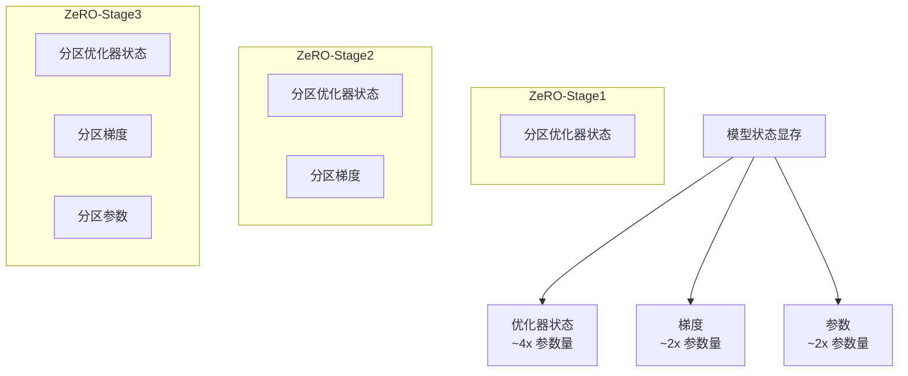
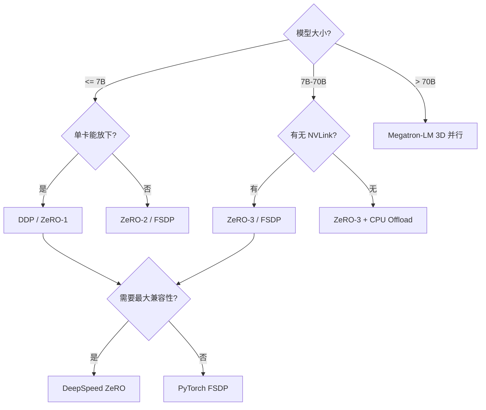

# 分布式训练与 DeepSpeed

7B 模型全参微调需要约 28GB 显存（仅参数），加上梯度和优化器状态，单张 A100 80GB 也捉襟见肘。分布式训练把显存和计算分摊到多张卡甚至多台机器上，使得大模型训练成为可能。本文覆盖并行策略、DeepSpeed ZeRO、FSDP、多卡多机配置以及显存优化技巧。

## 分布式训练全景



---

## 1. 并行策略详解

### 数据并行（Data Parallelism）

每张卡持有完整模型副本，但处理不同的数据批次。梯度在所有卡间同步（AllReduce）后更新参数。



**优点**：实现简单，近乎线性加速。**限制**：每张卡必须装下完整模型。

### 模型并行（Tensor Parallelism）

将模型的权重矩阵切分到多张卡上，每张卡只持有部分参数。典型实现：Megatron-LM 的列并行和行并行。

```mermaid
flowchart TD
    A[线性层 Y = XW] --> B[列并行]
    A --> C[行并行]

    B --> B1[GPU0: W1<br/>Y1 = XW1]
    B --> B2[GPU1: W2<br/>Y2 = XW2]
    B1 --> B3[拼接 Y = [Y1, Y2]]

    C --> C1[GPU0: W1<br/>Y1 = X1W1]
    C --> C2[GPU1: W2<br/>Y2 = X2W2]
    C1 --> C3[求和 Y = Y1 + Y2]
```

**优点**：突破单卡显存限制。**限制**：通信量大，需要高带宽互联（NVLink）。

### 流水线并行（Pipeline Parallelism）

将模型按层切分到不同卡上，形成流水线。微批次（micro-batch）依次通过各阶段。

**优点**：减少通信量。**限制**：存在气泡（bubble），GPU 利用率不如数据并行。

### 并行策略对比

| 策略 | 切分对象 | 通信模式 | 显存节省 | 适用场景 |
|------|---------|---------|---------|---------|
| 数据并行 | 数据 | AllReduce（梯度） | 无 | 模型能放进单卡 |
| Tensor 并行 | 权重 | AllReduce（激活） | 显著 | 单机多卡 NVLink |
| 流水线并行 | 层 | 点对点（激活） | 显著 | 超大模型多机 |
| ZeRO | 优化器/梯度/参数 | AllGather/ReduceScatter | 逐步增加 | 通用大模型训练 |
| 3D 并行 | 以上组合 | 混合 | 最大 | 千亿参数训练 |

---

## 2. DeepSpeed ZeRO

ZeRO（Zero Redundancy Optimizer）通过消除数据并行中的冗余状态来节省显存。

### ZeRO 三阶段



| 阶段 | 分区内容 | 显存节省（N 卡） | 通信量 | 适用场景 |
|------|---------|-----------------|--------|---------|
| ZeRO-1 | 优化器状态 | ~4x | 与 DDP 相同 | 快速开始，低通信开销 |
| ZeRO-2 | 优化器状态 + 梯度 | ~4x + ~2x | 略增 | 大 batch 训练 |
| ZeRO-3 | 优化器状态 + 梯度 + 参数 | ~4x + ~2x + ~2x | 显著增加 | 超大模型（>13B） |

**7B 模型显存估算（AdamW, fp32 优化器状态）**：

| 配置 | 每卡显存 |
|------|---------|
| DDP | ~112GB（不可行） |
| ZeRO-1 (8卡) | ~36GB |
| ZeRO-2 (8卡) | ~24GB |
| ZeRO-3 (8卡) | ~16GB |

### DeepSpeed 配置文件

```json
{
    "bf16": {
        "enabled": true
    },
    "zero_optimization": {
        "stage": 3,
        "offload_optimizer": {
            "device": "cpu",
            "pin_memory": true
        },
        "offload_param": {
            "device": "cpu",
            "pin_memory": true
        },
        "overlap_comm": true,
        "contiguous_gradients": true,
        "sub_group_size": 1e9,
        "reduce_bucket_size": "auto",
        "stage3_prefetch_bucket_size": "auto",
        "stage3_param_persistence_threshold": "auto",
        "stage3_max_live_parameters": 1e9,
        "stage3_max_reuse_distance": 1e9,
        "stage3_gather_16bit_weights_on_model_save": true
    },
    "gradient_accumulation_steps": 8,
    "gradient_clipping": 1.0,
    "train_batch_size": "auto",
    "train_micro_batch_size_per_gpu": "auto",
    "steps_per_print": 10,
    "wall_clock_breakdown": false,
    "checkpoint": {
        "tag_validation": "warn",
        "load_universal": false
    }
}
```

### 配置文件详解

| 字段 | 说明 | 调参建议 |
|------|------|---------|
| `bf16.enabled` | 启用 BF16 混合精度 | A100/H100 开启，V100 用 fp16 |
| `stage` | ZeRO 阶段 | 小模型 1/2，大模型 3 |
| `offload_optimizer.device` | 优化器卸载设备 | cpu 可省显存但慢，none 更快 |
| `offload_param.device` | 参数卸载设备 | ZeRO-3 + CPU offload 可训极大模型 |
| `overlap_comm` | 通信与计算重叠 | 几乎总应开启 |
| `contiguous_gradients` | 梯度连续内存 | 减少内存碎片，应开启 |
| `reduce_bucket_size` | AllReduce 分桶大小 | 影响通信效率，auto 通常够用 |
| `stage3_gather_16bit_weights_on_model_save` | 保存时聚合权重 | 保存完整 checkpoint 需开启 |

---

## 3. FSDP（Fully Sharded Data Parallel）

PyTorch 原生的全分片数据并行，功能类似 ZeRO-3。

### FSDP vs ZeRO-3

| 维度 | DeepSpeed ZeRO-3 | PyTorch FSDP |
|------|-----------------|-------------|
| 实现层级 | 框架级（DeepSpeed） | 原生 PyTorch |
| 易用性 | 配置文件驱动 | 代码内 API |
| 生态集成 | HuggingFace / TRL | PyTorch 原生 |
| CPU Offload | 支持 | 支持 |
| 混合精度 | BF16/FP16 | BF16/FP16 |
| Checkpoint | DeepSpeed 格式 | PyTorch 原生 |
| 调试 | 较难 | 较易 |
| 社区支持 | HuggingFace 生态 | PyTorch 生态 |

### FSDP 训练脚本

```python
"""FSDP 全参微调脚本"""
import torch
from torch.distributed.fsdp import (
    FullyShardedDataParallel as FSDP,
    MixedPrecision,
    ShardingStrategy,
    CPUOffload,
)
from torch.distributed.fsdp.wrap import (
    transformer_auto_wrap_policy,
)
from transformers import AutoModelForCausalLM, AutoTokenizer, get_scheduler
from datasets import Dataset


def setup_fsdp():
    """初始化分布式环境"""
    import torch.distributed as dist
    dist.init_process_group("nccl")
    local_rank = int(os.environ["LOCAL_RANK"])
    torch.cuda.set_device(local_rank)


def train_with_fsdp():
    import os
    setup_fsdp()
    local_rank = int(os.environ["LOCAL_RANK"])

    model_name = "Qwen/Qwen2.5-7B"

    # 混合精度策略
    bf16_policy = MixedPrecision(
        param_dtype=torch.bfloat16,
        reduce_dtype=torch.bfloat16,
        buffer_dtype=torch.bfloat16,
    )

    # 加载模型
    from transformers.models.qwen2.modeling_qwen2 import Qwen2DecoderLayer

    model = AutoModelForCausalLM.from_pretrained(
        model_name,
        torch_dtype=torch.bfloat16,
        device_map={"": local_rank},
    )

    # FSDP 包装策略：按 DecoderLayer 分片
    auto_wrap_policy = transformer_auto_wrap_policy(
        transformer_layer_cls={Qwen2DecoderLayer}
    )

    model = FSDP(
        model,
        sharding_strategy=ShardingStrategy.FULL_SHARD,  # 等价 ZeRO-3
        mixed_precision=bf16_policy,
        auto_wrap_policy=auto_wrap_policy,
        device_id=local_rank,
        # CPU Offload（可选，进一步省显存）
        # cpu_offload=CPUOffload(offload_params=True),
    )

    tokenizer = AutoTokenizer.from_pretrained(model_name)

    # 优化器（FSDP 要求在包装后创建）
    optimizer = torch.optim.AdamW(
        model.parameters(),
        lr=2e-5,
        weight_decay=0.01,
        betas=(0.9, 0.999),
    )

    # 训练循环
    model.train()
    for step in range(1000):
        # 构造输入（实际从 dataloader 获取）
        inputs = tokenizer("示例文本", return_tensors="pt").to(f"cuda:{local_rank}")

        outputs = model(**inputs)
        loss = outputs.loss / 8  # gradient_accumulation
        loss.backward()

        if (step + 1) % 8 == 0:
            torch.nn.utils.clip_grad_norm_(model.parameters(), 1.0)
            optimizer.step()
            optimizer.zero_grad()

        if local_rank == 0 and step % 10 == 0:
            print(f"Step {step}, Loss: {loss.item():.4f}")

    # 保存 checkpoint
    from torch.distributed.fsdp import FullStateDictConfig, StateDictType
    save_cfg = FullStateDictConfig(offload_to_cpu=True, rank0_only=True)
    with FSDP.state_dict_type(model, StateDictType.FULL_STATE_DICT, save_cfg):
        state_dict = model.state_dict()
    if local_rank == 0:
        torch.save(state_dict, "./fsdp_model/model.pt")


if __name__ == "__main__":
    train_with_fsdp()
```

---

## 4. 多卡多机训练配置

### torchrun 启动

```bash
# 单机多卡
torchrun \
    --nproc_per_node=4 \
    train.py

# 多机多卡（在每台机器上分别执行）
# 主节点
torchrun \
    --nproc_per_node=8 \
    --nnodes=2 \
    --node_rank=0 \
    --master_addr=192.168.1.1 \
    --master_port=29500 \
    train.py

# 工作节点
torchrun \
    --nproc_per_node=8 \
    --nnodes=2 \
    --node_rank=1 \
    --master_addr=192.168.1.1 \
    --master_port=29500 \
    train.py
```

### DeepSpeed 启动器

```bash
# 单机多卡
deepspeed --num_gpus=4 train.py \
    --deepspeed ds_config.json

# 单机多卡 + 指定 GPU
deepspeed --include localhost:0,1,2,3 train.py \
    --deepspeed ds_config.json

# 多机多卡
deepspeed --num_gpus=8 --num_nodes=2 \
    --hostfile hostfile \
    train.py \
    --deepspeed ds_config.json
```

### hostfile 格式

```
192.168.1.1 slots=8
192.168.1.2 slots=8
```

### DeepSpeed 训练脚本

```python
"""DeepSpeed 全参微调脚本"""
import argparse
import os

import torch
from datasets import Dataset
from transformers import (
    AutoModelForCausalLM,
    AutoTokenizer,
    Trainer,
    TrainingArguments,
)


def parse_args():
    parser = argparse.ArgumentParser()
    parser.add_argument("--deepspeed", type=str, required=True)
    parser.add_argument("--model_name", type=str, default="Qwen/Qwen2.5-7B")
    parser.add_argument("--output_dir", type=str, default="./output")
    parser.add_argument("--epochs", type=int, default=3)
    parser.add_argument("--batch_size", type=int, default=4)
    parser.add_argument("--learning_rate", type=float, default=2e-5)
    parser.add_argument("--max_seq_length", type=int, default=2048)
    return parser.parse_args()


def main():
    args = parse_args()
    local_rank = int(os.environ.get("LOCAL_RANK", 0))

    tokenizer = AutoTokenizer.from_pretrained(args.model_name)
    if tokenizer.pad_token is None:
        tokenizer.pad_token = tokenizer.eos_token

    model = AutoModelForCausalLM.from_pretrained(
        args.model_name,
        torch_dtype=torch.bfloat16,
    )

    # 训练参数
    training_args = TrainingArguments(
        output_dir=args.output_dir,
        num_train_epochs=args.epochs,
        per_device_train_batch_size=args.batch_size,
        gradient_accumulation_steps=8,
        learning_rate=args.learning_rate,
        lr_scheduler_type="cosine",
        warmup_ratio=0.03,
        bf16=True,
        logging_steps=10,
        save_strategy="steps",
        save_steps=500,
        save_total_limit=3,
        deepspeed=args.deepspeed,
        gradient_checkpointing=True,
        report_to="tensorboard",
    )

    # 加载数据
    from datasets import load_dataset
    dataset = load_dataset("json", data_files="train.jsonl", split="train")

    def tokenize(example):
        full_text = example["text"]
        return tokenizer(
            full_text,
            truncation=True,
            max_length=args.max_seq_length,
            padding=False,
        )

    tokenized = dataset.map(tokenize, remove_columns=dataset.column_names)

    trainer = Trainer(
        model=model,
        args=training_args,
        train_dataset=tokenized,
        tokenizer=tokenizer,
    )

    trainer.train()
    trainer.save_model(args.output_dir)


if __name__ == "__main__":
    main()
```

```bash
# 启动训练
deepspeed --num_gpus=8 train_deepspeed.py \
    --deepspeed ds_config_zero3.json \
    --model_name Qwen/Qwen2.5-7B \
    --output_dir ./output \
    --epochs 3 \
    --batch_size 2
```

---

## 5. 梯度检查点与混合精度

### 梯度检查点（Gradient Checkpointing）

用计算换显存：不保存中间激活，反向传播时重新计算。

```python
# HuggingFace 中启用
from transformers import AutoModelForCausalLM

model = AutoModelForCausalLM.from_pretrained(
    "Qwen/Qwen2.5-7B",
    torch_dtype=torch.bfloat16,
    gradient_checkpointing=True,  # 启用梯度检查点
)

# 自定义梯度检查点
import torch.utils.checkpoint as checkpoint

class CheckpointedBlock(torch.nn.Module):
    def forward(self, x):
        # 使用 checkpoint 包裹前向计算
        return checkpoint.checkpoint(self._forward, x, use_reentrant=False)

    def _forward(self, x):
        # 实际前向计算
        return self.layer(x)
```

| 配置 | 7B 模型显存 | 训练速度 |
|------|-----------|---------|
| 无检查点 | ~60GB | 基线 |
| 梯度检查点 | ~30GB | 慢 ~25% |
| 检查点 + ZeRO-3 | ~16GB | 慢 ~40% |

### 混合精度训练

| 精度格式 | 每参数位宽 | 数值范围 | 硬件要求 | 适用场景 |
|---------|-----------|---------|---------|---------|
| FP32 | 32 bit | 最大 | 通用 | 优化器状态 |
| BF16 | 16 bit | 与 FP32 相同 | Ampere+ (A100) | 训练首选 |
| FP16 | 16 bit | 较小 | Volta+ (V100) | 需要损失缩放 |
| FP8 | 8 bit | 较小 | Hopper (H100) | 推理 / 实验性训练 |

---

## 6. 故障恢复

### Checkpoint 保存与恢复

```python
"""DeepSpeed Checkpoint 管理"""
import os
from pathlib import Path


def save_deepspeed_checkpoint(trainer, output_dir: str, step: int):
    """保存 DeepSpeed checkpoint"""
    checkpoint_dir = os.path.join(output_dir, f"checkpoint-{step}")

    # DeepSpeed 会自动保存分片 checkpoint
    # 每个进程保存自己的分片
    trainer.save_model(checkpoint_dir)

    # 保存训练状态（优化器、调度器、随机种子）
    trainer.save_state()

    print(f"Checkpoint saved at step {step}: {checkpoint_dir}")


def resume_from_checkpoint(trainer, checkpoint_dir: str):
    """从 checkpoint 恢复训练"""
    if not Path(checkpoint_dir).exists():
        raise FileNotFoundError(f"Checkpoint not found: {checkpoint_dir}")

    trainer.train(resume_from_checkpoint=checkpoint_dir)
    print(f"Resumed training from: {checkpoint_dir}")


# TrainingArguments 中配置自动保存
training_args = TrainingArguments(
    output_dir="./output",
    save_strategy="steps",
    save_steps=500,
    save_total_limit=3,  # 只保留最近 3 个 checkpoint
    load_best_model_at_end=False,  # DeepSpeed 不支持
)


# 处理训练中断
import signal


class GracefulKiller:
    """捕获终止信号，优雅保存 checkpoint"""

    def __init__(self, trainer, output_dir: str):
        self.trainer = trainer
        self.output_dir = output_dir
        self.kill_now = False
        signal.signal(signal.SIGINT, self.exit_gracefully)
        signal.signal(signal.SIGTERM, self.exit_gracefully)

    def exit_gracefully(self, signum, frame):
        print(f"\nReceived signal {signum}, saving checkpoint...")
        self.kill_now = True
        # 保存紧急 checkpoint
        save_deepspeed_checkpoint(
            self.trainer, self.output_dir, step=0
        )


# 恢复脚本
# bash
# deepspeed --num_gpus=8 train.py \
#     --deepspeed ds_config.json \
#     --resume_from_checkpoint ./output/checkpoint-500
```

---

## 7. ZeRO vs FSDP vs Megatron 对比

| 维度 | ZeRO-1/2 | ZeRO-3 | FSDP | Megatron-LM |
|------|----------|--------|------|------------|
| **并行方式** | 数据并行 | 数据并行 | 数据并行 | 3D 并行 |
| **显存节省** | 中 | 高 | 高 | 最高 |
| **通信开销** | 低 | 高 | 高 | 中（NVLink 友好） |
| **代码侵入** | 低（配置文件） | 低 | 中（API 包装） | 高（需改模型代码） |
| **HuggingFace 兼容** | 好 | 好 | 中 | 差 |
| **调试难度** | 中 | 中 | 较低 | 高 |
| **适合规模** | 7B-13B | 7B-70B | 7B-70B | 70B+ |
| **适合硬件** | 单机多卡 | 单机/多机 | 单机/多机 | 多机集群 |
| **维护方** | Microsoft | Microsoft | PyTorch 团队 | NVIDIA |

### 选择决策



---

## 8. 显存优化技巧与常见报错

### 显存优化清单

| 技巧 | 节省显存 | 速度影响 | 实现方式 |
|------|---------|---------|---------|
| BF16 混合精度 | ~50% | 几乎无 | `torch_dtype=torch.bfloat16` |
| 梯度检查点 | ~40% | 慢 ~25% | `gradient_checkpointing=True` |
| ZeRO-3 | 随卡数线性 | 通信开销 | `deepspeed` 配置 |
| CPU Offload | 显著 | 慢 2-3x | `offload_optimizer` + `offload_param` |
| 减小 batch size | 线性 | 无 | `per_device_train_batch_size` |
| 梯度累积 | 无（等价大 batch） | 无 | `gradient_accumulation_steps` |
| Flash Attention 2 | ~30% | 快 ~15% | `attn_implementation="flash_attention_2"` |

### 常见报错与解决方案

| 报错 | 原因 | 解决方案 |
|------|------|---------|
| `CUDA out of memory` | 显存不足 | 降低 batch size、启用梯度检查点、使用 ZeRO-3 |
| `RuntimeError: Expected all tensors on the same device` | 张量设备不一致 | 检查 `device_map`、确保所有张量在同一 GPU |
| `DeepSpeed not found` | 未安装 DeepSpeed | `pip install deepspeed` |
| `NCCL error` | 多卡通信失败 | 检查 NVLink/网络、设置 `NCCL_DEBUG=INFO` |
| `optimizer type AdamW is not supported` | 与 ZeRO-3 不兼容 | 使用 `torch.optim.AdamW` 替代 |
| `ValueError: You are trying to save a non-float16 model` | ZeRO-3 保存限制 | 设置 `stage3_gather_16bit_weights_on_model_save: true` |
| `inf/nan in loss` | 训练不稳定 | 降低学习率、检查数据、启用梯度裁剪 |
| `Timeout in broadcast` | 多机同步超时 | 增大 `DDP_TIMEOUT`、检查网络 |

### 调试技巧

```bash
# 查看显存使用
nvidia-smi --query-gpu=memory.used,memory.total --format=csv -l 5

# NCCL 调试
NCCL_DEBUG=INFO deepspeed --num_gpus=4 train.py --deepspeed ds_config.json

# 查看进程占用
fuser -v /dev/nvidia*

# 强制清理 GPU 缓存
python -c "import torch; torch.cuda.empty_cache()"

# 设置 PyTorch CUDA 分配器
PYTORCH_CUDA_ALLOC_CONF=max_split_size_mb:128 deepspeed --num_gpus=4 train.py
```

---

## 实践建议

1. **先跑通单卡，再扩展多卡**：单卡验证逻辑正确后再上分布式
2. **从 ZeRO-2 开始**：ZeRO-3 通信开销大，ZeRO-2 通常够用且更快
3. **BF16 > FP16**：A100/H100 上 BF16 无需损失缩放，更稳定
4. **梯度检查点必开**：全参微调几乎必须开启，25% 的速度换 40% 的显存
5. **CPU Offload 是最后手段**：只在显存实在不够时才用，速度损失显著
6. **监控显存峰值**：训练初期密切监控，确保不会在某个步骤 OOM
7. **定期保存 checkpoint**：大模型训练耗时长，中断后恢复成本高
