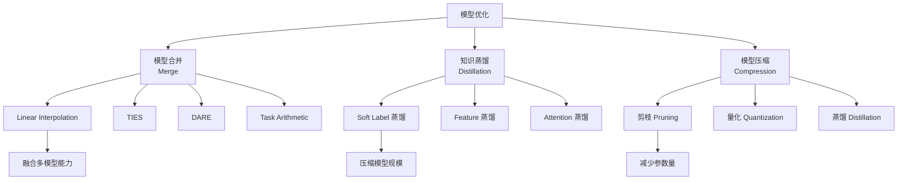
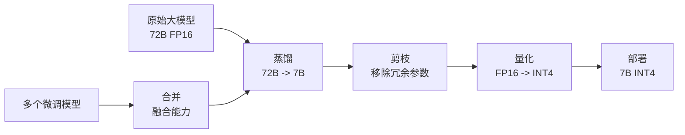
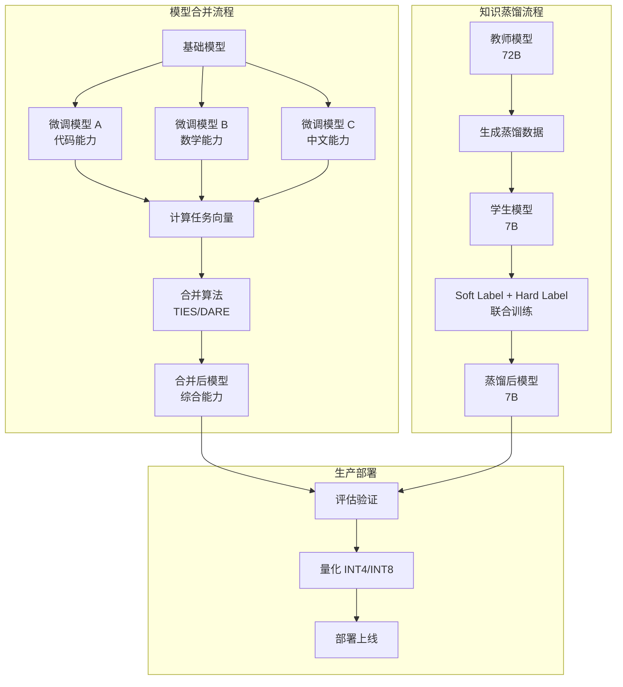

# 模型合并与蒸馏

微调出的多个专家模型如何整合？大模型如何压缩到可部署的规模？模型合并和知识蒸馏是两个不同但互补的技术：合并把多个模型的能力融合为一个，蒸馏把大模型的知识迁移到小模型。本文覆盖主流合并方法、mergekit 工具、蒸馏技术以及生产环境中的模型管理策略。

## 模型合并与蒸馏全景



---

## 1. 模型合并方法

模型合并的核心问题：多个微调模型的参数如何组合，使得合并后的模型兼具各模型的能力，且不破坏基础能力。

### Linear Interpolation（线性插值）

最简单的方法：对多个模型的参数做加权平均。

$$\theta_{merged} = \sum_{i=1}^{N} w_i \cdot \theta_i$$

```python
"""线性插值合并"""
import torch
from pathlib import Path


def linear_merge(
    model_paths: list[str | Path],
    weights: list[float],
    output_path: str | Path,
) -> None:
    """
    线性插值合并多个模型

    Args:
        model_paths: 模型路径列表
        weights: 权重列表（自动归一化）
        output_path: 输出路径
    """
    assert len(model_paths) == len(weights), "模型数量与权重数量不匹配"

    # 归一化权重
    total = sum(weights)
    weights = [w / total for w in weights]

    # 加载第一个模型作为基础
    state_dicts = []
    for path in model_paths:
        sd = torch.load(Path(path) / "pytorch_model.bin", map_location="cpu")
        state_dicts.append(sd)

    # 加权平均
    merged = {}
    for key in state_dicts[0].keys():
        tensors = [sd[key].float() for sd in state_dicts]
        merged[key] = sum(w * t for w, t in zip(weights, tensors))

    # 保存
    output_path = Path(output_path)
    output_path.mkdir(parents=True, exist_ok=True)
    torch.save(merged, output_path / "pytorch_model.bin")
    print(f"Merged model saved to {output_path}")
```

**优点**：简单、快速。**缺点**：直接平均可能导致能力互相干扰，对差异大的模型效果差。

### Task Arithmetic（任务算术）

通过任务向量（Task Vector）进行合并。任务向量 = 微调模型参数 - 基础模型参数。

$$\tau_i = \theta_i^{finetuned} - \theta_{base}$$
$$\theta_{merged} = \theta_{base} + \sum_{i=1}^{N} w_i \cdot \tau_i$$

```python
"""Task Arithmetic 合并"""
import torch
from pathlib import Path


def task_arithmetic_merge(
    base_model_path: str | Path,
    finetuned_paths: list[str | Path],
    task_weights: list[float],
    output_path: str | Path,
) -> None:
    """
    Task Arithmetic 合并

    Args:
        base_model_path: 基础模型路径
        finetuned_paths: 微调模型路径列表
        task_weights: 各任务向量的权重
        output_path: 输出路径
    """
    # 加载基础模型
    base_sd = torch.load(
        Path(base_model_path) / "pytorch_model.bin", map_location="cpu"
    )

    # 计算各任务向量并加权合并
    merged_task_vector = {}
    for ft_path, weight in zip(finetuned_paths, task_weights):
        ft_sd = torch.load(Path(ft_path) / "pytorch_model.bin", map_location="cpu")
        for key in base_sd.keys():
            task_vector = ft_sd[key].float() - base_sd[key].float()
            if key not in merged_task_vector:
                merged_task_vector[key] = torch.zeros_like(task_vector)
            merged_task_vector[key] += weight * task_vector

    # 合并：基础模型 + 加权任务向量
    merged = {}
    for key in base_sd.keys():
        merged[key] = base_sd[key].float() + merged_task_vector.get(key, 0)

    output_path = Path(output_path)
    output_path.mkdir(parents=True, exist_ok=True)
    torch.save(merged, output_path / "pytorch_model.bin")
```

**优点**：保留基础能力，任务能力增强更可控。**缺点**：需要基础模型作为参考点。

### TIES（TrIm, Elect, Sign）

TIES 解决了合并时的干扰问题：只保留每个任务向量中最显著的参数变化。

1. **Trim**：只保留每个任务向量中绝对值最大的 Top-K% 参数，其余置零
2. **Elect**：对每个参数位置，选择多数任务向量符号一致的方向
3. **Sign**：按选举结果合并非零参数

```python
"""TIES 合并"""
import torch
from pathlib import Path


def ties_merge(
    base_model_path: str | Path,
    finetuned_paths: list[str | Path],
    task_weights: list[float],
    output_path: str | Path,
    density: float = 0.2,  # 保留 Top 20% 的参数
) -> None:
    """
    TIES 合并：Trim + Elect + Sign

    Args:
        density: 保留参数的比例（0-1）
    """
    base_sd = torch.load(
        Path(base_model_path) / "pytorch_model.bin", map_location="cpu"
    )

    # 1. 计算任务向量
    task_vectors = []
    for ft_path in finetuned_paths:
        ft_sd = torch.load(Path(ft_path) / "pytorch_model.bin", map_location="cpu")
        tv = {}
        for key in base_sd.keys():
            tv[key] = ft_sd[key].float() - base_sd[key].float()
        task_vectors.append(tv)

    merged = {}
    for key in base_sd.keys():
        vectors = [tv[key] for tv in task_vectors]

        # 2. Trim：保留每个向量中 Top-K% 的参数
        trimmed_vectors = []
        for v in vectors:
            flat = v.flatten()
            k = int(flat.numel() * density)
            # 直接使用 topk 索引，避免 threshold 方式在 ties 时选错数量
            _, top_indices = torch.topk(v.abs().flatten(), k, largest=True)
            mask = torch.zeros_like(v, dtype=torch.bool).flatten()
            mask[top_indices] = True
            mask = mask.view(v.shape)
            trimmed = v * mask.float()
            trimmed_vectors.append(trimmed)

        # 3. Elect：对每个位置，选择多数符号一致的方向
        signs = torch.stack([torch.sign(tv) for tv in trimmed_vectors])
        # 多数投票
        elected_sign = torch.sign(signs.sum(dim=0))

        # 4. Sign 合并：只保留与选举符号一致的值
        merged_tv = torch.zeros_like(vectors[0])
        for tv, weight in zip(trimmed_vectors, task_weights):
            # 只保留与选举方向一致的参数
            consistent_mask = (torch.sign(tv) == elected_sign).float()
            merged_tv += weight * tv * consistent_mask

        merged[key] = base_sd[key].float() + merged_tv

    output_path = Path(output_path)
    output_path.mkdir(parents=True, exist_ok=True)
    torch.save(merged, output_path / "pytorch_model.bin")
```

### DARE（Drop And Rescale）

DARE 的核心思想：随机丢弃大部分任务向量参数（置零），然后对保留的参数放大以补偿。

1. 随机以概率 $p$ 丢弃每个任务向量参数
2. 将保留的参数乘以 $1/(1-p)$ 进行缩放

```python
"""DARE 合并"""
import torch
from pathlib import Path


def dare_merge(
    base_model_path: str | Path,
    finetuned_paths: list[str | Path],
    task_weights: list[float],
    output_path: str | Path,
    drop_rate: float = 0.9,  # 丢弃 90% 的参数
    seed: int = 42,
) -> None:
    """
    DARE 合并：Drop And Rescale

    Args:
        drop_rate: 参数丢弃概率
    """
    torch.manual_seed(seed)
    base_sd = torch.load(
        Path(base_model_path) / "pytorch_model.bin", map_location="cpu"
    )

    task_vectors = []
    for ft_path in finetuned_paths:
        ft_sd = torch.load(Path(ft_path) / "pytorch_model.bin", map_location="cpu")
        tv = {}
        for key in base_sd.keys():
            tv[key] = ft_sd[key].float() - base_sd[key].float()
        task_vectors.append(tv)

    merged = {}
    for key in base_sd.keys():
        rescaled_vectors = []
        for tv in task_vectors:
            v = tv[key]
            # 随机丢弃
            mask = torch.bernoulli(torch.full_like(v, 1 - drop_rate))
            # 重新缩放
            rescaled = v * mask / (1 - drop_rate)
            rescaled_vectors.append(rescaled)

        # 加权求和
        merged_tv = sum(w * v for w, v in zip(task_weights, rescaled_vectors))
        merged[key] = base_sd[key].float() + merged_tv

    output_path = Path(output_path)
    output_path.mkdir(parents=True, exist_ok=True)
    torch.save(merged, output_path / "pytorch_model.bin")
```

### 合并方法对比

| 方法 | 核心思路 | 抗干扰 | 实现难度 | 适用场景 |
|------|---------|--------|---------|---------|
| Linear Interpolation | 加权平均 | 弱 | 极低 | 同架构、同数据分布 |
| Task Arithmetic | 基础模型 + 任务向量 | 中 | 低 | 不同任务的微调模型 |
| TIES | 稀疏化 + 符号选举 | 强 | 中 | 多任务合并、参数冲突大 |
| DARE | 随机丢弃 + 重缩放 | 强 | 低 | 快速实验、替代 TIES |

---

## 2. mergekit 配置与使用

mergekit 是最流行的模型合并工具，支持上述所有方法。

### 安装

```bash
pip install mergekit
```

### 配置文件

#### SLERP 合并（球面线性插值，比线性插值更平滑）

```yaml
# merge_slerp.yaml
models:
  - model: Qwen/Qwen2.5-7B
    # 基础模型，无额外参数
  - model: ./models/qwen2.5-7b-code
    parameters:
      density: 0.5
      weight: 0.6
  - model: ./models/qwen2.5-7b-math
    parameters:
      density: 0.5
      weight: 0.4
merge_method: slerp
base_model: Qwen/Qwen2.5-7B
parameters:
  t:  # SLERP 插值系数
    - filter: self_attn
      value: 0.6
    - filter: mlp
      value: 0.5
    - value: 0.5  # 默认值
dtype: bfloat16
```

#### TIES 合并

```yaml
# merge_ties.yaml
models:
  - model: Qwen/Qwen2.5-7B
  - model: ./models/qwen2.5-7b-code
    parameters:
      density: 0.25
      weight: 0.5
  - model: ./models/qwen2.5-7b-math
    parameters:
      density: 0.25
      weight: 0.5
  - model: ./models/qwen2.5-7b-chinese
    parameters:
      density: 0.25
      weight: 0.3
merge_method: ties
base_model: Qwen/Qwen2.5-7B
parameters:
  density: 0.25
  weight: 1.0
dtype: bfloat16
```

#### DARE 合并

```yaml
# merge_dare.yaml
models:
  - model: Qwen/Qwen2.5-7B
  - model: ./models/qwen2.5-7b-code
    parameters:
      weight: 0.6
  - model: ./models/qwen2.5-7b-math
    parameters:
      weight: 0.4
merge_method: dare_ties
base_model: Qwen/Qwen2.5-7B
parameters:
  int8_mask: true
dtype: bfloat16
```

### 执行合并

```bash
# 基本用法
mergekit-yaml merge_ties.yaml ./merged_model

# 指定 GPU（大模型合并可能需要）
CUDA_VISIBLE_DEVICES=0 mergekit-yaml merge_ties.yaml ./merged_model

# 复制 tokenizer 等非权重文件
mergekit-yaml merge_ties.yaml ./merged_model --copy-tokenizer

# 验证合并结果
python -c "
from transformers import AutoModelForCausalLM, AutoTokenizer
model = AutoModelForCausalLM.from_pretrained('./merged_model', device_map='auto')
tokenizer = AutoTokenizer.from_pretrained('./merged_model')
inputs = tokenizer('Hello, world!', return_tensors='pt').to(model.device)
outputs = model.generate(**inputs, max_new_tokens=50)
print(tokenizer.decode(outputs[0]))
"
```

---

## 3. 知识蒸馏

知识蒸馏的核心思想：用大模型（教师）的输出指导小模型（学生）的训练。

### 蒸馏方法对比

| 方法 | 蒸馏信号 | 优点 | 缺点 |
|------|---------|------|------|
| Soft Label 蒸馏 | 教师输出概率分布 | 信息量丰富 | 需要 teacher 推理 |
| Feature 蒸馏 | 中间层特征表示 | 迁移内部知识 | 需要访问中间层 |
| Attention 蒸馏 | 注意力分布 | 迁移推理模式 | 结构需匹配 |

### Soft Label 蒸馏

学生的损失函数包含两部分：硬标签损失（标准交叉熵）和软标签损失（与教师输出的 KL 散度）。

$$\mathcal{L} = \alpha \cdot \mathcal{L}_{CE}(y, \hat{y}_s) + (1-\alpha) \cdot T^2 \cdot \mathcal{L}_{KL}(\sigma(z_t/T), \sigma(z_s/T))$$

```python
"""Soft Label 蒸馏训练"""
import torch
import torch.nn.functional as F
from transformers import AutoModelForCausalLM, AutoTokenizer
from datasets import Dataset


class DistillationTrainer:
    """知识蒸馏训练器"""

    def __init__(
        self,
        teacher_model_name: str,
        student_model_name: str,
        temperature: float = 2.0,
        alpha: float = 0.5,
        learning_rate: float = 5e-5,
    ):
        self.temperature = temperature
        self.alpha = alpha

        # 加载教师模型（冻结）
        self.teacher = AutoModelForCausalLM.from_pretrained(
            teacher_model_name,
            torch_dtype=torch.bfloat16,
            device_map="auto",
        )
        self.teacher.eval()
        for param in self.teacher.parameters():
            param.requires_grad = False

        # 加载学生模型
        self.student = AutoModelForCausalLM.from_pretrained(
            student_model_name,
            torch_dtype=torch.bfloat16,
            device_map="auto",
        )

        self.tokenizer = AutoTokenizer.from_pretrained(teacher_model_name)
        self.optimizer = torch.optim.AdamW(
            self.student.parameters(), lr=learning_rate
        )

    def distillation_loss(
        self,
        student_logits: torch.Tensor,
        teacher_logits: torch.Tensor,
        labels: torch.Tensor,
    ) -> torch.Tensor:
        """
        计算蒸馏损失

        Args:
            student_logits: 学生模型 logits
            teacher_logits: 教师模型 logits
            labels: 真实标签
        """
        T = self.temperature

        # 软标签损失：KL 散度
        soft_loss = F.kl_div(
            input=F.log_softmax(student_logits / T, dim=-1),
            target=F.softmax(teacher_logits / T, dim=-1),
            reduction="batchmean",
        ) * (T * T)

        # 硬标签损失：交叉熵
        hard_loss = F.cross_entropy(
            student_logits.view(-1, student_logits.size(-1)),
            labels.view(-1),
            ignore_index=-100,
        )

        return self.alpha * hard_loss + (1 - self.alpha) * soft_loss

    def train_step(self, batch: dict) -> float:
        """单个训练步"""
        input_ids = batch["input_ids"]
        attention_mask = batch["attention_mask"]
        labels = batch.get("labels", input_ids)

        # 教师推理（无梯度）
        with torch.no_grad():
            teacher_outputs = self.teacher(
                input_ids=input_ids,
                attention_mask=attention_mask,
            )
            teacher_logits = teacher_outputs.logits

        # 学生推理
        student_outputs = self.student(
            input_ids=input_ids,
            attention_mask=attention_mask,
        )
        student_logits = student_outputs.logits

        # 计算损失
        loss = self.distillation_loss(student_logits, teacher_logits, labels)

        # 反向传播
        self.optimizer.zero_grad()
        loss.backward()
        torch.nn.utils.clip_grad_norm_(self.student.parameters(), 1.0)
        self.optimizer.step()

        return loss.item()

    def train(
        self,
        dataset: Dataset,
        num_epochs: int = 3,
        batch_size: int = 4,
    ):
        """完整训练循环"""
        from torch.utils.data import DataLoader

        def collate_fn(features):
            return {
                "input_ids": torch.nn.utils.rnn.pad_sequence(
                    [torch.tensor(f["input_ids"]) for f in features],
                    batch_first=True,
                    padding_value=self.tokenizer.pad_token_id,
                ),
                "attention_mask": torch.nn.utils.rnn.pad_sequence(
                    [torch.tensor(f["attention_mask"]) for f in features],
                    batch_first=True,
                    padding_value=0,
                ),
                "labels": torch.nn.utils.rnn.pad_sequence(
                    [torch.tensor(f.get("labels", f["input_ids"])) for f in features],
                    batch_first=True,
                    padding_value=-100,
                ),
            }

        dataloader = DataLoader(
            dataset, batch_size=batch_size, shuffle=True, collate_fn=collate_fn
        )

        for epoch in range(num_epochs):
            total_loss = 0
            for step, batch in enumerate(dataloader):
                batch = {k: v.to(self.student.device) for k, v in batch.items()}
                loss = self.train_step(batch)
                total_loss += loss

                if step % 100 == 0:
                    avg_loss = total_loss / (step + 1)
                    print(f"Epoch {epoch}, Step {step}, Loss: {avg_loss:.4f}")

        # 保存学生模型
        self.student.save_pretrained("./distilled_model")
        self.tokenizer.save_pretrained("./distilled_model")
```

### Feature 蒸馏

在中间层添加损失，让学生模型的隐藏状态逼近教师模型。

```python
"""Feature 蒸馏"""
import torch
import torch.nn as nn


class FeatureDistillationLoss(nn.Module):
    """特征蒸馏损失"""

    def __init__(
        self,
        teacher_hidden_size: int,
        student_hidden_size: int,
        layer_mapping: dict[int, int],  # student_layer -> teacher_layer
    ):
        super().__init__()
        self.layer_mapping = layer_mapping

        # 投影层：将学生隐藏状态映射到教师维度
        self.projections = nn.ModuleDict({
            str(s_layer): nn.Linear(student_hidden_size, teacher_hidden_size, bias=False)
            for s_layer in layer_mapping.keys()
        })

    def forward(
        self,
        student_hidden_states: tuple[torch.Tensor, ...],
        teacher_hidden_states: tuple[torch.Tensor, ...],
    ) -> torch.Tensor:
        """
        计算特征蒸馏损失

        Args:
            student_hidden_states: 学生模型各层隐藏状态
            teacher_hidden_states: 教师模型各层隐藏状态
        """
        total_loss = 0.0
        for s_layer, t_layer in self.layer_mapping.items():
            s_hidden = student_hidden_states[s_layer]
            t_hidden = teacher_hidden_states[t_layer]

            # 投影到相同维度
            s_projected = self.projections[str(s_layer)](s_hidden)

            # 对齐序列长度（教师和学生可能不同）
            min_len = min(s_projected.size(1), t_hidden.size(1))
            s_projected = s_projected[:, :min_len, :]
            t_hidden = t_hidden[:, :min_len, :]

            # MSE 损失
            total_loss += F.mse_loss(s_projected, t_hidden.detach())

        return total_loss / len(self.layer_mapping)
```

### 蒸馏数据构造

```python
"""蒸馏数据构造"""
from dataclasses import dataclass
from typing import Any


@dataclass
class DistillSample:
    """蒸馏样本"""
    prompt: str
    teacher_response: str
    teacher_logits_path: str | None = None  # 预计算的 logits 路径
    metadata: dict[str, Any] | None = None


class DistillDataBuilder:
    """蒸馏数据构建器"""

    def __init__(self, teacher_model_name: str = "Qwen/Qwen2.5-72B"):
        from transformers import AutoModelForCausalLM, AutoTokenizer
        self.teacher = AutoModelForCausalLM.from_pretrained(
            teacher_model_name,
            torch_dtype=torch.bfloat16,
            device_map="auto",
        )
        self.tokenizer = AutoTokenizer.from_pretrained(teacher_model_name)

    def generate_teacher_responses(
        self,
        prompts: list[str],
        max_new_tokens: int = 1024,
        temperature: float = 0.7,
        num_responses_per_prompt: int = 1,
    ) -> list[DistillSample]:
        """用教师模型生成回答"""
        samples = []
        for prompt in prompts:
            inputs = self.tokenizer(prompt, return_tensors="pt").to(
                self.teacher.device
            )
            for _ in range(num_responses_per_prompt):
                outputs = self.teacher.generate(
                    **inputs,
                    max_new_tokens=max_new_tokens,
                    temperature=temperature,
                    do_sample=True,
                    top_p=0.9,
                )
                response = self.tokenizer.decode(
                    outputs[0][inputs["input_ids"].shape[1]:],
                    skip_special_tokens=True,
                )
                samples.append(DistillSample(
                    prompt=prompt,
                    teacher_response=response,
                ))
        return samples

    def generate_with_logits(
        self,
        prompts: list[str],
        max_new_tokens: int = 512,
        save_dir: str = "./distill_logits",
    ) -> list[DistillSample]:
        """生成回答并保存 logits（用于离线蒸馏）"""
        import os
        import numpy as np

        os.makedirs(save_dir, exist_ok=True)
        samples = []

        for idx, prompt in enumerate(prompts):
            inputs = self.tokenizer(prompt, return_tensors="pt").to(
                self.teacher.device
            )

            with torch.no_grad():
                outputs = self.teacher.generate(
                    **inputs,
                    max_new_tokens=max_new_tokens,
                    temperature=1.0,
                    do_sample=True,
                    output_scores=True,
                    return_dict_in_generate=True,
                )

            response = self.tokenizer.decode(
                outputs.sequences[0][inputs["input_ids"].shape[1]:],
                skip_special_tokens=True,
            )

            # 保存 logits
            logits_path = os.path.join(save_dir, f"logits_{idx:06d}.npy")
            if outputs.scores:
                logits_array = torch.stack(outputs.scores).cpu().numpy()
                np.save(logits_path, logits_array)

            samples.append(DistillSample(
                prompt=prompt,
                teacher_response=response,
                teacher_logits_path=logits_path,
            ))

        return samples
```

---

## 4. 模型压缩流程

生产中通常组合使用剪枝、量化和蒸馏。



### 剪枝 + 量化 + 蒸馏组合

| 步骤 | 方法 | 效果 | 精度损失 |
|------|------|------|---------|
| 1. 蒸馏 | Teacher-Student | 大幅缩小模型 | 中等（取决于数据量） |
| 2. 结构化剪枝 | 移除整行/整列 | 减少参数 20-50% | 中等 |
| 3. 量化 | GPTQ/AWQ/GGUF | 显存减少 75% | 低 |

---

## 5. 模型合并与蒸馏流程图



---

## 6. 生产环境中的模型管理策略

### 模型版本管理

```python
"""模型版本管理"""
from dataclasses import dataclass, field
from datetime import datetime
from enum import Enum
from pathlib import Path
from typing import Any


class ModelStage(str, Enum):
    EXPERIMENTAL = "experimental"
    STAGING = "staging"
    PRODUCTION = "production"
    DEPRECATED = "deprecated"


@dataclass
class ModelVersion:
    """模型版本信息"""
    model_id: str
    version: str
    stage: ModelStage
    base_model: str
    merge_method: str | None = None
    merge_sources: list[str] = field(default_factory=list)
    distill_teacher: str | None = None
    quantization: str | None = None
    metrics: dict[str, float] = field(default_factory=dict)
    created_at: datetime = field(default_factory=datetime.now)
    created_by: str = ""
    description: str = ""
    artifact_path: str = ""


class ModelRegistry:
    """模型注册中心"""

    def __init__(self, registry_dir: str = "./model_registry"):
        self.registry_dir = Path(registry_dir)
        self.registry_dir.mkdir(parents=True, exist_ok=True)
        self.versions: dict[str, list[ModelVersion]] = {}

    def register(self, version: ModelVersion) -> None:
        """注册模型版本"""
        if version.model_id not in self.versions:
            self.versions[version.model_id] = []
        self.versions[version.model_id].append(version)

    def get_production(self, model_id: str) -> ModelVersion | None:
        """获取生产版本"""
        versions = self.versions.get(model_id, [])
        for v in versions:
            if v.stage == ModelStage.PRODUCTION:
                return v
        return None

    def promote(self, model_id: str, version: str, stage: ModelStage) -> None:
        """提升模型版本到指定阶段"""
        for v in self.versions.get(model_id, []):
            if v.version == version:
                v.stage = stage
                return

    def list_versions(self, model_id: str) -> list[ModelVersion]:
        """列出所有版本"""
        return self.versions.get(model_id, [])
```

### 模型评估流水线

合并和蒸馏后的模型必须通过评估才能上线。

```python
"""模型评估流水线"""
def evaluate_merged_model(
    model_path: str,
    benchmarks: list[str] | None = None,
) -> dict[str, float]:
    """评估合并/蒸馏后的模型"""
    from lm_eval import evaluator

    if benchmarks is None:
        benchmarks = [
            "mmlu",          # 通用知识
            "gsm8k",         # 数学推理
            "humaneval",     # 代码生成
            "ceval",         # 中文评估
        ]

    results = evaluator.simple_evaluate(
        model="vllm",
        model_args=f"pretrained={model_path}",
        tasks=",".join(benchmarks),
        batch_size="auto",
    )

    # 提取关键指标
    summary = {}
    for task_name, task_results in results["results"].items():
        acc_key = [k for k in task_results if "acc" in k.lower()]
        if acc_key:
            summary[task_name] = task_results[acc_key[0]]

    return summary
```

### 实践建议

| 场景 | 推荐方案 | 注意事项 |
|------|---------|---------|
| 多个 LoRA 合并 | Task Arithmetic 或 TIES | 确保 LoRA 基础模型相同 |
| 多个全参微调合并 | TIES 或 DARE | density 参数需要实验 |
| 大模型压缩部署 | 蒸馏 + 量化 | 蒸馏数据质量决定效果 |
| 合并后能力下降 | 检查任务向量冲突 | 尝试更低的 density/weight |
| 蒸馏后推理变差 | 增加蒸馏数据量 | 考虑 Feature 蒸馏补充 |
| 合并速度慢 | 使用 mergekit | 支持多 GPU 加速 |

---

## 实践建议

1. **合并前先评估单个模型**：确保每个源模型本身质量过关，合并无法修复差模型
2. **从低密度开始实验**：TIES/DARE 的 density 从 0.1-0.2 开始，逐步调高
3. **蒸馏数据比架构重要**：高质量的教师输出比 Feature 蒸馏的复杂损失函数更有效
4. **合并后必须全量评估**：合并可能破坏某些能力，必须跑完整基准测试
5. **版本化管理每次合并**：记录合并配置、源模型版本、评估结果
6. **量化放最后**：先合并/蒸馏，验证能力后再量化，量化是不可逆的
