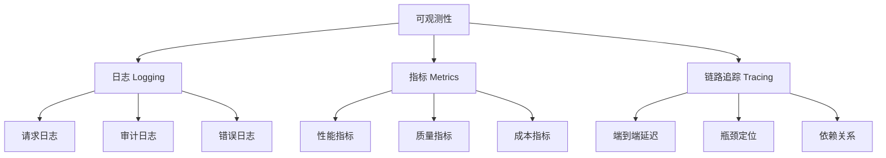
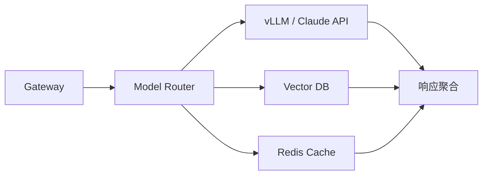

# 可观测性：日志、链路追踪与指标体系

## 可观测性三大支柱



## OpenTelemetry 集成

### 基础配置

```python
from opentelemetry import trace, metrics
from opentelemetry.sdk.trace import TracerProvider
from opentelemetry.sdk.trace.export import BatchSpanProcessor
from opentelemetry.exporter.otlp.proto.grpc.trace_exporter import OTLPSpanExporter
from opentelemetry.sdk.metrics import MeterProvider
from opentelemetry.exporter.otlp.proto.grpc.metric_exporter import OTLPMetricExporter

def setup_telemetry(service_name: str = "llm-service"):
    """初始化 OpenTelemetry"""
    # Trace
    tracer_provider = TracerProvider()
    tracer_provider.add_span_processor(
        BatchSpanProcessor(
            OTLPSpanExporter(endpoint="http://otel-collector:4317")
        )
    )
    trace.set_tracer_provider(tracer_provider)

    # Metrics
    meter_provider = MeterProvider(
        metric_readers=[OTLPMetricExporter(endpoint="http://otel-collector:4317")]
    )
    metrics.set_meter_provider(meter_provider)

    return trace.get_tracer(service_name), metrics.get_meter(service_name)
```

### LLM 调用链路追踪

```python
import time
from opentelemetry import trace

class TracedLLMClient:
    """带链路追踪的 LLM 客户端"""

    def __init__(self, service_name: str = "llm-gateway"):
        self.tracer, self.meter = setup_telemetry(service_name)

        # 定义指标
        self.ttfb_histogram = self.meter.create_histogram(
            name="llm.ttfb",
            description="Time to first byte",
            unit="ms",
        )
        self.token_counter = self.meter.create_counter(
            name="llm.tokens",
            description="Token count",
        )
        self.error_counter = self.meter.create_counter(
            name="llm.errors",
            description="Error count",
        )

    def chat(self, model: str, messages: list[dict], **kwargs) -> dict:
        """带追踪的聊天调用"""
        with self.tracer.start_as_current_span("llm.chat") as span:
            span.set_attribute("llm.model", model)
            span.set_attribute("llm.message_count", len(messages))

            try:
                start_time = time.time()
                from openai import OpenAI
                client = OpenAI()

                # 记录首 Token 时间
                ttfb_start = time.time()
                response = client.chat.completions.create(
                    model=model, messages=messages, **kwargs
                )
                ttfb = (time.time() - ttfb_start) * 1000

                total_time = (time.time() - start_time) * 1000

                # 记录指标
                usage = response.usage
                self.ttfb_histogram.record(ttfb, {"model": model})
                self.token_counter.add(usage.prompt_tokens,
                                       {"model": model, "type": "input"})
                self.token_counter.add(usage.completion_tokens,
                                       {"model": model, "type": "output"})

                # 记录到 span
                span.set_attribute("llm.prompt_tokens", usage.prompt_tokens)
                span.set_attribute("llm.completion_tokens", usage.completion_tokens)
                span.set_attribute("llm.ttfb_ms", ttfb)
                span.set_attribute("llm.total_latency_ms", total_time)

                return {
                    "content": response.choices[0].message.content,
                    "usage": {"prompt_tokens": usage.prompt_tokens,
                              "completion_tokens": usage.completion_tokens},
                    "latency_ms": total_time,
                    "ttfb_ms": ttfb,
                }

            except Exception as e:
                self.error_counter.add(1, {"model": model, "error_type": type(e).__name__})
                span.set_attribute("error", True)
                span.set_attribute("error.type", type(e).__name__)
                span.set_attribute("error.message", str(e))
                raise
```

### RAG 链路追踪

```python
class TracedRAGPipeline:
    """带追踪的 RAG 流水线"""

    def __init__(self):
        self.tracer = trace.get_tracer("rag-pipeline")

    def query(self, question: str) -> dict:
        with self.tracer.start_as_current_span("rag.query") as main_span:
            main_span.set_attribute("rag.question", question[:200])

            # 1. Embedding
            with self.tracer.start_as_current_span("rag.embedding") as span:
                start = time.time()
                query_embedding = self._embed(question)
                span.set_attribute("rag.embedding_latency_ms",
                                   (time.time() - start) * 1000)

            # 2. 检索
            with self.tracer.start_as_current_span("rag.retrieval") as span:
                start = time.time()
                docs = self._retrieve(query_embedding, top_k=5)
                span.set_attribute("rag.retrieval_latency_ms",
                                   (time.time() - start) * 1000)
                span.set_attribute("rag.retrieved_docs", len(docs))
                span.set_attribute("rag.top_score",
                                   docs[0]["score"] if docs else 0)
                main_span.set_attribute("rag.retrieved_docs", len(docs))

            # 3. 生成
            with self.tracer.start_as_current_span("rag.generation") as span:
                start = time.time()
                context = "\n".join(d["text"] for d in docs)
                answer = self._generate(question, context)
                span.set_attribute("rag.generation_latency_ms",
                                   (time.time() - start) * 1000)
                span.set_attribute("rag.context_length", len(context))

            # 4. 评估
            with self.tracer.start_as_current_span("rag.evaluation") as span:
                faithfulness = self._check_faithfulness(answer, context)
                span.set_attribute("rag.faithfulness", faithfulness)
                main_span.set_attribute("rag.faithfulness", faithfulness)

            return {
                "answer": answer,
                "sources": docs,
                "faithfulness": faithfulness,
            }

    def _embed(self, text: str) -> list[float]:
        # 实际实现调用 Embedding 服务
        return [0.0] * 768

    def _retrieve(self, embedding: list[float], top_k: int) -> list[dict]:
        return [{"text": "示例文档", "score": 0.85}]

    def _generate(self, question: str, context: str) -> str:
        return "示例回答"

    def _check_faithfulness(self, answer: str, context: str) -> float:
        return 0.9
```

## 核心指标体系

### 指标定义

```python
class LLMMetrics:
    """LLM 服务核心指标"""

    def __init__(self, meter):
        # 性能指标
        self.ttfb = meter.create_histogram(
            name="llm_ttfb_ms",
            description="首 Token 延迟",
            unit="ms",
        )
        self.e2e_latency = meter.create_histogram(
            name="llm_e2e_latency_ms",
            description="端到端延迟",
            unit="ms",
        )
        self.tokens_per_second = meter.create_histogram(
            name="llm_tokens_per_second",
            description="输出吞吐",
            unit="tokens/s",
        )

        # 质量指标
        self.hallucination_rate = meter.create_gauge(
            name="llm_hallucination_rate",
            description="幻觉率",
        )
        self.user_satisfaction = meter.create_histogram(
            name="llm_user_satisfaction",
            description="用户满意度（-1/0/1）",
        )

        # 成本指标
        self.token_usage = meter.create_counter(
            name="llm_token_usage_total",
            description="Token 使用量",
        )
        self.request_cost = meter.create_histogram(
            name="llm_request_cost_usd",
            description="单次请求成本",
            unit="USD",
        )

        # 可用性指标
        self.request_total = meter.create_counter(
            name="llm_request_total",
            description="请求总数",
        )
        self.error_total = meter.create_counter(
            name="llm_error_total",
            description="错误总数",
        )
```

### 幻觉率监控

```python
class HallucinationMonitor:
    """幻觉率实时监控"""

    def __init__(self, window_size: int = 100):
        self.window_size = window_size
        self.evaluations: list[bool] = []  # True = faithful, False = hallucinated

    def evaluate(self, answer: str, context: str) -> bool:
        """评估回答是否忠实于上下文"""
        # 简化的启发式检测
        # 生产环境应使用 NLI 模型或 GPT-4 评判
        is_faithful = self._heuristic_check(answer, context)
        self.evaluations.append(is_faithful)

        if len(self.evaluations) > self.window_size:
            self.evaluations = self.evaluations[-self.window_size:]

        return is_faithful

    def _heuristic_check(self, answer: str, context: str) -> bool:
        """启发式忠实度检查"""
        # ⚠️ 关键词匹配仅用于快速粗筛，无法真正检测幻觉
        # 生产环境应使用：
        # 1. NLI 模型（如 deberta-v3-large-mnli）判断前提是否蕴含回答
        # 2. LLM-as-Judge（如 GPT-4 判断回答是否基于上下文）
        # 3. 人工抽检 + 用户反馈闭环
        import jieba
        answer_words = set(jieba.cut(answer))
        context_words = set(jieba.cut(context))

        # 过滤停用词
        stopwords = {"的", "了", "是", "在", "和", "与", "等", "也", "都", "这", "那"}
        answer_keywords = answer_words - stopwords - {"，", "。", "、", "；"}
        context_keywords = context_words - stopwords - {"，", "。", "、", "；"}

        if not answer_keywords:
            return True

        # 计算关键词覆盖率
        covered = answer_keywords & context_keywords
        coverage = len(covered) / len(answer_keywords)

        return coverage >= 0.6  # 60% 的关键词在上下文中出现

    @property
    def hallucination_rate(self) -> float:
        if not self.evaluations:
            return 0
        return 1 - sum(self.evaluations) / len(self.evaluations)
```

## Grafana 面板设计

### 核心仪表盘 JSON 结构

```python
GRAFANA_DASHBOARD = {
    "dashboard": {
        "title": "LLM Service Dashboard",
        "panels": [
            {
                "title": "TTFB (P50/P95/P99)",
                "type": "timeseries",
                "targets": [
                    {"expr": "histogram_quantile(0.5, rate(llm_ttfb_ms_bucket[5m]))"},
                    {"expr": "histogram_quantile(0.95, rate(llm_ttfb_ms_bucket[5m]))"},
                    {"expr": "histogram_quantile(0.99, rate(llm_ttfb_ms_bucket[5m]))"},
                ],
            },
            {
                "title": "Throughput (tokens/s)",
                "type": "timeseries",
                "targets": [
                    {"expr": "rate(llm_tokens_per_second_sum[5m]) / rate(llm_tokens_per_second_count[5m])"},
                ],
            },
            {
                "title": "Error Rate",
                "type": "singlestat",
                "targets": [
                    {"expr": "rate(llm_error_total[5m]) / rate(llm_request_total[5m])"},
                ],
            },
            {
                "title": "Hallucination Rate",
                "type": "gauge",
                "targets": [
                    {"expr": "llm_hallucination_rate"},
                ],
                "thresholds": [
                    {"value": 0.05, "color": "green"},
                    {"value": 0.10, "color": "yellow"},
                    {"value": 0.15, "color": "red"},
                ],
            },
            {
                "title": "Token Usage by Model",
                "type": "piechart",
                "targets": [
                    {"expr": "sum by (model) (rate(llm_token_usage_total[1h]))"},
                ],
            },
            {
                "title": "Cost Trend",
                "type": "timeseries",
                "targets": [
                    {"expr": "sum(rate(llm_request_cost_usd_sum[1h]))"},
                ],
            },
        ],
    }
}
```

## 告警策略

### 告警规则

| 指标 | 条件 | 级别 | 通知方式 |
|------|------|------|----------|
| TTFB P95 | > 3s 持续 5 分钟 | Warning | Slack |
| 错误率 | > 1% 持续 3 分钟 | Critical | 电话 + Slack |
| 幻觉率 | > 15% 持续 10 分钟 | Warning | Slack |
| GPU 利用率 | < 30% 持续 30 分钟 | Info | 邮件 |
| Token 消耗 | 日消耗超预算 120% | Warning | 邮件 |
| 队列深度 | > 50 持续 5 分钟 | Warning | Slack |

```yaml
# Prometheus 告警规则
groups:
  - name: llm-alerts
    rules:
      - alert: LLMTTFBHigh
        expr: histogram_quantile(0.95, rate(llm_ttfb_ms_bucket[5m])) > 3000
        for: 5m
        labels:
          severity: warning
        annotations:
          summary: "LLM TTFB P95 过高"
          description: "当前 P95 TTFB 为 {{ $value }}ms"

      - alert: LLMErrorRateHigh
        expr: rate(llm_error_total[3m]) / rate(llm_request_total[3m]) > 0.01
        for: 3m
        labels:
          severity: critical
        annotations:
          summary: "LLM 错误率过高"
          description: "当前错误率为 {{ $value | humanizePercentage }}"

      - alert: LLMHallucinationRateHigh
        expr: llm_hallucination_rate > 0.15
        for: 10m
        labels:
          severity: warning
        annotations:
          summary: "LLM 幻觉率过高"
          description: "当前幻觉率为 {{ $value | humanizePercentage }}"
```

## SLO/SLI 体系：从监控到可靠性管理

监控只是手段，SLO 才是目标。没有 SLO 的监控只是仪表盘上的数字。

### 核心 SLI 定义

| SLI | 计算方式 | SLO 目标 | 错误预算(月) |
|-----|---------|----------|-------------|
| 可用性 | 成功请求 / 总请求 | 99.5% | 3.6h |
| 延迟 P95 | 95th 百分位响应时间 | < 3s | - |
| 延迟 P99 | 99th 百分位响应时间 | < 5s | - |
| 正确性 | 人工抽检合格率 | > 90% | 10% |
| 幻觉率 | 抽检发现幻觉的比例 | < 5% | - |
| 成本效率 | 每千次查询成本 | < ¥50 | - |

### 错误预算计算

```python
class ErrorBudgetManager:
    """错误预算管理：SLO 的核心工具

    错误预算 = (1 - SLO) × 时间窗口
    例：99.5% SLO 在 30 天内 = 3.6 小时不可用预算
    预算耗尽 → 冻结发布，全力修复可靠性
    """

    def __init__(self, slo_target: float, window_days: int = 30):
        self.slo_target = slo_target  # e.g. 0.995
        self.window_days = window_days
        self.total_budget_hours = (1 - slo_target) * window_days * 24

        # 从 Prometheus 查询实际数据
        from prometheus_client import Gauge
        self.budget_remaining = Gauge(
            'slo_error_budget_remaining_hours',
            'Remaining error budget in hours',
            ['slo_name']
        )

    def calculate(self, total_requests: int, failed_requests: int) -> dict:
        actual_sli = 1 - (failed_requests / max(total_requests, 1))
        budget_consumed = (self.slo_target - actual_sli) * self.window_days * 24
        budget_remaining = self.total_budget_hours - budget_consumed

        self.budget_remaining.labels(slo_name='availability').set(
            max(budget_remaining, 0)
        )

        return {
            "slo_target": self.slo_target,
            "actual_sli": actual_sli,
            "sli_met": actual_sli >= self.slo_target,
            "budget_total_hours": round(self.total_budget_hours, 2),
            "budget_consumed_hours": round(max(budget_consumed, 0), 2),
            "budget_remaining_hours": round(max(budget_remaining, 0), 2),
            "budget_exhausted": budget_remaining <= 0,
            "action": "冻结发布，优先修复可靠性" if budget_remaining <= 0 else "正常"
        }
```

## 成本追踪：LLM 应用的核心运营指标

成本是 LLM 应用的核心运营指标。没有成本追踪 = 不知道系统是否可持续。

```python
from datetime import datetime

class LLMCostTracker:
    """LLM 成本追踪：按端点、用户、模型归因"""

    def __init__(self, redis_url: str = "redis://localhost:6379"):
        import redis
        self.redis = redis.from_url(redis_url, decode_responses=True)

    def record_call(self, model: str, endpoint: str, user_id: str,
                    prompt_tokens: int, completion_tokens: int,
                    latency_ms: float):
        """记录一次 LLM 调用的成本"""
        # 定价表（2025 参考，应从配置中心获取）
        PRICING = {
            "gpt-4o": {"input": 2.5, "output": 10.0},      # $/M tokens
            "gpt-4o-mini": {"input": 0.15, "output": 0.6},
            "claude-sonnet-4-20250514": {"input": 3.0, "output": 15.0},
        }

        pricing = PRICING.get(model, {"input": 2.5, "output": 10.0})
        cost_usd = (
            prompt_tokens * pricing["input"] / 1_000_000 +
            completion_tokens * pricing["output"] / 1_000_000
        )

        # 按维度聚合（Redis INCRBY + 过期时间）
        today = datetime.now().strftime("%Y-%m-%d")
        pipe = self.redis.pipeline()

        # 按模型
        pipe.incrbyfloat(f"cost:{today}:model:{model}", cost_usd)
        # 按端点
        pipe.incrbyfloat(f"cost:{today}:endpoint:{endpoint}", cost_usd)
        # 按用户
        pipe.incrbyfloat(f"cost:{today}:user:{user_id}", cost_usd)
        # 总计
        pipe.incrbyfloat(f"cost:{today}:total", cost_usd)

        # 设置 90 天过期
        for key in [f"cost:{today}:model:{model}",
                     f"cost:{today}:endpoint:{endpoint}",
                     f"cost:{today}:user:{user_id}",
                     f"cost:{today}:total"]:
            pipe.expire(key, 90 * 86400)

        pipe.execute()
        return cost_usd

    def get_daily_report(self, date: str = None) -> dict:
        """获取某天的成本报告"""
        if not date:
            date = datetime.now().strftime("%Y-%m-%d")

        total = float(self.redis.get(f"cost:{date}:total") or 0)

        return {
            "date": date,
            "total_cost_usd": round(total, 4),
            "by_model": self._get_keys(f"cost:{date}:model:*"),
            "by_endpoint": self._get_keys(f"cost:{date}:endpoint:*"),
            "alert": total > 100,  # 日成本超过 $100 告警
        }

    def _get_keys(self, pattern: str) -> dict:
        """获取匹配 pattern 的所有键值"""
        keys = self.redis.keys(pattern)
        return {k.split(":")[-1]: float(self.redis.get(k) or 0) for k in keys}
```

## 分布式追踪：跨服务调用链

LLM 应用的典型调用链涉及多个后端服务，需要端到端的分布式追踪才能定位瓶颈。



```python
# 分布式追踪：跨服务调用链
# Gateway → Model Router → vLLM / Claude API
#                      → Vector DB (Milvus/Chroma)
#                      → Redis Cache

from opentelemetry import trace
from opentelemetry.sdk.trace import TracerProvider
from opentelemetry.sdk.trace.export import BatchSpanExporter
from opentelemetry.exporter.otlp.proto.grpc.trace_exporter import OTLPSpanExporter

# 配置追踪
provider = TracerProvider()
provider.add_span_processor(
    BatchSpanExporter(OTLPSpanExporter(endpoint="http://otel-collector:4317"))
)
trace.set_tracer_provider(provider)
tracer = trace.get_tracer("llm-gateway")

async def handle_request_with_tracing(query: str, user_id: str):
    """带分布式追踪的完整请求处理"""
    with tracer.start_as_current_span("llm_request") as root_span:
        root_span.set_attribute("user_id", user_id)
        root_span.set_attribute("query_length", len(query))

        # 1. 模型路由
        with tracer.start_as_current_span("model_router") as span:
            model = select_model(query)
            span.set_attribute("selected_model", model)

        # 2. 语义缓存检查
        with tracer.start_as_current_span("cache_lookup") as span:
            cached = await semantic_cache.get(query, embed_fn)
            span.set_attribute("cache_hit", cached is not None)
            if cached:
                root_span.set_attribute("cache_hit", True)
                return cached

        # 3. 向量检索（RAG）
        with tracer.start_as_current_span("vector_search") as span:
            contexts = await vector_store.search(query, top_k=5)
            span.set_attribute("results_count", len(contexts))

        # 4. LLM 生成
        with tracer.start_as_current_span("llm_generate") as span:
            response = await llm_client.chat.completions.create(
                model=model,
                messages=build_messages(query, contexts),
            )
            span.set_attribute("model", model)
            span.set_attribute("prompt_tokens", response.usage.prompt_tokens)
            span.set_attribute("completion_tokens", response.usage.completion_tokens)
            span.set_attribute("latency_ms",
                             int(response.usage.total_tokens * 1000))

        # 5. 成本记录
        with tracer.start_as_current_span("cost_record") as span:
            cost = cost_tracker.record_call(
                model=model, endpoint="rag_query", user_id=user_id,
                prompt_tokens=response.usage.prompt_tokens,
                completion_tokens=response.usage.completion_tokens,
                latency_ms=0
            )
            span.set_attribute("cost_usd", cost)

        return response.choices[0].message.content
```

## 实施路线

1. **第一周**：接入 OpenTelemetry，建立基础日志和链路追踪
2. **第二周**：定义核心指标，部署 Prometheus + Grafana
3. **第三周**：配置告警规则，建立 On-call 流程
4. **第四周**：添加质量指标（幻觉率、满意度），完善仪表盘

## 可观测性黄金法则

1. **结构化日志**：所有日志使用 JSON 格式，便于检索和分析
2. **关联 ID**：每个请求携带唯一 trace_id，贯穿所有服务
3. **业务指标优先**：技术指标是手段，业务指标才是目的
4. **告警要有行动**：每条告警都应有明确的处理流程，否则是噪音
5. **持续迭代**：监控体系随业务演进，定期审查指标和告警的有效性
