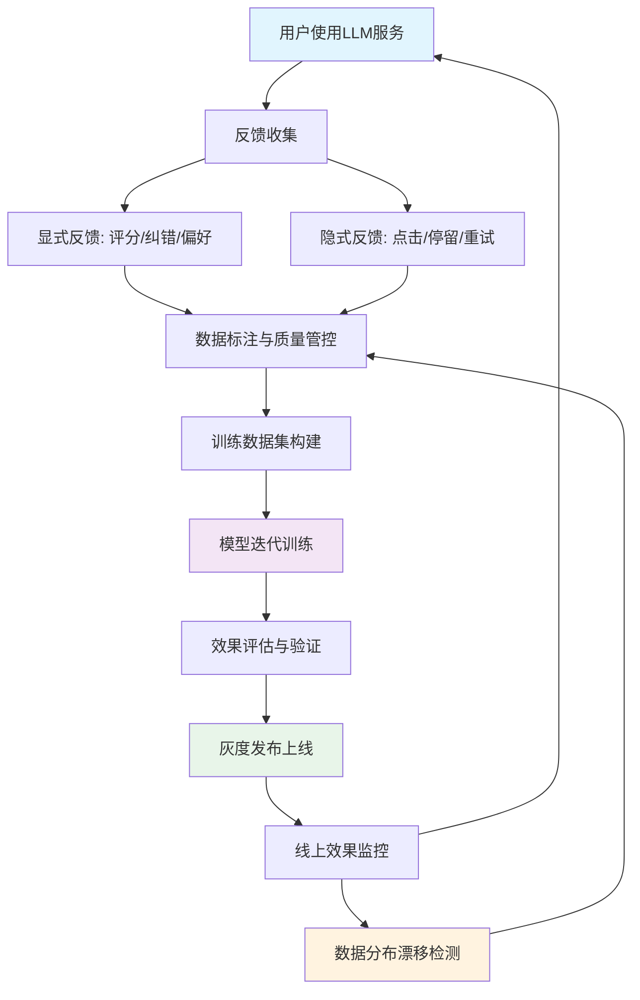
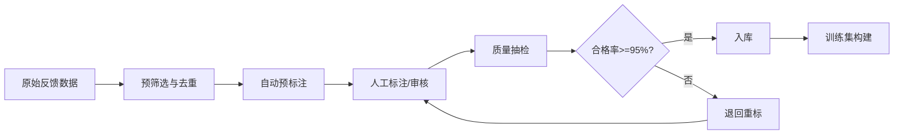
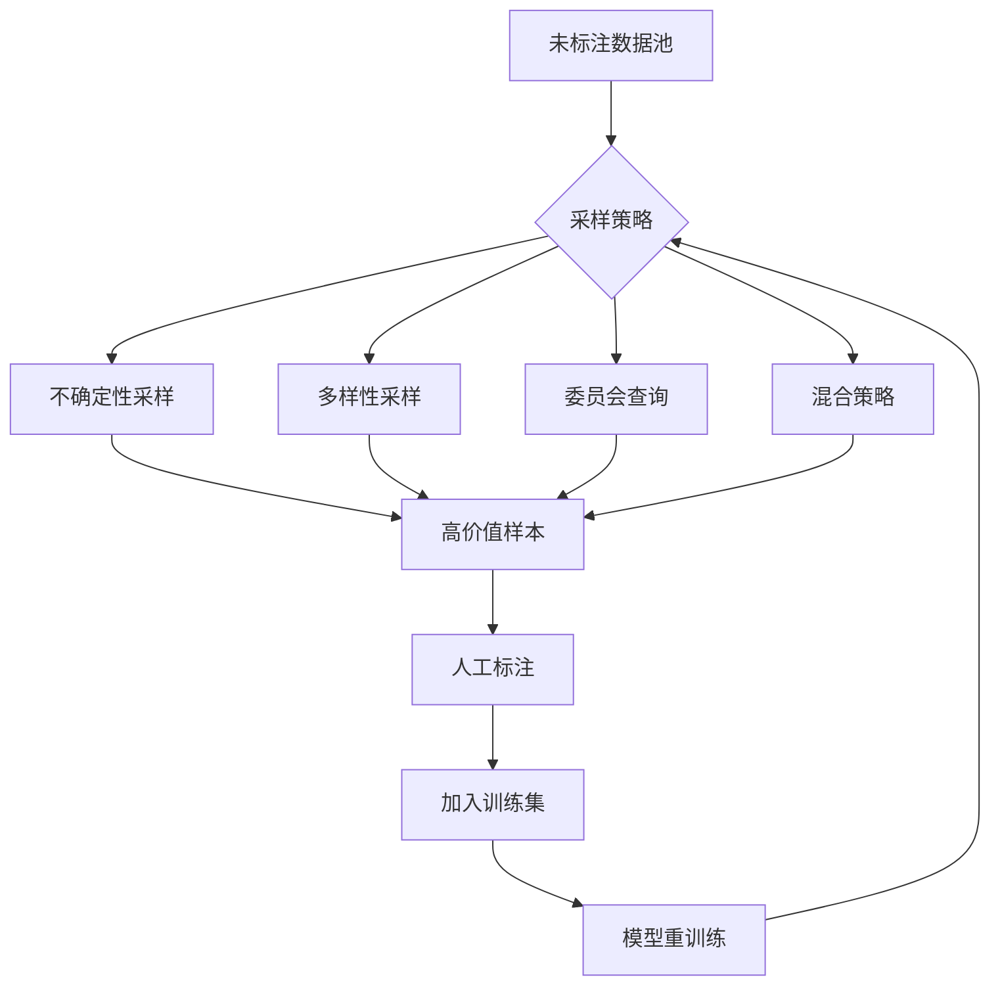

# 数据飞轮与持续学习

## 数据飞轮概念

数据飞轮是LLM生产系统中实现持续改进的核心机制。其核心思想是：用户反馈驱动数据标注，数据标注驱动模型迭代，模型迭代提升用户体验，进而吸引更多用户和更高质量的反馈，形成正向循环。



飞轮的关键在于"加速度"——每轮迭代的数据质量和模型提升相互放大。初始阶段飞轮转动缓慢，需要大量人工投入；随着系统成熟，自动化程度提高，飞轮自驱能力增强。

## 用户反馈收集机制

### 显式反馈

显式反馈是用户主动提供的信息，信号明确但数量有限：

| 反馈类型 | 收集方式 | 信号强度 | 数据量级 | 实现复杂度 |
|----------|----------|----------|----------|------------|
| 评分（1-5星） | 回答下方评分组件 | 强 | 中 | 低 |
| 点赞/点踩 | 单按钮操作 | 中 | 高 | 低 |
| 纠错标注 | 用户编辑修正回答 | 强 | 低 | 中 |
| 偏好选择 | 并排对比选择更好回答 | 强 | 低 | 中 |
| 问题分类 | 选择回答质量标签 | 中 | 低 | 中 |

### 隐式反馈

隐式反馈从用户行为中推断，信号模糊但数据量大：

| 反馈信号 | 含义 | 可靠性 | 收集方式 |
|----------|------|--------|----------|
| 复制回答 | 内容有价值 | 高 | 前端埋点 |
| 重新提问 | 回答不满意 | 中 | 会话分析 |
| 停留时长 | 认真阅读/困惑 | 低 | 前端埋点 |
| 滚动行为 | 深度阅读 | 中 | 前端埋点 |
| 分享/导出 | 内容有价值 | 高 | 前端埋点 |
| 追问 | 需要更多信息 | 中 | 会话分析 |

### 反馈收集系统实现

```python
from enum import Enum
from datetime import datetime
from dataclasses import dataclass, field
from typing import Optional
import uuid

from pydantic import BaseModel, Field
from fastapi import APIRouter, HTTPException, Depends
from sqlalchemy.ext.asyncio import AsyncSession


class FeedbackType(str, Enum):
    RATING = "rating"
    THUMBS = "thumbs"
    CORRECTION = "correction"
    PREFERENCE = "preference"
    IMPLICIT = "implicit"


class ImplicitSignalType(str, Enum):
    COPY = "copy"
    REGENERATE = "regenerate"
    LONG_STAY = "long_stay"
    SHARE = "share"
    FOLLOW_UP = "follow_up"


class FeedbackRequest(BaseModel):
    """显式反馈请求"""
    conversation_id: str = Field(..., description="会话ID")
    message_id: str = Field(..., description="消息ID")
    feedback_type: FeedbackType
    rating: Optional[int] = Field(None, ge=1, le=5, description="1-5评分")
    thumbs_up: Optional[bool] = Field(None, description="点赞/点踩")
    correction_text: Optional[str] = Field(None, description="用户修正内容")
    preferred_message_id: Optional[str] = Field(None, description="偏好选择的消息ID")
    tags: list[str] = Field(default_factory=list, description="质量标签")


class ImplicitFeedbackRequest(BaseModel):
    """隐式反馈请求"""
    conversation_id: str
    message_id: str
    signal_type: ImplicitSignalType
    signal_value: dict = Field(default_factory=dict, description="信号详情")
    duration_ms: Optional[int] = Field(None, description="停留时长毫秒")


feedback_router = APIRouter(prefix="/feedback", tags=["feedback"])


@feedback_router.post("/explicit")
async def submit_explicit_feedback(
    request: FeedbackRequest,
    session: AsyncSession = Depends()
):
    """提交显式反馈"""
    # 校验：评分类型必须提供rating
    if request.feedback_type == FeedbackType.RATING and request.rating is None:
        raise HTTPException(400, "评分反馈必须提供rating字段")

    if request.feedback_type == FeedbackType.CORRECTION and not request.correction_text:
        raise HTTPException(400, "纠错反馈必须提供correction_text字段")

    feedback_record = {
        "id": str(uuid.uuid4()),
        "conversation_id": request.conversation_id,
        "message_id": request.message_id,
        "feedback_type": request.feedback_type.value,
        "rating": request.rating,
        "thumbs_up": request.thumbs_up,
        "correction_text": request.correction_text,
        "preferred_message_id": request.preferred_message_id,
        "tags": request.tags,
        "created_at": datetime.utcnow(),
    }

    # 写入反馈数据库
    await session.execute(
        """INSERT INTO feedback_records
           (id, conversation_id, message_id, feedback_type, rating,
            thumbs_up, correction_text, preferred_message_id, tags, created_at)
           VALUES (:id, :conversation_id, :message_id, :feedback_type, :rating,
                   :thumbs_up, :correction_text, :preferred_message_id, :tags, :created_at)""",
        feedback_record
    )
    await session.commit()

    # 通知数据管线：有新反馈可处理
    await notify_feedback_pipeline(feedback_record)

    return {"status": "ok", "feedback_id": feedback_record["id"]}


@feedback_router.post("/implicit")
async def submit_implicit_feedback(
    request: ImplicitFeedbackRequest,
    session: AsyncSession = Depends()
):
    """提交隐式反馈"""
    record = {
        "id": str(uuid.uuid4()),
        "conversation_id": request.conversation_id,
        "message_id": request.message_id,
        "signal_type": request.signal_type.value,
        "signal_value": request.signal_value,
        "duration_ms": request.duration_ms,
        "created_at": datetime.utcnow(),
    }

    await session.execute(
        """INSERT INTO implicit_feedback
           (id, conversation_id, message_id, signal_type,
            signal_value, duration_ms, created_at)
           VALUES (:id, :conversation_id, :message_id, :signal_type,
                   :signal_value, :duration_ms, :created_at)""",
        record
    )
    await session.commit()

    return {"status": "ok"}


async def notify_feedback_pipeline(record: dict):
    """通知数据管线有新反馈数据"""
    # 实际项目中可使用消息队列（如 Kafka/RabbitMQ）
    pass
```

## 数据标注流程与质量管控

### 标注流程设计

数据标注是将原始反馈转化为高质量训练数据的关键环节。流程需要兼顾效率与质量：



### 标注质量管控

```python
from dataclasses import dataclass
from enum import Enum
from typing import Optional
import hashlib


class AnnotationStatus(str, Enum):
    PENDING = "pending"
    IN_PROGRESS = "in_progress"
    SUBMITTED = "submitted"
    REVIEWED = "reviewed"
    REJECTED = "rejected"


class QualityGate:
    """标注质量管控门"""

    def __init__(
        self,
        min_agreement: float = 0.85,
        sample_rate: float = 0.1,
        max_rejection_rate: float = 0.05,
    ):
        self.min_agreement = min_agreement         # 标注者间最低一致性
        self.sample_rate = sample_rate             # 抽检比例
        self.max_rejection_rate = max_rejection_rate  # 最大退回率

    def compute_agreement(self, annotations: list[dict]) -> float:
        """计算标注者间一致性（Cohen's Kappa简化版）"""
        if len(annotations) < 2:
            return 1.0

        total = len(annotations[0])
        agree = 0
        for i in range(total):
            labels = set(a[i] for a in annotations)
            if len(labels) == 1:
                agree += 1

        observed_agreement = agree / total

        # 计算期望一致性
        from collections import Counter
        label_counts = Counter()
        for a in annotations:
            label_counts.update(a)

        total_labels = sum(label_counts.values())
        expected = sum((c / total_labels) ** 2 for c in label_counts.values())

        if expected == 1.0:
            return 1.0

        kappa = (observed_agreement - expected) / (1.0 - expected)
        return kappa

    def sample_for_review(
        self,
        annotations: list[dict],
        stratify_by: Optional[str] = None,
    ) -> list[dict]:
        """按比例抽检，可按维度分层"""
        import random

        sample_size = max(1, int(len(annotations) * self.sample_rate))

        if stratify_by and stratify_by in annotations[0]:
            # 分层抽样
            groups = {}
            for a in annotations:
                key = a.get(stratify_by, "unknown")
                groups.setdefault(key, []).append(a)

            samples = []
            for key, group in groups.items():
                n = max(1, int(len(group) * self.sample_rate))
                samples.extend(random.sample(group, min(n, len(group))))
            return samples
        else:
            return random.sample(annotations, min(sample_size, len(annotations)))

    def check_batch_quality(self, reviewed: list[dict]) -> dict:
        """检查批次质量是否达标"""
        if not reviewed:
            return {"pass": False, "reason": "无审核数据"}

        rejected = sum(1 for r in reviewed if r.get("status") == "rejected")
        rejection_rate = rejected / len(reviewed)

        return {
            "pass": rejection_rate <= self.max_rejection_rate,
            "rejection_rate": rejection_rate,
            "threshold": self.max_rejection_rate,
            "total_reviewed": len(reviewed),
            "total_rejected": rejected,
        }


@dataclass
class AnnotationTask:
    """标注任务"""
    task_id: str
    data_id: str
    data_content: str
    pre_annotation: Optional[str] = None  # 模型预标注结果
    status: AnnotationStatus = AnnotationStatus.PENDING
    annotator_id: Optional[str] = None
    annotation_result: Optional[str] = None
    reviewer_id: Optional[str] = None
    review_comment: Optional[str] = None
    quality_score: Optional[float] = None


class AnnotationPipeline:
    """标注管线"""

    def __init__(self, quality_gate: QualityGate):
        self.quality_gate = quality_gate
        self.tasks: list[AnnotationTask] = []

    def create_tasks(
        self,
        raw_data: list[dict],
        pre_annotate: bool = True,
    ) -> list[AnnotationTask]:
        """从原始数据创建标注任务"""
        tasks = []
        for item in raw_data:
            task = AnnotationTask(
                task_id=hashlib.md5(item["id"].encode()).hexdigest()[:12],
                data_id=item["id"],
                data_content=item["content"],
                pre_annotation=item.get("model_output") if pre_annotate else None,
            )
            tasks.append(task)

        self.tasks.extend(tasks)
        return tasks

    def assign_tasks(
        self,
        tasks: list[AnnotationTask],
        annotators: list[str],
        annotations_per_item: int = 2,
    ) -> dict[str, list[str]]:
        """分配标注任务给标注者"""
        import random

        assignments: dict[str, list[str]] = {a: [] for a in annotators}

        for task in tasks:
            selected = random.sample(
                annotators,
                min(annotations_per_item, len(annotators))
            )
            for annotator in selected:
                assignments[annotator].append(task.task_id)

        return assignments
```

## 主动学习策略

主动学习的核心思想是：不是所有数据都对模型改进同等重要，选择最有价值的样本进行标注可以大幅提升标注效率。



### 主动学习策略对比

| 策略 | 原理 | 适用场景 | 标注效率 | 实现复杂度 | 风险 |
|------|------|----------|----------|------------|------|
| 不确定性采样 | 选择模型最不确定的样本 | 模型已有基础能力 | 高 | 低 | 可能选择离群点 |
| 多样性采样 | 覆盖特征空间不同区域 | 数据分布不均衡 | 中 | 中 | 可能选到简单样本 |
| 委员会查询 | 多模型分歧最大的样本 | 有多个模型版本 | 高 | 高 | 计算成本高 |
| 密度加权 | 不确定性×代表性权重 | 大规模数据集 | 中 | 中 | 超参数敏感 |
| 混合策略 | 组合多种策略 | 生产环境 | 高 | 高 | 需要调参 |

### 主动学习实现

```python
import numpy as np
from abc import ABC, abstractmethod
from typing import Optional


class SamplingStrategy(ABC):
    """采样策略基类"""

    @abstractmethod
    def select_samples(
        self,
        candidates: list[dict],
        n_samples: int,
        model_outputs: Optional[list[dict]] = None,
    ) -> list[dict]:
        pass


class UncertaintySampling(SamplingStrategy):
    """不确定性采样：选择模型最不确定的样本"""

    def __init__(self, method: str = "entropy"):
        """
        method:
        - entropy: 信息熵最大
        - margin: 最可能两类概率差最小
        - least_confident: 最可能类概率最小
        """
        self.method = method

    def compute_uncertainty(self, probabilities: list[float]) -> float:
        """计算不确定性分数"""
        probs = np.array(probabilities)
        probs = probs[probs > 0]  # 过滤零概率

        if self.method == "entropy":
            return -np.sum(probs * np.log(probs))
        elif self.method == "margin":
            sorted_probs = np.sort(probs)[::-1]
            if len(sorted_probs) >= 2:
                return -(sorted_probs[0] - sorted_probs[1])  # 差越小不确定性越大
            return 0.0
        elif self.method == "least_confident":
            return 1.0 - np.max(probs)
        else:
            raise ValueError(f"未知方法: {self.method}")

    def select_samples(
        self,
        candidates: list[dict],
        n_samples: int,
        model_outputs: Optional[list[dict]] = None,
    ) -> list[dict]:
        if model_outputs is None:
            raise ValueError("不确定性采样需要模型输出概率")

        scored = []
        for candidate, output in zip(candidates, model_outputs):
            score = self.compute_uncertainty(output.get("probabilities", []))
            scored.append((score, candidate))

        # 按不确定性降序排列
        scored.sort(key=lambda x: x[0], reverse=True)
        return [item for _, item in scored[:n_samples]]


class DiversitySampling(SamplingStrategy):
    """多样性采样：覆盖特征空间不同区域"""

    def __init__(self, n_clusters: int = 10):
        self.n_clusters = n_clusters

    def select_samples(
        self,
        candidates: list[dict],
        n_samples: int,
        model_outputs: Optional[list[dict]] = None,
    ) -> list[dict]:
        from sklearn.cluster import KMeans

        embeddings = np.array([c["embedding"] for c in candidates])
        n_clusters = min(self.n_clusters, len(candidates))

        kmeans = KMeans(n_clusters=n_clusters, random_state=42, n_init=10)
        labels = kmeans.fit_predict(embeddings)

        # 从每个聚类中均匀采样
        selected = []
        samples_per_cluster = max(1, n_samples // n_clusters)

        for cluster_id in range(n_clusters):
            cluster_indices = np.where(labels == cluster_id)[0]
            n = min(samples_per_cluster, len(cluster_indices))

            # 选择离聚类中心最近的样本（最具代表性）
            center = kmeans.cluster_centers_[cluster_id]
            distances = np.linalg.norm(
                embeddings[cluster_indices] - center, axis=1
            )
            nearest = cluster_indices[np.argsort(distances)[:n]]

            for idx in nearest:
                selected.append(candidates[idx])

        return selected[:n_samples]


class HybridSampling(SamplingStrategy):
    """混合策略：结合不确定性和多样性"""

    def __init__(
        self,
        uncertainty_weight: float = 0.6,
        diversity_weight: float = 0.4,
        uncertainty_method: str = "entropy",
    ):
        self.uncertainty_weight = uncertainty_weight
        self.diversity_weight = diversity_weight
        self.uncertainty_sampler = UncertaintySampling(uncertainty_method)

    def select_samples(
        self,
        candidates: list[dict],
        n_samples: int,
        model_outputs: Optional[list[dict]] = None,
    ) -> list[dict]:
        if model_outputs is None:
            # 无模型输出时退回多样性采样
            return DiversitySampling().select_samples(candidates, n_samples)

        # 计算不确定性分数
        uncertainty_scores = []
        for output in model_outputs:
            score = self.uncertainty_sampler.compute_uncertainty(
                output.get("probabilities", [])
            )
            uncertainty_scores.append(score)

        # 归一化
        u_arr = np.array(uncertainty_scores)
        u_normalized = (u_arr - u_arr.min()) / (u_arr.max() - u_arr.min() + 1e-8)

        # 计算多样性分数（基于embedding聚类距离）
        embeddings = np.array([c["embedding"] for c in candidates])
        from sklearn.metrics.pairwise import cosine_similarity
        sim_matrix = cosine_similarity(embeddings)

        # 多样性分数：与已选样本的平均相似度越低越好
        diversity_scores = 1.0 - np.mean(sim_matrix, axis=1)
        d_normalized = (diversity_scores - diversity_scores.min()) / \
                       (diversity_scores.max() - diversity_scores.min() + 1e-8)

        # 加权综合分数
        combined = (
            self.uncertainty_weight * u_normalized
            + self.diversity_weight * d_normalized
        )

        top_indices = np.argsort(combined)[::-1][:n_samples]
        return [candidates[i] for i in top_indices]


class ActiveLearningLoop:
    """主动学习循环"""

    def __init__(self, strategy: SamplingStrategy, label_budget: int = 100):
        self.strategy = strategy
        self.label_budget = label_budget
        self.labeled_data: list[dict] = []
        self.unlabeled_data: list[dict] = []

    def add_unlabeled(self, data: list[dict]):
        """添加未标注数据"""
        self.unlabeled_data.extend(data)

    def add_labeled(self, data: list[dict]):
        """添加已标注数据"""
        self.labeled_data.extend(data)

    def select_to_label(self, n: Optional[int] = None) -> list[dict]:
        """选择最有价值的样本进行标注"""
        n = n or min(self.label_budget, len(self.unlabeled_data))
        selected = self.strategy.select_samples(
            candidates=self.unlabeled_data,
            n_samples=n,
        )
        return selected

    def complete_labeling(self, samples: list[dict], labels: list[str]):
        """标注完成后更新数据池"""
        for sample, label in zip(samples, labels):
            sample["label"] = label
            self.labeled_data.append(sample)
            if sample in self.unlabeled_data:
                self.unlabeled_data.remove(sample)

    def get_training_data(self) -> list[dict]:
        """获取当前所有已标注训练数据"""
        return self.labeled_data.copy()
```

## 标注平台集成

### Label Studio集成

Label Studio是开源数据标注平台，支持多种标注类型，可通过API与数据飞轮管线集成。

```python
import httpx
from typing import Optional


class LabelStudioClient:
    """Label Studio API 客户端"""

    def __init__(
        self,
        base_url: str = "http://label-studio:8080",
        api_key: str = "",
    ):
        self.base_url = base_url.rstrip("/")
        self.api_key = api_key
        self.client = httpx.Client(
            base_url=self.base_url,
            headers={"Authorization": f"Token {api_key}"},
            timeout=30.0,
        )

    def create_project(
        self,
        title: str,
        label_config: str,
        description: str = "",
    ) -> dict:
        """创建标注项目"""
        response = self.client.post(
            "/api/projects/",
            json={
                "title": title,
                "description": description,
                "label_config": label_config,
            },
        )
        response.raise_for_status()
        return response.json()

    def import_tasks(
        self,
        project_id: int,
        tasks: list[dict],
    ) -> dict:
        """批量导入标注任务"""
        response = self.client.post(
            f"/api/projects/{project_id}/import",
            json=tasks,
        )
        response.raise_for_status()
        return response.json()

    def export_annotations(
        self,
        project_id: int,
        export_type: str = "JSON",
    ) -> list[dict]:
        """导出标注结果"""
        response = self.client.get(
            f"/api/projects/{project_id}/export",
            params={"exportType": export_type},
        )
        response.raise_for_status()
        return response.json()

    def get_project_stats(self, project_id: int) -> dict:
        """获取项目统计信息"""
        response = self.client.get(
            f"/api/projects/{project_id}/summary",
        )
        response.raise_for_status()
        return response.json()


# LLM对话质量标注的Label Studio配置
LLM_QUALITY_LABEL_CONFIG = """
<View>
  <Text name="user_query" value="$query"/>
  <Text name="model_response" value="$response"/>
  <Rating name="quality_rating" toName="model_response" maxRating="5"/>
  <Choices name="issue_type" toName="model_response"
           choice="single" showInline="true">
    <Choice value="factual_error"/>
    <Choice value="incomplete"/>
    <Choice value="irrelevant"/>
    <Choice value="harmful"/>
    <Choice value="good"/>
  </Choices>
  <TextArea name="correction" toName="model_response"
            placeholder="Enter correction if needed"
            maxSubmissions="1"/>
</View>
"""


class DoccanoClient:
    """Doccano API 客户端（轻量级替代方案）"""

    def __init__(self, base_url: str, username: str, password: str):
        self.base_url = base_url.rstrip("/")
        self.client = httpx.Client(base_url=self.base_url, timeout=30.0)
        self._login(username, password)

    def _login(self, username: str, password: str):
        response = self.client.post(
            "/v1/auth/login",
            json={"username": username, "password": password},
        )
        response.raise_for_status()

    def create_project(
        self,
        name: str,
        project_type: str = "DocumentClassification",
        description: str = "",
    ) -> dict:
        response = self.client.post(
            "/v1/projects",
            json={
                "name": name,
                "project_type": project_type,
                "description": description,
                "guideline": "",
                "resourcetype": "TextClassificationProject"
                    if project_type == "DocumentClassification"
                    else "SequenceLabelingProject",
            },
        )
        response.raise_for_status()
        return response.json()

    def upload_examples(
        self,
        project_id: int,
        examples: list[dict],
    ) -> dict:
        response = self.client.post(
            f"/v1/projects/{project_id}/docs/upload",
            files={"file": ("data.jsonl", self._to_jsonl(examples))},
        )
        response.raise_for_status()
        return response.json()

    @staticmethod
    def _to_jsonl(data: list[dict]) -> str:
        import json
        return "\n".join(json.dumps(item) for item in data)
```

## 数据质量监控

### 分布漂移检测

数据分布漂移是数据飞轮中最隐蔽的风险。输入数据分布的变化可能导致模型性能隐性下降。

```python
from scipy import stats
import numpy as np


class DriftDetector:
    """数据分布漂移检测器"""

    def __init__(self, reference_data: np.ndarray, significance: float = 0.05):
        """
        Args:
            reference_data: 参考分布（训练数据或初始数据）
            significance: 显著性水平
        """
        self.reference = reference_data
        self.significance = significance
        self.baseline_stats = self._compute_stats(reference_data)

    @staticmethod
    def _compute_stats(data: np.ndarray) -> dict:
        return {
            "mean": np.mean(data, axis=0),
            "std": np.std(data, axis=0),
            "min": np.min(data, axis=0),
            "max": np.max(data, axis=0),
            "percentiles": {
                p: np.percentile(data, p, axis=0)
                for p in [25, 50, 75]
            },
        }

    def ks_test(self, current_data: np.ndarray) -> dict:
        """Kolmogorov-Smirnov 检验（单特征）"""
        results = {}
        n_features = self.reference.shape[1] if self.reference.ndim > 1 else 1

        for i in range(n_features):
            ref_col = self.reference[:, i] if n_features > 1 else self.reference
            cur_col = current_data[:, i] if n_features > 1 else current_data

            statistic, p_value = stats.ks_2samp(ref_col, cur_col)
            results[f"feature_{i}"] = {
                "statistic": float(statistic),
                "p_value": float(p_value),
                "drift_detected": p_value < self.significance,
            }

        return results

    def psi_score(self, current_data: np.ndarray, n_bins: int = 10) -> dict:
        """Population Stability Index（群体稳定性指标）"""
        results = {}
        n_features = self.reference.shape[1] if self.reference.ndim > 1 else 1

        for i in range(n_features):
            ref_col = self.reference[:, i] if n_features > 1 else self.reference
            cur_col = current_data[:, i] if n_features > 1 else current_data

            # 使用参考数据的分位数作为分箱边界
            bins = np.percentile(ref_col, np.linspace(0, 100, n_bins + 1))
            bins = np.unique(bins)  # 去重避免空桶

            ref_hist, _ = np.histogram(ref_col, bins=bins)
            cur_hist, _ = np.histogram(cur_col, bins=bins)

            # 转为比例，避免除零
            ref_pct = ref_hist / len(ref_col) + 1e-8
            cur_pct = cur_hist / len(cur_col) + 1e-8

            psi = np.sum((cur_pct - ref_pct) * np.log(cur_pct / ref_pct))

            results[f"feature_{i}"] = {
                "psi": float(psi),
                "severity": (
                    "no_drift" if psi < 0.1
                    else "moderate" if psi < 0.25
                    else "significant"
                ),
            }

        return results

    def detect_label_drift(
        self,
        current_labels: np.ndarray,
    ) -> dict:
        """标签分布漂移检测（卡方检验）"""
        from collections import Counter

        ref_counts = Counter(self.reference.flatten() if self.reference.ndim > 1
                            else self.reference)
        cur_counts = Counter(current_labels.flatten() if current_labels.ndim > 1
                            else current_labels)

        all_labels = sorted(set(ref_counts.keys()) | set(cur_counts.keys()))

        ref_freq = np.array([ref_counts.get(l, 0) for l in all_labels])
        cur_freq = np.array([cur_counts.get(l, 0) for l in all_labels])

        # 归一化
        ref_expected = ref_freq / ref_freq.sum() * cur_freq.sum()

        chi2, p_value = stats.chisquare(cur_freq, f_exp=ref_expected)

        return {
            "chi2_statistic": float(chi2),
            "p_value": float(p_value),
            "drift_detected": p_value < self.significance,
            "label_distribution": {
                "reference": {str(k): int(v) for k, v in ref_counts.items()},
                "current": {str(k): int(v) for k, v in cur_counts.items()},
            },
        }
```

### 标注一致性监控

```python
class AnnotationConsistencyMonitor:
    """标注一致性监控"""

    def __init__(self, threshold: float = 0.8):
        self.threshold = threshold  # 最低一致性阈值
        self.history: list[dict] = []

    def compute_inter_annotator_agreement(
        self,
        annotations: dict[str, list[str]],
    ) -> dict:
        """
        计算标注者间一致性

        Args:
            annotations: {annotator_id: [labels]}
        """
        annotators = list(annotations.keys())
        if len(annotators) < 2:
            return {"agreement": 1.0, "method": "single_annotator"}

        all_labels = list(annotations.values())

        # 逐项对比
        n_items = len(all_labels[0])
        agreements = 0
        pairwise_scores = []

        for i in range(n_items):
            labels_for_item = [a[i] for a in all_labels]
            if len(set(labels_for_item)) == 1:
                agreements += 1

        item_agreement = agreements / n_items

        # 成对一致性
        for a_idx in range(len(annotators)):
            for b_idx in range(a_idx + 1, len(annotators)):
                a_labels = all_labels[a_idx]
                b_labels = all_labels[b_idx]
                pair_agree = sum(1 for x, y in zip(a_labels, b_labels) if x == y)
                pairwise_scores.append(pair_agree / n_items)

        result = {
            "overall_agreement": item_agreement,
            "pairwise_agreements": pairwise_scores,
            "mean_pairwise": np.mean(pairwise_scores),
            "meets_threshold": item_agreement >= self.threshold,
            "annotators": annotators,
            "n_items": n_items,
        }

        self.history.append(result)
        return result

    def get_trend(self) -> list[dict]:
        """获取一致性趋势"""
        return self.history.copy()

    def alert_if_degraded(self) -> Optional[str]:
        """一致性下降时告警"""
        if len(self.history) < 2:
            return None

        recent = self.history[-1]["overall_agreement"]
        previous = self.history[-2]["overall_agreement"]

        if recent < self.threshold:
            return (
                f"标注一致性 {recent:.2%} 低于阈值 {self.threshold:.2%}，"
                f"需要检查标注指南或重新培训标注者"
            )

        if recent < previous - 0.05:
            return (
                f"标注一致性从 {previous:.2%} 下降至 {recent:.2%}，"
                f"建议排查原因"
            )

        return None
```

## 数据飞轮管线完整实现

```python
import asyncio
import logging
from datetime import datetime, timedelta
from typing import Optional

logger = logging.getLogger(__name__)


class DataFlywheelPipeline:
    """数据飞轮完整管线"""

    def __init__(
        self,
        feedback_collector=None,
        annotation_platform=None,
        quality_gate: QualityGate = None,
        drift_detector: DriftDetector = None,
        consistency_monitor: AnnotationConsistencyMonitor = None,
    ):
        self.feedback_collector = feedback_collector
        self.annotation_platform = annotation_platform
        self.quality_gate = quality_gate or QualityGate()
        self.drift_detector = drift_detector
        self.consistency_monitor = consistency_monitor or AnnotationConsistencyMonitor()
        self.pipeline_runs: list[dict] = []

    async def run_cycle(
        self,
        time_window: timedelta = timedelta(days=7),
        min_feedback_count: int = 100,
    ) -> dict:
        """执行一个完整的飞轮周期"""
        cycle_id = f"cycle_{datetime.utcnow().strftime('%Y%m%d_%H%M%S')}"
        logger.info(f"启动数据飞轮周期: {cycle_id}")

        result = {
            "cycle_id": cycle_id,
            "started_at": datetime.utcnow().isoformat(),
            "steps": {},
        }

        # Step 1: 收集反馈
        feedback = await self._collect_feedback(time_window, min_feedback_count)
        result["steps"]["feedback_collection"] = {
            "count": len(feedback),
            "explicit": sum(1 for f in feedback if f.get("feedback_type") != "implicit"),
            "implicit": sum(1 for f in feedback if f.get("feedback_type") == "implicit"),
        }

        # Step 2: 数据预筛选
        filtered = self._pre_filter(feedback)
        result["steps"]["pre_filter"] = {
            "input": len(feedback),
            "output": len(filtered),
            "filtered_rate": 1 - len(filtered) / max(len(feedback), 1),
        }

        # Step 3: 主动学习采样
        to_annotate = self._active_learning_sample(filtered)
        result["steps"]["active_learning"] = {
            "selected": len(to_annotate),
        }

        # Step 4: 推送至标注平台
        if self.annotation_platform:
            project_id = await self._push_to_annotation_platform(to_annotate)
            result["steps"]["annotation"] = {"project_id": project_id}
        else:
            result["steps"]["annotation"] = {"status": "no_platform_configured"}

        # Step 5: 数据漂移检测
        if self.drift_detector:
            drift_report = self._check_data_drift(filtered)
            result["steps"]["drift_detection"] = drift_report
        else:
            result["steps"]["drift_detection"] = {"status": "not_configured"}

        # Step 6: 标注一致性检查
        consistency_report = self._check_consistency(to_annotate)
        result["steps"]["consistency"] = consistency_report

        # Step 7: 生成训练数据
        training_data = self._build_training_data(filtered)
        result["steps"]["training_data"] = {
            "count": len(training_data),
        }

        result["completed_at"] = datetime.utcnow().isoformat()
        result["status"] = "completed"

        self.pipeline_runs.append(result)
        logger.info(f"数据飞轮周期完成: {cycle_id}")
        return result

    async def _collect_feedback(
        self,
        time_window: timedelta,
        min_count: int,
    ) -> list[dict]:
        """收集时间窗口内的反馈"""
        cutoff = datetime.utcnow() - time_window

        # 从 Redis 队列获取待处理的反馈
        feedback = []
        while True:
            item = await self.redis.lpop("feedback:pending")
            if item is None:
                break
            data = json.loads(item)
            # 只保留时间窗口内的反馈
            if data.get("created_at"):
                created = datetime.fromisoformat(data["created_at"])
                if created >= cutoff:
                    feedback.append(data)
            else:
                feedback.append(data)

        if len(feedback) < min_count:
            logger.warning(
                f"反馈数量 {len(feedback)} 低于最低阈值 {min_count}，"
                f"飞轮效果可能不佳"
            )
        return feedback

    def _pre_filter(self, feedback: list[dict]) -> list[dict]:
        """预筛选：去重、过滤无效反馈"""
        seen = set()
        filtered = []

        for item in feedback:
            # 去重
            key = (item.get("conversation_id"), item.get("message_id"))
            if key in seen:
                continue
            seen.add(key)

            # 过滤无效数据
            if not item.get("content"):
                continue

            filtered.append(item)

        return filtered

    def _active_learning_sample(
        self,
        candidates: list[dict],
        strategy: str = "hybrid",
    ) -> list[dict]:
        """使用主动学习策略选择高价值样本"""
        sampler = HybridSampling() if strategy == "hybrid" else UncertaintySampling()
        return sampler.select_samples(candidates, n_samples=len(candidates))

    async def _push_to_annotation_platform(
        self,
        samples: list[dict],
    ) -> int:
        """推送至标注平台"""
        if isinstance(self.annotation_platform, LabelStudioClient):
            project = self.annotation_platform.create_project(
                title=f"Auto Annotation {datetime.utcnow().strftime('%Y%m%d')}",
                label_config=LLM_QUALITY_LABEL_CONFIG,
            )
            self.annotation_platform.import_tasks(
                project_id=project["id"],
                tasks=[{"data": s} for s in samples],
            )
            return project["id"]
        return -1

    def _check_data_drift(self, data: list[dict]) -> dict:
        """检查数据漂移"""
        # 使用已配置的漂移检测器
        return {
            "status": "checked",
            "details": "需要结合实际embedding数据运行",
        }

    def _check_consistency(self, data: list[dict]) -> dict:
        """检查标注一致性"""
        return {
            "status": "checked",
            "details": "需要结合实际标注数据运行",
        }

    def _build_training_data(self, data: list[dict]) -> list[dict]:
        """构建训练数据集"""
        training = []
        for item in data:
            if item.get("label") or item.get("correction_text"):
                training.append({
                    "input": item.get("content", ""),
                    "output": item.get("correction_text") or item.get("label", ""),
                    "source": "flywheel",
                    "feedback_type": item.get("feedback_type"),
                    "quality_score": item.get("quality_score"),
                })
        return training

    async def schedule_recurring(
        self,
        interval_days: int = 7,
    ):
        """定期执行飞轮周期"""
        while True:
            await self.run_cycle(time_window=timedelta(days=interval_days))
            await asyncio.sleep(interval_days * 86400)
```

## 数据合规与隐私保护

在数据飞轮运行中，用户反馈数据的收集、存储和使用必须符合合规要求。

### 合规要点

| 合规维度 | 要求 | 实践措施 |
|----------|------|----------|
| 数据收集 | 明确告知用户数据用途 | 隐私声明、弹窗确认 |
| 数据存储 | 最小化存储、加密传输 | 数据库加密、TLS传输 |
| 数据使用 | 仅用于声明的目的 | 访问控制、审计日志 |
| 数据保留 | 设定保留期限 | 定期清理过期数据 |
| 用户权利 | 支持删除和导出 | 数据导出API、删除接口 |
| 跨境传输 | 符合当地法规要求 | 数据本地化存储 |
| 标注安全 | 标注者无法获取原始用户身份 | 去标识化处理 |

### 数据脱敏实现

```python
import re
from typing import Optional


class DataAnonymizer:
    """数据脱敏处理器"""

    # 预定义的正则模式
    PATTERNS = {
        "phone": (r"1[3-9]\d{9}", "PHONE_REDACTED"),
        "email": (r"[\w.-]+@[\w.-]+\.\w+", "EMAIL_REDACTED"),
        "id_card": (r"\d{17}[\dXx]", "ID_REDACTED"),
        "bank_card": (r"\d{16,19}", "BANK_REDACTED"),
        "ip_address": (r"\d{1,3}\.\d{1,3}\.\d{1,3}\.\d{1,3}", "IP_REDACTED"),
    }

    def __init__(self, custom_patterns: Optional[dict] = None):
        self.patterns = {**self.PATTERNS, **(custom_patterns or {})}
        self.sensitive_log: list[dict] = []

    def anonymize(self, text: str, user_id: Optional[str] = None) -> str:
        """对文本进行脱敏处理"""
        result = text

        for ptype, (pattern, replacement) in self.patterns.items():
            matches = re.findall(pattern, result)
            if matches:
                self.sensitive_log.append({
                    "type": ptype,
                    "count": len(matches),
                    "user_id": user_id,
                    "timestamp": datetime.utcnow().isoformat(),
                })
                result = re.sub(pattern, replacement, result)

        return result

    def anonymize_conversation(self, messages: list[dict]) -> list[dict]:
        """对整段对话进行脱敏"""
        anonymized = []
        for msg in messages:
            anonymized.append({
                **msg,
                "content": self.anonymize(
                    msg.get("content", ""),
                    user_id=msg.get("user_id"),
                ),
            })
        return anonymized

    def check_consent(self, user_id: str, purpose: str) -> bool:
        """检查用户是否授权数据用于特定用途"""
        # 实际项目中查询用户授权记录
        return True

    def apply_retention_policy(
        self,
        data: list[dict],
        retention_days: int = 90,
    ) -> list[dict]:
        """应用数据保留策略，清理过期数据"""
        cutoff = datetime.utcnow() - timedelta(days=retention_days)
        return [
            d for d in data
            if datetime.fromisoformat(d.get("created_at", "2000-01-01")) > cutoff
        ]
```

## 生产环境最佳实践

1. **飞轮频率控制**：不建议每天运行完整飞轮周期。根据数据量级，建议7-14天一个周期，确保每轮有足够数据支撑有意义的模型改进。

2. **反馈质量分层**：对反馈数据按质量分层处理。纠错类反馈权重最高，直接进入标注流程；隐式反馈需要经过信号聚合和置信度评估后再决定是否标注。

3. **防飞轮退化**：设置监控指标，当飞轮连续多个周期无法产出有效训练数据时触发告警，避免资源空转。

4. **A/B验证**：每轮飞轮产出的新模型必须经过线上A/B测试验证后才全量上线，避免标注噪声引入的模型退化。

5. **合规优先**：所有数据收集和处理环节必须嵌入合规检查，特别是用户数据脱敏和授权验证，不可事后补做。
