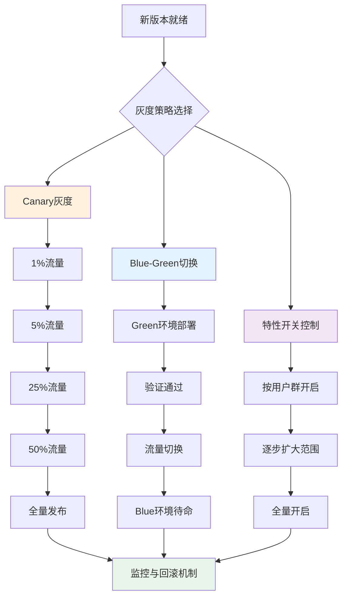
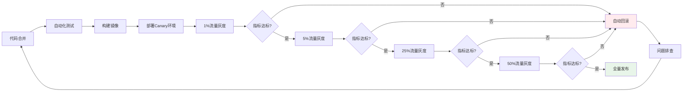

# 灰度发布与A/B测试框架

## LLM灰度策略概述

LLM服务的更新比传统软件更具风险：模型输出不确定性强、Prompt微调可能引发非线性变化、A/B测试需要更长的统计周期。灰度发布是控制这些风险的核心手段。



### 灰度策略对比

| 策略 | 流量控制 | 回滚速度 | 风险控制 | 资源成本 | 适用场景 |
|------|----------|----------|----------|----------|----------|
| Canary | 渐进式比例 | 中 | 高 | 低 | 模型/Prompt更新 |
| Blue-Green | 整体切换 | 快 | 中 | 高（双环境） | 基础设施升级 |
| 特性开关 | 精细控制 | 快 | 中 | 低 | 功能级变更 |
| 金丝雀+用户分群 | 比例+分群 | 中 | 最高 | 低 | 高风险变更 |

### 用户分群策略

灰度发布中的用户分群决定了"谁先看到新版本"，需要根据业务场景精细化控制：

| 分群维度 | 策略 | 示例 |
|----------|------|------|
| 新老用户 | 新用户优先灰度 | 注册7天内用户先体验新版本 |
| 活跃度 | 活跃用户优先 | 日活用户先灰度，沉默用户后切 |
| VIP等级 | 低等级用户优先 | 普通用户先灰度，VIP用户后切（降低VIP风险） |
| 地域 | 低风险地域优先 | 非核心市场先灰度 |
| 设备类型 | 按客户端版本分 | Web端先灰度，APP后灰度 |
| 自定义标签 | 按业务标签分 | 内测用户组先灰度 |

## 灰度发布流程

### Canary到全量的完整流程



### 灰度路由器实现

```python
import hashlib
import time
from enum import Enum
from dataclasses import dataclass, field
from typing import Optional, Callable
from fastapi import Request


class RolloutStrategy(str, Enum):
    CANARY = "canary"
    BLUE_GREEN = "blue_green"
    FEATURE_FLAG = "feature_flag"


class UserType(str, Enum):
    NEW = "new"           # 新用户（注册7天内）
    ACTIVE = "active"     # 活跃用户（7天内有使用）
    DORMANT = "dormant"   # 沉默用户
    VIP = "vip"           # 付费用户


@dataclass
class RolloutConfig:
    """灰度配置"""
    feature_name: str
    strategy: RolloutStrategy = RolloutStrategy.CANARY
    canary_percentage: float = 0.01      # 当前灰度比例
    max_percentage: float = 1.0          # 最大灰度比例
    step_size: float = 0.05              # 每步增长比例
    allowed_user_types: list[UserType] = field(
        default_factory=lambda: [UserType.NEW, UserType.ACTIVE]
    )
    excluded_user_ids: set[str] = field(default_factory=set)
    custom_rules: list[dict] = field(default_factory=list)


class GrayscaleRouter:
    """灰度路由器"""

    def __init__(self):
        self.configs: dict[str, RolloutConfig] = {}
        self.metrics_collector = None
        self.auto_rollback_enabled = True
        self.rollback_thresholds: dict[str, float] = {
            "error_rate": 0.05,        # 错误率超5%回滚
            "latency_p99": 10.0,       # P99延迟超10秒回滚
            "quality_score_drop": 0.1, # 质量评分下降超10%回滚
        }

    def register_config(self, config: RolloutConfig):
        """注册灰度配置"""
        self.configs[config.feature_name] = config

    def route_request(
        self,
        request: Request,
        feature_name: str,
    ) -> str:
        """
        根据灰度策略路由请求到对应版本

        Returns:
            "new" 或 "old"
        """
        config = self.configs.get(feature_name)
        if not config:
            return "old"

        user_id = self._extract_user_id(request)
        user_type = self._get_user_type(user_id)

        # 检查排除列表
        if user_id in config.excluded_user_ids:
            return "old"

        # 检查用户类型是否在允许范围内
        if user_type not in config.allowed_user_types:
            return "old"

        # 检查自定义规则
        for rule in config.custom_rules:
            if not self._evaluate_rule(rule, request):
                return "old"

        # 基于用户ID的一致性哈希分流
        if self._should_route_to_new(user_id, feature_name, config):
            return "new"

        return "old"

    def _should_route_to_new(
        self,
        user_id: str,
        feature_name: str,
        config: RolloutConfig,
    ) -> bool:
        """基于一致性哈希判断是否路由到新版本"""
        # 使用用户ID+特性名作为哈希输入，确保同一用户始终路由到同一版本
        hash_input = f"{user_id}:{feature_name}"
        hash_value = int(hashlib.md5(hash_input.encode()).hexdigest(), 16)
        bucket = (hash_value % 10000) / 10000.0  # 0.0 ~ 1.0

        return bucket < config.canary_percentage

    def _extract_user_id(self, request: Request) -> str:
        """从请求中提取用户ID"""
        # 优先从认证信息获取
        if hasattr(request.state, "user_id"):
            return request.state.user_id
        # 从header获取
        return request.headers.get("X-User-ID", "anonymous")

    def _get_user_type(self, user_id: str) -> UserType:
        """获取用户类型"""
        if user_id == "anonymous":
            return UserType.NEW
        # 实际项目中查询用户服务
        return UserType.ACTIVE

    def _evaluate_rule(self, rule: dict, request: Request) -> bool:
        """评估自定义规则"""
        rule_type = rule.get("type")

        if rule_type == "header_match":
            return request.headers.get(rule["header"]) == rule["value"]
        elif rule_type == "region":
            region = request.headers.get("X-Region", "")
            return region in rule.get("regions", [])
        elif rule_type == "time_range":
            start = rule.get("start_hour", 0)
            end = rule.get("end_hour", 24)
            current_hour = time.localtime().tm_hour
            return start <= current_hour < end

        return True

    def advance_canary(self, feature_name: str) -> dict:
        """推进灰度比例"""
        config = self.configs.get(feature_name)
        if not config:
            return {"error": f"未找到特性: {feature_name}"}

        if config.canary_percentage >= config.max_percentage:
            return {
                "feature": feature_name,
                "status": "fully_released",
                "percentage": config.canary_percentage,
            }

        # 检查自动回滚条件
        if self.auto_rollback_enabled:
            rollback_needed = self._check_rollback_conditions(feature_name)
            if rollback_needed:
                return self.rollback(feature_name, rollback_needed["reason"])

        # 推进比例
        old_pct = config.canary_percentage
        config.canary_percentage = min(
            old_pct + config.step_size,
            config.max_percentage,
        )

        return {
            "feature": feature_name,
            "old_percentage": old_pct,
            "new_percentage": config.canary_percentage,
            "status": "advanced",
        }

    def _check_rollback_conditions(self, feature_name: str) -> Optional[dict]:
        """检查是否需要自动回滚"""
        # 实际项目中从监控系统获取指标
        # 此处为框架示例
        return None

    def rollback(self, feature_name: str, reason: str = "") -> dict:
        """回滚灰度"""
        config = self.configs.get(feature_name)
        if not config:
            return {"error": f"未找到特性: {feature_name}"}

        old_pct = config.canary_percentage
        config.canary_percentage = 0.0

        return {
            "feature": feature_name,
            "action": "rollback",
            "old_percentage": old_pct,
            "new_percentage": 0.0,
            "reason": reason,
            "timestamp": time.time(),
        }
```

## A/B测试统计显著性

### 核心概念

A/B测试的目标是判断新版本是否在统计意义上优于旧版本。LLM场景下，由于输出不确定性高，需要特别关注以下问题：

1. **样本量估算**：LLM输出方差大，通常需要比传统A/B测试更大的样本量
2. **效应量**：关注实际业务影响的大小，而非仅看p值
3. **多重比较**：同时测试多个指标时需要校正
4. **新奇效应**：用户对新版本的好奇心可能导致短期指标偏高

### 样本量估算

```python
import math
from dataclasses import dataclass


@dataclass
class ABTestConfig:
    """A/B测试配置"""
    metric_name: str
    baseline_rate: float          # 基线指标（旧版本）
    minimum_detectable_effect: float  # 最小可检测效应（MDE）
    significance_level: float = 0.05   # 显著性水平 alpha
    statistical_power: float = 0.80    # 统计功效 1-beta
    test_type: str = "two-sided"       # 单侧/双侧检验


def compute_sample_size(config: ABTestConfig) -> dict:
    """
    计算A/B测试所需样本量

    基于正态近似二项分布的样本量公式
    """
    alpha = config.significance_level
    beta = 1 - config.statistical_power
    p1 = config.baseline_rate
    mde = config.minimum_detectable_effect
    p2 = p1 + mde  # 期望的新版本指标

    # Z值
    from scipy import stats

    if config.test_type == "two-sided":
        z_alpha = stats.norm.ppf(1 - alpha / 2)
    else:
        z_alpha = stats.norm.ppf(1 - alpha)

    z_beta = stats.norm.ppf(1 - beta)

    # 样本量公式
    p_bar = (p1 + p2) / 2
    n = (
        (z_alpha * math.sqrt(2 * p_bar * (1 - p_bar))
         + z_beta * math.sqrt(p1 * (1 - p1) + p2 * (1 - p2))) ** 2
    ) / (mde ** 2)

    n_per_group = math.ceil(n)

    return {
        "metric": config.metric_name,
        "baseline_rate": p1,
        "expected_rate": p2,
        "mde": mde,
        "sample_size_per_group": n_per_group,
        "total_sample_size": n_per_group * 2,
        "significance_level": alpha,
        "statistical_power": config.statistical_power,
        "estimated_duration_days": None,  # 需要结合日活估算
    }


class ABTestAnalyzer:
    """A/B测试分析器"""

    def __init__(self, significance_level: float = 0.05):
        self.alpha = significance_level

    def analyze_proportion(
        self,
        control_successes: int,
        control_total: int,
        treatment_successes: int,
        treatment_total: int,
    ) -> dict:
        """比例类指标分析（如点击率、满意率）"""
        from scipy import stats

        p_control = control_successes / control_total
        p_treatment = treatment_successes / treatment_total

        # Z检验
        p_pooled = (control_successes + treatment_successes) / (control_total + treatment_total)
        se = math.sqrt(
            p_pooled * (1 - p_pooled) * (1/control_total + 1/treatment_total)
        )
        z_score = (p_treatment - p_control) / se
        p_value = 2 * (1 - stats.norm.cdf(abs(z_score)))

        # 置信区间
        se_diff = math.sqrt(
            p_control * (1 - p_control) / control_total
            + p_treatment * (1 - p_treatment) / treatment_total
        )
        ci_lower = (p_treatment - p_control) - 1.96 * se_diff
        ci_upper = (p_treatment - p_control) + 1.96 * se_diff

        # 效应量
        effect_size = p_treatment - p_control
        relative_improvement = effect_size / p_control if p_control > 0 else 0

        return {
            "control_rate": p_control,
            "treatment_rate": p_treatment,
            "absolute_difference": effect_size,
            "relative_improvement": relative_improvement,
            "z_score": z_score,
            "p_value": p_value,
            "confidence_interval": [ci_lower, ci_upper],
            "statistically_significant": p_value < self.alpha,
            "practical_significance": abs(effect_size) >= 0.01,  # 至少1%的绝对提升
            "recommendation": self._make_recommendation(
                p_value, effect_size, relative_improvement
            ),
        }

    def analyze_continuous(
        self,
        control_values: list[float],
        treatment_values: list[float],
    ) -> dict:
        """连续值指标分析（如响应延迟、质量评分）"""
        from scipy import stats
        import numpy as np

        control = np.array(control_values)
        treatment = np.array(treatment_values)

        # Welch's t-test（不假设等方差）
        t_stat, p_value = stats.ttest_ind(treatment, control, equal_var=False)

        # Cohen's d 效应量
        pooled_std = math.sqrt(
            (control.std()**2 + treatment.std()**2) / 2
        )
        cohens_d = (treatment.mean() - control.mean()) / pooled_std if pooled_std > 0 else 0

        # 置信区间
        diff = treatment.mean() - control.mean()
        se = math.sqrt(control.var()/len(control) + treatment.var()/len(treatment))
        ci_lower = diff - 1.96 * se
        ci_upper = diff + 1.96 * se

        return {
            "control_mean": float(control.mean()),
            "control_std": float(control.std()),
            "treatment_mean": float(treatment.mean()),
            "treatment_std": float(treatment.std()),
            "absolute_difference": float(diff),
            "cohens_d": float(cohens_d),
            "t_statistic": float(t_stat),
            "p_value": float(p_value),
            "confidence_interval": [float(ci_lower), float(ci_upper)],
            "statistically_significant": p_value < self.alpha,
            "effect_magnitude": (
                "negligible" if abs(cohens_d) < 0.2
                else "small" if abs(cohens_d) < 0.5
                else "medium" if abs(cohens_d) < 0.8
                else "large"
            ),
        }

    def _make_recommendation(
        self,
        p_value: float,
        absolute_diff: float,
        relative_improvement: float,
    ) -> str:
        """生成决策建议"""
        if p_value >= self.alpha:
            return "无统计显著性差异，建议继续收集数据或放弃实验"

        if abs(absolute_diff) < 0.01:
            return "差异统计显著但实际效应过小，建议评估是否值得全量上线"

        if relative_improvement > 0:
            return f"新版本指标提升 {relative_improvement:.1%}，建议全量上线"
        else:
            return f"新版本指标下降 {abs(relative_improvement):.1%}，建议保持旧版本"

    def sequential_testing(
        self,
        daily_results: list[dict],
        spending_function: str = "obrien_fleming",
    ) -> dict:
        """
        序贯检验：在实验进行中多次检验，控制总体I类错误率

        适用于LLM场景下需要尽早发现问题的A/B测试
        """
        from scipy import stats
        import numpy as np

        n_peeks = len(daily_results)
        total_alpha = self.alpha

        # 计算每次窥视的alpha消耗
        if spending_function == "obrien_fleming":
            # O'Brien-Fleming：早期非常保守，后期逐渐宽松
            info_fracs = [(i + 1) / n_peeks for i in range(n_peeks)]
            peek_alphas = [
                2 * (1 - stats.norm.cdf(
                    stats.norm.ppf(1 - total_alpha / 2) / math.sqrt(frac)
                ))
                for frac in info_fracs
            ]
        elif spending_function == "pocock":
            # Pocock：每次窥视使用相同alpha
            peek_alphas = [total_alpha / n_peeks] * n_peeks
        else:
            peek_alphas = [total_alpha / n_peeks] * n_peeks

        results = []
        should_stop = False

        for i, daily in enumerate(daily_results):
            if should_stop:
                results.append({"peek": i + 1, "action": "stopped_early"})
                continue

            analysis = self.analyze_proportion(
                control_successes=daily["control_successes"],
                control_total=daily["control_total"],
                treatment_successes=daily["treatment_successes"],
                treatment_total=daily["treatment_total"],
            )

            is_significant = analysis["p_value"] < peek_alphas[i]
            if is_significant:
                should_stop = True

            results.append({
                "peek": i + 1,
                "p_value": analysis["p_value"],
                "alpha_threshold": peek_alphas[i],
                "significant": is_significant,
                "action": "stop" if is_significant else "continue",
            })

        return {
            "spending_function": spending_function,
            "total_peeks": n_peeks,
            "should_stop_early": should_stop,
            "results": results,
        }
```

## Prompt回归测试

Prompt变更是LLM服务最常见的更新类型，也是最容易引发隐性退化的变更。

```python
from dataclasses import dataclass, field
from typing import Optional
import json


@dataclass
class PromptTestCase:
    """Prompt回归测试用例"""
    test_id: str
    input_text: str
    expected_keywords: list[str] = field(default_factory=list)
    expected_length_range: tuple[int, int] = (10, 2000)
    forbidden_patterns: list[str] = field(default_factory=list)
    quality_threshold: float = 0.7     # 最低质量分
    category: str = "general"


@dataclass
class RegressionTestResult:
    """回归测试结果"""
    test_id: str
    passed: bool
    old_output: str
    new_output: str
    checks: dict
    quality_score_old: float = 0.0
    quality_score_new: float = 0.0
    regression_detected: bool = False


class PromptRegressionTester:
    """Prompt回归测试器"""

    def __init__(
        self,
        llm_client=None,
        quality_evaluator=None,
        similarity_threshold: float = 0.85,
    ):
        self.llm_client = llm_client
        self.quality_evaluator = quality_evaluator
        self.similarity_threshold = similarity_threshold

    async def run_regression_test(
        self,
        test_cases: list[PromptTestCase],
        old_prompt: str,
        new_prompt: str,
    ) -> dict:
        """运行Prompt回归测试"""
        results: list[RegressionTestResult] = []
        regressions = 0

        for case in test_cases:
            # 生成旧版本输出
            old_output = await self._generate(old_prompt, case.input_text)
            # 生成新版本输出
            new_output = await self._generate(new_prompt, case.input_text)

            # 执行各项检查
            checks = self._run_checks(case, old_output, new_output)

            # 质量评分
            old_score = await self._evaluate_quality(case.input_text, old_output)
            new_score = await self._evaluate_quality(case.input_text, new_output)

            # 检测退化
            regression = (
                new_score < old_score - 0.1  # 质量下降超过0.1
                or not checks["all_passed"]
            )

            if regression:
                regressions += 1

            results.append(RegressionTestResult(
                test_id=case.test_id,
                passed=not regression,
                old_output=old_output,
                new_output=new_output,
                checks=checks,
                quality_score_old=old_score,
                quality_score_new=new_score,
                regression_detected=regression,
            ))

        # 汇总报告
        total = len(test_cases)
        passed = sum(1 for r in results if r.passed)

        return {
            "summary": {
                "total": total,
                "passed": passed,
                "failed": total - passed,
                "regressions": regressions,
                "pass_rate": passed / total if total > 0 else 0,
                "regression_rate": regressions / total if total > 0 else 0,
            },
            "safe_to_deploy": regressions == 0,
            "details": [
                {
                    "test_id": r.test_id,
                    "passed": r.passed,
                    "quality_old": r.quality_score_old,
                    "quality_new": r.quality_score_new,
                    "quality_delta": r.quality_score_new - r.quality_score_old,
                    "regression": r.regression_detected,
                    "failed_checks": [
                        k for k, v in r.checks.items()
                        if not v.get("passed", True)
                    ],
                }
                for r in results
            ],
        }

    def _run_checks(
        self,
        case: PromptTestCase,
        old_output: str,
        new_output: str,
    ) -> dict:
        """执行各项检查"""
        checks = {}

        # 关键词检查
        if case.expected_keywords:
            missing = [
                kw for kw in case.expected_keywords
                if kw.lower() not in new_output.lower()
            ]
            checks["keywords"] = {
                "passed": len(missing) == 0,
                "missing_keywords": missing,
            }

        # 长度检查
        length = len(new_output)
        min_len, max_len = case.expected_length_range
        checks["length"] = {
            "passed": min_len <= length <= max_len,
            "actual_length": length,
            "expected_range": [min_len, max_len],
        }

        # 禁止模式检查
        violations = []
        for pattern in case.forbidden_patterns:
            if pattern.lower() in new_output.lower():
                violations.append(pattern)
        checks["forbidden_patterns"] = {
            "passed": len(violations) == 0,
            "violations": violations,
        }

        # 语义相似度检查（与旧版本对比）
        similarity = self._compute_similarity(old_output, new_output)
        checks["semantic_similarity"] = {
            "passed": similarity >= self.similarity_threshold,
            "similarity": similarity,
            "threshold": self.similarity_threshold,
        }

        checks["all_passed"] = all(
            v.get("passed", True) for v in checks.values()
            if isinstance(v, dict)
        )

        return checks

    def _compute_similarity(self, text_a: str, text_b: str) -> float:
        """计算两段文本的语义相似度"""
        # 简化实现：实际项目中使用embedding cosine similarity
        # 这里用Jaccard相似度作为占位
        set_a = set(text_a.lower().split())
        set_b = set(text_b.lower().split())
        if not set_a and not set_b:
            return 1.0
        intersection = set_a & set_b
        union = set_a | set_b
        return len(intersection) / len(union) if union else 0.0

    async def _generate(self, prompt: str, input_text: str) -> str:
        """调用LLM生成输出"""
        if self.llm_client:
            return await self.llm_client.generate(prompt, input_text)
        return ""

    async def _evaluate_quality(self, query: str, response: str) -> float:
        """评估回答质量"""
        if self.quality_evaluator:
            return await self.quality_evaluator.evaluate(query, response)
        return 0.8  # 默认分数


class PromptTestSuite:
    """Prompt测试套件管理"""

    def __init__(self):
        self.suites: dict[str, list[PromptTestCase]] = {}

    def add_test_case(self, suite_name: str, case: PromptTestCase):
        """添加测试用例"""
        if suite_name not in self.suites:
            self.suites[suite_name] = []
        self.suites[suite_name].append(case)

    def load_from_file(self, filepath: str):
        """从JSON文件加载测试用例"""
        with open(filepath, "r", encoding="utf-8") as f:
            data = json.load(f)

        for suite in data.get("suites", []):
            suite_name = suite["name"]
            for case_data in suite.get("cases", []):
                self.add_test_case(suite_name, PromptTestCase(
                    test_id=case_data["test_id"],
                    input_text=case_data["input_text"],
                    expected_keywords=case_data.get("expected_keywords", []),
                    expected_length_range=tuple(case_data.get("length_range", [10, 2000])),
                    forbidden_patterns=case_data.get("forbidden_patterns", []),
                    quality_threshold=case_data.get("quality_threshold", 0.7),
                    category=case_data.get("category", "general"),
                ))

    def get_suite(self, suite_name: str) -> list[PromptTestCase]:
        return self.suites.get(suite_name, [])
```

## A/B测试框架完整实现

```python
import uuid
from datetime import datetime, timedelta
from enum import Enum
from typing import Optional

from pydantic import BaseModel, Field
from fastapi import APIRouter, HTTPException


class ExperimentStatus(str, Enum):
    DRAFT = "draft"
    RUNNING = "running"
    PAUSED = "paused"
    COMPLETED = "completed"
    TERMINATED = "terminated"


class ExperimentConfig(BaseModel):
    """实验配置"""
    name: str = Field(..., description="实验名称")
    description: str = ""
    metric_primary: str = Field(..., description="主要指标")
    metrics_secondary: list[str] = Field(default_factory=list)
    baseline_rate: float = Field(..., description="基线指标值")
    mde: float = Field(..., description="最小可检测效应")
    significance_level: float = 0.05
    power: float = 0.80
    duration_days: int = Field(14, description="计划实验天数")
    target_sample_size: Optional[int] = None


class Experiment(BaseModel):
    """实验实例"""
    id: str = Field(default_factory=lambda: str(uuid.uuid4())[:8])
    config: ExperimentConfig
    status: ExperimentStatus = ExperimentStatus.DRAFT
    created_at: datetime = Field(default_factory=datetime.utcnow)
    started_at: Optional[datetime] = None
    ended_at: Optional[datetime] = None
    control_count: int = 0
    treatment_count: int = 0


class ABTestFramework:
    """A/B测试框架"""

    def __init__(self, router: GrayscaleRouter):
        self.router = router
        self.experiments: dict[str, Experiment] = {}
        self.results: dict[str, dict] = {}
        self.analyzer = ABTestAnalyzer()

    def create_experiment(self, config: ExperimentConfig) -> Experiment:
        """创建实验"""
        # 计算样本量
        sample_info = compute_sample_size(ABTestConfig(
            metric_name=config.metric_primary,
            baseline_rate=config.baseline_rate,
            minimum_detectable_effect=config.mde,
            significance_level=config.significance_level,
            statistical_power=config.power,
        ))

        experiment = Experiment(config=config)
        experiment.target_sample_size = sample_info["total_sample_size"]

        self.experiments[experiment.id] = experiment
        return experiment

    def start_experiment(self, experiment_id: str) -> dict:
        """启动实验"""
        exp = self.experiments.get(experiment_id)
        if not exp:
            return {"error": "实验不存在"}

        if exp.status != ExperimentStatus.DRAFT:
            return {"error": f"实验状态为 {exp.status}，无法启动"}

        # 注册灰度路由配置
        self.router.register_config(RolloutConfig(
            feature_name=f"experiment_{experiment_id}",
            strategy=RolloutStrategy.CANARY,
            canary_percentage=0.5,  # A/B测试：50%对照，50%实验
            max_percentage=0.5,
            step_size=0.5,
        ))

        exp.status = ExperimentStatus.RUNNING
        exp.started_at = datetime.utcnow()

        return {"experiment_id": experiment_id, "status": "running"}

    def record_metric(
        self,
        experiment_id: str,
        variant: str,
        metric_name: str,
        value: float,
    ):
        """记录实验指标"""
        if experiment_id not in self.results:
            self.results[experiment_id] = {
                "control": {},
                "treatment": {},
            }

        bucket = "control" if variant == "old" else "treatment"
        if metric_name not in self.results[experiment_id][bucket]:
            self.results[experiment_id][bucket][metric_name] = []

        self.results[experiment_id][bucket][metric_name].append(value)

    def analyze_experiment(self, experiment_id: str) -> dict:
        """分析实验结果"""
        exp = self.experiments.get(experiment_id)
        if not exp:
            return {"error": "实验不存在"}

        if experiment_id not in self.results:
            return {"error": "无实验数据"}

        data = self.results[experiment_id]
        config = exp.config

        primary_metric = config.metric_primary
        control_data = data["control"].get(primary_metric, [])
        treatment_data = data["treatment"].get(primary_metric, [])

        if not control_data or not treatment_data:
            return {"error": "数据不足，无法分析"}

        # 连续值分析
        analysis = self.analyzer.analyze_continuous(control_data, treatment_data)

        # 检查是否达到目标样本量
        current_total = len(control_data) + len(treatment_data)
        target = exp.target_sample_size or 0

        return {
            "experiment_id": experiment_id,
            "status": exp.status.value,
            "primary_metric": primary_metric,
            "analysis": analysis,
            "sample_progress": {
                "current": current_total,
                "target": target,
                "progress": current_total / target if target > 0 else 0,
            },
            "recommendation": self._generate_recommendation(analysis, exp),
        }

    def _generate_recommendation(self, analysis: dict, experiment: Experiment) -> str:
        """基于分析结果生成建议"""
        if not analysis.get("statistically_significant"):
            elapsed = (datetime.utcnow() - experiment.started_at).days if experiment.started_at else 0
            if elapsed < experiment.config.duration_days:
                return "实验尚未达到预定周期，建议继续运行"
            return "实验周期已满但无显著差异，建议终止实验"

        effect = analysis.get("absolute_difference", 0)
        if effect > 0:
            return f"新版本在主要指标上显著优于旧版本（提升 {effect:.4f}），建议全量上线"
        else:
            return f"新版本在主要指标上显著劣于旧版本（下降 {abs(effect):.4f}），建议保持旧版本"

    def terminate_experiment(self, experiment_id: str, reason: str = "") -> dict:
        """终止实验"""
        exp = self.experiments.get(experiment_id)
        if not exp:
            return {"error": "实验不存在"}

        exp.status = ExperimentStatus.TERMINATED
        exp.ended_at = datetime.utcnow()

        # 移除灰度路由
        if f"experiment_{experiment_id}" in self.router.configs:
            del self.router.configs[f"experiment_{experiment_id}"]

        return {
            "experiment_id": experiment_id,
            "status": "terminated",
            "reason": reason,
        }


# FastAPI路由集成
ab_test_router = APIRouter(prefix="/ab-tests", tags=["ab-tests"])
framework = ABTestFramework(GrayscaleRouter())


@ab_test_router.post("/experiments")
async def create_experiment(config: ExperimentConfig):
    """创建实验"""
    exp = framework.create_experiment(config)
    return exp.model_dump()


@ab_test_router.post("/experiments/{exp_id}/start")
async def start_experiment(exp_id: str):
    """启动实验"""
    return framework.start_experiment(exp_id)


@ab_test_router.get("/experiments/{exp_id}/analysis")
async def analyze_experiment(exp_id: str):
    """分析实验结果"""
    return framework.analyze_experiment(exp_id)


@ab_test_router.post("/experiments/{exp_id}/terminate")
async def terminate_experiment(exp_id: str, reason: str = ""):
    """终止实验"""
    return framework.terminate_experiment(exp_id, reason)
```

## 自动回滚机制

```python
import asyncio
import logging
from typing import Callable

logger = logging.getLogger(__name__)


class AutoRollbackManager:
    """自动回滚管理器"""

    def __init__(
        self,
        router: GrayscaleRouter,
        check_interval_seconds: int = 60,
    ):
        self.router = router
        self.check_interval = check_interval_seconds
        self.metric_providers: dict[str, Callable] = {}
        self.alert_callbacks: list[Callable] = []
        self.rollback_history: list[dict] = []

    def register_metric_provider(
        self,
        metric_name: str,
        provider: Callable,
    ):
        """注册指标提供者"""
        self.metric_providers[metric_name] = provider

    def register_alert_callback(self, callback: Callable):
        """注册告警回调"""
        self.alert_callbacks.append(callback)

    async def monitor_and_rollback(self):
        """持续监控并在异常时自动回滚"""
        while True:
            for feature_name, config in self.router.configs.items():
                if config.canary_percentage == 0:
                    continue  # 已回滚，跳过

                should_rollback, reason = await self._check_all_metrics(feature_name)

                if should_rollback:
                    logger.warning(
                        f"自动回滚触发: {feature_name}, 原因: {reason}"
                    )
                    result = self.router.rollback(feature_name, reason)
                    self.rollback_history.append({
                        "feature": feature_name,
                        "reason": reason,
                        "result": result,
                        "timestamp": datetime.utcnow().isoformat(),
                    })

                    # 通知告警
                    for callback in self.alert_callbacks:
                        try:
                            await callback(feature_name, reason)
                        except Exception as e:
                            logger.error(f"告警回调异常: {e}")

            await asyncio.sleep(self.check_interval)

    async def _check_all_metrics(
        self,
        feature_name: str,
    ) -> tuple[bool, str]:
        """检查所有指标是否触发回滚"""
        thresholds = self.router.rollback_thresholds

        # 检查错误率
        if "error_rate" in self.metric_providers:
            error_rate = await self.metric_providers["error_rate"](feature_name)
            if error_rate > thresholds["error_rate"]:
                return True, f"错误率 {error_rate:.2%} 超过阈值 {thresholds['error_rate']:.2%}"

        # 检查延迟
        if "latency_p99" in self.metric_providers:
            p99 = await self.metric_providers["latency_p99"](feature_name)
            if p99 > thresholds["latency_p99"]:
                return True, f"P99延迟 {p99:.1f}s 超过阈值 {thresholds['latency_p99']:.1f}s"

        # 检查质量评分
        if "quality_score" in self.metric_providers:
            score_drop = await self.metric_providers["quality_score"](feature_name)
            if score_drop > thresholds["quality_score_drop"]:
                return True, f"质量评分下降 {score_drop:.1%} 超过阈值 {thresholds['quality_score_drop']:.1%}"

        return False, ""

    def get_rollback_history(self) -> list[dict]:
        """获取回滚历史"""
        return self.rollback_history.copy()
```

## 实验设计与结果分析最佳实践

### 实验设计原则

1. **单一变量原则**：每次实验只变更一个变量（Prompt、模型、参数），否则无法归因

2. **确定主要指标**：在实验开始前确定一个主要评估指标，避免"挑数据"

3. **预设实验周期**：根据样本量计算结果确定最短周期，不要提前结束

4. **避免窥视效应**：使用序贯检验方法，而非每天看p值决定是否停止

5. **分流一致性**：同一用户在实验期间始终分在同一组，使用用户ID哈希而非随机分配

### 结果分析注意事项

| 陷阱 | 描述 | 应对方案 |
|------|------|----------|
| 辛普森悖论 | 子群体结论与总体结论相反 | 分层分析，检查各子群体一致性 |
| 新奇效应 | 用户对新版本的短期好奇心 | 延长观察期至2周以上 |
| 选择偏差 | 分组不随机或有遗漏 | 检查分组的平衡性 |
| 多重比较 | 测试多个指标增加假阳性 | Bonferroni校正或FDR控制 |
| 幸存者偏差 | 只分析完成实验的用户 | ITT分析（意向性治疗分析） |
| 边缘用户效应 | 活跃用户占比过高 | 按活跃度分层分析 |

### LLM场景特有的考量

1. **输出非确定性**：同一输入可能产生不同输出，需要在测试中固定随机种子或多次采样取平均

2. **质量评估延迟**：LLM输出的质量评估可能需要人工审核，导致反馈延迟，应预留充足的评估时间

3. **成本敏感**：新版本可能因为更长的输出或更多的推理步骤而增加成本，A/B测试需要同时评估成本指标

4. **长尾效应**：某些边缘场景在新旧版本间差异巨大，需要特别关注测试用例覆盖率
