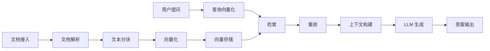

# 项目一：企业知识库问答系统（端到端）

## 项目概述

构建一个完整的企业知识库问答系统，从文档接入到最终回答，涵盖 RAG 的全链路实现。



## 技术架构

| 组件 | 技术选型 | 说明 |
|------|----------|------|
| 后端框架 | FastAPI | 高性能异步 API |
| 向量数据库 | Milvus | 支持百万级向量检索 |
| Embedding | BGE-M3 | 多语言向量化模型 |
| LLM | Qwen2.5-7B / API | 生成回答 |
| 文档解析 | Unstructured | 支持 PDF/Word/HTML |
| 任务队列 | Celery + Redis | 异步文档处理 |
| 前端 | Vue.js | 简洁交互界面 |

## 项目结构

```
enterprise-kb/
  app/
    main.py                 # FastAPI 入口
    config.py               # 配置管理
    api/
      routes/
        chat.py             # 问答接口
        documents.py        # 文档管理接口
    services/
      document_service.py   # 文档处理服务
      embedding_service.py  # 向量化服务
      retrieval_service.py  # 检索服务
      generation_service.py # 生成服务
    models/
      document.py           # 文档数据模型
      chat.py               # 对话数据模型
    core/
      chunker.py            # 文本分块
      vector_store.py       # 向量存储封装
      reranker.py           # 重排器
  worker/
    tasks.py                # Celery 异步任务
  tests/
    test_retrieval.py       # 检索测试
    test_generation.py      # 生成测试
  docker-compose.yml
  requirements.txt
```

## 核心实现

### 文档解析与分块

```python
# app/core/chunker.py
from dataclasses import dataclass
from typing import Callable
import re

@dataclass
class Chunk:
    text: str
    metadata: dict
    chunk_id: str
    doc_id: str
    index: int

class DocumentChunker:
    """智能文档分块器"""

    def __init__(self, chunk_size: int = 512, chunk_overlap: int = 64,
                 separators: list[str] = None):
        self.chunk_size = chunk_size
        self.chunk_overlap = chunk_overlap
        self.separators = separators or ["\n\n", "\n", "。", ".", "；", ";", " "]

    def chunk(self, text: str, doc_id: str, metadata: dict = None) -> list[Chunk]:
        """将文档分割为块"""
        # 先按段落预分割
        paragraphs = self._split_by_structure(text)
        chunks = []
        current_chunk = ""
        chunk_index = 0

        for para in paragraphs:
            if len(current_chunk) + len(para) > self.chunk_size and current_chunk:
                chunks.append(Chunk(
                    text=current_chunk.strip(),
                    metadata=metadata or {},
                    chunk_id=f"{doc_id}_chunk_{chunk_index}",
                    doc_id=doc_id,
                    index=chunk_index,
                ))
                # 保留 overlap
                current_chunk = self._get_overlap(current_chunk) + para
                chunk_index += 1
            else:
                current_chunk += para + "\n"

        # 最后一块
        if current_chunk.strip():
            chunks.append(Chunk(
                text=current_chunk.strip(),
                metadata=metadata or {},
                chunk_id=f"{doc_id}_chunk_{chunk_index}",
                doc_id=doc_id,
                index=chunk_index,
            ))

        return chunks

    def _split_by_structure(self, text: str) -> list[str]:
        """按文档结构分割（标题、段落）"""
        # 按标题分割
        sections = re.split(r'(?=^#{1,6}\s)', text, flags=re.MULTILINE)
        if len(sections) > 1:
            return [s.strip() for s in sections if s.strip()]

        # 按段落分割
        paragraphs = re.split(r'\n\s*\n', text)
        return [p.strip() for p in paragraphs if p.strip()]

    def _get_overlap(self, text: str) -> str:
        """获取重叠部分（按字符，兼容中文和英文）"""
        if len(text) <= self.chunk_overlap:
            return text
        return text[-self.chunk_overlap:]
```

### 向量存储

```python
# app/core/vector_store.py
from pymilvus import MilvusClient, DataType
import numpy as np

class MilvusVectorStore:
    """Milvus 向量存储封装"""

    def __init__(self, uri: str = "http://localhost:19530",
                 collection_name: str = "enterprise_kb"):
        self.client = MilvusClient(uri=uri)
        self.collection_name = collection_name
        self._ensure_collection()

    def _ensure_collection(self):
        """确保集合存在"""
        if self.client.has_collection(self.collection_name):
            return

        from pymilvus import CollectionSchema, FieldSchema
        schema = CollectionSchema(fields=[
            FieldSchema(name="chunk_id", dtype=DataType.VARCHAR, max_length=128,
                        is_primary=True),
            FieldSchema(name="doc_id", dtype=DataType.VARCHAR, max_length=128),
            FieldSchema(name="text", dtype=DataType.VARCHAR, max_length=8192),
            FieldSchema(name="vector", dtype=DataType.FLOAT_VECTOR,
                        dim=1024),  # BGE-M3 维度
            FieldSchema(name="source", dtype=DataType.VARCHAR, max_length=256),
            FieldSchema(name="page_num", dtype=DataType.INT64),
        ])

        self.client.create_collection(
            collection_name=self.collection_name,
            schema=schema,
        )

        # 创建索引
        self.client.create_index(
            collection_name=self.collection_name,
            field_name="vector",
            index_params={
                "index_type": "IVF_FLAT",
                "metric_type": "COSINE",
                "params": {"nlist": 1024},
            },
        )

    def insert(self, chunks: list[dict], vectors: list[list[float]]):
        """插入文档块和向量"""
        data = []
        for chunk, vector in zip(chunks, vectors):
            data.append({
                "chunk_id": chunk["chunk_id"],
                "doc_id": chunk["doc_id"],
                "text": chunk["text"],
                "vector": vector,
                "source": chunk.get("metadata", {}).get("source", ""),
                "page_num": chunk.get("metadata", {}).get("page_num", 0),
            })

        self.client.insert(
            collection_name=self.collection_name,
            data=data,
        )

    def search(self, query_vector: list[float], top_k: int = 5,
               filter_expr: str = None) -> list[dict]:
        """向量检索"""
        results = self.client.search(
            collection_name=self.collection_name,
            data=[query_vector],
            limit=top_k,
            output_fields=["chunk_id", "doc_id", "text", "source", "page_num"],
            filter=filter_expr,
        )

        hits = []
        for result in results[0]:
            hits.append({
                "chunk_id": result["entity"]["chunk_id"],
                "doc_id": result["entity"]["doc_id"],
                "text": result["entity"]["text"],
                "source": result["entity"]["source"],
                "page_num": result["entity"]["page_num"],
                "score": result["distance"],
            })

        return hits

    def delete_by_doc(self, doc_id: str):
        """按文档 ID 删除所有块"""
        self.client.delete(
            collection_name=self.collection_name,
            filter=f'doc_id == "{doc_id}"',
        )
```

### 检索与重排

```python
# app/services/retrieval_service.py
from typing import Optional

class RetrievalService:
    """检索服务：向量检索 + 重排"""

    def __init__(self, vector_store: MilvusVectorStore,
                 embedder, reranker=None):
        self.vector_store = vector_store
        self.embedder = embedder
        self.reranker = reranker

    async def retrieve(self, query: str, top_k: int = 5,
                       doc_filter: Optional[str] = None) -> list[dict]:
        """检索相关文档块"""
        # 1. 向量检索
        query_vector = self.embedder.embed_query(query)
        candidates = self.vector_store.search(
            query_vector=query_vector,
            top_k=top_k * 3,  # 多召回，后面重排
            filter_expr=doc_filter,
        )

        # 2. 相似度过滤
        candidates = [c for c in candidates if c["score"] >= 0.5]

        if not candidates:
            return []

        # 3. 重排
        if self.reranker:
            candidates = self.reranker.rerank(query, candidates, top_k=top_k)
        else:
            candidates = candidates[:top_k]

        return candidates
```

```python
# app/core/reranker.py
class CrossEncoderReranker:
    """基于交叉编码器的重排器"""

    def __init__(self, model_name: str = "BAAI/bge-reranker-v2-m3"):
        from sentence_transformers import CrossEncoder
        self.model = CrossEncoder(model_name)

    def rerank(self, query: str, documents: list[dict],
               top_k: int = 5) -> list[dict]:
        """重排文档"""
        pairs = [(query, doc["text"]) for doc in documents]
        scores = self.model.predict(pairs)

        # 按分数排序
        scored_docs = list(zip(documents, scores))
        scored_docs.sort(key=lambda x: x[1], reverse=True)

        results = []
        for doc, score in scored_docs[:top_k]:
            doc["rerank_score"] = float(score)
            results.append(doc)

        return results
```

### 生成服务

```python
# app/services/generation_service.py
class GenerationService:
    """回答生成服务"""

    SYSTEM_PROMPT = """你是一个企业知识库助手。请根据提供的参考资料回答用户问题。

规则：
1. 只根据参考资料回答，不要编造信息
2. 如果参考资料中没有相关信息，明确说明"根据已有资料无法回答"
3. 引用信息时标注来源
4. 回答要简洁准确"""

    def __init__(self, llm_client):
        self.client = llm_client

    async def generate(self, query: str, contexts: list[dict],
                       chat_history: list[dict] = None) -> dict:
        """生成回答"""
        # 构建上下文
        context_text = self._format_contexts(contexts)

        messages = [
            {"role": "system", "content": self.SYSTEM_PROMPT},
        ]

        # 添加对话历史
        if chat_history:
            messages.extend(chat_history[-6:])  # 最近 3 轮

        messages.append({
            "role": "user",
            "content": f"参考资料：\n{context_text}\n\n问题：{query}"
        })

        response = self.client.chat.completions.create(
            model=self.client.model,
            messages=messages,
            temperature=0.1,
            max_tokens=1024,
        )

        answer = response.choices[0].message.content

        return {
            "answer": answer,
            "sources": [
                {"doc_id": c["doc_id"], "source": c["source"],
                 "page": c.get("page_num", 0), "score": c.get("rerank_score", c["score"])}
                for c in contexts
            ],
            "usage": {
                "prompt_tokens": response.usage.prompt_tokens,
                "completion_tokens": response.usage.completion_tokens,
            },
        }

    def _format_contexts(self, contexts: list[dict]) -> str:
        """格式化检索到的上下文"""
        formatted = []
        for i, ctx in enumerate(contexts, 1):
            formatted.append(
                f"[来源{i}] 文档: {ctx['source']}, 页码: {ctx.get('page_num', 'N/A')}\n{ctx['text']}"
            )
        return "\n\n".join(formatted)
```

### FastAPI 接口

```python
# app/main.py
from fastapi import FastAPI, UploadFile, File, HTTPException
from contextlib import asynccontextmanager

@asynccontextmanager
async def lifespan(app: FastAPI):
    # 启动时初始化服务
    app.state.vector_store = MilvusVectorStore()
    app.state.retrieval = RetrievalService(app.state.vector_store, embedder)
    app.state.generation = GenerationService(llm_client)
    yield

app = FastAPI(title="Enterprise KB", lifespan=lifespan)

@app.post("/api/chat")
async def chat(request: ChatRequest):
    """问答接口"""
    # 1. 检索
    contexts = await app.state.retrieval.retrieve(
        query=request.question,
        top_k=5,
    )

    if not contexts:
        return {"answer": "抱歉，根据已有资料无法回答该问题。", "sources": []}

    # 2. 生成
    result = await app.state.generation.generate(
        query=request.question,
        contexts=contexts,
        chat_history=request.history,
    )

    return result

@app.post("/api/documents/upload")
async def upload_document(file: UploadFile = File(...)):
    """上传文档"""
    # 保存文件 -> 触发异步处理任务
    content = await file.read()
    task = process_document.delay(content, file.filename)
    return {"task_id": task.id, "status": "processing"}

@app.delete("/api/documents/{doc_id}")
async def delete_document(doc_id: str):
    """删除文档"""
    app.state.vector_store.delete_by_doc(doc_id)
    return {"status": "deleted"}
```

## 部署指南

### Docker Compose 部署

```yaml
# docker-compose.yml
version: "3.8"

services:
  api:
    build: .
    ports:
      - "8000:8000"
    environment:
      - MILVUS_URI=http://milvus:19530
      - REDIS_URL=redis://redis:6379
      - LLM_API_URL=http://vllm:8000/v1
    depends_on:
      - milvus
      - redis
      - vllm

  worker:
    build: .
    command: celery -A worker.tasks worker -l info
    environment:
      - MILVUS_URI=http://milvus:19530
      - REDIS_URL=redis://redis:6379
    depends_on:
      - redis
      - milvus

  milvus:
    image: milvusdb/milvus:v2.4-latest
    ports:
      - "19530:19530"
    volumes:
      - milvus-data:/var/lib/milvus

  redis:
    image: redis:7-alpine
    ports:
      - "6379:6379"

  vllm:
    image: vllm/vllm-openai:latest
    ports:
      - "8001:8000"
    deploy:
      resources:
        reservations:
          devices:
            - driver: nvidia
              count: 1
              capabilities: [gpu]
    command: >
      --model Qwen/Qwen2.5-7B
      --max-model-len 4096

  embedding:
    build: ./embedding_service
    ports:
      - "8002:8000"
    deploy:
      resources:
        reservations:
          devices:
            - driver: nvidia
              count: 1
              capabilities: [gpu]

volumes:
  milvus-data:
```

### 启动命令

```bash
# 启动所有服务
docker-compose up -d

# 检查服务状态
docker-compose ps

# 上传测试文档
curl -X POST http://localhost:8000/api/documents/upload \
  -F "file=@test_doc.pdf"

# 问答测试
curl -X POST http://localhost:8000/api/chat \
  -H "Content-Type: application/json" \
  -d '{"question": "公司的请假制度是什么？"}'
```

## 评估方案

| 指标 | 目标 | 测量方法 |
|------|------|----------|
| 检索召回率 | > 85% | 人工标注 + 自动评估 |
| 回答准确率 | > 90% | 人工评估 + GPT-4 评判 |
| 端到端延迟 | < 3s | 压测 |
| 幻觉率 | < 5% | 忠实度检测 |
| 并发支持 | 100 QPS | 压测 |

## 优化方向

1. **混合检索**：向量检索 + BM25 关键词检索，提升召回
2. **查询改写**：对用户查询进行扩展和纠错
3. **多轮对话**：维护对话上下文，支持追问
4. **权限控制**：按部门/角色限制文档访问
5. **增量更新**：文档变更时只更新变化的部分
