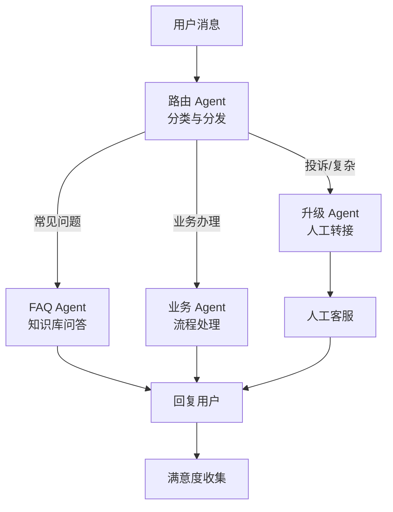

# 项目二：多 Agent 智能客服系统

## 系统架构

多 Agent 客服系统通过将不同任务分配给专业 Agent，实现高效的客户服务流程。



### Agent 职责

| Agent | 职责 | 能力 |
|-------|------|------|
| 路由 Agent | 分类意图，分发请求 | 意图识别、情绪判断 |
| FAQ Agent | 回答常见问题 | RAG 检索 + 生成 |
| 业务 Agent | 处理业务请求 | 工具调用、流程编排 |
| 升级 Agent | 转接人工 | 上下文传递、工单创建 |

## LangGraph 实现

### 状态定义

```python
from typing import TypedDict, Annotated, Literal
from langgraph.graph import StateGraph, END
from langgraph.graph.message import add_messages

class CustomerServiceState(TypedDict):
    messages: Annotated[list, add_messages]
    intent: str | None
    sentiment: str | None
    current_agent: str | None
    context: dict
    needs_human: bool
    resolved: bool
    session_id: str
```

### 路由 Agent

```python
from openai import AsyncOpenAI
import json

class RouterAgent:
    """路由 Agent：意图分类与分发"""

    INTENT_MAP = {
        "faq": "faq_agent",           # 常见问题
        "business": "business_agent",  # 业务办理
        "complaint": "escalation_agent",  # 投诉
        "greeting": "faq_agent",       # 问候
        "other": "escalation_agent",   # 其他 -> 升级
    }

    def __init__(self):
        self.client = AsyncOpenAI()

    async def route(self, state: CustomerServiceState) -> dict:
        """分析用户意图并路由"""
        last_message = state["messages"][-1].content if state["messages"] else ""

        response = await self.client.chat.completions.create(
            model="gpt-4o-mini",
            messages=[{
                "role": "system",
                "content": """分析客户消息的意图和情绪。

意图类型：
- faq: 咨询常见问题（价格、政策、使用方法等）
- business: 业务办理（下单、退款、修改信息等）
- complaint: 投诉或表达不满
- greeting: 问候或闲聊
- other: 无法分类

情绪类型：positive, neutral, negative, angry

以 JSON 输出: {"intent": "...", "sentiment": "...", "confidence": 0.0-1.0}"""
            }, {
                "role": "user",
                "content": last_message
            }],
            response_format={"type": "json_object"},
            temperature=0,
        )

        result = json.loads(response.choices[0].message.content)
        intent = result["intent"]
        sentiment = result["sentiment"]
        confidence = result["confidence"]

        # 情绪激动直接升级
        if sentiment == "angry" and confidence > 0.7:
            target_agent = "escalation_agent"
        else:
            target_agent = self.INTENT_MAP.get(intent, "escalation_agent")

        return {
            "intent": intent,
            "sentiment": sentiment,
            "current_agent": target_agent,
            "needs_human": target_agent == "escalation_agent",
        }
```

### FAQ Agent

```python
from langchain_core.messages import AIMessage

class FAQAgent:
    """FAQ Agent：基于知识库的问答"""

    def __init__(self, vector_store, embedder, api_key: str = None, base_url: str = None):
        self.vector_store = vector_store
        self.embedder = embedder
        self.client = AsyncOpenAI(api_key=api_key, base_url=base_url)

    async def answer(self, state: CustomerServiceState) -> dict:
        """检索知识库并生成回答"""
        question = state["messages"][-1].content

        # 1. 向量检索
        query_vector = self.embedder.embed_query(question)
        docs = self.vector_store.search(query_vector, top_k=3)

        if not docs:
            return {
                "messages": [AIMessage(content="抱歉，我暂时无法回答这个问题，正在为您转接人工客服。")],
                "needs_human": True,
            }

        # 2. 构建上下文
        context = "\n".join(d["text"] for d in docs)

        # 3. 生成回答
        response = await self.client.chat.completions.create(
            model="gpt-4o-mini",
            messages=[
                {"role": "system", "content": f"""你是客服助手。根据以下知识库内容回答用户问题。
如果知识库中没有答案，请说"我需要为您转接人工客服"。

知识库内容：
{context}"""},
                {"role": "user", "content": question},
            ],
            temperature=0.1,
            max_tokens=512,
        )

        answer = response.choices[0].message.content

        # 检测是否需要转人工
        needs_human_keywords = ["转人工", "转接人工", "人工客服", "人工服务", "无法解决", "超出范围"]
        needs_human = any(kw in answer for kw in needs_human_keywords)

        return {
            "messages": [AIMessage(content=answer)],
            "resolved": not needs_human,
            "needs_human": needs_human,
        }
```

### 业务 Agent

```python
class BusinessAgent:
    """业务 Agent：处理业务请求，支持工具调用"""

    TOOLS = [
        {
            "type": "function",
            "function": {
                "name": "query_order",
                "description": "查询订单状态",
                "parameters": {
                    "type": "object",
                    "properties": {
                        "order_id": {"type": "string", "description": "订单号"},
                    },
                    "required": ["order_id"],
                },
            }
        },
        {
            "type": "function",
            "function": {
                "name": "create_refund",
                "description": "创建退款申请",
                "parameters": {
                    "type": "object",
                    "properties": {
                        "order_id": {"type": "string", "description": "订单号"},
                        "reason": {"type": "string", "description": "退款原因"},
                        "amount": {"type": "number", "description": "退款金额"},
                    },
                    "required": ["order_id", "reason"],
                },
            }
        },
        {
            "type": "function",
            "function": {
                "name": "update_address",
                "description": "修改收货地址",
                "parameters": {
                    "type": "object",
                    "properties": {
                        "order_id": {"type": "string", "description": "订单号"},
                        "new_address": {"type": "string", "description": "新地址"},
                    },
                    "required": ["order_id", "new_address"],
                },
            }
        },
    ]

    def __init__(self):
        self.client = AsyncOpenAI()

    async def handle(self, state: CustomerServiceState) -> dict:
        """处理业务请求"""
        user_message = state["messages"][-1].content

        # 对话历史
        messages = [
            {"role": "system", "content": "你是业务办理助手，帮助客户处理订单相关业务。"},
        ]
        # 添加最近对话历史
        for msg in state["messages"][-6:]:
            messages.append({"role": msg.role, "content": msg.content})

        response = await self.client.chat.completions.create(
            model="gpt-4o-mini",
            messages=messages,
            tools=self.TOOLS,
            temperature=0,
        )

        message = response.choices[0].message

        # 处理工具调用
        if message.tool_calls:
            tool_results = []
            for tool_call in message.tool_calls:
                result = self._execute_tool(tool_call.function.name,
                                           json.loads(tool_call.function.arguments))
                tool_results.append({
                    "role": "tool",
                    "content": json.dumps(result, ensure_ascii=False),
                    "tool_call_id": tool_call.id,
                })

            # 再次调用 LLM 处理工具结果
            messages.append(message)
            messages.extend(tool_results)

            final_response = await self.client.chat.completions.create(
                model="gpt-4o-mini",
                messages=messages,
                temperature=0,
            )

            answer = final_response.choices[0].message.content
        else:
            answer = message.content

        return {
            "messages": [AIMessage(content=answer)],
            "resolved": True,
        }

    def _execute_tool(self, name: str, args: dict) -> dict:
        """执行工具调用"""
        if name == "query_order":
            return {"status": "shipped", "eta": "3 天内到达",
                    "tracking_no": "SF1234567890"}
        elif name == "create_refund":
            return {"refund_id": "RF20250115001", "status": "processing",
                    "estimated_days": 3}
        elif name == "update_address":
            return {"status": "success", "new_address": args["new_address"]}
        return {"error": "unknown tool"}
```

### 升级 Agent

```python
from uuid import uuid4

class EscalationAgent:
    """升级 Agent：转接人工客服"""

    async def escalate(self, state: CustomerServiceState) -> dict:
        """创建工单并转接人工"""
        conversation_summary = await self._summarize(state)

        ticket = {
            "ticket_id": f"TK-{uuid4().hex[:8].upper()}",
            "session_id": state["session_id"],
            "intent": state.get("intent"),
            "sentiment": state.get("sentiment"),
            "summary": conversation_summary,
            "priority": "high" if state.get("sentiment") == "angry" else "normal",
        }

        return {
            "messages": [AIMessage(
                content=f"正在为您转接人工客服，请稍候。\n"
                        f"工单号：{ticket['ticket_id']}\n"
                        f"您的问题已记录，客服人员会很快与您联系。"
            )],
            "needs_human": True,
            "context": {**state.get("context", {}), "ticket": ticket},
        }

    async def _summarize(self, state: CustomerServiceState) -> str:
        """总结对话"""
        messages = state.get("messages", [])
        if not messages:
            return ""

        conversation = "\n".join(f"{m.role}: {m.content}" for m in messages[-10:])

        client = AsyncOpenAI()
        response = await client.chat.completions.create(
            model="gpt-4o-mini",
            messages=[{
                "role": "user",
                "content": f"请用 2-3 句话总结以下客户对话的关键信息：\n{conversation}"
            }],
            temperature=0,
            max_tokens=200,
        )
        return response.choices[0].message.content
```

### LangGraph 编排

```python
def build_customer_service_graph():
    """构建客服系统工作流"""

    router = RouterAgent()
    faq = FAQAgent(vector_store, embedder, llm_client)
    business = BusinessAgent()
    escalation = EscalationAgent()

    # 定义图
    graph = StateGraph(CustomerServiceState)

    # 添加节点
    graph.add_node("router", router.route)
    graph.add_node("faq_agent", faq.answer)
    graph.add_node("business_agent", business.handle)
    graph.add_node("escalation_agent", escalation.escalate)

    # 定义边
    graph.set_entry_point("router")

    # 条件路由
    graph.add_conditional_edges(
        "router",
        lambda state: state["current_agent"],
        {
            "faq_agent": "faq_agent",
            "business_agent": "business_agent",
            "escalation_agent": "escalation_agent",
        }
    )

    # 各 Agent 完成后判断是否结束
    graph.add_conditional_edges(
        "faq_agent",
        lambda state: "end" if state.get("resolved") or state.get("needs_human") else "router",
        {"end": END, "router": "router"}
    )
    graph.add_conditional_edges(
        "business_agent",
        lambda state: "end" if state.get("resolved") else "router",
        {"end": END, "router": "router"}
    )
    graph.add_edge("escalation_agent", END)

    return graph.compile()
```

## 记忆管理

```python
class ConversationMemory:
    """对话记忆管理"""

    def __init__(self, redis_client, max_turns: int = 10):
        self.redis = redis_client
        self.max_turns = max_turns

    def get_history(self, session_id: str) -> list[dict]:
        """获取对话历史"""
        key = f"chat_history:{session_id}"
        data = self.redis.get(key)
        if data:
            history = json.loads(data)
            return history[-self.max_turns:]
        return []

    def add_message(self, session_id: str, role: str, content: str):
        """添加消息"""
        key = f"chat_history:{session_id}"
        history = self.get_history(session_id)
        history.append({"role": role, "content": content})

        # 保留最近 N 轮
        if len(history) > self.max_turns * 2:
            history = history[-self.max_turns * 2:]

        self.redis.setex(key, 3600, json.dumps(history, ensure_ascii=False))

    def clear(self, session_id: str):
        """清除对话历史"""
        self.redis.delete(f"chat_history:{session_id}")
```

## 生产注意事项

1. **并发控制**：限制单用户请求频率，防止滥用
2. **超时处理**：每个 Agent 设置超时，避免长时间等待
3. **降级策略**：LLM 不可用时回退到规则引擎
4. **审计日志**：记录所有对话和工具调用
5. **敏感信息**：对话中检测并脱敏 PII
6. **质量监控**：实时监控回答质量和用户满意度
7. **A/B 测试**：新 Agent 版本先灰度上线
