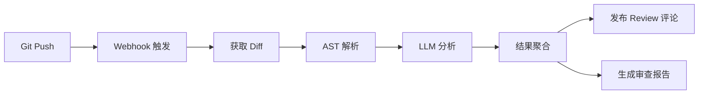

# 项目三：AI 辅助代码审查工具

## 项目概述

利用 LLM 分析代码变更，自动检测 Bug、安全漏洞、代码风格问题，并生成审查意见。



## 核心设计

### 代码变更获取

```python
import subprocess
from dataclasses import dataclass

@dataclass
class CodeChange:
    file_path: str
    language: str
    added_lines: list[str]
    removed_lines: list[str]
    diff_hunk: str
    start_line: int
    end_line: int
    change_type: str = "modify"  # add / delete / modify

class DiffParser:
    """解析 Git Diff"""

    def parse(self, diff_text: str) -> list[CodeChange]:
        """解析 unified diff 格式，提取变更信息"""
        changes = []
        current_file = None
        current_lang = None
        current_hunk_start = None
        current_hunk_lines = []
        current_hunk_header = None

        for line in diff_text.split("\n"):
            # 文件头：diff --git a/path b/path
            if line.startswith("diff --git"):
                # 保存前一个 hunk
                if current_file and current_hunk_start is not None and current_hunk_lines:
                    changes.append(self._build_change(
                        current_file, current_lang, current_hunk_start,
                        current_hunk_lines, current_hunk_header
                    ))
                # 新文件
                parts = line.split(" b/")
                current_file = parts[-1] if len(parts) > 1 else ""
                current_lang = self._detect_language(current_file)
                current_hunk_start = None
                current_hunk_lines = []
                current_hunk_header = None
                continue

            # --- a/path 或 --- /dev/null
            if line.startswith("--- a/") or line.startswith("--- /dev/null"):
                continue
            # +++ b/path
            if line.startswith("+++ b/"):
                current_file = line[6:]
                current_lang = self._detect_language(current_file)
                continue

            # Hunk 头：@@ -start,count +start,count @@
            if line.startswith("@@"):
                # 保存前一个 hunk
                if current_file and current_hunk_start is not None and current_hunk_lines:
                    changes.append(self._build_change(
                        current_file, current_lang, current_hunk_start,
                        current_hunk_lines, current_hunk_header
                    ))

                # 解析新 hunk 的起始行号
                import re
                match = re.search(r'@@ -\d+(?:,\d+)? \+(\d+)(?:,(\d+))? @@', line)
                if match:
                    current_hunk_start = int(match.group(1))
                current_hunk_header = line
                current_hunk_lines = []
                continue

            # 收集 hunk 内容
            if current_file and current_hunk_start is not None:
                if line.startswith("+") or line.startswith("-"):
                    current_hunk_lines.append(line)

        # 处理最后一个 hunk
        if current_file and current_hunk_start is not None and current_hunk_lines:
            changes.append(self._build_change(
                current_file, current_lang, current_hunk_start,
                current_hunk_lines, current_hunk_header
            ))

        return changes

    def _build_change(self, file_path, language, start_line, hunk_lines,
                      hunk_header) -> CodeChange:
        """从 hunk 行构建 CodeChange 对象"""
        added = [l[1:] for l in hunk_lines if l.startswith("+")]
        removed = [l[1:] for l in hunk_lines if l.startswith("-")]
        change_type = (
            "add" if not removed else
            "delete" if not added else "modify"
        )
        return CodeChange(
            file_path=file_path,
            language=language,
            added_lines=added,
            removed_lines=removed,
            diff_hunk=hunk_header or "",
            start_line=start_line,
            end_line=start_line + max(len(added), len(removed)) - 1,
            change_type=change_type,
        )

    def get_diff(self, repo_path: str, base_branch: str = "main",
                 head_branch: str = "HEAD") -> str:
        """获取 Git Diff"""
        result = subprocess.run(
            ["git", "diff", f"origin/{base_branch}...{head_branch}"],
            cwd=repo_path,
            capture_output=True,
            text=True,
        )
        return result.stdout

    def _detect_language(self, file_path: str) -> str:
        ext_map = {
            ".py": "python", ".js": "javascript", ".ts": "typescript",
            ".java": "java", ".go": "go", ".rs": "rust",
            ".cpp": "cpp", ".c": "c", ".rb": "ruby",
        }
        import os
        _, ext = os.path.splitext(file_path)
        return ext_map.get(ext, "unknown")
```

### AST 解析

```python
import ast
from dataclasses import dataclass

@dataclass
class CodeIssue:
    file_path: str
    line_number: int
    severity: str       # critical / warning / info
    category: str       # security / bug / style / performance
    message: str
    suggestion: str

class PythonASTAnalyzer:
    """Python AST 静态分析"""

    def analyze(self, code: str, file_path: str) -> list[CodeIssue]:
        """分析 Python 代码"""
        issues = []

        try:
            tree = ast.parse(code)
        except SyntaxError as e:
            issues.append(CodeIssue(
                file_path=file_path,
                line_number=e.lineno or 0,
                severity="critical",
                category="bug",
                message=f"语法错误: {e.msg}",
                suggestion="修复语法错误",
            ))
            return issues

        for node in ast.walk(tree):
            # SQL 注入检测
            issues.extend(self._check_sql_injection(node, file_path))
            # 硬编码密钥检测
            issues.extend(self._check_hardcoded_secrets(node, file_path))
            # 不安全函数检测
            issues.extend(self._check_unsafe_functions(node, file_path))
            # 异常处理检测
            issues.extend(self._check_exception_handling(node, file_path))

        return issues

    def _check_sql_injection(self, node, file_path: str) -> list[CodeIssue]:
        """检测 SQL 注入风险"""
        issues = []

        if isinstance(node, ast.Call):
            # 检测字符串拼接 SQL
            if isinstance(node.func, ast.Attribute):
                if node.func.attr in ("execute", "executemany"):
                    for arg in node.args:
                        if isinstance(arg, ast.JoinedStr):
                            # f-string 拼接 SQL
                            issues.append(CodeIssue(
                                file_path=file_path,
                                line_number=node.lineno,
                                severity="critical",
                                category="security",
                                message="SQL 注入风险：使用 f-string 拼接 SQL 语句",
                                suggestion="使用参数化查询：cursor.execute('SELECT * FROM users WHERE id = %s', (user_id,))",
                            ))
                        elif isinstance(arg, ast.BinOp) and isinstance(arg.op, ast.Mod):
                            # % 格式化 SQL
                            issues.append(CodeIssue(
                                file_path=file_path,
                                line_number=node.lineno,
                                severity="critical",
                                category="security",
                                message="SQL 注入风险：使用 % 格式化 SQL 语句",
                                suggestion="使用参数化查询替代字符串格式化",
                            ))

        return issues

    def _check_hardcoded_secrets(self, node, file_path: str) -> list[CodeIssue]:
        """检测硬编码密钥"""
        issues = []
        secret_patterns = ["password", "secret", "api_key", "token", "private_key"]

        if isinstance(node, ast.Assign):
            for target in node.targets:
                if isinstance(target, ast.Name):
                    name_lower = target.id.lower()
                    if any(p in name_lower for p in secret_patterns):
                        if isinstance(node.value, ast.Constant) and isinstance(node.value.value, str):
                            if len(node.value.value) > 5:  # 非空字符串
                                issues.append(CodeIssue(
                                    file_path=file_path,
                                    line_number=node.lineno,
                                    severity="critical",
                                    category="security",
                                    message=f"硬编码密钥：{target.id}",
                                    suggestion="使用环境变量或密钥管理服务",
                                ))

        return issues

    def _check_unsafe_functions(self, node, file_path: str) -> list[CodeIssue]:
        """检测不安全函数调用"""
        issues = []
        unsafe = {
            "eval": "避免对不可信输入使用 eval，存在代码注入风险",
            "exec": "避免对不可信输入使用 exec，存在代码注入风险",
            "pickle.loads": "反序列化不可信数据可能导致远程代码执行",
            "subprocess.call": "使用 subprocess.run 替代，避免 shell=True",
            "subprocess.Popen": "使用 subprocess.run 替代，避免 shell=True",
            "system": "使用 subprocess.run 替代 os.system",
            "run": "检查是否设置了 shell=True",
        }

        if isinstance(node, ast.Call):
            func_name = None
            if isinstance(node.func, ast.Name):
                func_name = node.func.id
            elif isinstance(node.func, ast.Attribute):
                func_name = node.func.attr

            if func_name in unsafe:
                issues.append(CodeIssue(
                    file_path=file_path,
                    line_number=node.lineno,
                    severity="warning",
                    category="security",
                    message=unsafe[func_name],
                    suggestion=f"避免使用 {func_name}，寻找更安全的替代方案",
                ))

        return issues

    def _check_exception_handling(self, node, file_path: str) -> list[CodeIssue]:
        """检测异常处理问题"""
        issues = []

        if isinstance(node, ast.ExceptHandler):
            if node.type is None:
                # bare except
                issues.append(CodeIssue(
                    file_path=file_path,
                    line_number=node.lineno,
                    severity="warning",
                    category="style",
                    message="裸 except 会捕获所有异常，包括 KeyboardInterrupt",
                    suggestion="使用 except Exception 替代 bare except",
                ))

        return issues
```

### LLM 深度分析

```python
class LLMCodeReviewer:
    """LLM 代码审查"""

    REVIEW_PROMPT = """请审查以下代码变更，从以下维度分析：

1. **正确性**：逻辑是否有 Bug？
2. **安全性**：是否存在安全漏洞？
3. **性能**：是否有性能问题？
4. **可维护性**：代码是否清晰易懂？
5. **边界条件**：是否处理了边界情况？

请对每个发现的问题输出 JSON：
```json
{
  "issues": [
    {
      "line": 行号,
      "severity": "critical|warning|info",
      "category": "bug|security|performance|style|edge_case",
      "message": "问题描述",
      "suggestion": "修改建议"
    }
  ],
  "summary": "整体评价",
  "approved": true/false
}
```

文件: {file_path} ({language})
变更内容:
```diff
{diff}
```

上下文代码:
```
{context}
```"""

    def __init__(self, model: str = "deepseek-chat"):
        from openai import OpenAI
        self.client = OpenAI(base_url="https://api.deepseek.com")
        self.model = model

    def review(self, change: CodeChange, context: str = "") -> dict:
        """审查单个代码变更"""
        prompt = self.REVIEW_PROMPT.format(
            file_path=change.file_path,
            language=change.language,
            diff=change.diff_hunk,
            context=context[:3000],  # 限制上下文长度
        )

        response = self.client.chat.completions.create(
            model=self.model,
            messages=[{"role": "user", "content": prompt}],
            response_format={"type": "json_object"},
            temperature=0,
            max_tokens=2048,
        )

        try:
            result = json.loads(response.choices[0].message.content)
        except json.JSONDecodeError:
            result = {"issues": [], "summary": "解析失败", "approved": True}

        return result
```

### 综合审查编排

```python
class CodeReviewOrchestrator:
    """代码审查编排器"""

    def __init__(self):
        self.ast_analyzer = PythonASTAnalyzer()
        self.llm_reviewer = LLMCodeReviewer()
        self.diff_parser = DiffParser()

    def review_pull_request(self, repo_path: str, base: str = "main",
                            head: str = "HEAD") -> dict:
        """审查 Pull Request"""
        # 1. 获取 diff
        diff_text = self.diff_parser.get_diff(repo_path, base, head)
        changes = self.diff_parser.parse(diff_text)

        # 2. 并行分析
        all_issues = []

        for change in changes:
            # AST 静态分析
            code = "\n".join(change.added_lines)
            ast_issues = self.ast_analyzer.analyze(code, change.file_path)
            all_issues.extend(ast_issues)

            # LLM 深度分析（仅对 Python 文件）
            if change.language == "python":
                context = self._get_context(repo_path, change.file_path)
                llm_result = self.llm_reviewer.review(change, context)
                for issue in llm_result.get("issues", []):
                    all_issues.append(CodeIssue(
                        file_path=change.file_path,
                        line_number=issue.get("line", 0),
                        severity=issue.get("severity", "info"),
                        category=issue.get("category", "style"),
                        message=issue.get("message", ""),
                        suggestion=issue.get("suggestion", ""),
                    ))

        # 3. 去重和排序
        all_issues = self._deduplicate(all_issues)
        all_issues.sort(key=lambda i: {"critical": 0, "warning": 1, "info": 2}.get(i.severity, 3))

        # 4. 生成报告
        report = self._generate_report(all_issues, len(changes))

        return report

    def _get_context(self, repo_path: str, file_path: str) -> str:
        """获取文件上下文"""
        full_path = f"{repo_path}/{file_path}"
        try:
            with open(full_path, "r", encoding="utf-8") as f:
                return f.read()[:5000]
        except Exception:
            return ""

    def _deduplicate(self, issues: list[CodeIssue]) -> list[CodeIssue]:
        """去重"""
        seen = set()
        unique = []
        for issue in issues:
            key = (issue.file_path, issue.line_number, issue.message[:50])
            if key not in seen:
                seen.add(key)
                unique.append(issue)
        return unique

    def _generate_report(self, issues: list[CodeIssue], file_count: int) -> dict:
        """生成审查报告"""
        severity_counts = {"critical": 0, "warning": 0, "info": 0}
        category_counts = {}

        for issue in issues:
            severity_counts[issue.severity] = severity_counts.get(issue.severity, 0) + 1
            category_counts[issue.category] = category_counts.get(issue.category, 0) + 1

        approved = severity_counts.get("critical", 0) == 0

        return {
            "approved": approved,
            "file_count": file_count,
            "issue_count": len(issues),
            "severity_summary": severity_counts,
            "category_summary": category_counts,
            "issues": [
                {
                    "file": i.file_path,
                    "line": i.line_number,
                    "severity": i.severity,
                    "category": i.category,
                    "message": i.message,
                    "suggestion": i.suggestion,
                }
                for i in issues
            ],
        }
```

### Git 集成

```python
class GitReviewIntegration:
    """与 Git 平台集成"""

    def __init__(self, platform: str = "github"):
        self.platform = platform

    def post_review_comments(self, repo: str, pr_number: int,
                             issues: list[dict], token: str):
        """发布 Review 评论到 PR"""
        import requests

        headers = {
            "Authorization": f"token {token}",
            "Accept": "application/vnd.github.v3+json",
        }

        # 创建 Review
        comments = []
        for issue in issues:
            if issue["severity"] in ("critical", "warning"):
                # ⚠️ GitHub PR Review Comments 需要 position（diff 中的行号）
                # 而非 line（文件中的绝对行号）
                # 生产环境需要将 AST 分析的文件行号映射为 diff position
                # 可通过 GitHub API 的 diff hunk 解析实现
                comments.append({
                    "path": issue["file"],
                    "position": issue["line"],
                    "body": f"**[{issue['severity'].upper()}]** {issue['category']}\n\n"
                            f"{issue['message']}\n\n"
                            f"建议: {issue['suggestion']}",
                })

        if not comments:
            return

        review_data = {
            "body": f"AI 代码审查完成，发现 {len(comments)} 个问题",
            "event": "REQUEST_CHANGES" if any(
                c.get("severity") == "critical" for c in issues
            ) else "COMMENT",
            "comments": comments,
        }

        response = requests.post(
            f"https://api.github.com/repos/{repo}/pulls/{pr_number}/reviews",
            headers=headers,
            json=review_data,
        )
        return response.status_code == 200
```

## 项目结构

```
ai-code-reviewer/
  reviewer/
    main.py                 # CLI 入口
    diff_parser.py          # Diff 解析
    ast_analyzer.py         # AST 静态分析
    llm_reviewer.py         # LLM 审查
    orchestrator.py         # 编排器
    git_integration.py      # Git 集成
  webhook/
    server.py               # Webhook 服务器
  config.py
  requirements.txt
```

## 扩展方向

1. **多语言支持**：扩展 AST 分析器支持 Java/Go/TypeScript
2. **增量分析**：只分析变更行及其上下文
3. **学习历史审查**：从人工审查意见中学习团队规范
4. **自定义规则**：支持团队自定义审查规则
5. **IDE 集成**：开发 VS Code 插件，实时审查
