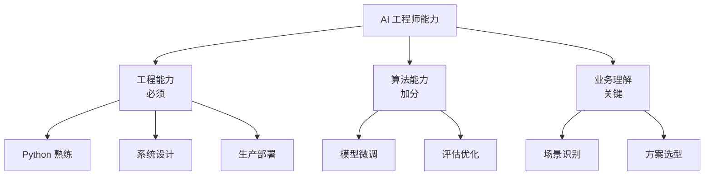
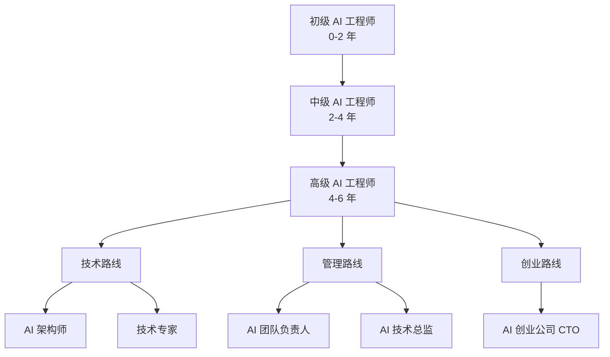

# AI 工程师求职指南：简历、面试与谈薪

## 市场现状

### 岗位分类

| 岗位 | 核心能力 | 薪资范围（北京/上海） |
|------|----------|----------------------|
| LLM 应用工程师 | Prompt 工程、RAG、Agent 开发 | 25-50K |
| AI 平台工程师 | LLMOps、推理优化、模型部署 | 30-60K |
| 算法工程师 | 模型训练、微调、评估 | 30-70K |
| AI 产品经理 | AI 产品设计、需求分析 | 25-45K |

### 能力矩阵



## 简历撰写

### 简历模板

```
姓名 | 电话 | 邮箱 | GitHub | 博客

--- 专业摘要 ---
3 年 LLM 应用开发经验，擅长 RAG 系统构建和 Agent 开发。
主导过企业知识库问答系统（日活 5000+）和智能客服系统。
熟悉 LangChain、vLLM、Milvus 等技术栈。

--- 核心技能 ---
- 编程语言：Python（精通）、TypeScript（熟练）
- AI 框架：LangChain、LlamaIndex、LangGraph
- 模型部署：vLLM、TensorRT-LLM、ONNX Runtime
- 向量数据库：Milvus、Pinecone、Weaviate
- 云平台：AWS（SageMaker、Bedrock）、阿里云（PAI）
- LLMOps：MLflow、Prometheus、Grafana

--- 工作经历 ---

XX 科技 | AI 工程师 | 2023.06 - 至今

- 主导企业知识库问答系统开发，服务日活 5000+ 用户
  - 设计 RAG 架构（BGE-M3 + Milvus + Qwen2.5），检索准确率 92%
  - 实现语义缓存，Token 成本降低 45%
  - 部署 vLLM 推理服务，P99 延迟 < 1.5s

- 开发多 Agent 智能客服系统，替代 30% 人工客服
  - 基于 LangGraph 实现 4 Agent 协作（路由/FAQ/业务/升级）
  - 客户满意度从 3.8 提升至 4.5（5 分制）
  - 平均响应时间从 45s 降至 8s

YY 公司 | 后端工程师 | 2021.07 - 2023.05

- 负责微服务架构设计，支撑日均 100 万 API 请求
- 实现 API 网关限流，系统可用性从 99.5% 提升至 99.99%

--- 项目经历 ---

企业知识库问答系统（开源）
- 技术栈：FastAPI + Milvus + LangChain + vLLM
- Star 800+，被 5 家公司采用
- GitHub: github.com/xxx/enterprise-kb

AI 代码审查工具
- 技术栈：AST 解析 + LLM 分析 + GitHub API
- 检测准确率 85%，已在团队内部使用
- GitHub: github.com/xxx/ai-code-reviewer

--- 教育背景 ---

XX 大学 | 计算机科学 | 硕士 | 2019 - 2021
XX 大学 | 软件工程 | 学士 | 2015 - 2019
```

### 简历要点

1. **量化成果**：用数字说话，"优化了性能" 不如 "P99 延迟从 3s 降至 1.2s"
2. **突出 AI 相关**：即使之前做后端，也要突出与 AI 交集的部分
3. **项目深度**：2-3 个深度项目比 10 个浅层项目更有说服力
4. **开源贡献**：有开源项目是加分项，说明技术热情和工程能力

## 面试准备

### 技术面试常见问题

#### LLM 基础

**Q: Transformer 的自注意力机制原理是什么？**

A: 自注意力通过 Query-Key-Value 三组矩阵计算注意力权重。对于输入序列的每个位置，用 Query 与所有 Key 做点积得到注意力分数，经过 Softmax 归一化后对 Value 加权求和。多头注意力则将 Q/K/V 分成多组并行计算，捕捉不同子空间的特征。计算复杂度为 O(n^2)，这是长上下文的主要瓶颈。

**Q: 什么是 KV Cache？为什么推理需要它？**

A: KV Cache 缓存已计算过的 Key 和 Value 矩阵。自回归生成时，每一步只需要计算新 Token 的 Query，与缓存的 KV 做注意力即可，避免重复计算。没有 KV Cache，生成长度为 N 的序列需要 O(N^3) 计算；有了 KV Cache 降为 O(N^2)。

#### RAG 相关

**Q: RAG 检索效果不好怎么优化？**

A: 分层排查：
1. **索引层**：分块策略是否合理（大小、重叠、结构感知）
2. **查询层**：查询是否需要改写、扩展或分解
3. **检索层**：向量模型是否适合、是否需要混合检索（向量 + BM25）
4. **重排层**：是否需要 Cross-Encoder 重排
5. **生成层**：Prompt 是否引导模型基于上下文回答

**Q: 向量检索和关键词检索各自的优势？**

A: 向量检索擅长语义匹配，能找到意思相近但用词不同的内容；关键词检索擅长精确匹配，对专有名词、术语、错误码等更可靠。生产环境通常使用混合检索，向量检索保证召回广度，关键词检索保证精确度。

#### Agent 相关

**Q: ReAct 和 Function Calling 的区别？**

A: ReAct 是思考-行动-观察的循环框架，模型自主决定何时调用工具、调用哪个工具；Function Calling 是模型输出结构化的工具调用请求，由系统执行后返回结果。ReAct 更灵活但更不可控，Function Calling 更可控但灵活性受限。实际项目中通常结合使用：用 Function Calling 定义可用工具，用 ReAct 控制推理流程。

#### 系统设计

**Q: 设计一个高可用的 LLM 推理服务。**

A:
1. **多模型路由**：根据请求复杂度路由到不同模型（GPT-4o-mini / GPT-4o）
2. **负载均衡**：多副本 vLLM 服务，基于队列深度动态路由
3. **缓存层**：语义缓存减少重复调用
4. **降级策略**：主模型不可用时切换备选模型
5. **限流熔断**：防止突发流量打垮服务
6. **监控告警**：TTFB、错误率、队列深度实时监控

### 系统设计题框架

```
1. 需求澄清（3 分钟）
   - 用户规模？QPS？延迟要求？
   - 核心功能？优先级？

2. 架构设计（10 分钟）
   - 整体架构图
   - 核心组件选型
   - 数据流设计

3. 深入讨论（10 分钟）
   - 瓶颈分析
   - 优化方案
   - 降级策略

4. 权衡讨论（5 分钟）
   - 成本 vs 性能
   - 一致性 vs 可用性
   - 通用 vs 定制
```

### 代码题常见类型

| 类型 | 示例 | 准备方向 |
|------|------|----------|
| RAG 实现 | 实现一个简单的 RAG 流程 | 向量检索 + Prompt 构建 |
| Agent 设计 | 设计一个有工具调用的 Agent | ReAct 循环 + Function Calling |
| 数据处理 | 清洗和格式化 SFT 数据 | 正则 + 数据验证 |
| API 设计 | 设计 LLM 服务 API | FastAPI + 异步 + 错误处理 |
| 评估脚本 | 实现模型评估流水线 | 指标计算 + 自动化 |

## 谈薪策略

### 薪资构成

```
总包 = 基础薪资 + 绩效奖金 + 股票/期权 + 签字费
```

### 谈薪原则

1. **锚定高值**：先报出预期薪资的上限，给谈判留空间
2. **总包视角**：不要只看月薪，股票和奖金也是总包的一部分
3. **竞品对比**：用其他 offer 作为谈判筹码
4. **延迟满足**：不要在第一轮就接受，表达需要考虑
5. **书面确认**：所有承诺必须落到书面

### 薪资谈判话术

```
面试官：你的期望薪资是多少？

回答：基于我的经验和市场行情，我的期望是 XX-YY 万。
     我更看重总包和长期发展空间。

面试官：这个范围超出了我们的预算。

回答：理解。那我们可以看看其他维度的补偿：
     - 签字费是否可以调整？
     - 股票授予是否可以增加？
     - 绩效奖金的比例？
     - 晋升评估周期能否缩短？

面试官：我们需要内部审批。

回答：好的，期待您的回复。同时我也有其他流程在进行中，
     如果可能的话希望在本周内得到反馈。
```

## 职业路径



### 技术深度 vs 广度

| 阶段 | 策略 | 重点 |
|------|------|------|
| 初级（0-2 年） | 广度优先 | 掌握 RAG、Agent、微调全流程 |
| 中级（2-4 年） | 一专多能 | 选一个方向深入（如推理优化），其他了解 |
| 高级（4-6 年） | 深度 + 架构 | 能做架构决策，带领团队解决难题 |

### 持续学习资源

| 类型 | 推荐 | 说明 |
|------|------|------|
| 论文 | ArXiv + Papers With Code | 跟踪最新研究 |
| 课程 | Stanford CS229/CS224N | 打牢基础 |
| 实践 | Kaggle + 开源项目 | 动手能力 |
| 社区 | 知乎 AI 专栏 + Twitter AI 圈 | 行业动态 |
| 源码 | vLLM / LangChain / transformers | 深入理解 |

## 面试检查清单

- [ ] 简历已更新，量化成果已标注
- [ ] 自我介绍练习（3 分钟版本）
- [ ] LLM 基础知识已复习（Transformer、注意力、KV Cache）
- [ ] RAG 流程能完整讲述
- [ ] Agent 设计模式已理解（ReAct、Plan-and-Execute）
- [ ] 至少 1 个项目能深入讲解（架构、难点、优化）
- [ ] 系统设计练习至少 3 题
- [ ] 代码题练习（RAG 实现、API 设计）
- [ ] 了解目标公司的 AI 业务和产品
- [ ] 准备 2-3 个问面试官的好问题
