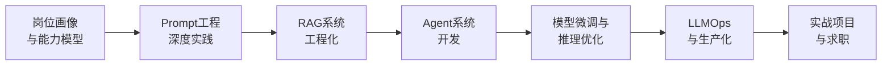

# AI 工程师专栏：从转型到胜任

基于 BOSS 直聘真实岗位要求，系统化构建 AI 工程师能力体系。不是泛泛而谈的"AI 入门"，而是一份**岗位对标、能力可量化、项目可落地**的转型路线图。

## 专栏定位

本专栏回答三个核心问题：

1. **AI 工程师到底要会什么？** -- 基于真实 JD 的岗位画像与能力模型
2. **我现在的水平够不够？** -- 技能差距分析与优先级排序
3. **怎么学到能上岗？** -- 从理论到实战的完整学习路径

## 学习路线

---

## 七大模块总览

### 模块一：岗位画像与能力模型

从 BOSS 直聘真实 JD 出发，拆解 AI 工程师的核心职责、技能要求与能力分层。

- [AI 工程师岗位全景：职责、要求与市场真相](01_岗位画像与能力模型/01_岗位全景与市场真相.md)
- [AI 工程师能力模型：五层技能栈](01_岗位画像与能力模型/02_能力模型与技能栈.md)
- [技能差距诊断：你的水平在哪个段位](01_岗位画像与能力模型/03_技能差距与优先级.md)

### 模块二：Prompt 工程深度实践

Prompt 工程是 AI 开发的基石，也是投入产出比最高的技能。

- [Prompt 工程体系：从写指令到上下文工程](02_Prompt工程深度实践/01_Prompt工程体系.md)
- [结构化输出与 JSON Schema 约束](02_Prompt工程深度实践/02_结构化输出与约束.md)
- [Prompt 版本管理与 A/B 测试](02_Prompt工程深度实践/03_Prompt版本管理与测试.md)
- [防幻觉与可靠性设计](02_Prompt工程深度实践/04_防幻觉与可靠性设计.md)

### 模块三：RAG 系统工程化

RAG 是企业 AI 落地的第一刚需，从 Naive RAG 到生产级 RAG 的完整路径。

- [RAG 架构演进：从朴素到生产](03_RAG系统工程化/01_RAG架构演进.md)
- [文档解析与智能分块策略](03_RAG系统工程化/02_文档解析与分块策略.md)
- [混合检索与重排序](03_RAG系统工程化/03_混合检索与重排序.md)
- [RAG 评估与迭代优化](03_RAG系统工程化/04_RAG评估与迭代.md)
- [Graph RAG 与知识图谱增强](03_RAG系统工程化/05_GraphRAG与知识图谱.md)

### 模块四：Agent 系统开发

从单 Agent 到多 Agent 协同，掌握 AI 系统的自主执行能力。

- [Agent 架构模式：ReAct / Plan-and-Execute / 反思](04_Agent系统开发/01_Agent架构模式.md)
- [Function Calling 与工具设计](04_Agent系统开发/02_FunctionCalling与工具设计.md)
- [记忆管理：工作记忆、情节记忆与语义记忆](04_Agent系统开发/03_记忆管理策略.md)
- [MCP 协议与工具生态](04_Agent系统开发/04_MCP协议与工具生态.md)
- [多 Agent 协同：编排、路由与监督](04_Agent系统开发/05_多Agent协同设计.md)

### 模块五：模型微调与推理优化

从 API 调用者进阶为模型工程师，掌握微调与推理加速的核心技术。

- [微调技术选型：LoRA / QLoRA / 全量微调](05_模型微调与推理优化/01_微调技术选型.md)
- [数据准备与 SFT 实战](05_模型微调与推理优化/02_数据准备与SFT实战.md)
- [推理优化：vLLM / TensorRT-LLM / 量化](05_模型微调与推理优化/03_推理优化实战.md)
- [模型评估与基准测试](05_模型微调与推理优化/04_模型评估与基准测试.md)

### 模块六：LLMOps 与生产化

让 AI 系统从 Demo 走向生产，掌握运维、监控与成本控制。

- [LLMOps 体系：评估、监控、版本管理](06_LLMOps与生产化/01_LLMOps体系.md)
- [成本优化：Token 经济学与缓存策略](06_LLMOps与生产化/02_成本优化策略.md)
- [安全与合规：Prompt 注入防护与审计](06_LLMOps与生产化/03_安全与合规.md)
- [容器化部署与 K8s 编排](06_LLMOps与生产化/04_容器化部署与编排.md)
- [可观测性：日志、链路追踪与指标体系](06_LLMOps与生产化/05_可观测性建设.md)

### 模块七：实战项目与求职

真实项目经验 + 求职策略，从学习到拿到 Offer。

- [项目一：企业知识库问答系统（端到端）](07_实战项目与求职/01_企业知识库项目.md)
- [项目二：多 Agent 智能客服系统](07_实战项目与求职/02_智能客服系统项目.md)
- [项目三：AI 辅助代码审查工具](07_实战项目与求职/03_AI代码审查项目.md)
- [AI 工程师求职指南：简历、面试与谈薪](07_实战项目与求职/04_求职指南.md)

---

::: tip 专栏特色
- **岗位驱动**：所有内容对标真实 JD 要求，学完即可对标岗位
- **实战优先**：每篇包含完整代码，可直接运行
- **渐进式**：从基础到架构，7 个模块层层递进
- **生产级**：不教你写 Demo，教你构建可上线的系统
:::
