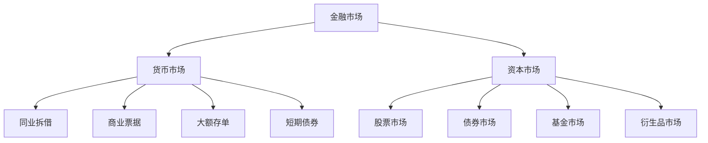
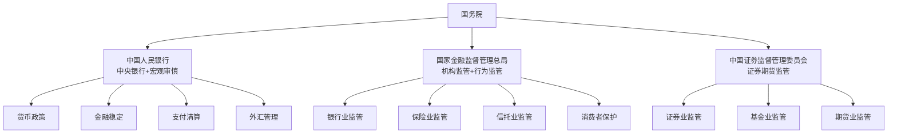
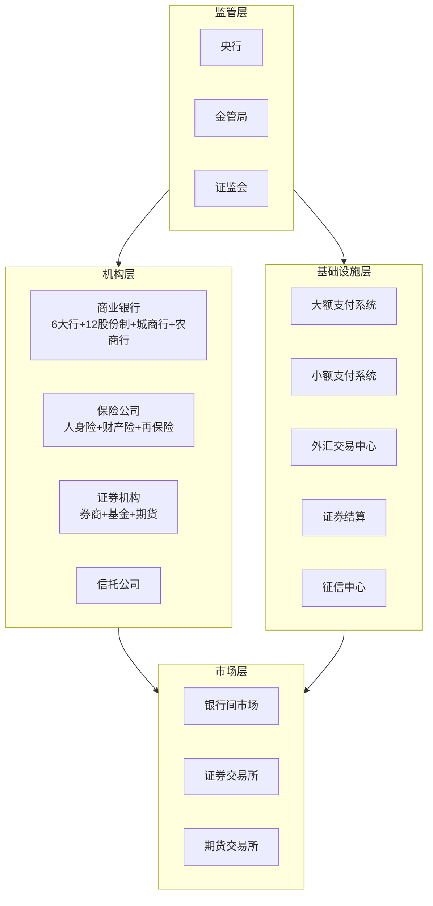
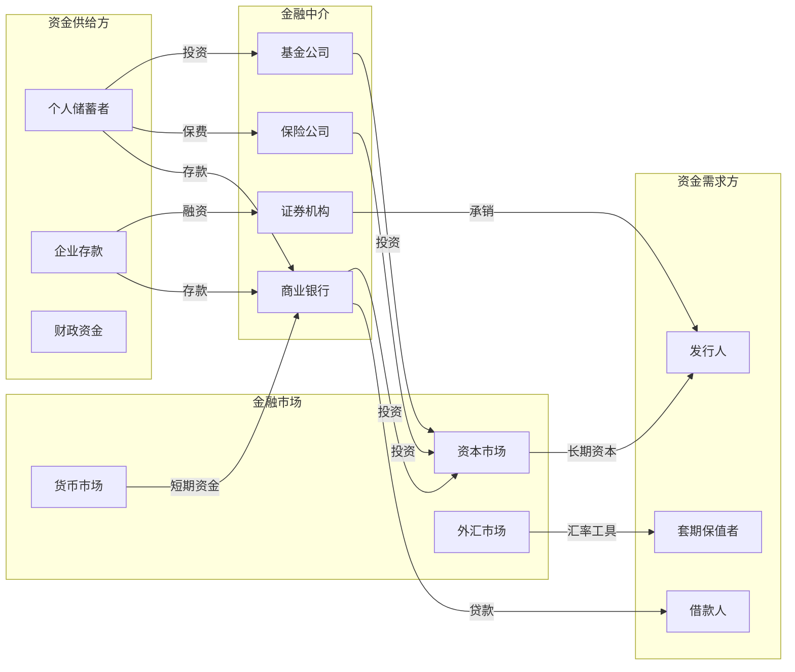
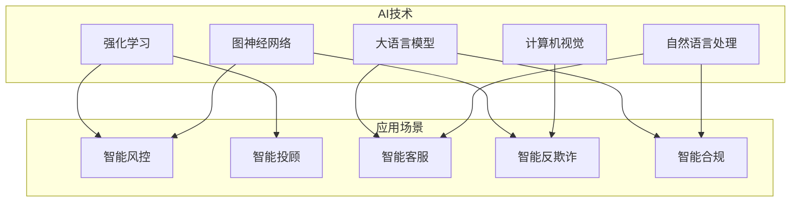

# 金融体系全景

## 金融体系概述

金融体系是现代经济的核心基础设施，通过资金的融通与配置，连接储蓄者与投资者，实现资源的最优分配。一个完整的金融体系由金融机构、金融市场、金融基础设施和监管框架四大部分构成。

## 金融体系组成

### 中央银行

中央银行是金融体系的中枢，承担货币发行、货币政策制定与执行、金融稳定维护和最后贷款人等核心职能。

| 职能 | 说明 |
|------|------|
| 货币发行 | 垄断法定货币发行权，调控货币供应量 |
| 货币政策 | 通过利率、存款准备金率、公开市场操作调节经济 |
| 金融稳定 | 防范系统性风险，维护金融体系稳健运行 |
| 最后贷款人 | 危机时刻向金融机构提供紧急流动性支持 |
| 支付清算 | 运营国家支付系统，保障资金流转安全 |
| 外汇管理 | 管理外汇储备，维护汇率稳定 |

### 商业银行

商业银行是金融体系中规模最大的机构类型，通过吸收存款和发放贷款实现信用创造。核心业务包括：

- **资产业务**：贷款、投资、同业拆放
- **负债业务**：存款、同业拆入、发行债券
- **中间业务**：支付结算、代理、担保承诺

### 投资机构

投资机构通过专业化的资产管理和投资运作，为投资者提供多元化的财富管理服务：

- **公募基金**：面向不特定投资者公开发行，受严格监管
- **私募基金**：面向合格投资者非公开募集，投资策略灵活
- **券商资管**：证券公司发行的资产管理计划
- **信托公司**：以信托方式管理财产，实现风险隔离
- **保险资管**：保险资金的专业化投资管理

### 保险机构

保险机构通过风险汇聚和分散机制，为经济社会提供风险保障：

- **人身险公司**：寿险、健康险、意外险
- **财产险公司**：车险、企财险、责任险
- **再保险公司**：为保险公司提供风险分散

### 监管机构

监管机构负责制定规则、实施监督、防范风险，保障金融体系安全稳健运行。

## 金融市场分类

### 按交易期限划分

### 货币市场

货币市场是短期资金融通的市场，交易期限通常在一年以内：

| 子市场 | 交易品种 | 期限 | 特点 |
|--------|----------|------|------|
| 同业拆借市场 | 银行间资金借贷 | 隔夜至1年 | 流动性最高 |
| 票据市场 | 商业汇票 | 1-6个月 | 具有真实贸易背景 |
| 大额存单市场 | 银行发行的可转让存单 | 1个月至1年 | 利率市场化 |
| 短期债券市场 | 国债、央行票据 | 1年以内 | 风险最低 |

### 资本市场

资本市场是长期资金配置的场所，交易期限在一年以上：

- **股票市场**：股权融资和交易的核心平台
- **债券市场**：固定收益类融资工具，包括国债、金融债、企业债
- **基金市场**：集合投资工具，分散风险

### 外汇市场

外汇市场是不同货币之间的兑换和交易市场：

- **即期外汇**：T+2交割的外汇交易
- **远期外汇**：约定未来日期和汇率交割
- **外汇掉期**：同时买入和卖出不同交割日的外汇
- **外汇期权**：以约定汇率买卖外汇的权利

### 衍生品市场

金融衍生品是基于基础资产的金融合约：

| 类型 | 说明 | 典型品种 |
|------|------|----------|
| 期货 | 标准化合约，交易所交易 | 股指期货、国债期货 |
| 期权 | 买方有权但无义务执行 | 看涨/看跌期权 |
| 远期 | 非标准化合约，场外交易 | 远期利率协议 |
| 互换 | 现金流交换协议 | 利率互换、货币互换 |

## 金融基础设施

金融基础设施是支撑金融交易和风险管理的底层系统与制度安排，是金融体系高效运转的技术和制度保障。

### 支付清算体系

支付清算体系是金融体系运行的"高速公路"：

- **大额支付系统**：处理大额贷记支付业务，实时全额结算(RTGS)
- **小额支付系统**：处理小额批量支付业务，净额结算
- **网上支付跨行清算系统**：支持网上支付等新兴支付业务
- **境内外币支付系统**：外币资金的跨行清算

### 征信体系

征信体系是金融信用风险管理的基础设施：

- **金融信用信息基础数据库**：由央行征信中心运营，覆盖个人和企业信贷信息
- **市场化征信机构**：百行征信、朴道征信等持牌机构
- **替代数据征信**：利用非信贷数据评估信用状况

### 金融信息服务

金融信息服务为市场参与者提供数据支撑：

- **金融数据终端**：Wind、同花顺iFinD等
- **金融信息交换标准**：FIX协议、ISO 20022
- **金融科技基础设施**：身份认证、电子签名、时间戳

## 中国金融体系结构

中国实行"一行一局一会"的金融监管架构，这一体制在2023年机构改革后正式确立：

### 各监管机构职责分工

| 机构 | 主要职责 | 监管对象 |
|------|----------|----------|
| 中国人民银行 | 货币政策、宏观审慎、支付清算、外汇管理 | 银行间市场、支付机构 |
| 国家金融监督管理总局 | 机构监管、行为监管、消费者保护 | 银行、保险、信托、资管 |
| 中国证监会 | 证券期货市场监管、投资者保护 | 证券公司、基金公司、期货公司 |

### 金融体系分层结构

## 金融生态参与者关系图

## 金融业务核心概念表

| 概念 | 定义 | 应用场景 |
|------|------|----------|
| 信用 | 偿还债务的能力和意愿 | 贷款审批、债券评级 |
| 杠杆 | 借入资金放大投资收益 | 融资融券、衍生品交易 |
| 流动性 | 资产快速变现的能力 | 银行流动性管理、市场交易 |
| 风险 | 未来收益的不确定性 | 风控建模、资本计提 |
| 利率 | 资金使用价格 | 存贷款定价、债券估值 |
| 汇率 | 不同货币间的兑换比率 | 跨境贸易、外汇交易 |
| 期限错配 | 资产负债到期时间不一致 | 银行利率风险、流动性风险 |
| 信用利差 | 信用债与无风险利率之差 | 信用风险评估、债券定价 |
| 资本充足率 | 资本与风险加权资产之比 | 银行监管、风险管理 |
| 净值 | 资产减负债 | 基金估值、企业财务 |

## 金融科技演进

金融科技的发展经历了三个主要阶段，每个阶段的技术特征和应用深度显著不同：

### 信息化阶段（2000-2010）

- 核心系统电子化：银行核心系统从手工记账转向电子化处理
- 网上银行兴起：用户通过互联网办理银行业务
- 交易系统自动化：证券交易从人工喊价转向电子撮合
- 数据集中处理：各机构建设数据中心实现数据集中管理

### 数字化阶段（2010-2020）

- 移动支付普及：支付宝、微信支付改变支付格局
- 线上业务拓展：直销银行、互联网保险等新型业态出现
- 大数据风控：利用多源数据构建风控模型
- 开放银行：API化输出金融服务能力
- 数字货币探索：DCEP/数字人民币研发试点

### 智能化阶段（2020-至今）

智能化阶段的核心特征：

| 特征 | 说明 | 典型应用 |
|------|------|----------|
| 实时决策 | 毫秒级风险判断 | 交易反欺诈、实时授信 |
| 自动化运营 | 流程自动化减少人工 | 智能审批、自动合规检查 |
| 个性化服务 | 精准画像与推荐 | 智能投顾、差异化定价 |
| 知识提取 | 非结构化数据价值挖掘 | 合同审查、监管文件解析 |
| 联邦协作 | 数据不出域的联合建模 | 跨机构风控模型训练 |

## 金融AI的机遇与挑战

### 机遇

- **效率提升**：自动化处理大量重复性工作，降低运营成本
- **风险识别**：利用多维数据和多模型融合提升风险识别准确率
- **合规保障**：自动化合规检查和报告，降低合规成本
- **普惠金融**：通过替代数据为传统金融难以覆盖的人群提供金融服务

### 挑战

- **数据安全**：金融数据敏感性高，需严格保护用户隐私
- **模型可解释性**：金融监管要求模型决策可解释，黑箱模型应用受限
- **公平性**：算法偏见可能导致对特定群体的歧视
- **系统稳定性**：AI系统的可靠性和鲁棒性直接影响金融稳定
- **监管适应性**：监管框架需要跟上技术创新的步伐

## 小结

金融体系是一个复杂而精密的系统，由多元化的金融机构、多层次的金融市场、完善的基础设施和严格的监管框架共同构成。理解金融体系的全景结构，是构建金融AI应用的基础。在后续章节中，我们将深入各个金融子行业，了解其业务逻辑和技术需求，为金融AI的落地实践奠定知识基础。
